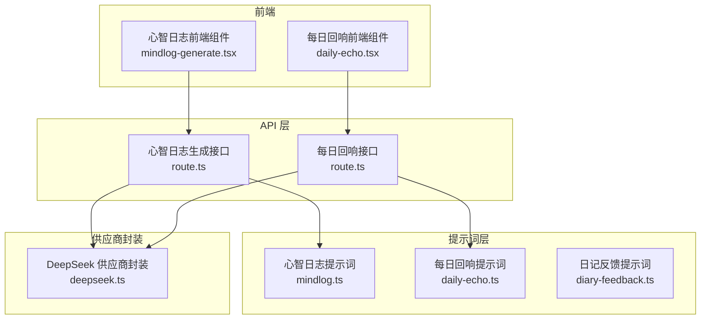
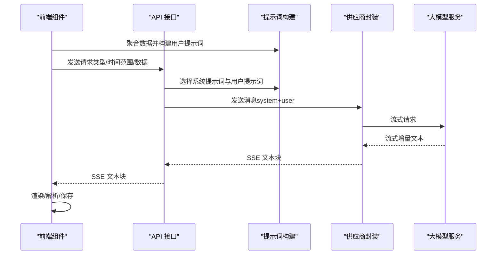
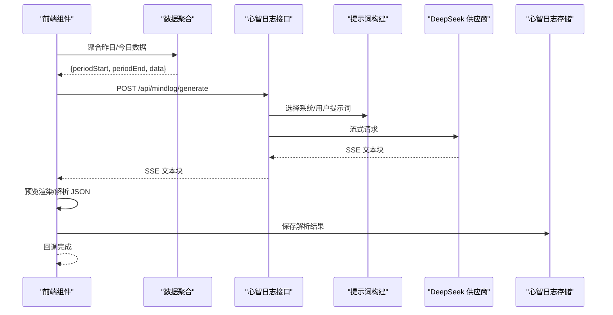
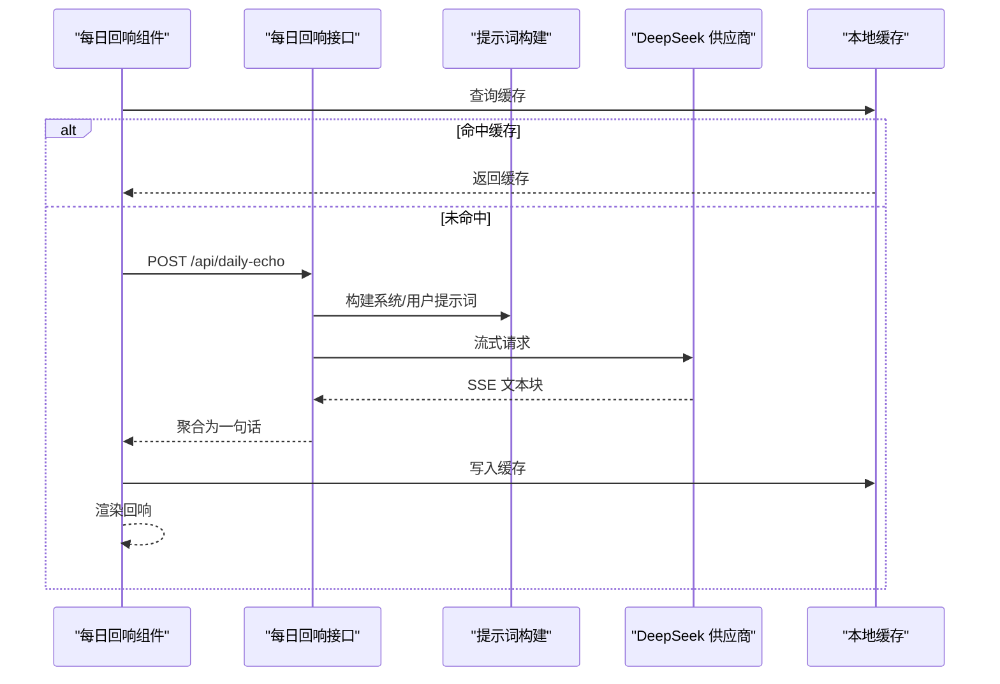
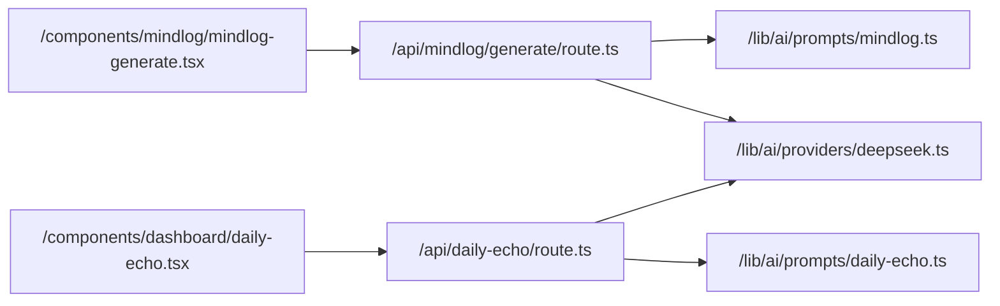

# AI 提示词工程

<cite>
**本文引用的文件**
- [mindlog 生成接口 route.ts](file://src/app/api/mindlog/generate/route.ts)
- [每日回响接口 route.ts](file://src/app/api/daily-echo/route.ts)
- [DeepSeek 供应商封装 deepseek.ts](file://src/lib/ai/providers/deepseek.ts)
- [心智日志提示词 mindlog.ts](file://src/lib/ai/prompts/mindlog.ts)
- [每日回响提示词 daily-echo.ts](file://src/lib/ai/prompts/daily-echo.ts)
- [日记反馈提示词 diary-feedback.ts](file://src/lib/ai/prompts/diary-feedback.ts)
- [心智日志前端组件 mindlog-generate.tsx](file://src/components/mindlog/mindlog-generate.tsx)
- [每日回响前端组件 daily-echo.tsx](file://src/components/dashboard/daily-echo.tsx)
</cite>

## 目录
1. [简介](#简介)
2. [项目结构](#项目结构)
3. [核心组件](#核心组件)
4. [架构总览](#架构总览)
5. [详细组件分析](#详细组件分析)
6. [依赖关系分析](#依赖关系分析)
7. [性能考量](#性能考量)
8. [故障排查指南](#故障排查指南)
9. [结论](#结论)
10. [附录](#附录)

## 简介
本文件系统化梳理了本项目的 AI 提示词工程实践，覆盖提示词设计原则、上下文构建、指令清晰度与输出格式控制，以及面向不同任务类型的提示词模板（心智日志生成、每日回响分析、日记反馈等）。同时提供版本管理、A/B 测试与效果评估方法论，以及调试技巧、常见问题与多语言支持、个性化定制、动态提示词生成的实现思路。

## 项目结构
项目采用前后端分离的 Next.js 应用结构，AI 相关逻辑主要分布在以下模块：
- API 层：负责接收请求、构造提示词、调用大模型、返回流式/非流式响应
- 提示词层：集中定义系统提示词与用户提示词构建函数
- 供应商封装：统一模型提供商接入与流式处理
- 前端组件：负责数据聚合、流式渲染、错误处理与本地缓存

图表来源
- [mindlog 生成接口 route.ts:1-107](file://src/app/api/mindlog/generate/route.ts#L1-L107)
- [每日回响接口 route.ts:1-72](file://src/app/api/daily-echo/route.ts#L1-L72)
- [DeepSeek 供应商封装 deepseek.ts:1-58](file://src/lib/ai/providers/deepseek.ts#L1-L58)
- [心智日志提示词 mindlog.ts:1-190](file://src/lib/ai/prompts/mindlog.ts#L1-L190)
- [每日回响提示词 daily-echo.ts:1-39](file://src/lib/ai/prompts/daily-echo.ts#L1-L39)
- [日记反馈提示词 diary-feedback.ts:1-38](file://src/lib/ai/prompts/diary-feedback.ts#L1-L38)
- [心智日志前端组件 mindlog-generate.tsx:1-436](file://src/components/mindlog/mindlog-generate.tsx#L1-L436)
- [每日回响前端组件 daily-echo.tsx:1-114](file://src/components/dashboard/daily-echo.tsx#L1-L114)

章节来源
- [mindlog 生成接口 route.ts:1-107](file://src/app/api/mindlog/generate/route.ts#L1-L107)
- [每日回响接口 route.ts:1-72](file://src/app/api/daily-echo/route.ts#L1-L72)
- [DeepSeek 供应商封装 deepseek.ts:1-58](file://src/lib/ai/providers/deepseek.ts#L1-L58)
- [心智日志提示词 mindlog.ts:1-190](file://src/lib/ai/prompts/mindlog.ts#L1-L190)
- [每日回响提示词 daily-echo.ts:1-39](file://src/lib/ai/prompts/daily-echo.ts#L1-L39)
- [日记反馈提示词 diary-feedback.ts:1-38](file://src/lib/ai/prompts/diary-feedback.ts#L1-L38)
- [心智日志前端组件 mindlog-generate.tsx:1-436](file://src/components/mindlog/mindlog-generate.tsx#L1-L436)
- [每日回响前端组件 daily-echo.tsx:1-114](file://src/components/dashboard/daily-echo.tsx#L1-L114)

## 核心组件
- 提示词模板与构建函数：集中于提示词文件，分别定义系统提示词与用户提示词构建函数，确保输出结构与格式可控
- 供应商封装：统一流式接口与错误处理，屏蔽模型提供商差异
- API 接口：负责参数校验、提示词构建、调用供应商、流式返回
- 前端组件：负责数据聚合、流式渲染、错误提示与本地缓存

章节来源
- [心智日志提示词 mindlog.ts:1-190](file://src/lib/ai/prompts/mindlog.ts#L1-L190)
- [每日回响提示词 daily-echo.ts:1-39](file://src/lib/ai/prompts/daily-echo.ts#L1-L39)
- [日记反馈提示词 diary-feedback.ts:1-38](file://src/lib/ai/prompts/diary-feedback.ts#L1-L38)
- [DeepSeek 供应商封装 deepseek.ts:1-58](file://src/lib/ai/providers/deepseek.ts#L1-L58)
- [mindlog 生成接口 route.ts:1-107](file://src/app/api/mindlog/generate/route.ts#L1-L107)
- [每日回响接口 route.ts:1-72](file://src/app/api/daily-echo/route.ts#L1-L72)
- [心智日志前端组件 mindlog-generate.tsx:1-436](file://src/components/mindlog/mindlog-generate.tsx#L1-L436)
- [每日回响前端组件 daily-echo.tsx:1-114](file://src/components/dashboard/daily-echo.tsx#L1-L114)

## 架构总览
整体流程：前端组件聚合数据 → 构造提示词 → 调用 API → 供应商封装 → 大模型 → 流式返回 → 前端渲染/保存

图表来源
- [心智日志前端组件 mindlog-generate.tsx:35-123](file://src/components/mindlog/mindlog-generate.tsx#L35-L123)
- [mindlog 生成接口 route.ts:22-106](file://src/app/api/mindlog/generate/route.ts#L22-L106)
- [DeepSeek 供应商封装 deepseek.ts:15-57](file://src/lib/ai/providers/deepseek.ts#L15-L57)
- [心智日志提示词 mindlog.ts:97-102](file://src/lib/ai/prompts/mindlog.ts#L97-L102)

## 详细组件分析

### 心智日志生成（每日/每周/每月）
- 设计原则
  - 上下文构建：按天/周/月聚合日记、知识库操作与创作记录，确保信息完整
  - 指令清晰度：明确输出结构与字段，避免模糊填充
  - 输出格式控制：严格要求 JSON 输出，便于前端解析与存储
- 提示词模板
  - 系统提示词：角色定位、口吻与禁止项、输出合法性要求
  - 用户提示词：按周期拼接日记、知识库与创作记录，附统计信息
- API 行为
  - 根据类型选择模型与密钥
  - 使用 SSE 流式返回，前端增量渲染
  - 最终解析 JSON 并保存至心智日志存储
- 前端行为
  - 自动聚合昨日/今日数据，回退策略保证可用性
  - 流式展示预览，解析完成后保存并回调完成

图表来源
- [心智日志前端组件 mindlog-generate.tsx:35-123](file://src/components/mindlog/mindlog-generate.tsx#L35-L123)
- [mindlog 生成接口 route.ts:22-106](file://src/app/api/mindlog/generate/route.ts#L22-L106)
- [心智日志提示词 mindlog.ts:97-102](file://src/lib/ai/prompts/mindlog.ts#L97-L102)

章节来源
- [心智日志提示词 mindlog.ts:28-190](file://src/lib/ai/prompts/mindlog.ts#L28-L190)
- [mindlog 生成接口 route.ts:15-107](file://src/app/api/mindlog/generate/route.ts#L15-L107)
- [心智日志前端组件 mindlog-generate.tsx:17-180](file://src/components/mindlog/mindlog-generate.tsx#L17-L180)

### 每日回响分析
- 设计原则
  - 严选优先：优先选择有情感、有反思、有画面感的原句
  - 禁止项：排除事件记录、说明性文字、套话与中性陈述
  - 输出约束：只输出一句话，不加引号、不加前缀
- 提示词模板
  - 系统提示词：定义“回响官”角色与筛选规则
  - 用户提示词：拼接今日日记，要求按规则精选
- API 行为
  - 使用供应商封装进行流式调用，内部聚合为最终一句话
  - 去除引号与前缀，兜底返回预置语句
- 前端行为
  - 本地缓存：按日期+内容哈希缓存，减少调用成本

图表来源
- [每日回响前端组件 daily-echo.tsx:20-95](file://src/components/dashboard/daily-echo.tsx#L20-L95)
- [每日回响接口 route.ts:14-71](file://src/app/api/daily-echo/route.ts#L14-L71)
- [每日回响提示词 daily-echo.ts:6-39](file://src/lib/ai/prompts/daily-echo.ts#L6-L39)
- [DeepSeek 供应商封装 deepseek.ts:15-57](file://src/lib/ai/providers/deepseek.ts#L15-L57)

章节来源
- [每日回响提示词 daily-echo.ts:1-39](file://src/lib/ai/prompts/daily-echo.ts#L1-L39)
- [每日回响接口 route.ts:1-72](file://src/app/api/daily-echo/route.ts#L1-L72)
- [每日回响前端组件 daily-echo.tsx:1-114](file://src/components/dashboard/daily-echo.tsx#L1-L114)

### 日记反馈（未来自传体回信）
- 设计原则
  - 角色沉浸：来自未来的自己，语气自然、不剧透
  - 输出结构：纯 JSON，包含回信、情绪标签与主题标签
- 提示词模板
  - 系统提示词：角色设定、写作方式、输出约束
  - 用户提示词：可选情绪标签 + 日记原文

章节来源
- [日记反馈提示词 diary-feedback.ts:1-38](file://src/lib/ai/prompts/diary-feedback.ts#L1-L38)

### 提示词数据结构与复杂度
- 心智日志数据结构（每日/每周/每月）
  - 每日：日期、日记数组（含内容、情绪标签、创建时间）、知识库操作数组、创作文章列表
  - 每周：周起止、日记数量、知识库操作数量、每日 MindLog 数组
  - 每月：月份、周 MindLog 数组、日记数量、知识库操作数量、创作数量
- 复杂度分析
  - 数据聚合：按天/周/月过滤与统计，时间复杂度 O(n)，n 为日记/知识条目数
  - 用户提示词拼接：线性拼接，时间复杂度 O(m)，m 为条目数量
  - JSON 解析：前端解析与清洗，时间复杂度近似 O(k)，k 为输出长度

章节来源
- [心智日志提示词 mindlog.ts:3-24](file://src/lib/ai/prompts/mindlog.ts#L3-L24)

### 提示词版本管理、A/B 测试与效果评估
- 版本管理
  - 将提示词拆分为独立文件，按任务类型命名（如 mindlog.ts、daily-echo.ts），便于追踪变更
  - 在系统提示词中加入版本注释或时间戳，便于审计
- A/B 测试
  - 通过环境变量或配置开关切换不同系统提示词或用户提示词构建函数
  - 为每组提示词分配实验标识，记录调用次数、成功率、解析成功率与用户反馈
- 效果评估
  - 关键指标：输出 JSON 合法性、内容质量评分、用户点击/收藏行为、留存影响
  - 方法：对照组（当前）vs 实验组（新提示词），统计显著性差异

[本节为通用方法论，无需特定文件引用]

### 调试技巧与常见问题
- 调试技巧
  - 前端：开启网络面板观察 SSE 流，打印解析前的原始文本，逐步缩小问题范围
  - 后端：增加日志记录提示词片段与模型返回片段，区分“构造错误”与“模型输出异常”
  - 供应商封装：捕获并上报流式错误，确保前端能收到 error 事件
- 常见问题
  - 输出非 JSON：前端解析失败，需检查系统提示词是否强制 JSON 输出
  - 流式中断：网络波动导致中断，前端应具备重试与恢复能力
  - 缓存命中异常：本地缓存失效或跨设备不一致，建议引入版本号或 TTL

章节来源
- [心智日志前端组件 mindlog-generate.tsx:118-123](file://src/components/mindlog/mindlog-generate.tsx#L118-L123)
- [每日回响前端组件 daily-echo.tsx:50-62](file://src/components/dashboard/daily-echo.tsx#L50-L62)
- [mindlog 生成接口 route.ts:89-95](file://src/app/api/mindlog/generate/route.ts#L89-L95)
- [DeepSeek 供应商封装 deepseek.ts:48-52](file://src/lib/ai/providers/deepseek.ts#L48-L52)

### 多语言支持、个性化定制与动态提示词生成
- 多语言支持
  - 将提示词按语言拆分，运行时根据用户语言选择对应版本
  - 对输出格式约束（如 JSON 字段名）保持稳定，避免翻译导致的解析失败
- 个性化定制
  - 引入用户偏好设置（如情绪标签、主题标签），在用户提示词中注入个性化上下文
  - 支持用户自定义“回响官”风格或“未来自己”的语气，通过可配置参数驱动
- 动态提示词生成
  - 基于历史交互与效果指标，动态调整系统提示词权重或用户提示词模板
  - 通过 A/B 测试框架，对提示词模板进行在线 A/B，自动选择最优模板

[本节为通用方法论，无需特定文件引用]

## 依赖关系分析

图表来源
- [mindlog 生成接口 route.ts:1-107](file://src/app/api/mindlog/generate/route.ts#L1-L107)
- [每日回响接口 route.ts:1-72](file://src/app/api/daily-echo/route.ts#L1-L72)
- [DeepSeek 供应商封装 deepseek.ts:1-58](file://src/lib/ai/providers/deepseek.ts#L1-L58)
- [心智日志提示词 mindlog.ts:1-190](file://src/lib/ai/prompts/mindlog.ts#L1-L190)
- [每日回响提示词 daily-echo.ts:1-39](file://src/lib/ai/prompts/daily-echo.ts#L1-L39)
- [心智日志前端组件 mindlog-generate.tsx:1-436](file://src/components/mindlog/mindlog-generate.tsx#L1-L436)
- [每日回响前端组件 daily-echo.tsx:1-114](file://src/components/dashboard/daily-echo.tsx#L1-L114)

章节来源
- [mindlog 生成接口 route.ts:1-107](file://src/app/api/mindlog/generate/route.ts#L1-L107)
- [每日回响接口 route.ts:1-72](file://src/app/api/daily-echo/route.ts#L1-L72)
- [DeepSeek 供应商封装 deepseek.ts:1-58](file://src/lib/ai/providers/deepseek.ts#L1-L58)
- [心智日志提示词 mindlog.ts:1-190](file://src/lib/ai/prompts/mindlog.ts#L1-L190)
- [每日回响提示词 daily-echo.ts:1-39](file://src/lib/ai/prompts/daily-echo.ts#L1-L39)
- [心智日志前端组件 mindlog-generate.tsx:1-436](file://src/components/mindlog/mindlog-generate.tsx#L1-L436)
- [每日回响前端组件 daily-echo.tsx:1-114](file://src/components/dashboard/daily-echo.tsx#L1-L114)

## 性能考量
- 流式传输：使用 SSE 减少等待时间，前端增量渲染提升体验
- 缓存策略：每日回响按日期+内容哈希缓存，降低调用与成本
- 数据聚合：限制查询范围（如最近 N 天/周），避免全量扫描
- 模型选择：根据任务复杂度选择合适模型，平衡成本与质量

[本节提供通用指导，无需特定文件引用]

## 故障排查指南
- SSE 流解析失败
  - 现象：前端无法渲染或报错
  - 排查：确认后端是否正确发送 data: 块，前端是否正确分割与解析
- JSON 解析异常
  - 现象：保存失败或字段缺失
  - 排查：检查系统提示词是否强制 JSON 输出，前端清洗逻辑是否正确
- 供应商错误
  - 现象：流中断或报错
  - 排查：查看供应商封装的错误上报，确认 API Key 与模型可用性
- 缓存未命中
  - 现象：重复调用 AI
  - 排查：确认缓存键生成逻辑与存储可用性

章节来源
- [心智日志前端组件 mindlog-generate.tsx:72-93](file://src/components/mindlog/mindlog-generate.tsx#L72-L93)
- [每日回响前端组件 daily-echo.tsx:50-62](file://src/components/dashboard/daily-echo.tsx#L50-L62)
- [mindlog 生成接口 route.ts:89-95](file://src/app/api/mindlog/generate/route.ts#L89-L95)
- [DeepSeek 供应商封装 deepseek.ts:48-52](file://src/lib/ai/providers/deepseek.ts#L48-L52)

## 结论
本项目在提示词工程方面形成了清晰的职责划分与可复用模板：通过系统提示词约束角色与输出格式，通过用户提示词构建高质量上下文，通过供应商封装与 API 接口实现稳定的流式交互，前端组件负责数据聚合与用户体验优化。建议在此基础上持续完善版本管理、A/B 测试与效果评估体系，并扩展多语言与个性化能力，以支撑更广泛的 AI 应用场景。

## 附录
- 提示词设计清单
  - 明确角色与边界
  - 清晰指令与禁止项
  - 严格的输出格式约束
  - 上下文完整性与代表性
- 前端渲染要点
  - 增量渲染与骨架屏
  - 错误与兜底文案
  - 本地缓存与一致性
- 后端稳定性要点
  - 流式错误捕获与上报
  - 请求超时与重试策略
  - 日志与可观测性

[本节为通用指导，无需特定文件引用]