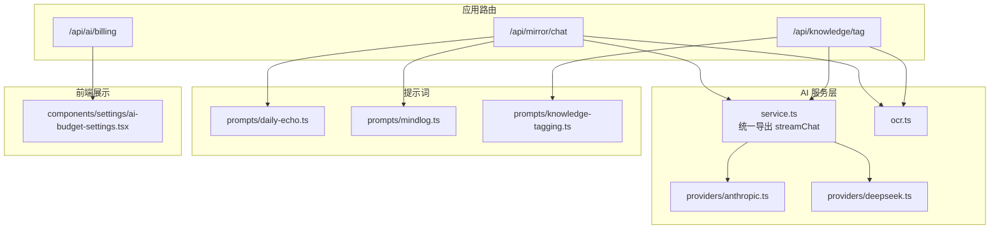
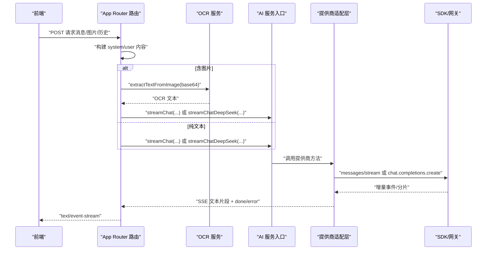
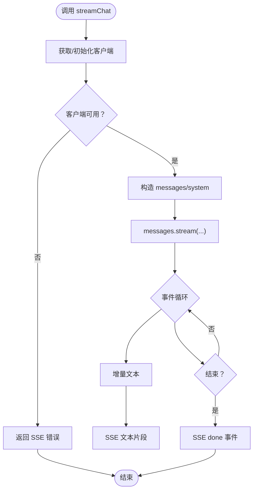
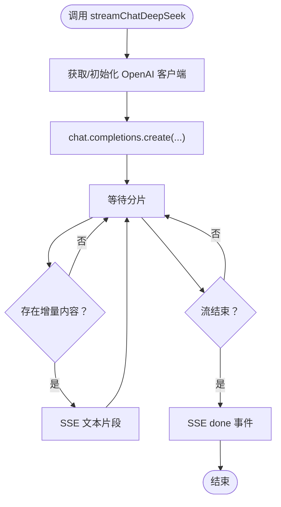
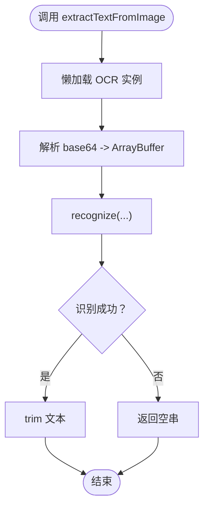
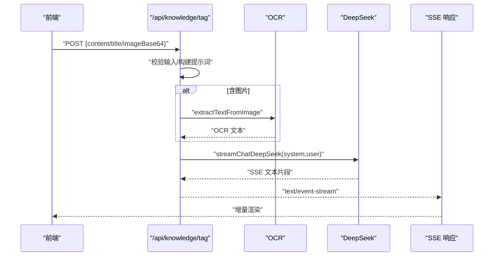
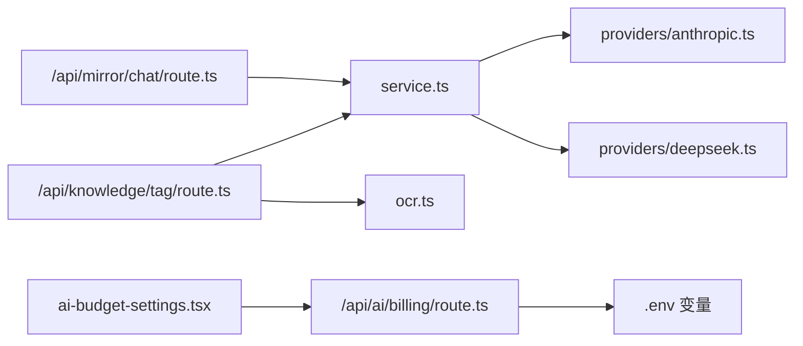

# AI 服务提供商

<cite>
**本文引用的文件**
- [src/lib/ai/providers/anthropic.ts](file://src/lib/ai/providers/anthropic.ts)
- [src/lib/ai/providers/deepseek.ts](file://src/lib/ai/providers/deepseek.ts)
- [src/lib/ai/service.ts](file://src/lib/ai/service.ts)
- [src/lib/ai/ocr.ts](file://src/lib/ai/ocr.ts)
- [src/app/api/ai/billing/route.ts](file://src/app/api/ai/billing/route.ts)
- [src/app/api/mirror/chat/route.ts](file://src/app/api/mirror/chat/route.ts)
- [src/app/api/knowledge/tag/route.ts](file://src/app/api/knowledge/tag/route.ts)
- [src/components/settings/ai-budget-settings.tsx](file://src/components/settings/ai-budget-settings.tsx)
- [src/lib/db/migrations/meta/0000_snapshot.json](file://src/lib/db/migrations/meta/0000_snapshot.json)
- [src/lib/ai/prompts/daily-echo.ts](file://src/lib/ai/prompts/daily-echo.ts)
- [src/lib/ai/prompts/mindlog.ts](file://src/lib/ai/prompts/mindlog.ts)
- [src/lib/ai/prompts/knowledge-tagging.ts](file://src/lib/ai/prompts/knowledge-tagging.ts)
- [pnpm-lock.yaml](file://pnpm-lock.yaml)
</cite>

## 目录
1. [简介](#简介)
2. [项目结构](#项目结构)
3. [核心组件](#核心组件)
4. [架构总览](#架构总览)
5. [详细组件分析](#详细组件分析)
6. [依赖关系分析](#依赖关系分析)
7. [性能考量](#性能考量)
8. [故障排查指南](#故障排查指南)
9. [结论](#结论)
10. [附录](#附录)

## 简介
本文件面向“AI 服务提供商”模块，系统梳理并解释项目中对多家 AI 提供商的集成实现，重点覆盖：
- OpenAI 兼容通道（DeepSeek）与 Anthropic Claude 的对接方式、认证机制与配置参数
- 统一的流式响应封装与错误处理机制
- 提示词工程与多模态（图像 OCR）处理策略
- 使用示例与最佳实践，以及成本与性能分析思路

该模块采用“按需懒加载客户端 + 流式 SSE 返回”的设计，支持在镜像对话、知识打标等场景中灵活切换与降级。

## 项目结构
AI 相关代码主要分布在以下位置：
- 提供商适配层：src/lib/ai/providers
- 通用服务入口：src/lib/ai/service.ts
- 多模态 OCR：src/lib/ai/ocr.ts
- 提示词模板：src/lib/ai/prompts/*
- API 路由：src/app/api/*/route.ts
- 成本查询与前端展示：src/app/api/ai/billing/route.ts 与 src/components/settings/ai-budget-settings.tsx
- 数据库迁移（含首选提供商与预算字段）：src/lib/db/migrations/meta/0000_snapshot.json

图表来源
- [src/app/api/mirror/chat/route.ts:1-64](file://src/app/api/mirror/chat/route.ts#L1-L64)
- [src/app/api/knowledge/tag/route.ts:1-36](file://src/app/api/knowledge/tag/route.ts#L1-L36)
- [src/app/api/ai/billing/route.ts:1-40](file://src/app/api/ai/billing/route.ts#L1-L40)
- [src/lib/ai/service.ts:1-6](file://src/lib/ai/service.ts#L1-L6)
- [src/lib/ai/providers/anthropic.ts:1-80](file://src/lib/ai/providers/anthropic.ts#L1-L80)
- [src/lib/ai/providers/deepseek.ts:1-58](file://src/lib/ai/providers/deepseek.ts#L1-L58)
- [src/lib/ai/ocr.ts:1-91](file://src/lib/ai/ocr.ts#L1-L91)
- [src/lib/ai/prompts/daily-echo.ts:1-39](file://src/lib/ai/prompts/daily-echo.ts#L1-L39)
- [src/lib/ai/prompts/mindlog.ts:1-191](file://src/lib/ai/prompts/mindlog.ts#L1-L191)
- [src/lib/ai/prompts/knowledge-tagging.ts:1-40](file://src/lib/ai/prompts/knowledge-tagging.ts#L1-L40)
- [src/components/settings/ai-budget-settings.tsx:1-64](file://src/components/settings/ai-budget-settings.tsx#L1-L64)

章节来源
- [src/lib/ai/providers/anthropic.ts:1-80](file://src/lib/ai/providers/anthropic.ts#L1-L80)
- [src/lib/ai/providers/deepseek.ts:1-58](file://src/lib/ai/providers/deepseek.ts#L1-L58)
- [src/lib/ai/service.ts:1-6](file://src/lib/ai/service.ts#L1-L6)
- [src/lib/ai/ocr.ts:1-91](file://src/lib/ai/ocr.ts#L1-L91)
- [src/app/api/mirror/chat/route.ts:1-64](file://src/app/api/mirror/chat/route.ts#L1-L64)
- [src/app/api/knowledge/tag/route.ts:1-36](file://src/app/api/knowledge/tag/route.ts#L1-L36)
- [src/app/api/ai/billing/route.ts:1-40](file://src/app/api/ai/billing/route.ts#L1-L40)
- [src/components/settings/ai-budget-settings.tsx:1-64](file://src/components/settings/ai-budget-settings.tsx#L1-L64)
- [src/lib/db/migrations/meta/0000_snapshot.json:574-594](file://src/lib/db/migrations/meta/0000_snapshot.json#L574-L594)

## 核心组件
- 提供商适配层
  - Anthropic Claude：通过官方 SDK 初始化客户端，支持系统提示与消息流式返回，内置配置校验与错误编码。
  - DeepSeek（OpenAI 兼容）：通过 OpenAI SDK 连接兼容网关，封装流式聊天接口，支持文本与图片混合输入。
- 通用服务入口
  - service.ts 当前导出 Anthropic 的 streamChat，便于后续扩展其他提供商。
- 多模态 OCR
  - 使用 ppu-paddle-ocr 在本地进行中文识别，避免外部视觉 API 依赖，支持 base64 输入与结果缓存。
- API 路由
  - 镜像对话：支持纯文本与图片（OCR 后）两种输入路径，统一走 DeepSeek 流式返回。
  - 知识打标：先 OCR 提取图片文字，再用 DeepSeek 生成结构化标签。
  - 成本查询：封装 DeepSeek 余额查询端点，前端展示心智点数使用情况。
- 提示词工程
  - 包含“每日回响”“心智日志”“知识打标”等模板，明确输出结构与约束，提升生成稳定性。

章节来源
- [src/lib/ai/providers/anthropic.ts:1-80](file://src/lib/ai/providers/anthropic.ts#L1-L80)
- [src/lib/ai/providers/deepseek.ts:1-58](file://src/lib/ai/providers/deepseek.ts#L1-L58)
- [src/lib/ai/service.ts:1-6](file://src/lib/ai/service.ts#L1-L6)
- [src/lib/ai/ocr.ts:1-91](file://src/lib/ai/ocr.ts#L1-L91)
- [src/app/api/mirror/chat/route.ts:1-64](file://src/app/api/mirror/chat/route.ts#L1-L64)
- [src/app/api/knowledge/tag/route.ts:1-36](file://src/app/api/knowledge/tag/route.ts#L1-L36)
- [src/app/api/ai/billing/route.ts:1-40](file://src/app/api/ai/billing/route.ts#L1-L40)
- [src/lib/ai/prompts/daily-echo.ts:1-39](file://src/lib/ai/prompts/daily-echo.ts#L1-L39)
- [src/lib/ai/prompts/mindlog.ts:1-191](file://src/lib/ai/prompts/mindlog.ts#L1-L191)
- [src/lib/ai/prompts/knowledge-tagging.ts:1-40](file://src/lib/ai/prompts/knowledge-tagging.ts#L1-L40)

## 架构总览
整体交互链路如下：
- 前端请求进入 Next.js App Router 路由
- 路由根据输入类型（文本/图片）决定是否调用 OCR
- 通过统一服务入口调用对应提供商的流式接口
- 将提供商返回的增量文本封装为 SSE 流返回前端

图表来源
- [src/app/api/mirror/chat/route.ts:1-64](file://src/app/api/mirror/chat/route.ts#L1-L64)
- [src/lib/ai/ocr.ts:1-91](file://src/lib/ai/ocr.ts#L1-L91)
- [src/lib/ai/service.ts:1-6](file://src/lib/ai/service.ts#L1-L6)
- [src/lib/ai/providers/anthropic.ts:1-80](file://src/lib/ai/providers/anthropic.ts#L1-L80)
- [src/lib/ai/providers/deepseek.ts:1-58](file://src/lib/ai/providers/deepseek.ts#L1-L58)

## 详细组件分析

### 组件 A：Anthropic Claude 适配
- 认证与配置
  - 通过环境变量 ANTHROPIC_API_KEY 初始化客户端；若未配置则抛错并以 SSE 错误形式返回。
  - 支持通过 ANTHROPIC_BASE_URL 自定义网关地址，默认指向代理服务。
- 接口与参数
  - 方法：streamChat(systemPrompt, userContent)
  - 参数：system 为系统提示；messages 为用户内容（支持字符串或数组）。
  - 返回：ReadableStream，逐段推送增量文本，结束时发送 done 事件，异常时发送 error 事件。
- 错误处理
  - 客户端初始化阶段的配置错误以 SSE 形式直接返回，避免中断流程。
- 使用示例（参考路径）
  - 在镜像对话与知识打标场景中，可通过 service.ts 导出的 streamChat 使用 Claude。

图表来源
- [src/lib/ai/providers/anthropic.ts:1-80](file://src/lib/ai/providers/anthropic.ts#L1-L80)

章节来源
- [src/lib/ai/providers/anthropic.ts:1-80](file://src/lib/ai/providers/anthropic.ts#L1-L80)
- [src/lib/ai/service.ts:1-6](file://src/lib/ai/service.ts#L1-L6)

### 组件 B：DeepSeek（OpenAI 兼容）适配
- 认证与配置
  - 通过环境变量 DEEPSEEK_API_KEY 初始化 OpenAI 客户端，baseURL 指向兼容网关。
- 接口与参数
  - 方法：streamChatDeepSeek(systemPrompt, userContent)
  - 参数：model 固定为 deepseek-v4-flash；temperature=0.7；max_tokens=2048；messages 为系统+用户。
  - 返回：ReadableStream，逐段推送增量文本，结束时发送 done 事件，异常时发送 error 事件。
- 使用示例（参考路径）
  - 镜像对话与知识打标默认使用此方法，支持图片（OCR 后）与文本混合输入。

图表来源
- [src/lib/ai/providers/deepseek.ts:1-58](file://src/lib/ai/providers/deepseek.ts#L1-L58)

章节来源
- [src/lib/ai/providers/deepseek.ts:1-58](file://src/lib/ai/providers/deepseek.ts#L1-L58)
- [src/app/api/mirror/chat/route.ts:1-64](file://src/app/api/mirror/chat/route.ts#L1-L64)
- [src/app/api/knowledge/tag/route.ts:1-36](file://src/app/api/knowledge/tag/route.ts#L1-L36)

### 组件 C：OCR 多模态处理
- 功能概述
  - 使用 ppu-paddle-ocr 在本地执行中文识别，支持 canvas-native 引擎，无需外部视觉 API。
  - 首次运行自动下载模型并缓存，提供懒加载与实例复用。
- 接口与参数
  - 方法：extractTextFromImage(imageBase64)
  - 输入：支持 data URL 或纯 base64；内部转换为 ArrayBuffer 并识别。
  - 返回：识别出的文本字符串，失败或无结果时返回空串。
- 使用示例（参考路径）
  - 在镜像对话与知识打标中，当检测到图片输入时先调用 OCR 提取文字，再将 OCR 文本拼接到用户内容中。

图表来源
- [src/lib/ai/ocr.ts:1-91](file://src/lib/ai/ocr.ts#L1-L91)

章节来源
- [src/lib/ai/ocr.ts:1-91](file://src/lib/ai/ocr.ts#L1-L91)
- [src/app/api/mirror/chat/route.ts:1-64](file://src/app/api/mirror/chat/route.ts#L1-L64)
- [src/app/api/knowledge/tag/route.ts:1-36](file://src/app/api/knowledge/tag/route.ts#L1-L36)

### 组件 D：API 路由与提示词集成
- 镜像对话（/api/mirror/chat）
  - 支持历史对话截断（最近 N 轮）、用户画像注入、图片（OCR）与文本混合输入。
  - 默认使用 DeepSeek 流式返回，异常统一捕获并返回 JSON 错误。
- 知识打标（/api/knowledge/tag）
  - 先 OCR 提取图片文字，再用 DeepSeek 生成结构化标签（JSON）。
  - 对图片大小进行限制，避免超限。
- 成本查询（/api/ai/billing）
  - 优先查询 credit_grants，其次 subscription；失败时返回控制台链接。
  - 前端组件展示已用额度与占位进度条，不可用时引导前往控制台。

图表来源
- [src/app/api/knowledge/tag/route.ts:1-36](file://src/app/api/knowledge/tag/route.ts#L1-L36)
- [src/lib/ai/ocr.ts:1-91](file://src/lib/ai/ocr.ts#L1-L91)
- [src/lib/ai/providers/deepseek.ts:1-58](file://src/lib/ai/providers/deepseek.ts#L1-L58)

章节来源
- [src/app/api/mirror/chat/route.ts:1-64](file://src/app/api/mirror/chat/route.ts#L1-L64)
- [src/app/api/knowledge/tag/route.ts:1-36](file://src/app/api/knowledge/tag/route.ts#L1-L36)
- [src/app/api/ai/billing/route.ts:1-40](file://src/app/api/ai/billing/route.ts#L1-L40)
- [src/components/settings/ai-budget-settings.tsx:1-64](file://src/components/settings/ai-budget-settings.tsx#L1-L64)

### 组件 E：提示词工程
- 每日回响（daily-echo）
  - 明确“优先选择”“绝对不选”“硬规则”，输出为单一精选句子，避免模板化套话。
- 心智日志（mindlog）
  - 定义日/周/月三种粒度的系统提示与用户输入拼装逻辑，输出严格 JSON。
- 知识打标（knowledge-tagging）
  - 输出格式为纯 JSON，包含标题、摘要、主分类、标签与新增标签理由，限制标签数量。

章节来源
- [src/lib/ai/prompts/daily-echo.ts:1-39](file://src/lib/ai/prompts/daily-echo.ts#L1-L39)
- [src/lib/ai/prompts/mindlog.ts:1-191](file://src/lib/ai/prompts/mindlog.ts#L1-L191)
- [src/lib/ai/prompts/knowledge-tagging.ts:1-40](file://src/lib/ai/prompts/knowledge-tagging.ts#L1-L40)

## 依赖关系分析
- 外部依赖
  - @anthropic-ai/sdk：用于 Anthropic Claude 的消息流式接口。
  - openai：用于 DeepSeek 兼容通道的聊天补全流式接口。
  - ppu-paddle-ocr：用于本地中文 OCR。
- 内部耦合
  - service.ts 作为统一入口，当前导出 Anthropic 的 streamChat，便于后续扩展。
  - 路由层通过 import 直接调用提供商方法，形成“路由 -> 适配层 -> SDK/网关”的清晰链路。
- 配置与环境
  - ANTHROPIC_API_KEY、ANTHROPIC_BASE_URL、DEEPSEEK_API_KEY、DEEPSEEK_PRO_API_KEY 等环境变量驱动不同提供商与端点切换。

图表来源
- [src/lib/ai/service.ts:1-6](file://src/lib/ai/service.ts#L1-L6)
- [src/lib/ai/providers/anthropic.ts:1-80](file://src/lib/ai/providers/anthropic.ts#L1-L80)
- [src/lib/ai/providers/deepseek.ts:1-58](file://src/lib/ai/providers/deepseek.ts#L1-L58)
- [src/app/api/mirror/chat/route.ts:1-64](file://src/app/api/mirror/chat/route.ts#L1-L64)
- [src/app/api/knowledge/tag/route.ts:1-36](file://src/app/api/knowledge/tag/route.ts#L1-L36)
- [src/lib/ai/ocr.ts:1-91](file://src/lib/ai/ocr.ts#L1-L91)
- [src/app/api/ai/billing/route.ts:1-40](file://src/app/api/ai/billing/route.ts#L1-L40)
- [src/components/settings/ai-budget-settings.tsx:1-64](file://src/components/settings/ai-budget-settings.tsx#L1-L64)

章节来源
- [pnpm-lock.yaml:196-204](file://pnpm-lock.yaml#L196-L204)
- [src/lib/ai/providers/anthropic.ts:1-80](file://src/lib/ai/providers/anthropic.ts#L1-L80)
- [src/lib/ai/providers/deepseek.ts:1-58](file://src/lib/ai/providers/deepseek.ts#L1-L58)
- [src/lib/ai/ocr.ts:1-91](file://src/lib/ai/ocr.ts#L1-L91)

## 性能考量
- 流式传输
  - 两端均采用流式处理，减少首字节延迟与内存占用，适合长对话与大文本生成。
- 懒加载与复用
  - 提供商客户端与 OCR 实例均为懒加载与单例，降低冷启动开销。
- 图像处理
  - 本地 OCR 减少网络往返，但首次初始化需下载模型；建议在后台预热或在边缘节点缓存模型。
- 资源限制
  - 路由层对图片大小进行限制，避免超限导致的超时或内存压力。
- 成本与配额
  - 通过 /api/ai/billing 查询余额，前端以占位进度条展示使用情况，便于预算控制。

[本节为通用指导，不直接分析具体文件]

## 故障排查指南
- 配置问题
  - ANTHROPIC_API_KEY 未配置或为占位符：适配层会抛出错误并在 SSE 中返回，检查 .env.local。
  - DEEPSEEK_API_KEY 未配置：镜像对话与知识打标路由会在路由层返回 503。
- 网络与代理
  - 若通过代理网关访问，确认 ANTHROPIC_BASE_URL 与兼容网关 baseURL 正确。
- 图像识别
  - OCR 返回空串时，检查图片格式与大小；确保 base64 数据有效。
- 前端显示
  - 成本查询不可用时，前端会显示控制台链接，引导用户手动查看。

章节来源
- [src/lib/ai/providers/anthropic.ts:1-80](file://src/lib/ai/providers/anthropic.ts#L1-L80)
- [src/app/api/knowledge/tag/route.ts:1-36](file://src/app/api/knowledge/tag/route.ts#L1-L36)
- [src/app/api/ai/billing/route.ts:1-40](file://src/app/api/ai/billing/route.ts#L1-L40)
- [src/components/settings/ai-budget-settings.tsx:1-64](file://src/components/settings/ai-budget-settings.tsx#L1-L64)

## 结论
本模块以“统一入口 + 多提供商适配 + 流式传输 + 提示词工程”为核心，实现了对 Anthropic Claude 与 DeepSeek 的稳定集成，并通过本地 OCR 降低对外部视觉 API 的依赖。通过路由层的输入预处理与错误兜底，保证了用户体验与系统的鲁棒性。建议后续在 service.ts 中引入统一抽象与负载均衡策略，以支持多提供商动态切换与故障转移。

[本节为总结性内容，不直接分析具体文件]

## 附录

### 使用示例与最佳实践
- 模型选择
  - 文本为主：DeepSeek（兼容 OpenAI）；需要更强推理与安全：Anthropic Claude。
  - 图像理解：优先本地 OCR + DeepSeek；若需多模态能力可考虑 Claude Vision（需相应配置）。
- 参数配置
  - temperature：平衡创造性与稳定性；max_tokens：控制输出长度。
  - system prompt：明确角色、规则与输出格式；user prompt：结构化拼装输入。
- 响应处理
  - 前端以 SSE 流式渲染，实时展示增量文本；结束时接收 done，异常时接收 error。
- 成本与预算
  - 通过 /api/ai/billing 查看余额；在前端以占位进度条展示使用情况；结合数据库预算字段进行阈值告警。

章节来源
- [src/app/api/mirror/chat/route.ts:1-64](file://src/app/api/mirror/chat/route.ts#L1-L64)
- [src/app/api/knowledge/tag/route.ts:1-36](file://src/app/api/knowledge/tag/route.ts#L1-L36)
- [src/app/api/ai/billing/route.ts:1-40](file://src/app/api/ai/billing/route.ts#L1-L40)
- [src/components/settings/ai-budget-settings.tsx:1-64](file://src/components/settings/ai-budget-settings.tsx#L1-L64)
- [src/lib/db/migrations/meta/0000_snapshot.json:574-594](file://src/lib/db/migrations/meta/0000_snapshot.json#L574-L594)