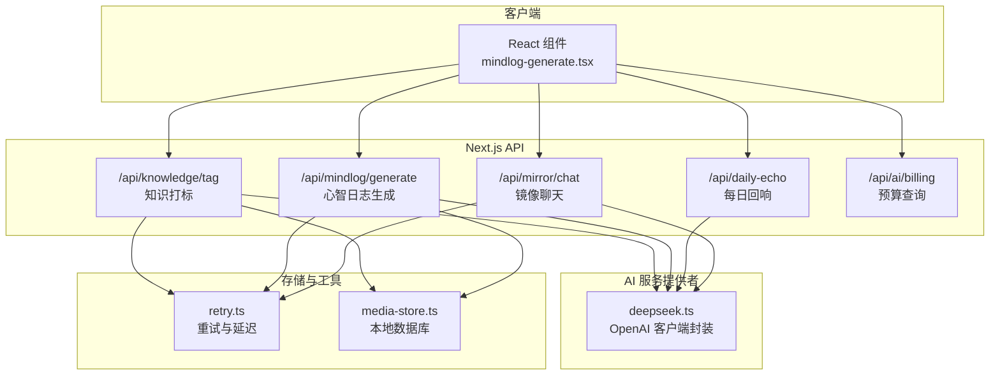
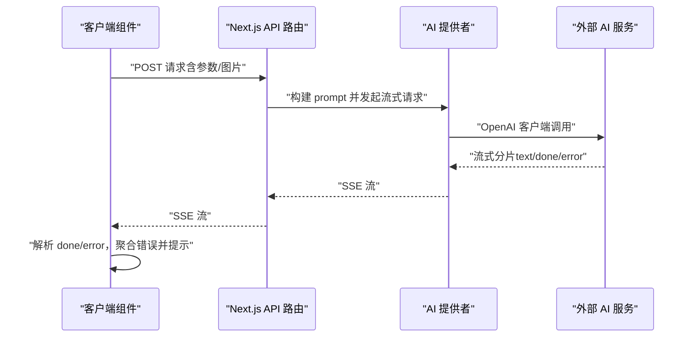
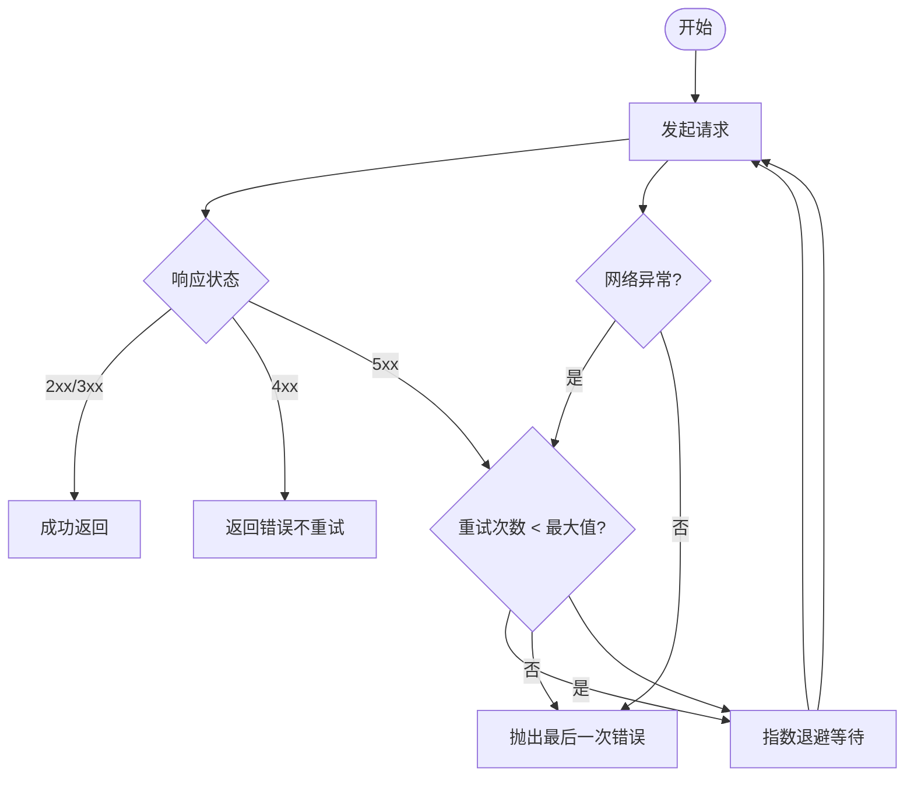
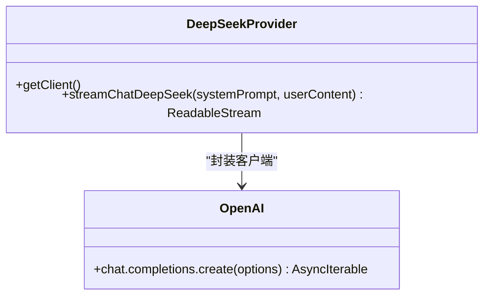
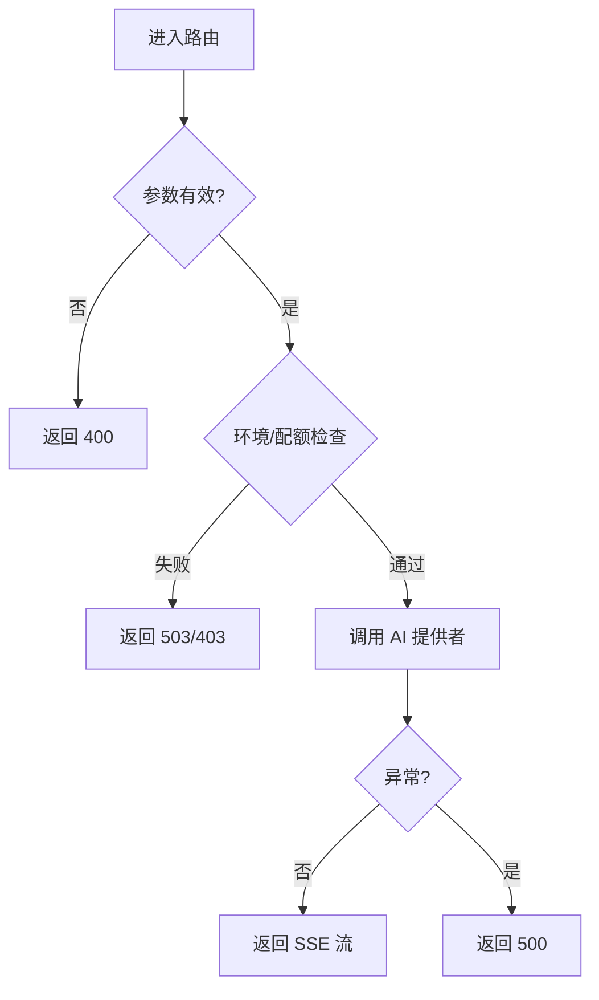
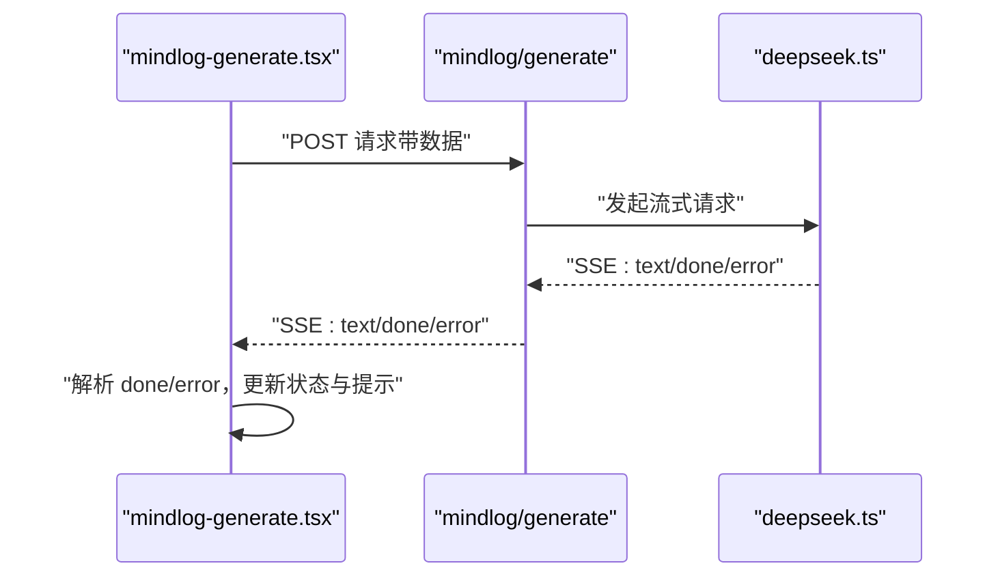
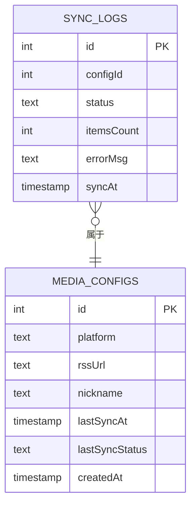
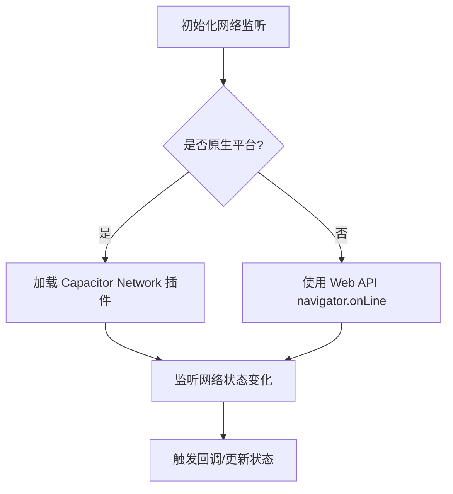
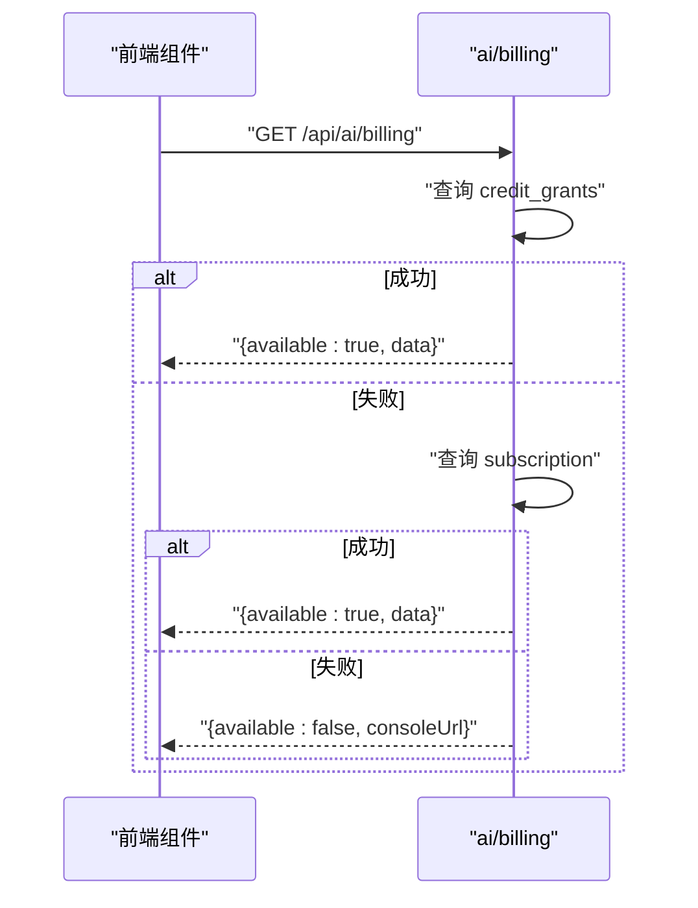
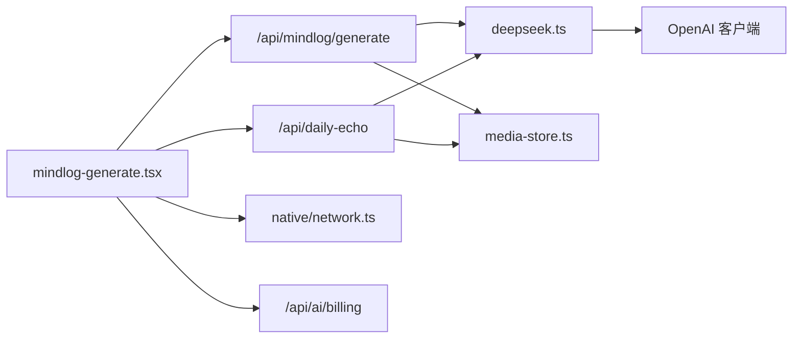

# AI 错误处理与重试

<cite>
**本文引用的文件**
- [src/lib/utils/retry.ts](file://src/lib/utils/retry.ts)
- [src/lib/media/sync-service.ts](file://src/lib/media/sync-service.ts)
- [src/lib/storage/media-store.ts](file://src/lib/storage/media-store.ts)
- [src/app/api/knowledge/tag/route.ts](file://src/app/api/knowledge/tag/route.ts)
- [src/app/api/mindlog/generate/route.ts](file://src/app/api/mindlog/generate/route.ts)
- [src/app/api/daily-echo/route.ts](file://src/app/api/daily-echo/route.ts)
- [src/app/api/mirror/chat/route.ts](file://src/app/api/mirror/chat/route.ts)
- [src/lib/ai/providers/deepseek.ts](file://src/lib/ai/providers/deepseek.ts)
- [src/lib/native/network.ts](file://src/lib/native/network.ts)
- [src/components/mindlog/mindlog-generate.tsx](file://src/components/mindlog/mindlog-generate.tsx)
- [src/app/api/ai/billing/route.ts](file://src/app/api/ai/billing/route.ts)
- [src/components/settings/ai-budget-settings.tsx](file://src/components/settings/ai-budget-settings.tsx)
- [src/components/profile/profile-panel.tsx](file://src/components/profile/profile-panel.tsx)
</cite>

## 目录
1. [简介](#简介)
2. [项目结构](#项目结构)
3. [核心组件](#核心组件)
4. [架构总览](#架构总览)
5. [详细组件分析](#详细组件分析)
6. [依赖关系分析](#依赖关系分析)
7. [性能考量](#性能考量)
8. [故障排查指南](#故障排查指南)
9. [结论](#结论)
10. [附录](#附录)

## 简介
本文件系统化梳理本项目的 AI 错误处理与重试机制，覆盖网络错误、服务端错误、配额/预算限制、模型不可用、流式传输异常等场景。重点说明错误分类、错误码定义与恢复策略，解释指数退避重试算法、超时与熔断思路、降级策略（备用模型、缓存、用户提示），以及错误监控、日志记录与告警建议。文中结合实际源码路径给出实现位置与最佳实践。

## 项目结构
围绕 AI 错误处理的关键模块分布如下：
- 工具层：统一的重试与延迟工具
- 存储层：本地数据库记录同步日志与状态
- API 层：知识打标、心智日志生成、每日回响、镜像聊天等接口，负责错误分类与响应
- 客户端：Mindlog 组件消费 SSE 流，进行错误聚合与用户提示
- 原生网络监听：跨平台网络状态感知与降级
- 预算与配额：查询 AI 服务余额与订阅状态，辅助预算限制判断

图表来源
- [src/components/mindlog/mindlog-generate.tsx:34-78](file://src/components/mindlog/mindlog-generate.tsx#L34-L78)
- [src/app/api/knowledge/tag/route.ts:13-69](file://src/app/api/knowledge/tag/route.ts#L13-L69)
- [src/app/api/mindlog/generate/route.ts:22-106](file://src/app/api/mindlog/generate/route.ts#L22-L106)
- [src/app/api/daily-echo/route.ts:14-71](file://src/app/api/daily-echo/route.ts#L14-L71)
- [src/app/api/mirror/chat/route.ts:9-63](file://src/app/api/mirror/chat/route.ts#L9-L63)
- [src/lib/ai/providers/deepseek.ts:15-57](file://src/lib/ai/providers/deepseek.ts#L15-L57)
- [src/lib/utils/retry.ts:10-44](file://src/lib/utils/retry.ts#L10-L44)
- [src/lib/storage/media-store.ts:99-125](file://src/lib/storage/media-store.ts#L99-L125)

章节来源
- [src/lib/utils/retry.ts:1-45](file://src/lib/utils/retry.ts#L1-L45)
- [src/lib/media/sync-service.ts:1-383](file://src/lib/media/sync-service.ts#L1-L383)
- [src/lib/storage/media-store.ts:1-140](file://src/lib/storage/media-store.ts#L1-L140)
- [src/app/api/knowledge/tag/route.ts:1-70](file://src/app/api/knowledge/tag/route.ts#L1-L70)
- [src/app/api/mindlog/generate/route.ts:1-107](file://src/app/api/mindlog/generate/route.ts#L1-L107)
- [src/app/api/daily-echo/route.ts:1-72](file://src/app/api/daily-echo/route.ts#L1-L72)
- [src/app/api/mirror/chat/route.ts:1-64](file://src/app/api/mirror/chat/route.ts#L1-L64)
- [src/lib/ai/providers/deepseek.ts:1-57](file://src/lib/ai/providers/deepseek.ts#L1-L57)
- [src/lib/native/network.ts:1-102](file://src/lib/native/network.ts#L1-L102)
- [src/components/mindlog/mindlog-generate.tsx:34-78](file://src/components/mindlog/mindlog-generate.tsx#L34-L78)
- [src/app/api/ai/billing/route.ts:1-40](file://src/app/api/ai/billing/route.ts#L1-L40)
- [src/components/settings/ai-budget-settings.tsx:1-40](file://src/components/settings/ai-budget-settings.tsx#L1-L40)
- [src/components/profile/profile-panel.tsx:236-264](file://src/components/profile/profile-panel.tsx#L236-L264)

## 核心组件
- 重试与延迟工具：提供指数退避重试与 FetchError 包装，便于区分网络错误与服务端 5xx 错误
- AI 服务提供者：封装 OpenAI 客户端，统一流式输出格式（text/done/error）
- API 路由：在路由层进行参数校验、环境变量检查、错误分类与响应
- 客户端消费：SSE 流解析、错误聚合、用户提示
- 本地存储：记录同步日志、状态与时间，用于问题定位与重试决策
- 原生网络监听：跨平台网络状态感知，提供降级策略依据
- 预算查询：查询余额与订阅状态，辅助预算限制判断与降级

章节来源
- [src/lib/utils/retry.ts:1-45](file://src/lib/utils/retry.ts#L1-L45)
- [src/lib/ai/providers/deepseek.ts:1-57](file://src/lib/ai/providers/deepseek.ts#L1-L57)
- [src/app/api/knowledge/tag/route.ts:13-69](file://src/app/api/knowledge/tag/route.ts#L13-L69)
- [src/app/api/mindlog/generate/route.ts:22-106](file://src/app/api/mindlog/generate/route.ts#L22-L106)
- [src/app/api/daily-echo/route.ts:14-71](file://src/app/api/daily-echo/route.ts#L14-L71)
- [src/components/mindlog/mindlog-generate.tsx:34-78](file://src/components/mindlog/mindlog-generate.tsx#L34-L78)
- [src/lib/storage/media-store.ts:99-125](file://src/lib/storage/media-store.ts#L99-L125)
- [src/lib/native/network.ts:32-101](file://src/lib/native/network.ts#L32-L101)
- [src/app/api/ai/billing/route.ts:3-39](file://src/app/api/ai/billing/route.ts#L3-L39)

## 架构总览
AI 错误处理贯穿“客户端 -> API 路由 -> AI 提供者 -> 外部服务”的链路，错误在各层被识别、分类与恢复。客户端通过 SSE 流消费 AI 输出，API 路由负责参数校验与错误分类，AI 提供者统一输出格式，存储层记录状态与日志，原生网络监听提供运行时环境信息。

图表来源
- [src/app/api/mindlog/generate/route.ts:61-97](file://src/app/api/mindlog/generate/route.ts#L61-L97)
- [src/lib/ai/providers/deepseek.ts:32-56](file://src/lib/ai/providers/deepseek.ts#L32-L56)
- [src/components/mindlog/mindlog-generate.tsx:58-78](file://src/components/mindlog/mindlog-generate.tsx#L58-L78)

## 详细组件分析

### 重试与延迟工具（指数退避）
- 功能要点
  - 对网络异常与服务端 5xx 错误进行重试
  - 指数退避：2^attempt × 1000ms，最多重试 N 次
  - 使用 FetchError 包装服务端错误，便于上层区分
- 适用场景
  - 网络抖动、临时服务不可用
  - 非幂等操作需谨慎使用
- 注意事项
  - 仅对 5xx 重试，避免对 4xx（参数/鉴权/配额）重试
  - 结合超时与取消信号，避免长时间占用资源

图表来源
- [src/lib/utils/retry.ts:10-44](file://src/lib/utils/retry.ts#L10-L44)

章节来源
- [src/lib/utils/retry.ts:1-45](file://src/lib/utils/retry.ts#L1-L45)

### AI 服务提供者（统一流式输出）
- 功能要点
  - 统一 OpenAI 客户端初始化与模型选择
  - 流式输出固定格式：text（增量）、done（最终结果）、error（错误）
  - 异常时发送 error 事件，便于客户端聚合
- 适用场景
  - 心智日志生成、知识打标、每日回响、镜像聊天
- 注意事项
  - 控制温度与最大 token，避免长文本导致内存压力
  - 在 finally 中关闭流，确保资源释放

图表来源
- [src/lib/ai/providers/deepseek.ts:1-57](file://src/lib/ai/providers/deepseek.ts#L1-L57)

章节来源
- [src/lib/ai/providers/deepseek.ts:1-57](file://src/lib/ai/providers/deepseek.ts#L1-L57)

### API 路由错误分类与响应
- 知识打标（/api/knowledge/tag）
  - 参数校验：内容或图片必须其一
  - 环境变量检查：未配置返回 503
  - 图片大小限制：超过阈值返回 413
  - 流式异常：捕获并返回 500
- 心智日志生成（/api/mindlog/generate）
  - 类型校验：type 与 data 必填
  - 模型选择：按类型切换不同 API Key
  - 流式异常：向 SSE 发送 error 事件
- 每日回响（/api/daily-echo）
  - 读取 SSE 并聚合，遇到 error 事件返回 502
- 镜像聊天（/api/mirror/chat）
  - 参数校验与图片 OCR 预处理
  - 异常统一返回 500

图表来源
- [src/app/api/knowledge/tag/route.ts:16-26](file://src/app/api/knowledge/tag/route.ts#L16-L26)
- [src/app/api/mindlog/generate/route.ts:26-51](file://src/app/api/mindlog/generate/route.ts#L26-L51)
- [src/app/api/daily-echo/route.ts:17-19](file://src/app/api/daily-echo/route.ts#L17-L19)
- [src/app/api/mirror/chat/route.ts:13-15](file://src/app/api/mirror/chat/route.ts#L13-L15)

章节来源
- [src/app/api/knowledge/tag/route.ts:1-70](file://src/app/api/knowledge/tag/route.ts#L1-L70)
- [src/app/api/mindlog/generate/route.ts:1-107](file://src/app/api/mindlog/generate/route.ts#L1-L107)
- [src/app/api/daily-echo/route.ts:1-72](file://src/app/api/daily-echo/route.ts#L1-L72)
- [src/app/api/mirror/chat/route.ts:1-64](file://src/app/api/mirror/chat/route.ts#L1-L64)

### 客户端消费与错误聚合（SSE）
- 心智日志生成组件
  - 使用 AbortController 支持取消
  - 读取 SSE 流，聚合 text 与 done，遇到 error 事件抛错
- 每日回响
  - 先读取 SSE，聚合完成后统一返回；若出现 error，返回 502

图表来源
- [src/components/mindlog/mindlog-generate.tsx:34-78](file://src/components/mindlog/mindlog-generate.tsx#L34-L78)
- [src/app/api/mindlog/generate/route.ts:61-97](file://src/app/api/mindlog/generate/route.ts#L61-L97)
- [src/lib/ai/providers/deepseek.ts:32-56](file://src/lib/ai/providers/deepseek.ts#L32-L56)

章节来源
- [src/components/mindlog/mindlog-generate.tsx:34-78](file://src/components/mindlog/mindlog-generate.tsx#L34-L78)
- [src/app/api/daily-echo/route.ts:24-53](file://src/app/api/daily-echo/route.ts#L24-L53)

### 本地存储与日志记录
- 同步日志表结构：记录平台、时间、新增数量、状态、错误信息
- 同步流程：成功/失败均写入日志，失败时更新配置状态
- 查询最近日志：支持按配置过滤与排序

图表来源
- [src/lib/storage/media-store.ts:17-24](file://src/lib/storage/media-store.ts#L17-L24)
- [src/lib/storage/media-store.ts:99-125](file://src/lib/storage/media-store.ts#L99-L125)

章节来源
- [src/lib/media/sync-service.ts:95-137](file://src/lib/media/sync-service.ts#L95-L137)
- [src/lib/storage/media-store.ts:99-125](file://src/lib/storage/media-store.ts#L99-L125)

### 原生网络监听与降级
- 原生平台：@capacitor/network 精确检测（WiFi/Cellular/None）
- Web 平台：navigator.onLine 降级
- 提供网络状态变更回调与在线状态查询

图表来源
- [src/lib/native/network.ts:32-82](file://src/lib/native/network.ts#L32-L82)

章节来源
- [src/lib/native/network.ts:1-102](file://src/lib/native/network.ts#L1-L102)

### 预算与配额查询
- 优先查询 credit_grants，失败则回退 subscription
- 失败时返回控制台链接，便于用户自助查看
- 前端组件展示余额与使用情况

图表来源
- [src/app/api/ai/billing/route.ts:7-32](file://src/app/api/ai/billing/route.ts#L7-L32)
- [src/components/settings/ai-budget-settings.tsx:15-21](file://src/components/settings/ai-budget-settings.tsx#L15-L21)
- [src/components/profile/profile-panel.tsx:236-264](file://src/components/profile/profile-panel.tsx#L236-L264)

章节来源
- [src/app/api/ai/billing/route.ts:1-40](file://src/app/api/ai/billing/route.ts#L1-L40)
- [src/components/settings/ai-budget-settings.tsx:1-40](file://src/components/settings/ai-budget-settings.tsx#L1-L40)
- [src/components/profile/profile-panel.tsx:236-264](file://src/components/profile/profile-panel.tsx#L236-L264)

## 依赖关系分析
- 客户端组件依赖 API 路由，API 路由依赖 AI 提供者
- AI 提供者依赖 OpenAI 客户端，统一输出格式
- 同步流程依赖本地存储记录状态与日志
- 原生网络监听为客户端与 API 路由提供运行时环境信息
- 预算查询为前端展示与降级策略提供依据

图表来源
- [src/components/mindlog/mindlog-generate.tsx:34-78](file://src/components/mindlog/mindlog-generate.tsx#L34-L78)
- [src/app/api/mindlog/generate/route.ts:54-57](file://src/app/api/mindlog/generate/route.ts#L54-L57)
- [src/app/api/daily-echo/route.ts:22-22](file://src/app/api/daily-echo/route.ts#L22-L22)
- [src/lib/ai/providers/deepseek.ts:1-57](file://src/lib/ai/providers/deepseek.ts#L1-L57)
- [src/lib/storage/media-store.ts:99-125](file://src/lib/storage/media-store.ts#L99-L125)
- [src/lib/native/network.ts:32-101](file://src/lib/native/network.ts#L32-L101)
- [src/app/api/ai/billing/route.ts:3-39](file://src/app/api/ai/billing/route.ts#L3-L39)

章节来源
- [src/components/mindlog/mindlog-generate.tsx:34-78](file://src/components/mindlog/mindlog-generate.tsx#L34-L78)
- [src/app/api/mindlog/generate/route.ts:1-107](file://src/app/api/mindlog/generate/route.ts#L1-L107)
- [src/app/api/daily-echo/route.ts:1-72](file://src/app/api/daily-echo/route.ts#L1-L72)
- [src/lib/ai/providers/deepseek.ts:1-57](file://src/lib/ai/providers/deepseek.ts#L1-L57)
- [src/lib/storage/media-store.ts:1-140](file://src/lib/storage/media-store.ts#L1-L140)
- [src/lib/native/network.ts:1-102](file://src/lib/native/network.ts#L1-L102)
- [src/app/api/ai/billing/route.ts:1-40](file://src/app/api/ai/billing/route.ts#L1-L40)

## 性能考量
- 流式输出：减少一次性内存占用，提升交互体验
- 退避策略：避免雪崩效应，降低外部服务压力
- 本地缓存：对静态内容与近期结果进行缓存，减少重复请求
- 资源释放：finally 关闭流，及时清理 AbortController
- 超时与取消：为长耗时请求设置超时与取消信号，避免阻塞

## 故障排查指南
- 常见错误与处理
  - 400 参数错误：检查必填字段与格式
  - 403/503 配额/未配置：检查环境变量与余额
  - 413 图片过大：压缩或裁剪图片
  - 500/502 服务异常：查看日志与重试
- 日志与监控
  - API 层打印错误堆栈与请求参数
  - 客户端聚合 SSE 错误并提示用户
  - 本地存储记录同步日志，便于回溯
- 降级策略
  - 备用模型：根据类型切换 API Key 与模型
  - 缓存响应：对短期稳定内容进行缓存
  - 用户提示：清晰的错误文案与重试按钮
- 熔断与限流
  - 当错误率持续升高时，可引入快速失败与熔断窗口
  - 限制并发与队列长度，避免级联故障

章节来源
- [src/app/api/knowledge/tag/route.ts:16-26](file://src/app/api/knowledge/tag/route.ts#L16-L26)
- [src/app/api/mindlog/generate/route.ts:30-36](file://src/app/api/mindlog/generate/route.ts#L30-L36)
- [src/app/api/daily-echo/route.ts:55-57](file://src/app/api/daily-echo/route.ts#L55-L57)
- [src/lib/media/sync-service.ts:114-137](file://src/lib/media/sync-service.ts#L114-L137)
- [src/lib/ai/providers/deepseek.ts:48-51](file://src/lib/ai/providers/deepseek.ts#L48-L51)

## 结论
本项目在错误处理与重试方面形成了“参数校验 + 环境检查 + 流式异常 + 本地日志 + 网络感知 + 预算查询”的闭环。通过指数退避与 SSE 错误聚合，提升了用户体验与系统韧性。建议后续增强熔断与限流、完善告警与可观测性，并对非幂等操作增加去重与补偿机制。

## 附录
- 错误码与含义
  - 400：请求参数缺失或格式错误
  - 403/503：AI 服务未配置或配额不足
  - 413：上传内容过大
  - 500：内部服务异常
  - 502：上游服务返回错误
- 最佳实践
  - 仅对 5xx 与网络异常进行重试
  - 使用 SSE 错误事件统一错误传播
  - 为关键流程添加本地日志与回溯
  - 结合预算查询与网络状态做动态降级