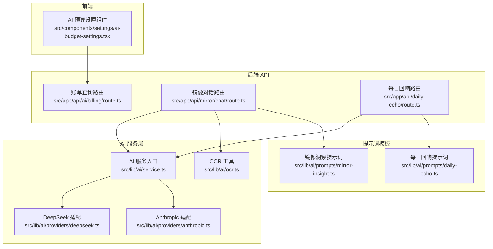
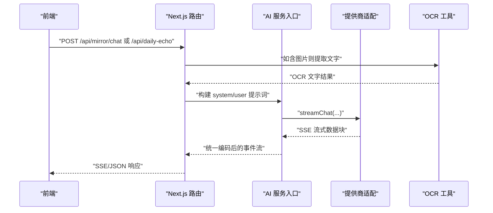
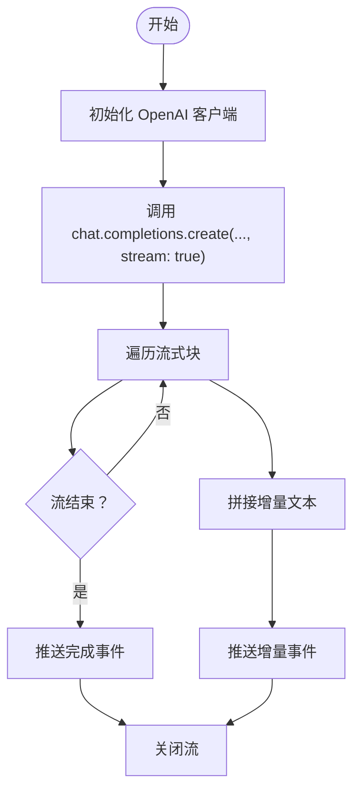
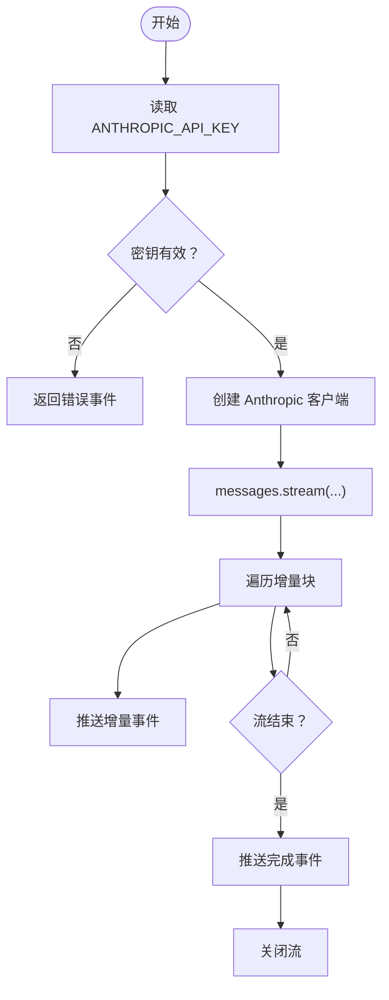
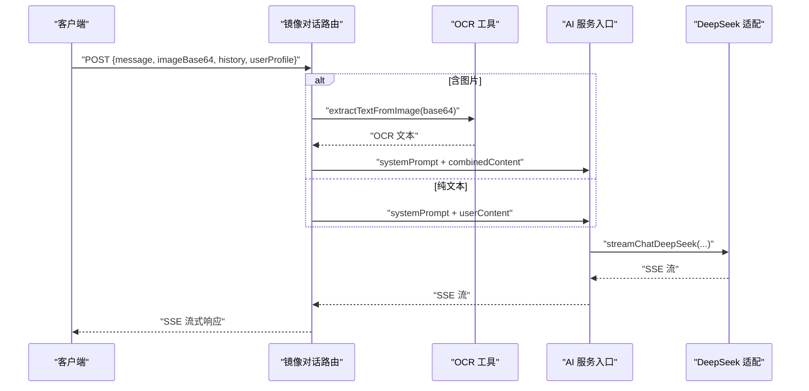
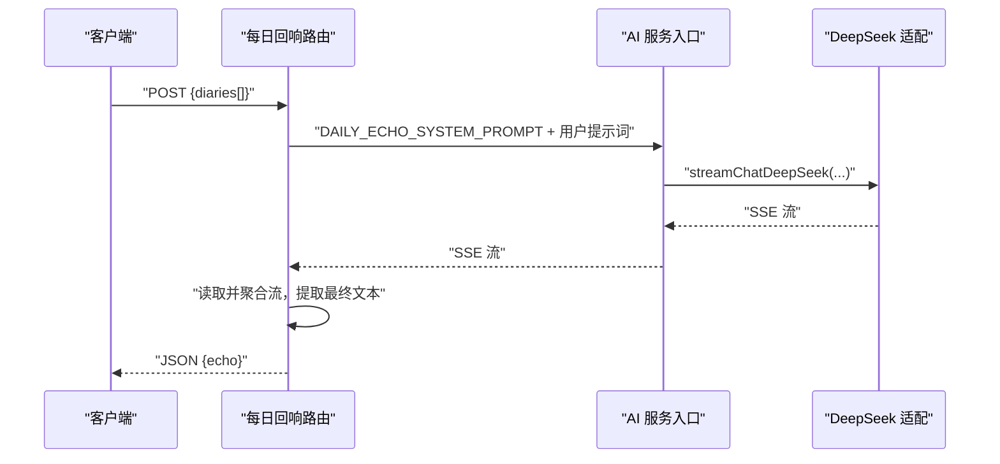
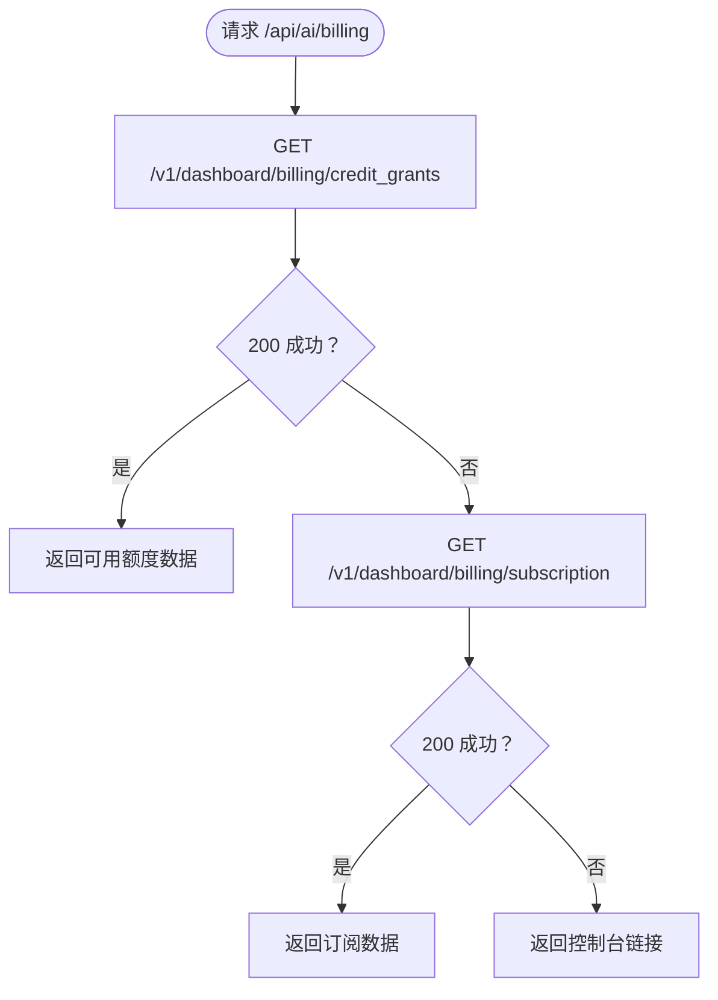
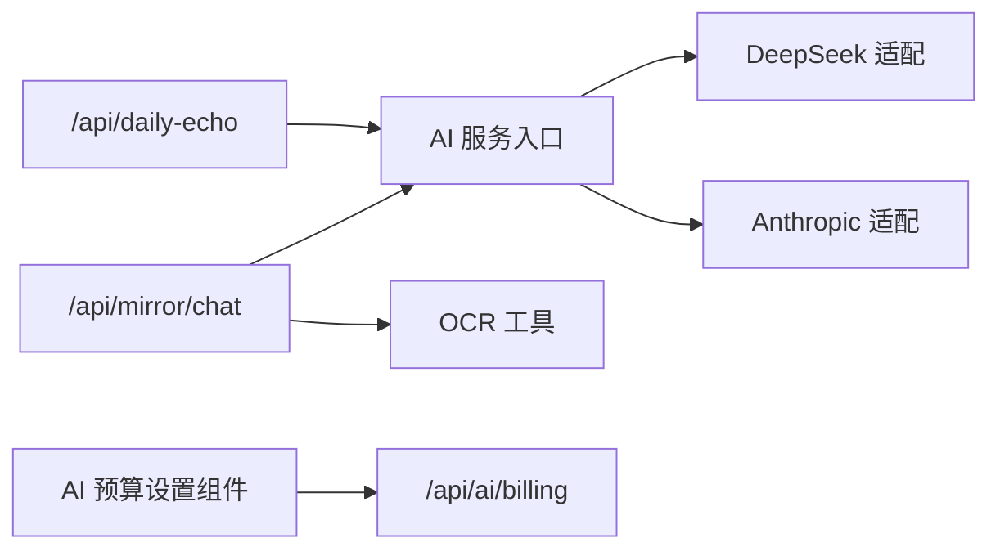

# AI 集成系统

<cite>
**本文引用的文件**
- [src/app/api/ai/billing/route.ts](file://src/app/api/ai/billing/route.ts)
- [src/app/api/mirror/chat/route.ts](file://src/app/api/mirror/chat/route.ts)
- [src/app/api/daily-echo/route.ts](file://src/app/api/daily-echo/route.ts)
- [src/components/settings/ai-budget-settings.tsx](file://src/components/settings/ai-budget-settings.tsx)
- [src/lib/ai/service.ts](file://src/lib/ai/service.ts)
- [src/lib/ai/providers/anthropic.ts](file://src/lib/ai/providers/anthropic.ts)
- [src/lib/ai/providers/deepseek.ts](file://src/lib/ai/providers/deepseek.ts)
- [src/lib/ai/ocr.ts](file://src/lib/ai/ocr.ts)
- [src/lib/ai/prompts/mirror-insight.ts](file://src/lib/ai/prompts/mirror-insight.ts)
- [src/lib/ai/prompts/daily-echo.ts](file://src/lib/ai/prompts/daily-echo.ts)
</cite>

## 目录
1. [简介](#简介)
2. [项目结构](#项目结构)
3. [核心组件](#核心组件)
4. [架构总览](#架构总览)
5. [详细组件分析](#详细组件分析)
6. [依赖关系分析](#依赖关系分析)
7. [性能考量](#性能考量)
8. [故障排查指南](#故障排查指南)
9. [结论](#结论)
10. [附录](#附录)

## 简介
本文件面向 life-os 的 AI 集成系统，系统通过统一的流式接口对接多家 AI 提供商（OpenAI 兼容层、DeepSeek、Anthropic），并在镜像对话与每日回响等场景中实现流式实时响应与用户体验优化。系统支持基于图片的文字提取（OCR）与多模态输入处理，提供账单查询与预算可视化能力，并内置错误处理、降级与容错机制。

## 项目结构
AI 相关功能主要分布在以下区域：
- 后端 API 层：镜像对话、每日回响、账单查询等路由
- AI 服务封装层：统一导出流式聊天接口，便于扩展新提供商
- 提供商适配层：DeepSeek 与 Anthropic 的客户端封装
- OCR 工具层：图片文字提取
- 提示词模板层：镜像洞察与每日回响的系统提示词
- 前端设置组件：心智点数（余额）展示与跳转

图表来源
- [src/components/settings/ai-budget-settings.tsx:1-64](file://src/components/settings/ai-budget-settings.tsx#L1-L64)
- [src/app/api/ai/billing/route.ts:1-40](file://src/app/api/ai/billing/route.ts#L1-L40)
- [src/app/api/mirror/chat/route.ts:1-65](file://src/app/api/mirror/chat/route.ts#L1-L65)
- [src/app/api/daily-echo/route.ts:1-72](file://src/app/api/daily-echo/route.ts#L1-L72)
- [src/lib/ai/service.ts:1-5](file://src/lib/ai/service.ts#L1-L5)
- [src/lib/ai/providers/anthropic.ts:1-48](file://src/lib/ai/providers/anthropic.ts#L1-L48)
- [src/lib/ai/providers/deepseek.ts:1-57](file://src/lib/ai/providers/deepseek.ts#L1-L57)
- [src/lib/ai/ocr.ts:1-200](file://src/lib/ai/ocr.ts#L1-L200)
- [src/lib/ai/prompts/mirror-insight.ts:1-200](file://src/lib/ai/prompts/mirror-insight.ts#L1-L200)
- [src/lib/ai/prompts/daily-echo.ts:1-200](file://src/lib/ai/prompts/daily-echo.ts#L1-L200)

章节来源
- [src/app/api/ai/billing/route.ts:1-40](file://src/app/api/ai/billing/route.ts#L1-L40)
- [src/app/api/mirror/chat/route.ts:1-65](file://src/app/api/mirror/chat/route.ts#L1-L65)
- [src/app/api/daily-echo/route.ts:1-72](file://src/app/api/daily-echo/route.ts#L1-L72)
- [src/lib/ai/service.ts:1-5](file://src/lib/ai/service.ts#L1-L5)
- [src/lib/ai/providers/anthropic.ts:1-48](file://src/lib/ai/providers/anthropic.ts#L1-L48)
- [src/lib/ai/providers/deepseek.ts:1-57](file://src/lib/ai/providers/deepseek.ts#L1-L57)
- [src/lib/ai/ocr.ts:1-200](file://src/lib/ai/ocr.ts#L1-L200)
- [src/lib/ai/prompts/mirror-insight.ts:1-200](file://src/lib/ai/prompts/mirror-insight.ts#L1-L200)
- [src/lib/ai/prompts/daily-echo.ts:1-200](file://src/lib/ai/prompts/daily-echo.ts#L1-L200)
- [src/components/settings/ai-budget-settings.tsx:1-64](file://src/components/settings/ai-budget-settings.tsx#L1-L64)

## 核心组件
- 统一 AI 服务入口：对外暴露统一的流式聊天函数，便于切换或扩展提供商
- DeepSeek 适配：基于 OpenAI 兼容接口的流式聊天实现，负责实时增量输出与最终聚合
- Anthropic 适配：封装 Anthropic 客户端，提供统一的流式消息接口
- OCR 工具：对 Base64 图片进行文字识别，用于镜像对话的多模态输入
- 提示词模板：镜像洞察与每日回响的系统提示词，支持注入用户画像与历史上下文
- 账单查询与预算展示：后端查询提供商账单，前端展示已用额度与跳转控制台

章节来源
- [src/lib/ai/service.ts:1-5](file://src/lib/ai/service.ts#L1-L5)
- [src/lib/ai/providers/deepseek.ts:1-57](file://src/lib/ai/providers/deepseek.ts#L1-L57)
- [src/lib/ai/providers/anthropic.ts:1-48](file://src/lib/ai/providers/anthropic.ts#L1-L48)
- [src/lib/ai/ocr.ts:1-200](file://src/lib/ai/ocr.ts#L1-L200)
- [src/lib/ai/prompts/mirror-insight.ts:1-200](file://src/lib/ai/prompts/mirror-insight.ts#L1-L200)
- [src/lib/ai/prompts/daily-echo.ts:1-200](file://src/lib/ai/prompts/daily-echo.ts#L1-L200)
- [src/app/api/ai/billing/route.ts:1-40](file://src/app/api/ai/billing/route.ts#L1-L40)
- [src/components/settings/ai-budget-settings.tsx:1-64](file://src/components/settings/ai-budget-settings.tsx#L1-L64)

## 架构总览
系统采用“路由层 → 服务层 → 提供商适配层”的分层设计，结合提示词模板与 OCR 工具，形成可扩展的多模态 AI 对话能力。镜像对话支持纯文本与含图输入，每日回响以非流式聚合输出一句话总结。

图表来源
- [src/app/api/mirror/chat/route.ts:1-65](file://src/app/api/mirror/chat/route.ts#L1-L65)
- [src/app/api/daily-echo/route.ts:1-72](file://src/app/api/daily-echo/route.ts#L1-L72)
- [src/lib/ai/service.ts:1-5](file://src/lib/ai/service.ts#L1-L5)
- [src/lib/ai/providers/deepseek.ts:1-57](file://src/lib/ai/providers/deepseek.ts#L1-L57)
- [src/lib/ai/providers/anthropic.ts:1-48](file://src/lib/ai/providers/anthropic.ts#L1-L48)
- [src/lib/ai/ocr.ts:1-200](file://src/lib/ai/ocr.ts#L1-L200)

## 详细组件分析

### 统一 AI 服务入口
- 职责：对外暴露统一的流式聊天函数，当前默认指向 Anthropic；未来可扩展为多提供商路由或负载均衡
- 扩展点：可在 service.ts 中增加提供商选择逻辑与降级策略

章节来源
- [src/lib/ai/service.ts:1-5](file://src/lib/ai/service.ts#L1-L5)

### DeepSeek 提供商适配
- 客户端初始化：从环境变量读取密钥，设置代理 base URL
- 流式聊天：基于 OpenAI 兼容接口，逐块推送增量文本，并在结束时推送完整文本
- 错误处理：捕获异常并以事件形式返回错误信息

图表来源
- [src/lib/ai/providers/deepseek.ts:15-57](file://src/lib/ai/providers/deepseek.ts#L15-L57)

章节来源
- [src/lib/ai/providers/deepseek.ts:1-57](file://src/lib/ai/providers/deepseek.ts#L1-L57)

### Anthropic 提供商适配
- 客户端初始化：支持自定义 base URL，默认指向内部代理
- 流式聊天：使用 messages.stream 接口，逐块推送增量文本
- 配置校验：若密钥未配置或占位符，直接返回错误事件，避免静默失败

图表来源
- [src/lib/ai/providers/anthropic.ts:5-48](file://src/lib/ai/providers/anthropic.ts#L5-L48)

章节来源
- [src/lib/ai/providers/anthropic.ts:1-48](file://src/lib/ai/providers/anthropic.ts#L1-L48)

### 镜像对话（多模态）
- 输入：支持纯文本或带 Base64 图片；当含图片时先 OCR 提取文字
- 上下文：最近若干轮对话历史拼接为 userContent
- 提示词：注入用户画像的系统提示词
- 输出：SSE 流式返回，前端可实时渲染

图表来源
- [src/app/api/mirror/chat/route.ts:9-65](file://src/app/api/mirror/chat/route.ts#L9-L65)
- [src/lib/ai/ocr.ts:1-200](file://src/lib/ai/ocr.ts#L1-L200)
- [src/lib/ai/providers/deepseek.ts:15-57](file://src/lib/ai/providers/deepseek.ts#L15-L57)
- [src/lib/ai/prompts/mirror-insight.ts:1-200](file://src/lib/ai/prompts/mirror-insight.ts#L1-L200)

章节来源
- [src/app/api/mirror/chat/route.ts:1-65](file://src/app/api/mirror/chat/route.ts#L1-L65)
- [src/lib/ai/ocr.ts:1-200](file://src/lib/ai/ocr.ts#L1-L200)
- [src/lib/ai/prompts/mirror-insight.ts:1-200](file://src/lib/ai/prompts/mirror-insight.ts#L1-L200)

### 每日回响（非流式聚合）
- 输入：数组形式的日记片段
- 处理：构建用户提示词，调用流式接口，内部读取 SSE 并聚合为最终一句话
- 输出：非流式 JSON，包含回响文本；若出现错误事件则返回 502

图表来源
- [src/app/api/daily-echo/route.ts:14-72](file://src/app/api/daily-echo/route.ts#L14-L72)
- [src/lib/ai/providers/deepseek.ts:15-57](file://src/lib/ai/providers/deepseek.ts#L15-L57)
- [src/lib/ai/prompts/daily-echo.ts:1-200](file://src/lib/ai/prompts/daily-echo.ts#L1-L200)

章节来源
- [src/app/api/daily-echo/route.ts:1-72](file://src/app/api/daily-echo/route.ts#L1-L72)
- [src/lib/ai/prompts/daily-echo.ts:1-200](file://src/lib/ai/prompts/daily-echo.ts#L1-L200)

### 账单查询与预算展示
- 后端：优先访问 credit_grants，其次 subscription，失败则返回控制台链接
- 前端：加载状态、可用额度展示、不可用时跳转控制台

图表来源
- [src/app/api/ai/billing/route.ts:3-39](file://src/app/api/ai/billing/route.ts#L3-L39)

章节来源
- [src/app/api/ai/billing/route.ts:1-40](file://src/app/api/ai/billing/route.ts#L1-L40)
- [src/components/settings/ai-budget-settings.tsx:1-64](file://src/components/settings/ai-budget-settings.tsx#L1-L64)

## 依赖关系分析
- 路由到服务：镜像对话与每日回响路由依赖统一服务入口与提供商适配
- 服务到提供商：当前默认指向 Anthropic；DeepSeek 适配作为 OpenAI 兼容实现
- 服务到工具：镜像对话在含图场景依赖 OCR 工具
- 前后端交互：前端设置组件通过 /api/ai/billing 获取余额信息

图表来源
- [src/app/api/mirror/chat/route.ts:1-65](file://src/app/api/mirror/chat/route.ts#L1-L65)
- [src/app/api/daily-echo/route.ts:1-72](file://src/app/api/daily-echo/route.ts#L1-L72)
- [src/lib/ai/service.ts:1-5](file://src/lib/ai/service.ts#L1-L5)
- [src/lib/ai/providers/deepseek.ts:1-57](file://src/lib/ai/providers/deepseek.ts#L1-L57)
- [src/lib/ai/providers/anthropic.ts:1-48](file://src/lib/ai/providers/anthropic.ts#L1-L48)
- [src/lib/ai/ocr.ts:1-200](file://src/lib/ai/ocr.ts#L1-L200)
- [src/components/settings/ai-budget-settings.tsx:1-64](file://src/components/settings/ai-budget-settings.tsx#L1-L64)

章节来源
- [src/app/api/mirror/chat/route.ts:1-65](file://src/app/api/mirror/chat/route.ts#L1-L65)
- [src/app/api/daily-echo/route.ts:1-72](file://src/app/api/daily-echo/route.ts#L1-L72)
- [src/lib/ai/service.ts:1-5](file://src/lib/ai/service.ts#L1-L5)
- [src/lib/ai/providers/deepseek.ts:1-57](file://src/lib/ai/providers/deepseek.ts#L1-L57)
- [src/lib/ai/providers/anthropic.ts:1-48](file://src/lib/ai/providers/anthropic.ts#L1-L48)
- [src/lib/ai/ocr.ts:1-200](file://src/lib/ai/ocr.ts#L1-L200)
- [src/components/settings/ai-budget-settings.tsx:1-64](file://src/components/settings/ai-budget-settings.tsx#L1-L64)

## 性能考量
- 流式传输：镜像对话与每日回响均采用 SSE 流式输出，降低首包延迟，提升交互体验
- 上下文裁剪：镜像对话仅保留最近若干轮历史，控制消息长度与往返时间
- 非流式聚合：每日回响在服务端聚合流式结果，减少前端复杂度
- 超时与运行时：路由设置 Node 运行时与最大执行时长，确保长时间流式任务稳定执行
- 缓存策略：每日回响建议在前端做一天级缓存，减少重复调用

章节来源
- [src/app/api/mirror/chat/route.ts:6-7](file://src/app/api/mirror/chat/route.ts#L6-L7)
- [src/app/api/daily-echo/route.ts:8-9](file://src/app/api/daily-echo/route.ts#L8-L9)
- [src/app/api/mirror/chat/route.ts:24-32](file://src/app/api/mirror/chat/route.ts#L24-L32)

## 故障排查指南
- 配置错误（Anthropic）：当密钥未配置或为占位符时，适配层会直接返回错误事件，前端可据此提示用户配置密钥
- Provider 代理问题：DeepSeek 适配通过代理 base URL 访问，若网络异常需检查代理连通性
- OCR 失败：镜像对话含图时，OCR 失败不会阻断整体流程，系统仍会使用纯文本内容继续推理
- 账单查询失败：后端会尝试多个端点，若均失败则返回控制台链接，前端引导用户手动查看
- 错误事件格式：流式接口统一以事件形式返回错误，前端可监听并展示

章节来源
- [src/lib/ai/providers/anthropic.ts:8-10](file://src/lib/ai/providers/anthropic.ts#L8-L10)
- [src/lib/ai/providers/deepseek.ts:48-51](file://src/lib/ai/providers/deepseek.ts#L48-L51)
- [src/app/api/mirror/chat/route.ts:38-44](file://src/app/api/mirror/chat/route.ts#L38-L44)
- [src/app/api/ai/billing/route.ts:28-38](file://src/app/api/ai/billing/route.ts#L28-L38)

## 结论
该 AI 集成系统以统一的服务入口为核心，结合 DeepSeek 与 Anthropic 的适配层，实现了镜像对话与每日回响两大关键场景的流式交互。系统具备良好的扩展性与容错能力，通过提示词模板与 OCR 工具支持多模态输入，并提供账单查询与预算可视化，帮助用户进行成本管理与使用监控。

## 附录

### 配置与密钥管理
- Anthropic 密钥：通过环境变量配置，适配层会在密钥无效时返回错误事件
- DeepSeek 密钥：通过环境变量配置，适配层使用代理 base URL 访问
- 建议：在部署环境中安全存储密钥，避免硬编码；定期轮换密钥并监控用量

章节来源
- [src/lib/ai/providers/anthropic.ts:7-14](file://src/lib/ai/providers/anthropic.ts#L7-L14)
- [src/lib/ai/providers/deepseek.ts:7-10](file://src/lib/ai/providers/deepseek.ts#L7-L10)

### 成本控制策略
- 账单查询：通过 /api/ai/billing 获取已用额度，前端展示预算使用情况
- 限额与节流：在路由层设置最大执行时长，避免长时间占用资源
- 缓存：对每日回响等结果进行前端缓存，减少重复调用

章节来源
- [src/app/api/ai/billing/route.ts:1-40](file://src/app/api/ai/billing/route.ts#L1-L40)
- [src/app/api/daily-echo/route.ts:8-9](file://src/app/api/daily-echo/route.ts#L8-L9)
- [src/components/settings/ai-budget-settings.tsx:1-64](file://src/components/settings/ai-budget-settings.tsx#L1-L64)

### 使用示例与异常处理指引
- 镜像对话（含图）：先调用 OCR 提取文字，再将组合内容传入流式接口，前端监听 SSE 事件
- 镜像对话（纯文本）：直接传入系统提示词与用户内容，监听增量文本事件
- 每日回响：传入日记数组，等待最终聚合结果；若出现错误事件，按 502 处理
- 异常处理：统一以事件形式返回错误，前端根据事件类型进行提示或重试

章节来源
- [src/app/api/mirror/chat/route.ts:38-48](file://src/app/api/mirror/chat/route.ts#L38-L48)
- [src/app/api/daily-echo/route.ts:24-53](file://src/app/api/daily-echo/route.ts#L24-L53)
- [src/lib/ai/providers/deepseek.ts:48-51](file://src/lib/ai/providers/deepseek.ts#L48-L51)