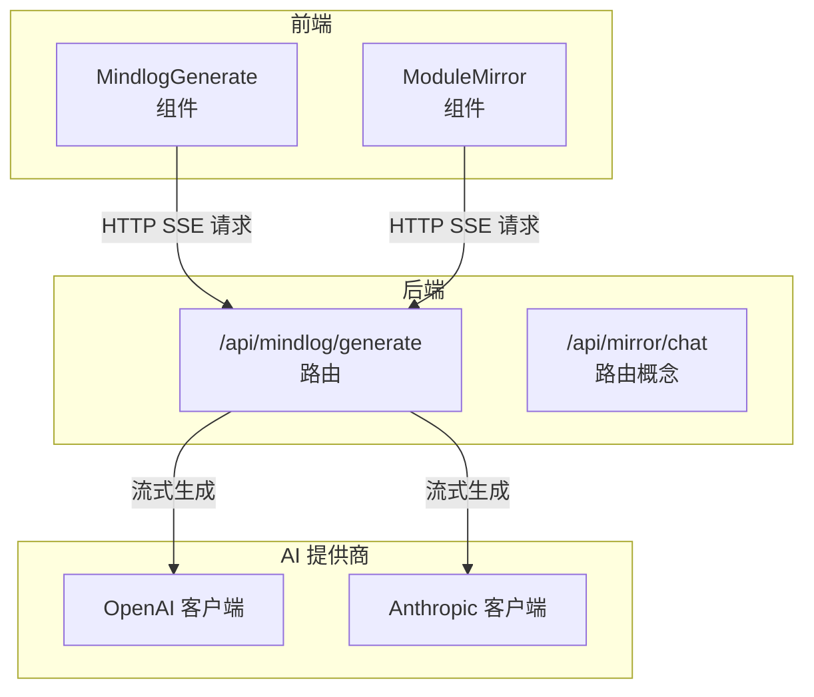
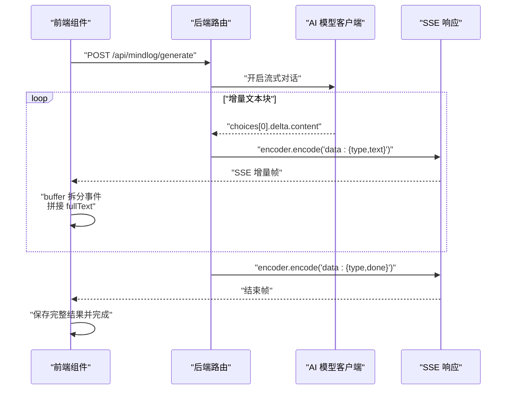
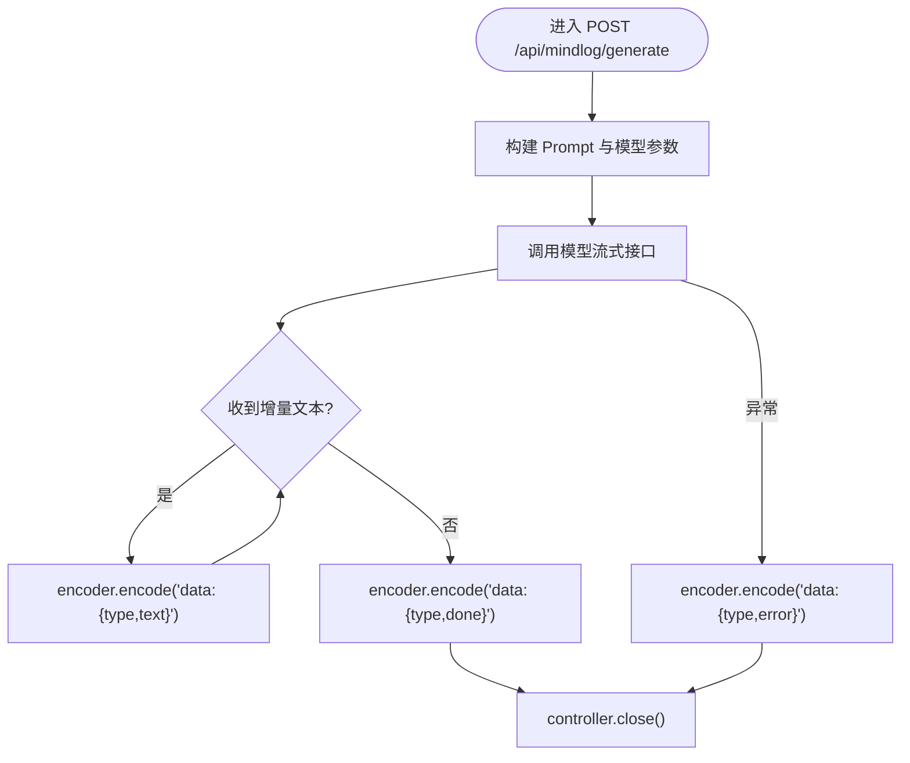
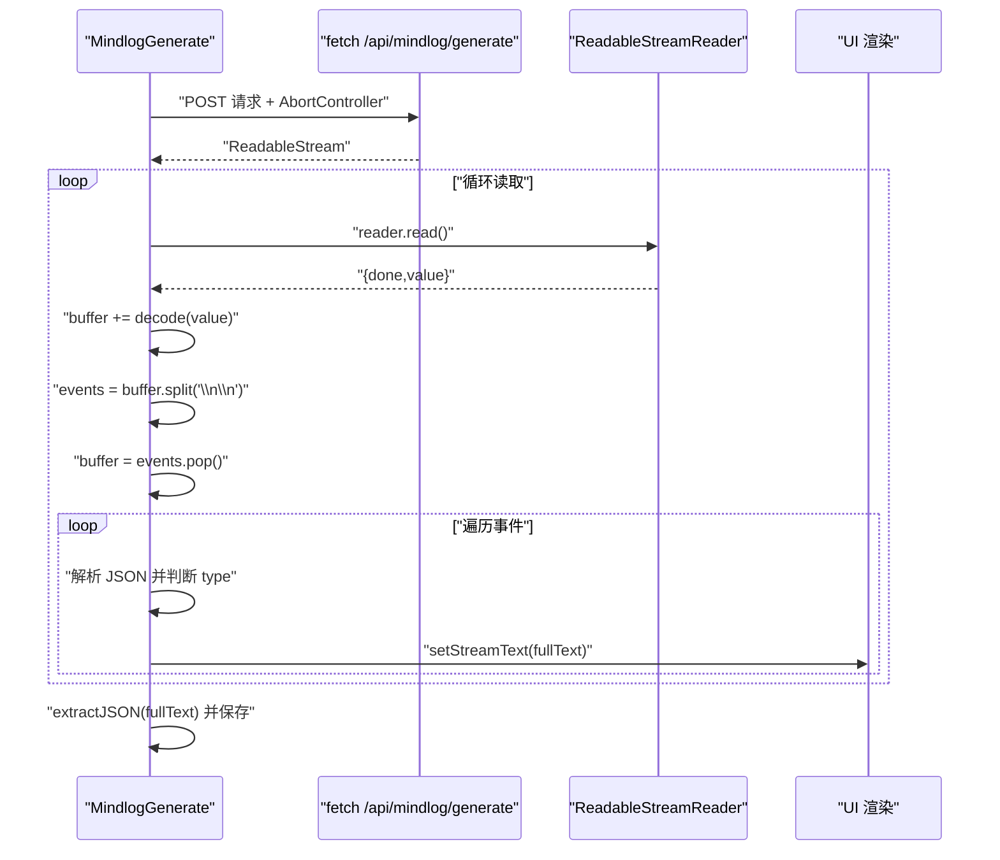
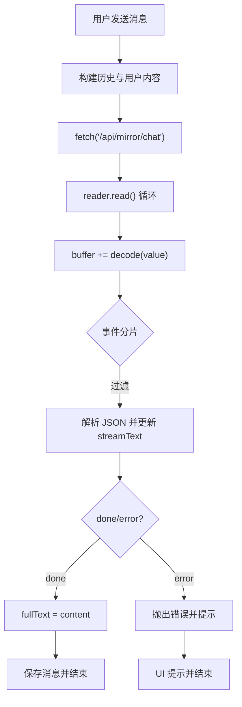
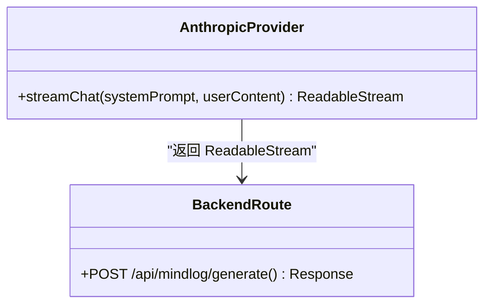
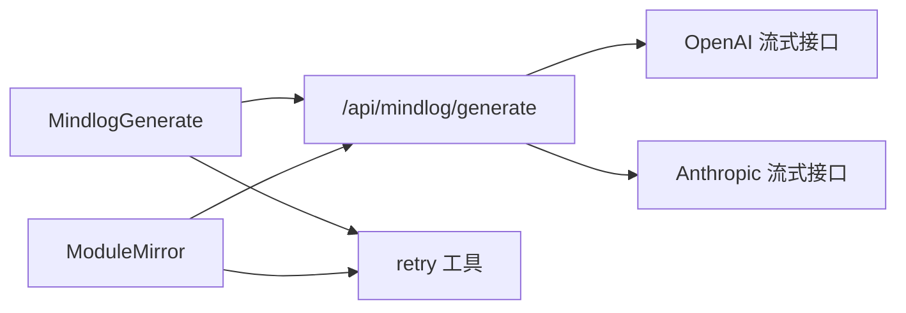

# 流式处理机制

<cite>
**本文引用的文件**
- [src/app/api/mindlog/generate/route.ts](file://src/app/api/mindlog/generate/route.ts)
- [src/lib/ai/providers/anthropic.ts](file://src/lib/ai/providers/anthropic.ts)
- [src/components/mindlog/mindlog-generate.tsx](file://src/components/mindlog/mindlog-generate.tsx)
- [src/components/dashboard/module-mirror.tsx](file://src/components/dashboard/module-mirror.tsx)
- [src/lib/utils/retry.ts](file://src/lib/utils/retry.ts)
</cite>

## 目录
1. [简介](#简介)
2. [项目结构](#项目结构)
3. [核心组件](#核心组件)
4. [架构总览](#架构总览)
5. [详细组件分析](#详细组件分析)
6. [依赖关系分析](#依赖关系分析)
7. [性能考量](#性能考量)
8. [故障排查指南](#故障排查指南)
9. [结论](#结论)
10. [附录](#附录)

## 简介
本文件系统性阐述本项目的流式处理机制，重点覆盖以下方面：
- 服务器端事件（SSE）与流式传输协议的实现
- 实时数据处理、缓冲区管理与内存优化策略
- 用户体验优势：快速响应与渐进式内容展示
- 错误恢复机制、断线重连与数据完整性保障
- 性能监控、延迟优化与并发控制最佳实践
- 具体代码实现与使用示例（通过文件路径与行号定位）

## 项目结构
围绕流式处理的关键文件分布如下：
- 后端 API：负责构建 OpenAI/Anthropic 的流式响应，并以 SSE 形式输出
- 前端组件：消费 SSE 流，进行增量渲染与状态管理
- 工具模块：提供基础的重试与错误封装能力

图表来源
- [src/app/api/mindlog/generate/route.ts:22-106](file://src/app/api/mindlog/generate/route.ts#L22-L106)
- [src/lib/ai/providers/anthropic.ts:19-79](file://src/lib/ai/providers/anthropic.ts#L19-L79)
- [src/components/mindlog/mindlog-generate.tsx:35-123](file://src/components/mindlog/mindlog-generate.tsx#L35-L123)
- [src/components/dashboard/module-mirror.tsx:110-248](file://src/components/dashboard/module-mirror.tsx#L110-L248)

章节来源
- [src/app/api/mindlog/generate/route.ts:1-107](file://src/app/api/mindlog/generate/route.ts#L1-L107)
- [src/lib/ai/providers/anthropic.ts:1-80](file://src/lib/ai/providers/anthropic.ts#L1-L80)
- [src/components/mindlog/mindlog-generate.tsx:1-436](file://src/components/mindlog/mindlog-generate.tsx#L1-L436)
- [src/components/dashboard/module-mirror.tsx:1-590](file://src/components/dashboard/module-mirror.tsx#L1-L590)

## 核心组件
- 后端 SSE 路由：将第三方模型的流式输出转换为标准 SSE 文本帧，逐字节推送
- 前端流消费者：基于 ReadableStream Reader 与 TextDecoder 进行增量解码与渲染
- AI 提供商适配层：统一输出 ReadableStream，便于后端路由复用
- 重试与错误封装：提供基础的网络与服务端错误重试能力

章节来源
- [src/app/api/mindlog/generate/route.ts:59-106](file://src/app/api/mindlog/generate/route.ts#L59-L106)
- [src/lib/ai/providers/anthropic.ts:19-79](file://src/lib/ai/providers/anthropic.ts#L19-L79)
- [src/components/mindlog/mindlog-generate.tsx:58-93](file://src/components/mindlog/mindlog-generate.tsx#L58-L93)
- [src/components/dashboard/module-mirror.tsx:178-221](file://src/components/dashboard/module-mirror.tsx#L178-L221)
- [src/lib/utils/retry.ts:10-40](file://src/lib/utils/retry.ts#L10-L40)

## 架构总览
整体流程：前端发起 SSE 请求 → 后端路由启动流式生成 → 第三方模型持续返回增量内容 → 后端编码为 SSE 帧 → 前端增量解码并渲染。

图表来源
- [src/app/api/mindlog/generate/route.ts:61-97](file://src/app/api/mindlog/generate/route.ts#L61-L97)
- [src/components/mindlog/mindlog-generate.tsx:58-93](file://src/components/mindlog/mindlog-generate.tsx#L58-L93)

## 详细组件分析

### 后端 SSE 路由（Mindlog）
- 责任边界：接收请求、构建 Prompt、调用模型流式接口、编码为 SSE、设置响应头
- 关键点：
  - 使用 ReadableStream.start 回调作为生产者，逐块 enqueue
  - 将 choices.delta.content 作为增量文本，按 'data: {type,text}' 帧推送
  - 结束时发送 'data: {type,done}'，最后关闭流
  - 异常时发送 'data: {type,error}'，确保前端可感知

图表来源
- [src/app/api/mindlog/generate/route.ts:61-97](file://src/app/api/mindlog/generate/route.ts#L61-L97)

章节来源
- [src/app/api/mindlog/generate/route.ts:22-106](file://src/app/api/mindlog/generate/route.ts#L22-L106)

### 前端 MindlogGenerate 组件
- 责任边界：触发生成、消费 SSE、增量渲染、保存最终结果
- 关键点：
  - fetch 发起 SSE 请求，使用 AbortController 支持取消
  - 使用 response.body.getReader() 与 TextDecoder 进行增量解码
  - 采用 buffer + split('\n\n') 的事件拆分策略，避免粘包
  - 对 'data: ' 前缀过滤与 JSON 解析，分别处理 type='text'/'done'/'error'

图表来源
- [src/components/mindlog/mindlog-generate.tsx:47-123](file://src/components/mindlog/mindlog-generate.tsx#L47-L123)

章节来源
- [src/components/mindlog/mindlog-generate.tsx:35-123](file://src/components/mindlog/mindlog-generate.tsx#L35-L123)

### 前端 ModuleMirror 组件（镜像对话）
- 责任边界：与用户交互、构建上下文、消费 SSE、保存消息
- 关键点：
  - 与 MindlogGenerate 类似的 SSE 消费逻辑，但更强调历史消息与附件
  - 使用 AbortController 支持“停止生成”
  - 对剩余 buffer 的兜底解析，确保最后一条事件也被消费

图表来源
- [src/components/dashboard/module-mirror.tsx:158-248](file://src/components/dashboard/module-mirror.tsx#L158-L248)

章节来源
- [src/components/dashboard/module-mirror.tsx:110-248](file://src/components/dashboard/module-mirror.tsx#L110-L248)

### AI 提供商适配层（Anthropic）
- 责任边界：统一输出 ReadableStream，屏蔽具体 SDK 差异
- 关键点：
  - 若初始化失败，立即返回包含 error 的 SSE 帧
  - 遍历事件流，仅当 event.delta.type 为 text_delta 时推送增量
  - 结束时发送 done 帧，异常时发送 error 帧

图表来源
- [src/lib/ai/providers/anthropic.ts:19-79](file://src/lib/ai/providers/anthropic.ts#L19-L79)
- [src/app/api/mindlog/generate/route.ts:61-97](file://src/app/api/mindlog/generate/route.ts#L61-L97)

章节来源
- [src/lib/ai/providers/anthropic.ts:1-80](file://src/lib/ai/providers/anthropic.ts#L1-L80)

### 重试与错误封装
- 能力：对 5xx 服务器错误进行指数退避重试；网络错误也进行有限重试
- 适用场景：提升弱网环境下的成功率；与前端取消信号配合，避免资源浪费

章节来源
- [src/lib/utils/retry.ts:10-40](file://src/lib/utils/retry.ts#L10-L40)

## 依赖关系分析
- 组件到路由：MindlogGenerate 与 ModuleMirror 均依赖 /api/mindlog/generate 提供的 SSE
- 路由到 AI：后端路由同时兼容 OpenAI 与 Anthropic 的流式输出
- 前端到工具：可结合 retry 工具提升网络鲁棒性

图表来源
- [src/components/mindlog/mindlog-generate.tsx:47-52](file://src/components/mindlog/mindlog-generate.tsx#L47-L52)
- [src/components/dashboard/module-mirror.tsx:161-171](file://src/components/dashboard/module-mirror.tsx#L161-L171)
- [src/app/api/mindlog/generate/route.ts:54-74](file://src/app/api/mindlog/generate/route.ts#L54-L74)
- [src/lib/ai/providers/anthropic.ts:36-41](file://src/lib/ai/providers/anthropic.ts#L36-L41)
- [src/lib/utils/retry.ts:10-40](file://src/lib/utils/retry.ts#L10-L40)

## 性能考量
- 增量渲染与低延迟
  - 后端按增量文本推送，前端即时 setStreamText，显著降低首字延迟
  - 参考：[src/app/api/mindlog/generate/route.ts:76-84](file://src/app/api/mindlog/generate/route.ts#L76-L84)，[src/components/mindlog/mindlog-generate.tsx:85-88](file://src/components/mindlog/mindlog-generate.tsx#L85-L88)
- 缓冲区与内存优化
  - 前端采用 buffer + split('\n\n')，避免一次性拼接大字符串
  - 仅保留最新事件片段，减少内存占用
  - 参考：[src/components/mindlog/mindlog-generate.tsx:68-70](file://src/components/mindlog/mindlog-generate.tsx#L68-L70)
- 取消与并发控制
  - 使用 AbortController 在用户中断或切换任务时及时释放资源
  - 参考：[src/components/mindlog/mindlog-generate.tsx:30-31](file://src/components/mindlog/mindlog-generate.tsx#L30-L31)，[src/components/dashboard/module-mirror.tsx:252-254](file://src/components/dashboard/module-mirror.tsx#L252-L254)
- 响应头与长连接
  - 设置 Content-Type 为 text/event-stream，Cache-Control/no-cache，Connection/keep-alive
  - 参考：[src/app/api/mindlog/generate/route.ts:99-105](file://src/app/api/mindlog/generate/route.ts#L99-L105)

## 故障排查指南
- 前端解析异常
  - 现象：部分事件无法解析或丢字
  - 处理：确认事件以 'data: ' 开头；对 JSON 解析异常进行 try/catch 并忽略错误事件
  - 参考：[src/components/mindlog/mindlog-generate.tsx:76-80](file://src/components/mindlog/mindlog-generate.tsx#L76-L80)，[src/components/dashboard/module-mirror.tsx:192-204](file://src/components/dashboard/module-mirror.tsx#L192-L204)
- 剩余缓冲区未消费
  - 现象：最后一条事件未被渲染
  - 处理：在 reader 循环结束后，对剩余 buffer 再次解析兜底
  - 参考：[src/components/mindlog/mindlog-generate.tsx:94-93](file://src/components/mindlog/mindlog-generate.tsx#L94-L93)，[src/components/dashboard/module-mirror.tsx:208-221](file://src/components/dashboard/module-mirror.tsx#L208-L221)
- 服务端错误
  - 现象：后端抛出异常或模型返回错误
  - 处理：后端发送 'data: {type,error}'，前端捕获并提示
  - 参考：[src/app/api/mindlog/generate/route.ts:89-92](file://src/app/api/mindlog/generate/route.ts#L89-L92)，[src/components/mindlog/mindlog-generate.tsx:82-84](file://src/components/mindlog/mindlog-generate.tsx#L82-L84)
- 网络不稳定
  - 建议：结合 retry 工具进行有限重试；必要时引导用户检查网络
  - 参考：[src/lib/utils/retry.ts:10-40](file://src/lib/utils/retry.ts#L10-L40)

章节来源
- [src/components/mindlog/mindlog-generate.tsx:76-123](file://src/components/mindlog/mindlog-generate.tsx#L76-L123)
- [src/components/dashboard/module-mirror.tsx:192-221](file://src/components/dashboard/module-mirror.tsx#L192-L221)
- [src/app/api/mindlog/generate/route.ts:89-92](file://src/app/api/mindlog/generate/route.ts#L89-L92)
- [src/lib/utils/retry.ts:10-40](file://src/lib/utils/retry.ts#L10-L40)

## 结论
本项目通过标准化的 SSE 协议与增量流式传输，实现了低延迟、渐进式的内容呈现。后端路由与前端组件均采用稳健的缓冲区与解析策略，配合取消与错误处理，兼顾了用户体验与工程可靠性。建议在实际部署中结合监控指标（如首字延迟、吞吐量、错误率）持续优化并发与资源上限。

## 附录
- 使用示例（路径与行号）
  - 后端 SSE 路由：[src/app/api/mindlog/generate/route.ts:22-106](file://src/app/api/mindlog/generate/route.ts#L22-L106)
  - 前端 MindlogGenerate 消费流：[src/components/mindlog/mindlog-generate.tsx:47-123](file://src/components/mindlog/mindlog-generate.tsx#L47-L123)
  - 前端 ModuleMirror 消费流：[src/components/dashboard/module-mirror.tsx:158-248](file://src/components/dashboard/module-mirror.tsx#L158-L248)
  - AI 提供商适配层：[src/lib/ai/providers/anthropic.ts:19-79](file://src/lib/ai/providers/anthropic.ts#L19-L79)
  - 重试与错误封装：[src/lib/utils/retry.ts:10-40](file://src/lib/utils/retry.ts#L10-L40)