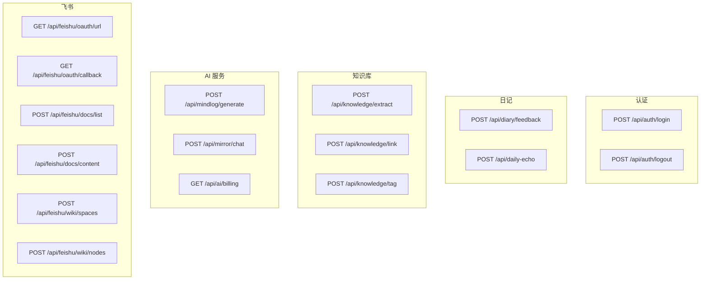
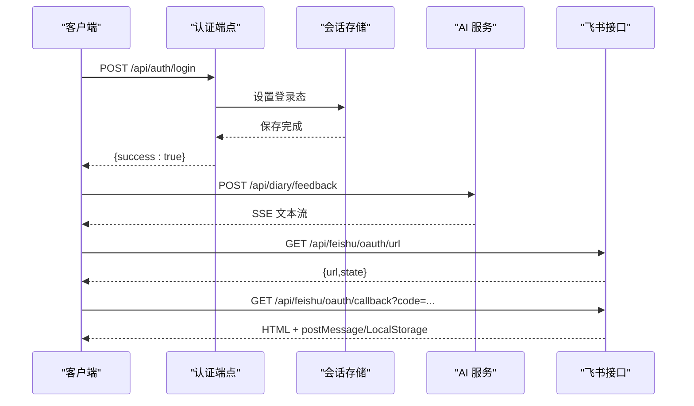
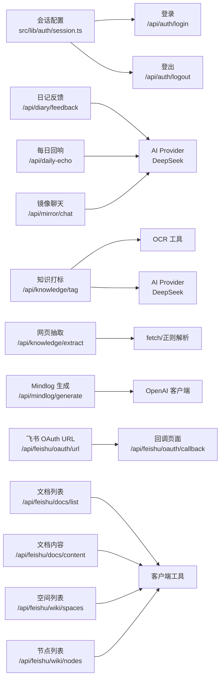

# API 接口文档

<cite>
**本文引用的文件**
- [src/app/api/auth/login/route.ts](file://src/app/api/auth/login/route.ts)
- [src/app/api/auth/logout/route.ts](file://src/app/api/auth/logout/route.ts)
- [src/lib/auth/session.ts](file://src/lib/auth/session.ts)
- [src/app/api/diary/feedback/route.ts](file://src/app/api/diary/feedback/route.ts)
- [src/app/api/knowledge/extract/route.ts](file://src/app/api/knowledge/extract/route.ts)
- [src/app/api/knowledge/link/route.ts](file://src/app/api/knowledge/link/route.ts)
- [src/app/api/knowledge/tag/route.ts](file://src/app/api/knowledge/tag/route.ts)
- [src/app/api/mindlog/generate/route.ts](file://src/app/api/mindlog/generate/route.ts)
- [src/app/api/daily-echo/route.ts](file://src/app/api/daily-echo/route.ts)
- [src/app/api/mirror/chat/route.ts](file://src/app/api/mirror/chat/route.ts)
- [src/app/api/ai/billing/route.ts](file://src/app/api/ai/billing/route.ts)
- [src/app/api/feishu/oauth/url/route.ts](file://src/app/api/feishu/oauth/url/route.ts)
- [src/app/api/feishu/oauth/callback/route.ts](file://src/app/api/feishu/oauth/callback/route.ts)
- [src/app/api/feishu/docs/content/route.ts](file://src/app/api/feishu/docs/content/route.ts)
- [src/app/api/feishu/docs/list/route.ts](file://src/app/api/feishu/docs/list/route.ts)
- [src/app/api/feishu/wiki/nodes/route.ts](file://src/app/api/feishu/wiki/nodes/route.ts)
- [src/app/api/feishu/wiki/spaces/route.ts](file://src/app/api/feishu/wiki/spaces/route.ts)
</cite>

## 目录
1. [简介](#简介)
2. [项目结构](#项目结构)
3. [核心组件](#核心组件)
4. [架构总览](#架构总览)
5. [详细组件分析](#详细组件分析)
6. [依赖关系分析](#依赖关系分析)
7. [性能与并发特性](#性能与并发特性)
8. [故障排查指南](#故障排查指南)
9. [结论](#结论)
10. [附录](#附录)

## 简介
本文件为 life-os 的 API 接口文档，覆盖认证、日记、知识库、AI 服务、飞书集成等模块的 RESTful 接口。文档包含：
- 端点列表与用途
- 请求/响应格式与参数说明
- HTTP 状态码与错误处理
- 使用场景与最佳实践
- 示例调用（以路径代替代码片段）
- 版本管理、速率限制与安全建议

## 项目结构
API 路由采用 Next.js App Router 的约定式路由，按功能域组织在 src/app/api 下，例如：
- 认证：/api/auth/login, /api/auth/logout
- 日记：/api/diary/feedback
- 知识库：/api/knowledge/extract, /api/knowledge/link, /api/knowledge/tag
- AI 服务：/api/mindlog/generate, /api/daily-echo, /api/mirror/chat, /api/ai/billing
- 飞书：/api/feishu/oauth/url, /api/feishu/oauth/callback, /api/feishu/docs/*, /api/feishu/wiki/*

图表来源
- [src/app/api/auth/login/route.ts:1-23](file://src/app/api/auth/login/route.ts#L1-L23)
- [src/app/api/auth/logout/route.ts:1-14](file://src/app/api/auth/logout/route.ts#L1-L14)
- [src/app/api/diary/feedback/route.ts:1-26](file://src/app/api/diary/feedback/route.ts#L1-L26)
- [src/app/api/daily-echo/route.ts:1-72](file://src/app/api/daily-echo/route.ts#L1-L72)
- [src/app/api/knowledge/extract/route.ts:1-64](file://src/app/api/knowledge/extract/route.ts#L1-L64)
- [src/app/api/knowledge/link/route.ts:1-29](file://src/app/api/knowledge/link/route.ts#L1-L29)
- [src/app/api/knowledge/tag/route.ts:1-70](file://src/app/api/knowledge/tag/route.ts#L1-L70)
- [src/app/api/mindlog/generate/route.ts:1-107](file://src/app/api/mindlog/generate/route.ts#L1-L107)
- [src/app/api/mirror/chat/route.ts:1-65](file://src/app/api/mirror/chat/route.ts#L1-L65)
- [src/app/api/ai/billing/route.ts:1-40](file://src/app/api/ai/billing/route.ts#L1-L40)
- [src/app/api/feishu/oauth/url/route.ts:1-16](file://src/app/api/feishu/oauth/url/route.ts#L1-L16)
- [src/app/api/feishu/oauth/callback/route.ts:1-135](file://src/app/api/feishu/oauth/callback/route.ts#L1-L135)
- [src/app/api/feishu/docs/list/route.ts:1-32](file://src/app/api/feishu/docs/list/route.ts#L1-L32)
- [src/app/api/feishu/docs/content/route.ts:1-26](file://src/app/api/feishu/docs/content/route.ts#L1-L26)
- [src/app/api/feishu/wiki/spaces/route.ts:1-30](file://src/app/api/feishu/wiki/spaces/route.ts#L1-L30)
- [src/app/api/feishu/wiki/nodes/route.ts:1-37](file://src/app/api/feishu/wiki/nodes/route.ts#L1-L37)

章节来源
- [src/app/api/auth/login/route.ts:1-23](file://src/app/api/auth/login/route.ts#L1-L23)
- [src/app/api/auth/logout/route.ts:1-14](file://src/app/api/auth/logout/route.ts#L1-L14)
- [src/app/api/diary/feedback/route.ts:1-26](file://src/app/api/diary/feedback/route.ts#L1-L26)
- [src/app/api/daily-echo/route.ts:1-72](file://src/app/api/daily-echo/route.ts#L1-L72)
- [src/app/api/knowledge/extract/route.ts:1-64](file://src/app/api/knowledge/extract/route.ts#L1-L64)
- [src/app/api/knowledge/link/route.ts:1-29](file://src/app/api/knowledge/link/route.ts#L1-L29)
- [src/app/api/knowledge/tag/route.ts:1-70](file://src/app/api/knowledge/tag/route.ts#L1-L70)
- [src/app/api/mindlog/generate/route.ts:1-107](file://src/app/api/mindlog/generate/route.ts#L1-L107)
- [src/app/api/mirror/chat/route.ts:1-65](file://src/app/api/mirror/chat/route.ts#L1-L65)
- [src/app/api/ai/billing/route.ts:1-40](file://src/app/api/ai/billing/route.ts#L1-L40)
- [src/app/api/feishu/oauth/url/route.ts:1-16](file://src/app/api/feishu/oauth/url/route.ts#L1-L16)
- [src/app/api/feishu/oauth/callback/route.ts:1-135](file://src/app/api/feishu/oauth/callback/route.ts#L1-L135)
- [src/app/api/feishu/docs/list/route.ts:1-32](file://src/app/api/feishu/docs/list/route.ts#L1-L32)
- [src/app/api/feishu/docs/content/route.ts:1-26](file://src/app/api/feishu/docs/content/route.ts#L1-L26)
- [src/app/api/feishu/wiki/spaces/route.ts:1-30](file://src/app/api/feishu/wiki/spaces/route.ts#L1-L30)
- [src/app/api/feishu/wiki/nodes/route.ts:1-37](file://src/app/api/feishu/wiki/nodes/route.ts#L1-L37)

## 核心组件
- 认证与会话：基于 IronSession 的会话存储，支持登录/登出与 Cookie 安全策略。
- 日记与回响：对日记内容进行流式 AI 生成反馈与“今日回响”总结。
- 知识库：网页内容抽取、知识打标与关联建议，支持图片 OCR。
- AI 服务：Mindlog 生成、镜像聊天、账单查询。
- 飞书集成：OAuth 授权、文档列表/内容、知识库空间/节点。

章节来源
- [src/lib/auth/session.ts:1-43](file://src/lib/auth/session.ts#L1-L43)
- [src/app/api/auth/login/route.ts:1-23](file://src/app/api/auth/login/route.ts#L1-L23)
- [src/app/api/auth/logout/route.ts:1-14](file://src/app/api/auth/logout/route.ts#L1-L14)
- [src/app/api/diary/feedback/route.ts:1-26](file://src/app/api/diary/feedback/route.ts#L1-L26)
- [src/app/api/daily-echo/route.ts:1-72](file://src/app/api/daily-echo/route.ts#L1-L72)
- [src/app/api/knowledge/extract/route.ts:1-64](file://src/app/api/knowledge/extract/route.ts#L1-L64)
- [src/app/api/knowledge/tag/route.ts:1-70](file://src/app/api/knowledge/tag/route.ts#L1-L70)
- [src/app/api/knowledge/link/route.ts:1-29](file://src/app/api/knowledge/link/route.ts#L1-L29)
- [src/app/api/mindlog/generate/route.ts:1-107](file://src/app/api/mindlog/generate/route.ts#L1-L107)
- [src/app/api/mirror/chat/route.ts:1-65](file://src/app/api/mirror/chat/route.ts#L1-L65)
- [src/app/api/ai/billing/route.ts:1-40](file://src/app/api/ai/billing/route.ts#L1-L40)
- [src/app/api/feishu/oauth/url/route.ts:1-16](file://src/app/api/feishu/oauth/url/route.ts#L1-L16)
- [src/app/api/feishu/oauth/callback/route.ts:1-135](file://src/app/api/feishu/oauth/callback/route.ts#L1-L135)
- [src/app/api/feishu/docs/list/route.ts:1-32](file://src/app/api/feishu/docs/list/route.ts#L1-L32)
- [src/app/api/feishu/docs/content/route.ts:1-26](file://src/app/api/feishu/docs/content/route.ts#L1-L26)
- [src/app/api/feishu/wiki/spaces/route.ts:1-30](file://src/app/api/feishu/wiki/spaces/route.ts#L1-L30)
- [src/app/api/feishu/wiki/nodes/route.ts:1-37](file://src/app/api/feishu/wiki/nodes/route.ts#L1-L37)

## 架构总览
API 层统一使用 Next.js App Router 的 route.ts 导出函数实现 REST 端点，部分端点启用 Node.js 运行时与最大执行时长以支持长时间流式输出。认证使用会话 Cookie，AI 服务通过 Provider 封装调用外部模型，飞书相关接口封装了客户端工具方法。

图表来源
- [src/app/api/auth/login/route.ts:1-23](file://src/app/api/auth/login/route.ts#L1-L23)
- [src/lib/auth/session.ts:1-43](file://src/lib/auth/session.ts#L1-L43)
- [src/app/api/diary/feedback/route.ts:1-26](file://src/app/api/diary/feedback/route.ts#L1-L26)
- [src/app/api/feishu/oauth/url/route.ts:1-16](file://src/app/api/feishu/oauth/url/route.ts#L1-L16)
- [src/app/api/feishu/oauth/callback/route.ts:1-135](file://src/app/api/feishu/oauth/callback/route.ts#L1-L135)

## 详细组件分析

### 认证接口
- 登录
  - 方法与路径：POST /api/auth/login
  - 功能：校验访问口令哈希，成功则写入会话 Cookie。
  - 请求体：{ password: string }
  - 成功响应：{ success: true }
  - 错误：
    - 400：请求体缺失或格式错误
    - 401：密码错误
  - 安全：Cookie 使用安全标志、HttpOnly、SameSite=Lax；生产环境启用 HTTPS。
- 登出
  - 方法与路径：POST /api/auth/logout
  - 功能：销毁会话。
  - 成功响应：{ ok: true }
  - 注意：移动端 UA 会使用更长的会话有效期。

章节来源
- [src/app/api/auth/login/route.ts:1-23](file://src/app/api/auth/login/route.ts#L1-L23)
- [src/app/api/auth/logout/route.ts:1-14](file://src/app/api/auth/logout/route.ts#L1-L14)
- [src/lib/auth/session.ts:1-43](file://src/lib/auth/session.ts#L1-L43)

### 日记与回响
- 日记反馈（流式）
  - 方法与路径：POST /api/diary/feedback
  - 输入：{ content: string, moodTags?: string[] }
  - 输出：SSE 文本流，分片包含增量文本与结束标记。
  - 限制：content 非空；运行时 Node.js，最大执行时长 60 秒。
  - 错误：400（输入非法）、500（内部错误）、504（超时）
- 今日回响（非流式）
  - 方法与路径：POST /api/daily-echo
  - 输入：{ diaries: string[] }
  - 输出：{ echo: string }
  - 行为：读取 SSE 流并聚合为一句总结，去除引号与前缀。
  - 错误：400（无日记）、502（AI 错误）

章节来源
- [src/app/api/diary/feedback/route.ts:1-26](file://src/app/api/diary/feedback/route.ts#L1-L26)
- [src/app/api/daily-echo/route.ts:1-72](file://src/app/api/daily-echo/route.ts#L1-L72)

### 知识库接口
- 网页内容抽取
  - 方法与路径：POST /api/knowledge/extract
  - 输入：{ url: string }
  - 输出：{ title: string, content: string, url: string }
  - 行为：抓取网页，移除脚本样式标签，提取纯文本，限制长度。
  - 特殊：微信公众号需附加特定请求头；超时 10 秒。
  - 错误：400（URL 非法）、502（抓取失败）、500（内部错误）
- 知识打标（流式）
  - 方法与路径：POST /api/knowledge/tag
  - 输入：{ content?: string, title?: string, imageBase64?: string, existingTags?: string[], categories?: string[] }
  - 输出：SSE 文本流
  - 行为：支持图片 OCR 后再打标；校验图片大小上限；AI 服务未配置时返回 503。
  - 错误：400（内容为空）、413（图片过大）、500（AI 异常）、503（未配置）
- 知识关联（流式）
  - 方法与路径：POST /api/knowledge/link
  - 输入：{ newItem: any, existingItems: any[] }
  - 输出：SSE 文本流
  - 行为：根据新旧条目相似度给出关联建议。
  - 错误：400（输入非法），默认返回空链接数组

章节来源
- [src/app/api/knowledge/extract/route.ts:1-64](file://src/app/api/knowledge/extract/route.ts#L1-L64)
- [src/app/api/knowledge/tag/route.ts:1-70](file://src/app/api/knowledge/tag/route.ts#L1-L70)
- [src/app/api/knowledge/link/route.ts:1-29](file://src/app/api/knowledge/link/route.ts#L1-L29)

### AI 服务接口
- Mindlog 生成（流式）
  - 方法与路径：POST /api/mindlog/generate
  - 输入：{ type: 'daily'|'weekly'|'monthly', periodStart: string, periodEnd: string, data: object }
  - 输出：SSE 文本流，包含增量文本与完成标记。
  - 行为：按类型选择不同模型与 API Key；使用 DeepSeek Provider。
  - 错误：400（缺少参数或类型非法）、500（AI 调用失败）
- 镜像聊天（流式）
  - 方法与路径：POST /api/mirror/chat
  - 输入：{ message?: string, imageBase64?: string, history?: {role, content}[], userProfile?: string }
  - 输出：SSE 文本流
  - 行为：注入用户画像；支持历史对话上下文；图片走 OCR 后分析。
  - 错误：400（消息为空）、500（AI 服务调用失败）
- AI 账单查询
  - 方法与路径：GET /api/ai/billing
  - 输出：{ available: boolean, data?: any, consoleUrl?: string }
  - 行为：优先尝试 credit_grants，否则订阅端点；失败返回控制台地址。

章节来源
- [src/app/api/mindlog/generate/route.ts:1-107](file://src/app/api/mindlog/generate/route.ts#L1-L107)
- [src/app/api/mirror/chat/route.ts:1-65](file://src/app/api/mirror/chat/route.ts#L1-L65)
- [src/app/api/ai/billing/route.ts:1-40](file://src/app/api/ai/billing/route.ts#L1-L40)

### 飞书集成接口
- OAuth 授权链接
  - 方法与路径：GET /api/feishu/oauth/url
  - 输出：{ url: string, state: string }
  - 行为：生成授权 URL 并返回 state，用于回调校验。
  - 错误：500（内部错误）
- OAuth 回调
  - 方法与路径：GET /api/feishu/oauth/callback
  - 输入：code, state, error
  - 输出：HTML 页面 + postMessage + localStorage 双通道回传令牌
  - 行为：兼容新旧字段命名；校验必填字段；计算过期时间；自动关闭窗口。
  - 错误：400（缺少授权码/换取失败）、500（内部错误）
- 文档列表
  - 方法与路径：POST /api/feishu/docs/list
  - 输入：{ userAccessToken: string, pageToken?: string, folderToken?: string, pageSize?: number }
  - 输出：列表数据
  - 错误：400（缺少参数/接口返回错误）、500（内部错误）
- 文档内容
  - 方法与路径：POST /api/feishu/docs/content
  - 输入：{ userAccessToken: string, docToken: string }
  - 输出：{ content: string }
  - 错误：400（缺少参数/接口返回错误）、500（内部错误）
- 知识库空间
  - 方法与路径：POST /api/feishu/wiki/spaces
  - 输入：{ userAccessToken: string, pageToken?: string, pageSize?: number }
  - 输出：空间列表
  - 错误：400（缺少参数/接口返回错误）、500（内部错误）
- 知识库节点
  - 方法与路径：POST /api/feishu/wiki/nodes
  - 输入：{ userAccessToken: string, spaceId: string, parentNodeToken?: string, pageToken?: string, pageSize?: number }
  - 输出：节点树
  - 错误：400（缺少参数/接口返回错误）、500（内部错误）

章节来源
- [src/app/api/feishu/oauth/url/route.ts:1-16](file://src/app/api/feishu/oauth/url/route.ts#L1-L16)
- [src/app/api/feishu/oauth/callback/route.ts:1-135](file://src/app/api/feishu/oauth/callback/route.ts#L1-L135)
- [src/app/api/feishu/docs/list/route.ts:1-32](file://src/app/api/feishu/docs/list/route.ts#L1-L32)
- [src/app/api/feishu/docs/content/route.ts:1-26](file://src/app/api/feishu/docs/content/route.ts#L1-L26)
- [src/app/api/feishu/wiki/spaces/route.ts:1-30](file://src/app/api/feishu/wiki/spaces/route.ts#L1-L30)
- [src/app/api/feishu/wiki/nodes/route.ts:1-37](file://src/app/api/feishu/wiki/nodes/route.ts#L1-L37)

## 依赖关系分析
- 认证依赖 IronSession 与 Cookie 配置，移动端 UA 有额外会话策略。
- 日记与镜像聊天依赖 AI Provider（DeepSeek），Mindlog 使用 DeepSeek 模型。
- 知识库打标可选 OCR（PaddleOCR）；网页抽取依赖 fetch 与正则解析。
- 飞书接口依赖封装的客户端工具方法，回调页面通过 postMessage 与 localStorage 兜底。

图表来源
- [src/lib/auth/session.ts:1-43](file://src/lib/auth/session.ts#L1-L43)
- [src/app/api/auth/login/route.ts:1-23](file://src/app/api/auth/login/route.ts#L1-L23)
- [src/app/api/auth/logout/route.ts:1-14](file://src/app/api/auth/logout/route.ts#L1-L14)
- [src/app/api/diary/feedback/route.ts:1-26](file://src/app/api/diary/feedback/route.ts#L1-L26)
- [src/app/api/daily-echo/route.ts:1-72](file://src/app/api/daily-echo/route.ts#L1-L72)
- [src/app/api/knowledge/tag/route.ts:1-70](file://src/app/api/knowledge/tag/route.ts#L1-L70)
- [src/app/api/knowledge/extract/route.ts:1-64](file://src/app/api/knowledge/extract/route.ts#L1-L64)
- [src/app/api/mindlog/generate/route.ts:1-107](file://src/app/api/mindlog/generate/route.ts#L1-L107)
- [src/app/api/mirror/chat/route.ts:1-65](file://src/app/api/mirror/chat/route.ts#L1-L65)
- [src/app/api/feishu/oauth/url/route.ts:1-16](file://src/app/api/feishu/oauth/url/route.ts#L1-L16)
- [src/app/api/feishu/oauth/callback/route.ts:1-135](file://src/app/api/feishu/oauth/callback/route.ts#L1-L135)
- [src/app/api/feishu/docs/list/route.ts:1-32](file://src/app/api/feishu/docs/list/route.ts#L1-L32)
- [src/app/api/feishu/docs/content/route.ts:1-26](file://src/app/api/feishu/docs/content/route.ts#L1-L26)
- [src/app/api/feishu/wiki/spaces/route.ts:1-30](file://src/app/api/feishu/wiki/spaces/route.ts#L1-L30)
- [src/app/api/feishu/wiki/nodes/route.ts:1-37](file://src/app/api/feishu/wiki/nodes/route.ts#L1-L37)

## 性能与并发特性
- 流式输出：多处端点返回 SSE，前端应使用 EventSource 或流式读取器处理增量数据。
- 执行时长：部分端点设置 Node.js 运行时与最大执行时长（如 60 秒），避免冷启动与超时。
- 并发与限流：仓库未内置全局限流策略，建议在网关或边缘层实施速率限制。
- 缓存：今日回响端点内部做“一天级缓存”，前端可复用该策略减少重复请求。
- 资源限制：知识库打标对图片大小有限制，避免超大负载。

章节来源
- [src/app/api/diary/feedback/route.ts:1-26](file://src/app/api/diary/feedback/route.ts#L1-L26)
- [src/app/api/daily-echo/route.ts:1-72](file://src/app/api/daily-echo/route.ts#L1-L72)
- [src/app/api/knowledge/tag/route.ts:1-70](file://src/app/api/knowledge/tag/route.ts#L1-L70)
- [src/app/api/mindlog/generate/route.ts:1-107](file://src/app/api/mindlog/generate/route.ts#L1-L107)

## 故障排查指南
- 认证失败
  - 确认 ACCESS_PASSWORD_HASH 是否正确配置；检查会话 Cookie 是否随请求发送。
- AI 服务异常
  - 检查 DEEPSEEK_API_KEY/DEEPSEEK_PRO_API_KEY 是否有效；查看账单接口返回状态。
  - 若出现 503，确认 AI 服务可用性与配额。
- 飞书授权
  - 回调页面通过 postMessage 与 localStorage 双通道回传结果；若 opener 为空，可从本地存储读取。
  - 兼容新旧字段命名，若字段缺失，查看回调页面提示并截图反馈。
- 网页抽取失败
  - 检查 URL 是否以 http 开头；微信公众号需特殊请求头；注意 10 秒超时。
- SSE 读取
  - 确保前端正确解析 data: 行与 done/error 标记；必要时聚合完整文本后再渲染。

章节来源
- [src/app/api/auth/login/route.ts:1-23](file://src/app/api/auth/login/route.ts#L1-L23)
- [src/app/api/ai/billing/route.ts:1-40](file://src/app/api/ai/billing/route.ts#L1-L40)
- [src/app/api/feishu/oauth/callback/route.ts:1-135](file://src/app/api/feishu/oauth/callback/route.ts#L1-L135)
- [src/app/api/knowledge/extract/route.ts:1-64](file://src/app/api/knowledge/extract/route.ts#L1-L64)
- [src/app/api/diary/feedback/route.ts:1-26](file://src/app/api/diary/feedback/route.ts#L1-L26)

## 结论
本 API 文档覆盖了 life-os 的核心能力：认证、日记、知识库、AI 服务与飞书集成。建议在生产环境中：
- 在网关层实施速率限制与 IP 白名单
- 对敏感端点增加鉴权与 CORS 策略
- 前端妥善处理 SSE 流与错误重试
- 对外部依赖（AI、飞书）做好降级与监控

## 附录

### HTTP 状态码速查
- 200：成功（JSON 或 SSE）
- 400：请求参数错误或格式错误
- 401：未授权（认证失败）
- 413：请求实体过大
- 500：服务器内部错误
- 502：上游服务（抓取/外部 API）失败
- 503：服务不可用（AI 未配置）
- 504：上游超时

### 版本管理与兼容
- 当前 API 为一次性端点，未见版本前缀；建议后续引入 /v1 前缀并在变更时维护向后兼容。
- 飞书接口兼容新旧字段命名，回调页面提供调试输出以便定位问题。

### 安全与合规
- 会话 Cookie：生产环境启用 secure；移动端会话有效期延长。
- 敏感参数：口令哈希、API Key 通过环境变量注入；避免在前端暴露。
- CORS：建议在网关层统一配置允许的来源与方法。

### 示例调用（以路径代替代码）
- 登录
  - curl -X POST https://your-host/api/auth/login -H "Content-Type: application/json" -d '{"password":"..."}'
  - 参考路径：[登录端点:1-23](file://src/app/api/auth/login/route.ts#L1-L23)
- 获取飞书授权链接
  - curl https://your-host/api/feishu/oauth/url
  - 参考路径：[OAuth URL:1-16](file://src/app/api/feishu/oauth/url/route.ts#L1-L16)
- 获取飞书文档列表
  - curl -X POST https://your-host/api/feishu/docs/list -H "Content-Type: application/json" -d '{"userAccessToken":"..."}'
  - 参考路径：[文档列表:1-32](file://src/app/api/feishu/docs/list/route.ts#L1-L32)
- Mindlog 生成
  - curl -X POST https://your-host/api/mindlog/generate -H "Content-Type: application/json" -d '{"type":"daily","periodStart":"...","periodEnd":"...","data":{}}'
  - 参考路径：[Mindlog 生成:1-107](file://src/app/api/mindlog/generate/route.ts#L1-L107)