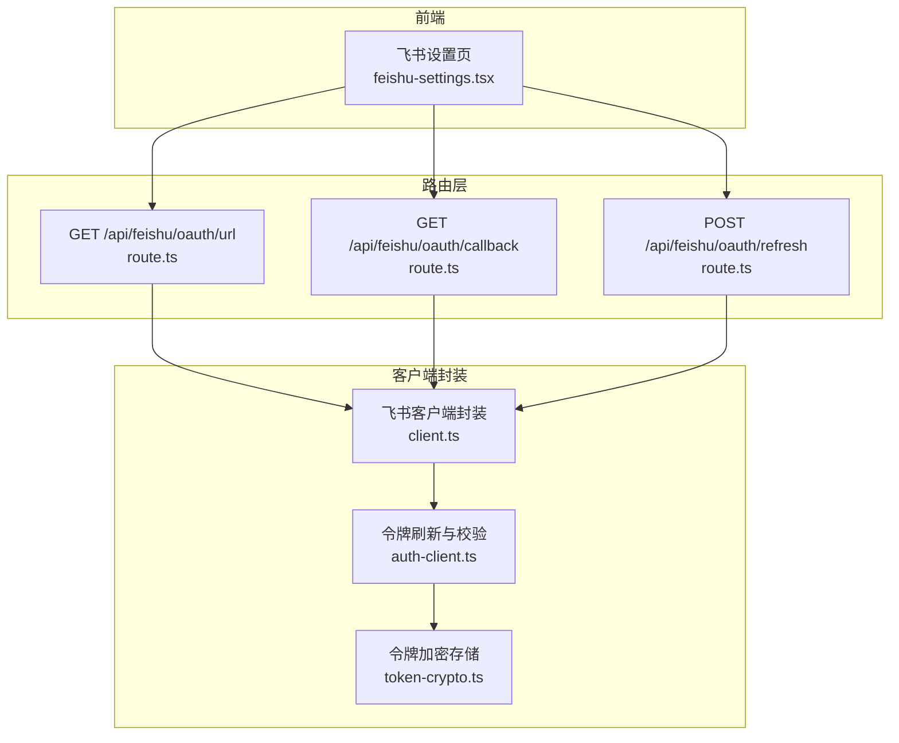
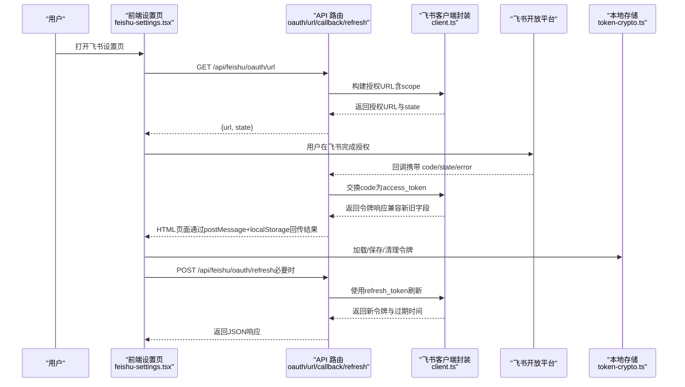
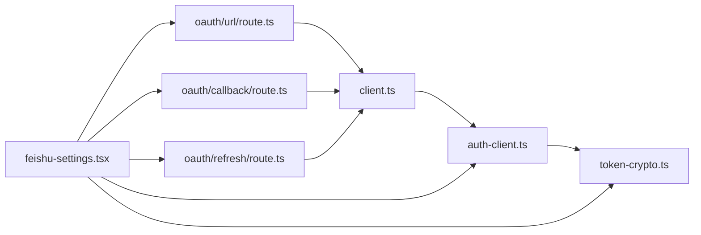
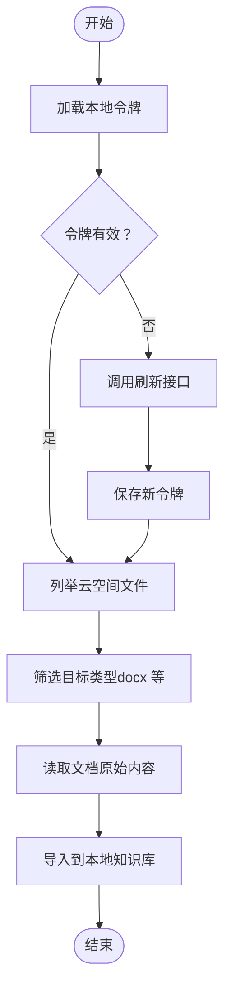

# 外部服务接口

<cite>
**本文引用的文件**
- [src/app/api/feishu/oauth/url/route.ts](file://src/app/api/feishu/oauth/url/route.ts)
- [src/app/api/feishu/oauth/callback/route.ts](file://src/app/api/feishu/oauth/callback/route.ts)
- [src/app/api/feishu/oauth/refresh/route.ts](file://src/app/api/feishu/oauth/refresh/route.ts)
- [src/lib/feishu/client.ts](file://src/lib/feishu/client.ts)
- [src/lib/feishu/token-crypto.ts](file://src/lib/feishu/token-crypto.ts)
- [src/lib/feishu/auth-client.ts](file://src/lib/feishu/auth-client.ts)
- [src/components/settings/feishu-settings.tsx](file://src/components/settings/feishu-settings.tsx)
</cite>

## 目录
1. [简介](#简介)
2. [项目结构](#项目结构)
3. [核心组件](#核心组件)
4. [架构总览](#架构总览)
5. [详细组件分析](#详细组件分析)
6. [依赖关系分析](#依赖关系分析)
7. [性能考虑](#性能考虑)
8. [故障排查指南](#故障排查指南)
9. [结论](#结论)
10. [附录](#附录)

## 简介
本文件面向外部服务集成接口，聚焦飞书（企业微信生态）OAuth 认证、令牌刷新、文档与知识库内容导入等能力，提供完整的 API 规范、数据同步机制、第三方 API 集成方式、错误重试策略、数据转换与兼容性处理，以及扩展新外部服务集成的最佳实践。读者无需深入技术背景即可理解整体流程与配置要点。

## 项目结构
围绕“外部服务接口”的实现，主要涉及以下层次：
- 路由层：Next.js App Router 的 API 路由，负责接收请求、组织响应。
- 客户端封装层：对飞书开放平台 API 的统一封装，包括授权、令牌交换与刷新、文件与知识库查询。
- 本地存储与安全层：基于 IndexedDB 的令牌持久化与加解密，保障跨浏览器环境的安全性。
- 前端设置页：提供飞书授权入口、连接状态展示与导入操作触发。

图表来源
- [src/app/api/feishu/oauth/url/route.ts:1-16](file://src/app/api/feishu/oauth/url/route.ts#L1-L16)
- [src/app/api/feishu/oauth/callback/route.ts:1-135](file://src/app/api/feishu/oauth/callback/route.ts#L1-L135)
- [src/app/api/feishu/oauth/refresh/route.ts:1-29](file://src/app/api/feishu/oauth/refresh/route.ts#L1-L29)
- [src/lib/feishu/client.ts:1-324](file://src/lib/feishu/client.ts#L1-L324)
- [src/lib/feishu/auth-client.ts:43-62](file://src/lib/feishu/auth-client.ts#L43-L62)
- [src/lib/feishu/token-crypto.ts:70-120](file://src/lib/feishu/token-crypto.ts#L70-L120)
- [src/components/settings/feishu-settings.tsx:1-38](file://src/components/settings/feishu-settings.tsx#L1-L38)

章节来源
- [src/app/api/feishu/oauth/url/route.ts:1-16](file://src/app/api/feishu/oauth/url/route.ts#L1-L16)
- [src/app/api/feishu/oauth/callback/route.ts:1-135](file://src/app/api/feishu/oauth/callback/route.ts#L1-L135)
- [src/app/api/feishu/oauth/refresh/route.ts:1-29](file://src/app/api/feishu/oauth/refresh/route.ts#L1-L29)
- [src/lib/feishu/client.ts:1-324](file://src/lib/feishu/client.ts#L1-L324)
- [src/lib/feishu/token-crypto.ts:70-120](file://src/lib/feishu/token-crypto.ts#L70-L120)
- [src/lib/feishu/auth-client.ts:43-62](file://src/lib/feishu/auth-client.ts#L43-L62)
- [src/components/settings/feishu-settings.tsx:1-38](file://src/components/settings/feishu-settings.tsx#L1-L38)

## 核心组件
- 飞书 OAuth 授权 URL 生成：返回授权链接与一次性 state，供前端弹窗或跳转发起授权。
- OAuth 回调处理：接收飞书回调中的 code/state/error，换取用户访问令牌，并通过 postMessage 与 localStorage 双通道回传结果。
- 令牌刷新：接收 refresh_token，调用飞书刷新接口，返回新的访问令牌与过期时间。
- 飞书客户端封装：统一构建授权 URL、换取令牌、刷新令牌、列举云空间文件、读取 docx 原始内容、列举知识空间与节点。
- 令牌持久化与安全：基于 IndexedDB 的加密存储，支持加载、保存、清理；跨浏览器环境变更时自动失效并提示重新授权。
- 前端设置页：展示授权状态、触发授权、执行文档/知识库导入。

章节来源
- [src/app/api/feishu/oauth/url/route.ts:1-16](file://src/app/api/feishu/oauth/url/route.ts#L1-L16)
- [src/app/api/feishu/oauth/callback/route.ts:1-135](file://src/app/api/feishu/oauth/callback/route.ts#L1-L135)
- [src/app/api/feishu/oauth/refresh/route.ts:1-29](file://src/app/api/feishu/oauth/refresh/route.ts#L1-L29)
- [src/lib/feishu/client.ts:1-324](file://src/lib/feishu/client.ts#L1-L324)
- [src/lib/feishu/token-crypto.ts:70-120](file://src/lib/feishu/token-crypto.ts#L70-L120)
- [src/lib/feishu/auth-client.ts:43-62](file://src/lib/feishu/auth-client.ts#L43-L62)
- [src/components/settings/feishu-settings.tsx:1-38](file://src/components/settings/feishu-settings.tsx#L1-L38)

## 架构总览
下图展示了从前端到飞书开放平台的端到端调用链路，以及本地令牌存储与刷新机制：

图表来源
- [src/app/api/feishu/oauth/url/route.ts:1-16](file://src/app/api/feishu/oauth/url/route.ts#L1-L16)
- [src/app/api/feishu/oauth/callback/route.ts:1-135](file://src/app/api/feishu/oauth/callback/route.ts#L1-L135)
- [src/app/api/feishu/oauth/refresh/route.ts:1-29](file://src/app/api/feishu/oauth/refresh/route.ts#L1-L29)
- [src/lib/feishu/client.ts:1-324](file://src/lib/feishu/client.ts#L1-L324)
- [src/lib/feishu/token-crypto.ts:70-120](file://src/lib/feishu/token-crypto.ts#L70-L120)

## 详细组件分析

### 飞书 OAuth 授权 URL 生成
- 功能：生成飞书授权链接与一次性 state，前端弹窗或跳转发起授权。
- 关键点：
  - 使用服务端运行时，避免泄露密钥。
  - 构建授权 URL 时注入 app_id、redirect_uri、response_type、state、scope。
  - scope 包含基础身份、云文档正文、云空间、多维/表格/幻灯、知识库等权限集合。
- 请求与响应：
  - 方法：GET
  - 成功响应：{ url, state }
  - 错误响应：{ error }，HTTP 500

章节来源
- [src/app/api/feishu/oauth/url/route.ts:1-16](file://src/app/api/feishu/oauth/url/route.ts#L1-L16)
- [src/lib/feishu/client.ts:104-143](file://src/lib/feishu/client.ts#L104-L143)

### OAuth 回调处理（code -> token）
- 功能：接收飞书回调，换取用户访问令牌，并通过 postMessage 与 localStorage 双通道回传结果。
- 关键点：
  - 兼容飞书 2024+ 新旧两代响应字段命名差异（如 refresh_expires_in、message）。
  - 校验返回字段完整性，缺失时返回截断后的原始响应以便用户反馈。
  - 计算 accessExpiresAt 与 refreshExpiresAt 并打包 payload。
  - HTML 页面内脚本尝试向 opener 发送消息，同时写入 localStorage 作为同源兜底。
- 请求与响应：
  - 方法：GET
  - 查询参数：code、state、error
  - 成功响应：HTML 页面，包含 postMessage 与 localStorage 写入逻辑
  - 错误响应：HTML 页面，提示授权被拒绝或缺少授权码

章节来源
- [src/app/api/feishu/oauth/callback/route.ts:1-135](file://src/app/api/feishu/oauth/callback/route.ts#L1-L135)
- [src/lib/feishu/client.ts:35-67](file://src/lib/feishu/client.ts#L35-L67)

### 令牌刷新
- 功能：使用 refresh_token 刷新用户访问令牌。
- 关键点：
  - 服务端调用飞书刷新接口，返回新的 access_token、refresh_token、expires_in、refresh_token_expires_in、scope。
  - 计算新的过期时间并返回。
- 请求与响应：
  - 方法：POST
  - 请求体：{ refreshToken }
  - 成功响应：{ accessToken, refreshToken, accessExpiresAt, refreshExpiresAt, scope }
  - 错误响应：{ error, code }，HTTP 400 或 500

章节来源
- [src/app/api/feishu/oauth/refresh/route.ts:1-29](file://src/app/api/feishu/oauth/refresh/route.ts#L1-L29)
- [src/lib/feishu/client.ts:184-196](file://src/lib/feishu/client.ts#L184-L196)

### 飞书客户端封装（服务端）
- 功能：统一封装飞书开放平台 API，包括授权、令牌交换与刷新、文件与知识库查询。
- 关键接口与职责：
  - 构建授权 URL：注入 app_id、redirect_uri、response_type、state、scope。
  - 获取 app_access_token：内部认证阶段使用。
  - 交换用户令牌：code -> access_token。
  - 刷新用户令牌：refresh_token -> 新 access_token。
  - 列举云空间文件：支持分页与目录过滤。
  - 读取 docx 原始内容：按文档 token 获取纯文本内容。
  - 列举知识空间与节点：支持分页与层级过滤。
- 数据模型（节选）：
  - 飞书令牌响应：code、msg/message、data（access_token、token_type、expires_in、refresh_token、refresh_token_expires_in/refresh_expires_in、scope）。
  - 文件列表响应：code、msg、data（files[], next_page_token?, has_more）。
  - 知识空间/节点响应：code、msg、data（items[], page_token?, has_more）。

章节来源
- [src/lib/feishu/client.ts:1-324](file://src/lib/feishu/client.ts#L1-L324)

### 令牌持久化与安全（IndexedDB + 加解密）
- 功能：在本地安全地存储飞书令牌，支持加载、保存、清理；跨浏览器环境变更时自动失效。
- 关键点：
  - 使用 IndexedDB 对令牌进行加密存储，键为 current。
  - 加载失败（如浏览器指纹变化）时返回空，引导用户重新授权。
  - 提供 clear 接口清理本地令牌。
- 数据模型：
  - 令牌记录：accessToken、refreshToken、accessExpiresAt（ISO）、refreshExpiresAt（ISO）、scope。

章节来源
- [src/lib/feishu/token-crypto.ts:70-120](file://src/lib/feishu/token-crypto.ts#L70-L120)

### 令牌刷新与可用性校验（前端）
- 功能：在前端侧确保令牌有效，必要时调用服务端刷新接口并更新本地存储。
- 关键点：
  - 若本地令牌不可用或过期，调用服务端刷新接口获取新令牌。
  - 刷新成功后保存至本地存储，失败则清除本地令牌并返回 null。
  - 提供 isAuthorized 判断是否已授权。

章节来源
- [src/lib/feishu/auth-client.ts:43-62](file://src/lib/feishu/auth-client.ts#L43-L62)

### 前端设置页（飞书）
- 功能：展示飞书授权状态、触发授权流程、执行文档/知识库导入。
- 关键点：
  - 通过本地存储读取授权状态与过期时间。
  - 触发授权、导入文档与知识库时，结合前端与服务端流程协同工作。

章节来源
- [src/components/settings/feishu-settings.tsx:1-38](file://src/components/settings/feishu-settings.tsx#L1-L38)

## 依赖关系分析
- 路由层依赖客户端封装层提供的授权 URL 构建与令牌交换/刷新函数。
- 客户端封装层依赖环境变量（app_id、app_secret、redirect_uri）与飞书开放平台接口。
- 本地存储层为前端与服务端提供一致的令牌持久化能力，增强跨浏览器环境的兼容性。
- 前端设置页依赖本地存储与服务端 API，协调授权与导入流程。

图表来源
- [src/app/api/feishu/oauth/url/route.ts:1-16](file://src/app/api/feishu/oauth/url/route.ts#L1-L16)
- [src/app/api/feishu/oauth/callback/route.ts:1-135](file://src/app/api/feishu/oauth/callback/route.ts#L1-L135)
- [src/app/api/feishu/oauth/refresh/route.ts:1-29](file://src/app/api/feishu/oauth/refresh/route.ts#L1-L29)
- [src/lib/feishu/client.ts:1-324](file://src/lib/feishu/client.ts#L1-L324)
- [src/lib/feishu/auth-client.ts:43-62](file://src/lib/feishu/auth-client.ts#L43-L62)
- [src/lib/feishu/token-crypto.ts:70-120](file://src/lib/feishu/token-crypto.ts#L70-L120)
- [src/components/settings/feishu-settings.tsx:1-38](file://src/components/settings/feishu-settings.tsx#L1-L38)

## 性能考虑
- 令牌获取与刷新采用服务端直连飞书开放平台，避免在客户端暴露敏感信息。
- 列举文件与知识库接口支持分页参数，建议在前端按需加载，减少单次请求数据量。
- 本地存储采用 IndexedDB，容量与性能优于 localStorage，适合存储令牌等结构化数据。
- HTML 回调页面内脚本尽量轻量，避免阻塞主流程；postMessage 与 localStorage 双通道确保在不同浏览器环境下都能回传结果。

## 故障排查指南
- 授权失败或缺少授权码：
  - 检查回调 URL 中是否包含 code、state、error 参数。
  - 若 error 存在，按错误原因处理；若缺少 code，提示用户重新授权。
- 令牌字段异常：
  - 回调接口会返回截断后的原始响应，便于截图反馈问题。
  - 确认飞书后台权限配置与 scope 一致。
- 令牌刷新失败：
  - 检查 refresh_token 是否存在且未过期。
  - 服务端返回 code 非 0 或 data 为空时，需提示用户重新授权。
- 浏览器环境变更导致解密失败：
  - 本地存储层会自动清理无效令牌，引导用户重新授权。
- 跨域/跨源问题：
  - 回调页面通过 postMessage + localStorage 双通道回传结果，降低因 window.opener 为空导致的丢失风险。

章节来源
- [src/app/api/feishu/oauth/callback/route.ts:17-84](file://src/app/api/feishu/oauth/callback/route.ts#L17-L84)
- [src/app/api/feishu/oauth/refresh/route.ts:8-27](file://src/app/api/feishu/oauth/refresh/route.ts#L8-L27)
- [src/lib/feishu/token-crypto.ts:111-115](file://src/lib/feishu/token-crypto.ts#L111-L115)

## 结论
该外部服务接口以飞书为核心，提供了完整的 OAuth 授权、令牌交换与刷新、文件与知识库内容读取能力，并通过本地加密存储与双通道回调机制提升了安全性与兼容性。整体设计遵循最小暴露面原则（服务端直连第三方平台），并通过分页与字段兼容策略优化了性能与稳定性。后续扩展其他外部服务时，可复用该架构模式：路由层、客户端封装层、本地存储与前端设置页的清晰分层，有助于快速集成与维护。

## 附录

### 配置参数清单
- 环境变量（服务端）
  - FEISHU_APP_ID：飞书应用 ID
  - FEISHU_APP_SECRET：飞书应用密钥
  - FEISHU_REDIRECT_URI：飞书授权回调地址
- 前端
  - 飞书设置页：展示授权状态、触发授权、导入文档/知识库

章节来源
- [src/lib/feishu/client.ts:98-102](file://src/lib/feishu/client.ts#L98-L102)
- [src/lib/feishu/client.ts:104-143](file://src/lib/feishu/client.ts#L104-L143)
- [src/components/settings/feishu-settings.tsx:1-38](file://src/components/settings/feishu-settings.tsx#L1-L38)

### API 规范摘要
- GET /api/feishu/oauth/url
  - 功能：生成授权链接与 state
  - 响应：{ url, state }
- GET /api/feishu/oauth/callback
  - 功能：处理授权回调，换取令牌并回传结果
  - 响应：HTML 页面（postMessage + localStorage）
- POST /api/feishu/oauth/refresh
  - 功能：使用 refresh_token 刷新令牌
  - 请求体：{ refreshToken }
  - 响应：{ accessToken, refreshToken, accessExpiresAt, refreshExpiresAt, scope }

章节来源
- [src/app/api/feishu/oauth/url/route.ts:6-15](file://src/app/api/feishu/oauth/url/route.ts#L6-L15)
- [src/app/api/feishu/oauth/callback/route.ts:11-84](file://src/app/api/feishu/oauth/callback/route.ts#L11-L84)
- [src/app/api/feishu/oauth/refresh/route.ts:6-28](file://src/app/api/feishu/oauth/refresh/route.ts#L6-L28)

### 数据同步与导入流程（概念示意）

[此图为概念流程示意，不直接映射具体源文件，故无图表来源]