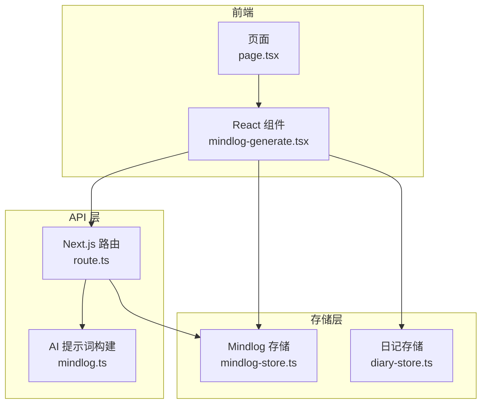
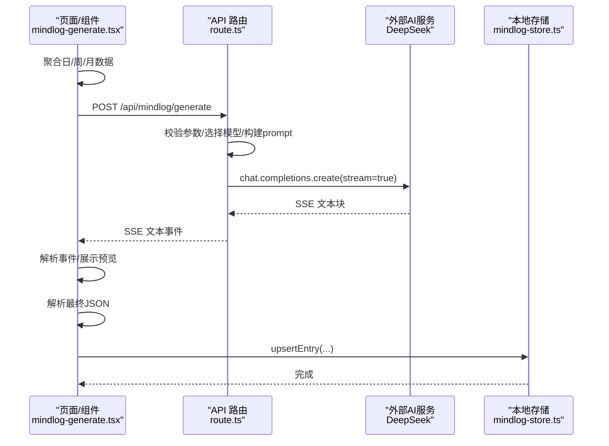
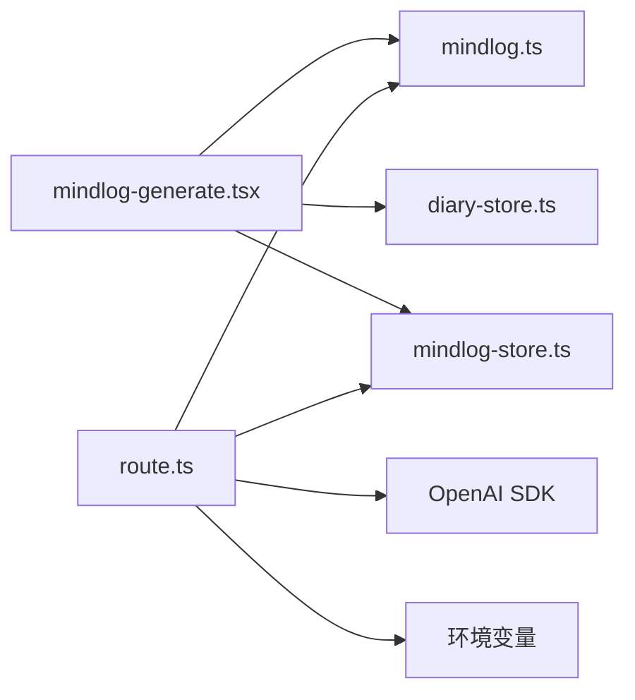

# 心智日志接口

<cite>
**本文引用的文件列表**
- [route.ts](file://src/app/api/mindlog/generate/route.ts)
- [mindlog-generate.tsx](file://src/components/mindlog/mindlog-generate.tsx)
- [mindlog.ts](file://src/lib/ai/prompts/mindlog.ts)
- [mindlog-store.ts](file://src/lib/storage/mindlog-store.ts)
- [page.tsx](file://src/app/(main)/mindlog/page.tsx)
- [diary-store.ts](file://src/lib/storage/diary-store.ts)
</cite>

## 目录
1. [简介](#简介)
2. [项目结构](#项目结构)
3. [核心组件](#核心组件)
4. [架构总览](#架构总览)
5. [详细组件分析](#详细组件分析)
6. [依赖关系分析](#依赖关系分析)
7. [性能考量](#性能考量)
8. [故障排查指南](#故障排查指南)
9. [结论](#结论)

## 简介
本文件为“心智日志生成”RESTful API的完整技术文档，覆盖请求参数、生成选项、输出格式、流式响应处理、时间维度聚合策略、AI模型选择、调用示例、错误处理、超时管理与性能优化建议，并解释AI生成过程的技术实现与配置要点。该接口支持按日、周、月三种时间维度生成结构化的心智日志，前端通过Server-Sent Events（SSE）流式接收AI输出，最终将解析后的JSON写入本地IndexedDB。

## 项目结构
心智日志相关模块分布于三层：
- API层：Next.js App Router路由，负责接收请求、构建prompt、调用外部AI服务并返回SSE流。
- 组件层：React客户端组件，负责数据聚合、发起请求、解析SSE、保存结果。
- 存储层：IndexedDB封装，提供mindlog条目的增删改查与去重更新。

图表来源
- [route.ts:1-107](file://src/app/api/mindlog/generate/route.ts#L1-L107)
- [mindlog-generate.tsx:1-436](file://src/components/mindlog/mindlog-generate.tsx#L1-L436)
- [mindlog.ts:1-191](file://src/lib/ai/prompts/mindlog.ts#L1-L191)
- [mindlog-store.ts:1-95](file://src/lib/storage/mindlog-store.ts#L1-L95)
- [diary-store.ts:44-113](file://src/lib/storage/diary-store.ts#L44-L113)
- [page.tsx](file://src/app/(main)/mindlog/page.tsx#L1-L91)

章节来源
- [route.ts:1-107](file://src/app/api/mindlog/generate/route.ts#L1-L107)
- [mindlog-generate.tsx:1-436](file://src/components/mindlog/mindlog-generate.tsx#L1-L436)
- [mindlog.ts:1-191](file://src/lib/ai/prompts/mindlog.ts#L1-L191)
- [mindlog-store.ts:1-95](file://src/lib/storage/mindlog-store.ts#L1-L95)
- [diary-store.ts:44-113](file://src/lib/storage/diary-store.ts#L44-L113)
- [page.tsx](file://src/app/(main)/mindlog/page.tsx#L1-L91)

## 核心组件
- API路由：接收POST请求，校验参数，根据类型选择模型与API Key，构建prompt，调用外部OpenAI兼容服务，返回SSE流。
- React组件：聚合指定时间维度的数据，发起SSE请求，解析事件，展示预览，解析最终JSON并保存至本地数据库。
- 提示词构建：针对日/周/月三种维度定义系统提示与用户提示模板，确保输出结构化JSON。
- 存储：提供mindlog条目增删改查、按类型与时间段查询、upsert去重更新等能力。

章节来源
- [route.ts:15-51](file://src/app/api/mindlog/generate/route.ts#L15-L51)
- [mindlog-generate.tsx:10-15](file://src/components/mindlog/mindlog-generate.tsx#L10-L15)
- [mindlog.ts:26-191](file://src/lib/ai/prompts/mindlog.ts#L26-L191)
- [mindlog-store.ts:5-19](file://src/lib/storage/mindlog-store.ts#L5-L19)

## 架构总览
整体流程：前端组件聚合数据 → 发送POST到/api/mindlog/generate → API层构建prompt并调用外部AI → 以SSE流返回增量文本 → 前端解析事件并保存最终JSON → 写入IndexedDB。

图表来源
- [route.ts:22-106](file://src/app/api/mindlog/generate/route.ts#L22-L106)
- [mindlog-generate.tsx:35-123](file://src/components/mindlog/mindlog-generate.tsx#L35-L123)
- [mindlog-store.ts:84-94](file://src/lib/storage/mindlog-store.ts#L84-L94)

## 详细组件分析

### API 路由（/api/mindlog/generate）
- 请求方法：POST
- 请求体字段
  - type: 'daily' | 'weekly' | 'monthly'
  - periodStart: string（ISO日期）
  - periodEnd: string（ISO日期）
  - data: 对应类型的结构化数据（见下方类型定义）
- 响应：text/event-stream，事件类型包括
  - type='text'：增量文本片段
  - type='done'：完整文本（用于最终解析）
  - type='error'：错误消息
- 模型与密钥
  - daily：deepseek/deepseek-v4-flash，使用DEEPSEEK_API_KEY
  - weekly/monthly：deepseek/deepseek-v4-pro，使用DEEPSEEK_PRO_API_KEY
- 配置
  - baseURL：https://api.ofox.ai/v1
  - max_tokens：2048
  - temperature：0.7
  - runtime：nodejs
  - maxDuration：60秒

章节来源
- [route.ts:15-51](file://src/app/api/mindlog/generate/route.ts#L15-L51)
- [route.ts:30-35](file://src/app/api/mindlog/generate/route.ts#L30-L35)
- [route.ts:54-57](file://src/app/api/mindlog/generate/route.ts#L54-L57)
- [route.ts:65-74](file://src/app/api/mindlog/generate/route.ts#L65-L74)
- [route.ts:59-97](file://src/app/api/mindlog/generate/route.ts#L59-L97)
- [route.ts:99-106](file://src/app/api/mindlog/generate/route.ts#L99-L106)

### React 组件（MindlogGenerate）
- 功能
  - 自动触发生成（isGenerating=true时）
  - 聚合数据：按日/周/月维度从本地存储读取
  - 发起SSE请求，解析事件，展示预览
  - 解析最终JSON，保存至本地数据库
- 状态
  - idle/aggregating/streaming/saving/done
- 错误处理
  - 捕获AbortError（取消）
  - 捕获解析异常与网络错误，回调onError

章节来源
- [mindlog-generate.tsx:17-33](file://src/components/mindlog/mindlog-generate.tsx#L17-L33)
- [mindlog-generate.tsx:35-123](file://src/components/mindlog/mindlog-generate.tsx#L35-L123)
- [mindlog-generate.tsx:125-131](file://src/components/mindlog/mindlog-generate.tsx#L125-L131)

### 数据聚合（按时间维度）
- 日维度
  - 优先取昨日数据，若无则回退到当日
  - 聚合字段：date、diaries、knowledgeOps、creationArticles
- 周维度
  - 计算本周周一到周日
  - 聚合字段：weekStart、weekEnd、dailyMindlogs、diaryCount、knowledgeCount
- 月维度
  - 计算当月第一天到最后一天
  - 聚合字段：month、weeklyMindlogs、diaryCount、knowledgeCount、creationCount

章节来源
- [mindlog-generate.tsx:188-196](file://src/components/mindlog/mindlog-generate.tsx#L188-L196)
- [mindlog-generate.tsx:198-278](file://src/components/mindlog/mindlog-generate.tsx#L198-L278)
- [mindlog-generate.tsx:280-328](file://src/components/mindlog/mindlog-generate.tsx#L280-L328)
- [mindlog-generate.tsx:330-373](file://src/components/mindlog/mindlog-generate.tsx#L330-L373)

### 提示词构建（mindlog.ts）
- 日提示词：包含日期、日记内容、知识库操作、创作记录及统计
- 周提示词：包含周期、统计、每日mindlog摘要
- 月提示词：包含月份、统计、每周mindlog摘要
- 输出要求：严格JSON，包含keywords、content、dashboardSummary等字段

章节来源
- [mindlog.ts:28-62](file://src/lib/ai/prompts/mindlog.ts#L28-L62)
- [mindlog.ts:106-124](file://src/lib/ai/prompts/mindlog.ts#L106-L124)
- [mindlog.ts:150-168](file://src/lib/ai/prompts/mindlog.ts#L150-L168)
- [mindlog.ts:97-102](file://src/lib/ai/prompts/mindlog.ts#L97-L102)
- [mindlog.ts:141-146](file://src/lib/ai/prompts/mindlog.ts#L141-L146)
- [mindlog.ts:185-190](file://src/lib/ai/prompts/mindlog.ts#L185-L190)

### 存储（mindlog-store.ts）
- 数据模型：MindLogEntry
- 核心操作：addEntry、getEntry、getLatestByType、listByType、getByPeriod、upsertEntry
- 索引：按type、[type, periodStart]、createdAt建立索引，保证查询效率

章节来源
- [mindlog-store.ts:5-19](file://src/lib/storage/mindlog-store.ts#L5-L19)
- [mindlog-store.ts:28-46](file://src/lib/storage/mindlog-store.ts#L28-L46)
- [mindlog-store.ts:69-82](file://src/lib/storage/mindlog-store.ts#L69-L82)
- [mindlog-store.ts:84-94](file://src/lib/storage/mindlog-store.ts#L84-L94)

### 页面入口（page.tsx）
- 提供日/周/月生成入口，切换视图为生成态
- 生成完成后刷新报告视图

章节来源
- [page.tsx](file://src/app/(main)/mindlog/page.tsx#L23-L91)

## 依赖关系分析
- 组件依赖
  - mindlog-generate.tsx 依赖：diary-store、knowledge-store、mindlog-store、mindlog.ts 类型
- API依赖
  - route.ts 依赖：mindlog.ts 提示词构建、OpenAI SDK、环境变量（DEEPSEEK_API_KEY、DEEPSEEK_PRO_API_KEY）
- 存储依赖
  - mindlog-store.ts 使用 idb（IndexedDB）

图表来源
- [mindlog-generate.tsx:5-8](file://src/components/mindlog/mindlog-generate.tsx#L5-L8)
- [route.ts:1-10](file://src/app/api/mindlog/generate/route.ts#L1-L10)
- [mindlog-store.ts](file://src/lib/storage/mindlog-store.ts#L1)

章节来源
- [mindlog-generate.tsx:5-8](file://src/components/mindlog/mindlog-generate.tsx#L5-L8)
- [route.ts:1-10](file://src/app/api/mindlog/generate/route.ts#L1-L10)
- [mindlog-store.ts](file://src/lib/storage/mindlog-store.ts#L1)

## 性能考量
- 流式传输：SSE逐块推送，前端即时展示，降低首屏等待时间
- 本地存储：使用IndexedDB，避免频繁网络往返；upsert减少重复写入
- 限制读取数量：日/周/月聚合时限制读取条数，避免过大数据集影响性能
- 模型选择：日维度使用轻量模型，周/月使用更强模型，平衡成本与质量
- 超时控制：API层maxDuration=60s，前端fetch设置AbortController，防止长时间挂起

章节来源
- [route.ts:12-13](file://src/app/api/mindlog/generate/route.ts#L12-L13)
- [mindlog-generate.tsx:47-52](file://src/components/mindlog/mindlog-generate.tsx#L47-L52)
- [mindlog-generate.tsx:198-204](file://src/components/mindlog/mindlog-generate.tsx#L198-L204)
- [mindlog-generate.tsx:330-373](file://src/components/mindlog/mindlog-generate.tsx#L330-L373)

## 故障排查指南
- 常见错误
  - 缺少type或data字段：返回400
  - 无效type：返回400
  - SSE解析异常：前端捕获并展示错误
  - AI返回格式异常：前端抛出“无法解析”
  - 网络中断/超时：前端AbortController终止请求
- 建议
  - 检查DEEPSEEK_API_KEY与DEEPSEEK_PRO_API_KEY是否正确配置
  - 确认外部服务可达（baseURL）
  - 查看浏览器控制台与服务端日志定位问题
  - 在弱网环境下适当增加重试逻辑（参考通用重试工具）

章节来源
- [route.ts:26-28](file://src/app/api/mindlog/generate/route.ts#L26-L28)
- [route.ts:49-50](file://src/app/api/mindlog/generate/route.ts#L49-L50)
- [route.ts:89-92](file://src/app/api/mindlog/generate/route.ts#L89-L92)
- [mindlog-generate.tsx:118-122](file://src/components/mindlog/mindlog-generate.tsx#L118-L122)

## 结论
心智日志生成接口通过清晰的分层设计与SSE流式传输，实现了从本地数据聚合到AI生成再到本地持久化的完整闭环。日/周/月三种维度满足不同粒度的心智回顾需求，模型与参数配置兼顾成本与质量。建议在生产环境中结合重试与监控机制，持续优化用户体验与稳定性。