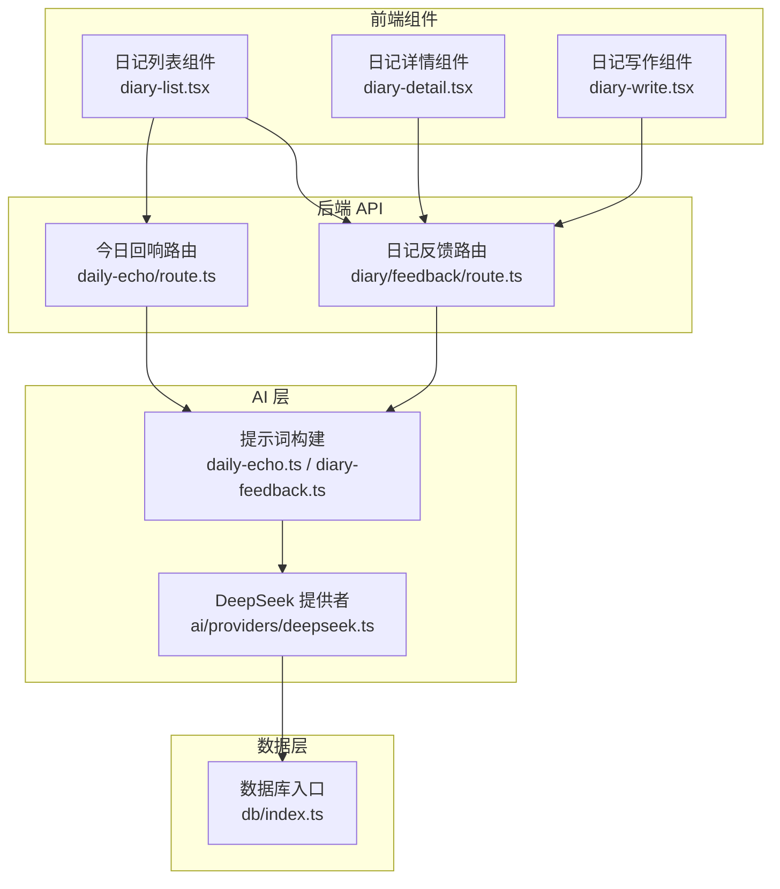
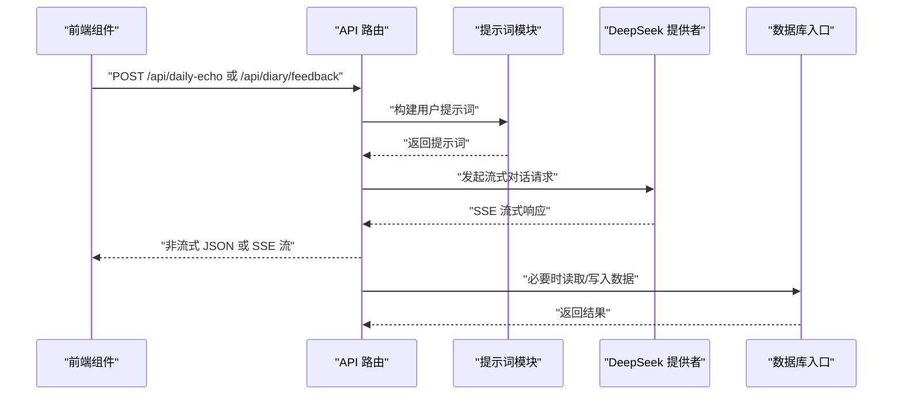
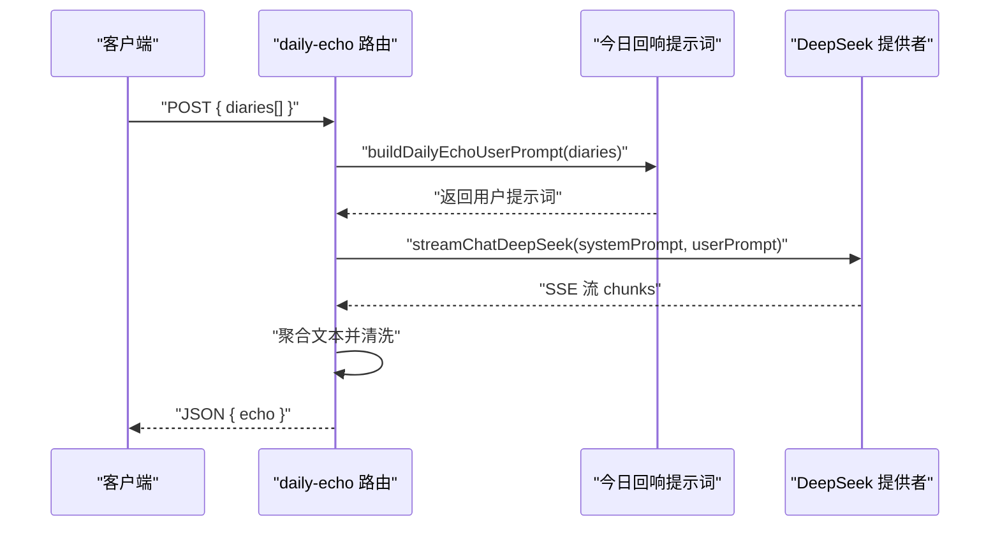
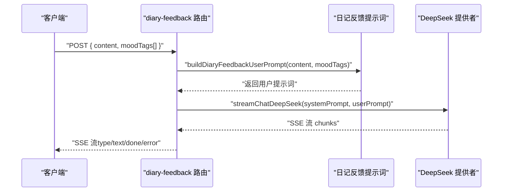
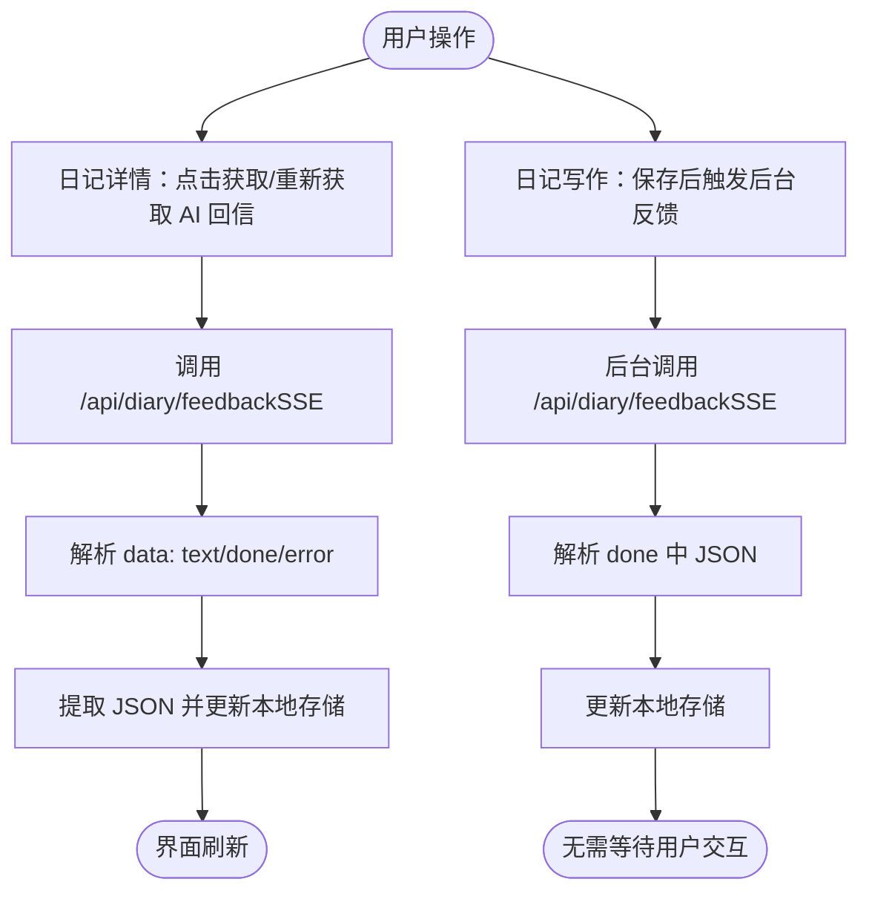
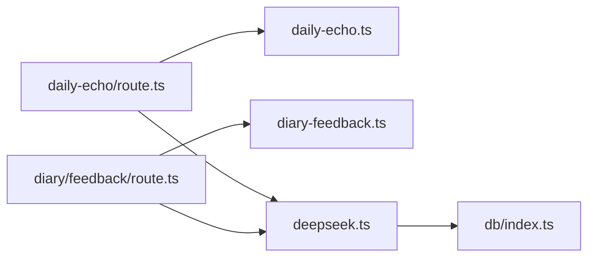

# 日记接口

<cite>
**本文引用的文件**
- [daily-echo 路由](file://src/app/api/daily-echo/route.ts)
- [diary-feedback 路由](file://src/app/api/diary/feedback/route.ts)
- [DeepSeek AI 提供者](file://src/lib/ai/providers/deepseek.ts)
- [今日回响提示词](file://src/lib/ai/prompts/daily-echo.ts)
- [日记反馈提示词](file://src/lib/ai/prompts/diary-feedback.ts)
- [数据库入口](file://src/lib/db/index.ts)
- [日记详情组件](file://src/components/diary/diary-detail.tsx)
- [日记列表组件](file://src/components/diary/diary-list.tsx)
- [日记写作组件](file://src/components/diary/diary-write.tsx)
</cite>

## 目录
1. [简介](#简介)
2. [项目结构](#项目结构)
3. [核心组件](#核心组件)
4. [架构总览](#架构总览)
5. [详细组件分析](#详细组件分析)
6. [依赖关系分析](#依赖关系分析)
7. [性能考量](#性能考量)
8. [故障排查指南](#故障排查指南)
9. [结论](#结论)
10. [附录](#附录)

## 简介
本文件为“日记管理接口”的完整 API 文档，聚焦于两类智能日记处理能力：
- 今日回响：从当日多篇日记中提炼一句最具价值的“回响”，用于每日沉淀与回顾。
- 日记反馈：基于日记内容生成“未来回音”（情感分析与反馈），支持情绪标签与主题提取。

文档覆盖请求/响应格式、参数校验、错误处理、数据安全、批量操作、搜索过滤与排序等实现细节，并通过时序图与类图展示端到端的数据流与交互。

## 项目结构
该系统采用 Next.js App Router 的 API 路由组织方式，AI 能力通过提示词与第三方模型服务对接，前端通过组件与 API 进行交互；数据库层通过 Drizzle ORM 访问 PostgreSQL。

图表来源
- [daily-echo 路由:1-72](file://src/app/api/daily-echo/route.ts#L1-L72)
- [diary-feedback 路由:1-26](file://src/app/api/diary/feedback/route.ts#L1-L26)
- [DeepSeek AI 提供者:1-58](file://src/lib/ai/providers/deepseek.ts#L1-L58)
- [今日回响提示词:1-39](file://src/lib/ai/prompts/daily-echo.ts#L1-L39)
- [日记反馈提示词:1-38](file://src/lib/ai/prompts/diary-feedback.ts#L1-L38)
- [数据库入口:1-11](file://src/lib/db/index.ts#L1-L11)

章节来源
- [daily-echo 路由:1-72](file://src/app/api/daily-echo/route.ts#L1-L72)
- [diary-feedback 路由:1-26](file://src/app/api/diary/feedback/route.ts#L1-L26)
- [DeepSeek AI 提供者:1-58](file://src/lib/ai/providers/deepseek.ts#L1-L58)
- [今日回响提示词:1-39](file://src/lib/ai/prompts/daily-echo.ts#L1-L39)
- [日记反馈提示词:1-38](file://src/lib/ai/prompts/diary-feedback.ts#L1-L38)
- [数据库入口:1-11](file://src/lib/db/index.ts#L1-L11)

## 核心组件
- 今日回响 API：接收当日多篇日记文本，返回一句精选“回响”。内部将 SSE 流聚合为最终文本，进行清洗与兜底策略。
- 日记反馈 API：接收单篇日记内容与情绪标签，返回流式 JSON，包含“未来回音”正文、情绪标签与主题。
- AI 提示词：分别定义系统角色、输出约束与 JSON 结构，确保输出稳定与可解析。
- 前端集成：列表、详情、写作三个组件分别调用对应 API，完成数据加载、编辑、保存与反馈刷新。

章节来源
- [daily-echo 路由:11-14](file://src/app/api/daily-echo/route.ts#L11-L14)
- [diary-feedback 路由:8-13](file://src/app/api/diary/feedback/route.ts#L8-L13)
- [DeepSeek AI 提供者:15-57](file://src/lib/ai/providers/deepseek.ts#L15-L57)
- [今日回响提示词:33-38](file://src/lib/ai/prompts/daily-echo.ts#L33-L38)
- [日记反馈提示词:30-37](file://src/lib/ai/prompts/diary-feedback.ts#L30-L37)

## 架构总览
下图展示了从前端到后端 API、再到 AI 服务与数据库的整体交互路径。

图表来源
- [daily-echo 路由:14-71](file://src/app/api/daily-echo/route.ts#L14-L71)
- [diary-feedback 路由:8-25](file://src/app/api/diary/feedback/route.ts#L8-L25)
- [DeepSeek AI 提供者:15-57](file://src/lib/ai/providers/deepseek.ts#L15-L57)
- [今日回响提示词:33-38](file://src/lib/ai/prompts/daily-echo.ts#L33-L38)
- [日记反馈提示词:30-37](file://src/lib/ai/prompts/diary-feedback.ts#L30-L37)
- [数据库入口:1-11](file://src/lib/db/index.ts#L1-L11)

## 详细组件分析

### 今日回响 API（/api/daily-echo）
- 功能概述：从当日多篇日记中挑选一句“今日回响”，若无法挑选则返回预设兜底语句。
- 请求方法与体：POST，请求体包含字符串数组 diaries。
- 成功响应：非流式 JSON，包含 echo 字段。
- 错误处理：
  - 参数缺失或为空：返回 400。
  - AI 错误：返回 502。
  - 输出为空：返回兜底语句。
- 数据处理流程：
  - 将 diaries 拼接为用户提示词。
  - 调用 DeepSeek 流式接口，读取 SSE 流直至 done。
  - 清洗输出（去引号、去前缀），若仍为空则返回兜底语句。

图表来源
- [daily-echo 路由:14-71](file://src/app/api/daily-echo/route.ts#L14-L71)
- [今日回响提示词:33-38](file://src/lib/ai/prompts/daily-echo.ts#L33-L38)
- [DeepSeek AI 提供者:15-57](file://src/lib/ai/providers/deepseek.ts#L15-L57)

章节来源
- [daily-echo 路由:11-14](file://src/app/api/daily-echo/route.ts#L11-L14)
- [daily-echo 路由:17-19](file://src/app/api/daily-echo/route.ts#L17-L19)
- [daily-echo 路由:21-22](file://src/app/api/daily-echo/route.ts#L21-L22)
- [daily-echo 路由:55-68](file://src/app/api/daily-echo/route.ts#L55-L68)
- [daily-echo 路由:64-70](file://src/app/api/daily-echo/route.ts#L64-L70)

### 日记反馈 API（/api/diary/feedback）
- 功能概述：基于单篇日记内容生成“未来回音”，同时输出情绪标签与主题。
- 请求方法与体：POST，请求体包含 content 与可选 moodTags。
- 成功响应：SSE 流，每条数据包含 type 与 content 字段；结束时 type 为 done。
- 错误处理：content 为空返回 400。
- 输出规范：系统提示词要求输出纯 JSON，前端解析并更新本地存储。

图表来源
- [diary-feedback 路由:8-25](file://src/app/api/diary/feedback/route.ts#L8-L25)
- [日记反馈提示词:30-37](file://src/lib/ai/prompts/diary-feedback.ts#L30-L37)
- [DeepSeek AI 提供者:15-57](file://src/lib/ai/providers/deepseek.ts#L15-L57)

章节来源
- [diary-feedback 路由:8-13](file://src/app/api/diary/feedback/route.ts#L8-L13)
- [diary-feedback 路由:15-16](file://src/app/api/diary/feedback/route.ts#L15-L16)
- [日记反馈提示词:16-27](file://src/lib/ai/prompts/diary-feedback.ts#L16-L27)

### AI 提示词与输出规范
- 今日回响提示词：
  - 系统提示词定义了“优先选择”“绝对不选”“硬规则”“输出约束”，确保输出为原文句子且简洁有力。
  - 用户提示词将多篇日记拼接为统一输入。
- 日记反馈提示词：
  - 系统提示词定义“未来自己”的角色与写信风格，强调共情与细节。
  - 输出为严格 JSON，包含 feedback、moodTags、keyThemes 三个字段。

章节来源
- [今日回响提示词:6-31](file://src/lib/ai/prompts/daily-echo.ts#L6-L31)
- [今日回响提示词:33-38](file://src/lib/ai/prompts/daily-echo.ts#L33-L38)
- [日记反馈提示词:1-28](file://src/lib/ai/prompts/diary-feedback.ts#L1-L28)
- [日记反馈提示词:30-37](file://src/lib/ai/prompts/diary-feedback.ts#L30-L37)

### 前端集成与数据流
- 日记详情页：
  - 支持编辑、删除、查看图片与 AI 回信卡片。
  - 点击“获取/重新获取 AI 回信”时，向 /api/diary/feedback 发起 SSE 请求，解析 done 事件中的 JSON 并更新本地存储。
- 日记列表页：
  - 支持按月历浏览、批量选择与批量删除。
  - 通过本地存储接口读取与删除日记条目。
- 日记写作页：
  - 保存后后台静默触发 /api/diary/feedback，解析并更新本地存储，不阻塞用户。

图表来源
- [日记详情组件:140-201](file://src/components/diary/diary-detail.tsx#L140-L201)
- [日记写作组件:24-79](file://src/components/diary/diary-write.tsx#L24-L79)

章节来源
- [日记详情组件:140-201](file://src/components/diary/diary-detail.tsx#L140-L201)
- [日记写作组件:24-79](file://src/components/diary/diary-write.tsx#L24-L79)

## 依赖关系分析
- API 路由依赖提示词模块与 AI 提供者。
- AI 提供者封装 OpenAI SDK，配置模型、温度、最大 token 等参数。
- 数据库入口通过 Drizzle ORM 连接 PostgreSQL，当前 API 未直接暴露数据库 CRUD 接口，主要通过前端本地存储与后端 AI 流程协作。

图表来源
- [daily-echo 路由:1-9](file://src/app/api/daily-echo/route.ts#L1-L9)
- [diary-feedback 路由:1-6](file://src/app/api/diary/feedback/route.ts#L1-L6)
- [DeepSeek AI 提供者:1-13](file://src/lib/ai/providers/deepseek.ts#L1-L13)
- [数据库入口:1-11](file://src/lib/db/index.ts#L1-L11)

章节来源
- [daily-echo 路由:1-9](file://src/app/api/daily-echo/route.ts#L1-L9)
- [diary-feedback 路由:1-6](file://src/app/api/diary/feedback/route.ts#L1-L6)
- [DeepSeek AI 提供者:1-13](file://src/lib/ai/providers/deepseek.ts#L1-L13)
- [数据库入口:1-11](file://src/lib/db/index.ts#L1-L11)

## 性能考量
- 流式处理：反馈 API 使用 SSE 流式输出，前端边接收边渲染，提升用户体验。
- 超时与运行时：API 明确设置运行时与最大执行时长，避免长时间占用资源。
- 缓存策略：今日回响返回单句总结，适合做“一天级缓存”，减少重复计算。
- 图片处理：前端对图片进行压缩后再上传，降低网络与存储压力。

章节来源
- [daily-echo 路由:8-9](file://src/app/api/daily-echo/route.ts#L8-L9)
- [diary-feedback 路由:5-6](file://src/app/api/diary/feedback/route.ts#L5-L6)
- [日记写作组件:115-137](file://src/components/diary/diary-write.tsx#L115-L137)

## 故障排查指南
- 参数校验失败：
  - 今日回响：diaries 缺失、非数组或长度为 0，返回 400。
  - 日记反馈：content 为空，返回 400。
- AI 错误：
  - 当 SSE 流中出现 error 类型事件时，API 返回 502。
- 输出解析异常：
  - 前端在解析 SSE 时忽略单条解析失败，保证整体流程不中断。
- 兜底策略：
  - 今日回响在无合适句子时返回预设兜底语句，确保始终有输出。

章节来源
- [daily-echo 路由:17-19](file://src/app/api/daily-echo/route.ts#L17-L19)
- [daily-echo 路由:46-48](file://src/app/api/daily-echo/route.ts#L46-L48)
- [daily-echo 路由:64-68](file://src/app/api/daily-echo/route.ts#L64-L68)
- [diary-feedback 路由:11-13](file://src/app/api/diary/feedback/route.ts#L11-L13)

## 结论
本系统通过明确的 API 规范与提示词约束，实现了“今日回响”与“日记反馈”的智能化处理。前端以组件形式无缝集成，后端以流式响应保障实时体验。建议后续扩展：
- 在后端增加日记的分页、搜索与排序接口，配合数据库层实现更丰富的检索能力。
- 对敏感内容进行脱敏与合规检查，确保数据安全。
- 优化缓存策略与并发控制，提升高负载场景下的稳定性。

## 附录

### API 定义与参数说明

- 今日回响（POST /api/daily-echo）
  - 请求体
    - diaries: string[]（必填，当日多篇日记文本）
  - 成功响应
    - echo: string（精选回响）
  - 错误码
    - 400：参数无效
    - 502：AI 服务错误

- 日记反馈（POST /api/diary/feedback）
  - 请求体
    - content: string（必填，日记全文）
    - moodTags: string[]（可选，情绪标签）
  - 成功响应
    - SSE 流，事件类型与内容：
      - type: "text" | "done" | "error"
      - content: string | undefined
  - 错误码
    - 400：content 为空
    - 502：AI 服务错误

章节来源
- [daily-echo 路由:11-14](file://src/app/api/daily-echo/route.ts#L11-L14)
- [daily-echo 路由:64-70](file://src/app/api/daily-echo/route.ts#L64-L70)
- [diary-feedback 路由:8-13](file://src/app/api/diary/feedback/route.ts#L8-L13)
- [日记反馈提示词:16-27](file://src/lib/ai/prompts/diary-feedback.ts#L16-L27)

### 数据模型与字段说明
- 日记条目（前端本地存储）
  - content: string（日记内容）
  - moodTags: string[]（情绪标签）
  - keyThemes: string[]（主题）
  - aiFeedback: string（未来回音）
  - images: string[]（图片链接）
  - wordCount: number（字数）
  - createdAt: string（ISO 时间）

章节来源
- [日记详情组件:63-98](file://src/components/diary/diary-detail.tsx#L63-L98)
- [日记写作组件:143-169](file://src/components/diary/diary-write.tsx#L143-L169)

### 批量操作与交互流程
- 批量删除（列表页）
  - 进入批量模式后，支持全选/反选与批量删除。
  - 删除前弹窗确认，删除后刷新列表。
- 重新获取反馈（详情页）
  - 若已有 aiFeedback，可点击“重新获取”刷新。

章节来源
- [日记列表组件:82-131](file://src/components/diary/diary-list.tsx#L82-L131)
- [日记详情组件:140-201](file://src/components/diary/diary-detail.tsx#L140-L201)