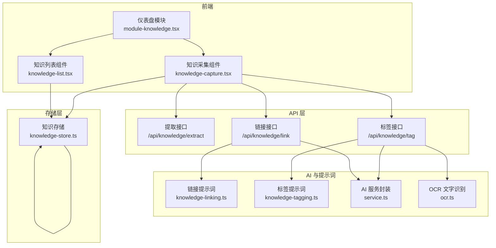
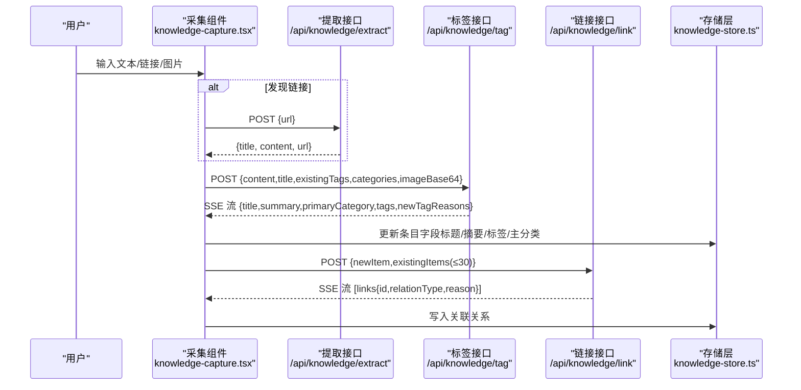
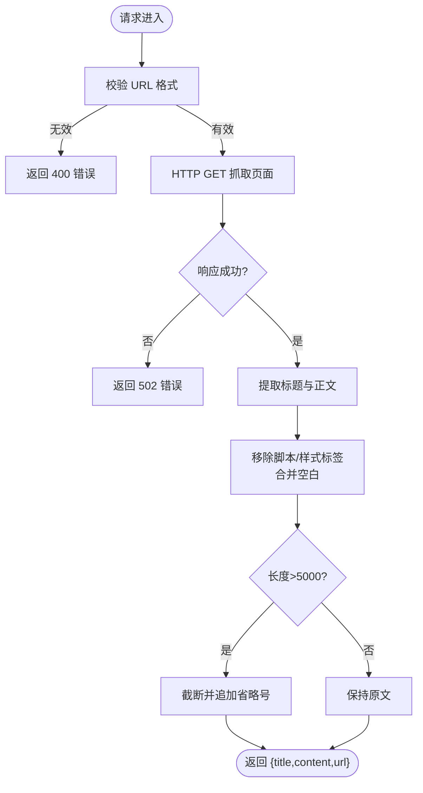
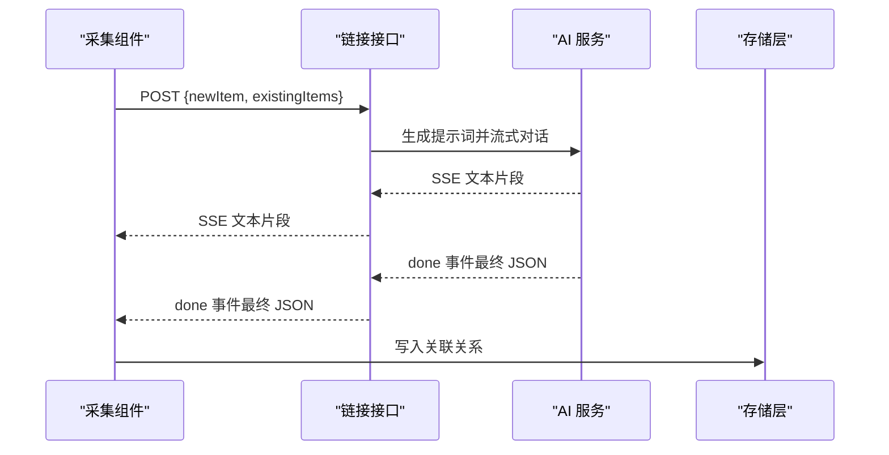
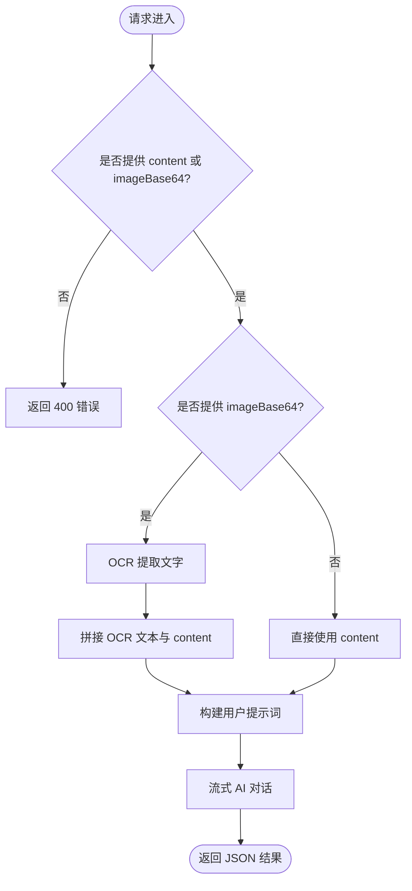
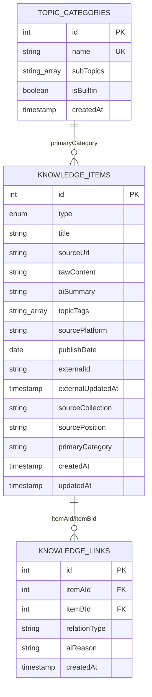
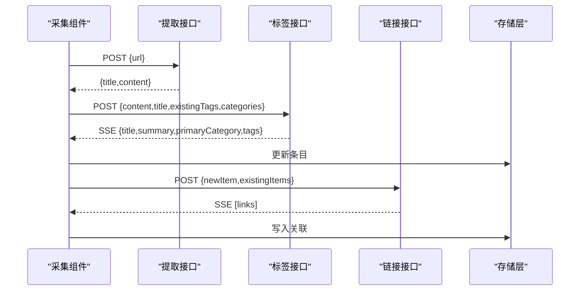
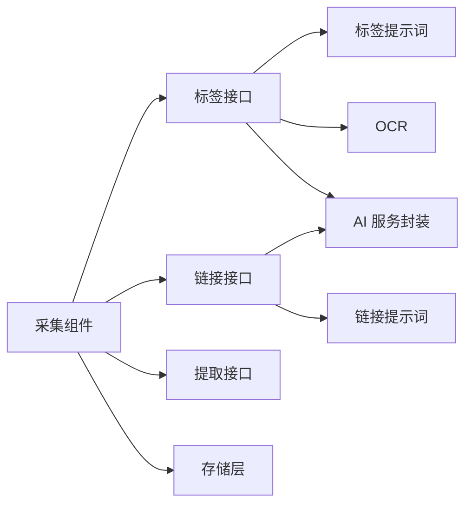

# 知识库接口

<cite>
**本文引用的文件**
- [src/app/api/knowledge/extract/route.ts](file://src/app/api/knowledge/extract/route.ts)
- [src/app/api/knowledge/link/route.ts](file://src/app/api/knowledge/link/route.ts)
- [src/app/api/knowledge/tag/route.ts](file://src/app/api/knowledge/tag/route.ts)
- [src/lib/ai/prompts/knowledge-linking.ts](file://src/lib/ai/prompts/knowledge-linking.ts)
- [src/lib/ai/prompts/knowledge-tagging.ts](file://src/lib/ai/prompts/knowledge-tagging.ts)
- [src/lib/ai/service.ts](file://src/lib/ai/service.ts)
- [src/lib/ai/ocr.ts](file://src/lib/ai/ocr.ts)
- [src/lib/storage/knowledge-store.ts](file://src/lib/storage/knowledge-store.ts)
- [src/components/knowledge/knowledge-capture.tsx](file://src/components/knowledge/knowledge-capture.tsx)
- [src/components/knowledge/knowledge-list.tsx](file://src/components/knowledge/knowledge-list.tsx)
- [src/components/dashboard/module-knowledge.tsx](file://src/components/dashboard/module-knowledge.tsx)
</cite>

## 目录
1. [简介](#简介)
2. [项目结构](#项目结构)
3. [核心组件](#核心组件)
4. [架构总览](#架构总览)
5. [详细组件分析](#详细组件分析)
6. [依赖分析](#依赖分析)
7. [性能考虑](#性能考虑)
8. [故障排查指南](#故障排查指南)
9. [结论](#结论)
10. [附录](#附录)

## 简介
本文件为“知识库管理接口”的完整 API 文档，覆盖三大核心能力：
- 内容提取：从网页 URL 抓取并清洗正文，返回标题与正文摘要
- 链接管理：基于 AI 推荐与现有知识建立语义关联（支持多种关系类型）
- 标签处理：对文本或图片进行智能打标，生成标题、摘要、主分类与标签集合

文档同时说明了内容提取算法、链接建立规则、标签系统实现、批量操作、异步处理与错误恢复机制，并提供数据模型定义与前后端集成示例，帮助快速搭建智能知识管理系统。

## 项目结构
知识库接口位于 Next.js App Router 的 API 层，配合前端组件与本地 IndexedDB 存储，形成“采集-分析-关联-持久化”的闭环。

图表来源
- [src/components/knowledge/knowledge-capture.tsx:94-205](file://src/components/knowledge/knowledge-capture.tsx#L94-L205)
- [src/app/api/knowledge/extract/route.ts:1-64](file://src/app/api/knowledge/extract/route.ts#L1-L64)
- [src/app/api/knowledge/link/route.ts:1-29](file://src/app/api/knowledge/link/route.ts#L1-L29)
- [src/app/api/knowledge/tag/route.ts:1-70](file://src/app/api/knowledge/tag/route.ts#L1-L70)
- [src/lib/ai/prompts/knowledge-linking.ts:1-46](file://src/lib/ai/prompts/knowledge-linking.ts#L1-L46)
- [src/lib/ai/prompts/knowledge-tagging.ts:1-39](file://src/lib/ai/prompts/knowledge-tagging.ts#L1-L39)
- [src/lib/ai/service.ts:1-6](file://src/lib/ai/service.ts#L1-L6)
- [src/lib/ai/ocr.ts:1-90](file://src/lib/ai/ocr.ts#L1-L90)
- [src/lib/storage/knowledge-store.ts:1-611](file://src/lib/storage/knowledge-store.ts#L1-L611)

章节来源
- [src/app/api/knowledge/extract/route.ts:1-64](file://src/app/api/knowledge/extract/route.ts#L1-L64)
- [src/app/api/knowledge/link/route.ts:1-29](file://src/app/api/knowledge/link/route.ts#L1-L29)
- [src/app/api/knowledge/tag/route.ts:1-70](file://src/app/api/knowledge/tag/route.ts#L1-L70)
- [src/lib/storage/knowledge-store.ts:1-611](file://src/lib/storage/knowledge-store.ts#L1-L611)

## 核心组件
- 内容提取接口：接收 URL，抓取页面，清洗 HTML，限制长度，返回标题与正文摘要
- 链接接口：接收新增条目与现有条目列表，通过 AI 推荐最多 3 条语义关联，返回关系类型与理由
- 标签接口：接收文本/图片与上下文，通过 AI 生成标题、摘要、主分类与标签，支持图片 OCR 文字提取

章节来源
- [src/app/api/knowledge/extract/route.ts:1-64](file://src/app/api/knowledge/extract/route.ts#L1-L64)
- [src/app/api/knowledge/link/route.ts:1-29](file://src/app/api/knowledge/link/route.ts#L1-L29)
- [src/app/api/knowledge/tag/route.ts:1-70](file://src/app/api/knowledge/tag/route.ts#L1-L70)

## 架构总览
整体流程：前端采集输入（文本/链接/图片），触发提取与 AI 分析，AI 返回结构化结果，前端更新本地存储并建立关联。

图表来源
- [src/components/knowledge/knowledge-capture.tsx:94-205](file://src/components/knowledge/knowledge-capture.tsx#L94-L205)
- [src/app/api/knowledge/extract/route.ts:1-64](file://src/app/api/knowledge/extract/route.ts#L1-L64)
- [src/app/api/knowledge/tag/route.ts:1-70](file://src/app/api/knowledge/tag/route.ts#L1-L70)
- [src/app/api/knowledge/link/route.ts:1-29](file://src/app/api/knowledge/link/route.ts#L1-L29)
- [src/lib/storage/knowledge-store.ts:318-351](file://src/lib/storage/knowledge-store.ts#L318-L351)

## 详细组件分析

### 内容提取接口
- 功能：从 URL 抓取页面，提取标题，移除脚本样式标签，清理空白，限制长度
- 请求
  - 方法：POST
  - 路径：/api/knowledge/extract
  - 请求体字段
    - url: string，必须为 http/https 开头的有效 URL
- 响应
  - 成功：返回 {title, content, url}
  - 失败：返回 {error}，状态码 400 或 502
- 特殊处理
  - 微信公众号 URL 自动附加必要请求头
  - 超时控制（10 秒）

图表来源
- [src/app/api/knowledge/extract/route.ts:1-64](file://src/app/api/knowledge/extract/route.ts#L1-L64)

章节来源
- [src/app/api/knowledge/extract/route.ts:1-64](file://src/app/api/knowledge/extract/route.ts#L1-L64)

### 链接管理接口
- 功能：基于 AI 推荐与现有知识建立语义关联，最多 3 条
- 请求
  - 方法：POST
  - 路径：/api/knowledge/link
  - 请求体字段
    - newItem: { title, summary?, tags? }
    - existingItems: [{ id, title, tags? }]，建议 ≤30
- 响应
  - 成功：SSE 流，事件类型包括 text/done，最终返回 { links: [{ id, relationType, reason }] }
  - 失败：返回 { links: [] }（当输入为空）
- 关系类型
  - deepen（深化）、apply（应用）、supplement（补充）、oppose（对立）、source（来源）
- 规则
  - 仅在存在清晰逻辑关系时推荐
  - 每条关联需标注关系类型与简短理由（≤15 字）
  - 最多推荐 3 条

图表来源
- [src/app/api/knowledge/link/route.ts:1-29](file://src/app/api/knowledge/link/route.ts#L1-L29)
- [src/lib/ai/prompts/knowledge-linking.ts:1-46](file://src/lib/ai/prompts/knowledge-linking.ts#L1-L46)
- [src/lib/ai/service.ts:1-6](file://src/lib/ai/service.ts#L1-L6)
- [src/lib/storage/knowledge-store.ts:318-351](file://src/lib/storage/knowledge-store.ts#L318-L351)

章节来源
- [src/app/api/knowledge/link/route.ts:1-29](file://src/app/api/knowledge/link/route.ts#L1-L29)
- [src/lib/ai/prompts/knowledge-linking.ts:1-46](file://src/lib/ai/prompts/knowledge-linking.ts#L1-L46)

### 标签处理接口
- 功能：对文本或图片进行智能打标，生成标题、摘要、主分类与标签
- 请求
  - 方法：POST
  - 路径：/api/knowledge/tag
  - 请求体字段
    - content: string（可选）
    - title: string（可选）
    - imageBase64: string（可选，data URL 或纯 base64）
    - existingTags: string[]（可选，默认 []）
    - categories: string[]（可选，默认 []）
- 响应
  - 成功：SSE 流，最终返回 { title, summary, primaryCategory, tags, newTagReasons }
  - 失败：返回 { error }，常见状态码 400/413/500/503
- 图片处理
  - 使用本地 OCR（PaddleOCR）提取文字，再结合文本 AI 进行打标
  - 图片大小限制：>10MB 时拒绝
- 上下文
  - existingTags：来自数据库中所有条目的标签集合
  - categories：来自一级主题列表

图表来源
- [src/app/api/knowledge/tag/route.ts:1-70](file://src/app/api/knowledge/tag/route.ts#L1-L70)
- [src/lib/ai/prompts/knowledge-tagging.ts:1-39](file://src/lib/ai/prompts/knowledge-tagging.ts#L1-L39)
- [src/lib/ai/ocr.ts:1-90](file://src/lib/ai/ocr.ts#L1-L90)

章节来源
- [src/app/api/knowledge/tag/route.ts:1-70](file://src/app/api/knowledge/tag/route.ts#L1-L70)
- [src/lib/ai/prompts/knowledge-tagging.ts:1-39](file://src/lib/ai/prompts/knowledge-tagging.ts#L1-L39)
- [src/lib/ai/ocr.ts:1-90](file://src/lib/ai/ocr.ts#L1-L90)

### 数据模型与存储
- 知识条目（KnowledgeItem）
  - id?: number
  - type: 'link' | 'text' | 'file' | 'creation_article' | 'feishu' | 'obsidian'
  - title: string
  - sourceUrl?: string
  - rawContent?: string
  - aiSummary?: string
  - topicTags: string[]
  - sourcePlatform?: string
  - publishDate?: string
  - externalId?: string（格式：<source>:<native-id>）
  - externalUpdatedAt?: string（ISO）
  - sourceCollection?: string
  - sourcePosition?: string
  - primaryCategory?: string
  - createdAt: string
  - updatedAt: string
- 关联关系（KnowledgeLink）
  - id?: number
  - itemAId: number
  - itemBId: number
  - relationType: string
  - aiReason?: string
  - createdAt: string
- 主分类（TopicCategory）
  - id?: number
  - name: string
  - subTopics: string[]
  - isBuiltin: boolean
  - createdAt: string
- 关系类型（RelationType）
  - deepen | apply | supplement | oppose | source | contains

图表来源
- [src/lib/storage/knowledge-store.ts:5-97](file://src/lib/storage/knowledge-store.ts#L5-L97)

章节来源
- [src/lib/storage/knowledge-store.ts:1-611](file://src/lib/storage/knowledge-store.ts#L1-L611)

### 前端集成与工作流
- 知识采集组件
  - 自动检测 URL 并触发提取
  - 支持粘贴/上传图片，触发 OCR 与标签分析
  - 后台异步执行标签与链接分析，非阻塞主流程
- 批量操作
  - 列表页支持批量删除与批量重新打标
  - 重新打标会拉取最新上下文并逐条分析
- 仪表盘模块
  - 统一承载采集、列表、详情与图谱视图

图表来源
- [src/components/knowledge/knowledge-capture.tsx:94-205](file://src/components/knowledge/knowledge-capture.tsx#L94-L205)
- [src/components/knowledge/knowledge-list.tsx:496-521](file://src/components/knowledge/knowledge-list.tsx#L496-L521)
- [src/components/dashboard/module-knowledge.tsx:1-41](file://src/components/dashboard/module-knowledge.tsx#L1-L41)

章节来源
- [src/components/knowledge/knowledge-capture.tsx:94-205](file://src/components/knowledge/knowledge-capture.tsx#L94-L205)
- [src/components/knowledge/knowledge-list.tsx:496-521](file://src/components/knowledge/knowledge-list.tsx#L496-L521)
- [src/components/dashboard/module-knowledge.tsx:1-41](file://src/components/dashboard/module-knowledge.tsx#L1-L41)

## 依赖分析
- 接口依赖
  - 链接接口依赖 AI 提示词与 AI 服务封装
  - 标签接口依赖 AI 提示词、AI 服务封装与 OCR
- 存储依赖
  - 所有写入均通过本地 IndexedDB 封装，支持增删改查、索引与统计
- 前端依赖
  - 采集组件负责触发接口、解析 SSE、更新本地状态与存储

图表来源
- [src/app/api/knowledge/link/route.ts:1-29](file://src/app/api/knowledge/link/route.ts#L1-L29)
- [src/app/api/knowledge/tag/route.ts:1-70](file://src/app/api/knowledge/tag/route.ts#L1-L70)
- [src/lib/ai/prompts/knowledge-linking.ts:1-46](file://src/lib/ai/prompts/knowledge-linking.ts#L1-L46)
- [src/lib/ai/prompts/knowledge-tagging.ts:1-39](file://src/lib/ai/prompts/knowledge-tagging.ts#L1-L39)
- [src/lib/ai/service.ts:1-6](file://src/lib/ai/service.ts#L1-L6)
- [src/lib/ai/ocr.ts:1-90](file://src/lib/ai/ocr.ts#L1-L90)
- [src/components/knowledge/knowledge-capture.tsx:94-205](file://src/components/knowledge/knowledge-capture.tsx#L94-L205)
- [src/lib/storage/knowledge-store.ts:1-611](file://src/lib/storage/knowledge-store.ts#L1-L611)

章节来源
- [src/app/api/knowledge/link/route.ts:1-29](file://src/app/api/knowledge/link/route.ts#L1-L29)
- [src/app/api/knowledge/tag/route.ts:1-70](file://src/app/api/knowledge/tag/route.ts#L1-L70)
- [src/lib/ai/prompts/knowledge-linking.ts:1-46](file://src/lib/ai/prompts/knowledge-linking.ts#L1-L46)
- [src/lib/ai/prompts/knowledge-tagging.ts:1-39](file://src/lib/ai/prompts/knowledge-tagging.ts#L1-L39)
- [src/lib/ai/service.ts:1-6](file://src/lib/ai/service.ts#L1-L6)
- [src/lib/ai/ocr.ts:1-90](file://src/lib/ai/ocr.ts#L1-L90)
- [src/components/knowledge/knowledge-capture.tsx:94-205](file://src/components/knowledge/knowledge-capture.tsx#L94-L205)
- [src/lib/storage/knowledge-store.ts:1-611](file://src/lib/storage/knowledge-store.ts#L1-L611)

## 性能考虑
- 超时与并发
  - 提取接口设置 10 秒超时，避免阻塞
  - 链接接口最大执行时长 60 秒，避免长时间占用
- 数据规模
  - 链接分析默认只取前 30 条现有条目，避免 Token 暴涨
- IO 优化
  - 存储层使用多索引（by-type/by-tags/by-created/by-external/by-category/by-source-collection），提升查询效率
- 前端体验
  - SSE 流式返回，即时反馈；后台分析非阻塞

[本节为通用指导，无需列出章节来源]

## 故障排查指南
- 提取接口
  - URL 格式错误：返回 400
  - 抓取失败：返回 502（状态码与原因）
  - HTML 清洗后内容过短：可能无法提取有效正文
- 标签接口
  - 未提供 content 且未提供 imageBase64：返回 400
  - 图片过大（>10MB）：返回 413
  - AI 服务未配置（缺少密钥）：返回 503
  - AI 服务异常：返回 500
- 链接接口
  - 缺少输入或现有条目为空：返回空链接数组
  - AI 输出不符合 JSON 格式：前端解析失败，Silent Fail
- 存储层
  - 删除条目时会级联删除关联关系
  - upsertByExternalId 支持增量更新，避免重复导入

章节来源
- [src/app/api/knowledge/extract/route.ts:1-64](file://src/app/api/knowledge/extract/route.ts#L1-L64)
- [src/app/api/knowledge/tag/route.ts:1-70](file://src/app/api/knowledge/tag/route.ts#L1-L70)
- [src/app/api/knowledge/link/route.ts:1-29](file://src/app/api/knowledge/link/route.ts#L1-L29)
- [src/lib/storage/knowledge-store.ts:221-250](file://src/lib/storage/knowledge-store.ts#L221-L250)

## 结论
本知识库接口以“提取-打标-关联”为核心闭环，结合本地存储与流式 AI，实现了从采集到结构化的智能知识管理能力。通过明确的数据模型、严格的提示词约束与稳健的错误处理，系统可在复杂场景下稳定运行，并为后续扩展（如批量导入、图谱可视化、检索增强）奠定基础。

[本节为总结性内容，无需列出章节来源]

## 附录

### API 定义与示例

- 提取接口
  - 方法：POST
  - 路径：/api/knowledge/extract
  - 请求体
    - url: string
  - 响应
    - 成功：{ title: string, content: string, url: string }
    - 失败：{ error: string }（400/502）

- 链接接口
  - 方法：POST
  - 路径：/api/knowledge/link
  - 请求体
    - newItem: { title: string, summary?: string, tags?: string[] }
    - existingItems: [{ id: number, title: string, tags?: string[] }]
  - 响应
    - SSE：事件类型 text/done，最终返回 { links: [{ id: number, relationType: string, reason: string }] }

- 标签接口
  - 方法：POST
  - 路径：/api/knowledge/tag
  - 请求体
    - content?: string
    - title?: string
    - imageBase64?: string
    - existingTags?: string[]
    - categories?: string[]
  - 响应
    - SSE：事件类型 text/done，最终返回 { title, summary, primaryCategory, tags, newTagReasons }

章节来源
- [src/app/api/knowledge/extract/route.ts:1-64](file://src/app/api/knowledge/extract/route.ts#L1-L64)
- [src/app/api/knowledge/link/route.ts:1-29](file://src/app/api/knowledge/link/route.ts#L1-L29)
- [src/app/api/knowledge/tag/route.ts:1-70](file://src/app/api/knowledge/tag/route.ts#L1-L70)