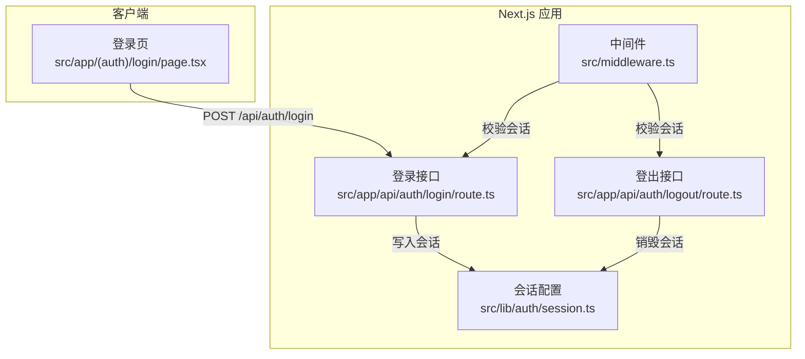
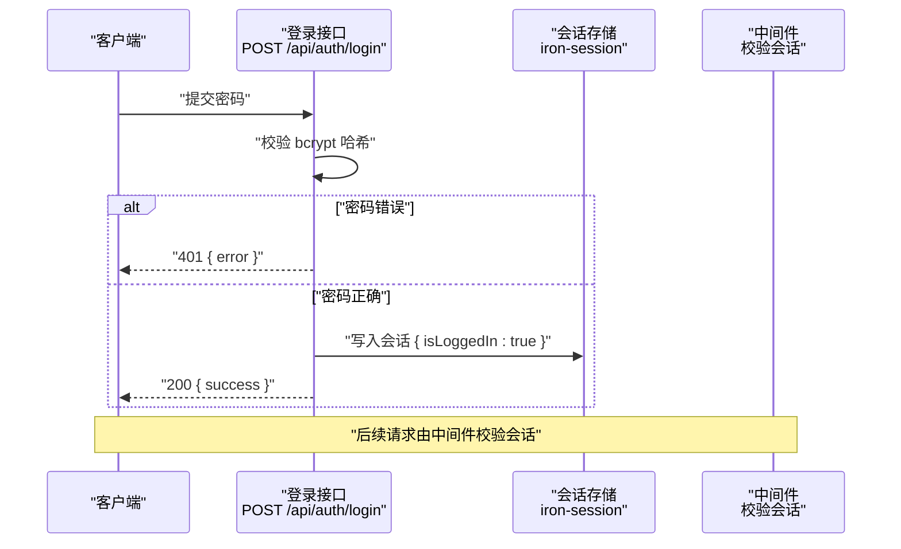
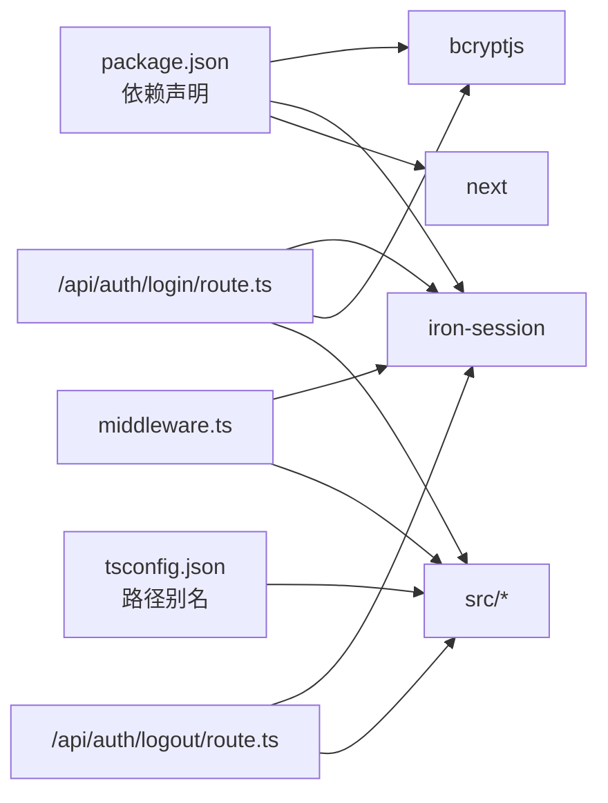

# 认证接口

<cite>
**本文引用的文件**
- [src/app/api/auth/login/route.ts](file://src/app/api/auth/login/route.ts)
- [src/app/api/auth/logout/route.ts](file://src/app/api/auth/logout/route.ts)
- [src/lib/auth/session.ts](file://src/lib/auth/session.ts)
- [src/middleware.ts](file://src/middleware.ts)
- [src/app/(auth)/login/page.tsx](file://src/app/(auth)/login/page.tsx)
- [src/app/(auth)/privacy-policy/page.tsx](file://src/app/(auth)/privacy-policy/page.tsx)
- [package.json](file://package.json)
- [tsconfig.json](file://tsconfig.json)
</cite>

## 目录
1. [简介](#简介)
2. [项目结构](#项目结构)
3. [核心组件](#核心组件)
4. [架构总览](#架构总览)
5. [详细组件分析](#详细组件分析)
6. [依赖关系分析](#依赖关系分析)
7. [性能考量](#性能考量)
8. [故障排查指南](#故障排查指南)
9. [结论](#结论)
10. [附录](#附录)

## 简介
本文件为认证接口的权威 API 文档，覆盖登录与登出两个核心接口的完整规范，包括请求方法、URL 路径、请求头、请求体参数、响应格式与错误码说明。同时阐述认证流程、会话管理与安全机制，给出前端调用示例与常见问题的解决方案，并解释认证中间件的工作原理与安全考虑。

## 项目结构
认证相关代码主要分布在以下位置：
- 后端 API：Next.js App Router 的路由处理器，分别实现登录与登出逻辑
- 会话配置：集中定义 Session 数据结构与 Cookie 安全选项
- 中间件：统一校验会话，保护受保护路由
- 前端登录页：演示如何调用登录接口并处理响应
- 隐私政策：说明登录与会话的安全策略与有效期

图表来源
- [src/app/api/auth/login/route.ts:1-23](file://src/app/api/auth/login/route.ts#L1-L23)
- [src/app/api/auth/logout/route.ts:1-14](file://src/app/api/auth/logout/route.ts#L1-L14)
- [src/lib/auth/session.ts:1-43](file://src/lib/auth/session.ts#L1-L43)
- [src/middleware.ts:1-52](file://src/middleware.ts#L1-L52)
- [src/app/(auth)/login/page.tsx](file://src/app/(auth)/login/page.tsx#L1-L121)

章节来源
- [src/app/api/auth/login/route.ts:1-23](file://src/app/api/auth/login/route.ts#L1-L23)
- [src/app/api/auth/logout/route.ts:1-14](file://src/app/api/auth/logout/route.ts#L1-L14)
- [src/lib/auth/session.ts:1-43](file://src/lib/auth/session.ts#L1-L43)
- [src/middleware.ts:1-52](file://src/middleware.ts#L1-L52)
- [src/app/(auth)/login/page.tsx](file://src/app/(auth)/login/page.tsx#L1-L121)

## 核心组件
- 登录接口：接收密码，校验哈希，成功则写入会话并返回成功响应
- 登出接口：销毁当前会话并返回确认
- 会话配置：定义 Cookie 名称、安全标志、SameSite、HttpOnly、有效期等
- 中间件：拦截受保护路径，校验会话；API 路由返回 JSON 401，页面重定向到登录页
- 前端登录页：演示如何发起登录请求、处理响应与错误

章节来源
- [src/app/api/auth/login/route.ts:6-22](file://src/app/api/auth/login/route.ts#L6-L22)
- [src/app/api/auth/logout/route.ts:6-13](file://src/app/api/auth/logout/route.ts#L6-L13)
- [src/lib/auth/session.ts:3-19](file://src/lib/auth/session.ts#L3-L19)
- [src/middleware.ts:33-46](file://src/middleware.ts#L33-L46)
- [src/app/(auth)/login/page.tsx](file://src/app/(auth)/login/page.tsx#L14-L38)

## 架构总览
认证流程概览如下：

图表来源
- [src/app/api/auth/login/route.ts:6-22](file://src/app/api/auth/login/route.ts#L6-L22)
- [src/lib/auth/session.ts:3-19](file://src/lib/auth/session.ts#L3-L19)
- [src/middleware.ts:33-46](file://src/middleware.ts#L33-L46)

## 详细组件分析

### 登录接口
- 方法与路径
  - 方法：POST
  - 路径：/api/auth/login
- 请求头
  - Content-Type: application/json
- 请求体参数
  - password: 字符串（明文密码）
- 成功响应
  - 状态码：200
  - 内容：{ success: true }
- 错误响应
  - 状态码：401
  - 内容：{ error: "密码错误" }
- 处理流程
  - 从请求体读取 password
  - 从环境变量读取 ACCESS_PASSWORD_HASH 并与 password 进行 bcrypt 比较
  - 若不匹配，返回 401
  - 若匹配，创建响应，初始化会话并设置 isLoggedIn 为 true，保存会话后返回 200
- 安全要点
  - 密码不落库，仅保存哈希值
  - 使用 bcrypt 进行比较，降低侧信道风险
  - 会话 Cookie 设置 HttpOnly、SameSite、生产环境 Secure
- 会话有效期
  - 浏览器端：关闭浏览器后失效
  - 移动端 APP（基于 UA 判断）：30 天

章节来源
- [src/app/api/auth/login/route.ts:6-22](file://src/app/api/auth/login/route.ts#L6-L22)
- [src/lib/auth/session.ts:7-19](file://src/lib/auth/session.ts#L7-L19)
- [src/lib/auth/session.ts:31-42](file://src/lib/auth/session.ts#L31-L42)
- [src/app/(auth)/privacy-policy/page.tsx](file://src/app/(auth)/privacy-policy/page.tsx#L134-L147)

### 登出接口
- 方法与路径
  - 方法：POST
  - 路径：/api/auth/logout
- 请求头
  - 无特殊要求（会话通过 Cookie 传递）
- 请求体参数
  - 无
- 成功响应
  - 状态码：200
  - 内容：{ ok: true }
- 处理流程
  - 读取当前会话并销毁
  - 返回 { ok: true }
- 安全要点
  - 销毁会话，使后续请求无法通过中间件校验

章节来源
- [src/app/api/auth/logout/route.ts:6-13](file://src/app/api/auth/logout/route.ts#L6-L13)

### 会话配置与安全
- 会话数据结构
  - SessionData: { isLoggedIn: boolean }
- Cookie 配置
  - 名称：mindos-session
  - HttpOnly: true
  - SameSite: lax
  - Secure: 生产环境启用
- 移动端会话延长
  - 基于 User-Agent 判断移动端（包含特定标识）
  - 移动端会话 maxAge 设为 30 天
- 默认会话初始值
  - { isLoggedIn: false }

章节来源
- [src/lib/auth/session.ts:3-19](file://src/lib/auth/session.ts#L3-L19)
- [src/lib/auth/session.ts:21-42](file://src/lib/auth/session.ts#L21-L42)

### 认证中间件
- 拦截规则
  - 受保护路径：除白名单外的所有非静态资源路径
  - 白名单：登录页、隐私政策、部分公开 API、静态资源等
- 校验逻辑
  - 读取会话（根据 UA 选择会话配置）
  - 若未登录：
    - API 路由：返回 401 JSON
    - 页面路由：重定向到 /login
- 匹配器
  - 对除静态资源与图标外的路径生效

章节来源
- [src/middleware.ts:9-31](file://src/middleware.ts#L9-L31)
- [src/middleware.ts:33-46](file://src/middleware.ts#L33-L46)
- [src/middleware.ts:49-51](file://src/middleware.ts#L49-L51)

### 前端调用示例（登录）
- 行为说明
  - 提交密码到 /api/auth/login
  - 成功后跳转首页并刷新
  - 失败时显示“密码不正确，请重试”
  - 异常时显示“网络错误，请稍后重试”
- 关键点
  - Content-Type: application/json
  - 请求体包含 password 字段

章节来源
- [src/app/(auth)/login/page.tsx](file://src/app/(auth)/login/page.tsx#L14-L38)

## 依赖关系分析
- 运行时依赖
  - bcryptjs：密码哈希比较
  - iron-session：会话持久化与 Cookie 管理
  - next：NextRequest/NextResponse、headers.cookies
- 类型与路径别名
  - TypeScript 路径别名 @/* 指向 src/*
- 会话与中间件耦合
  - 中间件依赖会话配置与 UA 判定
  - 登录/登出接口依赖会话配置与 Cookie

图表来源
- [package.json:20-62](file://package.json#L20-L62)
- [tsconfig.json:21-23](file://tsconfig.json#L21-L23)
- [src/app/api/auth/login/route.ts:1-4](file://src/app/api/auth/login/route.ts#L1-L4)
- [src/app/api/auth/logout/route.ts:1-4](file://src/app/api/auth/logout/route.ts#L1-L4)
- [src/middleware.ts:1-4](file://src/middleware.ts#L1-L4)

章节来源
- [package.json:20-62](file://package.json#L20-L62)
- [tsconfig.json:21-23](file://tsconfig.json#L21-L23)

## 性能考量
- 登录接口
  - bcrypt 比较为 CPU 密集操作，但仅在登录时发生，影响有限
  - 会话写入为磁盘/缓存 IO，通常毫秒级
- 中间件
  - 每次请求均需读取并解密会话，建议保持会话体积小（当前仅布尔字段）
- Cookie 有效期
  - 移动端 30 天减少频繁登录，浏览器端短有效期提升安全性

## 故障排查指南
- 401 未登录（API）
  - 现象：API 返回 { error: "未登录" }
  - 排查：确认已登录、Cookie 是否携带、会话是否被销毁
  - 参考：中间件对 API 路由返回 401 的逻辑
- 401 密码错误
  - 现象：登录返回 { error: "密码错误" }
  - 排查：确认提交的密码与 ACCESS_PASSWORD_HASH 对应；检查网络请求是否携带 JSON 与正确字段
- 登录成功但页面仍提示未登录
  - 现象：前端收到 200，但受保护页面仍被重定向
  - 排查：确认 Cookie 是否随请求发送；检查 SameSite/Secure 配置；确认中间件匹配器未误拦截
- 移动端会话过期过快
  - 现象：移动端频繁需要重新登录
  - 排查：确认 UA 标识是否被识别；检查 getSessionOptions 的 maxAge 是否生效
- 登出无效
  - 现象：调用登出后仍可访问受保护资源
  - 排查：确认会话已销毁；检查 Cookie 是否被清除

章节来源
- [src/middleware.ts:38-46](file://src/middleware.ts#L38-L46)
- [src/app/api/auth/login/route.ts:12-14](file://src/app/api/auth/login/route.ts#L12-L14)
- [src/lib/auth/session.ts:31-42](file://src/lib/auth/session.ts#L31-L42)
- [src/app/api/auth/logout/route.ts:10-12](file://src/app/api/auth/logout/route.ts#L10-L12)

## 结论
本认证体系采用单密码 + bcrypt 哈希 + iron-session 会话的轻量方案，结合中间件统一校验，既满足移动端长时效需求，又保障浏览器端的安全性。通过明确的接口规范、错误码与安全配置，开发者可快速集成并稳定运行认证流程。

## 附录

### API 规范汇总
- 登录
  - 方法：POST
  - 路径：/api/auth/login
  - 请求头：Content-Type: application/json
  - 请求体：{ password: "<字符串>" }
  - 成功：200 { success: true }
  - 失败：401 { error: "密码错误" }
- 登出
  - 方法：POST
  - 路径：/api/auth/logout
  - 请求头：无特殊要求
  - 请求体：无
  - 成功：200 { ok: true }
  - 失败：无（无条件成功）

章节来源
- [src/app/api/auth/login/route.ts:6-22](file://src/app/api/auth/login/route.ts#L6-L22)
- [src/app/api/auth/logout/route.ts:6-13](file://src/app/api/auth/logout/route.ts#L6-L13)

### 会话与安全配置
- 会话数据：{ isLoggedIn: boolean }
- Cookie 名称：mindos-session
- 安全标志：HttpOnly=true、SameSite=lax、生产环境 Secure=true
- 有效期：浏览器端关闭失效；移动端 30 天
- UA 判定：包含特定标识视为移动端

章节来源
- [src/lib/auth/session.ts:3-19](file://src/lib/auth/session.ts#L3-L19)
- [src/lib/auth/session.ts:21-42](file://src/lib/auth/session.ts#L21-L42)

### 中间件匹配与白名单
- 受保护路径：除白名单外的非静态资源
- 白名单：/login、/privacy-policy、/api/auth、/api/feishu/oauth/callback、/api/mirror/chat、/api/mindlog/generate、/api/daily-echo、/api/diary/feedback、/api/knowledge、/api/ai/billing、/_next、/favicon.ico、/icons、/manifest
- 匹配器：除静态资源与图标外

章节来源
- [src/middleware.ts:9-31](file://src/middleware.ts#L9-L31)
- [src/middleware.ts:49-51](file://src/middleware.ts#L49-L51)