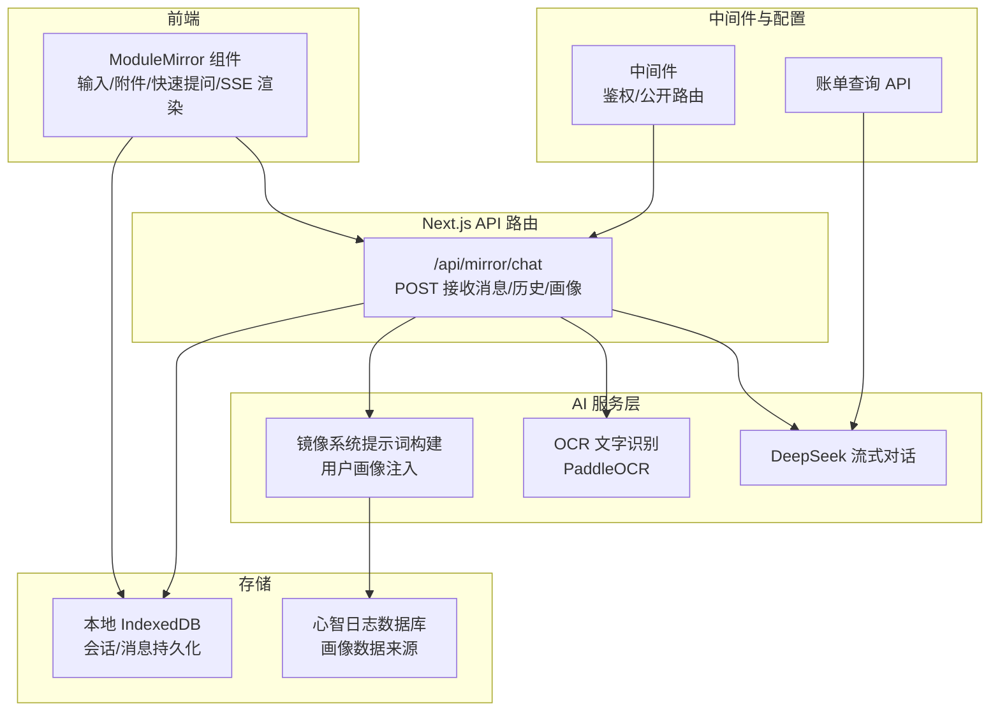
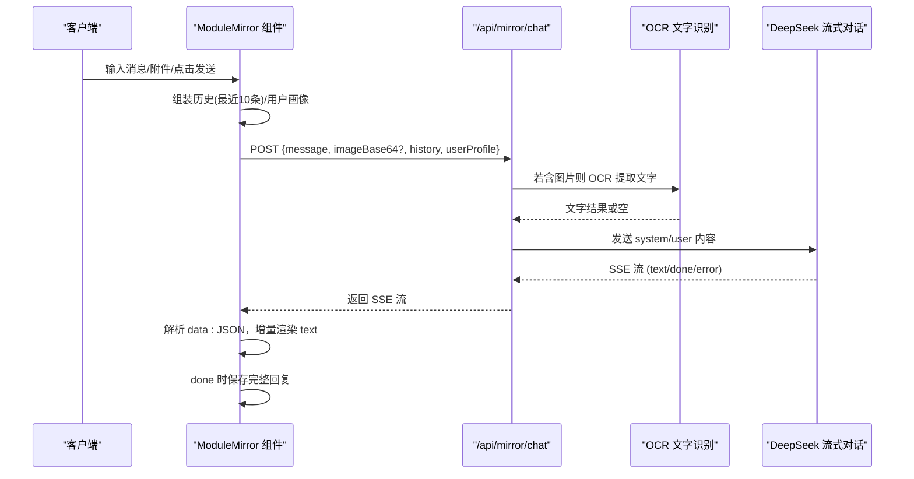
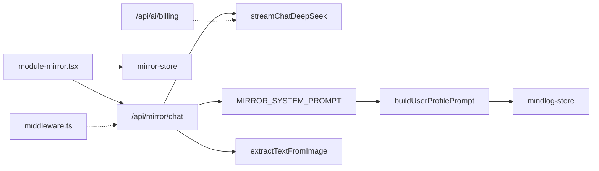

# 镜像洞见接口

<cite>
**本文引用的文件**
- [src/app/api/mirror/chat/route.ts](file://src/app/api/mirror/chat/route.ts)
- [src/lib/ai/providers/deepseek.ts](file://src/lib/ai/providers/deepseek.ts)
- [src/lib/ai/prompts/mirror-insight.ts](file://src/lib/ai/prompts/mirror-insight.ts)
- [src/lib/ai/ocr.ts](file://src/lib/ai/ocr.ts)
- [src/lib/storage/mirror-store.ts](file://src/lib/storage/mirror-store.ts)
- [src/lib/storage/mindlog-store.ts](file://src/lib/storage/mindlog-store.ts)
- [src/components/dashboard/module-mirror.tsx](file://src/components/dashboard/module-mirror.tsx)
- [src/middleware.ts](file://src/middleware.ts)
- [src/app/api/ai/billing/route.ts](file://src/app/api/ai/billing/route.ts)
- [src/app/api/daily-echo/route.ts](file://src/app/api/daily-echo/route.ts)
- [src/app/api/diary/feedback/route.ts](file://src/app/api/diary/feedback/route.ts)
- [src/app/api/mindlog/generate/route.ts](file://src/app/api/mindlog/generate/route.ts)
- [src/lib/utils/retry.ts](file://src/lib/utils/retry.ts)
- [package.json](file://package.json)
</cite>

## 目录
1. [简介](#简介)
2. [项目结构](#项目结构)
3. [核心组件](#核心组件)
4. [架构总览](#架构总览)
5. [详细组件分析](#详细组件分析)
6. [依赖关系分析](#依赖关系分析)
7. [性能考虑](#性能考虑)
8. [故障排查指南](#故障排查指南)
9. [结论](#结论)
10. [附录](#附录)

## 简介
本文件为“镜像洞见”聊天接口的完整 API 文档，覆盖 AI 对话与个性化洞察生成的端到端流程。内容包括：
- 请求与响应规范：消息格式、SSE 流式输出、错误与超时处理
- 会话管理与上下文保持：历史消息截断、用户画像注入、附件与 OCR 处理
- 并发控制与稳定性：流式读取、中断控制、重试策略
- 与前端组件的集成：输入框、快速提问、附件上传、滚动与渲染
- 与其他 AI 能力的协同：每日回响、日记反馈、心智日志生成、账单查询

## 项目结构
镜像洞见聊天接口位于 Next.js App Router 的 API 路由中，配合前端组件与本地 IndexedDB 存储，形成完整的智能对话与洞察服务。

图示来源
- [src/components/dashboard/module-mirror.tsx:1-590](file://src/components/dashboard/module-mirror.tsx#L1-L590)
- [src/app/api/mirror/chat/route.ts:1-65](file://src/app/api/mirror/chat/route.ts#L1-L65)
- [src/lib/ai/prompts/mirror-insight.ts:1-121](file://src/lib/ai/prompts/mirror-insight.ts#L1-L121)
- [src/lib/ai/ocr.ts:1-91](file://src/lib/ai/ocr.ts#L1-L91)
- [src/lib/ai/providers/deepseek.ts:1-58](file://src/lib/ai/providers/deepseek.ts#L1-L58)
- [src/lib/storage/mirror-store.ts:1-154](file://src/lib/storage/mirror-store.ts#L1-L154)
- [src/lib/storage/mindlog-store.ts:1-95](file://src/lib/storage/mindlog-store.ts#L1-L95)
- [src/middleware.ts:1-52](file://src/middleware.ts#L1-L52)
- [src/app/api/ai/billing/route.ts:1-39](file://src/app/api/ai/billing/route.ts#L1-L39)

章节来源
- [src/app/api/mirror/chat/route.ts:1-65](file://src/app/api/mirror/chat/route.ts#L1-L65)
- [src/components/dashboard/module-mirror.tsx:1-590](file://src/components/dashboard/module-mirror.tsx#L1-L590)
- [src/lib/ai/prompts/mirror-insight.ts:1-121](file://src/lib/ai/prompts/mirror-insight.ts#L1-L121)
- [src/lib/ai/ocr.ts:1-91](file://src/lib/ai/ocr.ts#L1-L91)
- [src/lib/ai/providers/deepseek.ts:1-58](file://src/lib/ai/providers/deepseek.ts#L1-L58)
- [src/lib/storage/mirror-store.ts:1-154](file://src/lib/storage/mirror-store.ts#L1-L154)
- [src/lib/storage/mindlog-store.ts:1-95](file://src/lib/storage/mindlog-store.ts#L1-L95)
- [src/middleware.ts:1-52](file://src/middleware.ts#L1-L52)
- [src/app/api/ai/billing/route.ts:1-39](file://src/app/api/ai/billing/route.ts#L1-L39)

## 核心组件
- API 路由：接收消息、历史、用户画像与可选图片，构建上下文并调用流式 AI，返回 SSE 流
- AI 提供商：封装 DeepSeek 客户端，统一流式输出协议（text/done/error）
- 系统提示词：动态构建用户画像，注入系统提示词模板
- OCR：本地 PaddleOCR 文字识别，支持 base64 图片
- 存储：IndexedDB 会话与消息持久化，支持按会话查询与标题自动生成
- 前端组件：输入框、附件、快速提问、SSE 解析与渲染、滚动与中断控制
- 中间件：对镜像聊天等公开路由放行，其他 API 路由进行会话校验

章节来源
- [src/app/api/mirror/chat/route.ts:1-65](file://src/app/api/mirror/chat/route.ts#L1-L65)
- [src/lib/ai/providers/deepseek.ts:1-58](file://src/lib/ai/providers/deepseek.ts#L1-L58)
- [src/lib/ai/prompts/mirror-insight.ts:1-121](file://src/lib/ai/prompts/mirror-insight.ts#L1-L121)
- [src/lib/ai/ocr.ts:1-91](file://src/lib/ai/ocr.ts#L1-L91)
- [src/lib/storage/mirror-store.ts:1-154](file://src/lib/storage/mirror-store.ts#L1-L154)
- [src/components/dashboard/module-mirror.tsx:1-590](file://src/components/dashboard/module-mirror.tsx#L1-L590)
- [src/middleware.ts:1-52](file://src/middleware.ts#L1-L52)

## 架构总览
镜像洞见聊天接口采用“前端发起请求 -> API 路由组装上下文 -> AI 服务流式返回 -> 前端 SSE 渲染”的闭环架构。系统提示词动态注入用户画像，历史消息截断至最近 5 轮（10 条），图片通过 OCR 转文字后与上下文合并。

图示来源
- [src/components/dashboard/module-mirror.tsx:108-248](file://src/components/dashboard/module-mirror.tsx#L108-L248)
- [src/app/api/mirror/chat/route.ts:9-57](file://src/app/api/mirror/chat/route.ts#L9-L57)
- [src/lib/ai/ocr.ts:55-79](file://src/lib/ai/ocr.ts#L55-L79)
- [src/lib/ai/providers/deepseek.ts:15-57](file://src/lib/ai/providers/deepseek.ts#L15-L57)

## 详细组件分析

### API 路由：POST /api/mirror/chat
- 功能：接收消息、历史、用户画像与可选图片，构建上下文并返回 SSE 流
- 请求体字段
  - message: 字符串，用户当前消息
  - imageBase64: 字符串（可选），图片 base64（支持 data URL）
  - history: 数组（可选），最近对话历史，每项包含 role 与 content
  - userProfile: 字符串（可选），系统提示词中的用户画像
- 上下文构建
  - 历史：取最近 10 条消息，拼接为“用户/你：内容”的形式，并在末尾追加“用户当前消息”
  - 系统提示词：将 {userProfile} 替换为 userProfile 或默认值
- OCR 与多模态
  - 若提供 imageBase64，则先 OCR 提取文字，再与上下文合并
  - OCR 文字以“[图片文字]”块加入 userContent
- 流式响应
  - 调用 streamChatDeepSeek，返回 ReadableStream
  - 响应头设置 Content-Type: text/event-stream，Cache-Control: no-cache
- 错误处理
  - 参数缺失返回 400
  - 其他异常返回 500，包含错误信息

章节来源
- [src/app/api/mirror/chat/route.ts:9-64](file://src/app/api/mirror/chat/route.ts#L9-L64)

### AI 提供商：DeepSeek 流式对话
- 客户端：OpenAI SDK，baseURL 指向代理服务，API Key 从环境变量读取
- 请求参数：model、max_tokens、stream、temperature、messages（system + user）
- 流式编码：将每次增量文本包装为 data: {"type":"text","content":"..."}，结束时发送 {"type":"done","content":"完整文本"}
- 错误编码：异常时发送 {"type":"error","content":"..."}
- 编码器：TextEncoder，事件以 \n\n 分隔

章节来源
- [src/lib/ai/providers/deepseek.ts:1-58](file://src/lib/ai/providers/deepseek.ts#L1-L58)

### 系统提示词与用户画像
- 系统提示词模板：包含用户画像占位符 {userProfile}，以及回答规范
- 用户画像构建：从心智日志数据库读取最近 14 天的数据，统计情绪基调、关键词、知识兴趣、思维倾向与核心价值观线索
- 动态注入：在 API 层将 {userProfile} 替换为实际画像字符串

章节来源
- [src/lib/ai/prompts/mirror-insight.ts:1-121](file://src/lib/ai/prompts/mirror-insight.ts#L1-L121)
- [src/lib/storage/mindlog-store.ts:1-95](file://src/lib/storage/mindlog-store.ts#L1-L95)

### OCR 文字识别
- 依赖：ppu-paddle-ocr（ONNX Runtime），中文模型首次运行自动下载
- 初始化：懒加载单例，初始化完成后缓存实例
- 输入：支持 data URL 或纯 base64，内部转换为 ArrayBuffer
- 输出：识别到的文字，若为空返回空字符串并记录警告
- 销毁：提供销毁方法，用于进程退出清理

章节来源
- [src/lib/ai/ocr.ts:1-91](file://src/lib/ai/ocr.ts#L1-L91)

### 前端组件：ModuleMirror
- 会话管理
  - 自动创建会话（无 sessionId 时），标题以第一条用户消息截断生成
  - 列表按 updatedAt 降序排列
- 输入与附件
  - 文本输入自动高度调整，最多约 4 行
  - 支持图片与文本文件附件，图片预览，文件内容附加到消息正文
- 流式渲染
  - 读取 SSE 流，按 data: JSON 解析，增量渲染 text
  - done 时保存完整回复，写入 IndexedDB
- 中断与错误
  - 支持中断（AbortController），避免竞态
  - 失败时插入一条“抱歉，回答生成失败，请稍后重试”的助手消息
- 快速提问与初始问题
  - 提供一组快速提问按钮
  - 支持从仪表盘卡片传入 initialQuestion，在画像加载完成后自动发送

章节来源
- [src/components/dashboard/module-mirror.tsx:1-590](file://src/components/dashboard/module-mirror.tsx#L1-L590)

### 存储：镜像会话与消息
- 数据库：IndexedDB，版本 2
  - sessions 表：id、title、createdAt、updatedAt
  - messages 表：id、sessionId、role、content、attachments、createdAt
  - 索引：messages.byCreatedAt、messages.by-session、sessions.by-updated
- 会话操作：创建、列表、获取、更新、删除（同时删除该会话下所有消息）
- 消息操作：新增、按总数限制查询、按会话查询（按时间排序）、清空、计数
- 标题自动生成：当会话标题仍为“新对话”且收到第一条用户消息时，以内容截断生成标题

章节来源
- [src/lib/storage/mirror-store.ts:1-154](file://src/lib/storage/mirror-store.ts#L1-L154)

### 中间件与鉴权
- 公开路由：/api/mirror/chat、/api/mindlog/generate、/api/daily-echo 等
- 非公开 API：若未登录，API 路由返回 401 JSON，避免重定向导致 fetch 收到 HTML
- 其他静态资源与公开页面不拦截

章节来源
- [src/middleware.ts:1-52](file://src/middleware.ts#L1-L52)

### 账单查询 API
- 用途：查询 DeepSeek 余额或订阅信息
- 逻辑：优先尝试 credit_grants，失败则尝试 subscription，均失败返回控制台地址
- 返回：available 与 data 或 consoleUrl

章节来源
- [src/app/api/ai/billing/route.ts:1-39](file://src/app/api/ai/billing/route.ts#L1-L39)

### 与其他 AI 能力的关系
- 每日回响：非流式 JSON，内部读取 SSE 并聚合为一句话
- 日记反馈：针对日记内容与情绪标签生成反馈
- 心智日志生成：按日/周/月类型生成结构化洞察
- 重试工具：FetchError 与指数退避重试，适用于网络不稳定场景

章节来源
- [src/app/api/daily-echo/route.ts:1-71](file://src/app/api/daily-echo/route.ts#L1-L71)
- [src/app/api/diary/feedback/route.ts:1-25](file://src/app/api/diary/feedback/route.ts#L1-L25)
- [src/app/api/mindlog/generate/route.ts:1-106](file://src/app/api/mindlog/generate/route.ts#L1-L106)
- [src/lib/utils/retry.ts:1-44](file://src/lib/utils/retry.ts#L1-L44)

## 依赖关系分析

图示来源
- [src/app/api/mirror/chat/route.ts:1-65](file://src/app/api/mirror/chat/route.ts#L1-L65)
- [src/lib/ai/providers/deepseek.ts:1-58](file://src/lib/ai/providers/deepseek.ts#L1-L58)
- [src/lib/ai/prompts/mirror-insight.ts:1-121](file://src/lib/ai/prompts/mirror-insight.ts#L1-L121)
- [src/lib/ai/ocr.ts:1-91](file://src/lib/ai/ocr.ts#L1-L91)
- [src/lib/storage/mindlog-store.ts:1-95](file://src/lib/storage/mindlog-store.ts#L1-L95)
- [src/components/dashboard/module-mirror.tsx:1-590](file://src/components/dashboard/module-mirror.tsx#L1-L590)
- [src/lib/storage/mirror-store.ts:1-154](file://src/lib/storage/mirror-store.ts#L1-L154)
- [src/middleware.ts:1-52](file://src/middleware.ts#L1-L52)
- [src/app/api/ai/billing/route.ts:1-39](file://src/app/api/ai/billing/route.ts#L1-L39)

## 性能考虑
- 流式传输：SSE 增量推送，降低首字延迟，提升感知速度
- 历史截断：仅保留最近 10 条消息，控制上下文长度，减少 Token 消耗
- OCR 本地化：使用 PaddleOCR 本地推理，避免外部 API 延迟与隐私风险
- 会话持久化：IndexedDB 本地存储，减少重复请求与网络往返
- 超时与中断：API 层 maxDuration 限制执行时间，前端支持 AbortController 中断
- 重试策略：网络错误与 5xx 服务器错误可按指数退避重试

## 故障排查指南
- 常见错误
  - 400：消息与图片均为空
  - 500：AI 服务调用失败（错误信息来自异常消息）
  - 401：未登录访问受保护 API（中间件拦截）
- 建议排查步骤
  - 确认请求体包含 message 或 imageBase64
  - 检查 DEEPSEEK_API_KEY 是否正确配置
  - 查看前端是否正确解析 SSE（data: JSON）
  - 若图片识别失败，确认 base64 格式与大小（前端已限制）
  - 使用账单 API 验证密钥有效性
- 重试与超时
  - 前端可中断流并重新发送
  - 网络不稳定时可使用重试工具进行指数退避重试

章节来源
- [src/app/api/mirror/chat/route.ts:13-15](file://src/app/api/mirror/chat/route.ts#L13-L15)
- [src/app/api/mirror/chat/route.ts:58-63](file://src/app/api/mirror/chat/route.ts#L58-L63)
- [src/middleware.ts:38-44](file://src/middleware.ts#L38-L44)
- [src/lib/utils/retry.ts:1-44](file://src/lib/utils/retry.ts#L1-L44)
- [src/app/api/ai/billing/route.ts:1-39](file://src/app/api/ai/billing/route.ts#L1-L39)

## 结论
镜像洞见聊天接口通过“前端交互 + 本地存储 + 流式 AI + OCR + 用户画像”的组合，实现了自然、智能且个性化的对话体验。其设计强调：
- 上下文可控（历史截断、系统提示词注入）
- 多模态支持（文本 + 图片 OCR）
- 流式体验（SSE 增量渲染）
- 稳定性（中断、错误编码、重试）
- 隐私与性能（本地 OCR、本地存储）

## 附录

### API 规范：POST /api/mirror/chat
- 请求头
  - Content-Type: application/json
- 请求体
  - message: 字符串，必填（若 imageBase64 为空）
  - imageBase64: 字符串，可选（支持 data URL 或纯 base64）
  - history: 数组，可选（每项包含 role 与 content）
  - userProfile: 字符串，可选（系统提示词中的用户画像）
- 成功响应
  - 状态码：200
  - 响应头：Content-Type: text/event-stream；Cache-Control: no-cache
  - 响应体：SSE 流，事件以 data: JSON 形式发送
    - text 事件：{"type":"text","content":"片段"}
    - done 事件：{"type":"done","content":"完整回复"}
    - error 事件：{"type":"error","content":"错误信息"}
- 错误响应
  - 400：消息与图片均为空
  - 500：AI 服务调用失败（包含错误信息）

章节来源
- [src/app/api/mirror/chat/route.ts:9-64](file://src/app/api/mirror/chat/route.ts#L9-L64)
- [src/lib/ai/providers/deepseek.ts:15-57](file://src/lib/ai/providers/deepseek.ts#L15-L57)

### 前端交互要点
- 输入与附件
  - 文本输入自动高度调整，支持 Enter 发送
  - 图片与文本文件预览与附加
- 流式渲染
  - 增量渲染 text，done 保存完整回复
- 中断与错误
  - 支持中断（停止按钮）
  - 失败时插入提示消息
- 会话管理
  - 自动创建会话，标题自动生成
  - 历史按会话查询与显示

章节来源
- [src/components/dashboard/module-mirror.tsx:108-248](file://src/components/dashboard/module-mirror.tsx#L108-L248)
- [src/lib/storage/mirror-store.ts:71-129](file://src/lib/storage/mirror-store.ts#L71-L129)

### 环境变量与依赖
- 环境变量
  - DEEPSEEK_API_KEY：DeepSeek 访问密钥
- 依赖
  - openai：OpenAI SDK（用于 DeepSeek）
  - ppu-paddle-ocr：本地 OCR
  - idb：IndexedDB 封装
  - lucide-react、framer-motion：UI 与动画

章节来源
- [package.json:20-62](file://package.json#L20-L62)
- [src/lib/ai/providers/deepseek.ts:1-13](file://src/lib/ai/providers/deepseek.ts#L1-L13)
- [src/lib/ai/ocr.ts:1-16](file://src/lib/ai/ocr.ts#L1-L16)