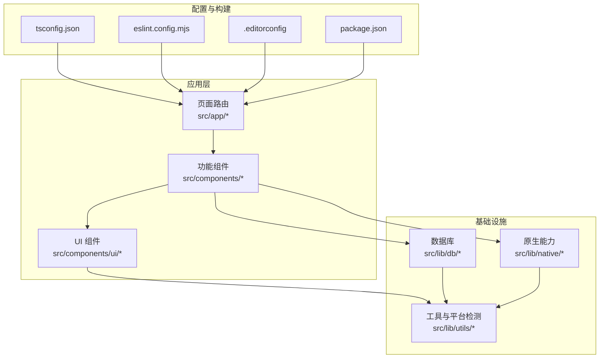
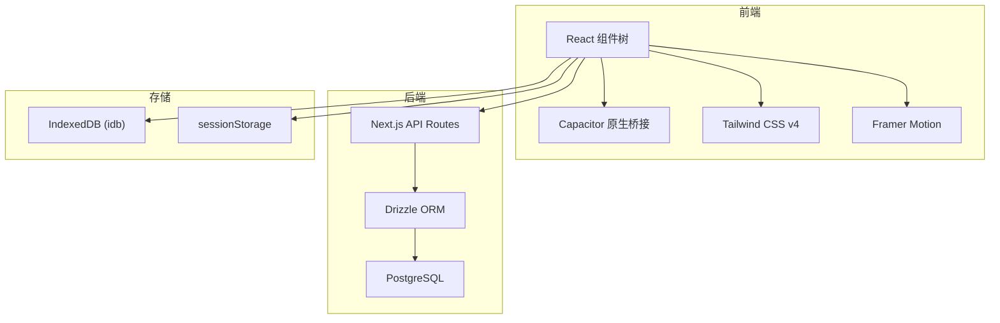
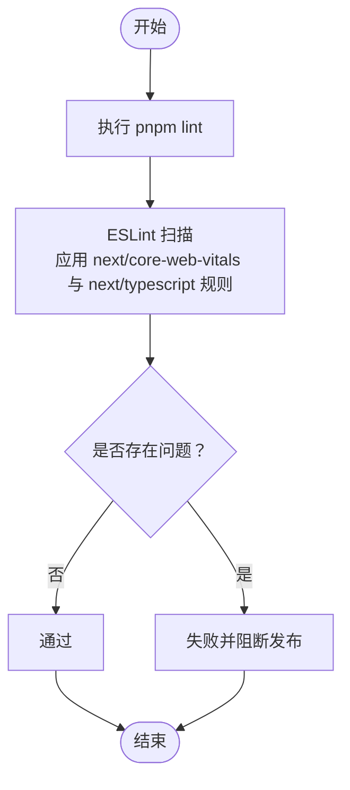
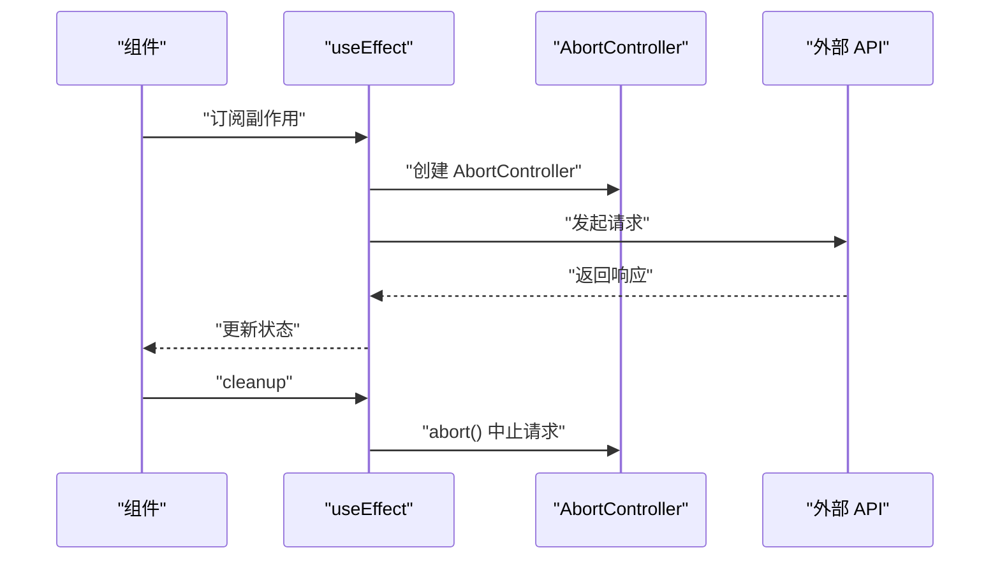
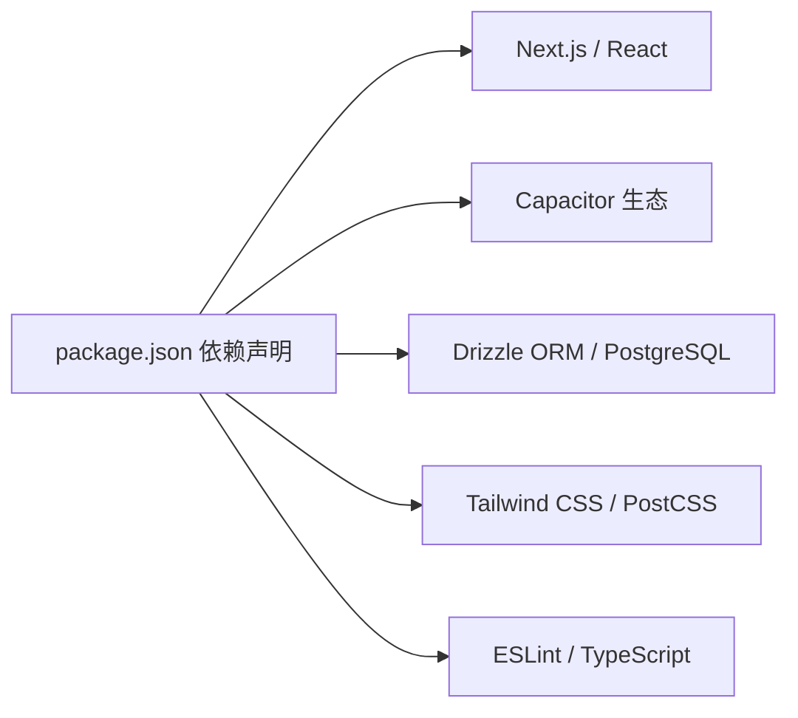

# 代码规范

<cite>
**本文引用的文件**
- [eslint.config.mjs](file://eslint.config.mjs)
- [tsconfig.json](file://tsconfig.json)
- [package.json](file://package.json)
- [.editorconfig](file://.editorconfig)
- [src/app/layout.tsx](file://src/app/layout.tsx)
- [src/components/ui/button.tsx](file://src/components/ui/button.tsx)
- [src/components/dashboard/module-diary.tsx](file://src/components/dashboard/module-diary.tsx)
- [src/lib/db/index.ts](file://src/lib/db/index.ts)
- [src/lib/native/index.ts](file://src/lib/native/index.ts)
- [DESIGN.md](file://DESIGN.md)
- [APP-ARCHITECTURE.md](file://APP-ARCHITECTURE.md)
</cite>

## 目录
1. [引言](#引言)
2. [项目结构](#项目结构)
3. [核心组件](#核心组件)
4. [架构总览](#架构总览)
5. [详细组件分析](#详细组件分析)
6. [依赖关系分析](#依赖关系分析)
7. [性能考量](#性能考量)
8. [故障排查指南](#故障排查指南)
9. [结论](#结论)
10. [附录](#附录)

## 引言
本文件旨在为 life-os 项目建立统一的代码规范，覆盖 TypeScript 编码标准、命名约定、代码组织原则、ESLint 配置与质量检查机制、组件与文件组织、导入导出约定、格式化与注释规范、React 组件与 Hooks 最佳实践、类型定义与接口设计原则，并结合项目现有实现给出“正确”与“错误”的对照示例路径与改进建议。规范目标是提升代码一致性、可维护性与可读性，确保跨平台（Web 与 Capacitor 原生）的一致体验。

## 项目结构
- 采用 Next.js App Router 结构，页面路由位于 src/app 下，按功能域划分。
- 组件按功能域组织于 src/components，通用 UI 组件置于 src/components/ui。
- 业务与基础设施代码位于 src/lib，包含数据库、原生能力、工具等。
- 类型定义位于 src/types（如存在），全局样式与主题由 DESIGN.md 定义。
- 根目录提供 TypeScript、ESLint、EditorConfig、包管理与构建脚本配置。

图表来源
- [src/app/layout.tsx:1-32](file://src/app/layout.tsx#L1-L32)
- [src/components/ui/button.tsx:1-35](file://src/components/ui/button.tsx#L1-L35)
- [src/lib/db/index.ts:1-11](file://src/lib/db/index.ts#L1-L11)
- [src/lib/native/index.ts:1-55](file://src/lib/native/index.ts#L1-L55)
- [tsconfig.json:1-28](file://tsconfig.json#L1-L28)
- [eslint.config.mjs:1-15](file://eslint.config.mjs#L1-L15)
- [.editorconfig:1-19](file://.editorconfig#L1-L19)
- [package.json:1-91](file://package.json#L1-L91)

章节来源
- [tsconfig.json:1-28](file://tsconfig.json#L1-L28)
- [eslint.config.mjs:1-15](file://eslint.config.mjs#L1-L15)
- [.editorconfig:1-19](file://.editorconfig#L1-L19)
- [package.json:1-91](file://package.json#L1-L91)

## 核心组件
- TypeScript 严格模式与路径别名：启用严格类型检查、禁止 emit、Bundler 解析、JSX 保留、路径别名 @/* 指向 src/*。
- ESLint 使用 Next.js 推荐规则集，统一代码风格与质量基线。
- EditorConfig 统一缩进、换行、字符集与尾随空白处理。
- 项目脚本提供 lint、build、dev 等命令，便于在 CI 中执行质量门禁。

章节来源
- [tsconfig.json:1-28](file://tsconfig.json#L1-L28)
- [eslint.config.mjs:1-15](file://eslint.config.mjs#L1-L15)
- [.editorconfig:1-19](file://.editorconfig#L1-L19)
- [package.json:5-18](file://package.json#L5-L18)

## 架构总览
- 前端：Next.js App Router + React + Tailwind CSS v4 + Framer Motion。
- 后端：Next.js API Routes + Drizzle ORM + PostgreSQL。
- 原生壳：Capacitor（Server URL 模式），支持多平台特性（键盘、通知、网络、震动等）。
- 存储：前端使用 IndexedDB（idb）与 sessionStorage；后端以 PostgreSQL 为事实源；数据库迁移与可视化通过 Drizzle Kit。

图表来源
- [APP-ARCHITECTURE.md:93-99](file://APP-ARCHITECTURE.md#L93-L99)
- [src/lib/db/index.ts:1-11](file://src/lib/db/index.ts#L1-L11)
- [src/lib/native/index.ts:1-55](file://src/lib/native/index.ts#L1-L55)

章节来源
- [APP-ARCHITECTURE.md:93-99](file://APP-ARCHITECTURE.md#L93-L99)

## 详细组件分析

### TypeScript 编码标准与命名约定
- 严格类型检查：开启 strict、noEmit、skipLibCheck、isolatedModules，确保类型安全与增量编译。
- 路径别名：通过 tsconfig 的 paths 将 @/* 映射至 src/*，统一导入路径，避免相对路径地狱。
- JSX 策略：preserve 以交由构建器处理，配合 Next.js 与 Capacitor。
- 命名约定建议：
  - 类型与接口使用名词短语，如 Entry、Report、NetworkStatus。
  - 常量使用 UPPER_SNAKE_CASE，如 DATABASE_URL。
  - 函数与方法使用动词短语，如 fetchUserData、invalidateCache。
  - 组件文件使用帕斯卡命名，如 DiaryDetail.tsx、MindlogReport.tsx。
  - Hook 使用 use 前缀，如 useToast、useNetworkStatus。
  - 变量与属性使用 camelCase，布尔值以 is/has/can 前缀更易读。

章节来源
- [tsconfig.json:1-28](file://tsconfig.json#L1-L28)

### ESLint 配置与代码质量检查机制
- 配置采用 Flat Config，继承 next/core-web-vitals 与 next/typescript，确保现代 Web 最佳实践与 TS 支持。
- 脚本提供 lint 命令，可在本地与 CI 中统一执行。
- 建议在 CI 中增加失败即停的策略，确保质量门禁。

图表来源
- [eslint.config.mjs:1-15](file://eslint.config.mjs#L1-L15)
- [package.json:9-9](file://package.json#L9-L9)

章节来源
- [eslint.config.mjs:1-15](file://eslint.config.mjs#L1-L15)
- [package.json:5-18](file://package.json#L5-L18)

### 组件命名规范与文件组织
- 功能域组件：按模块组织，如 diary、knowledge、mindlog、todos、settings、shared。
- UI 组件：通用组件置于 ui 目录，如 button、card、empty-state、skeleton。
- 文件命名：组件文件使用帕斯卡命名，如 DiaryDetail.tsx、MindlogReport.tsx。
- 导入路径：优先使用路径别名 @/*，避免深层相对路径。

章节来源
- [src/components/ui/button.tsx:1-35](file://src/components/ui/button.tsx#L1-L35)
- [tsconfig.json:21-23](file://tsconfig.json#L21-L23)

### 导入导出约定
- 统一使用路径别名 @/*，提升可移植性与可读性。
- 导出策略：按功能聚合导出，如原生能力统一导出 initNativeServices 与各子模块，便于按需引入。
- 类型与实现分离：类型定义尽量放在独立文件或模块内部，避免循环依赖。

章节来源
- [src/lib/native/index.ts:1-55](file://src/lib/native/index.ts#L1-L55)
- [tsconfig.json:21-23](file://tsconfig.json#L21-L23)

### 代码格式化标准与注释规范
- EditorConfig 统一缩进（2 空格）、LF 换行、UTF-8、去除尾随空白、末行换行。
- 注释建议：
  - 文件头注释：简述模块职责与关键行为。
  - 函数注释：说明输入、输出、副作用与异常情况。
  - 复杂逻辑注释：解释为什么而非是什么，必要时给出参考链接或设计文档。
  - TODO/NOTE：使用明确标记，注明截止日期或负责人。

章节来源
- [.editorconfig:1-19](file://.editorconfig#L1-L19)

### React 组件编写规范与 Hooks 使用最佳实践
- 组件职责单一：每个组件聚焦一个功能域，避免“上帝组件”。
- Props 接口显式：使用 interface 定义 props，提供默认值与可选字段。
- 事件处理：使用 useCallback 缓解不必要的重渲染。
- 生命周期与异步：在 useEffect 中进行副作用管理，返回 cleanup；对外部请求使用 AbortController；在组件卸载前中止请求，避免状态更新。
- 状态提升与 Context：共享状态上提至最近公共父组件，必要时使用 Context；避免跨层级传递过多 props。
- 错误边界：为关键模块包裹 ErrorBoundary，防止局部崩溃导致整页白屏。
- 本地化与主题：遵循 DESIGN.md 的色彩、排版与动效规范，使用 CSS 变量与 Tailwind 类组合。

图表来源
- [src/components/dashboard/module-diary.tsx:1-53](file://src/components/dashboard/module-diary.tsx#L1-L53)

章节来源
- [src/components/dashboard/module-diary.tsx:1-53](file://src/components/dashboard/module-diary.tsx#L1-L53)
- [DESIGN.md:166-174](file://DESIGN.md#L166-L174)

### TypeScript 类型定义规范与接口设计原则
- 接口设计：
  - 使用只读属性（readonly）与可选字段（?）表达可变性与健壮性。
  - 使用联合类型与字面量类型表达有限取值，如 ViewMode。
  - 使用 Record/KV 泛型表达键值映射，避免 any。
- 类型复用：将通用类型抽取到共享模块，避免重复定义。
- 泛型约束：在需要时使用泛型约束，确保类型安全与可扩展性。
- 类型断言：谨慎使用，优先通过重构消除断言；若必须断言，添加注释说明原因与范围。

章节来源
- [src/components/ui/button.tsx:3-6](file://src/components/ui/button.tsx#L3-L6)
- [src/components/dashboard/module-diary.tsx:8-12](file://src/components/dashboard/module-diary.tsx#L8-L12)

### 具体示例与正确/错误对照（示例路径）
- 正确：Button 组件通过 forwardRef 与显式 Props 接口，提供变体与尺寸枚举，使用 className 合并与 Tailwind 类组合。
  - 示例路径：[src/components/ui/button.tsx:1-35](file://src/components/ui/button.tsx#L1-L35)
- 错误：直接使用 any 或 unknown 作为 props 类型，导致 IDE 无法提供智能提示与类型检查。
  - 对照路径：[src/components/ui/button.tsx:3-6](file://src/components/ui/button.tsx#L3-L6)
- 正确：模块组件通过 useState 与 useCallback 管理视图状态与回调，避免重复渲染。
  - 示例路径：[src/components/dashboard/module-diary.tsx:14-28](file://src/components/dashboard/module-diary.tsx#L14-L28)
- 错误：使用动态 key 强制刷新组件，破坏缓存与状态一致性。
  - 对照路径：[src/components/dashboard/module-diary.tsx:34-36](file://src/components/dashboard/module-diary.tsx#L34-L36)

章节来源
- [src/components/ui/button.tsx:1-35](file://src/components/ui/button.tsx#L1-L35)
- [src/components/dashboard/module-diary.tsx:1-53](file://src/components/dashboard/module-diary.tsx#L1-L53)

### 代码审查标准与质量门禁要求
- 代码审查清单：
  - 是否通过 pnpm lint？
  - 是否满足 DESIGN.md 的设计与动效规范？
  - 是否遵循组件命名与文件组织约定？
  - 是否使用显式类型与接口，避免 any？
  - 是否正确使用 Hooks 与异步生命周期管理？
  - 是否实现错误边界与降级策略？
- 质量门禁：
  - CI 中执行 lint、类型检查与单元测试（如有）。
  - 代码合并前至少一名 reviewer 通过。
  - 重大变更需附带设计评审结论与回归测试计划。

章节来源
- [eslint.config.mjs:1-15](file://eslint.config.mjs#L1-L15)
- [DESIGN.md:271-291](file://DESIGN.md#L271-L291)
- [package.json:5-18](file://package.json#L5-L18)

## 依赖关系分析
- 前端依赖：Next.js、React、Tailwind CSS、Framer Motion、Radix UI、Lucide React 等。
- 原生依赖：Capacitor 生态（app、browser、haptics、keyboard、local-notifications、network、splash-screen、status-bar）。
- 数据库：Drizzle ORM + PostgreSQL，配合 Drizzle Kit 进行迁移与可视化。
- 工具链：ESLint、TypeScript、Tailwind PostCSS 插件、PWA 插件。

图表来源
- [package.json:20-82](file://package.json#L20-L82)

章节来源
- [package.json:20-82](file://package.json#L20-L82)

## 性能考量
- 首屏与交互性能：遵循 APP-ARCHITECTURE.md 的验收标准，如首屏加载时间、滑动流畅度、动画时长等。
- 缓存策略：前端使用 IndexedDB 与 sessionStorage 缓存，后端以 PostgreSQL 为事实源；MindLog 空白问题根因分析强调缓存原子性、失效与平台适配。
- 代码分割与懒加载：按路由与组件维度进行分割，减少初始包体积。
- 动效与渲染：使用 Framer Motion 的轻量动效，避免过度动画导致掉帧。

章节来源
- [APP-ARCHITECTURE.md:21-71](file://APP-ARCHITECTURE.md#L21-L71)
- [APP-ARCHITECTURE.md:438-546](file://APP-ARCHITECTURE.md#L438-L546)

## 故障排查指南
- MindLog 空白问题根因与修复要点：
  - 缓存原子性：统一缓存入口，避免非原子读写导致状态不一致。
  - 组件刷新：移除 key 强制刷新，改用 useEffect 依赖或 prop 触发。
  - 缓存失效：生成完成后主动失效相关缓存，避免陈旧数据。
  - 异步生命周期：使用 AbortController 与 cleanup，防止竞态与状态污染。
  - 平台适配：检测 sessionStorage 可用性，不可用时切换内存存储。
- 飞书 OAuth：确保 redirect_uri 与真实访问域一致，生产环境替换为公网域名。
- 数据库：使用 Drizzle Kit 生成与执行迁移，必要时启动 Drizzle Studio 进行可视化核对。

章节来源
- [APP-ARCHITECTURE.md:438-546](file://APP-ARCHITECTURE.md#L438-L546)
- [APP-ARCHITECTURE.md:310-344](file://APP-ARCHITECTURE.md#L310-L344)
- [APP-ARCHITECTURE.md:266-272](file://APP-ARCHITECTURE.md#L266-L272)

## 结论
本规范以项目现有配置与实现为基础，结合 DESIGN.md 与 APP-ARCHITECTURE.md 的约束，形成一套可落地的 TypeScript 与 React 编码标准。通过统一的类型定义、组件命名、文件组织、ESLint 规则与质量门禁，确保代码在多平台环境下的一致性与可维护性。建议在团队内定期回顾与更新规范，结合实际问题持续优化。

## 附录
- 设计与主题：色彩、排版、动效与布局规范详见 DESIGN.md。
- 架构约束：Capacitor、数据库、存储与部署策略详见 APP-ARCHITECTURE.md。
- 根组件与全局样式：RootLayout 定义元数据、视口与全局样式注入。

章节来源
- [DESIGN.md:1-291](file://DESIGN.md#L1-L291)
- [APP-ARCHITECTURE.md:1-546](file://APP-ARCHITECTURE.md#L1-L546)
- [src/app/layout.tsx:1-32](file://src/app/layout.tsx#L1-L32)