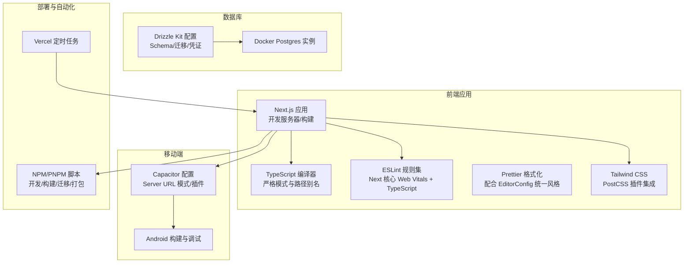
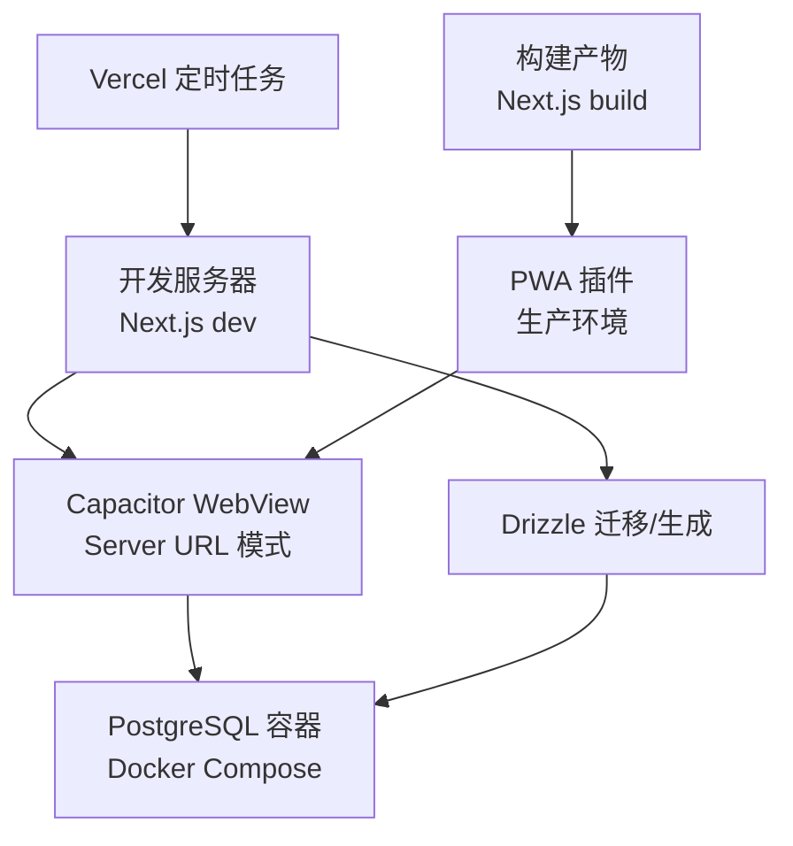
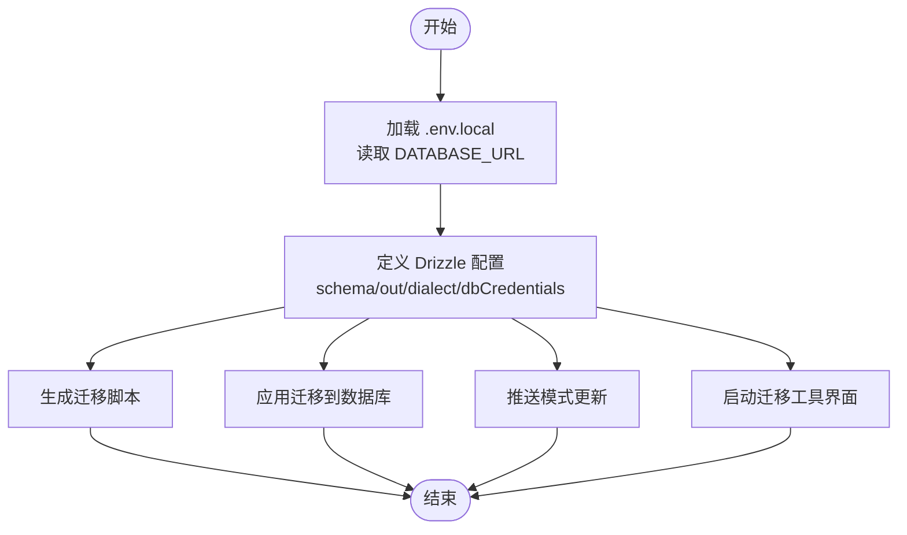
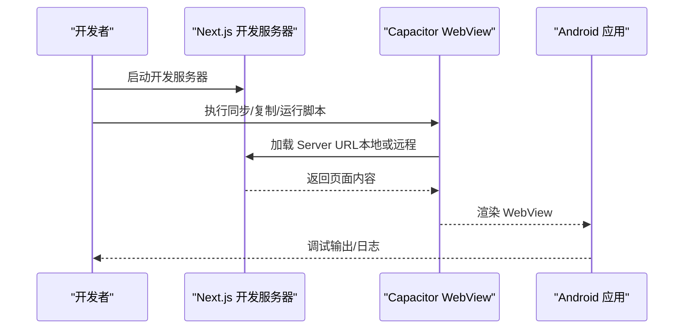
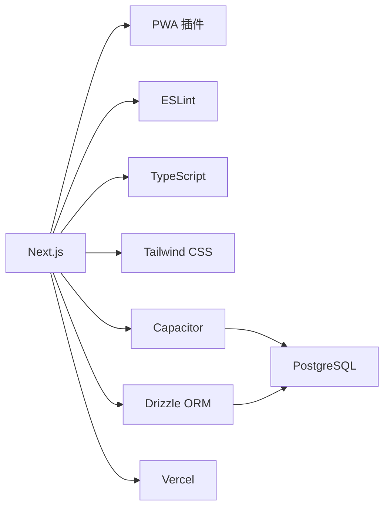

# 开发工具

<cite>
**本文引用的文件**
- [package.json](file://package.json)
- [tsconfig.json](file://tsconfig.json)
- [eslint.config.mjs](file://eslint.config.mjs)
- [postcss.config.mjs](file://postcss.config.mjs)
- [drizzle.config.ts](file://drizzle.config.ts)
- [capacitor.config.ts](file://capacitor.config.ts)
- [next.config.js](file://next.config.js)
- [vercel.json](file://vercel.json)
- [.editorconfig](file://.editorconfig)
- [docker-compose.yml](file://docker-compose.yml)
- [pnpm-workspace.yaml](file://pnpm-workspace.yaml)
</cite>

## 目录
1. [简介](#简介)
2. [项目结构](#项目结构)
3. [核心组件](#核心组件)
4. [架构总览](#架构总览)
5. [详细组件分析](#详细组件分析)
6. [依赖分析](#依赖分析)
7. [性能考虑](#性能考虑)
8. [故障排查指南](#故障排查指南)
9. [结论](#结论)
10. [附录](#附录)

## 简介
本文件面向 life-os 项目的开发者，系统化梳理开发工具链与配置，覆盖以下方面：
- VS Code 扩展推荐、调试配置与开发服务器设置
- TypeScript 编译与类型检查配置
- ESLint、Prettier、Tailwind CSS 工具链配置
- 数据库开发与迁移工具（Drizzle Kit）使用
- 移动端调试工具与 Capacitor 开发环境配置
- 性能分析与监控工具使用建议
- 版本控制与 Git 工作流最佳实践
- 常用开发脚本与自动化工具配置

## 项目结构
该项目采用 Next.js 15 应用，结合 Capacitor 构建跨平台原生应用，并通过 Drizzle ORM 进行数据库开发与迁移管理。主要开发工具与配置集中在根目录的配置文件中。

**图表来源**
- [package.json:5-18](file://package.json#L5-L18)
- [tsconfig.json:1-27](file://tsconfig.json#L1-L27)
- [eslint.config.mjs:12](file://eslint.config.mjs#L12)
- [postcss.config.mjs:1-8](file://postcss.config.mjs#L1-L8)
- [drizzle.config.ts:1-14](file://drizzle.config.ts#L1-L14)
- [capacitor.config.ts:3-34](file://capacitor.config.ts#L3-L34)
- [next.config.js:1-32](file://next.config.js#L1-L32)
- [vercel.json:1-21](file://vercel.json#L1-L21)

**章节来源**
- [package.json:1-91](file://package.json#L1-L91)
- [tsconfig.json:1-28](file://tsconfig.json#L1-L28)
- [eslint.config.mjs:1-15](file://eslint.config.mjs#L1-L15)
- [postcss.config.mjs:1-9](file://postcss.config.mjs#L1-L9)
- [drizzle.config.ts:1-14](file://drizzle.config.ts#L1-L14)
- [capacitor.config.ts:1-37](file://capacitor.config.ts#L1-L37)
- [next.config.js:1-32](file://next.config.js#L1-L32)
- [vercel.json:1-21](file://vercel.json#L1-L21)
- [.editorconfig:1-19](file://.editorconfig#L1-L19)
- [docker-compose.yml:1-18](file://docker-compose.yml#L1-L18)
- [pnpm-workspace.yaml:1-7](file://pnpm-workspace.yaml#L1-L7)

## 核心组件
- 开发服务器与构建：Next.js 开发服务器、生产构建与 PWA 插件（仅生产）
- 类型系统：TypeScript 严格模式、路径别名、Bundler 解析策略
- 代码质量：ESLint 规则继承 Next 核心 Web Vitals 与 TypeScript 支持
- 样式体系：Tailwind CSS 通过 PostCSS 插件启用
- 数据库：Drizzle ORM Schema 与迁移配置，PostgreSQL 本地开发容器
- 移动端：Capacitor Server URL 模式、插件与 Android 调试
- 自动化：NPM/PNPM 脚本、Vercel Cron 定时任务

**章节来源**
- [package.json:5-18](file://package.json#L5-L18)
- [next.config.js:1-32](file://next.config.js#L1-L32)
- [tsconfig.json:1-27](file://tsconfig.json#L1-L27)
- [eslint.config.mjs:12](file://eslint.config.mjs#L12)
- [postcss.config.mjs:1-8](file://postcss.config.mjs#L1-L8)
- [drizzle.config.ts:1-14](file://drizzle.config.ts#L1-L14)
- [capacitor.config.ts:3-34](file://capacitor.config.ts#L3-L34)
- [vercel.json:1-21](file://vercel.json#L1-L21)

## 架构总览
开发工具链围绕“前端应用 → 移动端 → 数据库 → 部署自动化”的闭环展开。开发服务器与构建由 Next.js 提供；移动端通过 Capacitor 将 WebView 与原生能力集成；数据库开发与迁移由 Drizzle Kit 管理；定时任务在 Vercel 上执行。

**图表来源**
- [next.config.js:22-31](file://next.config.js#L22-L31)
- [capacitor.config.ts:7-15](file://capacitor.config.ts#L7-L15)
- [drizzle.config.ts:6-13](file://drizzle.config.ts#L6-L13)
- [docker-compose.yml:3-14](file://docker-compose.yml#L3-L14)
- [vercel.json:2-19](file://vercel.json#L2-L19)

## 详细组件分析

### VS Code 扩展与工作区配置
- 推荐扩展
  - ESLint：基于项目 ESLint 配置提供实时校验
  - Prettier：统一格式化风格，建议与 EditorConfig 协同
  - Tailwind CSS IntelliSense：提供类名补全与错误提示
  - TypeScript Importer：自动导入类型与模块
  - DotENV：.env 文件语法高亮与校验
  - PostgreSQL：数据库查询与连接辅助（可选）
- 工作区设置要点
  - 使用 EditorConfig 统一缩进、换行与字符集
  - 在工作区设置中启用 Prettier 作为默认格式化器
  - 针对移动端调试，建议安装 Android Studio 与 Android SDK（用于 Capacitor 调试）

**章节来源**
- [.editorconfig:1-19](file://.editorconfig#L1-L19)
- [eslint.config.mjs:12](file://eslint.config.mjs#L12)
- [postcss.config.mjs:1-8](file://postcss.config.mjs#L1-L8)

### 调试配置与开发服务器
- 开发服务器
  - 启动命令：参见 NPM 脚本，使用 Turbopack 加速热重载
  - 端口：3100
- 调试建议
  - VS Code Node 调试：附加到 Next.js 开发进程
  - 浏览器调试：打开 React DevTools 与 Redux DevTools（如使用）
  - 移动端调试：启用 Capacitor WebView 的调试模式，使用 Chrome DevTools 或 Safari Web Inspector

**章节来源**
- [package.json:6](file://package.json#L6)
- [capacitor.config.ts:7-15](file://capacitor.config.ts#L7-L15)

### TypeScript 编译与类型检查
- 编译选项
  - 目标与库：ES2017 与 DOM、DOM Iterables、ESNext
  - 严格模式：开启
  - 模块解析：Bundler
  - JSX：保留
  - 路径别名：@/* 映射至 src/*
- 类型检查策略
  - 构建忽略类型错误：Next 构建阶段忽略 TS 错误
  - 开发阶段严格：VS Code 与 ESLint 提供即时反馈
- 外部原生模块处理
  - 服务端打包排除原生模块，避免打包失败

**章节来源**
- [tsconfig.json:2-24](file://tsconfig.json#L2-L24)
- [next.config.js:6-18](file://next.config.js#L6-L18)

### ESLint 与 Prettier 配置
- ESLint
  - 规则继承：Next.js 核心 Web Vitals 与 TypeScript 支持
  - 本地运行：NPM 脚本提供 lint 命令
- Prettier
  - 与 EditorConfig 协同：统一缩进、换行与字符集
  - 建议在 VS Code 中设置默认格式化器为 Prettier

**章节来源**
- [eslint.config.mjs:12](file://eslint.config.mjs#L12)
- [package.json:9](file://package.json#L9)
- [.editorconfig:1-19](file://.editorconfig#L1-L19)

### Tailwind CSS 集成
- PostCSS 插件：启用 Tailwind CSS PostCSS 插件
- 构建流程：Next.js 构建时自动处理样式
- 建议：在 VS Code 中安装 Tailwind CSS IntelliSense 以获得最佳体验

**章节来源**
- [postcss.config.mjs:1-8](file://postcss.config.mjs#L1-L8)

### 数据库开发与迁移（Drizzle ORM）
- 配置项
  - Schema 文件路径
  - 迁移输出目录
  - 方言：PostgreSQL
  - 凭证：从 .env.local 读取 DATABASE_URL
- 常用脚本
  - 生成迁移：参见 NPM 脚本
  - 应用迁移：参见 NPM 脚本
  - 推送模式：参见 NPM 脚本
  - 启动迁移工具：参见 NPM 脚本
- 本地数据库
  - Docker Compose 提供 Postgres 15 容器，端口映射 5432:5432

**图表来源**
- [drizzle.config.ts:1-14](file://drizzle.config.ts#L1-L14)
- [package.json:10-13](file://package.json#L10-L13)
- [docker-compose.yml:3-14](file://docker-compose.yml#L3-L14)

**章节来源**
- [drizzle.config.ts:1-14](file://drizzle.config.ts#L1-L14)
- [package.json:10-13](file://package.json#L10-L13)
- [docker-compose.yml:1-18](file://docker-compose.yml#L1-L18)

### 移动端调试与 Capacitor 开发环境
- 配置要点
  - Server URL 模式：WebView 加载远程站点，开发时可切换为本地地址
  - 用户代理：追加自定义 UA，便于服务端识别
  - 插件：启动屏等插件配置
  - 平台：Android 与 iOS 的 Scheme 与背景色
- 常用脚本
  - 同步与复制：参见 NPM 脚本
  - 打开与运行：参见 NPM 脚本
- 调试建议
  - 使用 Capacitor CLI 与 Android Studio 调试
  - 在 WebView 中启用调试模式，观察网络与控制台

**图表来源**
- [capacitor.config.ts:7-15](file://capacitor.config.ts#L7-L15)
- [package.json:14-18](file://package.json#L14-L18)

**章节来源**
- [capacitor.config.ts:1-37](file://capacitor.config.ts#L1-L37)
- [package.json:14-18](file://package.json#L14-L18)

### 性能分析与监控
- 性能分析
  - Next.js Profiling：在开发服务器中启用性能分析
  - React Profiler：分析组件渲染性能
  - Lighthouse：定期进行性能审计
- 监控建议
  - 服务端日志：集中化日志收集与告警
  - 客户端埋点：记录关键用户行为与错误
  - 数据库查询：慢查询日志与执行计划分析

[本节为通用指导，无需特定文件引用]

### 版本控制与 Git 工作流最佳实践
- 分支策略
  - 主分支保护：禁止直接推送，使用 Pull Request 合并
  - 功能分支：按功能拆分，命名清晰
  - Hotfix 分支：紧急修复
- 提交规范
  - 使用语义化提交信息
  - 附带变更摘要与影响范围
- 代码审查
  - 至少一名同事审查
  - 关注安全性、性能与可维护性
- 自动化
  - CI/CD：在合并前运行测试与 Lint
  - 依赖扫描：定期扫描安全漏洞

[本节为通用指导，无需特定文件引用]

### 常用开发脚本与自动化
- 开发与构建
  - 启动开发服务器
  - 构建生产包
  - 启动生产服务
- 代码质量
  - 运行 ESLint
- 数据库
  - 生成迁移
  - 应用迁移
  - 推送模式
  - 启动迁移工具
- 移动端
  - 同步/复制/打开/构建/运行 Android
- 部署与运维
  - Vercel 定时任务：每日、每月相关任务

**章节来源**
- [package.json:5-18](file://package.json#L5-L18)
- [vercel.json:2-19](file://vercel.json#L2-L19)

## 依赖分析
- 外部依赖与打包策略
  - 服务端排除原生模块：避免打包失败
  - PNPM Workspace：允许构建某些大型二进制依赖
- 工具链耦合
  - Next.js 与 PWA 插件：生产环境启用
  - Drizzle 与 PostgreSQL：本地开发与迁移
  - Capacitor 与 WebView：移动端集成

**图表来源**
- [next.config.js:22-31](file://next.config.js#L22-L31)
- [capacitor.config.ts:3-34](file://capacitor.config.ts#L3-L34)
- [drizzle.config.ts:6-13](file://drizzle.config.ts#L6-L13)
- [docker-compose.yml:3-14](file://docker-compose.yml#L3-L14)
- [vercel.json:2-19](file://vercel.json#L2-L19)

**章节来源**
- [next.config.js:9-18](file://next.config.js#L9-L18)
- [pnpm-workspace.yaml:1-7](file://pnpm-workspace.yaml#L1-L7)

## 性能考虑
- 构建与打包
  - 使用 Turbopack 加速开发服务器
  - 服务端排除原生模块，减少打包体积
- 样式与资源
  - Tailwind CSS 按需引入，避免未使用样式
  - 图片与媒体资源优化
- 数据库
  - 连接池与查询优化
  - 迁移前备份与灰度发布

[本节为通用指导，无需特定文件引用]

## 故障排查指南
- TypeScript 错误
  - 构建阶段忽略 TS 错误：Next 配置已启用
  - 开发阶段保持严格：确保编辑器即时反馈
- ESLint 报错
  - 使用脚本运行 Lint，修复规则冲突
- 数据库问题
  - 确认 .env.local 中 DATABASE_URL 正确
  - 使用 Drizzle Kit 生成/应用迁移
  - Docker Postgres 容器是否正常运行
- 移动端调试
  - 检查 Capacitor Server URL 是否可达
  - 确认插件配置与权限
- Vercel 定时任务
  - 检查 cron 表达式与 API 路径

**章节来源**
- [next.config.js:6-8](file://next.config.js#L6-L8)
- [package.json:9](file://package.json#L9)
- [drizzle.config.ts:10-12](file://drizzle.config.ts#L10-L12)
- [docker-compose.yml:3-14](file://docker-compose.yml#L3-L14)
- [capacitor.config.ts:7-15](file://capacitor.config.ts#L7-L15)
- [vercel.json:2-19](file://vercel.json#L2-L19)

## 结论
本项目采用现代化前端技术栈与跨平台移动端方案，开发工具链配置清晰、职责明确。通过统一的 ESLint、Prettier、Tailwind CSS、Drizzle ORM 与 Capacitor 配置，开发者可在保证代码质量的同时高效迭代功能。建议在团队内推广一致的编辑器与格式化配置，并持续完善移动端与数据库的本地开发体验。

[本节为总结性内容，无需特定文件引用]

## 附录
- 快速参考
  - 启动开发服务器：参见 NPM 脚本
  - 运行 Lint：参见 NPM 脚本
  - 数据库迁移：参见 NPM 脚本与 Drizzle 配置
  - 移动端调试：参见 Capacitor 配置与脚本
  - Vercel 定时任务：参见配置文件

**章节来源**
- [package.json:5-18](file://package.json#L5-L18)
- [drizzle.config.ts:1-14](file://drizzle.config.ts#L1-L14)
- [capacitor.config.ts:1-37](file://capacitor.config.ts#L1-L37)
- [vercel.json:1-21](file://vercel.json#L1-L21)