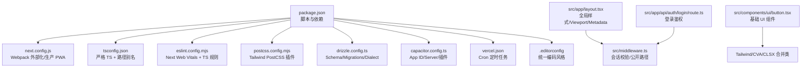
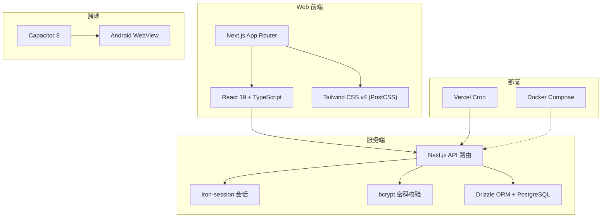
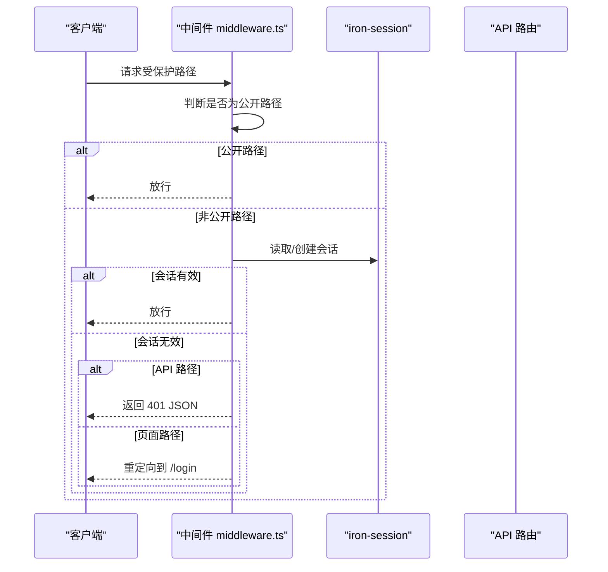
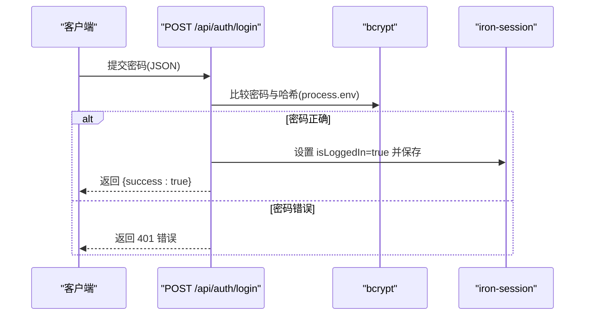
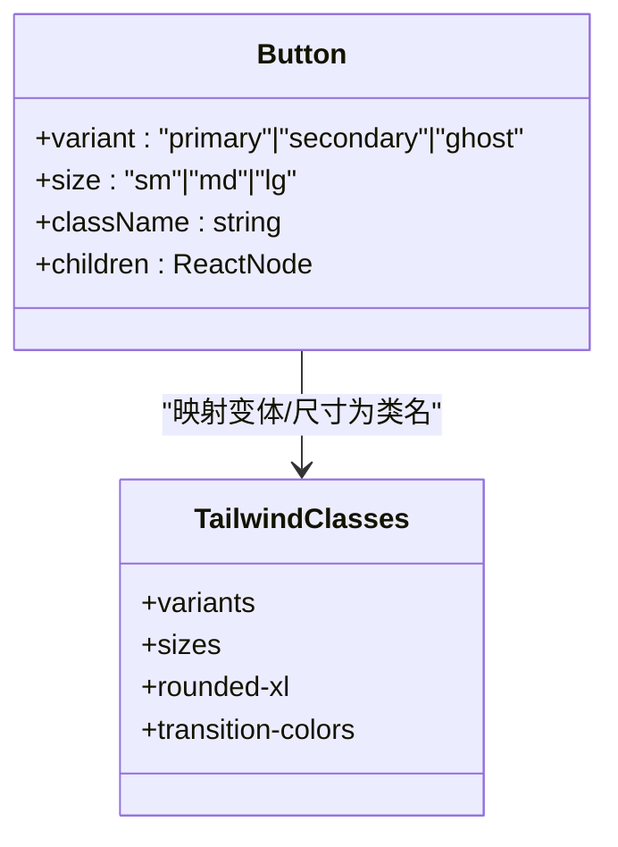
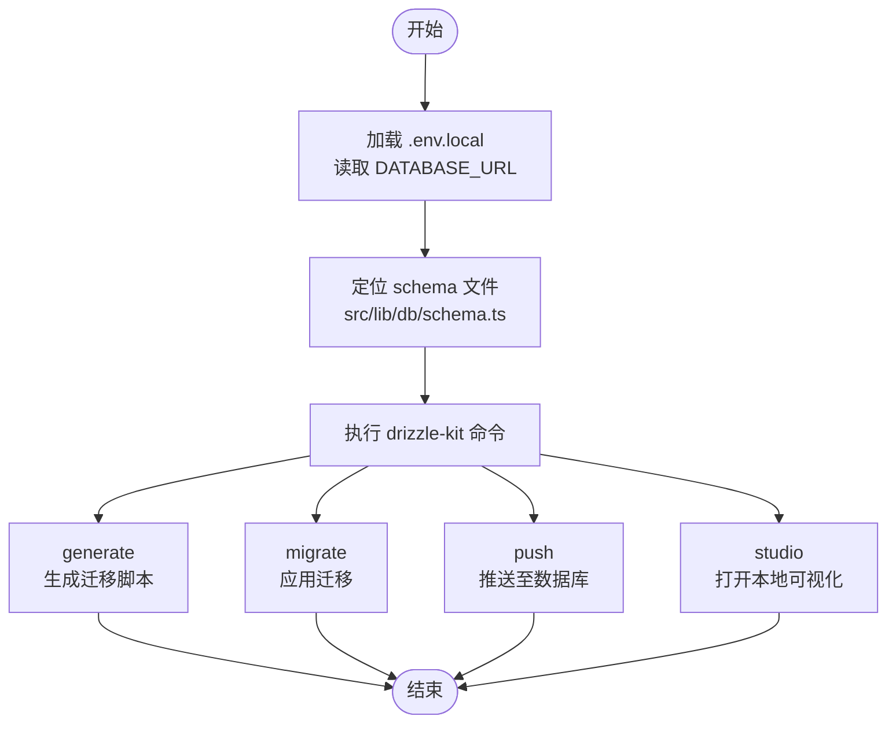
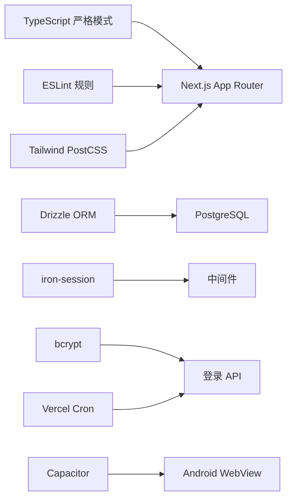

# 开发指南

<cite>
**本文引用的文件**
- [package.json](file://package.json)
- [tsconfig.json](file://tsconfig.json)
- [eslint.config.mjs](file://eslint.config.mjs)
- [next.config.js](file://next.config.js)
- [postcss.config.mjs](file://postcss.config.mjs)
- [drizzle.config.ts](file://drizzle.config.ts)
- [capacitor.config.ts](file://capacitor.config.ts)
- [vercel.json](file://vercel.json)
- [.editorconfig](file://.editorconfig)
- [.clinerules/20-coding-style.md](file://.clinerules/20-coding-style.md)
- [.roo/rules/20-coding-style.md](file://.roo/rules/20-coding-style.md)
- [.github/copilot-instructions.md](file://.github/copilot-instructions.md)
- [DESIGN.md](file://DESIGN.md)
- [src/app/layout.tsx](file://src/app/layout.tsx)
- [src/app/api/auth/login/route.ts](file://src/app/api/auth/login/route.ts)
- [src/components/ui/button.tsx](file://src/components/ui/button.tsx)
- [src/middleware.ts](file://src/middleware.ts)
</cite>

## 目录
1. [简介](#简介)
2. [项目结构](#项目结构)
3. [核心组件](#核心组件)
4. [架构总览](#架构总览)
5. [详细组件分析](#详细组件分析)
6. [依赖关系分析](#依赖关系分析)
7. [性能考量](#性能考量)
8. [故障排查指南](#故障排查指南)
9. [结论](#结论)
10. [附录](#附录)

## 简介
本开发指南面向新老开发者，系统性说明 life-os（品牌名 MindOS）项目的代码规范、命名约定、项目结构组织原则、贡献流程、开发工具链配置、测试与质量保障、调试与性能优化、部署与 CI/CD，以及常见问题的解决方案与最佳实践。项目采用 Next.js 15 App Router + React 19 + TypeScript（strict）技术栈，结合 Tailwind CSS v4（PostCSS 驱动）、Drizzle ORM、Capacitor 跨端与 PWA、以及多种 AI/OCR/媒体处理能力。

## 项目结构
- 顶层脚本与配置
  - 包管理与脚本：通过 pnpm 管理依赖，提供 dev/build/start/lint、数据库迁移与 Drizzle Studio、Capacitor 同步/构建/运行等脚本。
  - TypeScript：启用严格模式，路径别名 @/* 指向 src/*，保留 JSX 保留模式以便 App Router。
  - ESLint：基于 Next.js Web Vitals 与 TypeScript 规则集。
  - PostCSS：集成 @tailwindcss/postcss 插件，无需独立 tailwind.config.js。
  - Next.js：生产环境启用 PWA 插件，开发环境禁用以适配 Turbopack；服务器端打包排除原生模块。
  - Drizzle：从 .env.local 读取 DATABASE_URL，schema 位于 src/lib/db/schema.ts，迁移输出至 src/lib/db/migrations。
  - Capacitor：Android 应用 ID 与 WebView 服务器地址可由环境变量覆盖，开发模式使用 HTTP，UA 注入用于识别 App 请求。
  - Vercel：定义定时任务（Cron）触发多个后台接口。
  - EditorConfig：统一缩进、换行、字符集与尾随空白处理。
- 目录与路由约定
  - App Router 根目录：src/app/
  - 路由分组：(auth) 认证相关，(main) 登录后主壳
  - API 路由：src/app/api/<resource>/route.ts
  - 服务端/客户端/同构工具：src/lib/server/** / src/lib/client/** / src/lib/**
  - UI 组件：src/components/，基础 UI 组件按需放置于 src/components/ui/

**图表来源**
- [package.json:1-91](file://package.json#L1-L91)
- [next.config.js:1-32](file://next.config.js#L1-L32)
- [tsconfig.json:1-28](file://tsconfig.json#L1-L28)
- [eslint.config.mjs:1-15](file://eslint.config.mjs#L1-L15)
- [postcss.config.mjs:1-9](file://postcss.config.mjs#L1-L9)
- [drizzle.config.ts:1-14](file://drizzle.config.ts#L1-L14)
- [capacitor.config.ts:1-37](file://capacitor.config.ts#L1-L37)
- [vercel.json:1-21](file://vercel.json#L1-L21)
- [.editorconfig:1-19](file://.editorconfig#L1-L19)
- [src/app/layout.tsx:1-32](file://src/app/layout.tsx#L1-L32)
- [src/middleware.ts:1-52](file://src/middleware.ts#L1-L52)
- [src/app/api/auth/login/route.ts:1-23](file://src/app/api/auth/login/route.ts#L1-L23)
- [src/components/ui/button.tsx:1-35](file://src/components/ui/button.tsx#L1-L35)

**章节来源**
- [package.json:1-91](file://package.json#L1-L91)
- [tsconfig.json:1-28](file://tsconfig.json#L1-L28)
- [eslint.config.mjs:1-15](file://eslint.config.mjs#L1-L15)
- [postcss.config.mjs:1-9](file://postcss.config.mjs#L1-L9)
- [drizzle.config.ts:1-14](file://drizzle.config.ts#L1-L14)
- [capacitor.config.ts:1-37](file://capacitor.config.ts#L1-L37)
- [vercel.json:1-21](file://vercel.json#L1-L21)
- [.editorconfig:1-19](file://.editorconfig#L1-L19)
- [.clinerules/20-coding-style.md:1-34](file://.clinerules/20-coding-style.md#L1-L34)
- [.roo/rules/20-coding-style.md:1-34](file://.roo/rules/20-coding-style.md#L1-L34)
- [src/app/layout.tsx:1-32](file://src/app/layout.tsx#L1-L32)
- [src/middleware.ts:1-52](file://src/middleware.ts#L1-L52)

## 核心组件
- 会话中间件
  - 作用：对受保护路径进行会话校验；公开路径（如登录、部分 API、静态资源）放行；API 未登录返回 JSON 401，避免重定向导致 fetch 获取 HTML。
  - 关键点：UA 识别 App 请求；对 /api/feishu/oauth/callback 特例放行以避免弹窗回调黑屏。
- 登录 API
  - 作用：接收明文密码，与环境变量中的哈希比对；成功后设置 session 并返回 JSON。
- 全局布局
  - 作用：设置 Metadata/Viewport，注入原生初始化组件，使用 CSS 变量承载设计系统色值。
- 基础 UI 组件
  - 作用：Button 组件通过变体与尺寸映射 Tailwind 类，体现设计规范与一致的交互反馈。

**章节来源**
- [src/middleware.ts:1-52](file://src/middleware.ts#L1-L52)
- [src/app/api/auth/login/route.ts:1-23](file://src/app/api/auth/login/route.ts#L1-L23)
- [src/app/layout.tsx:1-32](file://src/app/layout.tsx#L1-L32)
- [src/components/ui/button.tsx:1-35](file://src/components/ui/button.tsx#L1-L35)

## 架构总览
整体采用“Web + 跨端 + 服务端”的混合架构：
- Web 前端：Next.js App Router，React 19，TypeScript 严格模式，Tailwind CSS v4（PostCSS）
- 服务端：Next.js API 路由，iron-session 会话，bcrypt 密码校验，Drizzle ORM + PostgreSQL
- 跨端：Capacitor 8，Android 子工程，WebView 加载远程站点（Server URL 模式）
- 部署：Vercel Cron 定时任务，本地/CI 可选 Docker Compose（仓库包含 docker-compose.yml）

**图表来源**
- [package.json:1-91](file://package.json#L1-L91)
- [next.config.js:1-32](file://next.config.js#L1-L32)
- [capacitor.config.ts:1-37](file://capacitor.config.ts#L1-L37)
- [vercel.json:1-21](file://vercel.json#L1-L21)

## 详细组件分析

### 会话中间件工作流

**图表来源**
- [src/middleware.ts:1-52](file://src/middleware.ts#L1-L52)

**章节来源**
- [src/middleware.ts:1-52](file://src/middleware.ts#L1-L52)

### 登录流程

**图表来源**
- [src/app/api/auth/login/route.ts:1-23](file://src/app/api/auth/login/route.ts#L1-L23)

**章节来源**
- [src/app/api/auth/login/route.ts:1-23](file://src/app/api/auth/login/route.ts#L1-L23)

### UI 组件：Button

**图表来源**
- [src/components/ui/button.tsx:1-35](file://src/components/ui/button.tsx#L1-L35)

**章节来源**
- [src/components/ui/button.tsx:1-35](file://src/components/ui/button.tsx#L1-L35)

### 数据库迁移与模型

**图表来源**
- [drizzle.config.ts:1-14](file://drizzle.config.ts#L1-L14)

**章节来源**
- [drizzle.config.ts:1-14](file://drizzle.config.ts#L1-L14)

### 跨端配置与开发
- 应用标识与服务器
  - appId 与 appName 固定，webDir 为静态导出目录（备用），Server URL 模式下 WebView 加载远程站点。
  - 开发时可通过环境变量覆盖服务器地址，开发模式使用 HTTP，并在 UA 中附加标识，便于服务端识别。
- 插件与平台特性
  - 启用 Splash Screen 插件，设置启动隐藏、背景色、全屏沉浸等参数。
  - Android 禁止混合内容，设置背景色与 Scheme。

**章节来源**
- [capacitor.config.ts:1-37](file://capacitor.config.ts#L1-L37)

## 依赖关系分析
- 工具链耦合
  - Next.js 与 PWA 插件：生产环境启用，开发环境禁用以适配 Turbopack。
  - TypeScript 严格模式与路径别名：确保类型安全与模块解析一致性。
  - ESLint 与 Next.js 规则：统一前端代码风格与最佳实践。
  - PostCSS + Tailwind：零配置样式管线，配合 cn() 工具类合并。
- 外部依赖与原生模块
  - 服务器端 webpack 外部化原生模块（如 @napi-rs/canvas、ppu-paddle-ocr、onnxruntime-node），避免打包失败。
- 数据层
  - Drizzle ORM + PostgreSQL，迁移脚本与可视化工具链完整。
- 会话与安全
  - iron-session + bcrypt，中间件统一拦截与放行策略。

**图表来源**
- [package.json:1-91](file://package.json#L1-L91)
- [next.config.js:1-32](file://next.config.js#L1-L32)
- [drizzle.config.ts:1-14](file://drizzle.config.ts#L1-L14)
- [src/middleware.ts:1-52](file://src/middleware.ts#L1-L52)
- [src/app/api/auth/login/route.ts:1-23](file://src/app/api/auth/login/route.ts#L1-L23)
- [capacitor.config.ts:1-37](file://capacitor.config.ts#L1-L37)
- [vercel.json:1-21](file://vercel.json#L1-L21)

**章节来源**
- [package.json:1-91](file://package.json#L1-L91)
- [next.config.js:1-32](file://next.config.js#L1-L32)
- [drizzle.config.ts:1-14](file://drizzle.config.ts#L1-L14)
- [src/middleware.ts:1-52](file://src/middleware.ts#L1-L52)
- [src/app/api/auth/login/route.ts:1-23](file://src/app/api/auth/login/route.ts#L1-L23)
- [capacitor.config.ts:1-37](file://capacitor.config.ts#L1-L37)
- [vercel.json:1-21](file://vercel.json#L1-L21)

## 性能考量
- 构建与运行
  - 使用 pnpm 与严格 TS，减少冗余类型检查与打包体积。
  - 生产环境启用 PWA，提升离线体验与加载速度。
- 样式与渲染
  - Tailwind 原子类 + 条件类合并工具，避免重复样式与过度嵌套。
  - Framer Motion 轻量动效，遵循设计规范中的动效阈值。
- 数据访问
  - Drizzle ORM 查询与迁移分离，避免运行时 schema 变更带来的性能波动。
- 服务器端优化
  - 外部化原生模块，减少打包体积与编译时间。
  - 中间件精确匹配公开路径，降低不必要的会话读取。

[本节为通用性能建议，无需特定文件引用]

## 故障排查指南
- 会话与权限
  - 症状：API 返回 401 或页面重定向到登录。
  - 排查：确认中间件公开路径列表是否包含目标路径；检查会话是否保存成功；确认 UA 是否为 App（中间件会附加标识）。
- 登录失败
  - 症状：POST /api/auth/login 返回 401。
  - 排查：确认环境变量 ACCESS_PASSWORD_HASH 是否正确；确认提交的密码格式与网络传输是否正常。
- 样式异常
  - 症状：组件类名未生效或冲突。
  - 排查：确认 Tailwind PostCSS 插件已启用；使用类名合并工具（如 cn）避免冲突；遵循设计规范中的颜色与间距。
- 跨端 WebView 无法加载
  - 症状：Android WebView 黑屏或无法连接。
  - 排查：确认 Capacitor 服务器 URL 与开发模式 HTTP；检查 UA 附加与 App Scheme；确保公开路径中包含 OAuth 回调。
- 数据库迁移失败
  - 症状：迁移报错或数据库不一致。
  - 排查：确认 .env.local 中 DATABASE_URL；使用 drizzle-kit studio 查看当前状态；按顺序执行 generate/migrate/push。

**章节来源**
- [src/middleware.ts:1-52](file://src/middleware.ts#L1-L52)
- [src/app/api/auth/login/route.ts:1-23](file://src/app/api/auth/login/route.ts#L1-L23)
- [capacitor.config.ts:1-37](file://capacitor.config.ts#L1-L37)
- [drizzle.config.ts:1-14](file://drizzle.config.ts#L1-L14)

## 结论
本指南提供了从项目结构、代码规范、工具链配置到测试与部署的完整开发指引。建议新开发者优先阅读设计规范与编码风格文件，再对照具体组件与 API 路由进行实践，逐步掌握 Next.js、Tailwind、Drizzle、Capacitor 与 Vercel 的协同工作方式。

[本节为总结性内容，无需特定文件引用]

## 附录

### 代码规范与命名约定
- 路径与目录
  - 路径别名：@/* → src/*
  - App Router 根：src/app/
  - 路由分组：(auth)/(main)
  - API 路由：src/app/api/<resource>/route.ts
  - 服务端/客户端/同构：src/lib/server/** / src/lib/client/** / src/lib/**
  - UI 组件：src/components/，基础 UI 放置于 src/components/ui/
- 组件约定
  - 默认 Server Component；仅在需要 hooks/浏览器 API/事件时加 'use client'
  - 严禁在 Server Component 中引入含 'use client' 链的纯客户端工具
  - 表单/交互：react-hook-form + Radix UI；动效：framer-motion
  - 样式：Tailwind 原子类 + cva 变体；条件类用 clsx + tailwind-merge（已封装为 cn()）
- 文案与字段
  - “AI 用量”统一替换为“心智点数”
  - 心智日志金色字体色号与区域滚动限制需遵循设计规范
- TypeScript
  - strict: true；禁止使用 any；导出类型用 export type；服务端环境变量通过 process.env 读取，禁止把 .env* 内容写入代码或 spec

**章节来源**
- [.clinerules/20-coding-style.md:1-34](file://.clinerules/20-coding-style.md#L1-L34)
- [.roo/rules/20-coding-style.md:1-34](file://.roo/rules/20-coding-style.md#L1-L34)
- [DESIGN.md:1-291](file://DESIGN.md#L1-L291)

### 贡献指南与提交规范
- 包管理器：仅 pnpm
- 工作目录：所有命令必须在 life-os/ 根目录下执行
- 常用命令
  - 开发：pnpm dev / pnpm build / pnpm lint
  - 数据库：pnpm db:generate / db:migrate / db:push / db:studio
  - 跨端：pnpm cap:sync / cap:build:android / cap:run:android
- 红线清单
  - 严禁读取/修改/列举 .env/.env.* 文件内容
  - 严禁跨项目操作（激活根为 life-os/）
  - UI 改动须先读设计规范
  - T0/T1 改动须经评审闸门
  - 进度单一事实源为产品 Spec 与 plan.md 状态字段

**章节来源**
- [.github/copilot-instructions.md:1-60](file://.github/copilot-instructions.md#L1-L60)

### 开发工具链配置
- TypeScript
  - 严格模式、路径别名 @/* → src/*、JSX 保留模式、增量编译
- ESLint
  - 基于 next/core-web-vitals 与 next/typescript 规则集
- Tailwind CSS v4
  - 通过 @tailwindcss/postcss 插件启用，无需独立配置文件
- Next.js
  - 生产环境启用 PWA；开发环境禁用；服务器端外部化原生模块
- Drizzle ORM
  - 从 .env.local 读取 DATABASE_URL；schema 与 migrations 路径固定
- Capacitor
  - App ID/Name/WebDir；Server URL 模式；UA 附加；Splash Screen 插件
- Vercel
  - 定义多个 Cron 定时任务

**章节来源**
- [tsconfig.json:1-28](file://tsconfig.json#L1-L28)
- [eslint.config.mjs:1-15](file://eslint.config.mjs#L1-L15)
- [postcss.config.mjs:1-9](file://postcss.config.mjs#L1-L9)
- [next.config.js:1-32](file://next.config.js#L1-L32)
- [drizzle.config.ts:1-14](file://drizzle.config.ts#L1-L14)
- [capacitor.config.ts:1-37](file://capacitor.config.ts#L1-L37)
- [vercel.json:1-21](file://vercel.json#L1-L21)

### 测试策略与质量保证
- 代码质量
  - ESLint 规则与 Next.js 标准保持一致，确保代码风格与可维护性
  - TypeScript 严格模式，减少运行时风险
- 端到端与集成
  - Android 子工程提供单元与仪器测试模板，可在 android/app/src/test 与 android/app/src/androidTest 下扩展
- 数据库变更
  - 使用 Drizzle Kit 生成与应用迁移，配合 studio 进行可视化验证
- 部署与监控
  - Vercel Cron 定时任务保障后台任务执行；生产环境 PWA 提升用户体验

**章节来源**
- [eslint.config.mjs:1-15](file://eslint.config.mjs#L1-L15)
- [tsconfig.json:1-28](file://tsconfig.json#L1-L28)
- [drizzle.config.ts:1-14](file://drizzle.config.ts#L1-L14)
- [vercel.json:1-21](file://vercel.json#L1-L21)

### 调试技巧与性能优化建议
- 调试
  - 使用 Next.js DevTools 与浏览器开发者工具；关注中间件公开路径匹配与会话状态
  - 对 API 路由添加最小可复现示例，避免全局影响
- 性能
  - Tailwind 原子类 + 条件类合并，减少样式冲突与重绘
  - 服务器端外部化原生模块，缩短构建时间
  - 生产环境启用 PWA，优化缓存与离线体验

**章节来源**
- [next.config.js:1-32](file://next.config.js#L1-L32)
- [src/middleware.ts:1-52](file://src/middleware.ts#L1-L52)

### 部署流程与 CI/CD 配置
- 本地开发
  - pnpm dev 启动本地服务（端口 3100）
  - pnpm build 与 pnpm start 用于预览生产构建
- 数据库
  - pnpm db:generate / db:migrate / db:push / db:studio
- 跨端
  - pnpm cap:sync / cap:build:android / cap:run:android
- Vercel
  - Cron 定时任务自动触发后台接口
- Docker
  - 仓库包含 docker-compose.yml，可用于本地容器化部署

**章节来源**
- [package.json:1-91](file://package.json#L1-L91)
- [vercel.json:1-21](file://vercel.json#L1-L21)
- [capacitor.config.ts:1-37](file://capacitor.config.ts#L1-L37)

### 常见问题与最佳实践
- UI 改动前务必阅读设计规范，避免视觉不一致
- 服务端环境变量仅以“需配置环境变量：KEY 名”的形式提出，不写入值
- 跨项目引用严格限制在 life-os/ 根目录内
- T0/T1 改动需经过评审闸门，不得单方面宣布合并完成

**章节来源**
- [.github/copilot-instructions.md:1-60](file://.github/copilot-instructions.md#L1-L60)

### 新开发者入门指南
- 环境准备
  - 使用 pnpm 作为包管理器
  - 安装 Node.js（版本与依赖兼容）
- 本地运行
  - pnpm dev 启动开发服务器（端口 3100）
  - 配置 .env.local（如需数据库），确保 DATABASE_URL 正确
- 调试与验证
  - 使用浏览器与移动端模拟器验证 UI 与交互
  - 通过中间件与 API 路由验证会话与权限控制
- 提交流程
  - 遵循红线清单与贡献规范，提交前确保通过 pnpm lint 与本地测试

**章节来源**
- [.github/copilot-instructions.md:1-60](file://.github/copilot-instructions.md#L1-L60)
- [package.json:1-91](file://package.json#L1-L91)
- [drizzle.config.ts:1-14](file://drizzle.config.ts#L1-L14)