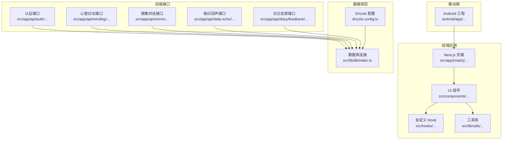
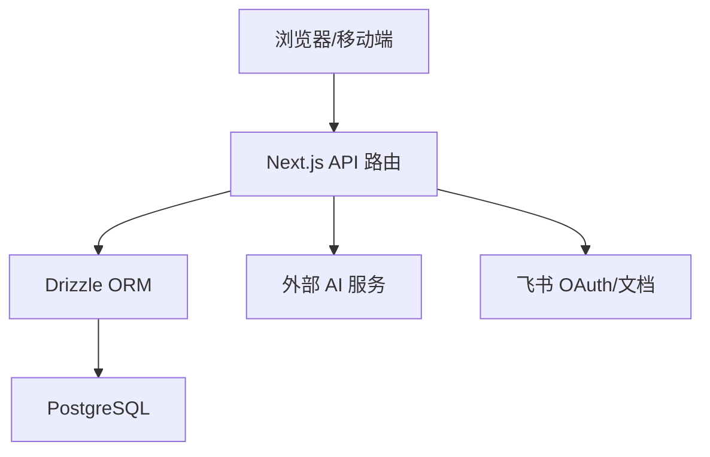
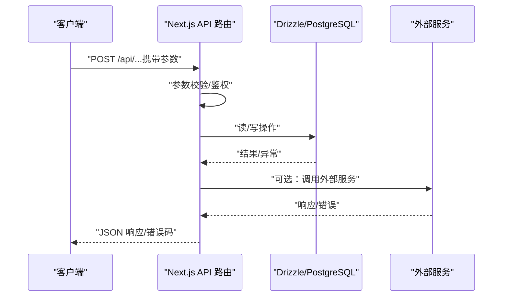
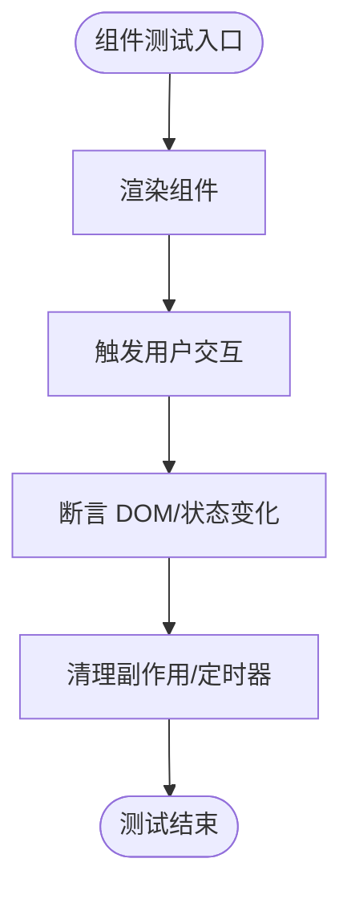
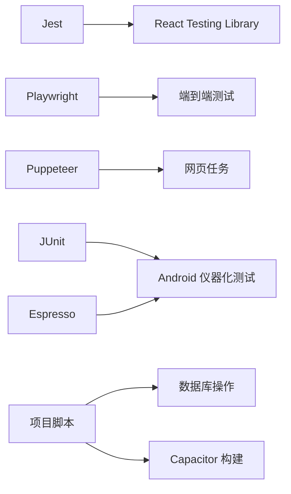

# 测试策略

<cite>
**本文引用的文件**
- [package.json](file://package.json)
- [tsconfig.json](file://tsconfig.json)
- [drizzle.config.ts](file://drizzle.config.ts)
- [src/lib/db/index.ts](file://src/lib/db/index.ts)
- [src/app/api/auth/login/route.ts](file://src/app/api/auth/login/route.ts)
- [src/app/api/auth/logout/route.ts](file://src/app/api/auth/logout/route.ts)
- [src/app/api/daily-echo/route.ts](file://src/app/api/daily-echo/route.ts)
- [src/app/api/diary/feedback/route.ts](file://src/app/api/diary/feedback/route.ts)
- [src/app/api/mindlog/generate/route.ts](file://src/app/api/mindlog/generate/route.ts)
- [src/app/api/mirror/chat/route.ts](file://src/app/api/mirror/chat/route.ts)
- [src/components/dashboard/module-diary.tsx](file://src/components/dashboard/module-diary.tsx)
- [src/components/dashboard/module-knowledge.tsx](file://src/components/dashboard/module-knowledge.tsx)
- [src/components/dashboard/module-mirror.tsx](file://src/components/dashboard/module-mirror.tsx)
- [src/components/dashboard/module-todos.tsx](file://src/components/dashboard/module-todos.tsx)
- [src/components/errors/error-boundary.tsx](file://src/components/errors/error-boundary.tsx)
- [src/hooks/use-auth.ts](file://src/hooks/use-auth.ts)
- [src/lib/utils/index.ts](file://src/lib/utils/index.ts)
- [android/app/src/androidTest/java/com/getcapacitor/myapp/ExampleInstrumentedTest.java](file://android/app/src/androidTest/java/com/getcapacitor/myapp/ExampleInstrumentedTest.java)
- [android/app/build.gradle](file://android/app/build.gradle)
</cite>

## 目录
1. 引言
2. 项目结构
3. 核心组件
4. 架构总览
5. 详细组件分析
6. 依赖分析
7. 性能考虑
8. 故障排查指南
9. 结论
10. 附录

## 引言
本测试策略文档面向 life-os（mind-os）项目，系统化阐述单元测试、集成测试与端到端测试的实施路径，明确测试框架选择与配置要点（如 Jest、React Testing Library），给出测试用例编写规范与覆盖率目标，覆盖 API 接口测试与数据库测试策略，并说明 Mock 数据与测试环境配置方法。同时提供性能与压力测试建议、测试自动化与持续集成流程设计，以及调试技巧与常见问题解决方案。

## 项目结构
项目采用 Next.js 应用架构，前端页面与 API 路由位于 src/app 下；数据库访问通过 Drizzle ORM 连接 PostgreSQL；移动端基于 Capacitor（Android 工程位于 android/app）。TypeScript 编译配置严格，路径别名统一指向 src。

图表来源
- [tsconfig.json:1-28](file://tsconfig.json#L1-L28)
- [drizzle.config.ts:1-14](file://drizzle.config.ts#L1-L14)
- [src/lib/db/index.ts:1-11](file://src/lib/db/index.ts#L1-L11)

章节来源
- [tsconfig.json:1-28](file://tsconfig.json#L1-L28)
- [drizzle.config.ts:1-14](file://drizzle.config.ts#L1-L14)
- [src/lib/db/index.ts:1-11](file://src/lib/db/index.ts#L1-L11)

## 核心组件
- 前端页面与路由：Next.js App Router 页面与 API 路由，用于用户交互与服务端逻辑。
- 组件层：业务模块组件（如日记、知识、镜像、待办等）。
- 自定义 Hook：如认证状态管理。
- 工具库：通用函数与辅助工具。
- 数据库层：Drizzle ORM + PostgreSQL，提供类型安全的数据访问。
- 移动端：Capacitor Android 工程，包含 JUnit 与 Espresso 依赖，支持仪器化测试。

章节来源
- [src/components/dashboard/module-diary.tsx](file://src/components/dashboard/module-diary.tsx)
- [src/components/dashboard/module-knowledge.tsx](file://src/components/dashboard/module-knowledge.tsx)
- [src/components/dashboard/module-mirror.tsx](file://src/components/dashboard/module-mirror.tsx)
- [src/components/dashboard/module-todos.tsx](file://src/components/dashboard/module-todos.tsx)
- [src/hooks/use-auth.ts](file://src/hooks/use-auth.ts)
- [src/lib/utils/index.ts](file://src/lib/utils/index.ts)
- [src/lib/db/index.ts:1-11](file://src/lib/db/index.ts#L1-L11)

## 架构总览
下图展示测试视角下的系统交互：浏览器/移动端调用 Next.js API 路由，路由通过 Drizzle 访问数据库，部分接口可能调用外部 AI 服务或第三方平台（如飞书）。

图表来源
- [src/app/api/auth/login/route.ts](file://src/app/api/auth/login/route.ts)
- [src/app/api/auth/logout/route.ts](file://src/app/api/auth/logout/route.ts)
- [src/app/api/daily-echo/route.ts](file://src/app/api/daily-echo/route.ts)
- [src/app/api/diary/feedback/route.ts](file://src/app/api/diary/feedback/route.ts)
- [src/app/api/mindlog/generate/route.ts](file://src/app/api/mindlog/generate/route.ts)
- [src/app/api/mirror/chat/route.ts](file://src/app/api/mirror/chat/route.ts)
- [src/lib/db/index.ts:1-11](file://src/lib/db/index.ts#L1-L11)

## 详细组件分析

### 单元测试策略
- 测试范围
  - 工具函数与纯函数：在 src/lib/utils 中的通用函数应优先进行单元测试，确保边界条件与错误处理。
  - 自定义 Hook：对 use-auth 等 Hook 的返回值与副作用进行断言。
  - 组件逻辑：对无副作用的组件渲染与事件触发进行断言（结合 React Testing Library）。
- 框架与配置
  - 使用 Jest 作为测试运行器，配合 @testing-library/react 进行组件测试。
  - TypeScript 支持通过 ts-jest 或 Jest 默认 TS 处理。
  - 路径别名与编译选项参考 tsconfig.json。
- Mock 策略
  - 对外部依赖（如 fetch、AI SDK、数据库）进行模块级 Mock。
  - 对全局对象（如 window、localStorage）进行沙箱处理。
- 覆盖率目标
  - 关键路径与核心逻辑覆盖率不低于 80%，组件与工具函数不低于 70%。

章节来源
- [tsconfig.json:1-28](file://tsconfig.json#L1-L28)
- [src/lib/utils/index.ts](file://src/lib/utils/index.ts)
- [src/hooks/use-auth.ts](file://src/hooks/use-auth.ts)

### 集成测试策略
- 测试范围
  - API 路由集成：验证 Next.js API 路由在真实请求下的行为，包括参数解析、鉴权、数据库写入/读取、外部服务调用。
  - 数据库集成：通过 Drizzle 执行迁移与查询，验证 schema 与数据一致性。
- 框架与配置
  - 使用 Jest + Supertest 或直接发起 fetch 请求模拟 HTTP 请求。
  - 使用独立测试数据库实例（如 Docker Postgres）隔离测试数据。
- Mock 策略
  - 对外部服务（如 AI、飞书）使用 Mock 服务器或 Stub。
  - 对认证会话与 Cookie 进行伪造以覆盖鉴权分支。
- 覆盖率目标
  - API 与数据库操作覆盖率不低于 70%。

章节来源
- [src/app/api/auth/login/route.ts](file://src/app/api/auth/login/route.ts)
- [src/app/api/auth/logout/route.ts](file://src/app/api/auth/logout/route.ts)
- [src/app/api/daily-echo/route.ts](file://src/app/api/daily-echo/route.ts)
- [src/app/api/diary/feedback/route.ts](file://src/app/api/diary/feedback/route.ts)
- [src/app/api/mindlog/generate/route.ts](file://src/app/api/mindlog/generate/route.ts)
- [src/app/api/mirror/chat/route.ts](file://src/app/api/mirror/chat/route.ts)
- [drizzle.config.ts:1-14](file://drizzle.config.ts#L1-L14)
- [src/lib/db/index.ts:1-11](file://src/lib/db/index.ts#L1-L11)

### 端到端测试策略
- 测试范围
  - 用户关键路径：登录、查看日记、生成心智日志、镜像对话、知识捕获等。
  - 移动端：基于 Android Instrumentation Tests（JUnit + Espresso）覆盖核心交互。
- 框架与配置
  - Web：Cypress 或 Playwright（推荐 Playwright，生态完善且跨平台）。
  - 移动端：Android Instrumentation Tests 已具备 JUnit 与 Espresso 依赖，可扩展。
- Mock 策略
  - 使用 Mock 服务器拦截网络请求，控制外部依赖行为。
  - 对数据库使用快照或临时表隔离测试数据。
- 覆盖率目标
  - 关键用户旅程覆盖率不低于 60%。

章节来源
- [android/app/src/androidTest/java/com/getcapacitor/myapp/ExampleInstrumentedTest.java:1-50](file://android/app/src/androidTest/java/com/getcapacitor/myapp/ExampleInstrumentedTest.java#L1-50)
- [android/app/build.gradle:1-50](file://android/app/build.gradle#L1-L50)

### API 接口测试
- 登录/登出：验证会话建立与销毁、响应格式与状态码。
- 日常回声/日记反馈：验证输入校验、数据持久化与响应一致性。
- 心智日志生成/镜像对话：验证外部服务调用与错误降级。
- 飞书集成：OAuth 回调、文档列表与内容抓取的链路测试。

图表来源
- [src/app/api/auth/login/route.ts](file://src/app/api/auth/login/route.ts)
- [src/app/api/auth/logout/route.ts](file://src/app/api/auth/logout/route.ts)
- [src/app/api/daily-echo/route.ts](file://src/app/api/daily-echo/route.ts)
- [src/app/api/diary/feedback/route.ts](file://src/app/api/diary/feedback/route.ts)
- [src/app/api/mindlog/generate/route.ts](file://src/app/api/mindlog/generate/route.ts)
- [src/app/api/mirror/chat/route.ts](file://src/app/api/mirror/chat/route.ts)
- [src/lib/db/index.ts:1-11](file://src/lib/db/index.ts#L1-L11)

### 数据库测试策略
- 迁移与模式：使用 drizzle.config.ts 定义 schema 与迁移输出目录，确保测试前执行迁移。
- 连接与事务：在测试中使用独立连接与事务回滚，避免污染共享数据库。
- 数据清理：每个测试用例前后清理测试数据，或使用只读快照。
- 并发与锁：针对并发写入场景进行压力测试与死锁规避验证。

章节来源
- [drizzle.config.ts:1-14](file://drizzle.config.ts#L1-L14)
- [src/lib/db/index.ts:1-11](file://src/lib/db/index.ts#L1-L11)

### 组件与 UI 测试
- 组件渲染：验证 props 变化导致的 DOM 更新。
- 交互行为：按钮点击、表单提交、键盘事件等。
- 错误边界：确保错误边界组件能捕获并展示错误信息。
- 可访问性：基础 ARIA 属性与语义标签检查。

图表来源
- [src/components/errors/error-boundary.tsx](file://src/components/errors/error-boundary.tsx)

章节来源
- [src/components/dashboard/module-diary.tsx](file://src/components/dashboard/module-diary.tsx)
- [src/components/dashboard/module-knowledge.tsx](file://src/components/dashboard/module-knowledge.tsx)
- [src/components/dashboard/module-mirror.tsx](file://src/components/dashboard/module-mirror.tsx)
- [src/components/dashboard/module-todos.tsx](file://src/components/dashboard/module-todos.tsx)
- [src/components/errors/error-boundary.tsx](file://src/components/errors/error-boundary.tsx)

## 依赖分析
- 测试相关依赖与脚本
  - Jest 与 React Testing Library：用于单元与组件测试。
  - Playwright/Cypress：用于端到端测试。
  - Puppeteer：可用于网页截图与 PDF 生成等场景的自动化。
  - Android 测试依赖：JUnit、Espresso，已存在于 Android 工程中。
- 项目脚本
  - 数据库相关脚本：迁移、推送到数据库、打开 Studio。
  - Capacitor 相关脚本：同步、构建、运行 Android。

图表来源
- [package.json:1-91](file://package.json#L1-L91)
- [android/app/build.gradle:1-50](file://android/app/build.gradle#L1-L50)

章节来源
- [package.json:1-91](file://package.json#L1-L91)
- [android/app/build.gradle:1-50](file://android/app/build.gradle#L1-L50)

## 性能考虑
- 单元测试
  - 避免真实网络与数据库调用，使用 Mock 与内存存储。
  - 将耗时操作（如图像识别、OCR）替换为快速 Stub。
- 集成测试
  - 使用轻量级测试数据库（Docker）与连接池复用。
  - 对外部服务调用设置合理超时与重试策略。
- 端到端测试
  - 使用 Headless 模式与并行会话，减少资源占用。
  - 对慢速接口进行分层隔离与缓存。
- 压力测试
  - 使用压测工具（如 k6、Artillery）对关键 API 路由施加负载。
  - 关注数据库连接数、外部服务限流与错误率指标。

## 故障排查指南
- 常见问题
  - 环境变量缺失：数据库 URL、第三方服务密钥未注入，导致连接失败或鉴权异常。
  - 路由导入路径错误：Next.js 路由约定变更导致测试无法定位 API。
  - 数据库迁移未执行：Schema 不一致导致集成测试失败。
  - Mock 不完整：外部依赖未完全 Mock 导致测试不稳定。
- 调试技巧
  - 在测试中打印上下文与请求/响应体，便于定位问题。
  - 使用断点与单步调试（VS Code Jest 插件）。
  - 分离“稳定”与“易变”测试，优先修复易变测试。
- 解决方案
  - 补充 .env.local 与 CI 环境变量。
  - 在测试前执行数据库迁移与初始化。
  - 对 Mock 层进行版本化管理，确保与生产依赖一致。

章节来源
- [drizzle.config.ts:1-14](file://drizzle.config.ts#L1-L14)
- [src/lib/db/index.ts:1-11](file://src/lib/db/index.ts#L1-L11)

## 结论
本测试策略以“单元—集成—端到端”三层金字塔为核心，结合 Drizzle ORM 与 Next.js API 路由，覆盖前端组件、业务逻辑与数据库交互。通过合理的 Mock 策略、严格的覆盖率目标与持续集成流程，保障代码质量与交付稳定性。移动端测试可依托现有 Android 工程基础逐步完善。

## 附录
- 测试用例编写规范
  - 命名：describe/it 使用清晰语义，描述行为而非实现。
  - 断言：优先断言行为与输出，避免断言内部实现细节。
  - 边界：覆盖空输入、非法格式、超长字符串、特殊字符等。
  - 并发：对异步操作与竞态条件进行显式测试。
- 覆盖率要求（建议）
  - 工具函数与 Hook：≥ 80%
  - 组件：≥ 70%
  - API 与数据库：≥ 70%
  - 关键用户旅程：≥ 60%