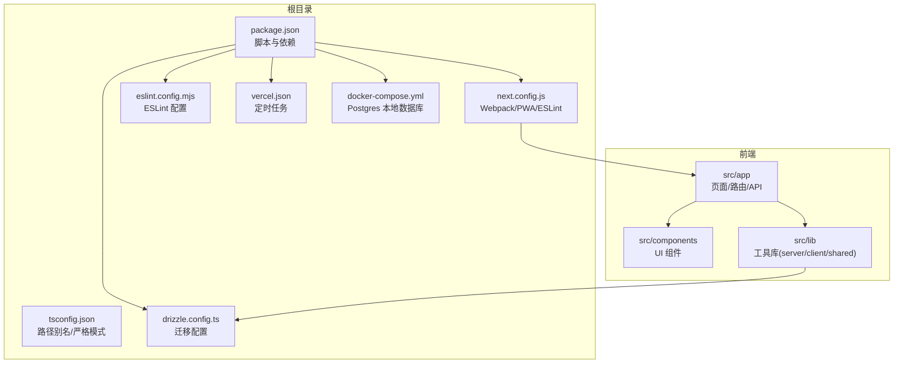
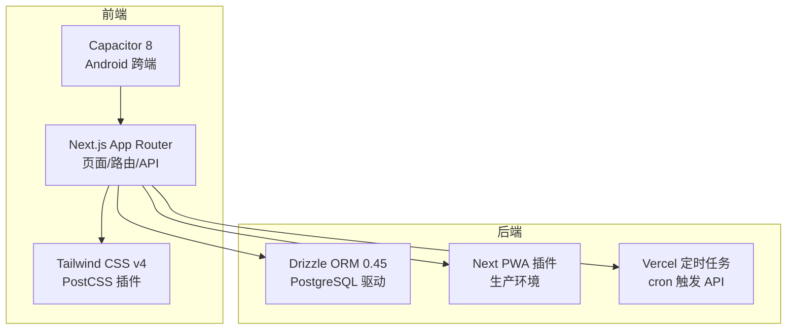
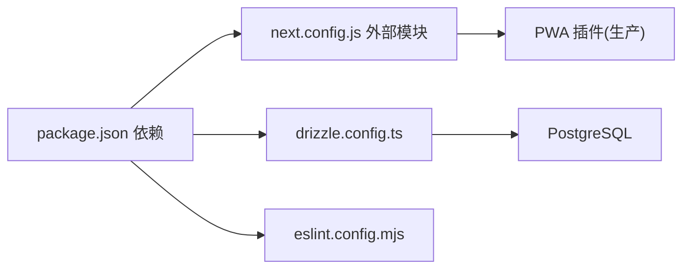

# 贡献指南

<cite>
**本文档引用的文件**
- [.clinerules/00-constitution.md](file://.clinerules/00-constitution.md)
- [.clinerules/10-tech-stack.md](file://.clinerules/10-tech-stack.md)
- [.clinerules/20-coding-style.md](file://.clinerules/20-coding-style.md)
- [.roo/rules/00-constitution.md](file://.roo/rules/00-constitution.md)
- [.roo/rules/10-tech-stack.md](file://.roo/rules/10-tech-stack.md)
- [.roo/rules/20-coding-style.md](file://.roo/rules/20-coding-style.md)
- [.roo/rules/30-commands.md](file://.roo/rules/30-commands.md)
- [.roo/rules/README.md](file://.roo/rules/README.md)
- [package.json](file://package.json)
- [docker-compose.yml](file://docker-compose.yml)
- [next.config.js](file://next.config.js)
- [drizzle.config.ts](file://drizzle.config.ts)
- [eslint.config.mjs](file://eslint.config.mjs)
- [tsconfig.json](file://tsconfig.json)
- [DESIGN.md](file://DESIGN.md)
- [vercel.json](file://vercel.json)
</cite>

## 目录
1. [简介](#简介)
2. [项目结构](#项目结构)
3. [核心组件](#核心组件)
4. [架构总览](#架构总览)
5. [详细组件分析](#详细组件分析)
6. [依赖分析](#依赖分析)
7. [性能考虑](#性能考虑)
8. [故障排查指南](#故障排查指南)
9. [结论](#结论)
10. [附录](#附录)

## 简介
本贡献指南面向希望参与 life-os 项目开发的贡献者，提供从开发环境搭建到代码提交、分支与发布策略、CI/CD 与自动化测试、问题与需求提交规范、代码审查与合并标准、以及社区行为与沟通规范的完整指引。项目遵循“宪法”与“规则集”，强调安全、一致性与可维护性。

## 项目结构
life-os 是一个基于 Next.js App Router 的全栈应用，采用 TypeScript、Tailwind CSS v4、Drizzle ORM、Capacitor 跨端与 Vercel 部署。核心目录与职责概览如下：
- 根目录脚本与配置：package.json、next.config.js、tsconfig.json、eslint.config.mjs、drizzle.config.ts、vercel.json、docker-compose.yml
- 前端与路由：src/app 下的页面与 API 路由
- 组件与工具：src/components、src/hooks、src/lib（服务端/客户端/同构）
- 设计规范：DESIGN.md
- 规则与宪法：.clinerules 与 .roo/rules（宪法、技术栈、编码风格、命令）

**图示来源**
- [package.json:1-91](file://package.json#L1-L91)
- [next.config.js:1-32](file://next.config.js#L1-L32)
- [tsconfig.json:1-28](file://tsconfig.json#L1-L28)
- [eslint.config.mjs:1-15](file://eslint.config.mjs#L1-L15)
- [drizzle.config.ts:1-14](file://drizzle.config.ts#L1-L14)
- [vercel.json:1-21](file://vercel.json#L1-L21)
- [docker-compose.yml:1-18](file://docker-compose.yml#L1-L18)

**章节来源**
- [package.json:1-91](file://package.json#L1-L91)
- [next.config.js:1-32](file://next.config.js#L1-L32)
- [tsconfig.json:1-28](file://tsconfig.json#L1-L28)
- [eslint.config.mjs:1-15](file://eslint.config.mjs#L1-L15)
- [drizzle.config.ts:1-14](file://drizzle.config.ts#L1-L14)
- [vercel.json:1-21](file://vercel.json#L1-L21)
- [docker-compose.yml:1-18](file://docker-compose.yml#L1-L18)

## 核心组件
- 宪法与规则：项目最高准则，包含铁律、上下文加载顺序与评审闸门要求
- 技术栈与运行环境：Next.js 15、React 19、TypeScript 5、Tailwind CSS v4、Drizzle ORM、Capacitor 8、AI SDK、数据库与包管理器约束
- 编码风格与目录约定：组件默认 Server Component、路径别名、API 路由组织、UI 改动前置义务、文案与字段规范
- 命令与执行约束：包管理器、工作目录、PowerShell 注意事项、常用命令与禁止行为

**章节来源**
- [.clinerules/00-constitution.md:1-20](file://.clinerules/00-constitution.md#L1-L20)
- [.clinerules/10-tech-stack.md:1-27](file://.clinerules/10-tech-stack.md#L1-L27)
- [.clinerules/20-coding-style.md:1-34](file://.clinerules/20-coding-style.md#L1-L34)
- [.roo/rules/30-commands.md:1-38](file://.roo/rules/30-commands.md#L1-L38)

## 架构总览
项目采用前后端一体化的 Next.js App Router 架构，结合 Drizzle ORM 访问 PostgreSQL，Capacitor 实现跨端能力，Vercel 提供托管与定时任务，Tailwind CSS v4 通过 PostCSS 插件启用。

**图示来源**
- [next.config.js:19-31](file://next.config.js#L19-L31)
- [drizzle.config.ts:6-13](file://drizzle.config.ts#L6-L13)
- [vercel.json:2-19](file://vercel.json#L2-L19)

## 详细组件分析

### 开发环境搭建
- 前置条件
  - Node.js 与 pnpm：包管理器强制为 pnpm，其他包管理器一律拒绝
  - Docker：本地 Postgres 数据库通过 docker-compose 启动
  - TypeScript 严格模式与路径别名：@/* 指向 src/*
- 启动步骤
  - 启动数据库：docker-compose up -d
  - 安装依赖：pnpm install（禁止 npm/yarn）
  - 开发启动：pnpm dev（端口 3100，Turbopack）
  - 数据库迁移：pnpm db:migrate 或 db:generate
  - 跨端同步：pnpm cap:sync（Android Studio 需配置 SDK 路径）
- 关键配置
  - Webpack 外置原生模块：@napi-rs/canvas、ppu-paddle-ocr、onnxruntime-node
  - PWA 仅在生产环境启用
  - ESLint 忽略构建期错误（ignoreDuringBuilds），TS 构建错误忽略（ignoreBuildErrors）

**章节来源**
- [.roo/rules/30-commands.md:3-10](file://.roo/rules/30-commands.md#L3-L10)
- [docker-compose.yml:1-18](file://docker-compose.yml#L1-L18)
- [package.json:5-18](file://package.json#L5-L18)
- [next.config.js:9-18](file://next.config.js#L9-L18)
- [next.config.js:22-31](file://next.config.js#L22-L31)
- [tsconfig.json:21-23](file://tsconfig.json#L21-L23)

### 代码提交流程与 Pull Request 规范
- 分支策略
  - 主分支：main/master（禁止 force push）
  - 功能分支：feature/<name>、fix/<name>、chore/<name>
  - 发布分支：release/<version>（用于预发布与回归测试）
- 提交前检查
  - 代码风格：ESLint（pnpm lint）
  - 类型检查：TypeScript（严格模式）
  - 数据库变更：使用 Drizzle Kit 生成迁移并自测
  - 跨端变更：Capacitor 同步与真机验证
- PR 规范
  - 必须关联 Issue 或需求文档
  - 必须通过自动化测试与 Lint
  - 必须进行至少一次同行评审（含 UI/设计一致性核验）
  - 合并前确保无冲突，避免直接推送至主分支

**章节来源**
- [.roo/rules/30-commands.md:32-38](file://.roo/rules/30-commands.md#L32-L38)
- [eslint.config.mjs:12-12](file://eslint.config.mjs#L12-L12)
- [drizzle.config.ts:6-13](file://drizzle.config.ts#L6-L13)

### 项目宪法条款与开发约束
- 宪法铁律（严禁突破）
  - 严禁读取/修改/.env* 文件内容；如需配置变量，仅在 spec/plan 中以“需配置环境变量：KEY 名”形式标注（不含值）
  - 严禁跨项目操作；当前激活项目根为 life-os/
  - UI 改动须先读设计规范；未读不得动 UI 代码
  - T0/T1 改动须经评审闸门（宪法 §2.5），AI 不得单方面合并
  - 进度单一事实源：.qoder/specs/life-os-spec.md 与对应 plan.md 的状态字段；严禁另建平行文件
- 上下文加载顺序
  - 本宪法文件 → .qoder/README.md 场景索引 → .qoder/constitution.md 全文 → 任务相关 spec/plan → 同目录其余规则

**章节来源**
- [.clinerules/00-constitution.md:5-11](file://.clinerules/00-constitution.md#L5-L11)
- [.clinerules/00-constitution.md:13-20](file://.clinerules/00-constitution.md#L13-L20)
- [.roo/rules/00-constitution.md:5-11](file://.roo/rules/00-constitution.md#L5-L11)
- [.roo/rules/00-constitution.md:13-20](file://.roo/rules/00-constitution.md#L13-L20)

### 技术栈与运行环境
- 核心技术栈
  - 框架：Next.js 15（App Router）+ Turbopack（dev）+ React 19
  - 语言：TypeScript 5（strict: true，路径别名 @/* → src/*）
  - 样式：Tailwind CSS v4（无独立 tailwind.config，通过 postcss.config.mjs 启用）
  - 状态/数据：Drizzle ORM 0.45 + postgres 驱动；客户端缓存用 idb（IndexedDB）
  - 会话：iron-session 8（cookie 名 mindos-session）
  - AI：@anthropic-ai/sdk、openai（OpenRouter 中转 api.ofox.ai）、ppu-paddle-ocr、onnxruntime-node
  - 跨端：Capacitor 8（android 子目录）+ next-pwa（仅 production 启用）
  - 图表：recharts、d3-force、d3-zoom、d3-selection
  - 包管理：pnpm（强制）
  - Node 模块外置：webpack externals 排除 @napi-rs/canvas、ppu-paddle-ocr、onnxruntime-node
- 运行端口与地址
  - 开发端口：3100（pnpm dev → next dev --turbopack -p 3100）
  - 绑定地址：默认 0.0.0.0；Capacitor 真机调试需用局域网 IP
  - 数据库：本地 docker postgres（docker-compose.yml）

**章节来源**
- [.clinerules/10-tech-stack.md:3-27](file://.clinerules/10-tech-stack.md#L3-L27)
- [.roo/rules/10-tech-stack.md:3-27](file://.roo/rules/10-tech-stack.md#L3-L27)

### 编码风格与目录约定
- 路径与目录
  - 路径别名：@/* → src/*
  - App Router 根：src/app/
  - 路由分组：(main) 登录后主壳；(auth) 认证页
  - API 路由：src/app/api/<resource>/route.ts
  - 服务端工具：src/lib/server/**；客户端工具：src/lib/client/**；同构：src/lib/**
  - UI 组件：src/components/；shadcn 风格基础件按需放在 src/components/ui/
- 组件约定
  - 默认 Server Component；仅在需要 hooks/浏览器 API/事件时才加 'use client'
  - Server Component 中严禁 import 含 'use client' 链的纯客户端工具
  - 表单/交互组件优先 react-hook-form + Radix UI；动效用 framer-motion
  - 样式：Tailwind 原子类 + cva 变体；条件类用 clsx + tailwind-merge（已通过 cn() 工具封装时直接复用）
- UI 改动前置义务
  - 首次或大幅改动 UI 前必须先读设计规范；未读不得动 UI，违反即停手
- 文案与字段
  - 所有“AI 用量”文案统一替换为“心智点数”
  - 心智日志金色字体色号：参考治理记忆
  - 心智日志区域禁用滚动
- TypeScript
  - strict: true，禁止使用 any（必要时 unknown + 类型守卫）
  - 导出类型用 export type，避免运行时副作用
  - 服务端环境变量通过 process.env.KEY 读取，但禁止把 .env* 文件内容写入代码或 spec

**章节来源**
- [.clinerules/20-coding-style.md:3-34](file://.clinerules/20-coding-style.md#L3-L34)
- [.roo/rules/20-coding-style.md:3-34](file://.roo/rules/20-coding-style.md#L3-L34)
- [DESIGN.md:18-291](file://DESIGN.md#L18-L291)

### 命令与执行约束
- 包管理器
  - 唯一允许：pnpm；遇 npm/yarn 一律拒绝执行并改写为 pnpm 等价命令
- 工作目录
  - 所有 pnpm/next/cap/drizzle 命令必须在 life-os/ 根目录下执行
  - 若当前 shell cwd 不是 life-os 根，先 cd 到项目根再执行
- PowerShell 注意
  - 用户 shell 为 PowerShell 5.1，不支持 &&；多命令用 ; 分隔
  - Vercel CLI 对中文主机名有兼容性问题
- 常用命令清单
  - 开发：pnpm dev、pnpm build、pnpm start、pnpm lint
  - Drizzle：pnpm db:generate / db:migrate / db:push / db:studio
  - Capacitor：pnpm cap:sync / cap:build:android / cap:run:android / cap:open:android
  - 真机调试前确保 Android Studio 已配置 local.properties SDK 路径
- 禁止行为
  - 严禁 pnpm install --force 重置 lockfile（除非用户明确要求）
  - 严禁通过 cat .env* / Get-Content .env* 读取环境变量文件
  - 严禁运行 rm -rf / Remove-Item -Recurse 删除 src/、android/、.qoder/
  - 严禁 git push --force 到 main/master

**章节来源**
- [.roo/rules/30-commands.md:1-38](file://.roo/rules/30-commands.md#L1-L38)

### 代码审查流程与合并标准
- 审查流程
  - 提交 PR 前：本地通过 pnpm lint、数据库迁移自测、Capacitor 真机验证
  - PR 提交：填写模板化描述（变更动机、影响范围、测试方法）
  - 自动化：ESLint、TypeScript、数据库迁移检查、跨端构建检查
  - 人工评审：至少一名维护者审查；涉及 UI 的需同步设计一致性核验
- 合并标准
  - 无冲突、无失败检查项
  - 通过评审闸门（T0/T1 改动）
  - 无敏感信息泄露（.env* 文件内容不得出现在代码或文档中）
  - 仅允许快进合并，避免不必要的提交历史碎片

**章节来源**
- [.roo/rules/30-commands.md:32-38](file://.roo/rules/30-commands.md#L32-L38)
- [.clinerules/00-constitution.md:10-11](file://.clinerules/00-constitution.md#L10-L11)

### 问题报告与功能请求
- 问题报告
  - 在提交 Issue 前，请确认是否与现有 Issue 重复
  - 提供最小可复现步骤、预期结果、实际结果、环境信息（操作系统、浏览器、Node/pnpm 版本）
  - 附带截图或录屏有助于定位问题
- 功能请求
  - 明确使用场景、收益与风险评估
  - 优先在设计规范与技术栈范围内提出方案
  - 与维护者沟通后再行实现，避免偏离项目方向

**章节来源**
- [.roo/rules/README.md:1-13](file://.roo/rules/README.md#L1-L13)

### 新贡献者入门指导与项目理解要点
- 入门步骤
  - 阅读宪法与规则集（00-constitution.md、10-tech-stack.md、20-coding-style.md、30-commands.md）
  - 准备开发环境：安装 pnpm、Docker、Android Studio（如需跨端）
  - 运行 pnpm dev，访问 http://localhost:3100
  - 阅读 DESIGN.md，理解设计语言与组件规范
- 项目理解要点
  - 默认 Server Component，谨慎使用客户端组件
  - UI 改动必须先读设计规范，文案统一为“心智点数”
  - 数据库变更使用 Drizzle Kit，严格区分迁移与推送
  - 跨端调试注意 Capacitor 真机调试需使用局域网 IP

**章节来源**
- [.roo/rules/README.md:1-13](file://.roo/rules/README.md#L1-L13)
- [.clinerules/20-coding-style.md:19-21](file://.clinerules/20-coding-style.md#L19-L21)
- [DESIGN.md:18-291](file://DESIGN.md#L18-L291)

### CI/CD 流程与自动化测试要求
- CI/CD
  - Vercel 托管与定时任务：通过 vercel.json 配置 cron 触发 /api/cron/* 路由
  - 生产构建：pnpm build 后自动启用 PWA 插件（next.config.js）
  - ESLint 与 TypeScript：在本地执行 pnpm lint；构建阶段可忽略错误（ignoreDuringBuilds/ignoreBuildErrors）
- 自动化测试要求
  - 本地测试：单元/集成测试（如存在）需通过
  - 数据库：迁移与回滚测试，确保 schema 与数据一致性
  - 跨端：Capacitor 构建与真机验证（Android Studio 配置 SDK 路径）

**章节来源**
- [vercel.json:1-21](file://vercel.json#L1-L21)
- [next.config.js:3-8](file://next.config.js#L3-L8)
- [package.json:5-18](file://package.json#L5-L18)

### 社区行为准则与沟通规范
- 行为准则
  - 尊重与包容：维护开放、友好、多元的社区氛围
  - 安全第一：不泄露敏感信息（.env* 文件内容不得出现在代码或文档中）
  - 质量优先：遵守宪法与规则，避免破坏性改动
- 沟通规范
  - 使用清晰、简洁的语言描述问题与建议
  - 在 PR 与 Issue 中提供充分上下文与证据
  - 遵循评审闸门与合并流程，避免单方面操作

**章节来源**
- [.clinerules/00-constitution.md:7-11](file://.clinerules/00-constitution.md#L7-L11)
- [.roo/rules/30-commands.md:32-38](file://.roo/rules/30-commands.md#L32-L38)

## 依赖分析
- 外部依赖与打包
  - Webpack 外置原生模块：@napi-rs/canvas、ppu-paddle-ocr、onnxruntime-node（仅服务器端）
  - PWA 插件仅在生产环境启用
- 数据库与迁移
  - Drizzle Kit 配置 schema 与 migrations 输出目录，使用 DATABASE_URL 连接 PostgreSQL
- Lint 与类型检查
  - ESLint 配置继承 next/core-web-vitals 与 next/typescript
  - TypeScript 严格模式与路径别名配置

**图示来源**
- [package.json:20-82](file://package.json#L20-L82)
- [next.config.js:9-18](file://next.config.js#L9-L18)
- [drizzle.config.ts:6-13](file://drizzle.config.ts#L6-L13)
- [eslint.config.mjs:12-12](file://eslint.config.mjs#L12-L12)

**章节来源**
- [package.json:20-82](file://package.json#L20-L82)
- [next.config.js:9-18](file://next.config.js#L9-L18)
- [drizzle.config.ts:6-13](file://drizzle.config.ts#L6-L13)
- [eslint.config.mjs:12-12](file://eslint.config.mjs#L12-L12)

## 性能考虑
- 开发体验
  - Turbopack 加速开发（pnpm dev），生产构建启用 PWA
- 运行性能
  - Tailwind v4 通过 PostCSS 插件扫描类名，避免独立配置带来的额外开销
  - 严格 TypeScript 与 ESLint 有助于早期发现潜在性能问题
- 数据层
  - Drizzle ORM 与 PostgreSQL 驱动配合，迁移与 schema 管理需保持最小化变更，减少回滚与重建成本

**章节来源**
- [.roo/rules/10-tech-stack.md:16-27](file://.roo/rules/10-tech-stack.md#L16-L27)
- [next.config.js:22-31](file://next.config.js#L22-L31)
- [eslint.config.mjs:12-12](file://eslint.config.mjs#L12-L12)

## 故障排查指南
- 环境问题
  - pnpm 安装失败：检查工作目录是否位于 life-os/ 根目录；避免 npm/yarn
  - Docker 启动失败：确认 docker-compose.yml 中的端口与卷配置
- 构建问题
  - ESLint/TS 构建报错：先在本地修复，再提交 PR；构建阶段可忽略错误但 PR 必须通过
  - PWA 插件与 Turbopack 冲突：开发时不加载 PWA 插件，生产环境自动启用
- 数据库问题
  - 迁移失败：使用 pnpm db:generate 生成迁移，再执行 pnpm db:migrate；必要时回滚并修正 schema
- 跨端问题
  - Capacitor 真机白屏：确保局域网 IP 与 capacitor.config.ts 的 server.url 一致
  - Android Studio 无法识别 SDK：检查 local.properties 中 SDK 路径

**章节来源**
- [.roo/rules/30-commands.md:7-10](file://.roo/rules/30-commands.md#L7-L10)
- [docker-compose.yml:1-18](file://docker-compose.yml#L1-18)
- [next.config.js:3-8](file://next.config.js#L3-L8)
- [next.config.js:22-31](file://next.config.js#L22-L31)
- [drizzle.config.ts:6-13](file://drizzle.config.ts#L6-L13)

## 结论
本贡献指南整合了项目宪法、技术栈、编码风格、命令约束与 CI/CD 要求，旨在帮助贡献者快速、安全、高质量地参与开发。请始终遵循宪法铁律与评审闸门机制，确保改动可控、可追溯、可维护。

## 附录
- 常用命令速查
  - 开发：pnpm dev（端口 3100）
  - 构建：pnpm build（生产构建）
  - Lint：pnpm lint
  - 数据库：pnpm db:generate / db:migrate / db:push / db:studio
  - 跨端：pnpm cap:sync / cap:build:android / cap:run:android / cap:open:android
- 设计规范参考：DESIGN.md（色彩、排版、组件、动效与响应式策略）

**章节来源**
- [package.json:5-18](file://package.json#L5-L18)
- [DESIGN.md:18-291](file://DESIGN.md#L18-L291)