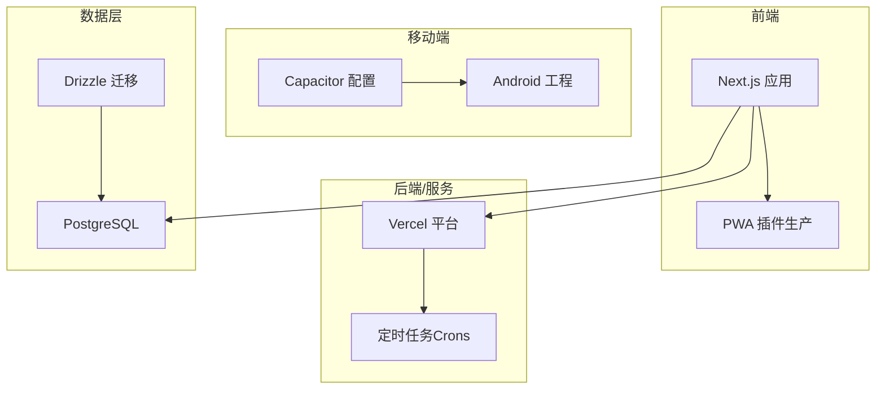
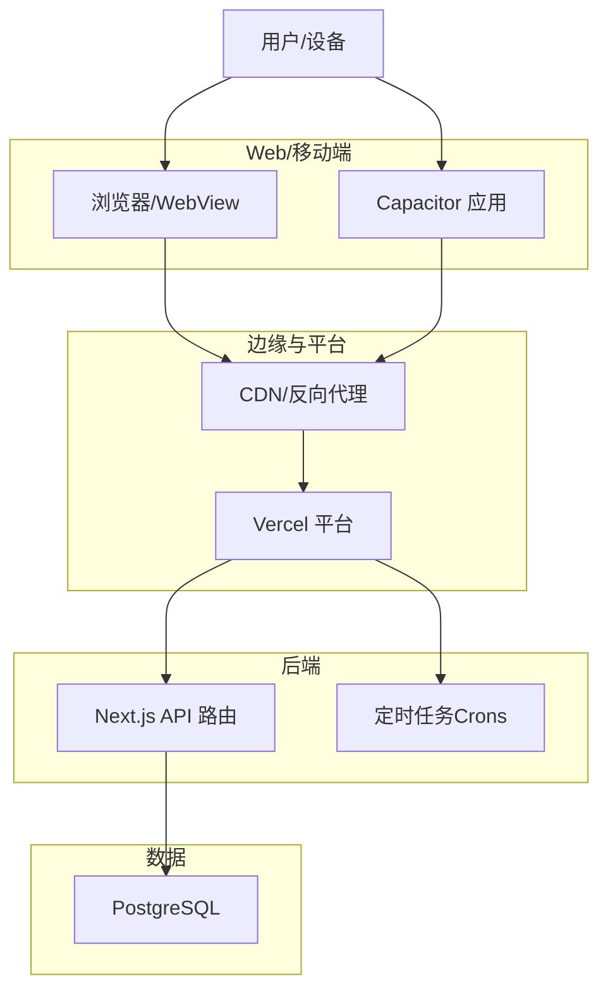
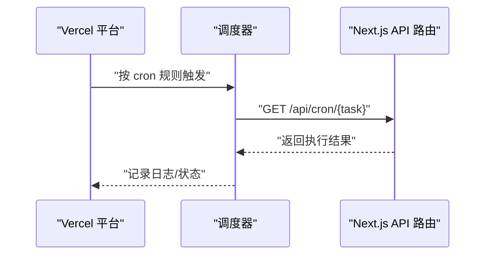
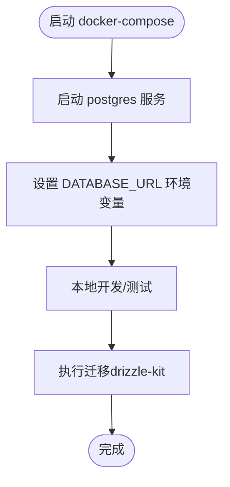
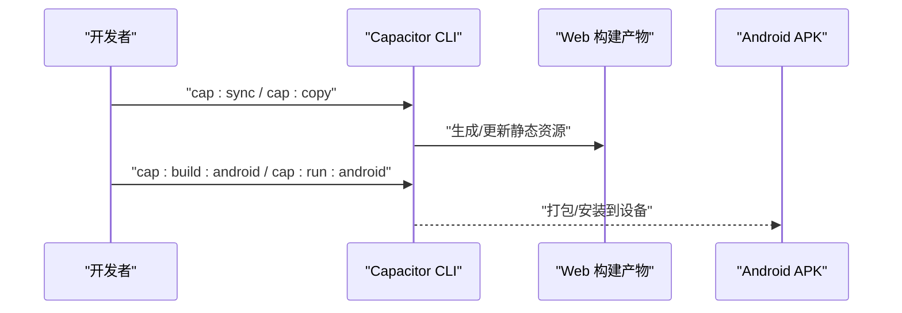
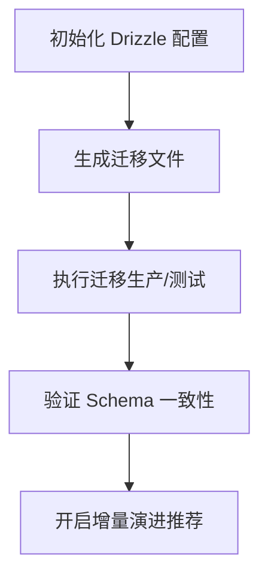
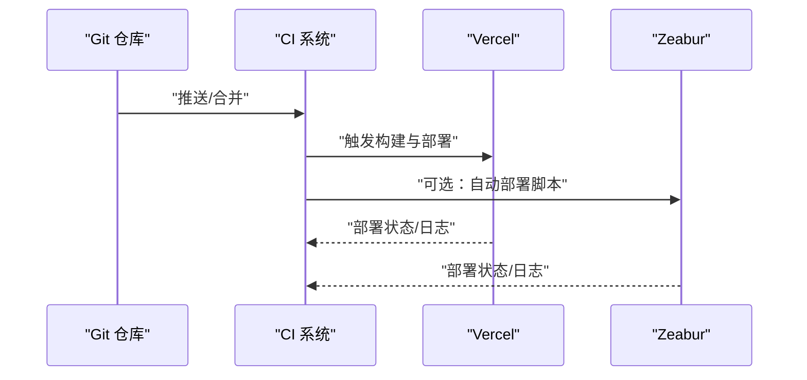
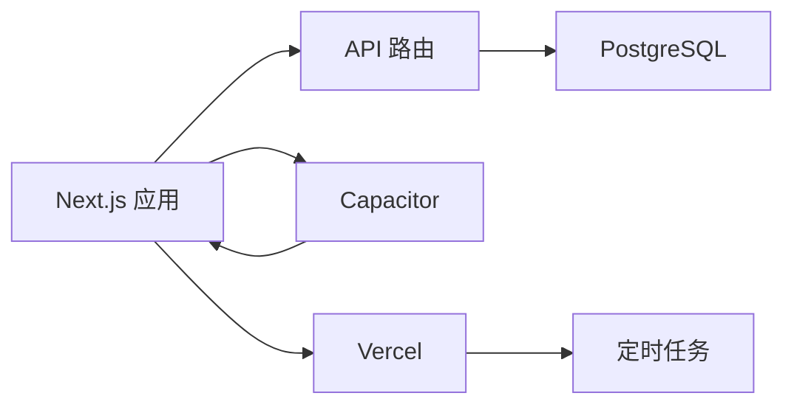

# 部署指南

<cite>
**本文引用的文件**
- [vercel.json](file://vercel.json)
- [docker-compose.yml](file://docker-compose.yml)
- [package.json](file://package.json)
- [drizzle.config.ts](file://drizzle.config.ts)
- [capacitor.config.ts](file://capacitor.config.ts)
- [next.config.js](file://next.config.js)
- [vercel-wrapper.js](file://vercel-wrapper.js)
- [zeabur-deploy.js](file://zeabur-deploy.js)
- [src/lib/db/index.ts](file://src/lib/db/index.ts)
</cite>

## 目录
1. [简介](#简介)
2. [项目结构](#项目结构)
3. [核心组件](#核心组件)
4. [架构总览](#架构总览)
5. [详细组件分析](#详细组件分析)
6. [依赖关系分析](#依赖关系分析)
7. [性能考虑](#性能考虑)
8. [故障排除指南](#故障排除指南)
9. [结论](#结论)
10. [附录](#附录)

## 简介
本指南面向 life-os 项目的多环境部署与运维，覆盖开发、测试与生产环境的部署流程；说明 Vercel、Docker、Capacitor 等工具的使用方式；提供数据库部署与迁移策略；给出 CI/CD 自动化思路；移动端发布流程与应用商店上架要点；域名与 SSL、CDN 配置建议；监控与日志配置及故障恢复策略；以及性能优化与资源管理最佳实践。

## 项目结构
- 前端框架：Next.js（生产环境启用 PWA 插件）
- 移动端：Capacitor（Android 工程位于 android/ 目录）
- 数据库：PostgreSQL（本地开发使用 docker-compose）
- ORM 与迁移：Drizzle ORM + Drizzle Kit
- 云平台：Vercel（含定时任务）、Zeabur（自动部署脚本）

**图表来源**
- [next.config.js:22-31](file://next.config.js#L22-L31)
- [capacitor.config.ts:3-34](file://capacitor.config.ts#L3-L34)
- [vercel.json:1-20](file://vercel.json#L1-L20)
- [docker-compose.yml:1-18](file://docker-compose.yml#L1-L18)
- [drizzle.config.ts:6-13](file://drizzle.config.ts#L6-L13)

**章节来源**
- [package.json:5-18](file://package.json#L5-L18)
- [next.config.js:1-32](file://next.config.js#L1-L32)
- [capacitor.config.ts:1-37](file://capacitor.config.ts#L1-L37)
- [vercel.json:1-20](file://vercel.json#L1-L20)
- [docker-compose.yml:1-18](file://docker-compose.yml#L1-L18)
- [drizzle.config.ts:1-14](file://drizzle.config.ts#L1-L14)

## 核心组件
- Next.js 构建与 PWA
  - 生产环境启用 PWA 插件，构建静态导出产物用于 Vercel 部署。
  - 开发环境禁用 PWA 插件以适配 Turbobench。
- Capacitor 移动端
  - 通过配置指定 WebView 服务器地址、UA 标识、混合内容策略等。
  - 提供同步、复制、构建、运行等脚本命令。
- 数据库与迁移
  - 使用 Drizzle ORM 连接 PostgreSQL，支持生成、迁移、推送与 Studio 调试。
  - Docker Compose 提供本地 Postgres 实例。
- 云平台与定时任务
  - Vercel 配置定时任务，调用 Next.js API 路由执行周期性任务。
  - Zeabur 提供一键部署脚本（交互式自动应答）。

**章节来源**
- [package.json:5-18](file://package.json#L5-L18)
- [next.config.js:22-31](file://next.config.js#L22-L31)
- [capacitor.config.ts:3-34](file://capacitor.config.ts#L3-L34)
- [drizzle.config.ts:6-13](file://drizzle.config.ts#L6-L13)
- [docker-compose.yml:1-18](file://docker-compose.yml#L1-L18)
- [vercel.json:1-20](file://vercel.json#L1-L20)
- [zeabur-deploy.js:1-59](file://zeabur-deploy.js#L1-L59)

## 架构总览
下图展示从浏览器/移动端到后端 API、数据库与云平台的整体部署架构。

**图表来源**
- [vercel.json:1-20](file://vercel.json#L1-L20)
- [capacitor.config.ts:7-15](file://capacitor.config.ts#L7-L15)
- [src/lib/db/index.ts:1-11](file://src/lib/db/index.ts#L1-L11)

## 详细组件分析

### Vercel 部署与定时任务
- 定时任务配置
  - 在 vercel.json 中定义多个 cron 触发器，分别对应不同的业务周期任务。
  - 调度时间采用标准 Cron 表达式，指向对应的 API 路由路径。
- 部署与 CLI 修复
  - 提供 vercel-wrapper.js 以解决特定主机名导致的非 ASCII 字符问题。
  - 推荐使用 vercel CLI 进行本地预览与部署。
- 多语言与国际化
  - 项目包含多语言内容与翻译指令，建议在 Vercel 上配置多区域分发与缓存策略。

**图表来源**
- [vercel.json:2-19](file://vercel.json#L2-L19)

**章节来源**
- [vercel.json:1-20](file://vercel.json#L1-L20)
- [vercel-wrapper.js:1-8](file://vercel-wrapper.js#L1-L8)

### Docker 与数据库本地化
- 本地数据库
  - docker-compose.yml 提供 PostgreSQL 服务，映射端口与持久化卷。
  - 默认凭据与数据库名称可在服务定义中查看。
- 开发与测试
  - 本地启动容器后，使用 DATABASE_URL 连接数据库。
  - 可结合 Drizzle Kit 进行迁移与调试。

**图表来源**
- [docker-compose.yml:3-17](file://docker-compose.yml#L3-L17)
- [drizzle.config.ts:6-13](file://drizzle.config.ts#L6-L13)

**章节来源**
- [docker-compose.yml:1-18](file://docker-compose.yml#L1-L18)
- [drizzle.config.ts:1-14](file://drizzle.config.ts#L1-L14)

### Capacitor 移动端集成
- 服务器模式
  - Capacitor 通过 server.url 指定 WebView 加载的远程站点，生产环境默认 HTTPS。
  - 支持自定义 UA 标识，便于服务端区分移动端请求。
- 构建与运行
  - 提供同步、复制、构建与运行 Android 的脚本命令。
- 安全与外观
  - 混合内容策略、背景色、启动页插件等在配置中统一管理。

**图表来源**
- [package.json:14-18](file://package.json#L14-L18)
- [capacitor.config.ts:3-34](file://capacitor.config.ts#L3-L34)

**章节来源**
- [package.json:5-18](file://package.json#L5-L18)
- [capacitor.config.ts:1-37](file://capacitor.config.ts#L1-L37)

### 数据库部署与迁移策略
- 连接与驱动
  - 开发环境使用 postgres.js 驱动；生产环境可切换为 @neondatabase/serverless（注释提示）。
- 迁移工具链
  - 使用 Drizzle Kit 生成、迁移、推送与本地调试。
  - 迁移输出目录与模式定义在 drizzle.config.ts 中。
- 环境变量
  - DATABASE_URL 必须在运行环境中正确配置，确保连接字符串有效。

**图表来源**
- [drizzle.config.ts:6-13](file://drizzle.config.ts#L6-L13)
- [src/lib/db/index.ts:1-11](file://src/lib/db/index.ts#L1-L11)

**章节来源**
- [src/lib/db/index.ts:1-11](file://src/lib/db/index.ts#L1-L11)
- [drizzle.config.ts:1-14](file://drizzle.config.ts#L1-L14)

### CI/CD 流水线与自动化部署
- Vercel 部署
  - 建议在 Vercel 控制台关联仓库，启用构建与预览分支保护。
  - 使用 vercel.json 管理定时任务与路由规则。
- Zeabur 部署
  - 提供自动应答脚本，适合快速一键部署与演示环境。
- 本地自动化
  - 使用 package.json 中的脚本进行本地构建、迁移与 Capacitor 流程编排。

**图表来源**
- [vercel.json:1-20](file://vercel.json#L1-L20)
- [zeabur-deploy.js:1-59](file://zeabur-deploy.js#L1-L59)
- [package.json:5-18](file://package.json#L5-L18)

**章节来源**
- [vercel.json:1-20](file://vercel.json#L1-L20)
- [zeabur-deploy.js:1-59](file://zeabur-deploy.js#L1-L59)
- [package.json:5-18](file://package.json#L5-L18)

### 移动端发布与应用商店上架
- 发布前准备
  - 使用 Capacitor 提供的构建脚本生成原生工程，完成签名与混淆配置。
  - 准备应用图标、启动图、隐私政策页面与必要权限声明。
- 应用商店要求
  - 遵循各商店的版本规范、截图与元数据要求；确保网络策略允许必要的域名访问。
- 分发渠道
  - 可选择自有分发或应用商店；如需内网分发，可配置企业证书与分发平台。

**章节来源**
- [capacitor.config.ts:3-34](file://capacitor.config.ts#L3-L34)
- [package.json:14-18](file://package.json#L14-L18)

### 域名、SSL 证书与 CDN 设置
- 域名与证书
  - Vercel 提供自有域名与自动 SSL；如需自定义域名，应在平台绑定并配置 DNS 记录。
- CDN 与缓存
  - 利用 CDN 缓存静态资源与 API 响应；对敏感接口避免缓存。
- 反向代理
  - 如需自建反向代理，确保转发头与 HTTPS 终止配置正确。

**章节来源**
- [vercel.json:1-20](file://vercel.json#L1-L20)
- [capacitor.config.ts:10-12](file://capacitor.config.ts#L10-L12)

## 依赖关系分析
- 组件耦合
  - 前端 Next.js 通过 API 路由与数据库交互；定时任务由 Vercel 调度。
  - Capacitor 依赖 WebView 服务器地址与 UA 标识；生产环境强制 HTTPS。
- 外部依赖
  - Drizzle ORM 依赖 PostgreSQL；Vercel 平台提供托管与定时任务。
  - Zeabur 提供一键部署能力，适合快速演示与预生产验证。

**图表来源**
- [src/lib/db/index.ts:1-11](file://src/lib/db/index.ts#L1-L11)
- [capacitor.config.ts:7-15](file://capacitor.config.ts#L7-L15)
- [vercel.json:2-19](file://vercel.json#L2-L19)

**章节来源**
- [src/lib/db/index.ts:1-11](file://src/lib/db/index.ts#L1-L11)
- [capacitor.config.ts:1-37](file://capacitor.config.ts#L1-L37)
- [vercel.json:1-20](file://vercel.json#L1-L20)

## 性能考虑
- 构建与缓存
  - 生产环境启用 PWA 插件，提升离线与缓存体验；合理配置静态资源缓存策略。
- 数据库性能
  - 使用连接池与只读副本（如适用）；定期分析慢查询与索引优化。
- 移动端性能
  - 控制 WebView 首屏加载时间；压缩与懒加载图片与资源。
- CDN 与网络
  - 启用 Gzip/Brotli 压缩；合理设置缓存头；使用就近节点降低延迟。

**章节来源**
- [next.config.js:22-31](file://next.config.js#L22-L31)
- [capacitor.config.ts:20-23](file://capacitor.config.ts#L20-L23)

## 故障排除指南
- Vercel 部署异常
  - 使用 vercel-wrapper.js 修复非 ASCII 主机名问题；检查 vercel.json 的 cron 配置是否正确。
- 数据库连接失败
  - 确认 DATABASE_URL 是否正确；本地使用 docker-compose 启动后验证连通性。
- Capacitor WebView 无法加载
  - 检查 server.url 与 androidScheme；确保生产环境使用 HTTPS。
- 定时任务未执行
  - 核对 vercel.json 的 cron 路径与调度表达式；确认 API 路由可达且无异常。

**章节来源**
- [vercel-wrapper.js:1-8](file://vercel-wrapper.js#L1-L8)
- [vercel.json:1-20](file://vercel.json#L1-L20)
- [src/lib/db/index.ts:1-11](file://src/lib/db/index.ts#L1-L11)
- [capacitor.config.ts:7-15](file://capacitor.config.ts#L7-L15)

## 结论
本指南提供了 life-os 项目在多环境下的部署与运维实践，涵盖前端、移动端、数据库与云平台的关键配置与流程。建议在生产环境严格管理密钥与域名，完善监控与日志体系，并持续优化性能与用户体验。

## 附录
- 关键命令速查
  - 构建与启动：见 package.json scripts
  - 数据库迁移：见 drizzle.config.ts 与 scripts
  - Capacitor 流程：见 package.json scripts 与 capacitor.config.ts
- 环境变量清单（示例）
  - DATABASE_URL：数据库连接字符串
  - CAPACITOR_SERVER_URL：Capacitor 服务器地址
  - NODE_ENV：运行环境标识
  - 其他 AI/鉴权相关密钥：按实际需求配置

**章节来源**
- [package.json:5-18](file://package.json#L5-L18)
- [drizzle.config.ts:6-13](file://drizzle.config.ts#L6-L13)
- [capacitor.config.ts:3-34](file://capacitor.config.ts#L3-L34)
- [src/lib/db/index.ts:1-11](file://src/lib/db/index.ts#L1-L11)