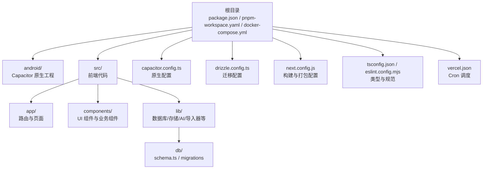
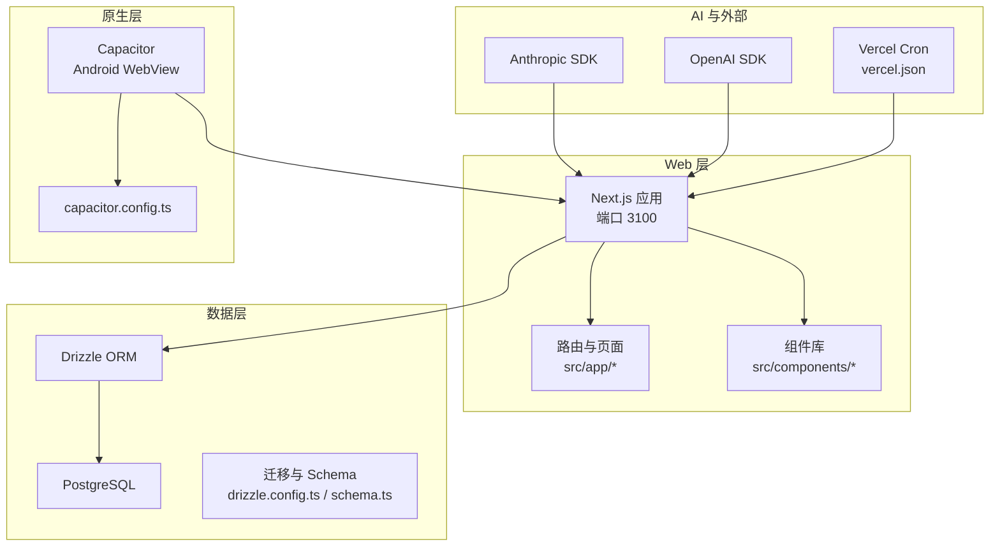
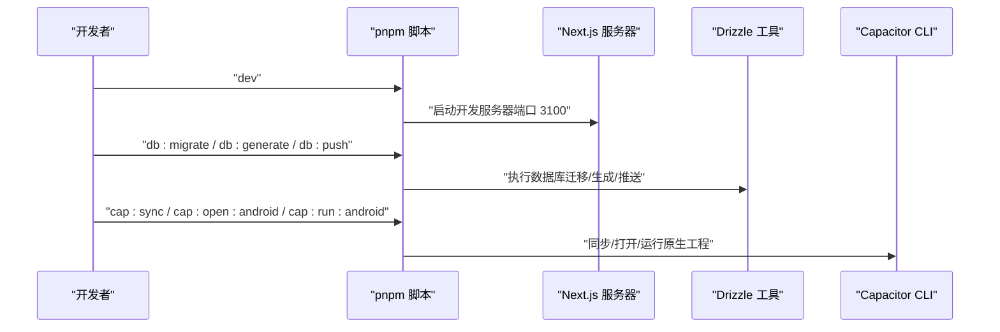
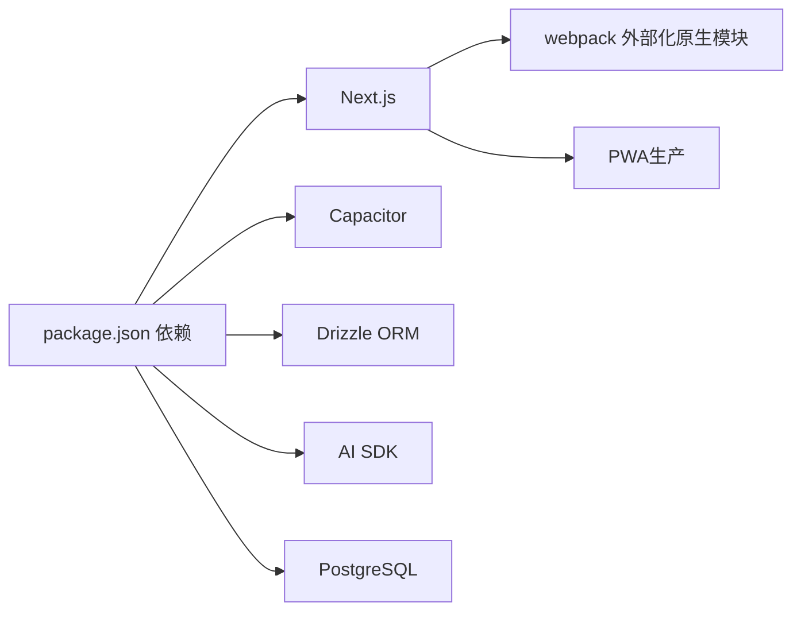

# 快速开始

<cite>
**本文引用的文件**
- [package.json](file://package.json)
- [pnpm-workspace.yaml](file://pnpm-workspace.yaml)
- [capacitor.config.ts](file://capacitor.config.ts)
- [drizzle.config.ts](file://drizzle.config.ts)
- [docker-compose.yml](file://docker-compose.yml)
- [next.config.js](file://next.config.js)
- [tsconfig.json](file://tsconfig.json)
- [eslint.config.mjs](file://eslint.config.mjs)
- [src/lib/db/schema.ts](file://src/lib/db/schema.ts)
- [vercel.json](file://vercel.json)
</cite>

## 目录
1. [简介](#简介)
2. [项目结构](#项目结构)
3. [核心组件](#核心组件)
4. [架构总览](#架构总览)
5. [详细组件分析](#详细组件分析)
6. [依赖分析](#依赖分析)
7. [性能考虑](#性能考虑)
8. [故障排查指南](#故障排查指南)
9. [结论](#结论)
10. [附录](#附录)

## 简介
本指南面向首次接触 life-os（MindOS）项目的开发者，帮助你在约 30 分钟内完成从环境准备到首次运行的全流程。内容覆盖：
- 环境要求与工具链
- 安装与配置步骤（Node.js、pnpm、Android Studio、数据库）
- AI 服务与外部平台配置要点
- 常用开发命令详解（启动、数据库迁移、Capacitor 同步）
- 首次运行验证与常见问题解决

## 项目结构
该项目采用 Next.js 15 应用，结合 Drizzle ORM 进行数据库建模与迁移，并通过 Capacitor 构建跨平台原生应用。核心目录与职责概览如下：
- 根目录：工程脚本、工作区配置、容器编排、部署配置
- android：Capacitor 原生工程（Android）
- src：前端业务代码，按功能域划分（app、components、hooks、lib、types 等）
- src/lib/db：数据库 schema 定义与迁移配置
- src/app：Next.js 路由与页面

图表来源
- [package.json:1-91](file://package.json#L1-L91)
- [pnpm-workspace.yaml:1-7](file://pnpm-workspace.yaml#L1-L7)
- [capacitor.config.ts:1-37](file://capacitor.config.ts#L1-L37)
- [drizzle.config.ts:1-14](file://drizzle.config.ts#L1-L14)
- [docker-compose.yml:1-18](file://docker-compose.yml#L1-L18)
- [next.config.js:1-32](file://next.config.js#L1-L32)
- [tsconfig.json:1-28](file://tsconfig.json#L1-L28)
- [eslint.config.mjs:1-15](file://eslint.config.mjs#L1-L15)
- [vercel.json:1-21](file://vercel.json#L1-L21)

章节来源
- [package.json:1-91](file://package.json#L1-L91)
- [pnpm-workspace.yaml:1-7](file://pnpm-workspace.yaml#L1-L7)
- [capacitor.config.ts:1-37](file://capacitor.config.ts#L1-L37)
- [drizzle.config.ts:1-14](file://drizzle.config.ts#L1-L14)
- [docker-compose.yml:1-18](file://docker-compose.yml#L1-L18)
- [next.config.js:1-32](file://next.config.js#L1-L32)
- [tsconfig.json:1-28](file://tsconfig.json#L1-L28)
- [eslint.config.mjs:1-15](file://eslint.config.mjs#L1-L15)
- [vercel.json:1-21](file://vercel.json#L1-L21)

## 核心组件
- 开发服务器：Next.js 15，端口 3100，启用 Turbopack
- 数据库：PostgreSQL（本地 Docker 或自建服务）
- ORM 工具：Drizzle Kit 与 Drizzle ORM
- 原生集成：Capacitor（Android），支持 WebView 与本地资源
- AI 服务：Anthropic Claude SDK、OpenAI SDK（用于预算与调用）
- 构建与打包：Next.js + PWA（生产环境）

章节来源
- [package.json:5-18](file://package.json#L5-L18)
- [next.config.js:21-31](file://next.config.js#L21-L31)
- [capacitor.config.ts:7-15](file://capacitor.config.ts#L7-L15)
- [drizzle.config.ts:6-13](file://drizzle.config.ts#L6-L13)

## 架构总览
系统以 Web 应用为核心，通过 Capacitor 注入原生能力；数据层基于 PostgreSQL，使用 Drizzle ORM 进行 schema 管理与迁移；AI 服务通过 SDK 接入。

图表来源
- [capacitor.config.ts:3-34](file://capacitor.config.ts#L3-L34)
- [drizzle.config.ts:6-13](file://drizzle.config.ts#L6-L13)
- [src/lib/db/schema.ts:1-118](file://src/lib/db/schema.ts#L1-L118)
- [vercel.json:1-21](file://vercel.json#L1-L21)
- [package.json:20-62](file://package.json#L20-L62)

## 详细组件分析

### 环境与工具链要求
- Node.js：建议使用 LTS 版本，确保与 Next.js 15 兼容
- 包管理器：pnpm（仓库已启用 pnpm-workspace.yaml）
- Android Studio：用于构建与调试 Android 原生应用
- 数据库：PostgreSQL（本地推荐使用 docker-compose 启动）
- 可选：IDE（如 VSCode），并安装 TypeScript、ESLint、TailwindCSS 相关插件

章节来源
- [package.json:20-62](file://package.json#L20-L62)
- [pnpm-workspace.yaml:1-7](file://pnpm-workspace.yaml#L1-L7)
- [docker-compose.yml:4-14](file://docker-compose.yml#L4-L14)

### 安装与配置步骤

#### 步骤 1：克隆与安装依赖
- 使用 pnpm 安装所有依赖（含工作区构建开关）
- 若遇到原生模块构建失败，请确认 pnpm-workspace.yaml 中相关允许项已开启

章节来源
- [pnpm-workspace.yaml:1-7](file://pnpm-workspace.yaml#L1-L7)
- [package.json:83-89](file://package.json#L83-L89)

#### 步骤 2：数据库初始化
- 方案 A：使用 docker-compose 启动本地 PostgreSQL
  - 启动命令：docker-compose up -d
  - 默认账号密码与数据库名见 docker-compose.yml
- 方案 B：使用自建 PostgreSQL
  - 在 .env.local 中设置 DATABASE_URL
  - 使用 Drizzle Kit 生成与执行迁移

章节来源
- [docker-compose.yml:4-14](file://docker-compose.yml#L4-L14)
- [drizzle.config.ts:6-13](file://drizzle.config.ts#L6-L13)

#### 步骤 3：Capacitor 同步与原生工程
- 在 Next.js 构建后，执行 Capacitor 同步
- 打开 Android Studio 并运行模拟器或真机调试

章节来源
- [package.json:14-18](file://package.json#L14-L18)
- [capacitor.config.ts:3-34](file://capacitor.config.ts#L3-L34)

#### 步骤 4：AI 服务配置
- 在 .env.local 中配置 AI 提供商密钥与预算参数
- 项目默认偏好提供商与预算限制在 schema 中有字段定义，可在设置中调整

章节来源
- [src/lib/db/schema.ts:4-15](file://src/lib/db/schema.ts#L4-L15)
- [package.json:21-22](file://package.json#L21-L22)
- [package.json:55](file://package.json#L55)

### 常用开发命令详解

图表来源
- [package.json:5-18](file://package.json#L5-L18)
- [drizzle.config.ts:6-13](file://drizzle.config.ts#L6-L13)
- [capacitor.config.ts:7-15](file://capacitor.config.ts#L7-L15)

章节来源
- [package.json:5-18](file://package.json#L5-L18)

### 首次运行验证步骤
- 启动开发服务器并访问 http://localhost:3100
- 打开 Android Studio 并运行 Capacitor 应用，确认 WebView 加载成功
- 执行数据库迁移，检查 schema 是否正确写入
- 在设置中验证 AI 预算与提供商配置是否生效

章节来源
- [package.json:6](file://package.json#L6)
- [capacitor.config.ts:7-15](file://capacitor.config.ts#L7-L15)
- [drizzle.config.ts:6-13](file://drizzle.config.ts#L6-L13)
- [src/lib/db/schema.ts:4-15](file://src/lib/db/schema.ts#L4-L15)

## 依赖分析
- 外部依赖：Next.js、Capacitor、Drizzle ORM、PostgreSQL、AI SDK（Anthropic、OpenAI）、PWA 插件
- 构建与打包：webpack 外部化原生模块，生产环境启用 PWA
- 类型与规范：TypeScript、ESLint、TailwindCSS

图表来源
- [package.json:20-62](file://package.json#L20-L62)
- [next.config.js:9-18](file://next.config.js#L9-L18)
- [next.config.js:22-31](file://next.config.js#L22-L31)

章节来源
- [package.json:20-62](file://package.json#L20-L62)
- [next.config.js:9-18](file://next.config.js#L9-L18)
- [next.config.js:22-31](file://next.config.js#L22-L31)

## 性能考虑
- 使用 Turbopack 加速开发服务器启动与热更新
- 生产环境启用 PWA，提升离线与缓存体验
- 对原生模块进行 webpack 外部化，避免打包体积膨胀
- 数据库连接与迁移尽量在 CI/CD 中预处理，减少本地开发时间

## 故障排查指南
- 数据库连接失败
  - 检查 .env.local 中 DATABASE_URL 是否正确
  - 使用 docker-compose 启动本地数据库并确认端口未被占用
- Capacitor 同步失败
  - 确保先执行 Next.js 构建，再执行 npx cap sync
  - 检查 capacitor.config.ts 中 server.url 与本机 IP 是否一致
- 原生模块构建失败
  - 在 pnpm-workspace.yaml 中确认允许相关原生模块构建
- AI 调用异常
  - 检查 .env.local 中 AI 提供商密钥与预算限额
  - 查看设置页中的 AI 预算与提供商配置

章节来源
- [drizzle.config.ts:6-13](file://drizzle.config.ts#L6-L13)
- [docker-compose.yml:4-14](file://docker-compose.yml#L4-L14)
- [capacitor.config.ts:7-15](file://capacitor.config.ts#L7-L15)
- [pnpm-workspace.yaml:1-7](file://pnpm-workspace.yaml#L1-L7)
- [src/lib/db/schema.ts:4-15](file://src/lib/db/schema.ts#L4-L15)

## 结论
按照本指南，你可以在 30 分钟内完成环境准备、数据库初始化、Capacitor 同步与首次运行验证。建议在开发过程中充分利用数据库迁移、PWA 与 AI 配置能力，逐步完善本地与云端的集成。

## 附录

### 数据库 Schema 概览（关键表）
- 用户配置表：包含 AI 预算、主题偏好、外部平台路径等
- 错题本：题目文本、答案、难度、下次复习时间等
- 知识库：条目类型、标题、来源、AI 摘要、标签等
- 日记库：日记内容、情绪标签、关键词云等
- 待办事项：标题、日期、完成状态
- 同步日志：平台、同步时间、新增数量、状态
- 报告：报告类型、周期范围、内容

章节来源
- [src/lib/db/schema.ts:4-15](file://src/lib/db/schema.ts#L4-L15)
- [src/lib/db/schema.ts:18-34](file://src/lib/db/schema.ts#L18-L34)
- [src/lib/db/schema.ts:42-55](file://src/lib/db/schema.ts#L42-L55)
- [src/lib/db/schema.ts:67-86](file://src/lib/db/schema.ts#L67-L86)
- [src/lib/db/schema.ts:89-96](file://src/lib/db/schema.ts#L89-L96)
- [src/lib/db/schema.ts:99-106](file://src/lib/db/schema.ts#L99-L106)
- [src/lib/db/schema.ts:109-117](file://src/lib/db/schema.ts#L109-L117)