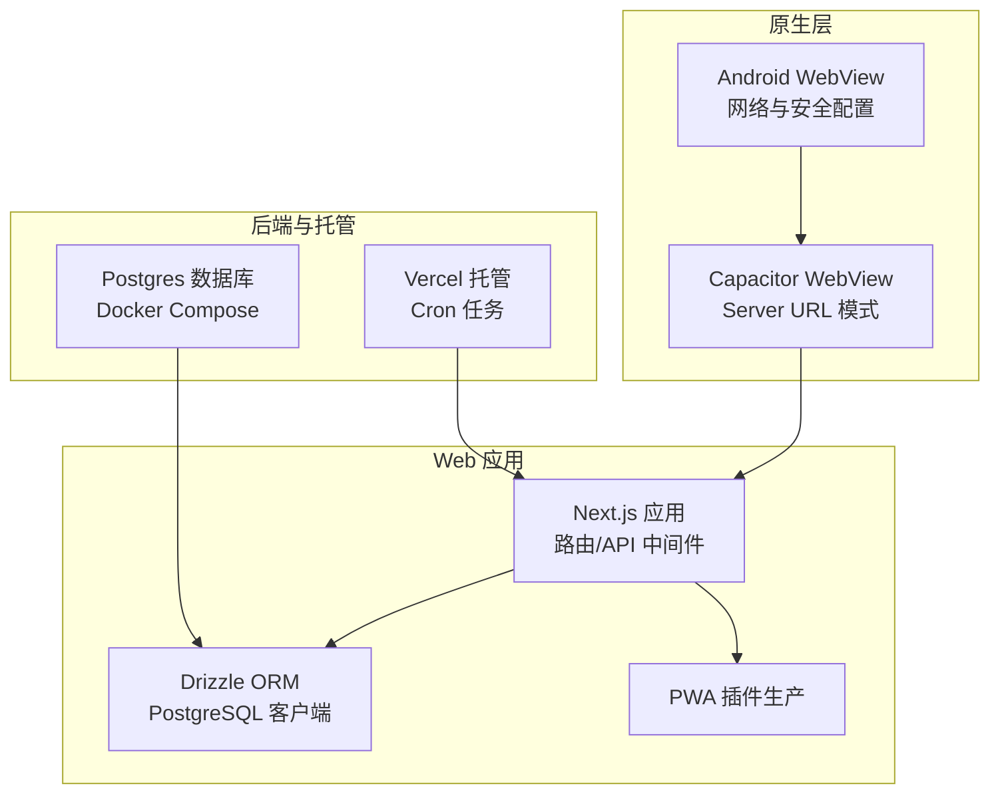
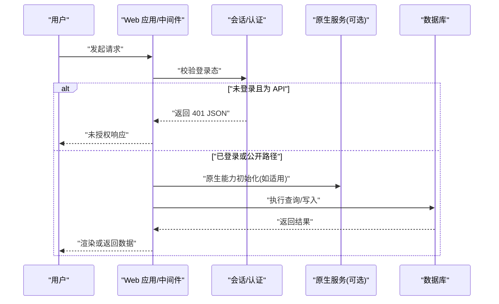
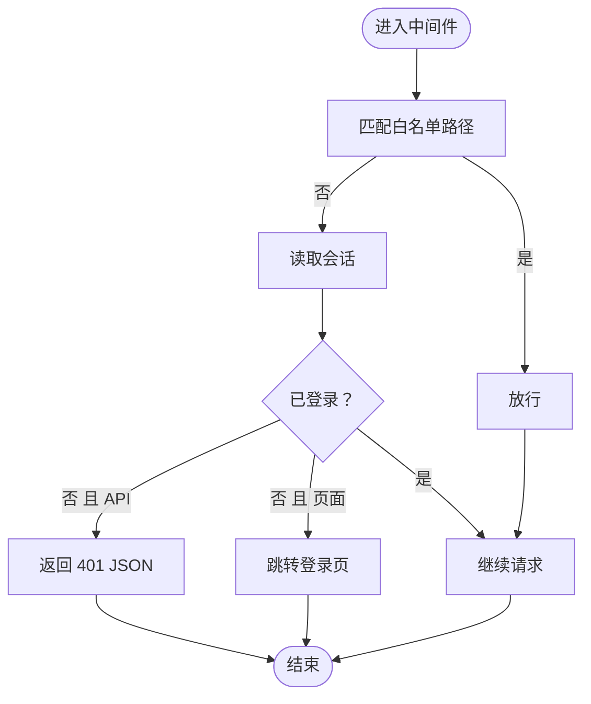
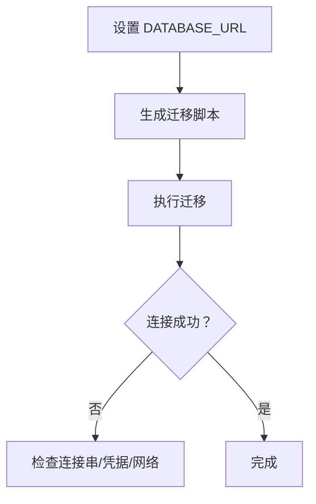
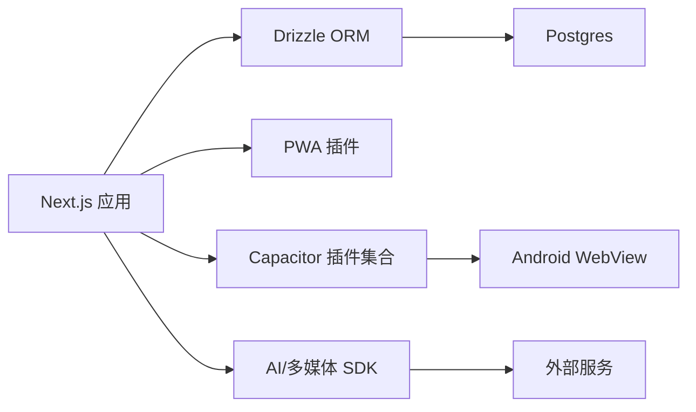

# 故障排除

<cite>
**本文引用的文件**
- [package.json](file://package.json)
- [next.config.js](file://next.config.js)
- [docker-compose.yml](file://docker-compose.yml)
- [vercel.json](file://vercel.json)
- [capacitor.config.ts](file://capacitor.config.ts)
- [src/components/errors/error-boundary.tsx](file://src/components/errors/error-boundary.tsx)
- [src/middleware.ts](file://src/middleware.ts)
- [drizzle.config.ts](file://drizzle.config.ts)
- [src/lib/db/index.ts](file://src/lib/db/index.ts)
- [src/lib/auth/session.ts](file://src/lib/auth/session.ts)
- [src/lib/native/index.ts](file://src/lib/native/index.ts)
- [android/app/src/main/AndroidManifest.xml](file://android/app/src/main/AndroidManifest.xml)
- [android/app/src/main/res/xml/network_security_config.xml](file://android/app/src/main/res/xml/network_security_config.xml)
- [android/app/src/main/java/com/mindos/app/MainActivity.java](file://android/app/src/main/java/com/mindos/app/MainActivity.java)
</cite>

## 目录
1. [简介](#简介)
2. [项目结构](#项目结构)
3. [核心组件](#核心组件)
4. [架构总览](#架构总览)
5. [详细组件分析](#详细组件分析)
6. [依赖分析](#依赖分析)
7. [性能考虑](#性能考虑)
8. [故障排除指南](#故障排除指南)
9. [结论](#结论)
10. [附录](#附录)

## 简介
本指南面向技术支持与高级用户，聚焦 life-os 在开发、测试与生产环境中的常见问题与系统化排障流程。内容覆盖安装与构建、运行时错误、性能瓶颈、兼容性问题、日志与监控、以及跨平台（Web 与 Capacitor 原生）部署差异。文档同时提供调试步骤、工具使用建议、错误日志分析技巧与问题定位策略，并给出针对不同环境的差异化处理方案。

## 项目结构
life-os 采用 Next.js 15 作为前端框架，结合 Drizzle ORM 访问 PostgreSQL 数据库；Capacitor 用于将 Web 应用打包为 Android/iOS 原生应用；Vercel 用于托管与定时任务；Docker Compose 提供本地 Postgres 数据库服务。

图表来源
- [next.config.js:1-32](file://next.config.js#L1-L32)
- [capacitor.config.ts:1-37](file://capacitor.config.ts#L1-L37)
- [docker-compose.yml:1-18](file://docker-compose.yml#L1-L18)
- [vercel.json:1-21](file://vercel.json#L1-L21)

章节来源
- [package.json:1-91](file://package.json#L1-L91)
- [next.config.js:1-32](file://next.config.js#L1-L32)
- [capacitor.config.ts:1-37](file://capacitor.config.ts#L1-L37)
- [docker-compose.yml:1-18](file://docker-compose.yml#L1-L18)
- [vercel.json:1-21](file://vercel.json#L1-L21)

## 核心组件
- 中间件与会话控制：负责登录态校验、API 与页面路由的区分处理，移动端 UA 适配。
- 错误边界：捕获客户端渲染错误，提供基础降级提示与重试机制。
- 数据库访问：通过 Drizzle ORM 使用 postgres.js 驱动连接数据库，支持迁移与本地开发。
- 原生服务初始化：在原生平台自动初始化生命周期、通知、网络等能力。
- 构建与 PWA：生产环境启用 PWA 注册与预缓存，开发环境禁用以兼容 Turbopack。
- 容器与托管：Docker Compose 提供本地数据库，Vercel 提供 Cron 任务与静态资源。

章节来源
- [src/middleware.ts:1-52](file://src/middleware.ts#L1-L52)
- [src/components/errors/error-boundary.tsx:1-58](file://src/components/errors/error-boundary.tsx#L1-L58)
- [src/lib/db/index.ts:1-11](file://src/lib/db/index.ts#L1-L11)
- [src/lib/native/index.ts:1-55](file://src/lib/native/index.ts#L1-L55)
- [next.config.js:19-32](file://next.config.js#L19-L32)

## 架构总览
从用户交互到数据持久化的整体链路如下：

图表来源
- [src/middleware.ts:6-47](file://src/middleware.ts#L6-L47)
- [src/lib/auth/session.ts:1-43](file://src/lib/auth/session.ts#L1-L43)
- [src/lib/db/index.ts:1-11](file://src/lib/db/index.ts#L1-L11)
- [src/lib/native/index.ts:19-54](file://src/lib/native/index.ts#L19-L54)

## 详细组件分析

### 中间件与会话控制
- 功能要点
  - 白名单路径放行（登录页、公开 API、静态资源等）
  - 对非公开 API 路由进行 401 JSON 返回，避免重定向导致 fetch 收到 HTML
  - 移动端 UA 识别与会话 Cookie 有效期调整
- 常见问题
  - OAuth 回调路径必须公开，否则弹窗回调失败
  - 会话密钥缺失或不一致导致频繁登出
  - 移动端 Cookie 安全标志与 SameSite 设置影响登录态保持

图表来源
- [src/middleware.ts:6-47](file://src/middleware.ts#L6-L47)
- [src/lib/auth/session.ts:31-42](file://src/lib/auth/session.ts#L31-L42)

章节来源
- [src/middleware.ts:1-52](file://src/middleware.ts#L1-L52)
- [src/lib/auth/session.ts:1-43](file://src/lib/auth/session.ts#L1-L43)

### 错误边界
- 功能要点
  - 捕获子树渲染错误，显示降级提示与刷新/重试按钮
  - 适合 UI 层级的不可恢复错误兜底
- 常见问题
  - 仅对客户端渲染错误有效，服务端错误需配合全局错误页面
  - 降级文案需国际化与可配置

章节来源
- [src/components/errors/error-boundary.tsx:1-58](file://src/components/errors/error-boundary.tsx#L1-L58)

### 数据库与迁移
- 连接与驱动
  - 开发使用 postgres.js 驱动，生产可切换为 @neondatabase/serverless
  - 通过 DATABASE_URL 环境变量配置连接串
- 迁移与管理
  - 使用 drizzle-kit 管理迁移生成、执行与本地可视化
- 常见问题
  - DATABASE_URL 缺失或格式错误导致连接失败
  - 未执行迁移导致表结构不一致
  - 服务器端外部模块打包问题（参见 webpack 外部化）

图表来源
- [drizzle.config.ts:1-14](file://drizzle.config.ts#L1-L14)
- [src/lib/db/index.ts:1-11](file://src/lib/db/index.ts#L1-L11)

章节来源
- [drizzle.config.ts:1-14](file://drizzle.config.ts#L1-L14)
- [src/lib/db/index.ts:1-11](file://src/lib/db/index.ts#L1-L11)
- [next.config.js:9-18](file://next.config.js#L9-L18)

### 原生服务初始化
- 功能要点
  - 在原生平台自动初始化生命周期、通知、网络等能力
  - 对未安装插件进行容错处理
- 常见问题
  - 原生平台判断错误导致初始化缺失
  - 插件未正确安装或版本不匹配
  - WebView 网络策略限制导致外部资源无法访问

章节来源
- [src/lib/native/index.ts:1-55](file://src/lib/native/index.ts#L1-L55)

### 构建与 PWA
- 生产环境启用 PWA 注册与预缓存，开发环境禁用以兼容 Turbopack
- webpack 外部化原生 Node 模块，避免打包失败
- 常见问题
  - Turbopack 与 PWA 插件不兼容导致开发阶段 PWA 异常
  - 外部化模块遗漏导致运行时报错

章节来源
- [next.config.js:19-32](file://next.config.js#L19-L32)
- [next.config.js:9-18](file://next.config.js#L9-L18)
- [package.json:5-18](file://package.json#L5-L18)

### 容器与托管
- Docker Compose 提供本地 Postgres 服务，默认端口映射与卷挂载
- Vercel 提供 Cron 任务调度，按计划触发 API 路由
- 常见问题
  - 端口冲突或权限不足导致容器启动失败
  - Cron 触发路径与实际 API 路由不一致导致任务失败

章节来源
- [docker-compose.yml:1-18](file://docker-compose.yml#L1-L18)
- [vercel.json:1-21](file://vercel.json#L1-L21)

## 依赖分析
- 外部依赖与集成
  - AI 与多媒体：Anthropic SDK、OpenAI SDK、Puppeteer、ONNX Runtime Node、Paddle OCR
  - 原生能力：Capacitor 各插件（App、Browser、Haptics、Keyboard、Local Notifications、Network、Share、Splash Screen、Status Bar）
  - 数据库：Drizzle ORM、postgres.js、@neondatabase/serverless（可选）
  - UI 与工具：Framer Motion、Recharts、Tailwind CSS、bcryptjs、Iron Session
- 常见问题
  - 原生模块与 Web 环境差异导致打包或运行时错误
  - 第三方 SDK 密钥缺失或配额限制导致功能不可用

图表来源
- [package.json:20-62](file://package.json#L20-L62)
- [src/lib/db/index.ts:1-11](file://src/lib/db/index.ts#L1-L11)
- [capacitor.config.ts:3-34](file://capacitor.config.ts#L3-L34)

章节来源
- [package.json:1-91](file://package.json#L1-L91)

## 性能考虑
- 构建与打包
  - 生产环境启用 PWA 与预缓存，减少重复加载
  - webpack 外部化原生模块，避免不必要的打包体积
- 数据访问
  - 合理使用索引与查询条件，避免全表扫描
  - 在高并发场景考虑连接池与超时设置
- 原生应用
  - 控制 WebView 预加载与缓存策略，避免内存占用过高
  - 限制后台任务频率，降低电量消耗

[本节为通用性能建议，无需特定文件来源]

## 故障排除指南

### 一、安装与环境准备
- 症状：安装依赖失败或 Node 版本不兼容
  - 排查要点
    - 使用 pnpm 并确保 Node 版本满足要求
    - 清理缓存后重装依赖
  - 解决方案
    - 使用 pnpm 安装，避免 npm/yarn 的解析差异
- 症状：数据库连接失败
  - 排查要点
    - 检查 DATABASE_URL 是否正确
    - 确认本地 Postgres 已启动并可访问
  - 解决方案
    - 使用 Docker Compose 启动数据库服务
    - 执行迁移命令确保表结构一致
- 症状：Capacitor 同步或构建失败
  - 排查要点
    - 检查 Capacitor CLI 与原生 SDK 版本
    - 确认 Android Studio 与 SDK 工具可用
  - 解决方案
    - 执行同步命令并重新构建

章节来源
- [package.json:5-18](file://package.json#L5-L18)
- [docker-compose.yml:1-18](file://docker-compose.yml#L1-L18)
- [drizzle.config.ts:1-14](file://drizzle.config.ts#L1-L14)
- [capacitor.config.ts:1-37](file://capacitor.config.ts#L1-L37)

### 二、运行时错误
- 症状：页面空白或白屏
  - 排查要点
    - 检查中间件是否正确放行公开路径
    - 确认会话密钥与 Cookie 配置
  - 解决方案
    - 修复会话配置，确保密钥存在且一致
    - 将 OAuth 回调路径加入白名单
- 症状：API 返回 401
  - 排查要点
    - 确认请求是否为 API 路由
    - 检查登录态与 Cookie 传输
  - 解决方案
    - 登录后重试或清除无效 Cookie
- 症状：原生应用无法加载远程页面
  - 排查要点
    - 检查 Capacitor Server URL 配置
    - 确认网络策略与证书配置
  - 解决方案
    - 更新 Server URL 至可访问地址
    - 配置网络安全策略允许混合内容（开发阶段）

章节来源
- [src/middleware.ts:6-47](file://src/middleware.ts#L6-L47)
- [src/lib/auth/session.ts:7-15](file://src/lib/auth/session.ts#L7-L15)
- [capacitor.config.ts:7-15](file://capacitor.config.ts#L7-L15)
- [android/app/src/main/res/xml/network_security_config.xml](file://android/app/src/main/res/xml/network_security_config.xml)

### 三、性能问题
- 症状：页面加载缓慢
  - 排查要点
    - 检查 PWA 缓存命中率与资源大小
    - 分析网络请求与数据库查询
  - 解决方案
    - 启用并优化 PWA 预缓存策略
    - 优化查询与分页，增加必要索引
- 症状：原生应用卡顿
  - 排查要点
    - 检查 WebView 预加载与 JS/CSS 资源
    - 关注后台任务频率与内存占用
  - 解决方案
    - 减少不必要的预加载与缓存
    - 降低后台任务频率与并发度

章节来源
- [next.config.js:19-32](file://next.config.js#L19-L32)
- [src/lib/db/index.ts:1-11](file://src/lib/db/index.ts#L1-L11)

### 四、兼容性问题
- 症状：移动端登录态不稳定
  - 排查要点
    - 检查移动端 UA 识别逻辑与 Cookie 有效期
  - 解决方案
    - 调整移动端会话有效期与 Cookie 安全标志
- 症状：HTTPS 与混合内容冲突
  - 排查要点
    - 检查 Android 网络安全配置
  - 解决方案
    - 生产环境使用 HTTPS，开发环境谨慎开启明文

章节来源
- [src/lib/auth/session.ts:21-42](file://src/lib/auth/session.ts#L21-L42)
- [android/app/src/main/res/xml/network_security_config.xml](file://android/app/src/main/res/xml/network_security_config.xml)

### 五、日志与监控
- 日志采集
  - 服务端：记录中间件拦截、会话校验、数据库连接与查询
  - 客户端：记录错误边界触发与原生服务初始化
- 监控指标
  - API 响应时间与错误率
  - 数据库连接数与慢查询
  - 原生应用启动耗时与崩溃率
- 分析技巧
  - 结合用户代理与路径定位移动端问题
  - 关注 OAuth 回调路径的异常与重试

章节来源
- [src/middleware.ts:6-47](file://src/middleware.ts#L6-L47)
- [src/components/errors/error-boundary.tsx:14-29](file://src/components/errors/error-boundary.tsx#L14-L29)
- [src/lib/native/index.ts:19-54](file://src/lib/native/index.ts#L19-L54)

### 六、不同环境的特殊问题
- 开发环境
  - PWA 插件禁用以兼容 Turbopack
  - 明文 HTTP 与本地数据库
- 测试环境
  - 使用独立数据库实例与最小化功能集
- 生产环境
  - 启用 PWA、HTTPS、严格 Cookie 安全标志
  - Cron 任务与外部服务密钥配置

章节来源
- [next.config.js:19-32](file://next.config.js#L19-L32)
- [capacitor.config.ts:10-14](file://capacitor.config.ts#L10-L14)
- [vercel.json:1-21](file://vercel.json#L1-21)

### 七、用户反馈与官方解决方案
- 常见问题类型
  - 登录态丢失、OAuth 回调失败、数据库连接异常、原生应用无法加载页面
- 解决流程
  - 收集日志与环境信息
  - 复现路径与最小化问题集
  - 应用修复并验证

[本节为通用流程建议，无需特定文件来源]

## 结论
本指南提供了从安装、运行、性能到兼容性的系统化排障方法。建议在各环境遵循统一的日志与监控策略，优先通过中间件与会话配置、数据库迁移与连接、PWA 与原生 WebView 配置来定位问题。对于第三方 SDK 与外部服务，需关注密钥与配额管理。通过持续的监控与回归测试，可显著降低线上故障率。

[本节为总结性内容，无需特定文件来源]

## 附录

### A. 关键配置与路径速查
- 数据库
  - 连接串：DATABASE_URL
  - 迁移：drizzle-kit
- 中间件
  - 白名单路径：登录页、公开 API、静态资源
  - 401 行为：API 返回 JSON，页面重定向
- 原生
  - Server URL：Capacitor Server 配置
  - 网络安全：Android 网络安全配置文件
- 托管
  - Cron：Vercel Cron 配置

章节来源
- [drizzle.config.ts:1-14](file://drizzle.config.ts#L1-L14)
- [src/middleware.ts:13-28](file://src/middleware.ts#L13-L28)
- [capacitor.config.ts:7-15](file://capacitor.config.ts#L7-L15)
- [android/app/src/main/res/xml/network_security_config.xml](file://android/app/src/main/res/xml/network_security_config.xml)
- [vercel.json:2-19](file://vercel.json#L2-L19)