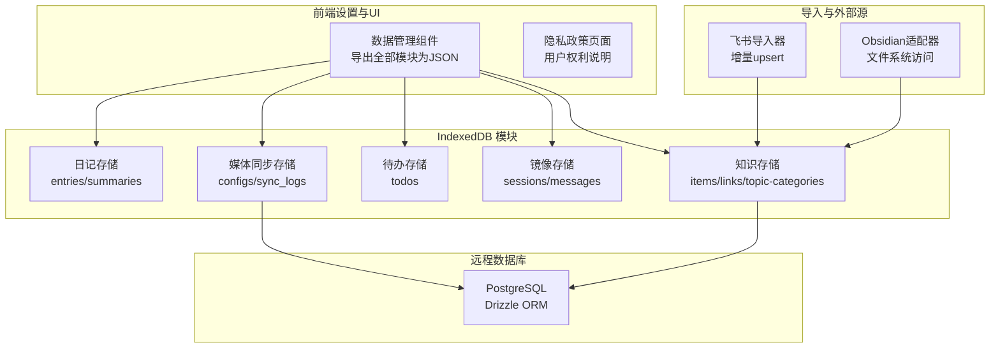
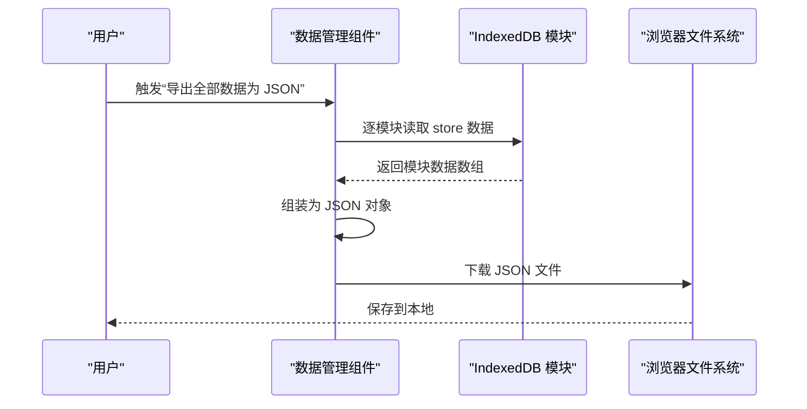
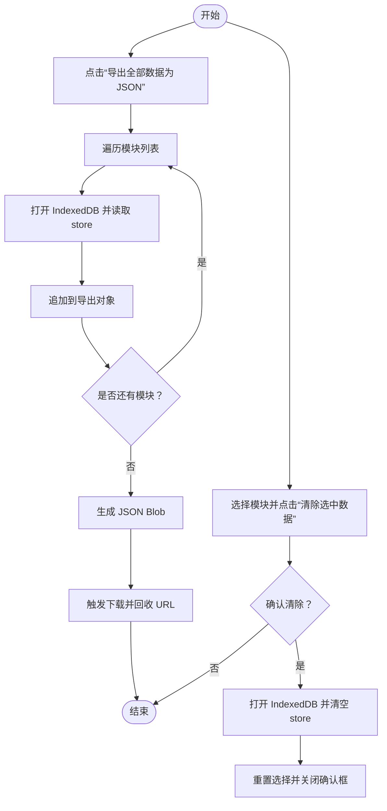
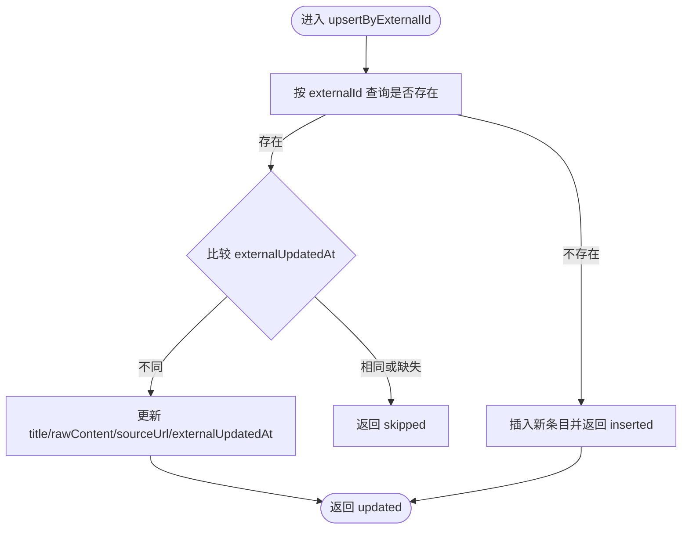
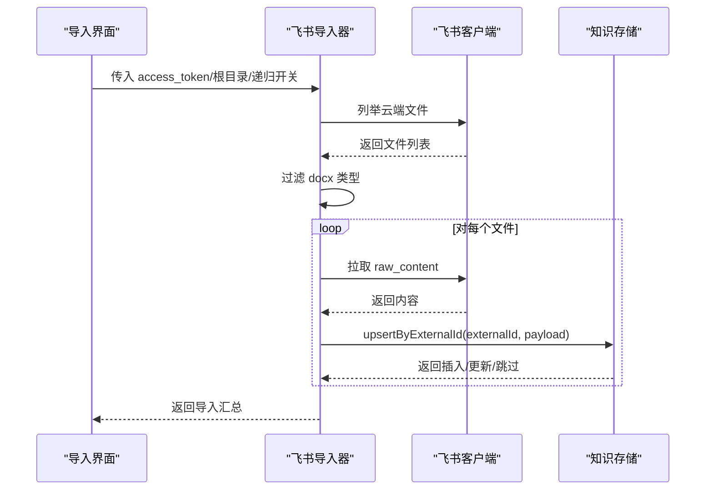
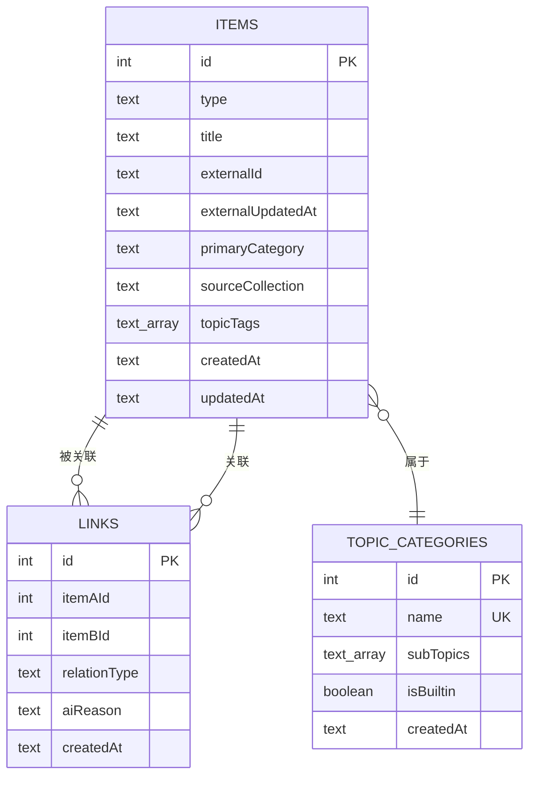
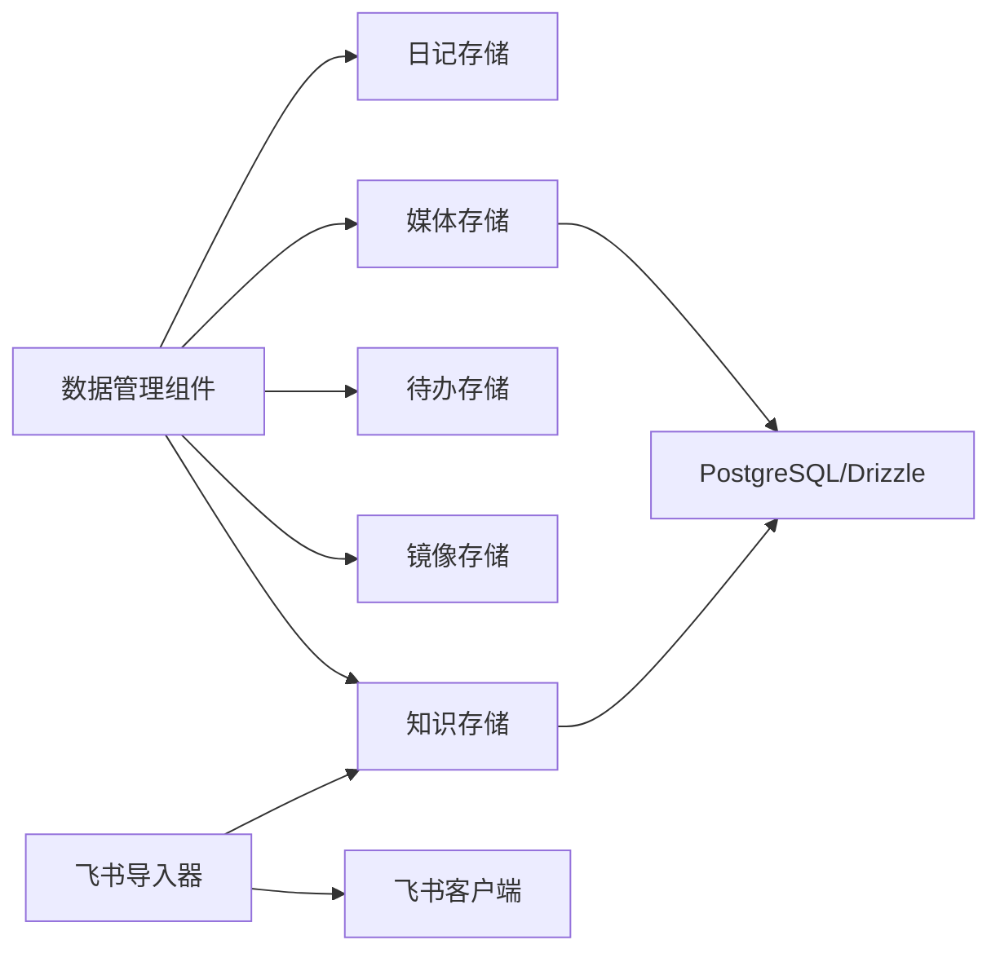

# 备份与恢复

<cite>
**本文引用的文件**
- [src/components/settings/data-management.tsx](file://src/components/settings/data-management.tsx)
- [src/lib/storage/knowledge-store.ts](file://src/lib/storage/knowledge-store.ts)
- [src/lib/storage/diary-store.ts](file://src/lib/storage/diary-store.ts)
- [src/lib/storage/todo-store.ts](file://src/lib/storage/todo-store.ts)
- [src/lib/storage/mirror-store.ts](file://src/lib/storage/mirror-store.ts)
- [src/lib/storage/media-store.ts](file://src/lib/storage/media-store.ts)
- [src/lib/db/index.ts](file://src/lib/db/index.ts)
- [src/lib/db/schema.ts](file://src/lib/db/schema.ts)
- [src/lib/db/migrations/meta/0000_snapshot.json](file://src/lib/db/migrations/meta/0000_snapshot.json)
- [src/lib/importer/types.ts](file://src/lib/importer/types.ts)
- [src/lib/importer/feishu-importer.ts](file://src/lib/importer/feishu-importer.ts)
- [src/lib/feishu/client.ts](file://src/lib/feishu/client.ts)
- [src/lib/obsidian/vault-adapter.ts](file://src/lib/obsidian/vault-adapter.ts)
- [src/lib/obsidian/handle-store.ts](file://src/lib/obsidian/handle-store.ts)
- [src/app/(auth)/privacy-policy/page.tsx](file://src/app/(auth)/privacy-policy/page.tsx)
</cite>

## 目录
1. [简介](#简介)
2. [项目结构](#项目结构)
3. [核心组件](#核心组件)
4. [架构总览](#架构总览)
5. [详细组件分析](#详细组件分析)
6. [依赖分析](#依赖分析)
7. [性能考虑](#性能考虑)
8. [故障排查指南](#故障排查指南)
9. [结论](#结论)
10. [附录](#附录)

## 简介
本文件面向 life-os 的备份与恢复系统，聚焦于本地 IndexedDB 数据的备份导出、增量导入（飞书、Obsidian）、以及与远程数据库的协同。文档涵盖以下主题：
- 备份策略：本地 JSON 导出作为“完整备份”基线，结合增量导入策略形成“混合备份”思路
- 数据格式与结构：各模块的 IndexedDB 架构、索引设计与数据模型
- 恢复流程：导入前检查、数据校验与冲突处理
- 自动化与定时任务：如何在现有导入框架上扩展自动化
- 数据迁移与跨平台：从浏览器到移动端的迁移要点
- 监控与告警：基于导入进度与日志的可观测性建议
- 安全与隐私：本地存储、导出数据的最小化原则与隐私声明

## 项目结构
life-os 的备份与恢复能力主要由以下部分构成：
- 设置页面的“数据管理”组件，提供一键导出全部模块数据为 JSON 的能力
- 多个 IndexedDB 模块（日记、知识、待办、镜像对话、媒体同步）的存储层
- 飞书与 Obsidian 的导入器，支持增量导入与去重
- 远程 PostgreSQL 数据库（Drizzle ORM）用于报告与日志等结构化数据
- 隐私政策页面对用户权利与数据可移植性的说明

图表来源
- [src/components/settings/data-management.tsx:1-128](file://src/components/settings/data-management.tsx#L1-L128)
- [src/lib/storage/diary-store.ts:44-83](file://src/lib/storage/diary-store.ts#L44-L83)
- [src/lib/storage/knowledge-store.ts:100-172](file://src/lib/storage/knowledge-store.ts#L100-L172)
- [src/lib/storage/todo-store.ts:20-40](file://src/lib/storage/todo-store.ts#L20-L40)
- [src/lib/storage/mirror-store.ts:36-67](file://src/lib/storage/mirror-store.ts#L36-L67)
- [src/lib/storage/media-store.ts:37-139](file://src/lib/storage/media-store.ts#L37-L139)
- [src/lib/db/index.ts:1-11](file://src/lib/db/index.ts#L1-L11)

章节来源
- [src/components/settings/data-management.tsx:1-128](file://src/components/settings/data-management.tsx#L1-L128)
- [src/lib/storage/diary-store.ts:44-83](file://src/lib/storage/diary-store.ts#L44-L83)
- [src/lib/storage/knowledge-store.ts:100-172](file://src/lib/storage/knowledge-store.ts#L100-L172)
- [src/lib/storage/todo-store.ts:20-40](file://src/lib/storage/todo-store.ts#L20-L40)
- [src/lib/storage/mirror-store.ts:36-67](file://src/lib/storage/mirror-store.ts#L36-L67)
- [src/lib/storage/media-store.ts:37-139](file://src/lib/storage/media-store.ts#L37-L139)
- [src/lib/db/index.ts:1-11](file://src/lib/db/index.ts#L1-L11)

## 核心组件
- 数据管理组件：提供“导出全部数据为 JSON”的一键操作，并支持按模块选择性清理
- 知识存储：支持按 externalId 增量 upsert，配合索引实现去重与更新
- 飞书导入器：基于用户态 access_token 列表云端文档并增量写入
- 媒体同步存储：记录配置与同步日志，便于追踪同步状态
- 隐私政策：明确用户对数据的查看、删除、导出权，以及卸载即清空的规则

章节来源
- [src/components/settings/data-management.tsx:1-128](file://src/components/settings/data-management.tsx#L1-L128)
- [src/lib/storage/knowledge-store.ts:208-250](file://src/lib/storage/knowledge-store.ts#L208-L250)
- [src/lib/importer/feishu-importer.ts:1-45](file://src/lib/importer/feishu-importer.ts#L1-L45)
- [src/lib/storage/media-store.ts:98-139](file://src/lib/storage/media-store.ts#L98-L139)
- [src/app/(auth)/privacy-policy/page.tsx:200-227](file://src/app/(auth)/privacy-policy/page.tsx#L200-L227)

## 架构总览
备份与恢复系统围绕“本地 JSON 导出 + 外部源增量导入”的混合策略构建：
- 本地备份：通过设置页导出，生成包含多个模块数据的 JSON 文件，作为“完整备份”
- 增量恢复：利用知识存储的 upsert 机制与外部源的 externalId/externalUpdatedAt，实现“增量导入”
- 恢复验证：通过导入进度与结果统计进行验证；必要时结合媒体同步日志进行一致性检查
- 安全与隐私：导出数据为明文 JSON，遵循隐私政策中用户权利说明

图表来源
- [src/components/settings/data-management.tsx:19-42](file://src/components/settings/data-management.tsx#L19-L42)

章节来源
- [src/components/settings/data-management.tsx:19-42](file://src/components/settings/data-management.tsx#L19-L42)

## 详细组件分析

### 数据管理组件（导出与清理）
- 功能概述：遍历已知模块，打开对应 IndexedDB，读取 store 并导出为 JSON；支持选择性清理模块数据
- 关键点：
  - 使用 openDB 的只读升级回调确保数据库存在但不触发升级
  - 导出文件命名包含日期，便于版本识别
  - 清理前弹窗确认，防止误操作

图表来源
- [src/components/settings/data-management.tsx:19-60](file://src/components/settings/data-management.tsx#L19-L60)

章节来源
- [src/components/settings/data-management.tsx:1-128](file://src/components/settings/data-management.tsx#L1-L128)

### 知识存储（upsert 与索引）
- 设计要点：
  - 通过 externalId 建立非唯一索引，支持飞书/Obsidian 导入的增量去重
  - upsertByExternalId：不存在则插入，存在且 externalUpdatedAt 未变则跳过，否则更新内容
  - 支持按一级主题分类与来源集索引，便于聚合与恢复后的检索
- 恢复流程中的作用：
  - 以 externalId 为键进行幂等写入，避免重复导入
  - externalUpdatedAt 作为“变更时间戳”，用于判断是否需要更新

图表来源
- [src/lib/storage/knowledge-store.ts:208-250](file://src/lib/storage/knowledge-store.ts#L208-L250)

章节来源
- [src/lib/storage/knowledge-store.ts:100-172](file://src/lib/storage/knowledge-store.ts#L100-L172)
- [src/lib/storage/knowledge-store.ts:208-250](file://src/lib/storage/knowledge-store.ts#L208-L250)

### 飞书导入器（增量导入）
- 流程概览：
  - 使用用户态 access_token 列出云端文档（docx）
  - 拉取 raw_content 并通过 upsert 写入知识存储
  - 可选触发 AI 打标队列
- 关键约定：
  - externalId 约定为 “feishu:<docToken>”
  - access_token 过期由 UI 侧刷新，导入器不处理刷新逻辑

图表来源
- [src/lib/importer/feishu-importer.ts:38-45](file://src/lib/importer/feishu-importer.ts#L38-L45)
- [src/lib/feishu/client.ts:202-229](file://src/lib/feishu/client.ts#L202-L229)
- [src/lib/storage/knowledge-store.ts:208-250](file://src/lib/storage/knowledge-store.ts#L208-L250)

章节来源
- [src/lib/importer/feishu-importer.ts:1-45](file://src/lib/importer/feishu-importer.ts#L1-L45)
- [src/lib/feishu/client.ts:187-229](file://src/lib/feishu/client.ts#L187-L229)
- [src/lib/storage/knowledge-store.ts:208-250](file://src/lib/storage/knowledge-store.ts#L208-L250)

### 媒体同步存储（日志与配置）
- 记录媒体同步配置与最近同步日志，便于恢复后验证同步状态
- 提供最近日志查询与最后同步时间获取，辅助一致性检查

章节来源
- [src/lib/storage/media-store.ts:37-139](file://src/lib/storage/media-store.ts#L37-L139)

### 数据模型与索引（概念图）

图表来源
- [src/lib/storage/knowledge-store.ts:5-97](file://src/lib/storage/knowledge-store.ts#L5-L97)
- [src/lib/storage/knowledge-store.ts:141-167](file://src/lib/storage/knowledge-store.ts#L141-L167)

章节来源
- [src/lib/storage/knowledge-store.ts:5-97](file://src/lib/storage/knowledge-store.ts#L5-L97)
- [src/lib/storage/knowledge-store.ts:141-167](file://src/lib/storage/knowledge-store.ts#L141-L167)

## 依赖分析
- 组件耦合：
  - 数据管理组件依赖各模块的 IndexedDB 初始化与读取接口
  - 飞书导入器依赖知识存储的 upsert 接口与外部飞书客户端
- 外部依赖：
  - Drizzle ORM 与 PostgreSQL 用于报告与日志等结构化数据
- 版本迁移：
  - 知识存储通过版本号与 upgrade 回调维护索引与新增 store

图表来源
- [src/components/settings/data-management.tsx:1-128](file://src/components/settings/data-management.tsx#L1-L128)
- [src/lib/importer/feishu-importer.ts:1-45](file://src/lib/importer/feishu-importer.ts#L1-L45)
- [src/lib/feishu/client.ts:202-229](file://src/lib/feishu/client.ts#L202-L229)
- [src/lib/db/index.ts:1-11](file://src/lib/db/index.ts#L1-L11)

章节来源
- [src/components/settings/data-management.tsx:1-128](file://src/components/settings/data-management.tsx#L1-L128)
- [src/lib/importer/feishu-importer.ts:1-45](file://src/lib/importer/feishu-importer.ts#L1-L45)
- [src/lib/feishu/client.ts:202-229](file://src/lib/feishu/client.ts#L202-L229)
- [src/lib/db/index.ts:1-11](file://src/lib/db/index.ts#L1-L11)

## 性能考虑
- 导出性能：
  - 逐模块读取 store，建议在低峰时段执行，避免阻塞 UI
  - 大数据量时可分批导出或拆分模块导出
- 导入性能：
  - 飞书导入采用增量 upsert，减少重复写入
  - externalId 索引与 externalUpdatedAt 比较降低无效更新成本
- 数据库层：
  - PostgreSQL 表结构与索引设计影响日志查询与报告生成效率

## 故障排查指南
- 导出失败：
  - 检查 IndexedDB 是否可访问；若模块不存在，组件会捕获异常并填充空数组
  - 确认浏览器允许下载与文件系统权限
- 导入失败：
  - 飞书 access_token 过期需先刷新；导入器不处理刷新
  - 查看导入进度与错误列表，定位具体文件
- 恢复验证：
  - 使用媒体同步日志与最后同步时间进行一致性检查
  - 通过知识存储的统计与检索验证导入结果

章节来源
- [src/components/settings/data-management.tsx:19-42](file://src/components/settings/data-management.tsx#L19-L42)
- [src/lib/importer/feishu-importer.ts:1-45](file://src/lib/importer/feishu-importer.ts#L1-L45)
- [src/lib/storage/media-store.ts:112-139](file://src/lib/storage/media-store.ts#L112-L139)

## 结论
life-os 的备份与恢复以“本地 JSON 导出 + 外部源增量导入”为核心策略。通过知识存储的 upsert 与索引设计，系统实现了可靠的增量导入与去重；设置页的一键导出提供了完整的本地备份能力。结合媒体同步日志与隐私政策中的用户权利说明，整体方案兼顾了易用性、可验证性与合规性。

## 附录

### 备份与恢复最佳实践
- 备份策略
  - 完整备份：定期执行“导出全部数据为 JSON”，作为恢复基线
  - 增量备份：依赖外部源（飞书/Obsidian）的增量 upsert，结合 externalId/externalUpdatedAt
- 恢复流程
  - 恢复前检查：确认目标环境 IndexedDB 可用、外部源 access_token 有效
  - 数据验证：比对导入汇总与统计信息，必要时使用检索与图谱数据交叉验证
  - 冲突解决：upsert 已内置去重与更新逻辑；如遇异常，优先检查 externalId 与时间戳
- 自动化与定时任务
  - 在现有导入器基础上封装定时任务：周期性触发飞书/Obsidian 导入
  - 导入完成后记录同步日志，便于监控与审计
- 数据迁移与跨平台
  - 跨平台迁移：保持 externalId 约定不变，确保增量导入连续性
  - 版本升级：关注知识存储的版本迁移回调，确保索引与新增 store 正常创建
- 监控与告警
  - 基于导入进度与结果统计进行可视化监控
  - 媒体同步日志用于追踪失败与异常
- 数据安全与隐私
  - 导出数据为明文 JSON，建议在受信设备与安全存储中保存
  - 隐私政策明确了用户对数据的查看、删除与导出权，以及卸载即清空的规则

章节来源
- [src/lib/storage/knowledge-store.ts:132-159](file://src/lib/storage/knowledge-store.ts#L132-L159)
- [src/lib/importer/types.ts:1-36](file://src/lib/importer/types.ts#L1-L36)
- [src/lib/storage/media-store.ts:98-139](file://src/lib/storage/media-store.ts#L98-L139)
- [src/app/(auth)/privacy-policy/page.tsx:200-227](file://src/app/(auth)/privacy-policy/page.tsx#L200-L227)