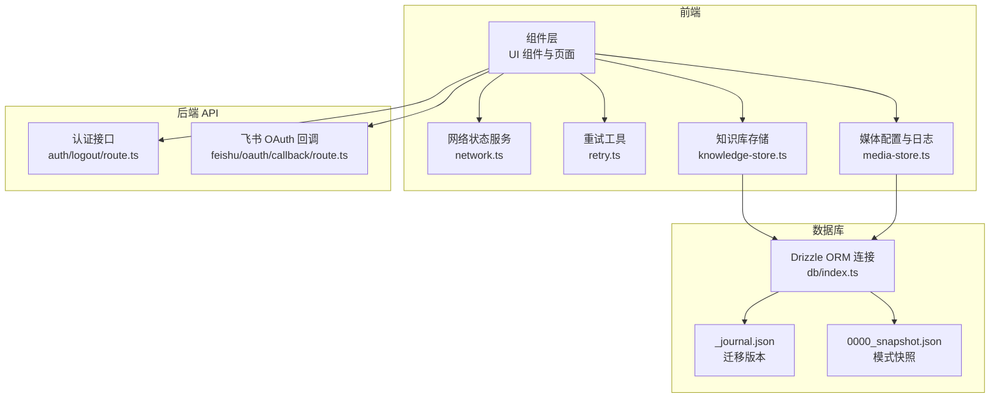
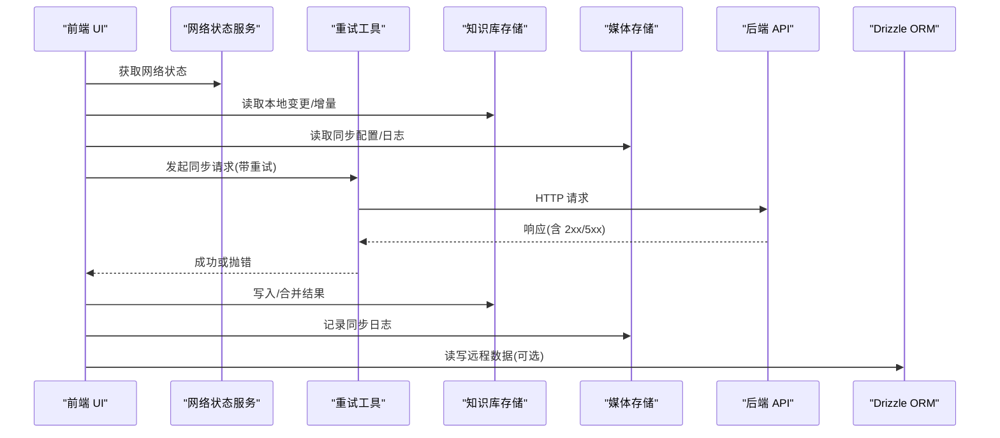
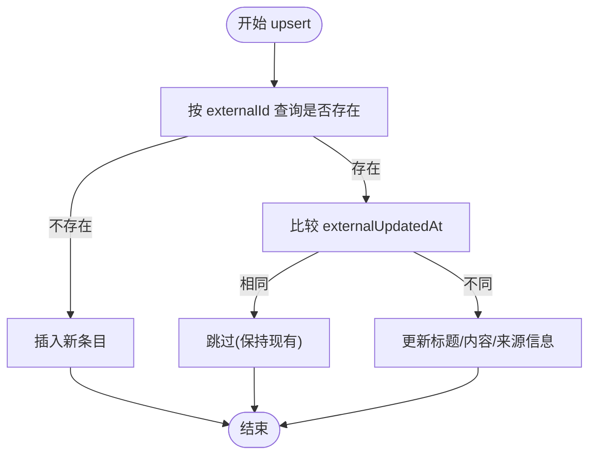
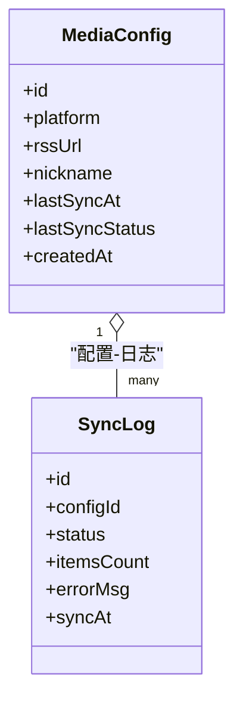
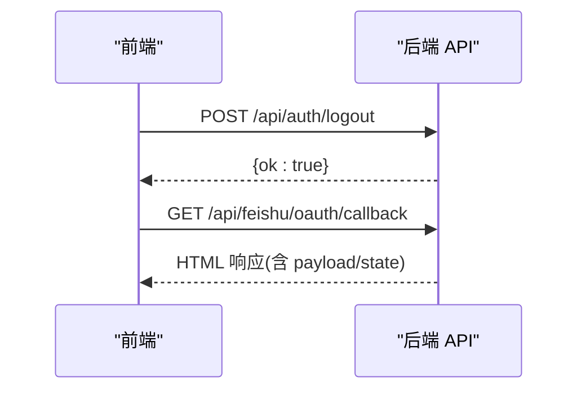
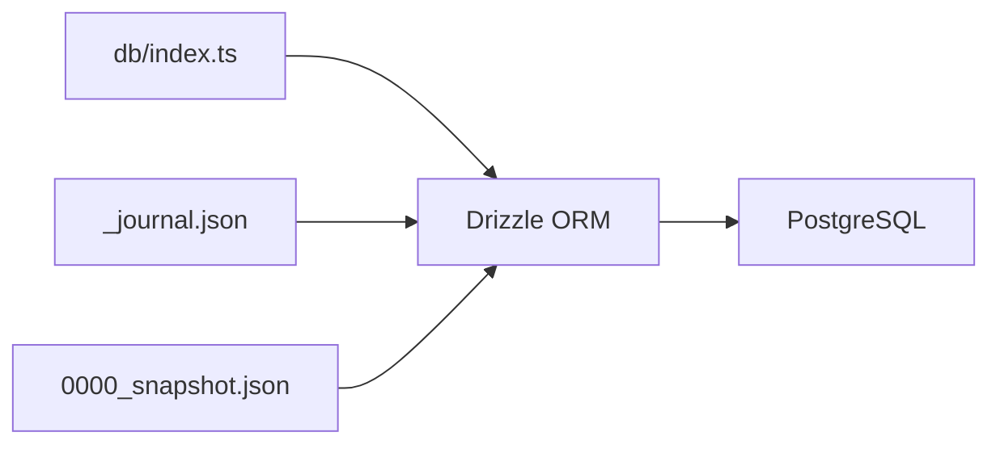
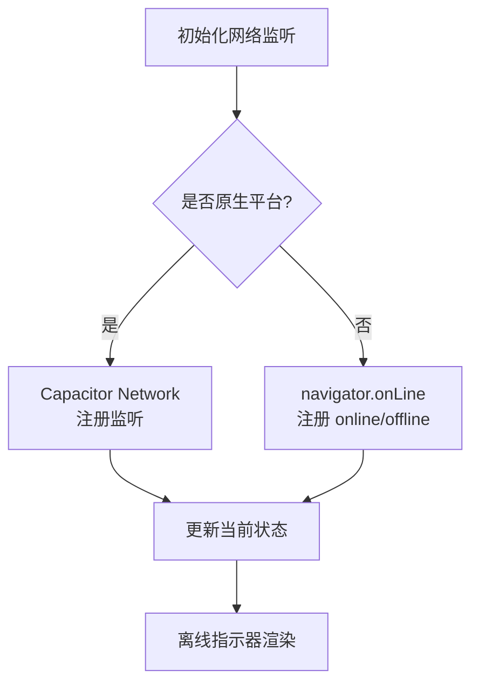
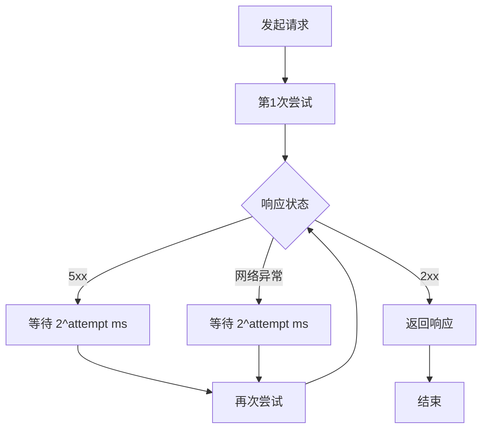
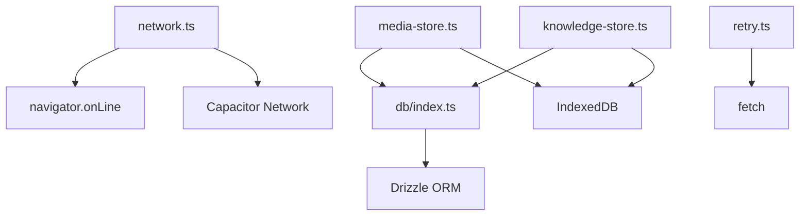

# 数据同步机制

<cite>
**本文引用的文件**
- [src/lib/storage/media-store.ts](file://src/lib/storage/media-store.ts)
- [src/lib/storage/knowledge-store.ts](file://src/lib/storage/knowledge-store.ts)
- [src/lib/db/index.ts](file://src/lib/db/index.ts)
- [src/lib/db/migrations/meta/_journal.json](file://src/lib/db/migrations/meta/_journal.json)
- [src/lib/db/migrations/meta/0000_snapshot.json](file://src/lib/db/migrations/meta/0000_snapshot.json)
- [src/lib/utils/retry.ts](file://src/lib/utils/retry.ts)
- [src/lib/native/network.ts](file://src/lib/native/network.ts)
- [src/components/shared/offline-indicator.tsx](file://src/components/shared/offline-indicator.tsx)
- [src/app/api/auth/logout/route.ts](file://src/app/api/auth/logout/route.ts)
- [src/app/api/feishu/oauth/callback/route.ts](file://src/app/api/feishu/oauth/callback/route.ts)
</cite>

## 目录
1. [简介](#简介)
2. [项目结构](#项目结构)
3. [核心组件](#核心组件)
4. [架构总览](#架构总览)
5. [详细组件分析](#详细组件分析)
6. [依赖分析](#依赖分析)
7. [性能考虑](#性能考虑)
8. [故障排查指南](#故障排查指南)
9. [结论](#结论)
10. [附录](#附录)

## 简介
本文件面向 life-os 的数据同步机制，聚焦“离线优先”架构下的本地变更检测、冲突解决与双向同步流程，系统性阐述同步队列管理（优先级、重试、错误处理）、数据一致性保障（乐观锁/悲观锁/最终一致性）、性能优化（增量同步、批量传输、网络状态感知）、用户会话与认证状态在同步过程中的处理，以及同步监控与调试工具的使用方法与常见问题诊断。

## 项目结构
life-os 采用前端驱动的离线优先设计：浏览器端通过 IndexedDB 存储本地知识与媒体数据，并通过 API 层与后端进行双向同步；网络状态感知与重试策略贯穿于同步流程；数据库迁移由 Drizzle ORM 管理。

图表来源
- [src/lib/storage/knowledge-store.ts:106-172](file://src/lib/storage/knowledge-store.ts#L106-L172)
- [src/lib/storage/media-store.ts:33-56](file://src/lib/storage/media-store.ts#L33-L56)
- [src/lib/db/index.ts:1-11](file://src/lib/db/index.ts#L1-L11)
- [src/lib/db/migrations/meta/_journal.json:1-13](file://src/lib/db/migrations/meta/_journal.json#L1-L13)
- [src/lib/db/migrations/meta/0000_snapshot.json:496-552](file://src/lib/db/migrations/meta/0000_snapshot.json#L496-L552)
- [src/lib/native/network.ts:32-62](file://src/lib/native/network.ts#L32-L62)
- [src/lib/utils/retry.ts:10-40](file://src/lib/utils/retry.ts#L10-L40)
- [src/app/api/auth/logout/route.ts:1-13](file://src/app/api/auth/logout/route.ts#L1-L13)
- [src/app/api/feishu/oauth/callback/route.ts:63-95](file://src/app/api/feishu/oauth/callback/route.ts#L63-L95)

章节来源
- [src/lib/storage/knowledge-store.ts:106-172](file://src/lib/storage/knowledge-store.ts#L106-L172)
- [src/lib/storage/media-store.ts:33-56](file://src/lib/storage/media-store.ts#L33-L56)
- [src/lib/db/index.ts:1-11](file://src/lib/db/index.ts#L1-L11)
- [src/lib/db/migrations/meta/_journal.json:1-13](file://src/lib/db/migrations/meta/_journal.json#L1-L13)
- [src/lib/db/migrations/meta/0000_snapshot.json:496-552](file://src/lib/db/migrations/meta/0000_snapshot.json#L496-L552)
- [src/lib/native/network.ts:32-62](file://src/lib/native/network.ts#L32-L62)
- [src/lib/utils/retry.ts:10-40](file://src/lib/utils/retry.ts#L10-L40)
- [src/app/api/auth/logout/route.ts:1-13](file://src/app/api/auth/logout/route.ts#L1-L13)
- [src/app/api/feishu/oauth/callback/route.ts:63-95](file://src/app/api/feishu/oauth/callback/route.ts#L63-L95)

## 核心组件
- 知识库本地存储（IndexedDB）：提供知识条目、链接、主题分类、标签统计等 CRUD 与索引查询能力，支持按外部源 ID 增量 upsert。
- 媒体配置与同步日志（IndexedDB）：记录各平台 RSS 配置、最近一次同步时间与状态、同步日志以便审计。
- 后端 API：提供认证登出、飞书 OAuth 回调等接口，作为同步的数据源与鉴权入口。
- Drizzle ORM：统一 PostgreSQL 连接与迁移管理，确保数据库模式演进与版本控制。
- 网络状态服务：原生平台使用 Capacitor Network 插件，Web 平台使用 navigator.onLine，提供在线/离线与连接类型感知。
- 重试工具：基于指数退避的有限重试，仅对 5xx 错误触发，网络错误同样重试，提升弱网稳定性。

章节来源
- [src/lib/storage/knowledge-store.ts:176-250](file://src/lib/storage/knowledge-store.ts#L176-L250)
- [src/lib/storage/media-store.ts:60-139](file://src/lib/storage/media-store.ts#L60-L139)
- [src/lib/db/index.ts:1-11](file://src/lib/db/index.ts#L1-L11)
- [src/lib/native/network.ts:32-101](file://src/lib/native/network.ts#L32-L101)
- [src/lib/utils/retry.ts:10-40](file://src/lib/utils/retry.ts#L10-L40)

## 架构总览
离线优先的同步架构以浏览器端 IndexedDB 为核心，结合网络状态感知与重试策略，实现本地变更检测、冲突解决与双向同步。后端通过 API 提供认证与外部数据源接入，Drizzle ORM 管理数据库模式与迁移。

图表来源
- [src/lib/native/network.ts:32-101](file://src/lib/native/network.ts#L32-L101)
- [src/lib/utils/retry.ts:10-40](file://src/lib/utils/retry.ts#L10-L40)
- [src/lib/storage/knowledge-store.ts:176-250](file://src/lib/storage/knowledge-store.ts#L176-L250)
- [src/lib/storage/media-store.ts:100-139](file://src/lib/storage/media-store.ts#L100-L139)
- [src/lib/db/index.ts:1-11](file://src/lib/db/index.ts#L1-L11)

## 详细组件分析

### 知识库存储（IndexedDB）
- 数据模型与索引
  - 条目表：按类型、标签、创建时间、外部 ID、一级主题、来源集合建立索引，支持高效查询与增量 upsert。
  - 链接表：按两端节点建立索引，支持图谱构建与层级关系维护。
  - 主题分类表：按名称唯一索引，内置默认主题。
- 增量 upsert
  - 依据 externalId 与 externalUpdatedAt 实现“存在即增量更新”的幂等策略，避免重复导入与内容抖动。
- 事务与一致性
  - 删除条目时联动删除关联链接，使用事务保证一致性。
- 图与统计
  - 提供图数据导出、标签统计、来源集合统计等聚合查询，支撑 UI 展示与分析。

图表来源
- [src/lib/storage/knowledge-store.ts:221-250](file://src/lib/storage/knowledge-store.ts#L221-L250)

章节来源
- [src/lib/storage/knowledge-store.ts:106-172](file://src/lib/storage/knowledge-store.ts#L106-L172)
- [src/lib/storage/knowledge-store.ts:221-250](file://src/lib/storage/knowledge-store.ts#L221-L250)
- [src/lib/storage/knowledge-store.ts:252-269](file://src/lib/storage/knowledge-store.ts#L252-L269)
- [src/lib/storage/knowledge-store.ts:370-392](file://src/lib/storage/knowledge-store.ts#L370-L392)
- [src/lib/storage/knowledge-store.ts:456-498](file://src/lib/storage/knowledge-store.ts#L456-L498)

### 媒体配置与同步日志（IndexedDB）
- 配置管理
  - 记录平台、RSS 地址、昵称、最近同步时间与状态，支持按平台索引查询。
- 同步日志
  - 记录每次同步的结果、影响条目数、错误信息与时间戳，支持按配置与时间索引检索。
- 最近同步时间
  - 从配置集中提取并排序，获取全局最近同步时间，辅助增量同步起点选择。

图表来源
- [src/lib/storage/media-store.ts:7-24](file://src/lib/storage/media-store.ts#L7-L24)
- [src/lib/storage/media-store.ts:39-51](file://src/lib/storage/media-store.ts#L39-L51)

章节来源
- [src/lib/storage/media-store.ts:33-56](file://src/lib/storage/media-store.ts#L33-L56)
- [src/lib/storage/media-store.ts:60-96](file://src/lib/storage/media-store.ts#L60-L96)
- [src/lib/storage/media-store.ts:100-139](file://src/lib/storage/media-store.ts#L100-L139)

### 后端 API 与认证状态
- 登出接口：销毁会话，确保后续同步不再携带无效认证。
- 飞书 OAuth 回调：完成授权码换取令牌、刷新令牌与过期时间计算，返回前端用于后续同步的凭据。

图表来源
- [src/app/api/auth/logout/route.ts:6-12](file://src/app/api/auth/logout/route.ts#L6-L12)
- [src/app/api/feishu/oauth/callback/route.ts:71-79](file://src/app/api/feishu/oauth/callback/route.ts#L71-L79)

章节来源
- [src/app/api/auth/logout/route.ts:1-13](file://src/app/api/auth/logout/route.ts#L1-L13)
- [src/app/api/feishu/oauth/callback/route.ts:63-95](file://src/app/api/feishu/oauth/callback/route.ts#L63-L95)

### Drizzle ORM 与数据库迁移
- 连接与驱动：使用 postgres-js 驱动，支持本地开发；生产可切换为 Neon Serverless。
- 迁移管理：通过 _journal.json 与 0000_snapshot.json 记录迁移版本与模式快照，确保数据库演进可控。

图表来源
- [src/lib/db/index.ts:1-11](file://src/lib/db/index.ts#L1-L11)
- [src/lib/db/migrations/meta/_journal.json:1-13](file://src/lib/db/migrations/meta/_journal.json#L1-L13)
- [src/lib/db/migrations/meta/0000_snapshot.json:496-552](file://src/lib/db/migrations/meta/0000_snapshot.json#L496-L552)

章节来源
- [src/lib/db/index.ts:1-11](file://src/lib/db/index.ts#L1-L11)
- [src/lib/db/migrations/meta/_journal.json:1-13](file://src/lib/db/migrations/meta/_journal.json#L1-L13)
- [src/lib/db/migrations/meta/0000_snapshot.json:496-552](file://src/lib/db/migrations/meta/0000_snapshot.json#L496-L552)

### 网络状态感知与 UI 展示
- 原生平台：使用 Capacitor Network 监听 WiFi/蜂窝/无网络状态变化。
- Web 平台：使用 navigator.onLine 降级，提供 online/offline 事件。
- UI 展示：离线指示器根据网络状态显示图标与提示，支持断网重连提示。

图表来源
- [src/lib/native/network.ts:32-101](file://src/lib/native/network.ts#L32-L101)
- [src/components/shared/offline-indicator.tsx:16-37](file://src/components/shared/offline-indicator.tsx#L16-L37)

章节来源
- [src/lib/native/network.ts:32-101](file://src/lib/native/network.ts#L32-L101)
- [src/components/shared/offline-indicator.tsx:16-37](file://src/components/shared/offline-indicator.tsx#L16-L37)

### 重试策略与错误处理
- 有限重试：最多 N 次尝试，指数退避延迟。
- 重试条件：仅对 5xx 服务器错误触发；网络异常同样重试，提升弱网鲁棒性。
- 错误封装：自定义 FetchError，保留状态码便于上层判断。

图表来源
- [src/lib/utils/retry.ts:10-40](file://src/lib/utils/retry.ts#L10-L40)

章节来源
- [src/lib/utils/retry.ts:1-45](file://src/lib/utils/retry.ts#L1-L45)

## 依赖分析
- 组件耦合
  - 知识库存储与媒体存储均依赖 IndexedDB，提供独立的 CRUD 与索引能力，降低模块间耦合。
  - 网络状态服务与重试工具被 UI 与存储层共同依赖，形成横切关注点。
  - Drizzle ORM 作为数据库访问层，被知识库与媒体存储间接依赖。
- 外部依赖
  - 原生网络插件（Capacitor Network）与 Web navigator.onLine 提供跨平台网络感知。
  - fetchWithRetry 依赖浏览器/Node fetch，支持重试与错误传播。

图表来源
- [src/lib/storage/knowledge-store.ts:106-172](file://src/lib/storage/knowledge-store.ts#L106-L172)
- [src/lib/storage/media-store.ts:33-56](file://src/lib/storage/media-store.ts#L33-L56)
- [src/lib/native/network.ts:36-82](file://src/lib/native/network.ts#L36-L82)
- [src/lib/utils/retry.ts:10-40](file://src/lib/utils/retry.ts#L10-L40)
- [src/lib/db/index.ts:1-11](file://src/lib/db/index.ts#L1-L11)

章节来源
- [src/lib/storage/knowledge-store.ts:106-172](file://src/lib/storage/knowledge-store.ts#L106-L172)
- [src/lib/storage/media-store.ts:33-56](file://src/lib/storage/media-store.ts#L33-L56)
- [src/lib/native/network.ts:36-82](file://src/lib/native/network.ts#L36-L82)
- [src/lib/utils/retry.ts:10-40](file://src/lib/utils/retry.ts#L10-L40)
- [src/lib/db/index.ts:1-11](file://src/lib/db/index.ts#L1-L11)

## 性能考虑
- 增量同步
  - 知识库 upsert 使用 externalId 与 externalUpdatedAt，避免重复导入与全量比对。
  - 媒体配置记录 lastSyncAt，作为增量起点，减少往返数据量。
- 批量传输
  - 将多个小变更合并为批次提交，减少网络往返与事务开销。
- 索引优化
  - 按类型、标签、创建时间、外部 ID、来源集合建立索引，加速查询与过滤。
- 网络状态感知
  - 在弱网或离线状态下延缓非关键同步，优先保证核心数据一致性。
- 事务与并发
  - 删除条目时使用事务删除关联链接，避免脏数据；并发场景下建议引入队列与去重。

[本节为通用性能指导，不直接分析具体文件]

## 故障排查指南
- 网络相关
  - 症状：同步频繁中断或失败。
  - 排查：确认网络状态服务是否正确初始化；检查 Capacitor Network 或 navigator.onLine 是否正常工作；观察离线指示器状态。
  - 处理：在网络恢复后重试；必要时降低重试频率或暂停非关键同步。
- 重试与超时
  - 症状：5xx 错误导致同步失败。
  - 排查：查看 fetchWithRetry 的错误封装与状态码；确认服务端是否稳定。
  - 处理：调整最大重试次数与退避参数；对 4xx 客户端错误区分处理，避免盲目重试。
- 数据不一致
  - 症状：同一条目出现重复或内容不一致。
  - 排查：检查 externalId 与 externalUpdatedAt 是否正确传递；确认 upsert 流程是否按预期执行。
  - 处理：在客户端增加幂等校验；必要时引入服务端去重或版本号。
- 认证失效
  - 症状：同步请求返回未授权。
  - 排查：确认会话是否被销毁；OAuth 回调是否成功写入令牌。
  - 处理：触发重新登录或刷新令牌流程；登出后清理本地缓存。
- 日志与审计
  - 使用媒体存储的同步日志记录每次同步的状态、条目数与错误信息，定位失败原因。

章节来源
- [src/lib/native/network.ts:32-101](file://src/lib/native/network.ts#L32-L101)
- [src/lib/utils/retry.ts:10-40](file://src/lib/utils/retry.ts#L10-L40)
- [src/lib/storage/knowledge-store.ts:221-250](file://src/lib/storage/knowledge-store.ts#L221-L250)
- [src/app/api/auth/logout/route.ts:6-12](file://src/app/api/auth/logout/route.ts#L6-L12)
- [src/app/api/feishu/oauth/callback/route.ts:71-79](file://src/app/api/feishu/oauth/callback/route.ts#L71-L79)
- [src/lib/storage/media-store.ts:100-139](file://src/lib/storage/media-store.ts#L100-L139)

## 结论
life-os 的数据同步机制以 IndexedDB 为核心，结合网络状态感知与有限重试策略，在离线优先的前提下实现了可靠的双向同步。通过 externalId 与 externalUpdatedAt 的增量 upsert、完善的索引与事务处理，以及 Drizzle ORM 的迁移管理，系统在功能完整性与可维护性之间取得平衡。建议在生产环境中进一步完善同步队列的优先级调度、错误分类与告警机制，并持续优化网络感知与批处理策略以提升用户体验。

[本节为总结性内容，不直接分析具体文件]

## 附录
- 用户会话与认证
  - 登出接口负责销毁会话，防止后续同步携带无效凭据。
  - 飞书 OAuth 回调负责换取与刷新令牌，确保外部数据源访问权限。
- 同步监控
  - 媒体存储的日志表可用于审计最近同步结果与错误信息。
  - 建议在 UI 中展示同步进度与错误详情，便于用户自助排查。

章节来源
- [src/app/api/auth/logout/route.ts:6-12](file://src/app/api/auth/logout/route.ts#L6-L12)
- [src/app/api/feishu/oauth/callback/route.ts:71-79](file://src/app/api/feishu/oauth/callback/route.ts#L71-L79)
- [src/lib/storage/media-store.ts:100-139](file://src/lib/storage/media-store.ts#L100-L139)