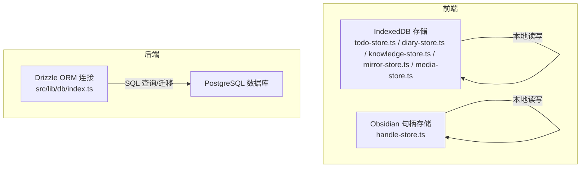
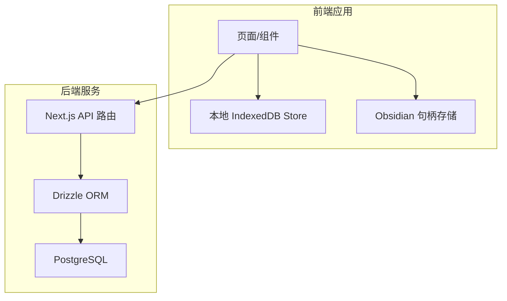
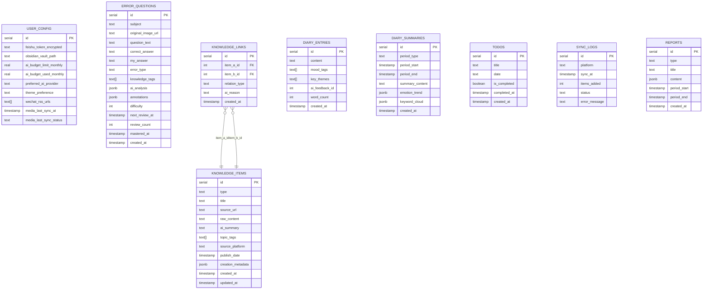
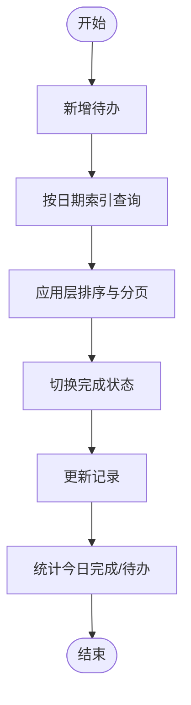
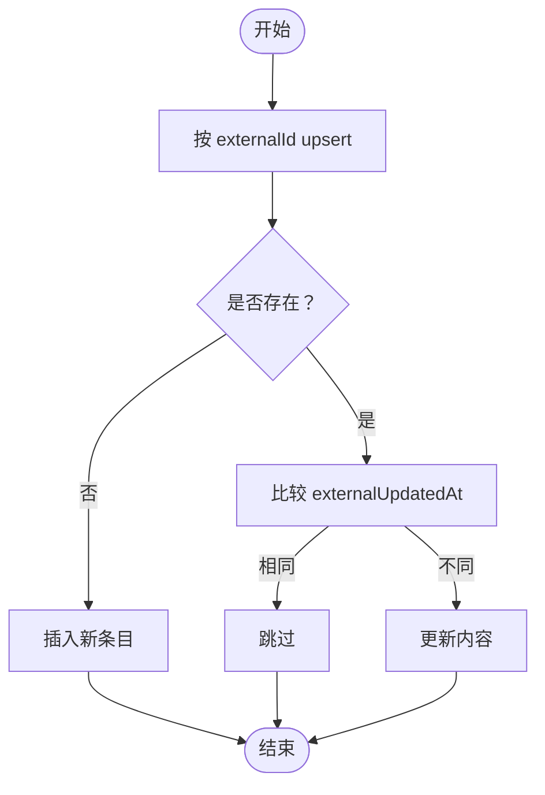
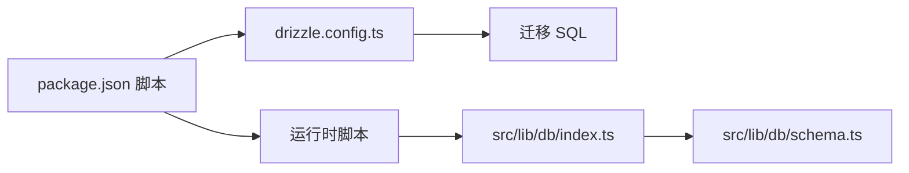

# 数据存储系统

<cite>
**本文引用的文件**
- [drizzle.config.ts](file://drizzle.config.ts)
- [package.json](file://package.json)
- [src/lib/db/index.ts](file://src/lib/db/index.ts)
- [src/lib/db/schema.ts](file://src/lib/db/schema.ts)
- [src/lib/db/migrations/0000_rare_starjammers.sql](file://src/lib/db/migrations/0000_rare_starjammers.sql)
- [src/lib/storage/todo-store.ts](file://src/lib/storage/todo-store.ts)
- [src/lib/storage/knowledge-store.ts](file://src/lib/storage/knowledge-store.ts)
- [src/lib/storage/diary-store.ts](file://src/lib/storage/diary-store.ts)
- [src/lib/storage/mirror-store.ts](file://src/lib/storage/mirror-store.ts)
- [src/lib/storage/media-store.ts](file://src/lib/storage/media-store.ts)
- [src/lib/obsidian/handle-store.ts](file://src/lib/obsidian/handle-store.ts)
</cite>

## 目录
1. [简介](#简介)
2. [项目结构](#项目结构)
3. [核心组件](#核心组件)
4. [架构总览](#架构总览)
5. [详细组件分析](#详细组件分析)
6. [依赖分析](#依赖分析)
7. [性能考虑](#性能考虑)
8. [故障排查指南](#故障排查指南)
9. [结论](#结论)
10. [附录](#附录)

## 简介
本文件面向 life-os 的数据存储系统，系统采用“离线优先 + 在线同步”的混合架构：前端以 IndexedDB 为核心进行本地持久化与实时交互，后端使用 PostgreSQL + Drizzle ORM 提供统一的数据模型与强一致性的在线能力，并通过迁移工具与脚本完成数据库演进。本文将系统性阐述：
- 混合存储架构设计与离线优先策略
- Drizzle ORM 的模式定义、查询与迁移管理
- 数据模型设计原则（实体关系、索引策略、约束）
- 备份、恢复与迁移流程
- 性能优化（批量操作、缓存、查询优化）
- 一致性与并发控制
- 开发者最佳实践与常见问题

## 项目结构
数据存储相关的关键目录与文件：
- Drizzle 配置与迁移：drizzle.config.ts、src/lib/db/migrations
- Drizzle 运行时连接：src/lib/db/index.ts
- 数据模型定义：src/lib/db/schema.ts
- 前端本地存储（IndexedDB）：多个 store 文件，分别覆盖 Todo、日记、知识库、镜像对话、媒体导入等场景
- Obsidian 目录句柄存储：独立的 IndexedDB 用于保存浏览器 FileSystemDirectoryHandle

图表来源
- [src/lib/db/index.ts:1-10](file://src/lib/db/index.ts#L1-L10)
- [src/lib/db/schema.ts:1-118](file://src/lib/db/schema.ts#L1-L118)
- [src/lib/storage/todo-store.ts:1-184](file://src/lib/storage/todo-store.ts#L1-L184)
- [src/lib/storage/knowledge-store.ts:1-611](file://src/lib/storage/knowledge-store.ts#L1-L611)
- [src/lib/storage/diary-store.ts:1-237](file://src/lib/storage/diary-store.ts#L1-L237)
- [src/lib/storage/mirror-store.ts:1-155](file://src/lib/storage/mirror-store.ts#L1-L155)
- [src/lib/storage/media-store.ts:1-139](file://src/lib/storage/media-store.ts#L1-L139)
- [src/lib/obsidian/handle-store.ts:1-40](file://src/lib/obsidian/handle-store.ts#L1-L40)

章节来源
- [drizzle.config.ts:1-14](file://drizzle.config.ts#L1-L14)
- [package.json:1-91](file://package.json#L1-L91)

## 核心组件
- Drizzle ORM 连接与模式
  - 连接：通过 src/lib/db/index.ts 使用 postgres 驱动建立连接，并注入 schema 定义
  - 模式：src/lib/db/schema.ts 定义 user_config、error_questions、knowledge_items、knowledge_links、diary_entries、diary_summaries、todos、sync_logs、reports 等表
  - 迁移：drizzle.config.ts 指定 schema 与输出目录；通过脚本生成/执行迁移
- IndexedDB 本地存储
  - Todo：按日期与完成状态索引，支持今日/本周统计
  - 知识库：按类型、标签、外部 ID、一级主题、来源集索引，支持去重、图谱导出、标签合并
  - 日记：按创建时间与情绪标签索引，支持周汇总
  - 镜像对话：会话与消息分表，按时间与会话索引
  - 媒体导入：配置与同步日志，按平台/时间索引
  - Obsidian：独立 DB 存放目录句柄，避免结构化克隆污染业务 store

章节来源
- [src/lib/db/index.ts:1-10](file://src/lib/db/index.ts#L1-L10)
- [src/lib/db/schema.ts:1-118](file://src/lib/db/schema.ts#L1-L118)
- [drizzle.config.ts:1-14](file://drizzle.config.ts#L1-L14)
- [src/lib/storage/todo-store.ts:1-184](file://src/lib/storage/todo-store.ts#L1-L184)
- [src/lib/storage/knowledge-store.ts:1-611](file://src/lib/storage/knowledge-store.ts#L1-L611)
- [src/lib/storage/diary-store.ts:1-237](file://src/lib/storage/diary-store.ts#L1-L237)
- [src/lib/storage/mirror-store.ts:1-155](file://src/lib/storage/mirror-store.ts#L1-L155)
- [src/lib/storage/media-store.ts:1-139](file://src/lib/storage/media-store.ts#L1-L139)
- [src/lib/obsidian/handle-store.ts:1-40](file://src/lib/obsidian/handle-store.ts#L1-L40)

## 架构总览
离线优先 + 在线同步的混合架构：
- 前端优先使用 IndexedDB 进行本地读写，保证弱网/离线可用性
- 通过后端 PostgreSQL + Drizzle ORM 提供统一的数据模型与强一致能力
- 使用迁移工具管理数据库演进，确保生产环境一致性
- 通过同步日志与配置表记录外部平台集成状态

图表来源
- [src/lib/db/index.ts:1-10](file://src/lib/db/index.ts#L1-L10)
- [src/lib/db/schema.ts:1-118](file://src/lib/db/schema.ts#L1-L118)
- [src/lib/storage/todo-store.ts:1-184](file://src/lib/storage/todo-store.ts#L1-L184)
- [src/lib/storage/knowledge-store.ts:1-611](file://src/lib/storage/knowledge-store.ts#L1-L611)
- [src/lib/storage/diary-store.ts:1-237](file://src/lib/storage/diary-store.ts#L1-L237)
- [src/lib/storage/mirror-store.ts:1-155](file://src/lib/storage/mirror-store.ts#L1-L155)
- [src/lib/storage/media-store.ts:1-139](file://src/lib/storage/media-store.ts#L1-L139)
- [src/lib/obsidian/handle-store.ts:1-40](file://src/lib/obsidian/handle-store.ts#L1-L40)

## 详细组件分析

### Drizzle ORM 与数据库模式
- 连接与驱动
  - 使用 postgres 驱动建立连接，注入 schema，便于类型安全查询
- 模式设计
  - 用户配置表：存储外部平台令牌、RSS 地址、主题偏好、AI 预算等
  - 错题本：结构化存储题目、答案、难度、复习计划等
  - 知识库：条目与链接，支持来源平台、发布时间、元数据、标签、外部 ID 去重
  - 日记：条目与周期性摘要，支持情感趋势与关键词云
  - 待办：按日期与完成状态组织
  - 同步日志：记录外部平台同步状态与错误信息
  - 报告：周期性报告内容与时间范围
- 约束与索引
  - 主键、外键、非空、默认值等约束在 schema 中明确
  - 迁移文件中定义了表结构与外键约束，确保生产一致性

图表来源
- [src/lib/db/schema.ts:1-118](file://src/lib/db/schema.ts#L1-L118)
- [src/lib/db/migrations/0000_rare_starjammers.sql:1-106](file://src/lib/db/migrations/0000_rare_starjammers.sql#L1-L106)

章节来源
- [src/lib/db/index.ts:1-10](file://src/lib/db/index.ts#L1-L10)
- [src/lib/db/schema.ts:1-118](file://src/lib/db/schema.ts#L1-L118)
- [drizzle.config.ts:1-14](file://drizzle.config.ts#L1-L14)
- [src/lib/db/migrations/0000_rare_starjammers.sql:1-106](file://src/lib/db/migrations/0000_rare_starjammers.sql#L1-L106)

### Todo 存储（IndexedDB）
- 设计要点
  - 对象存储：todos
  - 索引：按日期、按完成状态
  - 功能：新增、查询、更新、删除、切换完成状态、今日/本周统计
- 查询优化
  - 使用索引查询按日期与完成状态，减少全表扫描
  - 排序与分页在应用层完成，保持查询简单

图表来源
- [src/lib/storage/todo-store.ts:69-184](file://src/lib/storage/todo-store.ts#L69-L184)

章节来源
- [src/lib/storage/todo-store.ts:1-184](file://src/lib/storage/todo-store.ts#L1-L184)

### 知识库存储（IndexedDB）
- 设计要点
  - 对象存储：items、links、topic-categories
  - 索引：按类型、标签（multiEntry）、外部 ID（非唯一）、一级主题、来源集
  - 功能：按外部 ID upsert 去重、标签统计与合并、父子层级管理、来源集聚合、图数据导出
- 去重与增量
  - 通过 externalId 与 externalUpdatedAt 实现飞书/Obsidian 导入的增量同步
- 图与统计
  - 支持导出节点/边，计算标签使用频次，支持分类体系扩展

图表来源
- [src/lib/storage/knowledge-store.ts:221-250](file://src/lib/storage/knowledge-store.ts#L221-L250)

章节来源
- [src/lib/storage/knowledge-store.ts:1-611](file://src/lib/storage/knowledge-store.ts#L1-L611)

### 日记存储（IndexedDB）
- 设计要点
  - 对象存储：entries、summaries
  - 索引：按创建时间、按情绪标签（multiEntry）
  - 功能：新增/更新/删除、周内检索、最近 N 天检索、统计与摘要管理
- 一致性
  - 内容变更时自动更新字数与更新时间戳

章节来源
- [src/lib/storage/diary-store.ts:1-237](file://src/lib/storage/diary-store.ts#L1-L237)

### 镜像对话存储（IndexedDB）
- 设计要点
  - 对象存储：sessions、messages
  - 索引：按更新时间、按创建时间、按会话
  - 功能：会话生命周期管理、消息增删查、清空消息、统计数量
- 并发
  - 删除会话时使用事务删除关联消息，保证一致性

章节来源
- [src/lib/storage/mirror-store.ts:1-155](file://src/lib/storage/mirror-store.ts#L1-L155)

### 媒体导入存储（IndexedDB）
- 设计要点
  - 对象存储：configs、sync_logs
  - 索引：按平台、按配置、按同步时间
  - 功能：配置增删改查、最近日志查询、最后同步时间获取

章节来源
- [src/lib/storage/media-store.ts:1-139](file://src/lib/storage/media-store.ts#L1-L139)

### Obsidian 句柄存储（IndexedDB）
- 设计要点
  - 独立数据库：仅保存目录句柄与显示名，避免污染业务 store
  - 功能：保存、加载、清理

章节来源
- [src/lib/obsidian/handle-store.ts:1-40](file://src/lib/obsidian/handle-store.ts#L1-L40)

## 依赖分析
- Drizzle 工具链
  - drizzle.config.ts 指定 schema 与迁移输出目录，使用 postgres 方言
  - package.json 提供 db:generate、db:migrate、db:push、db:studio 等脚本
- 运行时依赖
  - src/lib/db/index.ts 使用 postgres 驱动与 drizzle-orm 进行连接与查询
- 前端依赖
  - idb 提供 IndexedDB 封装，各 store 文件基于 openDB 与事务 API

图表来源
- [drizzle.config.ts:1-14](file://drizzle.config.ts#L1-L14)
- [package.json:1-91](file://package.json#L1-L91)
- [src/lib/db/index.ts:1-10](file://src/lib/db/index.ts#L1-L10)
- [src/lib/db/schema.ts:1-118](file://src/lib/db/schema.ts#L1-L118)

章节来源
- [drizzle.config.ts:1-14](file://drizzle.config.ts#L1-L14)
- [package.json:1-91](file://package.json#L1-L91)
- [src/lib/db/index.ts:1-10](file://src/lib/db/index.ts#L1-L10)
- [src/lib/db/schema.ts:1-118](file://src/lib/db/schema.ts#L1-L118)

## 性能考虑
- 批量操作
  - 使用事务批量更新标签或删除条目，减少多次往返
- 缓存策略
  - 使用 sessionStorage 或内存缓存近期查询结果，降低重复请求
- 查询优化
  - 为高频查询字段建立索引（日期、完成状态、标签、外部 ID、主题、来源集）
  - 使用索引范围查询替代全表扫描
- I/O 优化
  - 合理分页与排序在应用层完成，避免复杂索引
  - 控制 IndexedDB 对象存储数量，必要时拆分数据库
- 迁移与版本升级
  - 使用 Drizzle 迁移工具管理结构演进，避免生产回滚风险

## 故障排查指南
- 迁移失败
  - 检查 DATABASE_URL 环境变量是否正确
  - 使用 db:studio 查看当前快照与迁移状态
- 同步异常
  - 检查 sync_logs 表记录，定位平台与错误信息
- 知识库重复导入
  - 确认 externalId 与 externalUpdatedAt 是否正确传递
- 索引缺失
  - 检查迁移是否执行，确认索引名称与类型（multiEntry、unique）

章节来源
- [package.json:1-91](file://package.json#L1-L91)
- [src/lib/db/migrations/0000_rare_starjammers.sql:1-106](file://src/lib/db/migrations/0000_rare_starjammers.sql#L1-L106)
- [src/lib/storage/knowledge-store.ts:221-250](file://src/lib/storage/knowledge-store.ts#L221-L250)
- [src/lib/storage/media-store.ts:100-139](file://src/lib/storage/media-store.ts#L100-L139)

## 结论
life-os 的数据存储系统通过 IndexedDB 与 Drizzle ORM 的组合实现了“离线优先 + 在线同步”的稳健架构。前端以 IndexedDB 提供高可用的本地体验，后端以 PostgreSQL + Drizzle ORM 提供强一致的数据模型与迁移能力。通过合理的索引、事务与缓存策略，系统在功能与性能之间取得平衡。

## 附录

### 数据库迁移与维护流程
- 生成迁移
  - 使用脚本生成迁移文件，检查 drizzle.config.ts 的 schema 路径
- 应用迁移
  - 在目标环境执行迁移，确保 DATABASE_URL 正确
- 迁移回滚
  - 使用迁移工具提供的回滚能力，谨慎操作
- 快照与调试
  - 使用 db:studio 查看当前数据库快照与结构

章节来源
- [drizzle.config.ts:1-14](file://drizzle.config.ts#L1-L14)
- [package.json:1-91](file://package.json#L1-L91)