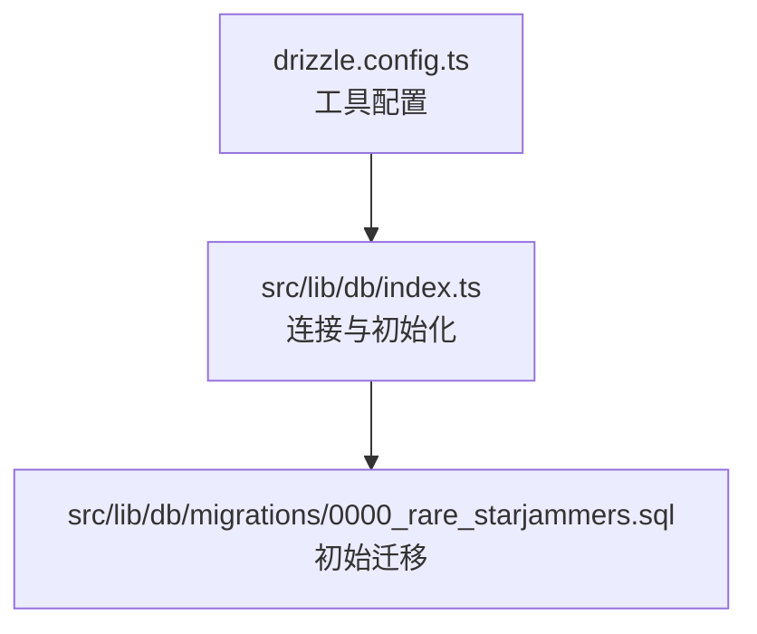
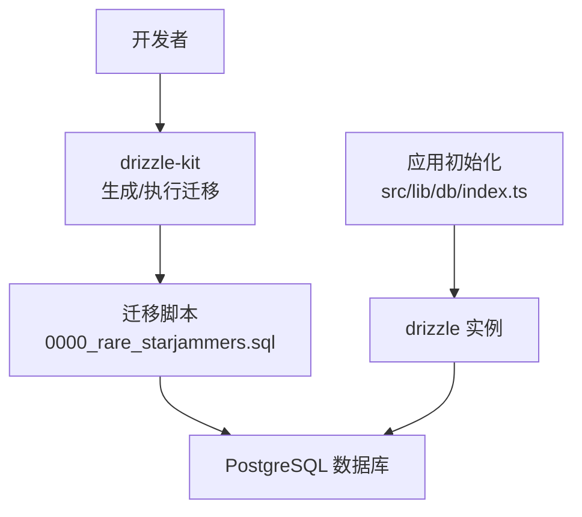
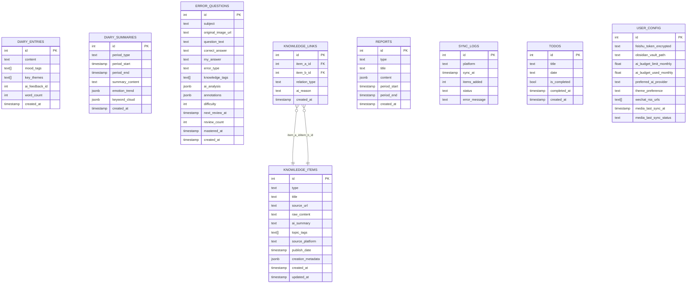
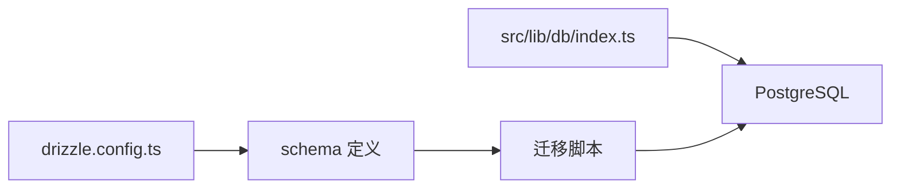

# 数据库设计

<cite>
**本文引用的文件**
- [drizzle.config.ts](file://drizzle.config.ts)
- [src/lib/db/index.ts](file://src/lib/db/index.ts)
- [src/lib/db/migrations/0000_rare_starjammers.sql](file://src/lib/db/migrations/0000_rare_starjammers.sql)
</cite>

## 目录
1. [简介](#简介)
2. [项目结构](#项目结构)
3. [核心组件](#核心组件)
4. [架构总览](#架构总览)
5. [详细组件分析](#详细组件分析)
6. [依赖分析](#依赖分析)
7. [性能考虑](#性能考虑)
8. [故障排查指南](#故障排查指南)
9. [结论](#结论)
10. [附录](#附录)

## 简介
本文件面向 life-os 的数据库设计与实现，聚焦于 Drizzle ORM 的配置与使用、数据库模式（Schema）与表结构、数据模型设计原则（主键、外键、唯一与检查约束）、索引与查询优化策略、迁移管理流程（版本控制、回滚与生产部署），以及数据完整性与并发控制的实现要点。内容基于仓库中现有的 Drizzle 配置、数据库连接封装与初始迁移脚本进行整理与说明。

## 项目结构
数据库相关的核心位置集中在以下路径：
- Drizzle 工具配置：drizzle.config.ts
- 数据库连接与 Drizzle 初始化：src/lib/db/index.ts
- 初始迁移脚本：src/lib/db/migrations/0000_rare_starjammers.sql

下图展示数据库相关文件在项目中的组织关系：

图表来源
- [drizzle.config.ts:1-14](file://drizzle.config.ts#L1-L14)
- [src/lib/db/index.ts:1-11](file://src/lib/db/index.ts#L1-L11)
- [src/lib/db/migrations/0000_rare_starjammers.sql:1-106](file://src/lib/db/migrations/0000_rare_starjammers.sql#L1-L106)

章节来源
- [drizzle.config.ts:1-14](file://drizzle.config.ts#L1-L14)
- [src/lib/db/index.ts:1-11](file://src/lib/db/index.ts#L1-L11)
- [src/lib/db/migrations/0000_rare_starjammers.sql:1-106](file://src/lib/db/migrations/0000_rare_starjammers.sql#L1-L106)

## 核心组件
- Drizzle 工具配置（drizzle.config.ts）
  - 指定 schema 文件路径、输出迁移目录、方言为 PostgreSQL，并从环境变量读取数据库连接地址。
- 数据库连接与 Drizzle 实例（src/lib/db/index.ts）
  - 使用 postgres.js 驱动建立连接，将 schema 注入到 drizzle 实例，导出统一的 db 句柄供应用使用。
- 初始迁移脚本（0000_rare_starjammers.sql）
  - 定义多个业务表（日记条目、日记摘要、错题、知识项、知识链接、报告、同步日志、待办、用户配置等），并声明主键、默认值、时间戳、JSON/JSONB 字段、数组字段与外键约束。

章节来源
- [drizzle.config.ts:6-13](file://drizzle.config.ts#L6-L13)
- [src/lib/db/index.ts:1-11](file://src/lib/db/index.ts#L1-L11)
- [src/lib/db/migrations/0000_rare_starjammers.sql:1-106](file://src/lib/db/migrations/0000_rare_starjammers.sql#L1-L106)

## 架构总览
Drizzle 在本项目中的运行链路如下：
- 开发者通过 drizzle.config.ts 配置 schema 与迁移输出目录；
- 应用启动时，src/lib/db/index.ts 建立数据库连接并创建 drizzle 实例；
- 迁移脚本在数据库侧创建/变更表结构，确保 schema 与应用一致；
- 应用层通过 db 句柄执行类型安全的查询与写入。

图表来源
- [drizzle.config.ts:6-13](file://drizzle.config.ts#L6-L13)
- [src/lib/db/index.ts:1-11](file://src/lib/db/index.ts#L1-L11)
- [src/lib/db/migrations/0000_rare_starjammers.sql:1-106](file://src/lib/db/migrations/0000_rare_starjammers.sql#L1-L106)

## 详细组件分析

### Drizzle 工具配置（drizzle.config.ts）
- 功能要点
  - 从 .env.local 加载环境变量；
  - 指定 schema 路径为 src/lib/db/schema.ts；
  - 指定迁移输出目录为 src/lib/db/migrations；
  - 方言为 PostgreSQL；
  - 通过 DATABASE_URL 提供连接信息。
- 使用建议
  - 确保 .env.local 中存在 DATABASE_URL；
  - schema 文件需与实际定义保持一致，避免迁移生成不匹配。

章节来源
- [drizzle.config.ts:1-14](file://drizzle.config.ts#L1-L14)

### 数据库连接与 Drizzle 初始化（src/lib/db/index.ts）
- 功能要点
  - 从环境变量读取 DATABASE_URL；
  - 使用 postgres.js 驱动创建客户端；
  - 将 schema 注入 drizzle 实例，导出 db；
  - 备注提示：生产环境可切换为 @neondatabase/serverless。
- 注意事项
  - 确保 DATABASE_URL 正确指向目标数据库；
  - 如需连接池或超时设置，可在创建 postgres 客户端时传入相应参数（当前文件未显式配置）。

章节来源
- [src/lib/db/index.ts:1-11](file://src/lib/db/index.ts#L1-L11)

### 初始迁移脚本（0000_rare_starjammers.sql）
- 表与字段概览
  - 日记条目：自增主键、文本内容、情绪标签数组、主题标签数组、字数统计、创建时间等。
  - 日记摘要：周期类型、周期起止时间、摘要内容、情感趋势、关键词云、创建时间等。
  - 错题：题目、原图、问题文本、正确答案、我的答案、错误类型、知识标签数组、AI 分析、标注、难度、复习相关时间与计数、掌握时间、创建时间等。
  - 知识项：类型、标题、来源链接、原始内容、AI 总结、主题标签数组、来源平台、发布日期、创建元数据 JSONB、创建与更新时间等。
  - 知识链接：双向关联知识项，记录关系类型与 AI 原因，创建时间等。
  - 报告：类型、标题、内容 JSONB、周期起止时间、创建时间等。
  - 同步日志：平台、同步时间、新增数量、状态、错误信息等。
  - 待办：标题、日期字符串、完成状态、完成时间、创建时间等。
  - 用户配置：飞书加密令牌、Obsidian 仓库路径、月度预算限额与已用、首选 AI 提供方、主题偏好、微信 RSS 数组、媒体上次同步时间与状态等。
- 约束与类型
  - 主键：多表使用 serial 自增主键；
  - 默认值：大量字段设置默认值（如时间戳默认 now()、布尔默认 false、数值默认 0 或 50）；
  - JSON/JSONB：用于存储结构化数据（如情感趋势、关键词云、创建元数据、报告内容）；
  - 数组：情绪标签、主题标签、知识标签、RSS URL 等采用数组类型；
  - 外键：知识链接表对知识项表建立双向外键约束。
- 设计原则
  - 类型安全：JSONB 字段用于灵活扩展，同时在应用层通过 Drizzle 的类型系统进行约束；
  - 扩展性：数组与 JSONB 字段便于未来新增维度；
  - 关系清晰：通过外键明确知识链接的双向关系。

章节来源
- [src/lib/db/migrations/0000_rare_starjammers.sql:1-106](file://src/lib/db/migrations/0000_rare_starjammers.sql#L1-L106)

### 数据模型与 ER 关系
下图展示核心实体及其关系（基于迁移脚本中的表与外键定义）：

图表来源
- [src/lib/db/migrations/0000_rare_starjammers.sql:1-106](file://src/lib/db/migrations/0000_rare_starjammers.sql#L1-L106)

## 依赖分析
- 组件耦合
  - drizzle.config.ts 与迁移脚本之间通过 schema 路径与方言约定耦合；
  - src/lib/db/index.ts 与迁移脚本通过表结构与约束耦合；
  - 应用层通过 db 句柄访问数据库，形成对底层驱动与 schema 的间接依赖。
- 外部依赖
  - drizzle-orm 与 postgres.js 驱动；
  - drizzle-kit 用于迁移工具链；
  - 环境变量 .env.local 提供数据库连接信息。

图表来源
- [drizzle.config.ts:6-13](file://drizzle.config.ts#L6-L13)
- [src/lib/db/index.ts:1-11](file://src/lib/db/index.ts#L1-L11)
- [src/lib/db/migrations/0000_rare_starjammers.sql:1-106](file://src/lib/db/migrations/0000_rare_starjammers.sql#L1-L106)

章节来源
- [drizzle.config.ts:6-13](file://drizzle.config.ts#L6-L13)
- [src/lib/db/index.ts:1-11](file://src/lib/db/index.ts#L1-L11)
- [src/lib/db/migrations/0000_rare_starjammers.sql:1-106](file://src/lib/db/migrations/0000_rare_starjammers.sql#L1-L106)

## 性能考虑
- 查询构建与类型安全
  - 使用 Drizzle 的类型安全查询接口，减少运行期错误，提升 SQL 生成质量；
  - 对高频查询字段（如时间范围、标签数组、状态）建议建立合适索引。
- 索引策略建议
  - 复合索引：按查询条件组合建立（例如日记条目的创建时间+标签数组过滤）；
  - 覆盖索引：针对热点查询列组合建立索引以避免回表；
  - 执行计划：结合数据库 EXPLAIN/EXPLAIN ANALYZE 分析慢查询，定位缺失索引或过滤条件不当。
- 连接与并发
  - 当前连接封装未显式配置连接池参数；建议根据并发量与 QPS 设置最大连接数、空闲超时与最大生命周期；
  - 对长事务与高并发场景，注意锁粒度与隔离级别选择，避免死锁与长时间阻塞。

## 故障排查指南
- 迁移失败
  - 检查 DATABASE_URL 是否正确加载（.env.local）；
  - 确认 schema 路径与实际定义一致，避免迁移生成不匹配；
  - 查看迁移脚本中的约束冲突（如外键引用的目标表/列不存在）。
- 连接异常
  - 确认数据库可达与凭据有效；
  - 若为生产环境，确认是否切换至合适的驱动（如 @neondatabase/serverless）。
- 查询性能问题
  - 使用 EXPLAIN 分析慢查询；
  - 为常用过滤与排序字段添加索引；
  - 避免在 JSONB/数组字段上进行全表扫描式查询，必要时拆分或物化关键字段。

## 结论
本项目基于 Drizzle ORM 与 PostgreSQL，采用迁移驱动的 Schema 管理方式，实现了类型安全与可演进的数据层。现有设计支持灵活扩展（JSONB/数组字段）与清晰的关系建模（外键）。后续可在连接池、索引策略与查询优化方面进一步完善，以满足更高并发与更复杂查询场景的需求。

## 附录

### 迁移管理流程（基于现有配置）
- 版本控制
  - 迁移脚本位于 src/lib/db/migrations，文件名带序号，天然具备顺序与版本含义；
- 生成与执行
  - 使用 drizzle-kit 根据 schema 生成迁移；
  - 在目标环境执行迁移脚本，使数据库结构与应用一致；
- 回滚策略
  - 建议在每次迁移中提供回滚语句（当前初始脚本未包含回滚）；
  - 生产环境回滚应谨慎评估影响面，优先采用“向前修复”而非破坏性回滚。
- 生产部署
  - 在部署前先在预生产验证迁移；
  - 通过 CI/CD 自动执行迁移，确保数据库与应用版本一致。

章节来源
- [drizzle.config.ts:6-13](file://drizzle.config.ts#L6-L13)
- [src/lib/db/migrations/0000_rare_starjammers.sql:1-106](file://src/lib/db/migrations/0000_rare_starjammers.sql#L1-L106)