# 本地存储架构

<cite>
**本文引用的文件**
- [src/lib/db/index.ts](file://src/lib/db/index.ts)
- [src/lib/db/schema.ts](file://src/lib/db/schema.ts)
- [src/lib/storage/diary-store.ts](file://src/lib/storage/diary-store.ts)
- [src/lib/storage/knowledge-store.ts](file://src/lib/storage/knowledge-store.ts)
- [src/lib/storage/mindlog-store.ts](file://src/lib/storage/mindlog-store.ts)
- [src/lib/storage/todo-store.ts](file://src/lib/storage/todo-store.ts)
- [src/lib/storage/profile-store.ts](file://src/lib/storage/profile-store.ts)
- [src/lib/storage/stats.ts](file://src/lib/storage/stats.ts)
- [src/lib/storage/media-store.ts](file://src/lib/storage/media-store.ts)
- [src/lib/storage/mirror-store.ts](file://src/lib/storage/mirror-store.ts)
</cite>

## 目录
1. [简介](#简介)
2. [项目结构](#项目结构)
3. [核心组件](#核心组件)
4. [架构总览](#架构总览)
5. [详细组件分析](#详细组件分析)
6. [依赖分析](#依赖分析)
7. [性能考虑](#性能考虑)
8. [故障排查指南](#故障排查指南)
9. [结论](#结论)
10. [附录](#附录)

## 简介
本文件系统性梳理 life-os 的本地存储架构，重点覆盖以下方面：
- IndexedDB 设计与使用：对象存储、事务、索引、版本升级与迁移
- 本地数据模型：日记条目、知识库、用户设置、待办、镜像对话、媒体配置与同步日志、心智日志等
- 离线优先策略：缓存、冲突解决、同步队列管理思路
- CRUD 实现与最佳实践：批量插入、更新、删除
- 序列化与反序列化、错误处理与恢复
- 性能优化：批量操作、内存管理、存储空间控制

## 项目结构
本地存储主要由两类模块构成：
- 服务端/云端数据库：PostgreSQL + Drizzle ORM（用于生产环境或服务端）
- 浏览器端本地存储：IndexedDB（通过 idb 封装）

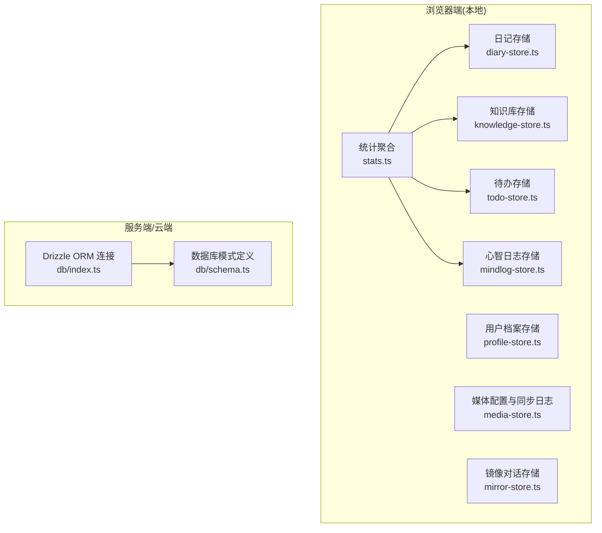

图表来源
- [src/lib/storage/diary-store.ts:1-237](file://src/lib/storage/diary-store.ts#L1-L237)
- [src/lib/storage/knowledge-store.ts:1-611](file://src/lib/storage/knowledge-store.ts#L1-L611)
- [src/lib/storage/todo-store.ts:1-184](file://src/lib/storage/todo-store.ts#L1-L184)
- [src/lib/storage/mindlog-store.ts:1-95](file://src/lib/storage/mindlog-store.ts#L1-L95)
- [src/lib/storage/profile-store.ts:1-69](file://src/lib/storage/profile-store.ts#L1-L69)
- [src/lib/storage/media-store.ts:1-140](file://src/lib/storage/media-store.ts#L1-L140)
- [src/lib/storage/mirror-store.ts:1-155](file://src/lib/storage/mirror-store.ts#L1-L155)
- [src/lib/storage/stats.ts:1-77](file://src/lib/storage/stats.ts#L1-L77)
- [src/lib/db/index.ts:1-11](file://src/lib/db/index.ts#L1-L11)
- [src/lib/db/schema.ts:1-118](file://src/lib/db/schema.ts#L1-L118)

章节来源
- [src/lib/db/index.ts:1-11](file://src/lib/db/index.ts#L1-L11)
- [src/lib/db/schema.ts:1-118](file://src/lib/db/schema.ts#L1-L118)

## 核心组件
- 数据库连接与模式
  - Drizzle ORM 连接 PostgreSQL，用于服务端/云端数据持久化与查询
  - 模式定义涵盖用户配置、错题本、知识库、日记、待办、同步日志、报告等
- IndexedDB 存储模块
  - 日记：条目与周/月摘要
  - 知识库：条目、链接、主题分类、标签统计与合并、来源集统计
  - 待办：按日期与完成状态查询
  - 心智日志：按周期与类型去重写入
  - 用户档案：单键值存储
  - 媒体：平台配置与同步日志
  - 镜像对话：会话与消息，支持按会话检索
  - 统计：跨库计数与聚合

章节来源
- [src/lib/db/index.ts:1-11](file://src/lib/db/index.ts#L1-L11)
- [src/lib/db/schema.ts:1-118](file://src/lib/db/schema.ts#L1-L118)
- [src/lib/storage/diary-store.ts:1-237](file://src/lib/storage/diary-store.ts#L1-L237)
- [src/lib/storage/knowledge-store.ts:1-611](file://src/lib/storage/knowledge-store.ts#L1-L611)
- [src/lib/storage/todo-store.ts:1-184](file://src/lib/storage/todo-store.ts#L1-L184)
- [src/lib/storage/mindlog-store.ts:1-95](file://src/lib/storage/mindlog-store.ts#L1-L95)
- [src/lib/storage/profile-store.ts:1-69](file://src/lib/storage/profile-store.ts#L1-L69)
- [src/lib/storage/media-store.ts:1-140](file://src/lib/storage/media-store.ts#L1-L140)
- [src/lib/storage/mirror-store.ts:1-155](file://src/lib/storage/mirror-store.ts#L1-L155)
- [src/lib/storage/stats.ts:1-77](file://src/lib/storage/stats.ts#L1-L77)

## 架构总览
本地存储采用“多库分治”策略：
- 每个功能域独立一个 IndexedDB 数据库，避免耦合与锁竞争
- 通过统一的初始化函数与版本号管理升级流程
- 服务端使用 Drizzle ORM 进行集中式数据管理，前端通过 API 与后端交互

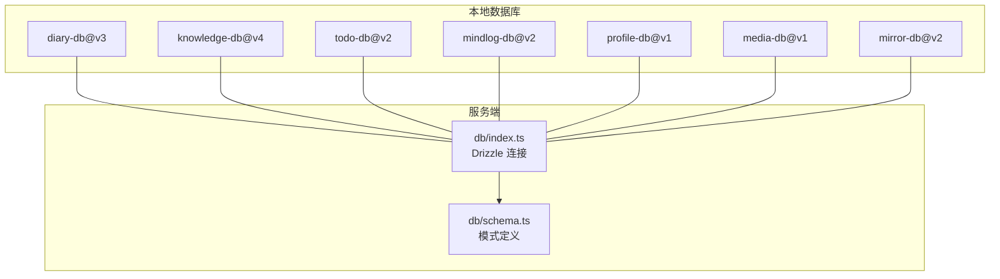

图表来源
- [src/lib/storage/diary-store.ts:41-82](file://src/lib/storage/diary-store.ts#L41-L82)
- [src/lib/storage/knowledge-store.ts:101-172](file://src/lib/storage/knowledge-store.ts#L101-L172)
- [src/lib/storage/todo-store.ts:22-44](file://src/lib/storage/todo-store.ts#L22-L44)
- [src/lib/storage/mindlog-store.ts:23-46](file://src/lib/storage/mindlog-store.ts#L23-L46)
- [src/lib/storage/profile-store.ts:15-30](file://src/lib/storage/profile-store.ts#L15-L30)
- [src/lib/storage/media-store.ts:28-56](file://src/lib/storage/media-store.ts#L28-L56)
- [src/lib/storage/mirror-store.ts:23-67](file://src/lib/storage/mirror-store.ts#L23-L67)
- [src/lib/db/index.ts:1-11](file://src/lib/db/index.ts#L1-L11)
- [src/lib/db/schema.ts:1-118](file://src/lib/db/schema.ts#L1-L118)

## 详细组件分析

### 日记存储（diary-store）
- 数据模型
  - 条目：内容、情绪标签、主题标签、字数、图片、时间戳
  - 摘要：周期类型、起止时间、情感趋势、关键词云
- 对象存储与索引
  - entries：主键自增，索引 by-created、by-mood（多值）
  - summaries：主键自增，索引 by-period、by-start
- 版本升级
  - v2→v3：为既有条目补充可选字段（无需额外迁移）
- 关键能力
  - 新增/查询/更新/删除条目
  - 列表与分页、周内/近期过滤
  - 统计：周数、总数、最新情绪
  - 新增/查询/列出摘要

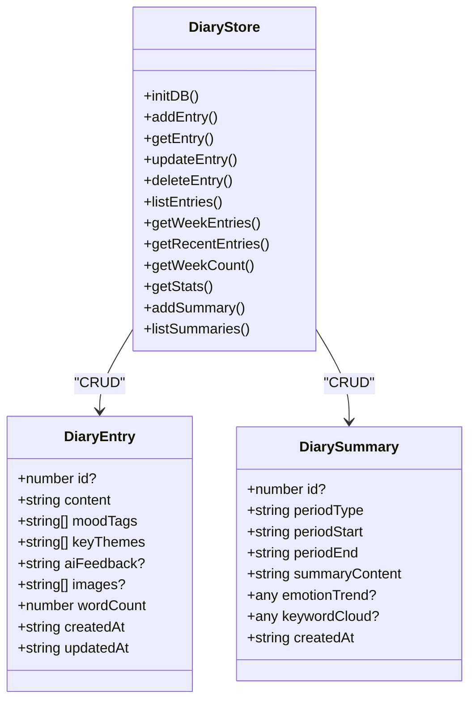

图表来源
- [src/lib/storage/diary-store.ts:5-26](file://src/lib/storage/diary-store.ts#L5-L26)
- [src/lib/storage/diary-store.ts:97-236](file://src/lib/storage/diary-store.ts#L97-L236)

章节来源
- [src/lib/storage/diary-store.ts:1-237](file://src/lib/storage/diary-store.ts#L1-L237)

### 知识库存储（knowledge-store）
- 数据模型
  - 条目：类型、标题、来源、原始内容、AI摘要、主题标签、外部ID、来源信息、一级主题、时间戳
  - 链接：双向关联、关系类型、AI理由
  - 主题分类：内置预设、名称唯一、子主题
- 对象存储与索引
  - items：by-type、by-tags（多值）、by-created、by-external（非唯一）、by-category、by-source-collection
  - links：by-itemA、by-itemB
  - topic-categories：by-name（唯一）
- 版本升级
  - v3：新增 by-external 索引；v4：新增一级主题与来源集索引，并初始化内置分类
- 关键能力
  - 条目：新增、按外部ID去重更新、删除（级联删除关联链接）
  - 查询：按类型/标签/来源集、模糊搜索标题与内容
  - 图谱：节点与边聚合
  - 标签：统计、合并、移除
  - 层级：父子关系设置与清理
  - 分类：增删改查

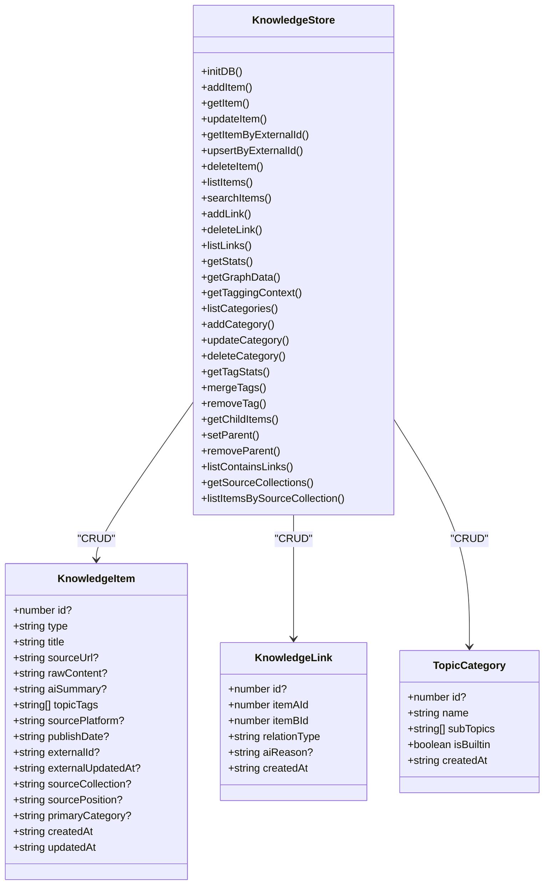

图表来源
- [src/lib/storage/knowledge-store.ts:5-97](file://src/lib/storage/knowledge-store.ts#L5-L97)
- [src/lib/storage/knowledge-store.ts:106-611](file://src/lib/storage/knowledge-store.ts#L106-L611)

章节来源
- [src/lib/storage/knowledge-store.ts:1-611](file://src/lib/storage/knowledge-store.ts#L1-L611)

### 待办存储（todo-store）
- 数据模型
  - 待办：标题、日期（YYYY-MM-DD）、完成状态、完成时间、创建时间
- 对象存储与索引
  - todos：by-date、by-completed
- 关键能力
  - 新增/查询/更新/删除
  - 切换完成状态（含完成时间回填）
  - 按日期/本周查询、统计今日完成情况、全量列表

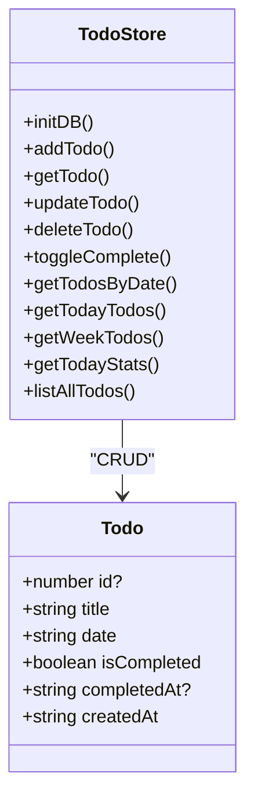

图表来源
- [src/lib/storage/todo-store.ts:5-18](file://src/lib/storage/todo-store.ts#L5-L18)
- [src/lib/storage/todo-store.ts:27-184](file://src/lib/storage/todo-store.ts#L27-L184)

章节来源
- [src/lib/storage/todo-store.ts:1-184](file://src/lib/storage/todo-store.ts#L1-L184)

### 心智日志存储（mindlog-store）
- 数据模型
  - 条目：类型（日/周/月）、周期起止、关键词、内容、仪表盘摘要、来源数据、创建时间
- 对象存储与索引
  - entries：by-type、by-period（复合唯一索引[type, periodStart]）、by-created
- 关键能力
  - 新增/查询/按类型/周期获取、UPSERT（按周期唯一）

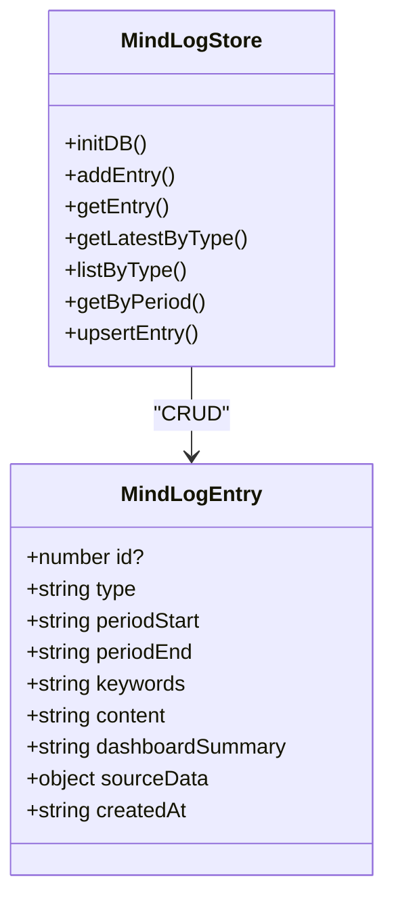

图表来源
- [src/lib/storage/mindlog-store.ts:5-19](file://src/lib/storage/mindlog-store.ts#L5-L19)
- [src/lib/storage/mindlog-store.ts:28-95](file://src/lib/storage/mindlog-store.ts#L28-L95)

章节来源
- [src/lib/storage/mindlog-store.ts:1-95](file://src/lib/storage/mindlog-store.ts#L1-L95)

### 用户档案存储（profile-store）
- 数据模型
  - 用户档案：固定主键 'default'，昵称、签名、主题模式、更新时间
- 对象存储与索引
  - profile：主键为 'default'
- 关键能力
  - 获取/保存（默认值兜底与异常保护）

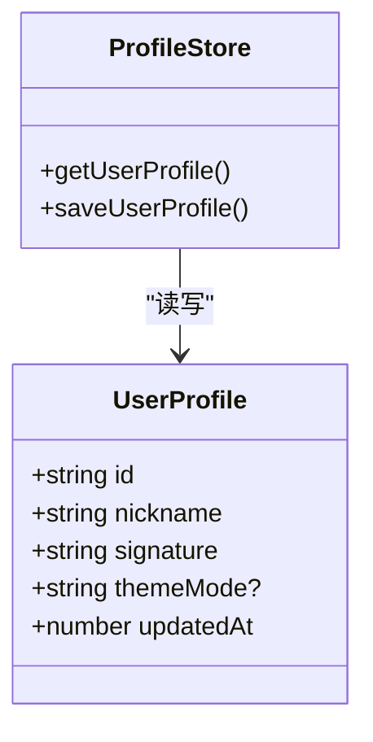

图表来源
- [src/lib/storage/profile-store.ts:5-11](file://src/lib/storage/profile-store.ts#L5-L11)
- [src/lib/storage/profile-store.ts:19-69](file://src/lib/storage/profile-store.ts#L19-L69)

章节来源
- [src/lib/storage/profile-store.ts:1-69](file://src/lib/storage/profile-store.ts#L1-L69)

### 媒体配置与同步日志（media-store）
- 数据模型
  - 平台配置：平台、RSS、昵称、最近同步时间与状态、创建时间
  - 同步日志：配置ID、状态、数量、错误信息、时间
- 对象存储与索引
  - configs：by-platform
  - sync_logs：by-config、by-sync-at
- 关键能力
  - 配置增删改查
  - 同步日志新增、按配置/全局查询、最近同步时间获取

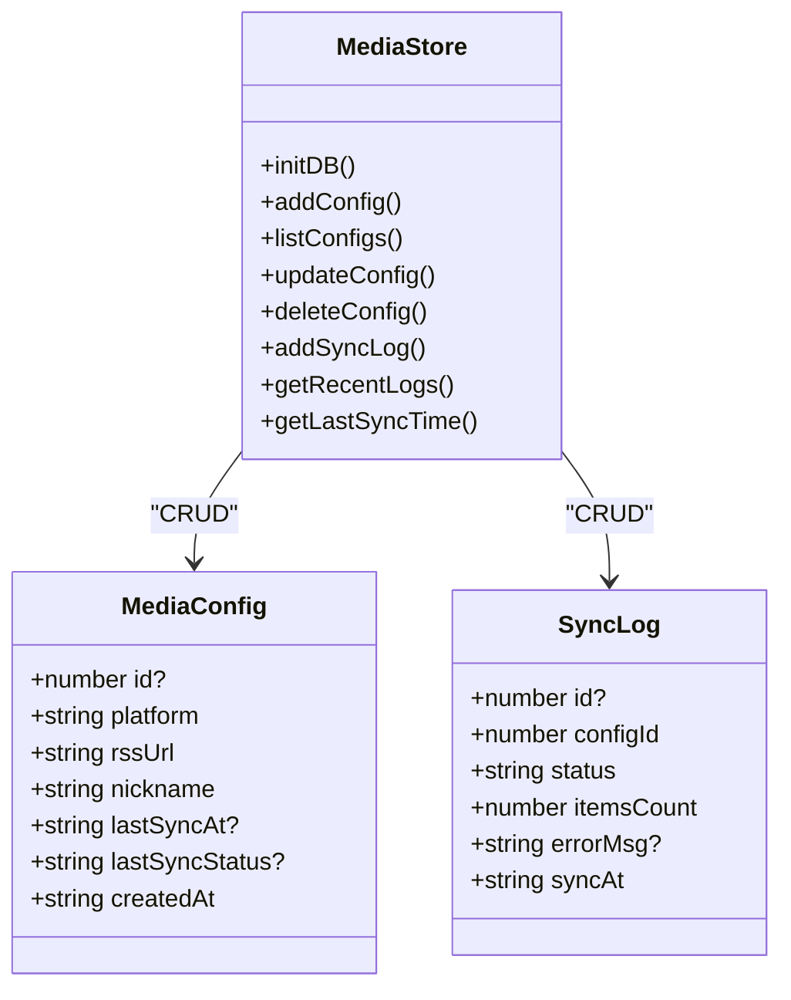

图表来源
- [src/lib/storage/media-store.ts:7-24](file://src/lib/storage/media-store.ts#L7-L24)
- [src/lib/storage/media-store.ts:33-140](file://src/lib/storage/media-store.ts#L33-L140)

章节来源
- [src/lib/storage/media-store.ts:1-140](file://src/lib/storage/media-store.ts#L1-L140)

### 镜像对话存储（mirror-store）
- 数据模型
  - 会话：标题、创建/更新时间
  - 消息：角色、内容、附件、创建时间、所属会话
- 对象存储与索引
  - sessions：by-updated
  - messages：byCreatedAt、by-session
- 版本升级
  - v1→v2：新增 sessions 表与 messages 的 sessionId 索引
- 关键能力
  - 会话：创建、列表、更新、删除（级联删除消息）
  - 消息：新增（自动更新会话标题与时间）、按会话列表、清空、计数

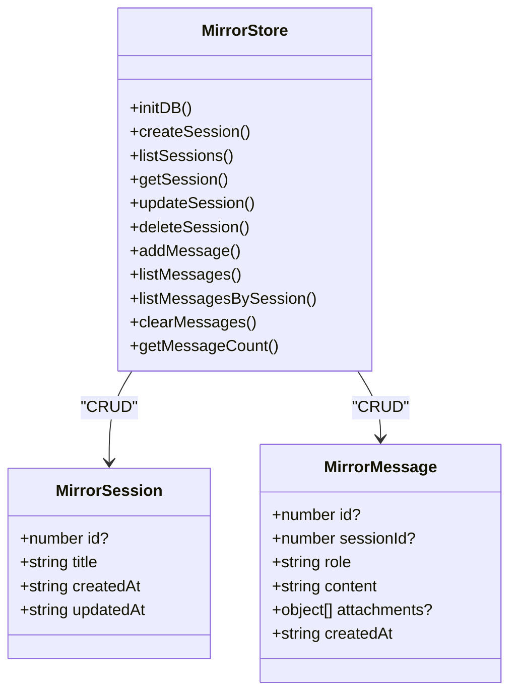

图表来源
- [src/lib/storage/mirror-store.ts:5-19](file://src/lib/storage/mirror-store.ts#L5-L19)
- [src/lib/storage/mirror-store.ts:28-155](file://src/lib/storage/mirror-store.ts#L28-L155)

章节来源
- [src/lib/storage/mirror-store.ts:1-155](file://src/lib/storage/mirror-store.ts#L1-L155)

### 统计聚合（stats-store）
- 能力
  - 聚合日记条目数、知识库条目数、待办完成/总数、心智日志条目数
  - 使用并发查询提升性能

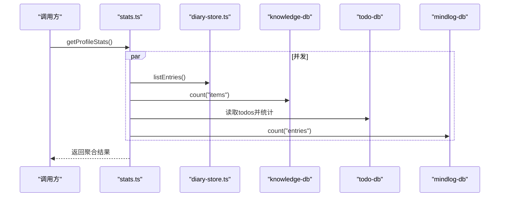

图表来源
- [src/lib/storage/stats.ts:60-77](file://src/lib/storage/stats.ts#L60-L77)
- [src/lib/storage/diary-store.ts:144-155](file://src/lib/storage/diary-store.ts#L144-L155)
- [src/lib/storage/stats.ts:16-56](file://src/lib/storage/stats.ts#L16-L56)

章节来源
- [src/lib/storage/stats.ts:1-77](file://src/lib/storage/stats.ts#L1-L77)

## 依赖分析
- 组件内聚与耦合
  - 各存储模块高度内聚，职责单一，彼此间无直接依赖
  - 统计模块通过并发访问多个数据库进行汇总
- 外部依赖
  - idb：IndexedDB 封装，提供对象存储、事务、索引与版本升级
  - Drizzle ORM：服务端数据库连接与模式定义
- 潜在循环依赖
  - 无直接循环；统计模块对各存储模块仅做只读访问

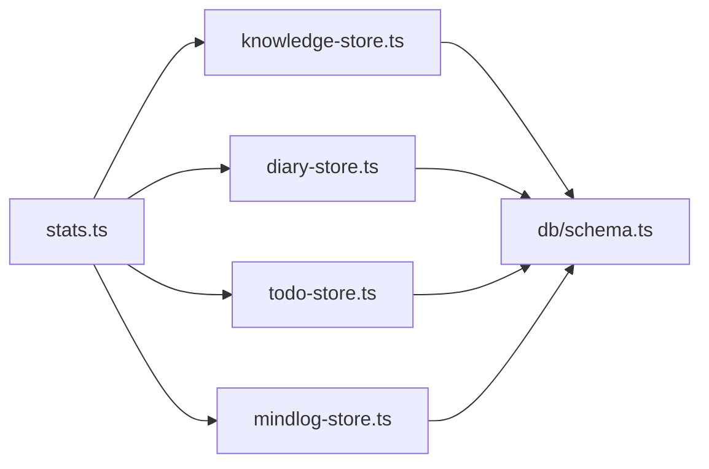

图表来源
- [src/lib/storage/stats.ts:1-77](file://src/lib/storage/stats.ts#L1-L77)
- [src/lib/storage/diary-store.ts:1-237](file://src/lib/storage/diary-store.ts#L1-L237)
- [src/lib/storage/knowledge-store.ts:1-611](file://src/lib/storage/knowledge-store.ts#L1-L611)
- [src/lib/storage/todo-store.ts:1-184](file://src/lib/storage/todo-store.ts#L1-L184)
- [src/lib/storage/mindlog-store.ts:1-95](file://src/lib/storage/mindlog-store.ts#L1-L95)
- [src/lib/db/schema.ts:1-118](file://src/lib/db/schema.ts#L1-L118)

章节来源
- [src/lib/storage/stats.ts:1-77](file://src/lib/storage/stats.ts#L1-L77)

## 性能考虑
- 批量操作
  - 使用事务一次性提交多个写操作，减少锁竞争与 I/O 次数
  - 示例：知识库删除条目时，先读取再批量删除相关链接
- 内存管理
  - 列表查询后在内存中排序与分页，建议限制返回数量或使用游标/分段加载
  - 统计模块并发查询多库，注意避免同时打开过多数据库实例
- 存储空间控制
  - 通过索引与查询条件限制扫描范围
  - 提供清理接口（如镜像消息清空、按时间窗口裁剪）
- 索引与查询
  - 为高频查询字段建立合适索引（多值索引、复合索引、唯一索引）
  - 使用 getAllFromIndex 与范围查询替代全表扫描
- 版本升级
  - 在 upgrade 中进行最小化变更，避免不必要的重建
  - 对于可选字段，采用向后兼容策略（如日记 v2→v3 的补丁）

[本节为通用指导，不直接分析具体文件]

## 故障排查指南
- 初始化失败
  - 检查数据库名称与版本号是否正确
  - 确认 upgrade 回调中对象存储与索引创建逻辑
- 升级阻塞
  - 监听 blocked 回调，提示其他标签页占用导致升级阻塞
- 事务异常
  - 确保事务对象存储与索引访问在同一事务上下文中
  - 注意 readwrite 事务的 done 等待
- 查询性能差
  - 检查是否使用了正确的索引
  - 避免在大结果集上进行二次过滤
- 数据不一致
  - 对外键关系（如知识库链接）采用事务保证一致性
  - 对唯一索引冲突（如心智日志按周期 UPSERT）做好分支处理

章节来源
- [src/lib/storage/diary-store.ts:76-82](file://src/lib/storage/diary-store.ts#L76-L82)
- [src/lib/storage/knowledge-store.ts:252-269](file://src/lib/storage/knowledge-store.ts#L252-L269)
- [src/lib/storage/mindlog-store.ts:84-94](file://src/lib/storage/mindlog-store.ts#L84-L94)
- [src/lib/storage/mirror-store.ts:97-107](file://src/lib/storage/mirror-store.ts#L97-L107)

## 结论
life-os 的本地存储以 IndexedDB 为核心，围绕功能域划分多库结构，配合完善的索引与事务机制，实现了高可用、可扩展的离线优先方案。服务端通过 Drizzle ORM 提供统一的数据模型与查询能力。整体设计强调：
- 明确的职责边界与版本演进策略
- 高效的查询路径与索引设计
- 事务一致性与错误恢复
- 可观测的统计与聚合能力

[本节为总结性内容，不直接分析具体文件]

## 附录

### 离线优先的数据策略
- 缓存策略
  - 本地优先：读取优先走 IndexedDB，必要时回退到服务端
  - 写入优先：本地立即写入，异步上报服务端
- 冲突解决
  - 外部导入去重：基于 externalId 与 externalUpdatedAt 的 upsert
  - 唯一约束：使用复合索引（如 mindlog 的 [type, periodStart]）避免重复
- 同步队列管理
  - 建议引入队列任务（待实现）：将待上传/更新的任务入队，按优先级与幂等策略重试
  - 记录同步日志（媒体模块已具备）：便于追踪与重放

[本节为概念性说明，不直接分析具体文件]

### CRUD 最佳实践
- 批量插入
  - 使用事务包裹多次 add/put，减少 I/O
  - 控制单次事务大小，避免长时间持有锁
- 更新
  - 仅更新变化字段，避免全量覆盖
  - 更新时间戳与派生字段（如字数）需同步更新
- 删除
  - 对存在外键关系的条目，先删除子项再删除父项
  - 使用事务确保一致性

[本节为通用指导，不直接分析具体文件]

### 序列化与反序列化
- 当前实现
  - 使用 idb 默认序列化，JSON 兼容类型（字符串、数字、布尔、数组、对象）
  - 时间字段统一为 ISO 字符串，便于排序与比较
- 建议
  - 对复杂对象（如附件、嵌套结构）保持扁平化或规范化，降低序列化成本
  - 对超长字段（如 rawContent）考虑分片或压缩策略（待实现）

[本节为通用指导，不直接分析具体文件]