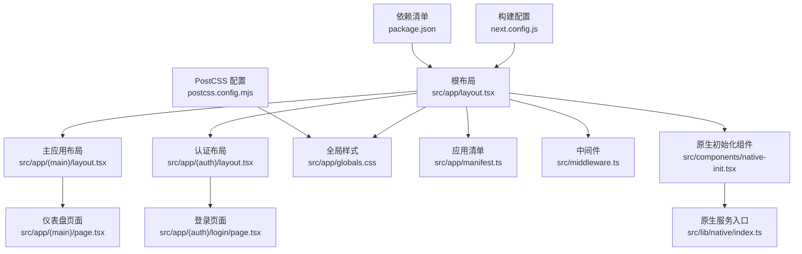
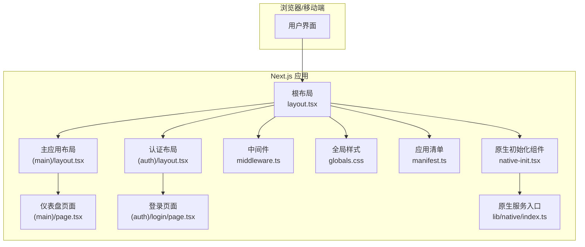
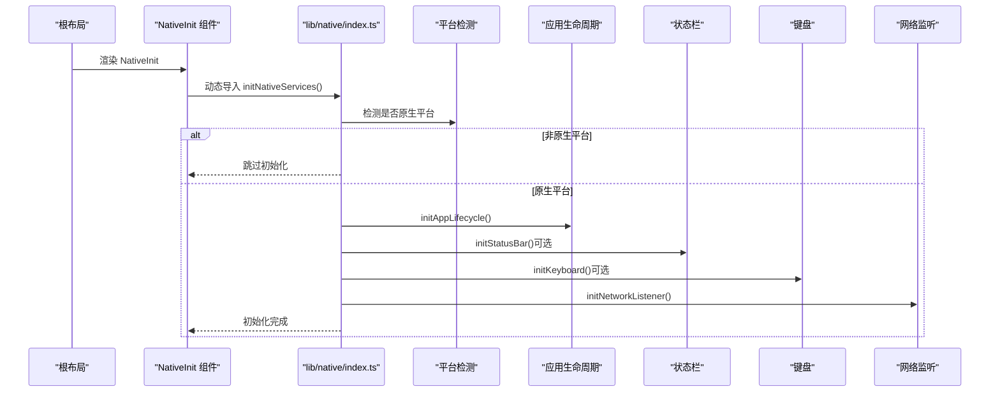
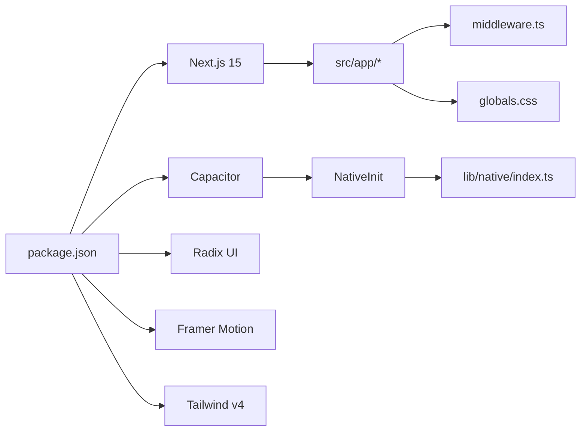

# 前端架构设计

<cite>
**本文引用的文件**
- [src/app/layout.tsx](file://src/app/layout.tsx)
- [src/app/(main)/layout.tsx](file://src/app/(main)/layout.tsx)
- [src/app/(auth)/layout.tsx](file://src/app/(auth)/layout.tsx)
- [src/app/(main)/page.tsx](file://src/app/(main)/page.tsx)
- [src/app/(auth)/login/page.tsx](file://src/app/(auth)/login/page.tsx)
- [src/components/native-init.tsx](file://src/components/native-init.tsx)
- [src/lib/native/index.ts](file://src/lib/native/index.ts)
- [src/app/globals.css](file://src/app/globals.css)
- [src/app/manifest.ts](file://src/app/manifest.ts)
- [src/middleware.ts](file://src/middleware.ts)
- [next.config.js](file://next.config.js)
- [package.json](file://package.json)
- [postcss.config.mjs](file://postcss.config.mjs)
</cite>

## 目录
1. [引言](#引言)
2. [项目结构](#项目结构)
3. [核心组件](#核心组件)
4. [架构总览](#架构总览)
5. [详细组件分析](#详细组件分析)
6. [依赖关系分析](#依赖关系分析)
7. [性能考虑](#性能考虑)
8. [故障排查指南](#故障排查指南)
9. [结论](#结论)
10. [附录](#附录)

## 引言
本文件面向 life-os 前端，系统性梳理基于 Next.js 15 App Router 的架构设计，覆盖路由系统、布局与页面组织、状态管理策略、组件层次、响应式与主题系统、移动端适配、NativeInit 原生初始化流程，以及性能优化与代码分割实践。文档以“渐进加深”的方式呈现，既便于非技术读者理解整体思路，也为开发者提供可操作的实现参考。

## 项目结构
- 路由采用 App Router 的文件系统路由与分组目录组织：
  - 根布局与全局样式：src/app/layout.tsx、src/app/globals.css、src/app/manifest.ts
  - 认证域：src/app/(auth)/...，包含登录页与隐私政策等
  - 主应用域：src/app/(main)/...，包含仪表盘、日记、知识库、镜像洞见、报告、设置、待办等页面
  - API 路由：src/app/api/...，集中处理认证、AI、知识库、飞书集成、媒体解析等后端接口
  - 中间件：src/middleware.ts，统一会话校验与公开路径放行
- 构建与打包：
  - next.config.js：生产环境启用 PWA 插件，开发环境禁用；服务端外部化原生模块
  - postcss.config.mjs：使用 Tailwind v4 PostCSS 插件
  - package.json：声明 Next.js 15、Capacitor 移动端桥接、Radix UI、Framer Motion、Recharts 等依赖

图表来源
- [src/app/layout.tsx:1-32](file://src/app/layout.tsx#L1-L32)
- [src/app/(main)/layout.tsx:1-32](file://src/app/(main)/layout.tsx#L1-L32)
- [src/app/(auth)/layout.tsx:1-8](file://src/app/(auth)/layout.tsx#L1-L8)
- [src/app/(main)/page.tsx:1-359](file://src/app/(main)/page.tsx#L1-L359)
- [src/app/(auth)/login/page.tsx:1-121](file://src/app/(auth)/login/page.tsx#L1-L121)
- [src/app/globals.css:1-155](file://src/app/globals.css#L1-L155)
- [src/app/manifest.ts:1-33](file://src/app/manifest.ts#L1-L33)
- [src/middleware.ts:1-52](file://src/middleware.ts#L1-L52)
- [src/components/native-init.tsx:1-16](file://src/components/native-init.tsx#L1-L16)
- [src/lib/native/index.ts:1-55](file://src/lib/native/index.ts#L1-L55)
- [next.config.js:1-32](file://next.config.js#L1-L32)
- [postcss.config.mjs:1-9](file://postcss.config.mjs#L1-L9)
- [package.json:1-91](file://package.json#L1-L91)

章节来源
- [src/app/layout.tsx:1-32](file://src/app/layout.tsx#L1-L32)
- [src/app/(main)/layout.tsx:1-32](file://src/app/(main)/layout.tsx#L1-L32)
- [src/app/(auth)/layout.tsx:1-8](file://src/app/(auth)/layout.tsx#L1-L8)
- [src/app/(main)/page.tsx:1-359](file://src/app/(main)/page.tsx#L1-L359)
- [src/app/(auth)/login/page.tsx:1-121](file://src/app/(auth)/login/page.tsx#L1-L121)
- [src/app/globals.css:1-155](file://src/app/globals.css#L1-L155)
- [src/app/manifest.ts:1-33](file://src/app/manifest.ts#L1-L33)
- [src/middleware.ts:1-52](file://src/middleware.ts#L1-L52)
- [next.config.js:1-32](file://next.config.js#L1-L32)
- [postcss.config.mjs:1-9](file://postcss.config.mjs#L1-L9)
- [package.json:1-91](file://package.json#L1-L91)

## 核心组件
- 根布局与元数据
  - 定义站点标题、描述、视口参数与主题色，确保移动端与 PWA 行为一致
  - 在根节点注入 NativeInit，保证原生服务在首屏渲染前完成初始化
- 主应用布局
  - 包裹错误边界、离线指示器、全局 Toast 提示、Service Worker 注册器
  - 提供渐变背景与安全区域适配，确保卡片与内容在不同设备上稳定显示
- 认证布局
  - 简洁无包裹，直接渲染子组件，适合登录页等无需全局装饰的页面
- 仪表盘页面
  - 使用客户端状态管理（useState/useEffect），结合 Framer Motion 实现流畅动画
  - 动态导入重型组件（如 MindlogGenerate），降低首屏体积
  - 通过时间主题切换 data-theme，驱动全局样式随时间段变化
- 登录页面
  - 客户端表单提交，调用 /api/auth/login，成功后跳转并刷新
- 原生初始化组件
  - 在客户端按需动态导入原生服务初始化逻辑，失败静默告警
- 原生服务入口
  - 统一导出触觉反馈、应用生命周期、通知、分享、网络监听等能力
  - 条件初始化：仅在原生平台运行时执行，Web 平台跳过

章节来源
- [src/app/layout.tsx:1-32](file://src/app/layout.tsx#L1-L32)
- [src/app/(main)/layout.tsx:1-32](file://src/app/(main)/layout.tsx#L1-L32)
- [src/app/(auth)/layout.tsx:1-8](file://src/app/(auth)/layout.tsx#L1-L8)
- [src/app/(main)/page.tsx:1-359](file://src/app/(main)/page.tsx#L1-L359)
- [src/app/(auth)/login/page.tsx:1-121](file://src/app/(auth)/login/page.tsx#L1-L121)
- [src/components/native-init.tsx:1-16](file://src/components/native-init.tsx#L1-L16)
- [src/lib/native/index.ts:1-55](file://src/lib/native/index.ts#L1-L55)

## 架构总览
Next.js 15 App Router 将路由、布局与页面解耦，配合中间件实现统一鉴权与公开路径放行。全局样式与主题系统通过 CSS 变量与 data-theme 实现时间自适应。原生能力通过 Capacitor 与自研初始化入口统一接入，支持触觉、通知、网络状态等。

图表来源
- [src/app/layout.tsx:1-32](file://src/app/layout.tsx#L1-L32)
- [src/app/(main)/layout.tsx:1-32](file://src/app/(main)/layout.tsx#L1-L32)
- [src/app/(auth)/layout.tsx:1-8](file://src/app/(auth)/layout.tsx#L1-L8)
- [src/app/(main)/page.tsx:1-359](file://src/app/(main)/page.tsx#L1-L359)
- [src/app/(auth)/login/page.tsx:1-121](file://src/app/(auth)/login/page.tsx#L1-L121)
- [src/middleware.ts:1-52](file://src/middleware.ts#L1-L52)
- [src/app/globals.css:1-155](file://src/app/globals.css#L1-L155)
- [src/app/manifest.ts:1-33](file://src/app/manifest.ts#L1-L33)
- [src/components/native-init.tsx:1-16](file://src/components/native-init.tsx#L1-L16)
- [src/lib/native/index.ts:1-55](file://src/lib/native/index.ts#L1-L55)

## 详细组件分析

### 路由系统与布局组织
- 分组目录
  - (main) 与 (auth) 作为路由分组，分别承载主功能与认证相关页面
  - 同一层级的 layout.tsx 作为共享布局，控制全局装饰与上下文提供者
- 布局嵌套
  - 根布局负责元数据、视口与全局样式；主/认证布局负责各自领域的装饰与上下文
- 页面职责
  - 仪表盘页面承担状态聚合与动画交互；登录页负责认证流程与跳转

章节来源
- [src/app/layout.tsx:1-32](file://src/app/layout.tsx#L1-L32)
- [src/app/(main)/layout.tsx:1-32](file://src/app/(main)/layout.tsx#L1-L32)
- [src/app/(auth)/layout.tsx:1-8](file://src/app/(auth)/layout.tsx#L1-L8)
- [src/app/(main)/page.tsx:1-359](file://src/app/(main)/page.tsx#L1-L359)
- [src/app/(auth)/login/page.tsx:1-121](file://src/app/(auth)/login/page.tsx#L1-L121)

### 状态管理策略
- 客户端状态
  - 仪表盘页面使用 useState/useEffect 管理问候语、统计数据、MindLog 视图状态与生成流程
  - 通过 useCallback 缓存回调，减少重渲染
- 动画与过渡
  - 使用 Framer Motion 实现抽屉、卡片与数字动画，提升交互体验
- 数据获取
  - 通过本地存储封装（知识库、日记、待办）异步读取统计，首屏后可见性恢复时刷新

章节来源
- [src/app/(main)/page.tsx:1-359](file://src/app/(main)/page.tsx#L1-L359)

### 组件层次结构
- 根层：RootLayout → NativeInit
- 主应用层：MainLayout → ErrorBoundary/ToastProvider/OfflineIndicator/SW 注册器 → 主内容区
- 业务层：仪表盘页面 → MindLog 摘要/生成 → 卡片模块（日记、洞见、回响、诗句）
- 认证层：AuthLayout → 登录页

章节来源
- [src/app/layout.tsx:1-32](file://src/app/layout.tsx#L1-L32)
- [src/app/(main)/layout.tsx:1-32](file://src/app/(main)/layout.tsx#L1-L32)
- [src/app/(main)/page.tsx:1-359](file://src/app/(main)/page.tsx#L1-L359)
- [src/app/(auth)/layout.tsx:1-8](file://src/app/(auth)/layout.tsx#L1-L8)
- [src/app/(auth)/login/page.tsx:1-121](file://src/app/(auth)/login/page.tsx#L1-L121)

### 响应式设计与主题系统
- 视口与安全区域
  - 根布局设置视口宽度、初始缩放与 viewportFit，配合 CSS env(safe-area-inset-*) 处理刘海与底部安全区
- 主题切换
  - 通过时间主题函数设置 data-theme，驱动全局 CSS 变量在不同时间段（早晨/午后/傍晚）切换背景与强调色
- 字体与排版
  - Tailwind v4 主题变量定义中文字体优先与层级字号，全局 body 统一字体与行高
- 触摸目标
  - 针对粗略指针设备设置最小触摸目标尺寸，提升移动端可用性

章节来源
- [src/app/layout.tsx:1-32](file://src/app/layout.tsx#L1-L32)
- [src/app/globals.css:1-155](file://src/app/globals.css#L1-L155)
- [src/app/(main)/page.tsx:1-359](file://src/app/(main)/page.tsx#L1-L359)

### 移动端适配方案
- PWA 与 Service Worker
  - 生产环境启用 PWA 插件，注册 SW，提升离线可用性与加载速度
- Capacitor 集成
  - 通过原生初始化组件与原生服务入口，按平台条件初始化状态栏、键盘、通知、网络监听等
- 视口与手势
  - 视口配置与 data-theme 切换，结合抽屉与卡片布局，适配小屏交互

章节来源
- [next.config.js:1-32](file://next.config.js#L1-L32)
- [src/components/native-init.tsx:1-16](file://src/components/native-init.tsx#L1-L16)
- [src/lib/native/index.ts:1-55](file://src/lib/native/index.ts#L1-L55)

### NativeInit 组件与原生初始化流程
- 组件职责
  - 在客户端挂载时动态导入原生初始化逻辑，并捕获初始化异常，避免阻塞首屏
- 初始化流程
  - 入口函数根据平台判断是否执行原生初始化
  - 依次初始化应用生命周期、状态栏、键盘、网络监听等能力
  - 对可选插件（如 status-bar、keyboard）进行 try/catch 容错

图表来源
- [src/components/native-init.tsx:1-16](file://src/components/native-init.tsx#L1-L16)
- [src/lib/native/index.ts:1-55](file://src/lib/native/index.ts#L1-L55)

章节来源
- [src/components/native-init.tsx:1-16](file://src/components/native-init.tsx#L1-L16)
- [src/lib/native/index.ts:1-55](file://src/lib/native/index.ts#L1-L55)

### API 路由与鉴权
- 中间件
  - 定义公开路径集合，OAuth 回调等必须放行
  - 未登录访问受保护 API 返回 401 JSON，普通页面重定向至登录
- 鉴权策略
  - 使用 iron-session 维持会话，中间件在请求链路中统一校验
- API 路由
  - 认证、AI 计费、日记反馈、知识库、飞书、媒体 RSS、镜像聊天等接口集中于 src/app/api 下

章节来源
- [src/middleware.ts:1-52](file://src/middleware.ts#L1-L52)

### 代码分割与懒加载最佳实践
- 动态导入重型组件
  - 仪表盘页面对 MindlogGenerate 使用 next/dynamic 并禁用 SSR，降低首屏体积
- 按需加载原生初始化
  - NativeInit 在客户端动态导入原生入口，避免 Web 端不必要的初始化开销
- 服务端外部化
  - next.config.js 在服务端外部化原生 Node 模块，避免打包错误

章节来源
- [src/app/(main)/page.tsx:1-359](file://src/app/(main)/page.tsx#L1-L359)
- [src/components/native-init.tsx:1-16](file://src/components/native-init.tsx#L1-L16)
- [next.config.js:1-32](file://next.config.js#L1-L32)

## 依赖关系分析
- 运行时依赖
  - Next.js 15、React 19、Capacitor 移动端桥接、Radix UI、Framer Motion、Recharts、Tailwind v4
- 构建与工具
  - @ducanh2912/next-pwa（生产）、@tailwindcss/postcss、eslint、typescript
- 关键耦合点
  - 根布局与原生初始化组件存在运行时耦合（客户端动态导入）
  - 主应用布局与全局上下文（错误边界、Toast、离线指示器）强耦合
  - 仪表盘页面与本地存储封装存在数据耦合（统计读取）

图表来源
- [package.json:1-91](file://package.json#L1-L91)
- [src/components/native-init.tsx:1-16](file://src/components/native-init.tsx#L1-L16)
- [src/lib/native/index.ts:1-55](file://src/lib/native/index.ts#L1-L55)
- [src/middleware.ts:1-52](file://src/middleware.ts#L1-L52)
- [src/app/globals.css:1-155](file://src/app/globals.css#L1-L155)

章节来源
- [package.json:1-91](file://package.json#L1-L91)
- [src/components/native-init.tsx:1-16](file://src/components/native-init.tsx#L1-L16)
- [src/lib/native/index.ts:1-55](file://src/lib/native/index.ts#L1-L55)
- [src/middleware.ts:1-52](file://src/middleware.ts#L1-L52)
- [src/app/globals.css:1-155](file://src/app/globals.css#L1-L155)

## 性能考虑
- 首屏优化
  - 动态导入重型组件与原生初始化，减少首屏 JS 体积
  - 使用 CSS 变量与 data-theme 切换，避免运行时样式计算开销
- 动画与渲染
  - Framer Motion 的轻量动画与 AnimatePresence 的模式切换，配合 key 重置避免状态残留
- 离线与缓存
  - PWA 与 SW 注册器提升离线可用性与资源缓存命中率
- 构建与打包
  - 服务端外部化原生模块，避免打包失败与体积膨胀
  - Tailwind v4 按需生成样式，减少运行时样式体积

## 故障排查指南
- 登录失败或网络错误
  - 检查 /api/auth/login 接口返回与表单状态，确认隐私协议勾选与网络连通性
- 未登录跳转循环
  - 确认中间件公开路径配置与会话状态，API 路由返回 401 JSON 是预期行为
- 原生能力未生效
  - 检查 NativeInit 是否在客户端渲染，initNativeServices 是否抛出异常
  - 确认 Capacitor 插件已安装并同步到原生工程
- 主题未随时间切换
  - 检查时间主题函数与 data-theme 设置逻辑，确认全局 CSS 变量覆盖顺序

章节来源
- [src/app/(auth)/login/page.tsx:1-121](file://src/app/(auth)/login/page.tsx#L1-L121)
- [src/middleware.ts:1-52](file://src/middleware.ts#L1-L52)
- [src/components/native-init.tsx:1-16](file://src/components/native-init.tsx#L1-L16)
- [src/lib/native/index.ts:1-55](file://src/lib/native/index.ts#L1-L55)
- [src/app/(main)/page.tsx:1-359](file://src/app/(main)/page.tsx#L1-L359)

## 结论
life-os 前端以 Next.js 15 App Router 为核心，通过分组布局与页面职责分离实现清晰的架构；借助中间件统一鉴权、全局样式与主题系统实现一致的用户体验；通过动态导入与原生初始化策略兼顾首屏性能与移动端能力扩展。整体设计在可维护性、可扩展性与性能之间取得良好平衡。

## 附录
- 全局样式与主题变量
  - 治愈系色板与字体系统定义于全局 CSS，支持时间主题切换与安全区域适配
- 应用清单
  - PWA 清单定义名称、图标与启动行为，提升移动端安装体验
- PostCSS 与 Tailwind v4
  - 通过 @tailwindcss/postcss 插件启用 v4 主题与工具类

章节来源
- [src/app/globals.css:1-155](file://src/app/globals.css#L1-L155)
- [src/app/manifest.ts:1-33](file://src/app/manifest.ts#L1-L33)
- [postcss.config.mjs:1-9](file://postcss.config.mjs#L1-L9)