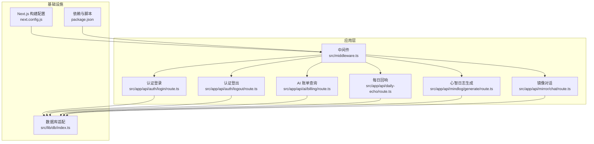
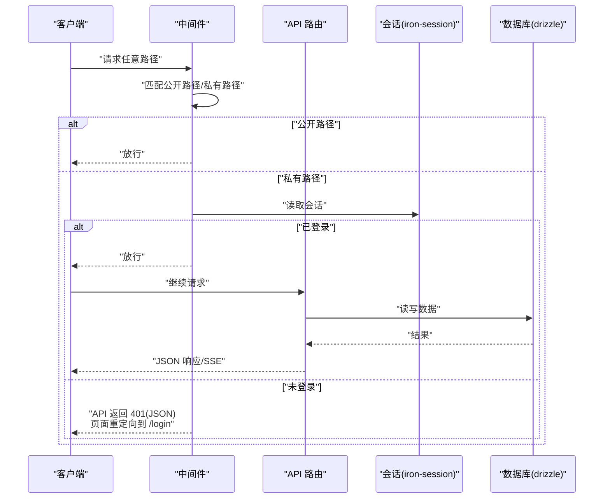
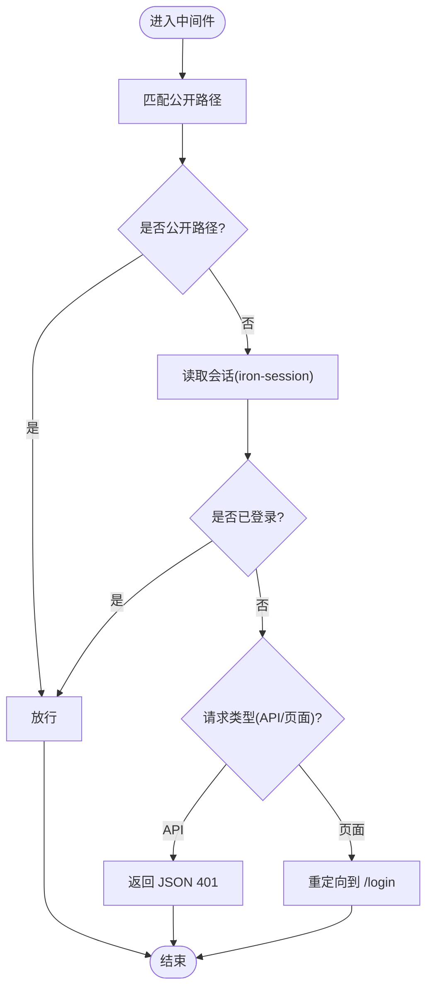
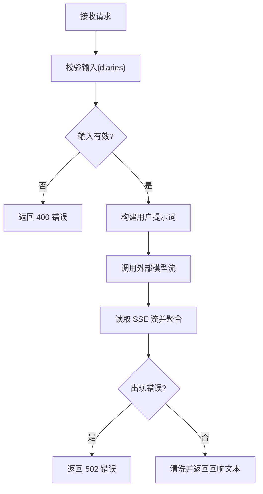
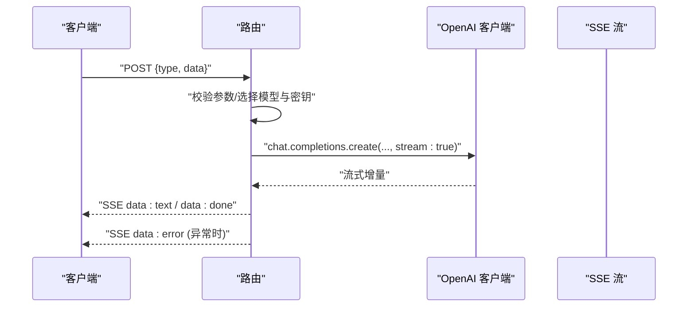
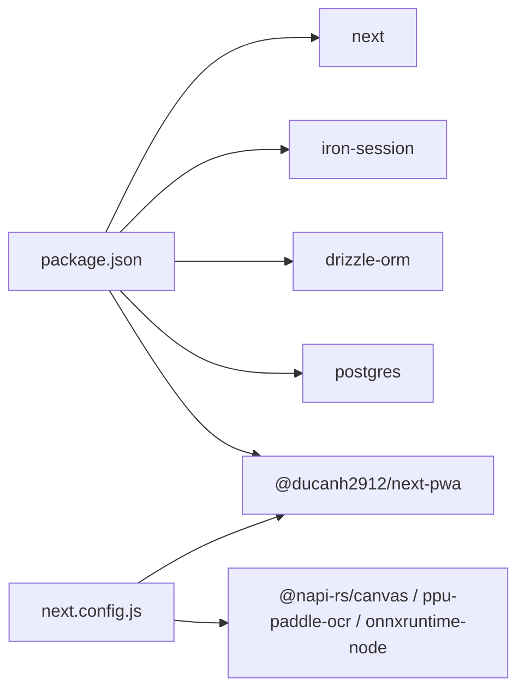

# 后端 API 架构

<cite>
**本文引用的文件**
- [src/middleware.ts](file://src/middleware.ts)
- [src/lib/auth/session.ts](file://src/lib/auth/session.ts)
- [src/app/api/auth/login/route.ts](file://src/app/api/auth/login/route.ts)
- [src/app/api/auth/logout/route.ts](file://src/app/api/auth/logout/route.ts)
- [src/app/api/ai/billing/route.ts](file://src/app/api/ai/billing/route.ts)
- [src/app/api/daily-echo/route.ts](file://src/app/api/daily-echo/route.ts)
- [src/app/api/mindlog/generate/route.ts](file://src/app/api/mindlog/generate/route.ts)
- [src/app/api/mirror/chat/route.ts](file://src/app/api/mirror/chat/route.ts)
- [src/lib/db/index.ts](file://src/lib/db/index.ts)
- [next.config.js](file://next.config.js)
- [package.json](file://package.json)
</cite>

## 目录
1. [简介](#简介)
2. [项目结构](#项目结构)
3. [核心组件](#核心组件)
4. [架构总览](#架构总览)
5. [详细组件分析](#详细组件分析)
6. [依赖关系分析](#依赖关系分析)
7. [性能考量](#性能考量)
8. [故障排查指南](#故障排查指南)
9. [结论](#结论)
10. [附录](#附录)

## 简介
本文件系统性梳理 life-os 基于 Next.js App Router 的后端 API 架构与实现，重点覆盖：
- API 路由组织与中间件拦截策略
- 认证与会话管理（Iron Session）
- 请求处理流程、参数校验与响应标准化
- 异步处理、流式响应（SSE）、并发控制
- 错误处理与可观测性
- API 设计原则与版本化建议
- 文档生成与测试策略

## 项目结构
- 中间件集中于根级中间件文件，统一进行登录态校验与公开路径放行。
- API 路由采用 App Router 的约定式路由，按功能域分层组织在 src/app/api 下。
- 数据访问通过 Drizzle-ORM + Postgres 进行抽象，便于迁移与维护。
- 构建配置针对原生模块与 PWA 进行特殊处理。



图表来源
- [src/middleware.ts:1-52](file://src/middleware.ts#L1-L52)
- [src/app/api/auth/login/route.ts:1-23](file://src/app/api/auth/login/route.ts#L1-L23)
- [src/app/api/auth/logout/route.ts:1-14](file://src/app/api/auth/logout/route.ts#L1-L14)
- [src/app/api/ai/billing/route.ts:1-40](file://src/app/api/ai/billing/route.ts#L1-L40)
- [src/app/api/daily-echo/route.ts:1-72](file://src/app/api/daily-echo/route.ts#L1-L72)
- [src/app/api/mindlog/generate/route.ts:1-107](file://src/app/api/mindlog/generate/route.ts#L1-L107)
- [src/app/api/mirror/chat/route.ts:1-65](file://src/app/api/mirror/chat/route.ts#L1-L65)
- [src/lib/db/index.ts:1-11](file://src/lib/db/index.ts#L1-L11)
- [next.config.js:1-32](file://next.config.js#L1-L32)
- [package.json:1-91](file://package.json#L1-L91)

章节来源
- [src/middleware.ts:1-52](file://src/middleware.ts#L1-L52)
- [next.config.js:1-32](file://next.config.js#L1-L32)
- [package.json:1-91](file://package.json#L1-L91)

## 核心组件
- 中间件与会话
  - 中间件对非公开路径进行登录态校验；API 路由在未登录时返回 JSON 401，避免重定向导致客户端收到 HTML。
  - 会话配置基于 Iron Session，区分移动端与 Web 的 Cookie 行为与有效期。
- 认证 API
  - 登录：校验哈希密码，成功后设置会话。
  - 登出：销毁会话并返回成功。
- AI 与知识服务
  - AI 账单查询：封装多端点降级与不可用时的控制台链接返回。
  - 每日回响：消费外部模型流，聚合为最终一句话输出。
  - 心智日志生成：根据周期类型选择模型与密钥，返回 SSE 流。
  - 镜像对话：支持文本与图片（OCR）混合输入，返回 SSE 流。
- 数据库适配
  - Drizzle-ORM + Postgres，提供统一的数据访问层。

章节来源
- [src/middleware.ts:1-52](file://src/middleware.ts#L1-L52)
- [src/lib/auth/session.ts:1-43](file://src/lib/auth/session.ts#L1-L43)
- [src/app/api/auth/login/route.ts:1-23](file://src/app/api/auth/login/route.ts#L1-L23)
- [src/app/api/auth/logout/route.ts:1-14](file://src/app/api/auth/logout/route.ts#L1-L14)
- [src/app/api/ai/billing/route.ts:1-40](file://src/app/api/ai/billing/route.ts#L1-L40)
- [src/app/api/daily-echo/route.ts:1-72](file://src/app/api/daily-echo/route.ts#L1-L72)
- [src/app/api/mindlog/generate/route.ts:1-107](file://src/app/api/mindlog/generate/route.ts#L1-L107)
- [src/app/api/mirror/chat/route.ts:1-65](file://src/app/api/mirror/chat/route.ts#L1-L65)
- [src/lib/db/index.ts:1-11](file://src/lib/db/index.ts#L1-L11)

## 架构总览
- 路由组织
  - App Router 约定式路由，API 路由位于 src/app/api 下，按功能域分层，如 /api/auth、/api/ai、/api/mindlog、/api/mirror 等。
- 中间件拦截
  - 公开路径白名单：登录页、隐私政策、部分公开 API、静态资源等。
  - 非公开路径统一校验会话，API 路由未登录返回 JSON 401，页面路由重定向至登录页。
- 会话与安全
  - Iron Session 管理会话，移动端 Cookie 有效期更长，生产环境启用安全 Cookie。
- 异步与流式
  - 多数 AI 相关接口采用流式响应（SSE），提升交互体验与实时反馈。
- 构建与部署
  - 原生模块外置，生产环境集成 PWA 插件，开发环境禁用 PWA 以兼容 Turbopack。



图表来源
- [src/middleware.ts:6-46](file://src/middleware.ts#L6-L46)
- [src/lib/auth/session.ts:3-19](file://src/lib/auth/session.ts#L3-L19)
- [src/app/api/auth/login/route.ts:16-21](file://src/app/api/auth/login/route.ts#L16-L21)
- [src/lib/db/index.ts:1-11](file://src/lib/db/index.ts#L1-L11)

## 详细组件分析

### 中间件与会话管理
- 功能要点
  - 公开路径白名单：登录、隐私政策、部分公开 API、静态资源等。
  - 会话读取：基于请求头 User-Agent 判断移动端并调整会话有效期。
  - 未登录处理：API 路由返回 JSON 401，页面路由重定向。
- 安全与兼容
  - 移动端 Cookie maxAge 更长，满足 APP 场景。
  - 生产环境 Cookie 安全标志启用。



图表来源
- [src/middleware.ts:13-46](file://src/middleware.ts#L13-L46)
- [src/lib/auth/session.ts:30-42](file://src/lib/auth/session.ts#L30-L42)

章节来源
- [src/middleware.ts:1-52](file://src/middleware.ts#L1-L52)
- [src/lib/auth/session.ts:1-43](file://src/lib/auth/session.ts#L1-L43)

### 认证 API（登录/登出）
- 登录
  - 参数：JSON 密码字段。
  - 校验：服务端使用哈希比对。
  - 结果：成功设置会话并返回 JSON。
- 登出
  - 销毁会话并返回成功 JSON。

```mermaid
sequenceDiagram
participant C as "客户端"
participant L as "登录路由"
participant S as "会话(iron-session)"
participant DB as "数据库"
C->>L : "POST /api/auth/login {password}"
L->>L : "bcrypt.compare(hash)"
alt "密码正确"
L->>S : "设置 session.isLoggedIn=true 并保存"
L-->>C : "JSON {success : true}"
else "密码错误"
L-->>C : "JSON {error : '密码错误'} 401"
end
C->>Logout as "登出路由"
Logout->>S : "destroy()"
Logout-->>C : "JSON {ok : true}"
```

图表来源
- [src/app/api/auth/login/route.ts:6-22](file://src/app/api/auth/login/route.ts#L6-L22)
- [src/app/api/auth/logout/route.ts:6-12](file://src/app/api/auth/logout/route.ts#L6-L12)
- [src/lib/auth/session.ts:3-5](file://src/lib/auth/session.ts#L3-L5)

章节来源
- [src/app/api/auth/login/route.ts:1-23](file://src/app/api/auth/login/route.ts#L1-L23)
- [src/app/api/auth/logout/route.ts:1-14](file://src/app/api/auth/logout/route.ts#L1-L14)
- [src/lib/auth/session.ts:1-43](file://src/lib/auth/session.ts#L1-L43)

### AI 账单查询 API
- 设计要点
  - 优先尝试信用额度端点，失败则尝试订阅端点，均失败返回控制台链接。
  - 统一返回结构：可用性标记与数据或控制台链接。
- 错误处理
  - 网络异常或服务不可用时返回可用性标记与控制台链接。

章节来源
- [src/app/api/ai/billing/route.ts:1-40](file://src/app/api/ai/billing/route.ts#L1-L40)

### 每日回响 API
- 设计要点
  - 输入：日记内容数组。
  - 处理：调用外部模型流，聚合为最终一句话。
  - 输出：非流式 JSON，包含回响文本。
- 性能与稳定性
  - 设置运行时与最大执行时长，限制超时风险。
  - 对空输入返回明确错误码。



图表来源
- [src/app/api/daily-echo/route.ts:14-71](file://src/app/api/daily-echo/route.ts#L14-L71)

章节来源
- [src/app/api/daily-echo/route.ts:1-72](file://src/app/api/daily-echo/route.ts#L1-L72)

### 心智日志生成 API
- 设计要点
  - 输入：周期类型与数据（日/周/月）。
  - 处理：根据类型选择模型与密钥，构建提示词，返回 SSE 流。
  - 输出：SSE 流，包含增量文本与完成事件。
- 错误处理
  - 捕获内部错误并以 SSE 错误事件返回。



图表来源
- [src/app/api/mindlog/generate/route.ts:22-106](file://src/app/api/mindlog/generate/route.ts#L22-L106)

章节来源
- [src/app/api/mindlog/generate/route.ts:1-107](file://src/app/api/mindlog/generate/route.ts#L1-L107)

### 镜像对话 API
- 设计要点
  - 输入：消息文本、可选图片 Base64、历史对话、用户画像。
  - 处理：若含图片，先 OCR 提取文字，再与文本合并后调用模型流。
  - 输出：SSE 流。
- 错误处理
  - 捕获异常并返回 JSON 500。

章节来源
- [src/app/api/mirror/chat/route.ts:1-65](file://src/app/api/mirror/chat/route.ts#L1-L65)

### 数据库适配层
- 设计要点
  - 使用 Drizzle-ORM + Postgres，连接字符串来自环境变量。
  - 开发环境使用 postgres.js，生产可切换为 serverless 驱动（注释提示）。

章节来源
- [src/lib/db/index.ts:1-11](file://src/lib/db/index.ts#L1-L11)

## 依赖关系分析
- 外部依赖
  - Next.js 15，支持 App Router 与边缘运行时特性。
  - Iron Session 用于会话管理。
  - Drizzle-ORM + Postgres 用于数据库访问。
  - 原生模块（如 @napi-rs/canvas、ppu-paddle-ocr、onnxruntime-node）在服务端打包时外置。
- 构建配置
  - 生产环境启用 PWA 插件，开发环境禁用以兼容 Turbopack。
- 依赖图



图表来源
- [package.json:20-62](file://package.json#L20-L62)
- [next.config.js:9-18](file://next.config.js#L9-L18)

章节来源
- [package.json:1-91](file://package.json#L1-L91)
- [next.config.js:1-32](file://next.config.js#L1-L32)

## 性能考量
- 运行时与超时
  - 关键路由声明 Node.js 运行时与最大执行时长，避免冷启动与长时间阻塞。
- 流式响应
  - SSE 流减少首字节延迟，提升交互体验；注意客户端缓冲与断线重连策略。
- 会话与 Cookie
  - 移动端延长会话有效期，降低频繁登录成本；生产环境启用安全 Cookie。
- 数据库
  - 使用连接池与按需迁移，避免在热路径上执行复杂查询。
- 原生模块
  - 服务端外置原生模块，避免打包体积与兼容性问题。

## 故障排查指南
- 未登录访问
  - API 路由返回 JSON 401；页面路由重定向至登录页。
- SSE 流异常
  - 检查上游模型服务可用性与鉴权；确认客户端正确处理 data 与 done/error 事件。
- OCR 与图片处理
  - 图片为空或格式不支持会导致 OCR 失败；确保 Base64 格式正确。
- 数据库连接
  - 确认连接字符串与网络可达；生产环境可切换驱动以优化性能。
- 构建与部署
  - 生产环境启用 PWA 插件；开发环境禁用以避免与 Turbopack 冲突。

章节来源
- [src/middleware.ts:38-43](file://src/middleware.ts#L38-L43)
- [src/app/api/daily-echo/route.ts:55-57](file://src/app/api/daily-echo/route.ts#L55-L57)
- [src/app/api/mirror/chat/route.ts:58-63](file://src/app/api/mirror/chat/route.ts#L58-L63)
- [src/lib/db/index.ts:5-10](file://src/lib/db/index.ts#L5-L10)
- [next.config.js:22-31](file://next.config.js#L22-L31)

## 结论
本架构以 Next.js App Router 为核心，结合中间件统一认证、Iron Session 会话管理与 Drizzle-ORM 数据访问，形成清晰的 API 层。AI 相关接口采用 SSE 流式响应，兼顾性能与交互体验。建议后续完善 API 版本化策略、自动化文档生成与端到端测试，持续提升可维护性与可观测性。

## 附录
- API 设计原则
  - RESTful 风格：路径语义化，方法语义化；幂等与非幂等区分清晰。
  - 参数验证：入参必填与类型校验前置，返回明确错误码与消息。
  - 响应标准化：统一 JSON 结构，错误字段一致；SSE 事件类型明确。
- 版本管理建议
  - 采用路径前缀版本化（如 /api/v1/...），逐步迁移。
  - 保持向后兼容或在变更时提供迁移指引。
- 文档生成
  - 基于路由注释与类型定义生成 OpenAPI/Swagger 文档。
  - 为流式接口补充客户端消费示例与错误处理说明。
- 测试策略
  - 单元测试：路由参数校验、会话逻辑、数据库操作。
  - 集成测试：端到端调用链路，含 SSE 流消费与断线恢复。
  - 压力测试：AI 服务调用与数据库连接池上限。