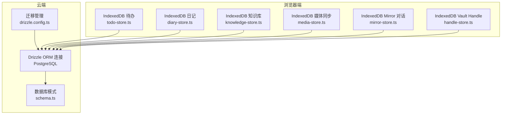
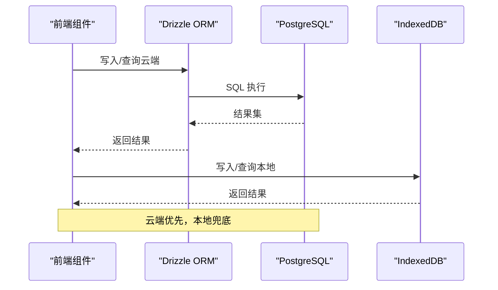
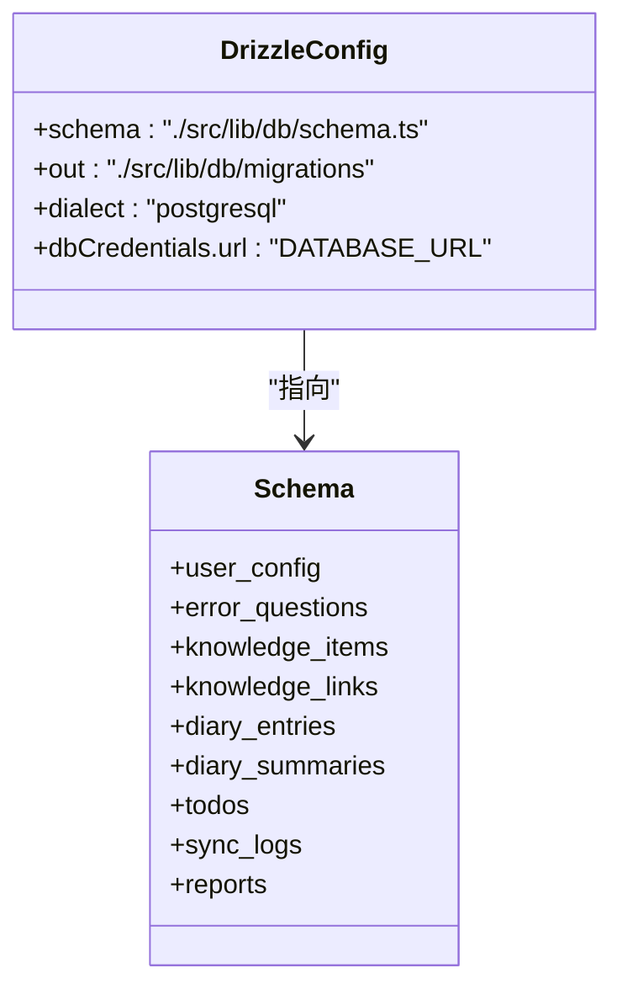
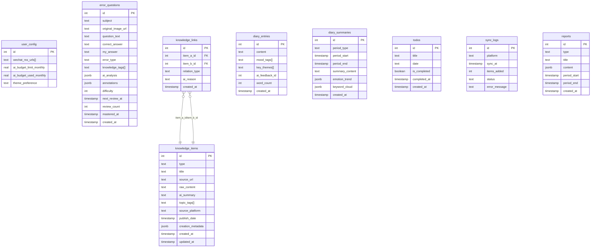
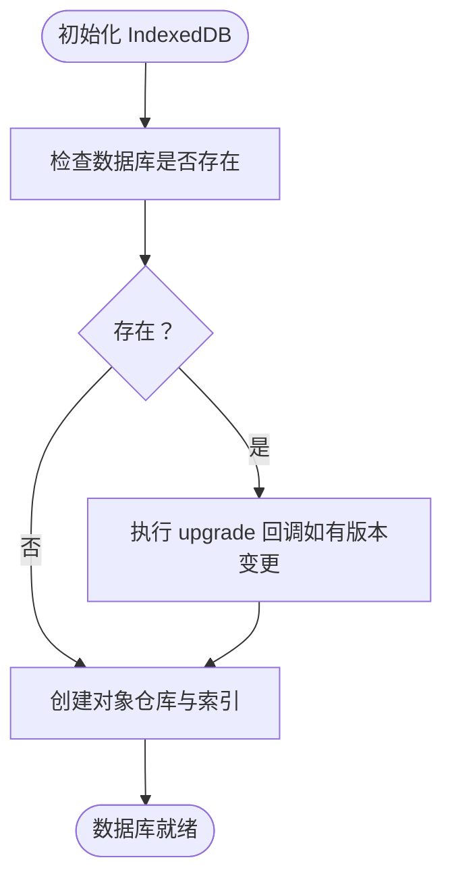
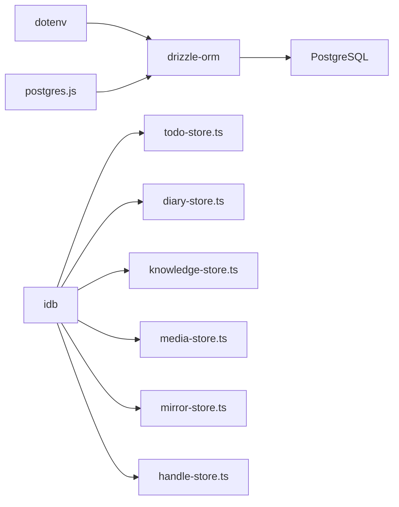

# 数据库与存储架构

<cite>
**本文档引用的文件**
- [drizzle.config.ts](file://drizzle.config.ts)
- [schema.ts](file://src/lib/db/schema.ts)
- [index.ts](file://src/lib/db/index.ts)
- [todo-store.ts](file://src/lib/storage/todo-store.ts)
- [diary-store.ts](file://src/lib/storage/diary-store.ts)
- [knowledge-store.ts](file://src/lib/storage/knowledge-store.ts)
- [media-store.ts](file://src/lib/storage/media-store.ts)
- [mirror-store.ts](file://src/lib/storage/mirror-store.ts)
- [handle-store.ts](file://src/lib/obsidian/handle-store.ts)
</cite>

## 目录
1. [简介](#简介)
2. [项目结构](#项目结构)
3. [核心组件](#核心组件)
4. [架构总览](#架构总览)
5. [详细组件分析](#详细组件分析)
6. [依赖关系分析](#依赖关系分析)
7. [性能考虑](#性能考虑)
8. [故障排查指南](#故障排查指南)
9. [结论](#结论)

## 简介
本文件系统性梳理 life-os 的数据库与存储架构，覆盖以下要点：
- Drizzle ORM 在 PostgreSQL 上的架构设计：连接管理、查询构建器、迁移管理
- 数据模型设计、表关系与索引策略
- IndexedDB 本地存储架构：数据持久化、离线同步、一致性保障
- 混合存储策略（内存+磁盘）的设计考量与实现细节
- 数据备份恢复、性能优化、事务处理等关键机制

## 项目结构
项目采用“云端 PostgreSQL + 浏览器 IndexedDB”的双层存储架构：
- 云端：Drizzle ORM + PostgreSQL，负责核心业务数据（知识库、日记、待办、同步日志等）
- 本地：IndexedDB，负责离线可用的数据持久化与快速检索（知识库、日记、待办、媒体同步配置与日志）

图表来源
- [drizzle.config.ts:1-13](file://drizzle.config.ts#L1-L13)
- [schema.ts:1-118](file://src/lib/db/schema.ts#L1-L118)
- [index.ts:1-11](file://src/lib/db/index.ts#L1-L11)
- [todo-store.ts:1-184](file://src/lib/storage/todo-store.ts#L1-L184)
- [diary-store.ts:1-237](file://src/lib/storage/diary-store.ts#L1-L237)
- [knowledge-store.ts:1-611](file://src/lib/storage/knowledge-store.ts#L1-L611)
- [media-store.ts:1-140](file://src/lib/storage/media-store.ts#L1-L140)
- [mirror-store.ts:36-70](file://src/lib/storage/mirror-store.ts#L36-L70)
- [handle-store.ts:1-40](file://src/lib/obsidian/handle-store.ts#L1-L40)

章节来源
- [drizzle.config.ts:1-13](file://drizzle.config.ts#L1-L13)
- [schema.ts:1-118](file://src/lib/db/schema.ts#L1-L118)
- [index.ts:1-11](file://src/lib/db/index.ts#L1-L11)

## 核心组件
- Drizzle ORM 连接与驱动
  - 使用 postgres.js 驱动建立连接，通过 DATABASE_URL 环境变量配置
  - 将 schema 定义注入 drizzle，形成类型安全的查询接口
- 数据库模式（schema.ts）
  - 定义 user_config、error_questions、knowledge_items、knowledge_links、diary_entries、diary_summaries、todos、sync_logs、reports 等核心表
  - 明确主键、外键、数组字段、JSONB 字段、默认值与时间戳
- 迁移管理（drizzle.config.ts）
  - 指定 schema 文件路径、输出目录、方言为 PostgreSQL，并从环境变量读取数据库连接字符串
- 本地 IndexedDB 存储
  - 待办（todo-store.ts）、日记（diary-store.ts）、知识库（knowledge-store.ts）、媒体同步（media-store.ts）、Mirror 对话（mirror-store.ts）、Obsidian Vault Handle（handle-store.ts）
  - 每个模块独立数据库命名与版本号，支持升级回调（upgrade）进行索引与结构演进

章节来源
- [index.ts:1-11](file://src/lib/db/index.ts#L1-L11)
- [schema.ts:1-118](file://src/lib/db/schema.ts#L1-L118)
- [drizzle.config.ts:1-13](file://drizzle.config.ts#L1-L13)
- [todo-store.ts:1-184](file://src/lib/storage/todo-store.ts#L1-L184)
- [diary-store.ts:1-237](file://src/lib/storage/diary-store.ts#L1-L237)
- [knowledge-store.ts:1-611](file://src/lib/storage/knowledge-store.ts#L1-L611)
- [media-store.ts:1-140](file://src/lib/storage/media-store.ts#L1-L140)
- [mirror-store.ts:36-70](file://src/lib/storage/mirror-store.ts#L36-L70)
- [handle-store.ts:1-40](file://src/lib/obsidian/handle-store.ts#L1-L40)

## 架构总览
云端与本地的交互遵循“以云为主、以本地为辅”的原则：
- 云端负责强一致、可扩展的核心业务数据
- 本地负责离线可用、高频访问的轻量数据与临时状态
- 通过统一的 API 层协调数据写入、读取与同步

图表来源
- [index.ts:1-11](file://src/lib/db/index.ts#L1-L11)
- [schema.ts:1-118](file://src/lib/db/schema.ts#L1-L118)
- [todo-store.ts:1-184](file://src/lib/storage/todo-store.ts#L1-L184)
- [diary-store.ts:1-237](file://src/lib/storage/diary-store.ts#L1-L237)
- [knowledge-store.ts:1-611](file://src/lib/storage/knowledge-store.ts#L1-L611)
- [media-store.ts:1-140](file://src/lib/storage/media-store.ts#L1-L140)

## 详细组件分析

### Drizzle ORM 架构与迁移管理
- 连接与驱动
  - 使用 postgres.js 驱动，通过 DATABASE_URL 初始化客户端
  - 将 schema 注入 drizzle，形成类型安全的查询入口
- 迁移配置
  - schema 指向 src/lib/db/schema.ts
  - 输出目录为 src/lib/db/migrations
  - 方言为 PostgreSQL，凭据来自环境变量 DATABASE_URL
- 模式定义
  - 包含用户配置、错题本、知识库（含链接）、日记、待办、同步日志、报告等表
  - 使用数组字段（.array()）与 JSONB 字段满足灵活数据结构需求
  - 外键约束明确关联关系（如知识链接到知识项）

图表来源
- [drizzle.config.ts:1-13](file://drizzle.config.ts#L1-L13)
- [schema.ts:1-118](file://src/lib/db/schema.ts#L1-L118)

章节来源
- [index.ts:1-11](file://src/lib/db/index.ts#L1-L11)
- [drizzle.config.ts:1-13](file://drizzle.config.ts#L1-L13)
- [schema.ts:1-118](file://src/lib/db/schema.ts#L1-L118)

### 数据模型设计与表关系
- user_config：用户偏好与配额（如 AI 预算、主题偏好、RSS 列表等）
- error_questions：错题本实体，包含题目文本、答案、难度、复习计划等
- knowledge_items：知识条目，支持多种来源（link/text/file/feishu/obsidian/creation_article），带话题标签、发布日期、外部标识等
- knowledge_links：知识项之间的关系，支持多种关系类型（如 deepen/apply/supplement/oppose/source/contains）
- diary_entries：日记条目，支持情绪标签、关键词主题、字数统计、AI 反馈关联
- diary_summaries：周期性摘要（周/月），包含情感趋势与关键词云
- todos：待办事项，按日期与完成状态索引
- sync_logs：平台同步日志，记录同步状态与错误信息
- reports：各类报告（日报/周报/月报/日记反馈/错题分析）

图表来源
- [schema.ts:1-118](file://src/lib/db/schema.ts#L1-L118)

章节来源
- [schema.ts:1-118](file://src/lib/db/schema.ts#L1-L118)

### 索引策略与查询优化
- 知识库（knowledge_items）
  - by-type：按类型过滤
  - by-tags（multiEntry）：按话题标签模糊匹配
  - by-external（非唯一）：外部导入去重与增量同步
  - by-category：一级主题分类
  - by-source-collection：来源集聚合
- 日记（diary_entries）
  - by-created：按创建时间排序
  - by-mood（multiEntry）：按情绪标签过滤
- 待办（todos）
  - by-date：按日期分组
  - by-completed：按完成状态过滤
- 媒体同步（media-store）
  - configs.by-platform：按平台筛选
  - sync_logs.by-config、by-sync-at：按配置与时间排序
- Mirror 对话（mirror-store）
  - messages.byCreatedAt、by-session：按时间与会话检索
  - sessions.by-updated：按更新时间排序

章节来源
- [knowledge-store.ts:110-168](file://src/lib/storage/knowledge-store.ts#L110-L168)
- [diary-store.ts:50-79](file://src/lib/storage/diary-store.ts#L50-L79)
- [todo-store.ts:30-41](file://src/lib/storage/todo-store.ts#L30-L41)
- [media-store.ts:37-53](file://src/lib/storage/media-store.ts#L37-L53)
- [mirror-store.ts:36-63](file://src/lib/storage/mirror-store.ts#L36-L63)

### IndexedDB 本地存储架构
- 数据持久化
  - 每个功能域独立数据库（如 knowledge-db、diary-db、todo-db、media-db、mirror-db、vault-handle-db）
  - 使用 openDB 初始化，支持 upgrade 回调进行结构演进
- 离线同步
  - 本地暂存用户输入与中间态（如 Mirror 会话、Obsidian Vault Handle）
  - 云端同步成功后，本地可选择清理或保留历史记录
- 数据一致性
  - 通过版本号控制（DB_VERSION）与 upgrade 逻辑确保结构兼容
  - 对于知识库，提供按 externalId 的 upsert 与增量判断，避免重复导入

图表来源
- [knowledge-store.ts:106-172](file://src/lib/storage/knowledge-store.ts#L106-L172)
- [diary-store.ts:46-82](file://src/lib/storage/diary-store.ts#L46-L82)
- [todo-store.ts:27-44](file://src/lib/storage/todo-store.ts#L27-L44)
- [media-store.ts:33-56](file://src/lib/storage/media-store.ts#L33-L56)
- [mirror-store.ts:36-67](file://src/lib/storage/mirror-store.ts#L36-L67)
- [handle-store.ts:14-24](file://src/lib/obsidian/handle-store.ts#L14-L24)

章节来源
- [knowledge-store.ts:106-172](file://src/lib/storage/knowledge-store.ts#L106-L172)
- [diary-store.ts:46-82](file://src/lib/storage/diary-store.ts#L46-L82)
- [todo-store.ts:27-44](file://src/lib/storage/todo-store.ts#L27-L44)
- [media-store.ts:33-56](file://src/lib/storage/media-store.ts#L33-L56)
- [mirror-store.ts:36-67](file://src/lib/storage/mirror-store.ts#L36-L67)
- [handle-store.ts:14-24](file://src/lib/obsidian/handle-store.ts#L14-L24)

### 混合存储策略（内存+磁盘）
- 设计考量
  - 内存：短期状态（如当前会话、UI 状态）减少 IO 开销
  - 磁盘：持久化数据（IndexedDB/PostgreSQL）保证重启不丢失
- 实现细节
  - Drizzle ORM 在内存中维护连接池与查询缓存
  - IndexedDB 作为持久化层，提供结构化存储与索引能力
  - 业务层通过统一的 store 模块抽象，屏蔽云端与本地差异

章节来源
- [index.ts:1-11](file://src/lib/db/index.ts#L1-L11)
- [todo-store.ts:1-184](file://src/lib/storage/todo-store.ts#L1-L184)
- [diary-store.ts:1-237](file://src/lib/storage/diary-store.ts#L1-L237)
- [knowledge-store.ts:1-611](file://src/lib/storage/knowledge-store.ts#L1-L611)
- [media-store.ts:1-140](file://src/lib/storage/media-store.ts#L1-L140)

### 数据备份与恢复
- 云端（PostgreSQL）
  - 使用 Drizzle 进行结构化查询与导出
  - 建议定期备份数据库快照，结合迁移脚本进行版本回滚
- 本地（IndexedDB）
  - 通过浏览器开发者工具或扩展导出数据库内容
  - 重要数据可复制到其他设备或云端，实现跨设备恢复

章节来源
- [drizzle.config.ts:1-13](file://drizzle.config.ts#L1-L13)
- [schema.ts:1-118](file://src/lib/db/schema.ts#L1-L118)

### 事务处理
- 云端事务
  - 使用 Drizzle 的事务 API（如 drizzle.transaction）包裹多表写入，保证原子性
  - 建议在批量导入或复杂更新场景中启用事务
- 本地事务
  - IndexedDB 事务（IDBTransaction）用于跨对象仓库的写入，确保一致性
  - 知识库删除条目时，同时删除相关链接，使用事务避免悬挂引用

章节来源
- [knowledge-store.ts:252-269](file://src/lib/storage/knowledge-store.ts#L252-L269)

## 依赖关系分析
- Drizzle ORM 依赖
  - postgres.js 驱动：提供高性能的 PostgreSQL 连接
  - dotenv：加载 .env.local 中的 DATABASE_URL
- 本地存储依赖
  - idb：IndexedDB 的现代封装，提供 Promise 化 API
  - 每个 store 模块独立管理自身数据库实例与升级流程

图表来源
- [index.ts:1-11](file://src/lib/db/index.ts#L1-L11)
- [drizzle.config.ts:1-13](file://drizzle.config.ts#L1-L13)
- [todo-store.ts:1](file://src/lib/storage/todo-store.ts#L1)
- [diary-store.ts:1](file://src/lib/storage/diary-store.ts#L1)
- [knowledge-store.ts:1](file://src/lib/storage/knowledge-store.ts#L1)
- [media-store.ts:1](file://src/lib/storage/media-store.ts#L1)
- [mirror-store.ts:1](file://src/lib/storage/mirror-store.ts#L1)
- [handle-store.ts:1](file://src/lib/obsidian/handle-store.ts#L1)

章节来源
- [index.ts:1-11](file://src/lib/db/index.ts#L1-L11)
- [drizzle.config.ts:1-13](file://drizzle.config.ts#L1-L13)
- [todo-store.ts:1](file://src/lib/storage/todo-store.ts#L1)
- [diary-store.ts:1](file://src/lib/storage/diary-store.ts#L1)
- [knowledge-store.ts:1](file://src/lib/storage/knowledge-store.ts#L1)
- [media-store.ts:1](file://src/lib/storage/media-store.ts#L1)
- [mirror-store.ts:1](file://src/lib/storage/mirror-store.ts#L1)
- [handle-store.ts:1](file://src/lib/obsidian/handle-store.ts#L1)

## 性能考虑
- 索引优化
  - 为高频查询字段建立合适索引（如知识库的 by-type/by-tags/by-external/by-category/by-source-collection）
  - 使用 multiEntry 索引支持数组字段的高效查询
- 查询优化
  - 使用 Drizzle 的条件过滤与排序，避免全表扫描
  - 对大数据量的本地查询，建议分页与延迟加载
- 连接与缓存
  - 复用 Drizzle 连接，减少握手开销
  - 合理使用事务，降低写入放大
- 离线体验
  - 本地优先策略，减少网络抖动对用户体验的影响
  - 对热点数据进行内存缓存，提升响应速度

## 故障排查指南
- Drizzle 连接问题
  - 检查 DATABASE_URL 是否正确加载（.env.local）
  - 确认数据库可达性与权限
- 迁移失败
  - 查看 migrations 输出目录是否可写
  - 确认 schema.ts 与 drizzle.config.ts 的路径一致
- IndexedDB 升级阻塞
  - 关注 blocked 回调日志，避免多标签页同时升级
  - 确保 upgrade 逻辑幂等，支持版本跳跃升级
- 知识库重复导入
  - 使用 upsertByExternalId 并提供 externalId 与 externalUpdatedAt
  - 若增量判断异常，检查索引 by-external 是否存在

章节来源
- [drizzle.config.ts:1-13](file://drizzle.config.ts#L1-L13)
- [diary-store.ts:76-79](file://src/lib/storage/diary-store.ts#L76-L79)
- [knowledge-store.ts:221-250](file://src/lib/storage/knowledge-store.ts#L221-L250)

## 结论
life-os 的数据库与存储架构以 Drizzle ORM + PostgreSQL 为核心，配合 IndexedDB 实现离线优先的本地存储。通过清晰的模式设计、完善的索引策略与事务处理，兼顾了数据一致性与性能表现。未来可在以下方面持续优化：
- 引入更细粒度的缓存策略与失效机制
- 增强离线同步冲突解决与增量合并算法
- 提供可视化迁移与备份工具链，降低运维成本