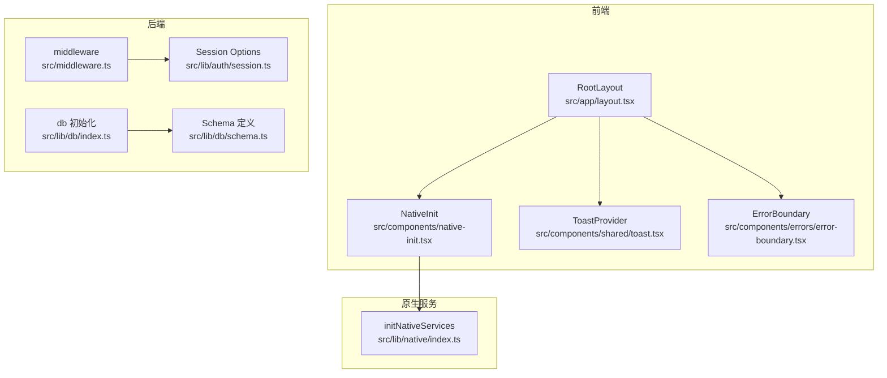
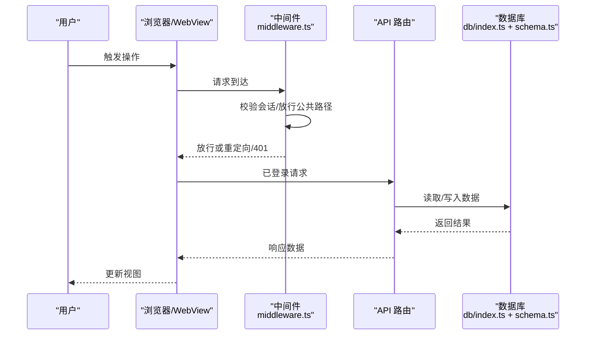
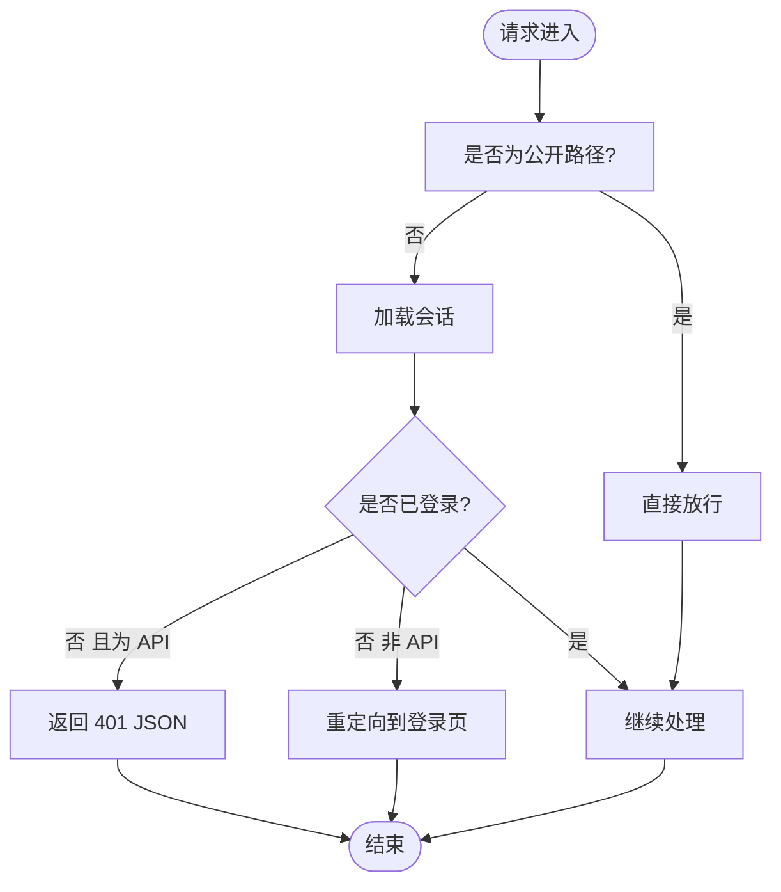
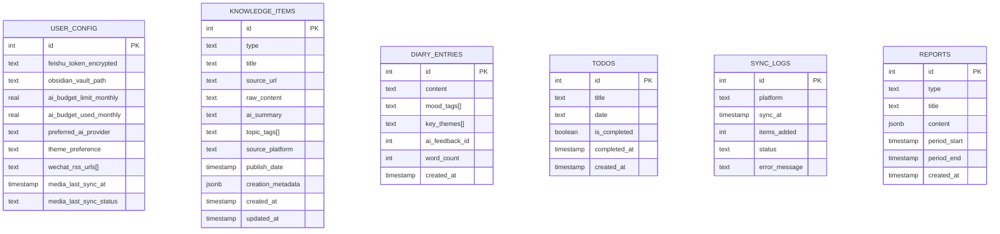
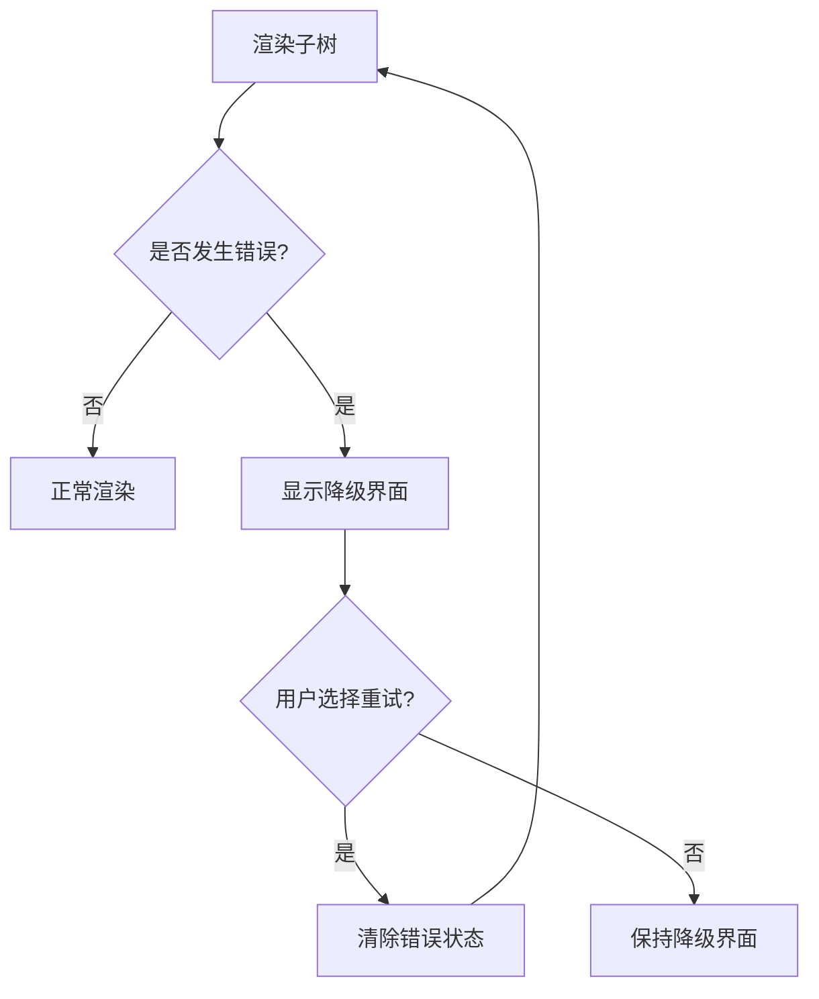
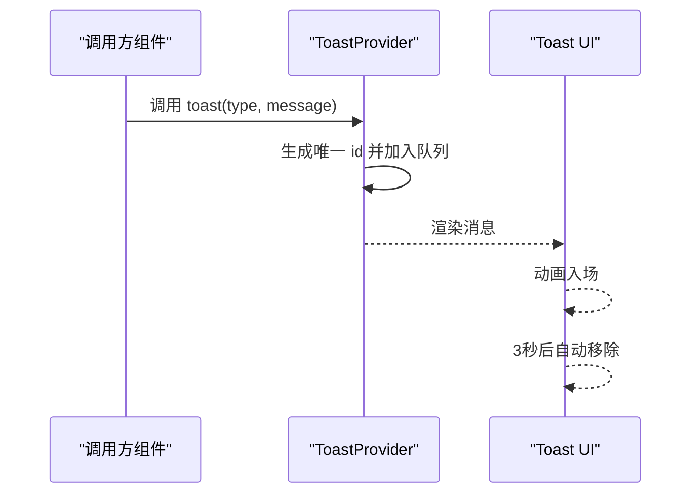
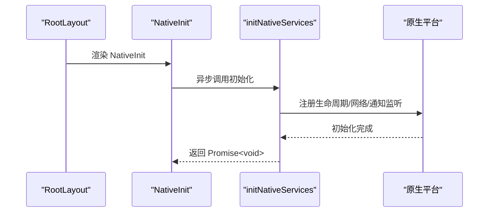
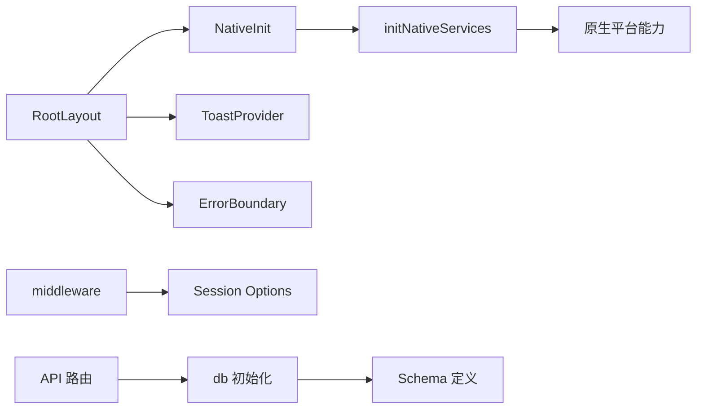

# 数据流与状态管理

<cite>
**本文引用的文件**
- [src/app/layout.tsx](file://src/app/layout.tsx)
- [src/components/native-init.tsx](file://src/components/native-init.tsx)
- [src/lib/native/index.ts](file://src/lib/native/index.ts)
- [src/middleware.ts](file://src/middleware.ts)
- [src/lib/auth/session.ts](file://src/lib/auth/session.ts)
- [src/lib/db/index.ts](file://src/lib/db/index.ts)
- [src/lib/db/schema.ts](file://src/lib/db/schema.ts)
- [src/components/errors/error-boundary.tsx](file://src/components/errors/error-boundary.tsx)
- [src/components/shared/toast.tsx](file://src/components/shared/toast.tsx)
</cite>

## 目录
1. [简介](#简介)
2. [项目结构](#项目结构)
3. [核心组件](#核心组件)
4. [架构总览](#架构总览)
5. [详细组件分析](#详细组件分析)
6. [依赖关系分析](#依赖关系分析)
7. [性能考量](#性能考量)
8. [故障排查指南](#故障排查指南)
9. [结论](#结论)
10. [附录](#附录)

## 简介
本文件围绕 life-os 的数据流与状态管理进行系统性梳理，覆盖从用户输入到状态更新、再到视图渲染的完整链路；解释本地状态、全局状态与持久化状态的管理策略；分析异步数据处理、实时更新与缓存策略；阐述错误边界、数据验证与状态同步机制，并给出性能监控、状态调试与数据迁移等运维建议。

## 项目结构
life-os 基于 Next.js 构建，采用 App Router 结构，前端通过 React 组件与客户端上下文提供状态能力，后端通过中间件与 API 路由实现会话控制与数据访问。数据库层使用 Drizzle ORM + Postgres，配合 schema 定义实现结构化持久化。

图表来源
- [src/app/layout.tsx:18-31](file://src/app/layout.tsx#L18-L31)
- [src/components/native-init.tsx:5-15](file://src/components/native-init.tsx#L5-L15)
- [src/lib/native/index.ts:19-54](file://src/lib/native/index.ts#L19-L54)
- [src/middleware.ts:6-46](file://src/middleware.ts#L6-L46)
- [src/lib/auth/session.ts:7-42](file://src/lib/auth/session.ts#L7-L42)
- [src/lib/db/index.ts:1-10](file://src/lib/db/index.ts#L1-L10)
- [src/lib/db/schema.ts:1-118](file://src/lib/db/schema.ts#L1-L118)

章节来源
- [src/app/layout.tsx:1-32](file://src/app/layout.tsx#L1-L32)
- [src/middleware.ts:1-52](file://src/middleware.ts#L1-L52)

## 核心组件
- 全局布局与根节点：负责注入原生初始化、全局样式与子树渲染。
- 原生服务初始化：在原生平台启动时统一初始化生命周期、通知、网络等能力。
- 会话与中间件：统一处理登录态校验、API 访问控制与移动端会话配置。
- 数据库与模式：以 Drizzle ORM 将 schema 映射到 Postgres，支撑多模块数据持久化。
- 错误边界：捕获子树渲染错误，提供降级提示与重试机制。
- 通知与提示：基于上下文的 Toast 提示，支持成功、错误、信息三类消息。

章节来源
- [src/app/layout.tsx:18-31](file://src/app/layout.tsx#L18-L31)
- [src/components/native-init.tsx:5-15](file://src/components/native-init.tsx#L5-L15)
- [src/lib/native/index.ts:19-54](file://src/lib/native/index.ts#L19-L54)
- [src/middleware.ts:6-46](file://src/middleware.ts#L6-L46)
- [src/lib/auth/session.ts:7-42](file://src/lib/auth/session.ts#L7-L42)
- [src/lib/db/index.ts:1-10](file://src/lib/db/index.ts#L1-L10)
- [src/lib/db/schema.ts:1-118](file://src/lib/db/schema.ts#L1-L118)
- [src/components/errors/error-boundary.tsx:14-29](file://src/components/errors/error-boundary.tsx#L14-L29)
- [src/components/shared/toast.tsx:24-58](file://src/components/shared/toast.tsx#L24-L58)

## 架构总览
下图展示从用户交互到状态持久化的整体流程：浏览器/原生 WebView 发起请求，Next.js 中间件进行会话校验，API 路由读写数据库，Drizzle ORM 与 schema 保证数据一致性；前端通过上下文与组件状态驱动视图更新。

图表来源
- [src/middleware.ts:6-46](file://src/middleware.ts#L6-L46)
- [src/lib/db/index.ts:1-10](file://src/lib/db/index.ts#L1-L10)
- [src/lib/db/schema.ts:1-118](file://src/lib/db/schema.ts#L1-L118)

## 详细组件分析

### 会话与登录态管理
- 会话选项：基于 iron-session，区分 Web 与移动端的 Cookie 配置与有效期。
- 中间件拦截：对受保护路径进行登录态检查；API 路由返回 JSON 401，避免重定向导致 fetch 得到 HTML。
- 移动端适配：根据 UA 判断移动应用，延长会话有效期，提升体验。

图表来源
- [src/middleware.ts:13-46](file://src/middleware.ts#L13-L46)
- [src/lib/auth/session.ts:31-42](file://src/lib/auth/session.ts#L31-L42)

章节来源
- [src/middleware.ts:6-46](file://src/middleware.ts#L6-L46)
- [src/lib/auth/session.ts:7-42](file://src/lib/auth/session.ts#L7-L42)

### 数据库与模式
- 初始化：通过 Drizzle 连接 Postgres，注入 schema。
- 模式：涵盖用户配置、错题本、知识库、日记、待办、同步日志与报告等表，字段覆盖业务关键维度。

图表来源
- [src/lib/db/schema.ts:4-15](file://src/lib/db/schema.ts#L4-L15)
- [src/lib/db/schema.ts:42-55](file://src/lib/db/schema.ts#L42-L55)
- [src/lib/db/schema.ts:67-86](file://src/lib/db/schema.ts#L67-L86)
- [src/lib/db/schema.ts:89-96](file://src/lib/db/schema.ts#L89-L96)
- [src/lib/db/schema.ts:99-106](file://src/lib/db/schema.ts#L99-L106)
- [src/lib/db/schema.ts:109-117](file://src/lib/db/schema.ts#L109-L117)

章节来源
- [src/lib/db/index.ts:1-10](file://src/lib/db/index.ts#L1-L10)
- [src/lib/db/schema.ts:1-118](file://src/lib/db/schema.ts#L1-L118)

### 错误边界与容错
- 组件式错误边界：捕获子树错误，显示降级文案与重试按钮，支持手动重置状态。
- 与路由/组件组合：可在关键页面包裹边界，避免单点崩溃影响全站。

图表来源
- [src/components/errors/error-boundary.tsx:20-29](file://src/components/errors/error-boundary.tsx#L20-L29)

章节来源
- [src/components/errors/error-boundary.tsx:14-57](file://src/components/errors/error-boundary.tsx#L14-L57)

### 通知与提示（Toast）
- 上下文提供：通过 Provider 维护消息队列，自动移除过期消息。
- 动画与类型：基于动画库实现进出动画，支持成功/错误/信息三类图标与文案。

图表来源
- [src/components/shared/toast.tsx:24-58](file://src/components/shared/toast.tsx#L24-L58)

章节来源
- [src/components/shared/toast.tsx:1-59](file://src/components/shared/toast.tsx#L1-L59)

### 原生服务初始化与网络/通知能力
- 初始化入口：在根组件挂载后异步加载并初始化原生服务，按平台条件启用状态栏、键盘、网络监听等。
- 能力导出：统一暴露震动、通知、分享、网络状态等接口，供业务模块按需使用。

图表来源
- [src/components/native-init.tsx:5-15](file://src/components/native-init.tsx#L5-L15)
- [src/lib/native/index.ts:19-54](file://src/lib/native/index.ts#L19-L54)

章节来源
- [src/components/native-init.tsx:1-16](file://src/components/native-init.tsx#L1-L16)
- [src/lib/native/index.ts:1-55](file://src/lib/native/index.ts#L1-L55)

## 依赖关系分析
- 前端依赖：RootLayout 依赖 NativeInit 与 ToastProvider；NativeInit 依赖原生服务入口；错误边界作为通用兜底。
- 后端依赖：中间件依赖会话配置；API 路由依赖数据库连接与 schema；数据库连接依赖 Drizzle 与 Postgres。
- 耦合与内聚：会话与中间件解耦登录态与路由控制；数据库层通过 schema 实现高内聚的数据模型；前端通过上下文与组件实现状态内聚。

图表来源
- [src/app/layout.tsx:18-31](file://src/app/layout.tsx#L18-L31)
- [src/components/native-init.tsx:5-15](file://src/components/native-init.tsx#L5-L15)
- [src/lib/native/index.ts:19-54](file://src/lib/native/index.ts#L19-L54)
- [src/middleware.ts:6-46](file://src/middleware.ts#L6-L46)
- [src/lib/auth/session.ts:7-42](file://src/lib/auth/session.ts#L7-L42)
- [src/lib/db/index.ts:1-10](file://src/lib/db/index.ts#L1-L10)
- [src/lib/db/schema.ts:1-118](file://src/lib/db/schema.ts#L1-L118)

章节来源
- [src/app/layout.tsx:1-32](file://src/app/layout.tsx#L1-L32)
- [src/middleware.ts:1-52](file://src/middleware.ts#L1-L52)

## 性能考量
- 会话优化：移动端延长会话有效期，减少频繁登录开销；同时注意安全阈值与清理策略。
- 数据库访问：API 路由中尽量复用 db 连接，避免重复创建；对高频查询使用索引与分页。
- 前端渲染：错误边界与 Toast 仅在必要区域包裹，避免过度渲染；动画参数适度，保障低端设备流畅度。
- 原生初始化：懒加载与条件初始化，避免阻塞首屏渲染。

## 故障排查指南
- 登录态问题
  - 现象：API 返回 401 或被重定向至登录页。
  - 排查：确认中间件放行规则、会话 Cookie 是否携带、移动端 UA 判断是否正确。
- 数据库异常
  - 现象：API 查询失败或连接超时。
  - 排查：检查 DATABASE_URL、Postgres 可达性、Drizzle 连接与 schema 版本一致性。
- 原生能力初始化失败
  - 现象：控制台警告或功能不可用。
  - 排查：确认 isNativePlatform 判定、插件是否安装、初始化顺序与异常捕获。
- 错误边界触发
  - 现象：页面出现降级提示。
  - 排查：查看边界内部错误栈、定位具体组件并修复；提供明确的重试入口。

章节来源
- [src/middleware.ts:33-46](file://src/middleware.ts#L33-L46)
- [src/lib/db/index.ts:5-10](file://src/lib/db/index.ts#L5-L10)
- [src/components/native-init.tsx:8-11](file://src/components/native-init.tsx#L8-L11)
- [src/components/errors/error-boundary.tsx:24-29](file://src/components/errors/error-boundary.tsx#L24-L29)

## 结论
life-os 的数据流与状态管理以“中间件会话控制 + Drizzle 数据持久化 + 前端上下文与组件状态”为核心，结合错误边界与 Toast 提升可用性，原生服务初始化增强跨平台体验。建议在生产中完善数据库版本迁移、状态调试工具与性能监控，持续优化异步与缓存策略。

## 附录
- 状态调试建议
  - 使用浏览器开发者工具的 Redux DevTools 或 React DevTools 追踪状态变化。
  - 对关键 API 调用添加日志与埋点，记录请求/响应与耗时。
- 数据迁移
  - 通过 Drizzle 的迁移工具维护 schema 变更；对历史数据执行转换脚本并回填。
- 缓存策略
  - 对静态内容与只读列表使用 HTTP 缓存与 SWR；对敏感数据避免本地缓存。
- 实时更新
  - 通过 WebSocket 或轮询实现增量更新；结合错误重试与退避策略。