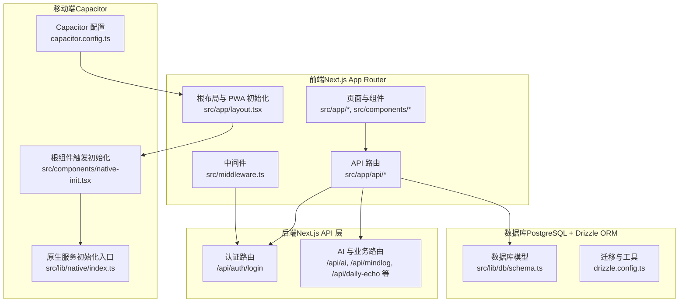
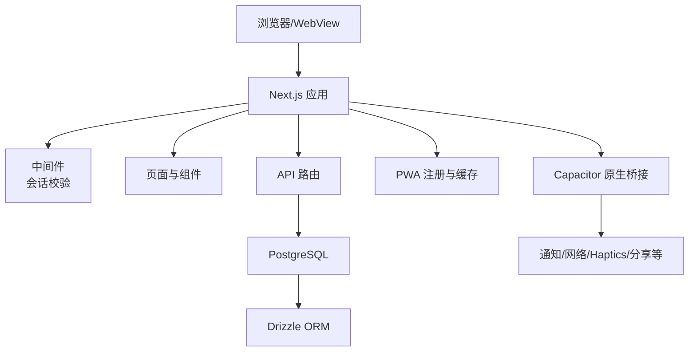
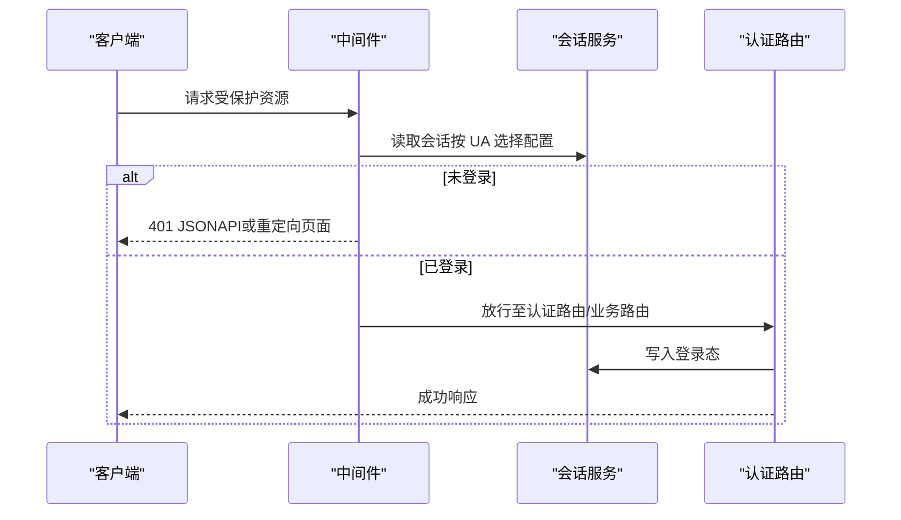
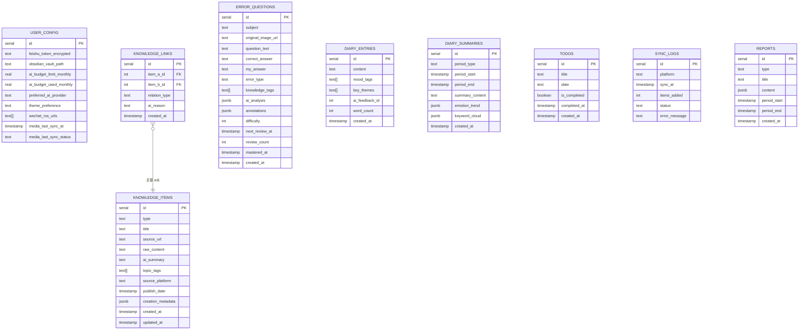
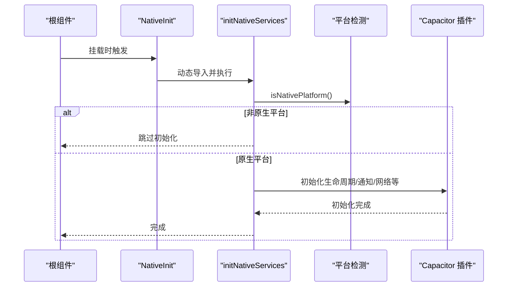
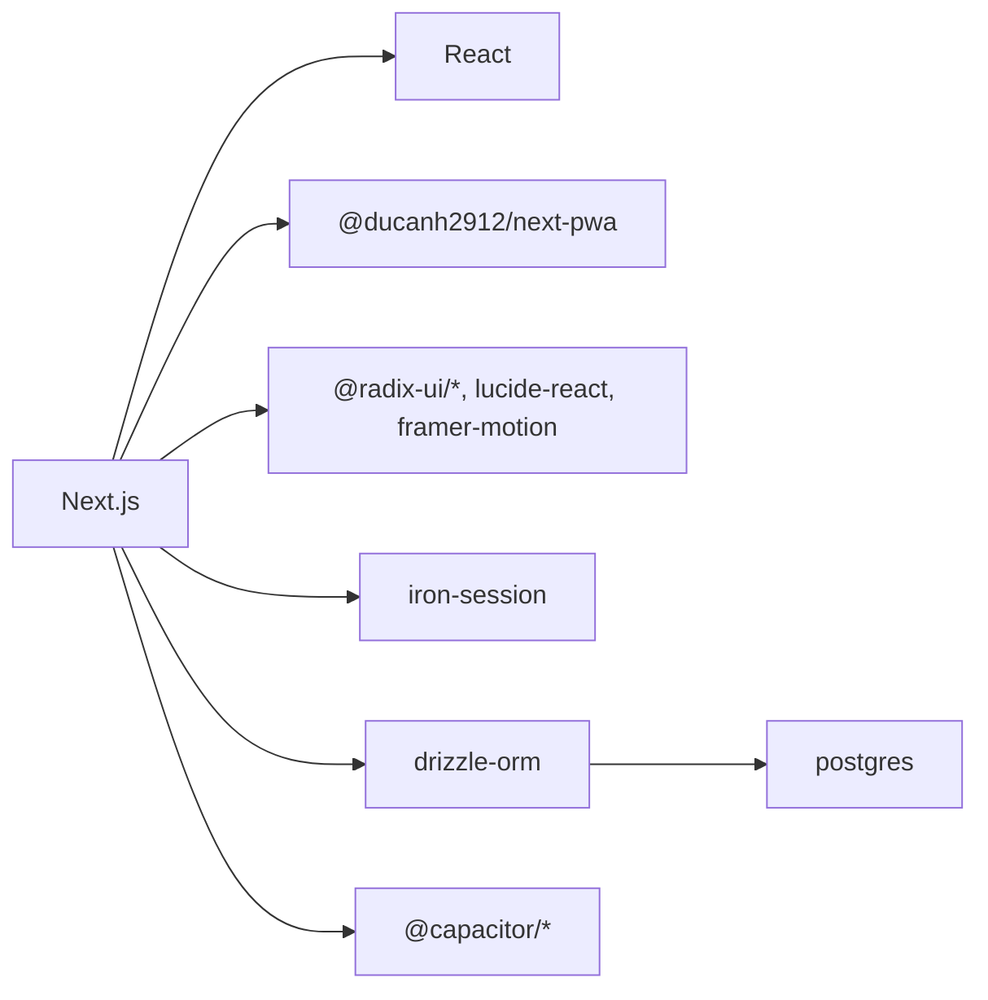

# 架构设计

<cite>
**本文引用的文件**
- [package.json](file://package.json)
- [next.config.js](file://next.config.js)
- [drizzle.config.ts](file://drizzle.config.ts)
- [capacitor.config.ts](file://capacitor.config.ts)
- [src/middleware.ts](file://src/middleware.ts)
- [src/app/layout.tsx](file://src/app/layout.tsx)
- [src/lib/db/schema.ts](file://src/lib/db/schema.ts)
- [src/lib/auth/session.ts](file://src/lib/auth/session.ts)
- [src/app/api/auth/login/route.ts](file://src/app/api/auth/login/route.ts)
- [src/components/native-init.tsx](file://src/components/native-init.tsx)
- [src/lib/native/index.ts](file://src/lib/native/index.ts)
- [DESIGN.md](file://DESIGN.md)
</cite>

## 目录
1. [引言](#引言)
2. [项目结构](#项目结构)
3. [核心组件](#核心组件)
4. [架构总览](#架构总览)
5. [详细组件分析](#详细组件分析)
6. [依赖分析](#依赖分析)
7. [性能考量](#性能考量)
8. [故障排查指南](#故障排查指南)
9. [结论](#结论)
10. [附录](#附录)

## 引言
本架构设计文档面向 life-os（MindOS）项目，系统化阐述前端 Next.js 应用、后端 API 层、数据库层与移动端集成层的整体设计与实现要点。重点解释技术选型（如 Next.js App Router、Capacitor 跨平台方案、Drizzle ORM）、数据流与组件交互模式（状态管理、API 调用、离线与同步），并给出可扩展性、性能优化与安全架构建议。

## 项目结构
项目采用前后端一体化的单仓多模块组织方式：
- 前端：Next.js 应用，使用 App Router 组织页面与 API 路由，支持 PWA（生产环境）。
- 后端：Next.js API 路由作为服务端处理逻辑，配合中间件进行会话校验与权限控制。
- 数据库：PostgreSQL，使用 Drizzle ORM 进行类型安全的建模与迁移。
- 移动端：Capacitor 作为跨平台容器，WebView 加载远程站点或静态导出产物，提供原生能力桥接。

图表来源
- [src/app/layout.tsx:18-31](file://src/app/layout.tsx#L18-L31)
- [src/middleware.ts:6-47](file://src/middleware.ts#L6-L47)
- [src/app/api/auth/login/route.ts:6-22](file://src/app/api/auth/login/route.ts#L6-L22)
- [src/lib/db/schema.ts:1-118](file://src/lib/db/schema.ts#L1-L118)
- [drizzle.config.ts:6-13](file://drizzle.config.ts#L6-L13)
- [capacitor.config.ts:3-34](file://capacitor.config.ts#L3-L34)
- [src/lib/native/index.ts:19-54](file://src/lib/native/index.ts#L19-L54)
- [src/components/native-init.tsx:5-15](file://src/components/native-init.tsx#L5-L15)

章节来源
- [package.json:1-91](file://package.json#L1-L91)
- [next.config.js:1-32](file://next.config.js#L1-L32)
- [capacitor.config.ts:1-37](file://capacitor.config.ts#L1-L37)
- [src/app/layout.tsx:1-32](file://src/app/layout.tsx#L1-L32)
- [src/middleware.ts:1-52](file://src/middleware.ts#L1-L52)

## 核心组件
- 前端渲染与路由
  - 使用 Next.js App Router 组织页面与 API 路由，支持动态路由与并行加载。
  - 生产环境启用 PWA 插件，提升离线可用性与加载体验。
- 中间件与认证
  - 通过中间件统一校验会话，区分 Web 与移动端 UA，设置不同 Cookie 策略。
  - 认证路由采用服务端会话（iron-session）进行登录态维护。
- 数据库与迁移
  - 使用 Drizzle ORM 对 PostgreSQL 进行类型安全建模与迁移管理。
- 移动端集成
  - Capacitor 以 Server URL 模式加载远程站点，提供原生能力桥接与生命周期管理。
  - 根组件在客户端阶段按需初始化原生服务。

章节来源
- [src/app/layout.tsx:18-31](file://src/app/layout.tsx#L18-L31)
- [src/middleware.ts:6-47](file://src/middleware.ts#L6-L47)
- [src/lib/auth/session.ts:1-43](file://src/lib/auth/session.ts#L1-L43)
- [src/app/api/auth/login/route.ts:6-22](file://src/app/api/auth/login/route.ts#L6-L22)
- [drizzle.config.ts:6-13](file://drizzle.config.ts#L6-L13)
- [src/lib/db/schema.ts:1-118](file://src/lib/db/schema.ts#L1-L118)
- [capacitor.config.ts:3-34](file://capacitor.config.ts#L3-L34)
- [src/lib/native/index.ts:19-54](file://src/lib/native/index.ts#L19-L54)
- [src/components/native-init.tsx:5-15](file://src/components/native-init.tsx#L5-L15)

## 架构总览
系统采用“前端渲染 + Next.js API 路由 + Drizzle ORM + Capacitor”的分层架构，强调：
- 前端与后端的统一开发体验（同属 Next.js 生态）
- 严格的会话与权限控制（中间件 + 会话配置）
- 类型安全的数据访问（Drizzle ORM）
- 跨平台原生能力接入（Capacitor）

图表来源
- [src/middleware.ts:6-47](file://src/middleware.ts#L6-L47)
- [src/app/layout.tsx:18-31](file://src/app/layout.tsx#L18-L31)
- [drizzle.config.ts:6-13](file://drizzle.config.ts#L6-L13)
- [src/lib/native/index.ts:19-54](file://src/lib/native/index.ts#L19-L54)

## 详细组件分析

### 认证与会话控制
- 会话策略
  - 使用 iron-session 维护登录态，Cookie 在移动端延长有效期，Web 端默认短期有效。
  - 通过 User-Agent 识别移动端请求，动态调整 Cookie 策略。
- 中间件拦截
  - 对受保护路径进行会话校验；API 路由在未登录时返回 JSON 401，避免重定向导致非浏览器环境异常。
  - 特定公开路径（如 OAuth 回调、部分公开 API）绕过拦截。
- 登录流程
  - 前端提交口令，服务端验证哈希后写入会话并返回成功。

图表来源
- [src/middleware.ts:6-47](file://src/middleware.ts#L6-L47)
- [src/lib/auth/session.ts:31-42](file://src/lib/auth/session.ts#L31-L42)
- [src/app/api/auth/login/route.ts:6-22](file://src/app/api/auth/login/route.ts#L6-L22)

章节来源
- [src/lib/auth/session.ts:1-43](file://src/lib/auth/session.ts#L1-L43)
- [src/middleware.ts:6-47](file://src/middleware.ts#L6-L47)
- [src/app/api/auth/login/route.ts:6-22](file://src/app/api/auth/login/route.ts#L6-L22)

### 数据模型与迁移
- 数据模型
  - 用户配置、知识库、错题本、日记、待办、报告、同步日志等核心实体通过 Drizzle ORM 类型化定义。
- 迁移与工具
  - 使用 drizzle-kit 管理迁移脚本与本地调试，PostgreSQL 作为后端存储。

图表来源
- [src/lib/db/schema.ts:1-118](file://src/lib/db/schema.ts#L1-L118)

章节来源
- [drizzle.config.ts:6-13](file://drizzle.config.ts#L6-L13)
- [src/lib/db/schema.ts:1-118](file://src/lib/db/schema.ts#L1-L118)

### 移动端集成与原生能力
- Capacitor 配置
  - 采用 Server URL 模式加载远程站点，便于在移动端 WebView 中复用 Web 应用。
  - 设置自定义 UA 标识，用于服务端识别移动端请求并调整会话策略。
- 原生服务初始化
  - 根组件在客户端阶段按需加载原生服务初始化入口，自动检测平台并初始化应用生命周期、通知、网络、键盘、状态栏等能力。
  - 若非原生平台则跳过初始化，保证 Web 环境正常运行。

图表来源
- [src/components/native-init.tsx:5-15](file://src/components/native-init.tsx#L5-L15)
- [src/lib/native/index.ts:19-54](file://src/lib/native/index.ts#L19-L54)
- [capacitor.config.ts:3-34](file://capacitor.config.ts#L3-L34)

章节来源
- [capacitor.config.ts:1-37](file://capacitor.config.ts#L1-L37)
- [src/lib/native/index.ts:1-55](file://src/lib/native/index.ts#L1-L55)
- [src/components/native-init.tsx:1-16](file://src/components/native-init.tsx#L1-L16)

### 前端渲染与 PWA
- Next.js 配置
  - 生产环境启用 PWA 插件，注册 service worker 并支持 skipWaiting。
  - 服务器构建时排除原生模块，避免打包问题。
- 根布局
  - 设置元数据与视口参数，确保移动端适配与主题色一致。
- 设计规范
  - 提供完整的色彩、排版、间距与组件规范，指导前端实现一致性与可维护性。

章节来源
- [next.config.js:1-32](file://next.config.js#L1-L32)
- [src/app/layout.tsx:1-32](file://src/app/layout.tsx#L1-L32)
- [DESIGN.md:18-291](file://DESIGN.md#L18-L291)

## 依赖分析
- 前端依赖
  - Next.js、React、TailwindCSS、Framer Motion、Lucide React 等，支撑现代前端开发体验与设计系统。
- 移动端依赖
  - Capacitor 核心与各插件（App、Browser、Haptics、Keyboard、Local Notifications、Network、Share、Splash Screen、Status Bar）。
- 数据库依赖
  - Drizzle ORM、postgres（驱动）、drizzle-kit（迁移工具）。
- 认证与安全
  - iron-session（会话）、bcryptjs（口令哈希）。

图表来源
- [package.json:20-62](file://package.json#L20-L62)
- [package.json:64-81](file://package.json#L64-L81)

章节来源
- [package.json:1-91](file://package.json#L1-L91)

## 性能考量
- 构建与打包
  - 服务器端排除原生模块，减少打包体积与构建失败风险。
  - 生产环境启用 PWA，结合缓存策略提升二次加载速度。
- 数据访问
  - 使用 Drizzle ORM 的类型安全查询，减少运行时错误与无效查询。
- 移动端体验
  - Capacitor Server URL 模式减少静态导出复杂度，同时保留原生能力。
- 前端体验
  - 设计规范强调留白与柔和色彩，有助于降低渲染负担与提升感知性能。

章节来源
- [next.config.js:9-18](file://next.config.js#L9-L18)
- [package.json:20-62](file://package.json#L20-L62)

## 故障排查指南
- 会话相关
  - 若移动端频繁掉线，检查 UA 标识与会话 Cookie maxAge 是否正确下发。
  - API 路由返回 401 时，确认请求头与会话状态是否匹配。
- 数据库迁移
  - 使用 drizzle-kit 生成/迁移/推送，确保 schema 与数据库一致。
- 移动端初始化
  - 若原生能力未生效，确认 isNativePlatform 判定与插件安装情况。
- PWA 缓存
  - 生产环境 PWA 注册失败时，检查 service worker 注册与缓存策略。

章节来源
- [src/middleware.ts:6-47](file://src/middleware.ts#L6-L47)
- [src/lib/auth/session.ts:21-42](file://src/lib/auth/session.ts#L21-L42)
- [drizzle.config.ts:6-13](file://drizzle.config.ts#L6-L13)
- [src/lib/native/index.ts:19-54](file://src/lib/native/index.ts#L19-L54)
- [next.config.js:22-31](file://next.config.js#L22-L31)

## 结论
本架构以 Next.js 为核心，结合 Drizzle ORM 与 Capacitor，实现了从 Web 到移动端的一体化体验。通过中间件统一认证、类型化数据库模型与原生能力桥接，系统在易用性、可维护性与可扩展性之间取得平衡。建议后续持续完善 API 路由的鉴权粒度、引入缓存与离线策略，并在移动端逐步沉淀通用原生能力抽象。

## 附录
- 技术选型说明
  - Next.js App Router：统一页面与 API 路由，提升开发效率与部署灵活性。
  - Capacitor：以 WebView 承载远程站点，兼顾跨平台与原生能力。
  - Drizzle ORM：类型安全与迁移友好，降低数据库耦合。
  - iron-session：轻量会话方案，支持移动端长会话与 Web 短会话差异化配置。
- 设计规范参考
  - 色彩、排版、间距与组件规范详见设计文档。

章节来源
- [DESIGN.md:18-291](file://DESIGN.md#L18-L291)