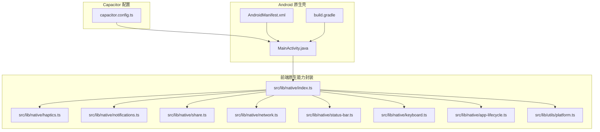
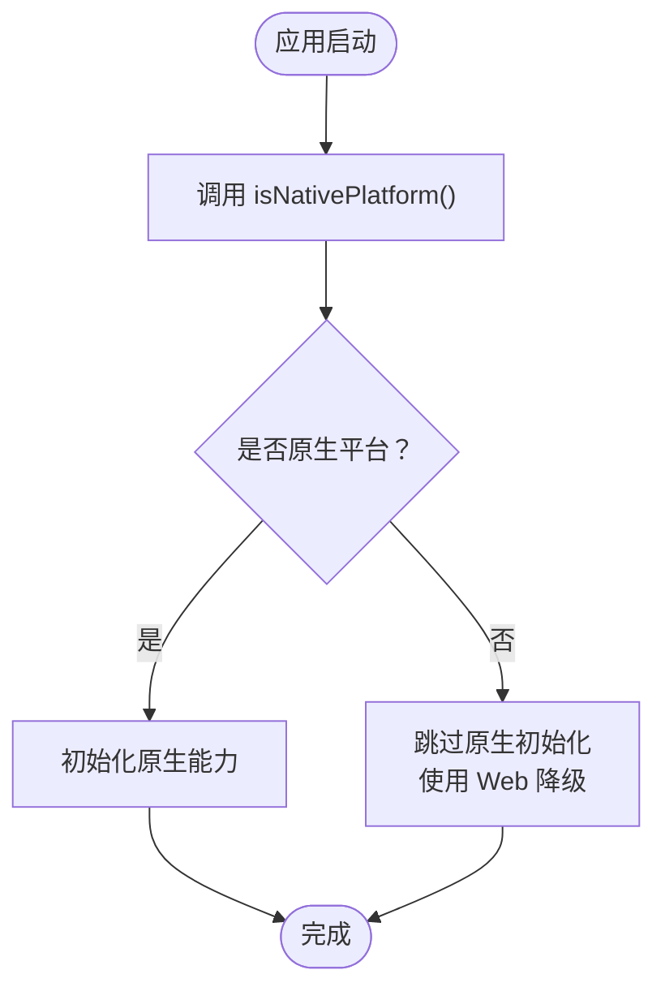
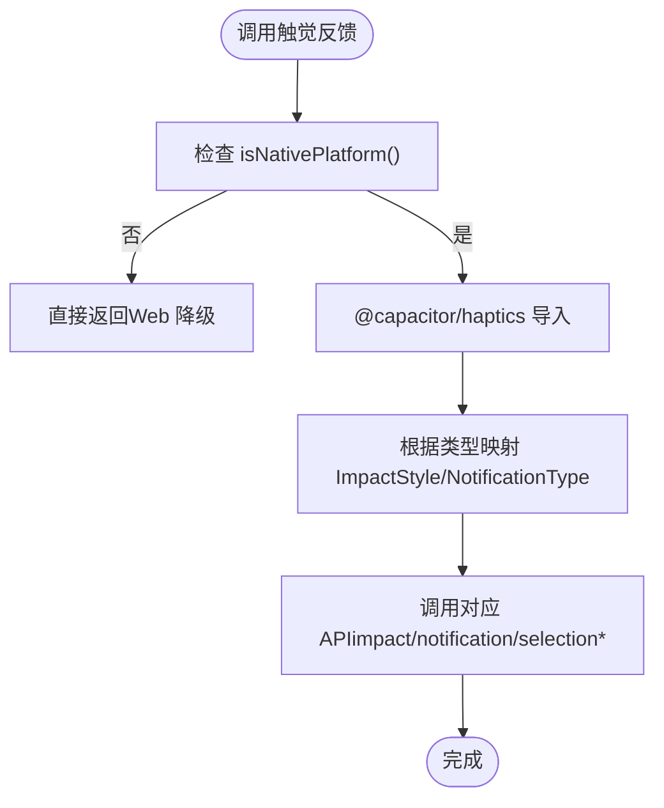
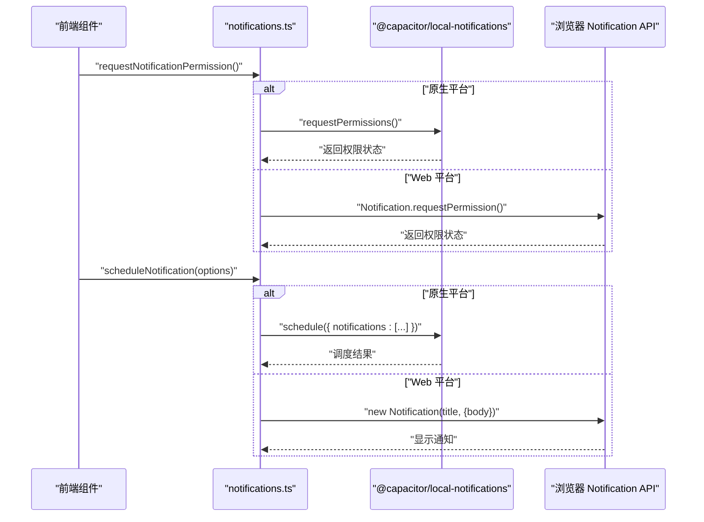
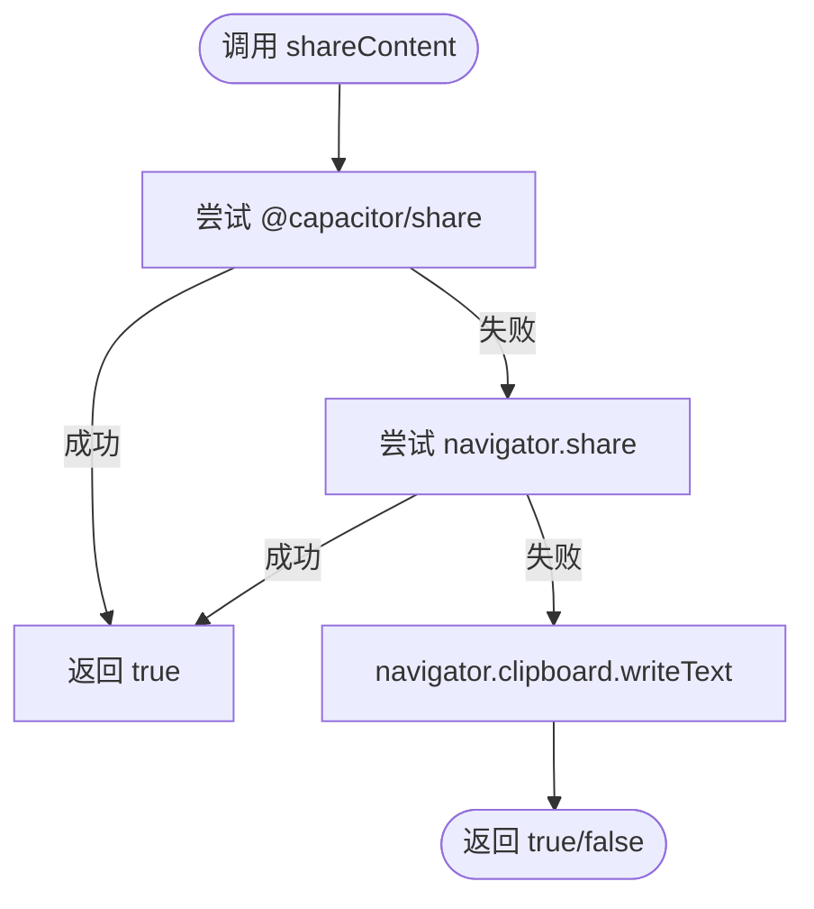
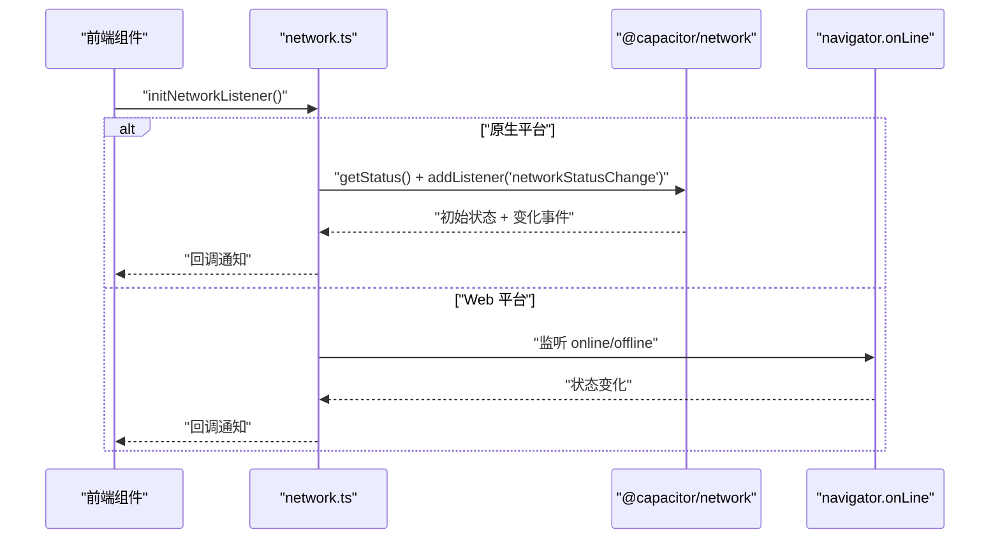
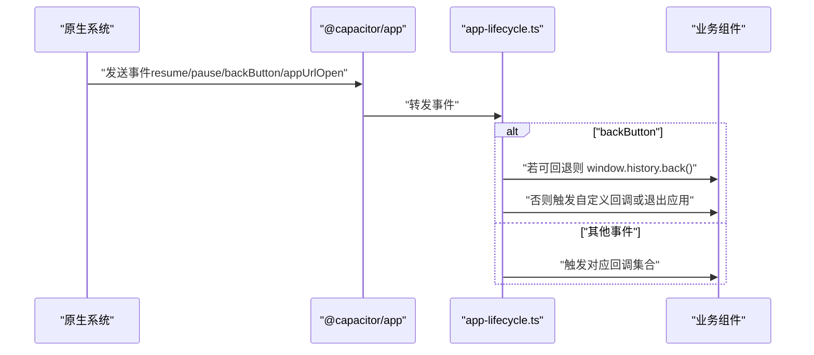
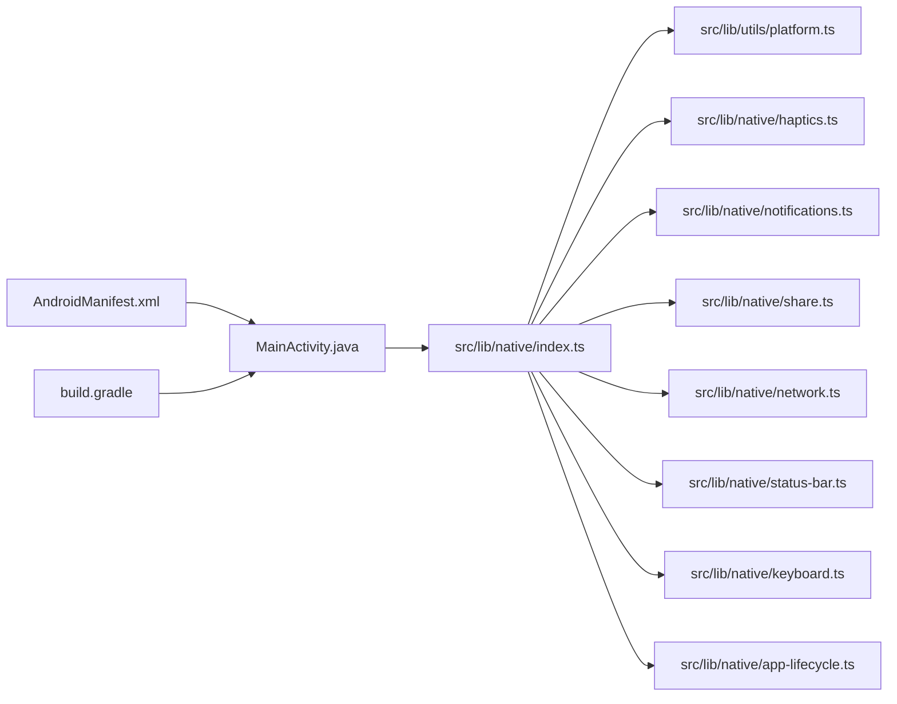

# 移动端集成架构

<cite>
**本文引用的文件**
- [capacitor.config.ts](file://capacitor.config.ts)
- [MainActivity.java](file://android/app/src/main/java/com/mindos/app/MainActivity.java)
- [AndroidManifest.xml](file://android/app/src/main/AndroidManifest.xml)
- [index.ts](file://src/lib/native/index.ts)
- [platform.ts](file://src/lib/utils/platform.ts)
- [haptics.ts](file://src/lib/native/haptics.ts)
- [notifications.ts](file://src/lib/native/notifications.ts)
- [share.ts](file://src/lib/native/share.ts)
- [network.ts](file://src/lib/native/network.ts)
- [status-bar.ts](file://src/lib/native/status-bar.ts)
- [keyboard.ts](file://src/lib/native/keyboard.ts)
- [app-lifecycle.ts](file://src/lib/native/app-lifecycle.ts)
- [build.gradle](file://android/app/build.gradle)
</cite>

## 目录
1. [引言](#引言)
2. [项目结构](#项目结构)
3. [核心组件](#核心组件)
4. [架构总览](#架构总览)
5. [详细组件分析](#详细组件分析)
6. [依赖关系分析](#依赖关系分析)
7. [性能考量](#性能考量)
8. [故障排查指南](#故障排查指南)
9. [结论](#结论)
10. [附录](#附录)

## 引言
本文件面向 life-os 移动端集成架构，聚焦 Capacitor 跨平台桥接体系在移动端的落地实践。文档围绕以下目标展开：
- 解释 Capacitor 原生桥接与插件系统，以及 JavaScript 与原生代码的通信机制
- 分析移动端特有能力：本地通知、网络状态监听、分享与外部浏览器、状态栏与键盘管理、应用生命周期与深链
- 说明平台检测机制、条件渲染策略与降级方案
- 总结性能优化、安全与权限、后台处理、调试与兼容性、发布部署等工程实践

## 项目结构
life-os 采用 Capacitor 将 Next.js 构建产物嵌入 Android/iOS 原生壳，核心结构如下：
- Capacitor 配置：集中定义应用 ID、应用名、WebView 服务器地址、平台特定参数与插件配置
- 原生壳（Android）：MainActivity 继承 BridgeActivity，AndroidManifest 声明权限与 FileProvider
- 原生能力封装：src/lib/native 下按功能模块化封装，统一通过平台检测决定是否启用原生能力
- 平台检测工具：src/lib/utils/platform.ts 提供 isNativePlatform/getPlatform/isIOS/isAndroid 等能力



图表来源
- [capacitor.config.ts:1-37](file://capacitor.config.ts#L1-L37)
- [MainActivity.java:1-6](file://android/app/src/main/java/com/mindos/app/MainActivity.java#L1-L6)
- [AndroidManifest.xml:1-53](file://android/app/src/main/AndroidManifest.xml#L1-L53)
- [index.ts:1-55](file://src/lib/native/index.ts#L1-L55)
- [platform.ts:1-60](file://src/lib/utils/platform.ts#L1-L60)

章节来源
- [capacitor.config.ts:1-37](file://capacitor.config.ts#L1-L37)
- [MainActivity.java:1-6](file://android/app/src/main/java/com/mindos/app/MainActivity.java#L1-L6)
- [AndroidManifest.xml:1-53](file://android/app/src/main/AndroidManifest.xml#L1-L53)
- [index.ts:1-55](file://src/lib/native/index.ts#L1-L55)
- [platform.ts:1-60](file://src/lib/utils/platform.ts#L1-L60)

## 核心组件
- 原生服务统一入口：initNativeServices 负责在原生平台按需初始化应用生命周期、状态栏、键盘、网络监听等能力，并进行“未安装插件”的静默降级处理
- 平台检测工具：isNativePlatform/getPlatform 提供运行时判断，确保 Web 环境下的安全降级
- 能力模块化封装：触觉反馈、本地通知、分享与外部浏览器、网络状态、状态栏、键盘、应用生命周期

章节来源
- [index.ts:1-55](file://src/lib/native/index.ts#L1-L55)
- [platform.ts:1-60](file://src/lib/utils/platform.ts#L1-L60)

## 架构总览
Capacitor 在移动端通过 BridgeActivity 与原生 WebView 交互，前端通过 @capacitor/* 插件调用原生能力，同时提供 Web 降级方案。

```mermaid
sequenceDiagram
participant UI as "前端组件"
participant INIT as "initNativeServices"
participant UTIL as "platform.ts"
participant CAP as "@capacitor/* 插件"
participant AND as "Android 原生层"
UI->>INIT : "应用启动时调用"
INIT->>UTIL : "isNativePlatform()"
UTIL-->>INIT : "返回平台标识"
alt "原生平台"
INIT->>CAP : "动态导入并调用原生能力"
CAP->>AND : "桥接到原生 API"
AND-->>CAP : "返回结果"
CAP-->>INIT : "能力执行结果"
else "Web 平台"
INIT-->>UI : "跳过原生初始化，保持静默"
end
```

图表来源
- [index.ts:19-54](file://src/lib/native/index.ts#L19-L54)
- [platform.ts:14-45](file://src/lib/utils/platform.ts#L14-L45)

## 详细组件分析

### 平台检测与条件渲染
- 作用：在运行时判断是否处于原生平台，决定是否启用原生能力或降级到 Web API
- 关键点：
  - isNativePlatform 使用 Capacitor.isNativePlatform 动态检测
  - getPlatform 返回 'ios' | 'android' | 'web'，便于平台特定逻辑
  - isIOS/isAndroid 提供便捷判断
- 条件渲染策略：所有原生能力模块均以 isNativePlatform 作为开关，Web 环境下静默降级



图表来源
- [platform.ts:14-45](file://src/lib/utils/platform.ts#L14-L45)
- [index.ts:20-25](file://src/lib/native/index.ts#L20-L25)

章节来源
- [platform.ts:1-60](file://src/lib/utils/platform.ts#L1-L60)
- [index.ts:19-25](file://src/lib/native/index.ts#L19-L25)

### 触觉反馈（Haptics）
- 能力：在原生平台触发冲击、通知、选择类触觉反馈；Web 平台静默降级
- 实现要点：
  - 支持轻/中/重三种 Impact 风格
  - 通知类型区分 success/warning/error
  - 选择类反馈分阶段调用 selectionStart/selectionChanged/selectionEnd
- 降级策略：非原生平台直接返回



图表来源
- [haptics.ts:19-33](file://src/lib/native/haptics.ts#L19-L33)
- [haptics.ts:38-52](file://src/lib/native/haptics.ts#L38-L52)
- [haptics.ts:57-68](file://src/lib/native/haptics.ts#L57-L68)

章节来源
- [haptics.ts:1-69](file://src/lib/native/haptics.ts#L1-L69)

### 本地通知（Local Notifications）
- 能力：请求权限、调度本地通知（支持定时）、取消指定/全部通知；Web 平台使用浏览器 Notification API 降级
- 实现要点：
  - requestNotificationPermission：原生调用 @capacitor/local-notifications 请求权限
  - scheduleNotification：支持 scheduledAt 定时；Web 使用 Notification API
  - cancelNotification/cancelAllNotifications：原生取消接口
- 降级策略：Web 环境下仅在权限允许时使用浏览器通知



图表来源
- [notifications.ts:24-41](file://src/lib/native/notifications.ts#L24-L41)
- [notifications.ts:46-78](file://src/lib/native/notifications.ts#L46-L78)

章节来源
- [notifications.ts:1-110](file://src/lib/native/notifications.ts#L1-L110)

### 分享与外部浏览器（Share/Browser）
- 能力：系统分享面板、在系统浏览器中打开 URL；Web 平台使用 Web Share API 或 window.open 降级
- 实现要点：
  - openInBrowser：原生 @capacitor/browser 打开，失败时回退 window.open
  - shareContent：原生 Share.share 成功返回；不支持时尝试 navigator.share；最终回退到 clipboard.writeText
- 降级策略：逐级降级，保证可用性



图表来源
- [share.ts:32-71](file://src/lib/native/share.ts#L32-L71)

章节来源
- [share.ts:1-72](file://src/lib/native/share.ts#L1-L72)

### 网络状态监听（Network）
- 能力：原生精确检测 WiFi/蜂窝/无连接；Web 使用 navigator.onLine 降级
- 实现要点：
  - initNetworkListener：原生 Network.addListener 订阅变化；失败则回退到 Web API
  - onNetworkChange：注册回调，返回取消订阅函数
  - isOnline/getNetworkStatus：提供查询接口
- 降级策略：Web 环境监听 online/offline，维护连接状态



图表来源
- [network.ts:32-62](file://src/lib/native/network.ts#L32-L62)
- [network.ts:67-82](file://src/lib/native/network.ts#L67-L82)

章节来源
- [network.ts:1-102](file://src/lib/native/network.ts#L1-L102)

### 状态栏与键盘管理
- 状态栏（StatusBar）：设置样式、Android 背景色与沉浸覆盖；失败静默降级
- 键盘（Keyboard）：设置 resize 模式为视图调整，启用滚动到输入框；失败静默降级
- 两者均通过 try/catch 包裹，避免未安装插件导致异常

章节来源
- [status-bar.ts:1-55](file://src/lib/native/status-bar.ts#L1-L55)
- [keyboard.ts:1-24](file://src/lib/native/keyboard.ts#L1-L24)

### 应用生命周期与深链
- 能力：监听 resume/pause/backButton/appUrlOpen；Android 返回键优先历史回退，否则触发回调或退出应用
- 实现要点：
  - initAppLifecycle：一次性初始化，避免重复监听
  - 回调注册返回取消函数，便于组件卸载时清理
- 用途：后台恢复刷新、深链路由、返回键拦截



图表来源
- [app-lifecycle.ts:31-66](file://src/lib/native/app-lifecycle.ts#L31-L66)

章节来源
- [app-lifecycle.ts:1-98](file://src/lib/native/app-lifecycle.ts#L1-L98)

## 依赖关系分析
- 前端原生能力依赖于 Capacitor 插件生态，通过动态导入按需加载，避免 SSR 与 Web 环境报错
- MainActivity 作为桥接入口，承载 Capacitor 生命周期与插件初始化
- AndroidManifest 声明必要权限与 FileProvider，保障文件分享与外部浏览器打开
- build.gradle 定义最小 SDK、目标 SDK、构建类型与仓库配置



图表来源
- [index.ts:1-55](file://src/lib/native/index.ts#L1-L55)
- [platform.ts:1-60](file://src/lib/utils/platform.ts#L1-L60)
- [MainActivity.java:1-6](file://android/app/src/main/java/com/mindos/app/MainActivity.java#L1-L6)
- [AndroidManifest.xml:1-53](file://android/app/src/main/AndroidManifest.xml#L1-L53)
- [build.gradle:1-31](file://android/app/build.gradle#L1-L31)

章节来源
- [index.ts:1-55](file://src/lib/native/index.ts#L1-L55)
- [MainActivity.java:1-6](file://android/app/src/main/java/com/mindos/app/MainActivity.java#L1-L6)
- [AndroidManifest.xml:1-53](file://android/app/src/main/AndroidManifest.xml#L1-L53)
- [build.gradle:1-31](file://android/app/build.gradle#L1-L31)

## 性能考量
- 按需加载与懒初始化：原生能力通过动态导入与 initNativeServices 统一初始化，减少首屏负担
- 事件订阅去重：initAppLifecycle 仅初始化一次，避免重复监听
- 降级策略：Web 环境使用浏览器原生 API，避免额外库体积
- 网络监听：原生精确检测，降低误判与无效刷新

## 故障排查指南
- 原生能力未生效
  - 检查 isNativePlatform 是否正确识别平台
  - 确认对应 Capacitor 插件已安装且版本匹配
  - 查看控制台警告日志，确认 try/catch 包裹内的降级路径
- 通知无法显示
  - 确认已请求并获得通知权限
  - 原生平台检查 LocalNotifications 配置；Web 平台检查浏览器通知权限
- 分享失败
  - 原生平台检查 Share 插件；Web 平台检查 navigator.share 支持情况
  - 若均失败，确认剪贴板写入权限
- 网络状态异常
  - 原生平台检查 @capacitor/network 插件初始化；Web 平台检查 navigator.onLine
- 状态栏/键盘问题
  - 确认插件已安装；Android 平台检查权限与主题配置

章节来源
- [index.ts:34-39](file://src/lib/native/index.ts#L34-L39)
- [notifications.ts:24-41](file://src/lib/native/notifications.ts#L24-L41)
- [share.ts:37-51](file://src/lib/native/share.ts#L37-L51)
- [network.ts:36-62](file://src/lib/native/network.ts#L36-L62)
- [status-bar.ts:12-26](file://src/lib/native/status-bar.ts#L12-L26)
- [keyboard.ts:12-23](file://src/lib/native/keyboard.ts#L12-L23)

## 结论
life-os 的移动端集成以 Capacitor 为核心，通过统一的原生服务入口与平台检测工具，实现了能力的条件启用与稳健降级。各原生能力模块职责清晰、边界明确，配合 Android 原生壳与 Manifest 权限配置，形成可维护、可扩展的跨平台架构。建议在后续迭代中持续完善插件版本管理、错误上报与性能监控，以提升稳定性与可观测性。

## 附录
- 配置参考
  - Capacitor 配置：应用 ID、应用名、服务器地址、平台参数与插件配置
  - Android 构建：最小 SDK、目标 SDK、构建类型与仓库
  - Android 清单：权限声明、FileProvider、网络配置
- 常见问题
  - 插件未安装：相关能力将静默降级，不影响应用启动
  - 权限被拒：通知与分享等能力可能不可用，需引导用户手动授权
  - 深链处理：通过 appUrlOpen 回调接入路由系统，实现内外链统一

章节来源
- [capacitor.config.ts:3-34](file://capacitor.config.ts#L3-L34)
- [build.gradle:6-12](file://android/app/build.gradle#L6-L12)
- [AndroidManifest.xml:43-52](file://android/app/src/main/AndroidManifest.xml#L43-L52)