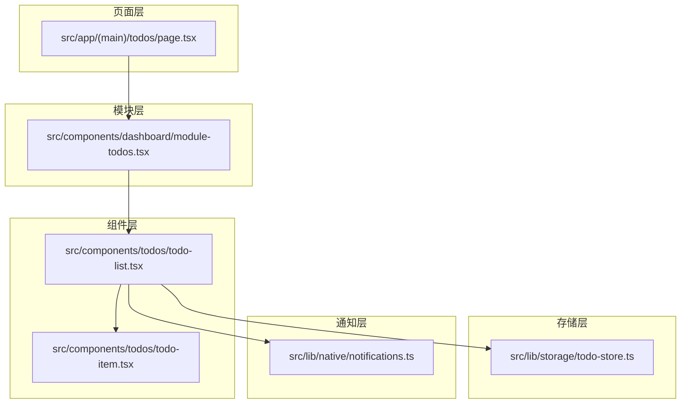
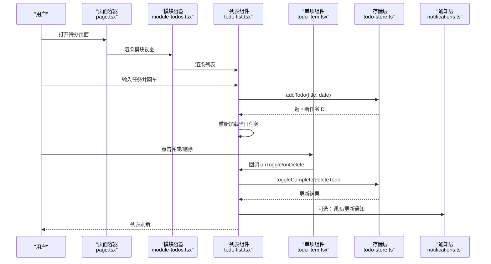
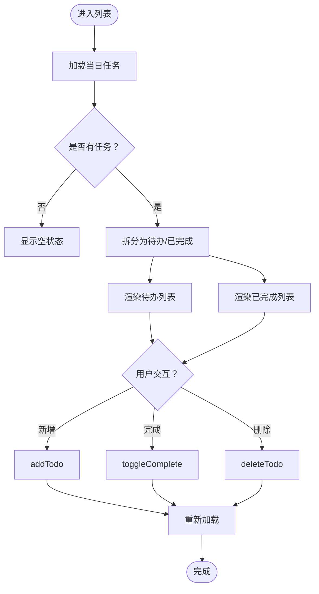
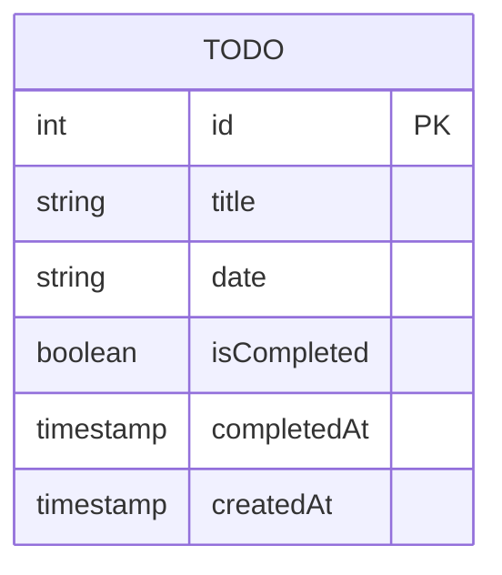
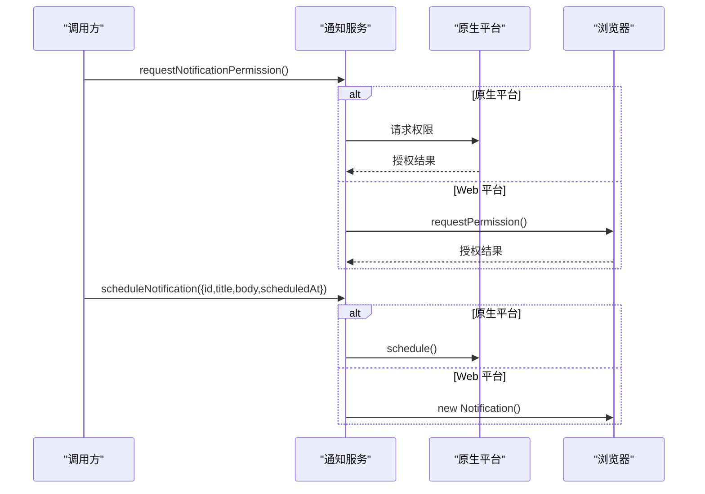
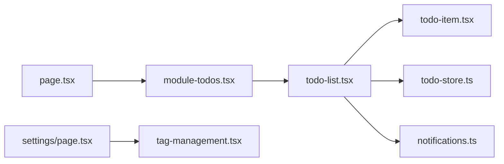

# 待办事项管理

<cite>
**本文引用的文件**
- [src/app/(main)/todos/page.tsx](file://src/app/(main)/todos/page.tsx)
- [src/components/dashboard/module-todos.tsx](file://src/components/dashboard/module-todos.tsx)
- [src/components/todos/todo-list.tsx](file://src/components/todos/todo-list.tsx)
- [src/components/todos/todo-item.tsx](file://src/components/todos/todo-item.tsx)
- [src/lib/storage/todo-store.ts](file://src/lib/storage/todo-store.ts)
- [src/lib/native/notifications.ts](file://src/lib/native/notifications.ts)
- [src/app/(main)/settings/page.tsx](file://src/app/(main)/settings/page.tsx)
- [src/components/settings/tag-management.tsx](file://src/components/settings/tag-management.tsx)
- [DESIGN.md](file://DESIGN.md)
- [src/app/(main)/reports/page.tsx](file://src/app/(main)/reports/page.tsx)
- [src/lib/db/migrations/meta/0000_snapshot.json](file://src/lib/db/migrations/meta/0000_snapshot.json)
- [vercel.json](file://vercel.json)
</cite>

## 目录
1. [简介](#简介)
2. [项目结构](#项目结构)
3. [核心组件](#核心组件)
4. [架构总览](#架构总览)
5. [详细组件分析](#详细组件分析)
6. [依赖分析](#依赖分析)
7. [性能考量](#性能考量)
8. [故障排查指南](#故障排查指南)
9. [结论](#结论)
10. [附录](#附录)

## 简介
本文件面向“待办事项管理”模块，提供从任务创建、编辑、完成到删除的完整流程说明；深入解析任务状态管理机制（待办、进行中、已完成、已取消）；解释任务优先级设计（当前仓库未实现优先级字段，但可基于现有状态扩展）；阐述任务分类与标签能力（当前仓库未实现标签字段，但提供了标签管理设置入口与相关基础设施）；说明提醒与通知机制（本地通知与Web降级）；提供统计与分析（完成率、时间追踪与效率评估）；最后给出最佳实践与工作流程建议。

## 项目结构
待办事项模块采用“页面容器 + 功能模块 + 组件 + 存储层”的分层组织方式：
- 页面层：负责导航、返回逻辑与布局
- 模块层：封装业务视图容器
- 组件层：渲染列表、单项、交互控件
- 存储层：封装 IndexedDB 访问与查询



图表来源
- [src/app/(main)/todos/page.tsx:1-52](file://src/app/(main)/todos/page.tsx#L1-L52)
- [src/components/dashboard/module-todos.tsx:1-12](file://src/components/dashboard/module-todos.tsx#L1-L12)
- [src/components/todos/todo-list.tsx:1-351](file://src/components/todos/todo-list.tsx#L1-L351)
- [src/components/todos/todo-item.tsx:1-63](file://src/components/todos/todo-item.tsx#L1-L63)
- [src/lib/storage/todo-store.ts:1-184](file://src/lib/storage/todo-store.ts#L1-L184)
- [src/lib/native/notifications.ts:1-109](file://src/lib/native/notifications.ts#L1-L109)

章节来源
- [src/app/(main)/todos/page.tsx:1-52](file://src/app/(main)/todos/page.tsx#L1-L52)
- [src/components/dashboard/module-todos.tsx:1-12](file://src/components/dashboard/module-todos.tsx#L1-L12)
- [src/components/todos/todo-list.tsx:1-351](file://src/components/todos/todo-list.tsx#L1-L351)
- [src/components/todos/todo-item.tsx:1-63](file://src/components/todos/todo-item.tsx#L1-L63)
- [src/lib/storage/todo-store.ts:1-184](file://src/lib/storage/todo-store.ts#L1-L184)
- [src/lib/native/notifications.ts:1-109](file://src/lib/native/notifications.ts#L1-L109)

## 核心组件
- 页面容器：负责返回按钮、标题与布局，承载模块视图
- 列表组件：日期导航、快速添加、批量模式、待办/已完成分区渲染
- 单项组件：复选框、标题、删除按钮，动画过渡
- 存储接口：增删改查、按日期查询、统计、周视图
- 通知服务：请求权限、调度通知、取消通知（原生平台）

章节来源
- [src/app/(main)/todos/page.tsx:9-42](file://src/app/(main)/todos/page.tsx#L9-L42)
- [src/components/todos/todo-list.tsx:36-350](file://src/components/todos/todo-list.tsx#L36-L350)
- [src/components/todos/todo-item.tsx:12-62](file://src/components/todos/todo-item.tsx#L12-L62)
- [src/lib/storage/todo-store.ts:69-183](file://src/lib/storage/todo-store.ts#L69-L183)
- [src/lib/native/notifications.ts:24-109](file://src/lib/native/notifications.ts#L24-L109)

## 架构总览
待办事项采用前端本地数据库（IndexedDB）+ 原生通知的服务架构，UI 通过 React 组件驱动，数据通过存储层抽象访问。



图表来源
- [src/app/(main)/todos/page.tsx:9-42](file://src/app/(main)/todos/page.tsx#L9-L42)
- [src/components/dashboard/module-todos.tsx:5-11](file://src/components/dashboard/module-todos.tsx#L5-L11)
- [src/components/todos/todo-list.tsx:131-148](file://src/components/todos/todo-list.tsx#L131-L148)
- [src/components/todos/todo-item.tsx:23-59](file://src/components/todos/todo-item.tsx#L23-L59)
- [src/lib/storage/todo-store.ts:69-124](file://src/lib/storage/todo-store.ts#L69-L124)
- [src/lib/native/notifications.ts:46-78](file://src/lib/native/notifications.ts#L46-L78)

## 详细组件分析

### 列表组件（任务列表与交互）
- 日期导航：支持上一日/下一日切换，格式化显示“今天/昨天/明天/周X”
- 快速添加：输入框回车提交，自动聚焦浮动按钮
- 批量模式：进入后可多选、全选/反选、批量删除
- 分区渲染：待办在前，完成后在下部分区，动画过渡
- 衍生状态：待办数、完成数、是否为空



图表来源
- [src/components/todos/todo-list.tsx:48-148](file://src/components/todos/todo-list.tsx#L48-L148)
- [src/lib/storage/todo-store.ts:69-124](file://src/lib/storage/todo-store.ts#L69-L124)

章节来源
- [src/components/todos/todo-list.tsx:36-350](file://src/components/todos/todo-list.tsx#L36-L350)
- [src/lib/storage/todo-store.ts:128-141](file://src/lib/storage/todo-store.ts#L128-L141)

### 单项组件（任务条目）
- 复选框：完成态带对勾，悬停显示删除按钮
- 标题样式：完成态半透明并带删除线
- 动画：入场/出场/移除时的平滑过渡

```mermaid
classDiagram
class TodoItem {
+props todo : {id,title,isCompleted,completedAt?}
+props onToggle(id)
+props onDelete(id)
+渲染复选框
+渲染标题
+渲染删除按钮
}
```

图表来源
- [src/components/todos/todo-item.tsx:6-10](file://src/components/todos/todo-item.tsx#L6-L10)
- [src/components/todos/todo-item.tsx:12-62](file://src/components/todos/todo-item.tsx#L12-L62)

章节来源
- [src/components/todos/todo-item.tsx:12-62](file://src/components/todos/todo-item.tsx#L12-L62)

### 存储层（IndexedDB 抽象）
- 数据模型：任务包含 id、title、date、isCompleted、completedAt、createdAt
- 索引：by-date、by-completed
- 查询：按日期获取、今日/本周任务、统计
- 排序：待办按创建时间升序；已完成按完成时间降序



图表来源
- [src/lib/storage/todo-store.ts:5-12](file://src/lib/storage/todo-store.ts#L5-L12)
- [src/lib/storage/todo-store.ts:30-44](file://src/lib/storage/todo-store.ts#L30-L44)
- [src/lib/storage/todo-store.ts:128-141](file://src/lib/storage/todo-store.ts#L128-L141)

章节来源
- [src/lib/storage/todo-store.ts:1-184](file://src/lib/storage/todo-store.ts#L1-L184)

### 通知层（本地通知）
- 权限申请：原生平台通过 Capacitor Local Notifications；Web 使用浏览器 Notification API
- 调度通知：支持按时间调度；Web 平台降级为立即显示
- 取消通知：支持按ID取消与清空待发队列



图表来源
- [src/lib/native/notifications.ts:24-78](file://src/lib/native/notifications.ts#L24-L78)

章节来源
- [src/lib/native/notifications.ts:1-109](file://src/lib/native/notifications.ts#L1-L109)

### 页面与模块容器
- 页面容器：提供返回按钮、标题与布局，支持 from 参数回退
- 模块容器：承载 TodoList，占满可视区域

章节来源
- [src/app/(main)/todos/page.tsx:9-42](file://src/app/(main)/todos/page.tsx#L9-L42)
- [src/components/dashboard/module-todos.tsx:5-11](file://src/components/dashboard/module-todos.tsx#L5-L11)

## 依赖分析
- 组件耦合：页面 → 模块 → 列表 → 单项，逐层解耦
- 存储依赖：列表组件依赖存储层提供的 CRUD 与查询方法
- 通知依赖：列表组件可调用通知服务进行提醒调度
- 设置依赖：设置页提供标签管理入口，为未来标签功能预留



图表来源
- [src/app/(main)/todos/page.tsx:7](file://src/app/(main)/todos/page.tsx#L7)
- [src/components/dashboard/module-todos.tsx:3](file://src/components/dashboard/module-todos.tsx#L3)
- [src/components/todos/todo-list.tsx:8-14](file://src/components/todos/todo-list.tsx#L8-L14)
- [src/lib/storage/todo-store.ts:1-184](file://src/lib/storage/todo-store.ts#L1-L184)
- [src/lib/native/notifications.ts:1-109](file://src/lib/native/notifications.ts#L1-L109)
- [src/app/(main)/settings/page.tsx:9](file://src/app/(main)/settings/page.tsx#L9)

章节来源
- [src/app/(main)/settings/page.tsx:12-37](file://src/app/(main)/settings/page.tsx#L12-L37)

## 性能考量
- 列表渲染：使用动画库进行入场/出场过渡，避免频繁重排
- 查询优化：按日期索引查询，减少全表扫描
- 排序策略：待办按创建时间升序，已完成按完成时间降序，保证展示顺序稳定
- 批量操作：批量删除采用逐条调用存储层接口，确保一致性；可考虑在存储层增加批量删除接口以降低网络/IO 次数

## 故障排查指南
- 无法加载任务
  - 检查 IndexedDB 初始化与索引是否存在
  - 确认按日期查询逻辑是否正确
- 完成状态异常
  - 确认 toggleComplete 是否正确设置 isCompleted 与 completedAt
- 删除失败
  - 检查 deleteTodo 的 ID 是否存在
- 通知不生效
  - 原生平台检查权限与调度参数；Web 平台检查浏览器通知权限

章节来源
- [src/lib/storage/todo-store.ts:108-124](file://src/lib/storage/todo-store.ts#L108-L124)
- [src/lib/native/notifications.ts:24-78](file://src/lib/native/notifications.ts#L24-L78)

## 结论
该待办模块以清晰的分层架构实现了任务的日常管理需求：创建、完成、删除与批量管理；通过 IndexedDB 实现本地持久化；通过通知服务提供提醒能力。当前仓库未实现优先级与标签字段，但提供了标签管理设置入口与相关基础设施，便于后续扩展。统计方面已具备今日任务统计与周视图查询能力，可进一步拓展为更丰富的报表与分析。

## 附录

### 任务状态管理机制
- 状态集合：待办、已完成
- 状态转换：
  - 创建：初始状态为“待办”
  - 完成：点击复选框切换至“已完成”，记录完成时间
  - 取消：再次点击复选框回到“待办”，清除完成时间
- 排序规则：
  - 待办：按创建时间升序
  - 已完成：按完成时间降序

章节来源
- [src/lib/storage/todo-store.ts:128-141](file://src/lib/storage/todo-store.ts#L128-L141)
- [src/components/todos/todo-item.tsx:27-37](file://src/components/todos/todo-item.tsx#L27-L37)

### 任务优先级系统设计（扩展建议）
- 当前数据模型未包含优先级字段
- 建议新增字段并在存储层与 UI 中体现
- 颜色编码：高/中/低优先级对应不同视觉提示
- 排序规则：优先级优先于创建时间
- 视觉提示：复选框或标题前缀图标

### 任务分类与标签（当前实现与扩展建议）
- 当前实现：未在任务模型中定义分类/标签字段
- 设置入口：设置页提供“标签管理”模块，为未来扩展做准备
- 基础设施：知识模块中存在标签与分类体系，可借鉴其设计思路

章节来源
- [src/app/(main)/settings/page.tsx:31](file://src/app/(main)/settings/page.tsx#L31)
- [src/components/settings/tag-management.tsx](file://src/components/settings/tag-management.tsx)

### 任务提醒与通知机制
- 权限申请：原生平台通过 Capacitor Local Notifications；Web 使用浏览器 Notification API
- 调度通知：支持按时间调度；Web 平台降级为立即显示
- 取消通知：支持按ID取消与清空待发队列

章节来源
- [src/lib/native/notifications.ts:24-109](file://src/lib/native/notifications.ts#L24-L109)

### 任务统计与分析
- 今日统计：总数、已完成、待完成
- 周视图：本周任务按创建/完成时间排序
- 报表页面：当前为空状态，可扩展为月度回顾与分析

章节来源
- [src/lib/storage/todo-store.ts:169-177](file://src/lib/storage/todo-store.ts#L169-L177)
- [src/lib/storage/todo-store.ts:147-167](file://src/lib/storage/todo-store.ts#L147-L167)
- [src/app/(main)/reports/page.tsx:4-15](file://src/app/(main)/reports/page.tsx#L4-L15)

### 最佳实践与工作流程建议
- 任务创建：每日早晨集中创建当日任务，保持清单清晰
- 优先级管理：结合颜色编码与排序规则，优先处理高优任务
- 批量操作：利用批量模式快速清理已完成或冗余任务
- 通知提醒：为重要任务设置提醒，避免遗忘
- 统计分析：定期查看完成率与时间分布，持续优化效率