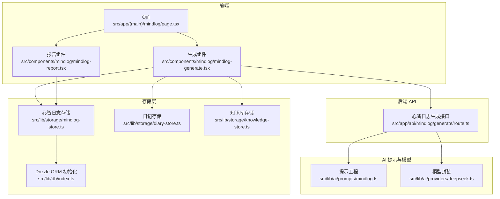
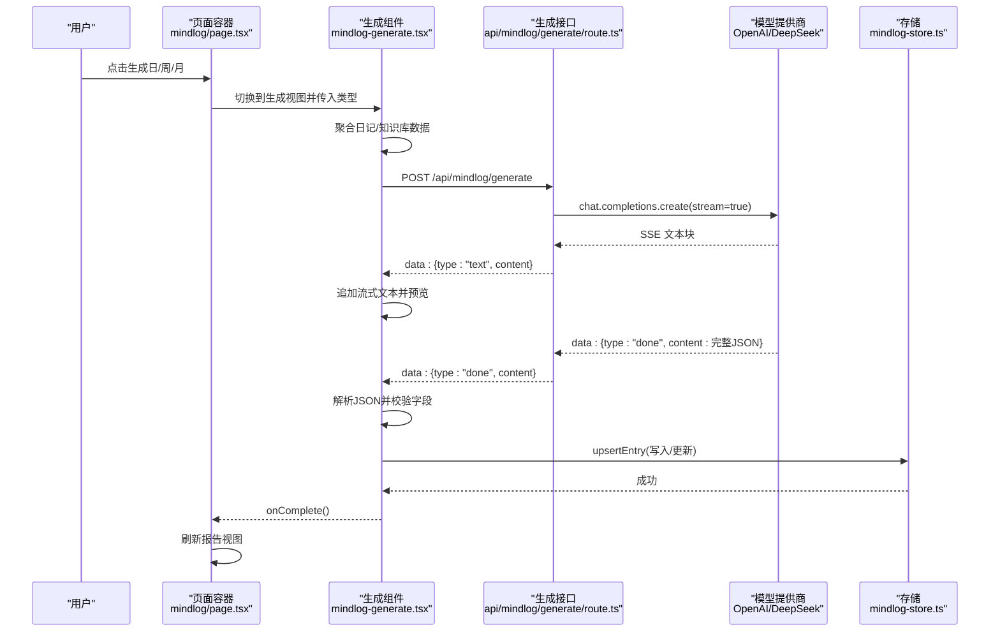
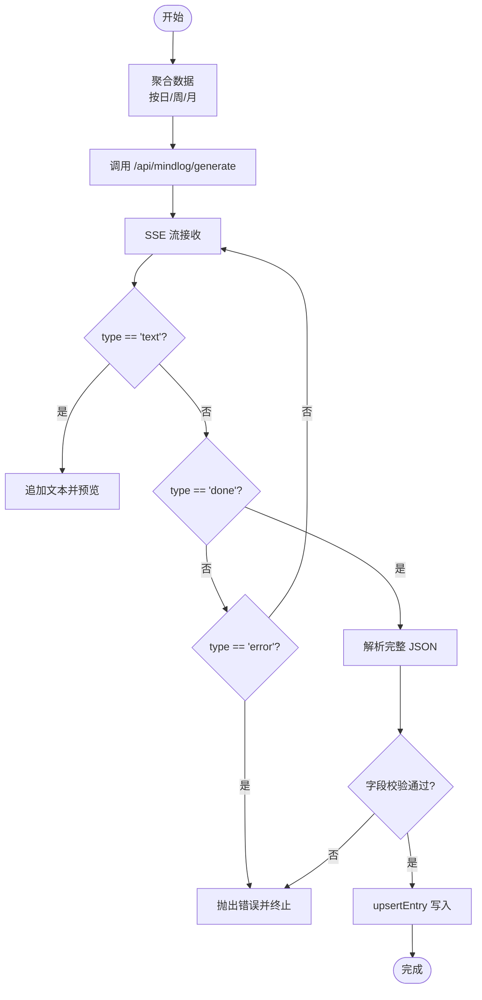
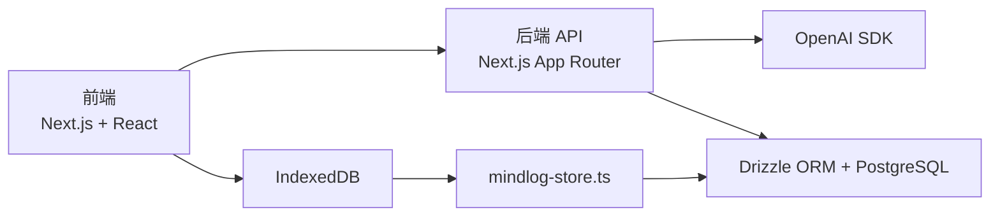

# 心智日志系统

<cite>
**本文引用的文件**
- [src/app/(main)/mindlog/page.tsx](file://src/app/(main)/mindlog/page.tsx)
- [src/components/mindlog/mindlog-generate.tsx](file://src/components/mindlog/mindlog-generate.tsx)
- [src/components/mindlog/mindlog-report.tsx](file://src/components/mindlog/mindlog-report.tsx)
- [src/app/api/mindlog/generate/route.ts](file://src/app/api/mindlog/generate/route.ts)
- [src/lib/ai/prompts/mindlog.ts](file://src/lib/ai/prompts/mindlog.ts)
- [src/lib/storage/mindlog-store.ts](file://src/lib/storage/mindlog-store.ts)
- [src/lib/storage/diary-store.ts](file://src/lib/storage/diary-store.ts)
- [src/lib/storage/knowledge-store.ts](file://src/lib/storage/knowledge-store.ts)
- [src/lib/db/index.ts](file://src/lib/db/index.ts)
- [package.json](file://package.json)
</cite>

## 目录
1. [简介](#简介)
2. [项目结构](#项目结构)
3. [核心组件](#核心组件)
4. [架构总览](#架构总览)
5. [详细组件分析](#详细组件分析)
6. [依赖分析](#依赖分析)
7. [性能考虑](#性能考虑)
8. [故障排查指南](#故障排查指南)
9. [结论](#结论)
10. [附录](#附录)

## 简介
心智日志系统是一个由 AI 驱动的心智反思与生成平台，面向个人心智成长与元认知实践。系统通过聚合日记与知识库操作等心智素材，按日/周/月三个时间维度生成结构化的心智日志，提供流式生成、实时反馈与错误恢复，并将结果持久化至 IndexedDB，支持报告页查看与后续迭代。

系统特色：
- AI 驱动的心智反思生成算法：基于提示工程、上下文构建与输出约束，确保生成内容结构化、可读性强。
- 多时间维度分析：日度聚焦“当日心智快照”，周度强调“情绪流与模式”，月度呈现“心智地貌与迁移”。
- 流式处理机制：采用 SSE 实时传输，前端即时展示，支持中断与恢复。
- 日志摘要与洞察：结构化输出板块与关键词，便于快速浏览与检索。
- 报告导出能力：提供 PDF 生成、模板定制与批量处理的扩展接口（当前仓库未包含具体实现，但具备良好扩展基础）。
- 模型选择与配置：按日/周/月选择不同模型与 API Key，支持参数调优与性能优化。

## 项目结构
系统采用 Next.js App Router 架构，前端组件位于 src/components 与 src/app 下，AI 提示与存储逻辑位于 src/lib 中，数据库访问通过 Drizzle ORM 与 IndexedDB 封装实现。

**图表来源**
- [src/app/(main)/mindlog/page.tsx:1-91](file://src/app/(main)/mindlog/page.tsx#L1-L91)
- [src/components/mindlog/mindlog-generate.tsx:1-436](file://src/components/mindlog/mindlog-generate.tsx#L1-L436)
- [src/components/mindlog/mindlog-report.tsx:1-234](file://src/components/mindlog/mindlog-report.tsx#L1-L234)
- [src/app/api/mindlog/generate/route.ts:1-107](file://src/app/api/mindlog/generate/route.ts#L1-L107)
- [src/lib/ai/prompts/mindlog.ts:1-190](file://src/lib/ai/prompts/mindlog.ts#L1-L190)
- [src/lib/storage/mindlog-store.ts:1-95](file://src/lib/storage/mindlog-store.ts#L1-L95)
- [src/lib/storage/diary-store.ts:1-237](file://src/lib/storage/diary-store.ts#L1-L237)
- [src/lib/storage/knowledge-store.ts:1-611](file://src/lib/storage/knowledge-store.ts#L1-L611)
- [src/lib/db/index.ts:1-11](file://src/lib/db/index.ts#L1-L11)

**章节来源**
- [src/app/(main)/mindlog/page.tsx:1-91](file://src/app/(main)/mindlog/page.tsx#L1-L91)
- [src/components/mindlog/mindlog-generate.tsx:1-436](file://src/components/mindlog/mindlog-generate.tsx#L1-L436)
- [src/components/mindlog/mindlog-report.tsx:1-234](file://src/components/mindlog/mindlog-report.tsx#L1-L234)
- [src/app/api/mindlog/generate/route.ts:1-107](file://src/app/api/mindlog/generate/route.ts#L1-L107)
- [src/lib/ai/prompts/mindlog.ts:1-190](file://src/lib/ai/prompts/mindlog.ts#L1-L190)
- [src/lib/storage/mindlog-store.ts:1-95](file://src/lib/storage/mindlog-store.ts#L1-L95)
- [src/lib/storage/diary-store.ts:1-237](file://src/lib/storage/diary-store.ts#L1-L237)
- [src/lib/storage/knowledge-store.ts:1-611](file://src/lib/storage/knowledge-store.ts#L1-L611)
- [src/lib/db/index.ts:1-11](file://src/lib/db/index.ts#L1-L11)

## 核心组件
- 页面容器与路由控制：负责在“报告视图”与“生成视图”之间切换，触发生成流程并处理完成/错误回调。
- 生成组件：负责数据聚合、SSE 流式接收、中间态展示与最终保存。
- 报告组件：按日/周/月 Tab 展示历史心智日志，解析结构化内容并渲染卡片。
- 生成接口：根据类型选择模型与 API Key，构建提示并以 SSE 返回流。
- 提示工程：定义日/周/月三类 MindLog 的系统提示与用户提示结构。
- 存储层：IndexedDB 存储心智日志条目，支持按类型与时间段查询与去重写入。
- 数据源：日记与知识库操作，作为心智素材输入。

**章节来源**
- [src/app/(main)/mindlog/page.tsx:23-91](file://src/app/(main)/mindlog/page.tsx#L23-L91)
- [src/components/mindlog/mindlog-generate.tsx:17-180](file://src/components/mindlog/mindlog-generate.tsx#L17-L180)
- [src/components/mindlog/mindlog-report.tsx:19-97](file://src/components/mindlog/mindlog-report.tsx#L19-L97)
- [src/app/api/mindlog/generate/route.ts:22-107](file://src/app/api/mindlog/generate/route.ts#L22-L107)
- [src/lib/ai/prompts/mindlog.ts:26-190](file://src/lib/ai/prompts/mindlog.ts#L26-L190)
- [src/lib/storage/mindlog-store.ts:5-95](file://src/lib/storage/mindlog-store.ts#L5-L95)

## 架构总览
系统采用前后端分离的流式生成架构：前端发起生成请求，后端以 SSE 持续推送增量文本，前端边接收边展示，完成后解析 JSON 并持久化。

**图表来源**
- [src/app/(main)/mindlog/page.tsx:37-51](file://src/app/(main)/mindlog/page.tsx#L37-L51)
- [src/components/mindlog/mindlog-generate.tsx:35-123](file://src/components/mindlog/mindlog-generate.tsx#L35-L123)
- [src/app/api/mindlog/generate/route.ts:61-106](file://src/app/api/mindlog/generate/route.ts#L61-L106)
- [src/lib/storage/mindlog-store.ts:84-94](file://src/lib/storage/mindlog-store.ts#L84-L94)

## 详细组件分析

### 页面容器与视图切换
- 功能职责：管理“报告视图”与“生成视图”的切换，传递生成类型，处理完成与错误回调。
- 关键交互：点击生成按钮后进入生成态；完成后通过重新挂载报告组件刷新数据。
- 错误处理：捕获生成错误并回退到报告视图。

**章节来源**
- [src/app/(main)/mindlog/page.tsx:23-91](file://src/app/(main)/mindlog/page.tsx#L23-L91)

### 生成组件：数据聚合、流式接收与保存
- 数据聚合：
  - 日度：优先昨日，若无则回退到今日；聚合日记、知识库操作与创作文章。
  - 周度：计算本周周一至周日，汇总最近若干日的 MindLog 与日记/知识库计数。
  - 月度：计算当月首末日，汇总最近若干周的周报与统计。
- 流式接收：
  - 发起 POST 请求到 /api/mindlog/generate，读取 SSE 流，逐块解析 JSON。
  - 支持 type: 'text' 与 'done'，错误通过 type: 'error' 通知。
  - 实时预览：提取 content 片段或 keywords 作为预览。
- 保存与完成：
  - 校验 JSON 包含 keywords/content/dashboardSummary。
  - upsert 写入存储，触发 onComplete 回调。

**图表来源**
- [src/components/mindlog/mindlog-generate.tsx:35-123](file://src/components/mindlog/mindlog-generate.tsx#L35-L123)
- [src/components/mindlog/mindlog-generate.tsx:184-373](file://src/components/mindlog/mindlog-generate.tsx#L184-L373)
- [src/lib/storage/mindlog-store.ts:84-94](file://src/lib/storage/mindlog-store.ts#L84-L94)

**章节来源**
- [src/components/mindlog/mindlog-generate.tsx:17-180](file://src/components/mindlog/mindlog-generate.tsx#L17-L180)
- [src/components/mindlog/mindlog-generate.tsx:184-436](file://src/components/mindlog/mindlog-generate.tsx#L184-L436)

### 报告组件：多时间维度展示与内容解析
- Tab 切换：支持 daily/weekly/monthly 三种类型，按类型加载最近条目。
- 内容解析：将结构化文本按“**标题**：正文”解析为多个板块，支持斜体“迭代微词”样式。
- 空状态：当无历史记录时，引导用户生成相应周期的心智日志。

**章节来源**
- [src/components/mindlog/mindlog-report.tsx:19-234](file://src/components/mindlog/mindlog-report.tsx#L19-L234)

### 生成接口：提示构建与模型调用
- 模型选择：
  - 日度：deepseek/deepseek-v4-flash
  - 周/月度：deepseek/deepseek-v4-pro
- 提示构建：根据类型调用对应的 buildXxxMindlogPrompt，生成 system 与 user。
- SSE 返回：逐块发送增量文本，最后发送 done 事件携带完整 JSON。

**章节来源**
- [src/app/api/mindlog/generate/route.ts:22-107](file://src/app/api/mindlog/generate/route.ts#L22-L107)

### 提示工程：日/周/月结构化输出
- 日度：关键词、反复心念、主导情绪流、汇聚洞见、模式提醒、迭代微词、仪表盘摘要。
- 周度：关键词、反复心念、主导情绪流、汇聚洞见、模式提醒、迭代微词、仪表盘摘要。
- 月度：关键词、心智地貌、核心张力、认知迁移、暗涌与伏笔、迭代微词、仪表盘摘要。
- 输出格式：严格 JSON，包含 keywords、content、dashboardSummary。

**章节来源**
- [src/lib/ai/prompts/mindlog.ts:26-190](file://src/lib/ai/prompts/mindlog.ts#L26-L190)

### 存储层：心智日志与数据源
- 心智日志存储：IndexedDB，索引按 type、[type, periodStart]、createdAt，支持 upsert 去重。
- 日记存储：IndexedDB，索引按创建时间与情绪标签，支持周/最近 N 天查询。
- 知识库存储：IndexedDB，索引按类型、标签、外部 ID、来源集合，支持关系链接与统计。

**章节来源**
- [src/lib/storage/mindlog-store.ts:5-95](file://src/lib/storage/mindlog-store.ts#L5-L95)
- [src/lib/storage/diary-store.ts:46-207](file://src/lib/storage/diary-store.ts#L46-L207)
- [src/lib/storage/knowledge-store.ts:106-172](file://src/lib/storage/knowledge-store.ts#L106-L172)

## 依赖分析
- 前端依赖：Next.js、Framer Motion、OpenAI SDK、idb、Iron Session 等。
- 后端运行时：Node.js，最大执行时长限制为 60 秒。
- 数据库：Drizzle ORM 与 PostgreSQL（生产环境可替换为 Neon Serverless），以及 IndexedDB（客户端存储）。

**图表来源**
- [package.json:20-62](file://package.json#L20-L62)
- [src/app/api/mindlog/generate/route.ts:12-13](file://src/app/api/mindlog/generate/route.ts#L12-L13)
- [src/lib/db/index.ts:1-11](file://src/lib/db/index.ts#L1-L11)

**章节来源**
- [package.json:1-91](file://package.json#L1-L91)
- [src/app/api/mindlog/generate/route.ts:12-13](file://src/app/api/mindlog/generate/route.ts#L12-L13)
- [src/lib/db/index.ts:1-11](file://src/lib/db/index.ts#L1-L11)

## 性能考虑
- 流式传输：SSE 降低首字节延迟，前端即时预览，提升感知性能。
- 本地存储：IndexedDB 读写在客户端，减少网络往返；按索引查询避免全表扫描。
- 数据聚合范围：日/周/月聚合限制查询数量（如最近 200/500 条），避免超大数据集影响性能。
- 模型选择：日度使用轻量模型，周/月度使用更强模型，平衡成本与质量。
- 超时与中断：接口最大执行时长限制为 60 秒；前端支持 AbortController 中断生成。

[本节为通用性能建议，不直接分析具体文件]

## 故障排查指南
- 生成失败：
  - 检查 /api/mindlog/generate/route.ts 是否正确接收 type 与 data。
  - 确认 DEEPSEEK_API_KEY/DEEPSEEK_PRO_API_KEY 已配置。
  - 查看前端控制台错误与 onError 回调。
- SSE 无响应：
  - 确认接口返回 Content-Type: text/event-stream。
  - 检查网络代理与跨域设置。
- JSON 格式异常：
  - 生成接口要求严格 JSON 输出；前端解析失败会提示“AI 返回格式异常，无法解析”。
- 数据为空：
  - 确认 IndexedDB 是否存在条目；检查 mindlog-store.ts 的 listByType 与 upsertEntry。
- 依赖缺失：
  - 确认 package.json 中 openai、idb、drizzle-orm 等依赖已安装。

**章节来源**
- [src/app/api/mindlog/generate/route.ts:26-51](file://src/app/api/mindlog/generate/route.ts#L26-L51)
- [src/components/mindlog/mindlog-generate.tsx:118-123](file://src/components/mindlog/mindlog-generate.tsx#L118-L123)
- [src/lib/storage/mindlog-store.ts:69-77](file://src/lib/storage/mindlog-store.ts#L69-L77)

## 结论
心智日志系统通过清晰的分层设计与流式生成机制，实现了从数据聚合到结构化输出的完整心智反思闭环。提示工程与模型配置确保了输出质量与一致性，而 IndexedDB 与 Drizzle ORM 的结合提供了良好的本地与云端存储能力。未来可在报告导出（PDF/模板/批量）、情感分析与洞察挖掘方面进一步增强，以满足更复杂的使用场景。

[本节为总结性内容，不直接分析具体文件]

## 附录

### AI 模型选择与配置指南
- 模型选择策略：
  - 日度：deepseek-v4-flash（更快、成本更低）
  - 周/月度：deepseek-v4-pro（更强推理能力）
- 配置项：
  - DEEPSEEK_API_KEY：日度模型密钥
  - DEEPSEEK_PRO_API_KEY：周/月度模型密钥
  - baseURL：统一指向 https://api.ofox.ai/v1
- 参数调优建议：
  - temperature：0.7（兼顾创造与稳定）
  - max_tokens：2048（避免截断）
  - stream：开启以启用 SSE

**章节来源**
- [src/app/api/mindlog/generate/route.ts:30-74](file://src/app/api/mindlog/generate/route.ts#L30-L74)

### 日志摘要生成逻辑
- 关键信息提取：从 JSON 中抽取 keywords 与 content。
- 情感分析：通过日记情绪标签与周度情绪流描述体现。
- 洞察发现：反复心念、模式提醒、认知迁移等板块引导深度反思。

**章节来源**
- [src/lib/ai/prompts/mindlog.ts:106-183](file://src/lib/ai/prompts/mindlog.ts#L106-L183)

### 报告导出能力（扩展建议）
- 当前状态：仓库未包含 PDF 生成、模板定制与批量处理的具体实现。
- 扩展思路：
  - 基于 HTML-to-Print（如 Puppeteer）生成 PDF。
  - 设计可定制模板（关键词、板块顺序、配色）。
  - 批量导出：按日/周/月筛选并合并为单一报告。
- 存储与索引：利用 mindlog-store.ts 的按类型与时间段查询能力，支撑导出筛选。

**章节来源**
- [src/lib/storage/mindlog-store.ts:69-77](file://src/lib/storage/mindlog-store.ts#L69-L77)

### 实际使用场景与效果评估
- 场景示例：
  - 日度：快速回顾当日心智状态，捕捉“反复心念”与“模式提醒”。
  - 周度：梳理一周情绪轨迹与认知变化，形成“迭代微词”指引。
  - 月度：审视心智地貌与迁移，识别深层张力与新方向。
- 评估方法：
  - 可读性：关键词是否准确、板块是否清晰。
  - 价值感：是否提供可执行的“迭代微词”。
  - 一致性：同类型输出格式稳定，便于对比。
  - 用户反馈：通过问卷或日志记录主观评分。

[本节为概念性内容，不直接分析具体文件]