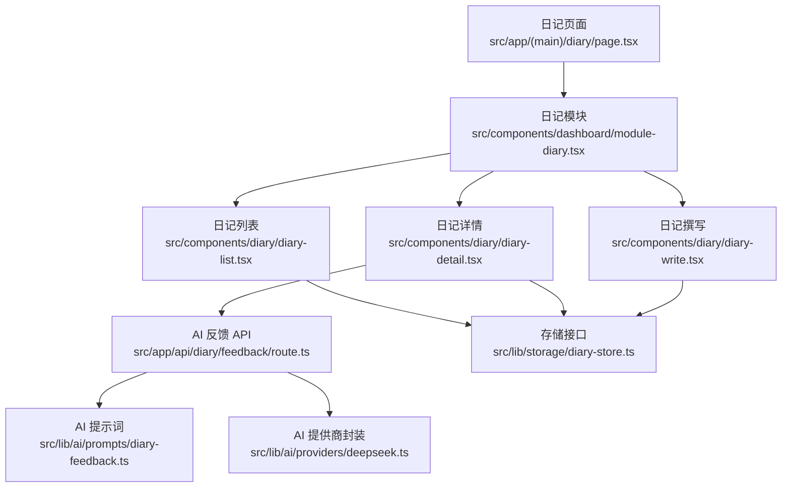
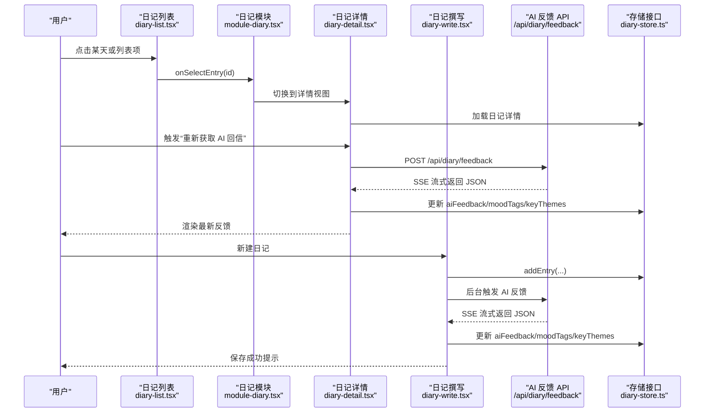
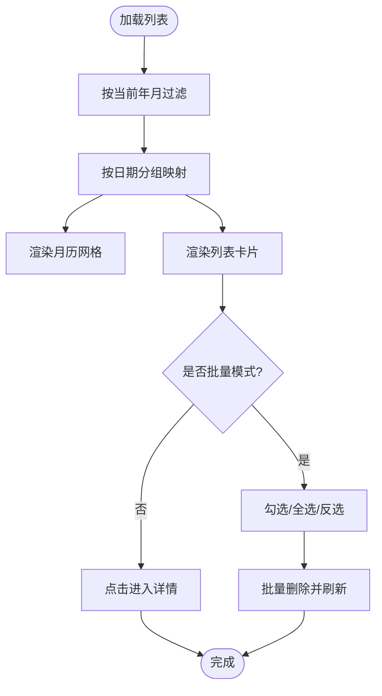
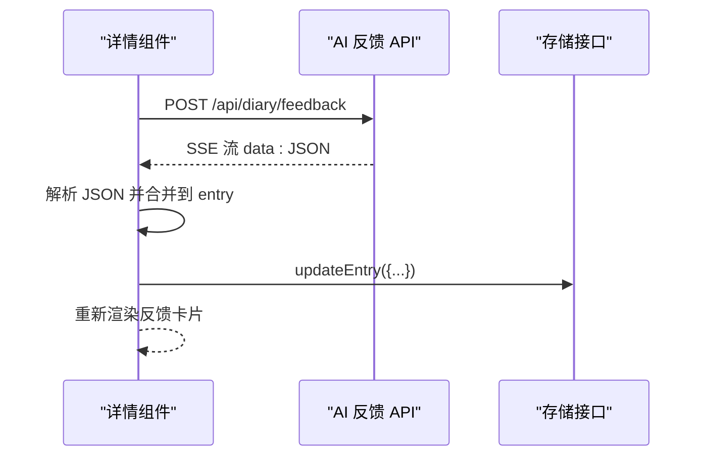
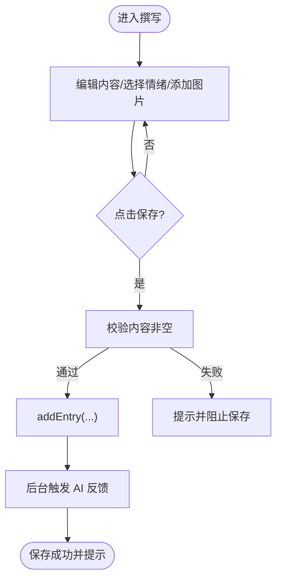
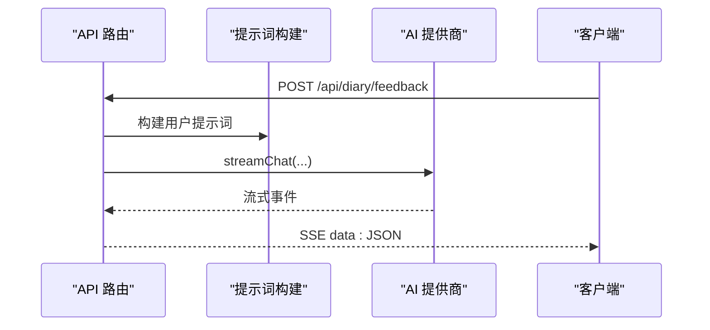
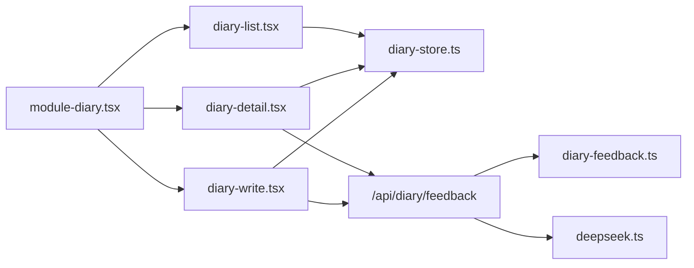

# 日记管理系统

<cite>
**本文引用的文件**
- [src/app/(main)/diary/page.tsx](file://src/app/(main)/diary/page.tsx)
- [src/components/dashboard/module-diary.tsx](file://src/components/dashboard/module-diary.tsx)
- [src/components/diary/diary-list.tsx](file://src/components/diary/diary-list.tsx)
- [src/components/diary/diary-detail.tsx](file://src/components/diary/diary-detail.tsx)
- [src/components/diary/diary-write.tsx](file://src/components/diary/diary-write.tsx)
- [src/app/api/diary/feedback/route.ts](file://src/app/api/diary/feedback/route.ts)
- [src/lib/storage/diary-store.ts](file://src/lib/storage/diary-store.ts)
- [src/lib/ai/prompts/diary-feedback.ts](file://src/lib/ai/prompts/diary-feedback.ts)
- [src/lib/ai/providers/deepseek.ts](file://src/lib/ai/providers/deepseek.ts)
</cite>

## 目录
1. [简介](#简介)
2. [项目结构](#项目结构)
3. [核心组件](#核心组件)
4. [架构总览](#架构总览)
5. [详细组件分析](#详细组件分析)
6. [依赖关系分析](#依赖关系分析)
7. [性能考量](#性能考量)
8. [故障排查指南](#故障排查指南)
9. [结论](#结论)
10. [附录](#附录)

## 简介
本系统是一个基于 Web 的日记管理应用，提供日记的浏览、撰写、编辑、删除与搜索能力，并内置“未来回音”AI反馈模块，支持情绪标签、关键词主题与媒体附件的管理。前端采用 Next.js App Router 与 React 客户端组件，后端通过 API 路由提供流式 AI 推理服务。

## 项目结构
- 页面入口：日记页面负责承载日记模块，包含返回栏与内容容器。
- 模块编排：日记模块根据当前视图状态在列表、撰写、详情之间切换。
- 组件层：列表、详情、撰写三个核心 UI 组件分别承担不同职责。
- 存储层：统一的日记存储接口封装了增删改查与索引库交互。
- AI 层：提供“未来回音”反馈的系统提示词与流式推理实现。

图表来源
- [src/app/(main)/diary/page.tsx:1-53](file://src/app/(main)/diary/page.tsx#L1-L53)
- [src/components/dashboard/module-diary.tsx:1-53](file://src/components/dashboard/module-diary.tsx#L1-L53)
- [src/components/diary/diary-list.tsx:1-400](file://src/components/diary/diary-list.tsx#L1-L400)
- [src/components/diary/diary-detail.tsx:1-522](file://src/components/diary/diary-detail.tsx#L1-L522)
- [src/components/diary/diary-write.tsx:1-311](file://src/components/diary/diary-write.tsx#L1-L311)
- [src/app/api/diary/feedback/route.ts:1-26](file://src/app/api/diary/feedback/route.ts#L1-L26)
- [src/lib/storage/diary-store.ts](file://src/lib/storage/diary-store.ts)
- [src/lib/ai/prompts/diary-feedback.ts](file://src/lib/ai/prompts/diary-feedback.ts)
- [src/lib/ai/providers/deepseek.ts](file://src/lib/ai/providers/deepseek.ts)

章节来源
- [src/app/(main)/diary/page.tsx:1-53](file://src/app/(main)/diary/page.tsx#L1-L53)
- [src/components/dashboard/module-diary.tsx:1-53](file://src/components/dashboard/module-diary.tsx#L1-L53)

## 核心组件
- 日记模块：根据初始参数决定进入列表或详情视图，负责在列表、撰写、详情间切换。
- 日记列表：按月历与列表双视图展示日记，支持批量选择与删除、日期点击跳转。
- 日记详情：支持编辑、删除、图片预览大图、AI 反馈卡片与重新获取。
- 日记撰写：支持多情绪标签选择、富文本输入、图片上传压缩、后台触发 AI 反馈。
- AI 反馈 API：接收内容与情绪标签，构建提示词并通过流式接口返回结果。

章节来源
- [src/components/dashboard/module-diary.tsx:14-52](file://src/components/dashboard/module-diary.tsx#L14-L52)
- [src/components/diary/diary-list.tsx:48-399](file://src/components/diary/diary-list.tsx#L48-L399)
- [src/components/diary/diary-detail.tsx:63-521](file://src/components/diary/diary-detail.tsx#L63-L521)
- [src/components/diary/diary-write.tsx:95-311](file://src/components/diary/diary-write.tsx#L95-L311)
- [src/app/api/diary/feedback/route.ts:8-25](file://src/app/api/diary/feedback/route.ts#L8-L25)

## 架构总览
系统采用前后端分离的流式处理架构：前端负责 UI 与交互，后端通过 API 路由提供流式 AI 推理，存储层统一封装 IndexedDB 访问。

图表来源
- [src/components/diary/diary-list.tsx:169-174](file://src/components/diary/diary-list.tsx#L169-L174)
- [src/components/dashboard/module-diary.tsx:24-28](file://src/components/dashboard/module-diary.tsx#L24-L28)
- [src/components/diary/diary-detail.tsx:140-201](file://src/components/diary/diary-detail.tsx#L140-L201)
- [src/components/diary/diary-write.tsx:143-169](file://src/components/diary/diary-write.tsx#L143-L169)
- [src/app/api/diary/feedback/route.ts:8-25](file://src/app/api/diary/feedback/route.ts#L8-L25)
- [src/lib/storage/diary-store.ts](file://src/lib/storage/diary-store.ts)

## 详细组件分析

### 数据模型与业务规则
- 日记条目字段
  - 内容：字符串，必填校验。
  - 情绪标签：字符串数组，最多 3 个，用于颜色标记与筛选。
  - 关键主题：字符串数组，用于 AI 总结与检索。
  - 媒体附件：图片 URL 数组，最多 8 张，保存前进行压缩。
  - 字数统计：实时计算，用于展示。
  - 创建/更新时间：自动维护。
- 业务规则
  - 保存时必须有内容；图片数量限制；情绪标签最多 3 个。
  - 详情页支持编辑保存，图片可移除；支持删除确认。
  - 列表按月筛选显示；支持批量选择与删除；日期格子带情绪色点提示。

章节来源
- [src/components/diary/diary-write.tsx:19-21](file://src/components/diary/diary-write.tsx#L19-L21)
- [src/components/diary/diary-write.tsx:97-103](file://src/components/diary/diary-write.tsx#L97-L103)
- [src/components/diary/diary-list.tsx:19-30](file://src/components/diary/diary-list.tsx#L19-L30)
- [src/components/diary/diary-list.tsx:64-69](file://src/components/diary/diary-list.tsx#L64-L69)
- [src/components/diary/diary-detail.tsx:109-125](file://src/components/diary/diary-detail.tsx#L109-L125)

### 日记列表展示逻辑、排序与过滤
- 展示逻辑
  - 顶部月历：根据当前年月生成网格，空单元位补齐，有日记的日期格子显示情绪色点。
  - 列表：按创建时间倒序展示，首行截断显示标题，其余行显示第二行摘要。
- 排序方式
  - 列表默认按创建时间降序排列。
- 过滤机制
  - 仅显示当前年月的日记；点击日期格子跳转到该日第一条日记。
- 批量管理
  - 支持全选/反选/删除；删除前二次确认；删除后刷新列表。

图表来源
- [src/components/diary/diary-list.tsx:61-80](file://src/components/diary/diary-list.tsx#L61-L80)
- [src/components/diary/diary-list.tsx:152-174](file://src/components/diary/diary-list.tsx#L152-L174)
- [src/components/diary/diary-list.tsx:114-131](file://src/components/diary/diary-list.tsx#L114-L131)

章节来源
- [src/components/diary/diary-list.tsx:48-399](file://src/components/diary/diary-list.tsx#L48-L399)

### 日记详情页渲染逻辑与交互
- 渲染逻辑
  - 顶部返回与日期标题；情绪标签展示；正文内容；图片网格；底部字数与时长；AI 反馈卡片。
- 富文本编辑器集成
  - 使用原生 textarea 实现富文本体验（换行保留、自动聚焦）。
- 媒体附件处理
  - 编辑态支持添加/移除图片；预览态支持点击大图浏览，左右切换。
- AI 反馈
  - 支持“获取/重新获取”；流式解析 JSON；更新本地缓存并回显。

图表来源
- [src/components/diary/diary-detail.tsx:140-201](file://src/components/diary/diary-detail.tsx#L140-L201)
- [src/app/api/diary/feedback/route.ts:8-25](file://src/app/api/diary/feedback/route.ts#L8-L25)

章节来源
- [src/components/diary/diary-detail.tsx:63-521](file://src/components/diary/diary-detail.tsx#L63-L521)

### 日记撰写流程与 AI 反馈
- 情绪标签选择：最多 3 个，点击切换。
- 文本输入：占位符提示，字数统计。
- 图片上传：最多 8 张，自动压缩；支持移除。
- 保存：调用存储接口新增条目；后台静默触发 AI 反馈，不阻塞用户。
- AI 反馈：解析流式 JSON，更新条目字段。

图表来源
- [src/components/diary/diary-write.tsx:143-169](file://src/components/diary/diary-write.tsx#L143-L169)
- [src/components/diary/diary-write.tsx:24-79](file://src/components/diary/diary-write.tsx#L24-L79)

章节来源
- [src/components/diary/diary-write.tsx:95-311](file://src/components/diary/diary-write.tsx#L95-L311)

### AI 反馈系统实现原理
- 输入：内容与情绪标签。
- 提示词：系统提示词 + 用户提示词构建。
- 推理：通过提供商封装发起流式对话。
- 输出：SSE 流式事件，逐段拼接 JSON，解析后更新条目。

图表来源
- [src/app/api/diary/feedback/route.ts:8-25](file://src/app/api/diary/feedback/route.ts#L8-L25)
- [src/lib/ai/prompts/diary-feedback.ts](file://src/lib/ai/prompts/diary-feedback.ts)
- [src/lib/ai/providers/deepseek.ts](file://src/lib/ai/providers/deepseek.ts)

章节来源
- [src/app/api/diary/feedback/route.ts:1-26](file://src/app/api/diary/feedback/route.ts#L1-L26)

## 依赖关系分析
- 组件耦合
  - 模块作为视图编排者，依赖三个子组件；子组件通过回调与存储接口交互。
- 外部依赖
  - AI 提供商封装与提示词模块；存储接口统一封装 IndexedDB。
- 循环依赖
  - 无直接循环；AI 反馈在路由层消费提示词与提供商，不反向依赖组件。

图表来源
- [src/components/dashboard/module-diary.tsx:3-6](file://src/components/dashboard/module-diary.tsx#L3-L6)
- [src/components/diary/diary-list.tsx:4-5](file://src/components/diary/diary-list.tsx#L4-L5)
- [src/components/diary/diary-detail.tsx:16-21](file://src/components/diary/diary-detail.tsx#L16-L21)
- [src/components/diary/diary-write.tsx:5-8](file://src/components/diary/diary-write.tsx#L5-L8)
- [src/app/api/diary/feedback/route.ts:2-3](file://src/app/api/diary/feedback/route.ts#L2-L3)

章节来源
- [src/components/dashboard/module-diary.tsx:14-52](file://src/components/dashboard/module-diary.tsx#L14-L52)

## 性能考量
- 列表渲染
  - 使用骨架屏与空状态优化首次加载体验；按月过滤减少渲染量。
- 图片处理
  - 上传前压缩，限制数量，避免大体积数据影响性能。
- AI 流式处理
  - 采用流式读取与增量拼接，降低首帧延迟；解析失败时降级为空提示。
- 存储访问
  - 通过统一存储接口封装，避免重复查询；批量删除串行执行以保证一致性。

## 故障排查指南
- 无法加载日记
  - 检查存储接口是否可用；查看控制台错误信息。
- AI 反馈无响应
  - 确认 API 路由可达；检查网络面板中的 SSE 连接；查看解析异常日志。
- 图片上传失败
  - 检查文件类型与大小限制；确认压缩函数返回有效结果。
- 删除确认无效
  - 确认二次确认弹窗逻辑；检查删除回调是否正确触发刷新。

章节来源
- [src/components/diary/diary-detail.tsx:129-136](file://src/components/diary/diary-detail.tsx#L129-L136)
- [src/components/diary/diary-write.tsx:125-137](file://src/components/diary/diary-write.tsx#L125-L137)
- [src/app/api/diary/feedback/route.ts:8-25](file://src/app/api/diary/feedback/route.ts#L8-L25)

## 结论
本系统以清晰的组件化架构实现了日记的完整生命周期管理，并通过“未来回音”AI反馈增强用户体验。列表与详情双视图结合，既满足快速浏览也支持深度阅读；撰写流程简洁高效，后台 AI 反馈不阻塞主线程。建议后续可扩展搜索与导出能力，进一步提升知识沉淀效率。

## 附录

### UI 设计指南
- 响应式布局
  - 使用相对尺寸与弹性布局，确保在移动端与桌面端均良好显示。
- 交互模式
  - 悬浮态、按下态与过渡动画提升触控反馈；批量操作提供明确的视觉反馈。
- 无障碍访问
  - 为按钮与图标提供语义化标签；确保键盘可访问性与屏幕阅读器友好。

### 扩展与定制建议
- 自定义情绪标签
  - 在撰写组件中调整选项集合；在列表与详情中同步展示。
- 增强搜索
  - 在存储接口中增加全文检索索引；在列表中加入搜索框与过滤器。
- 导出与备份
  - 在设置模块中增加导出功能，支持 Markdown 或 PDF 格式。
- AI 提示词优化
  - 根据业务需求调整系统提示词与用户提示词，提升反馈质量。