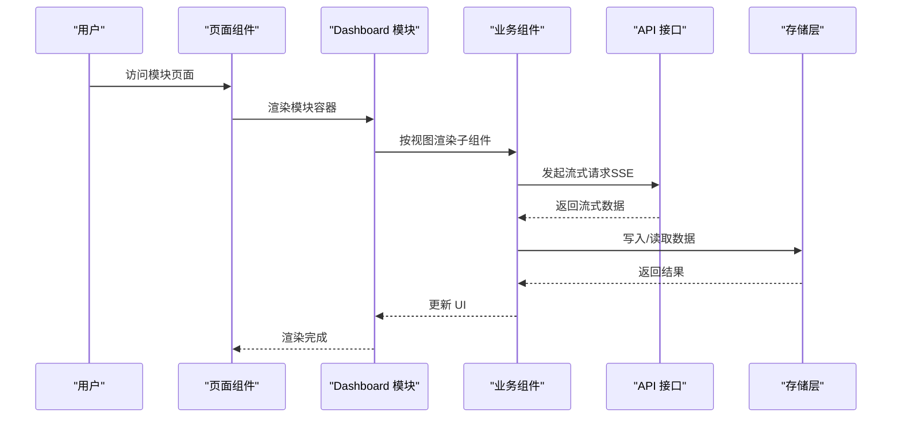
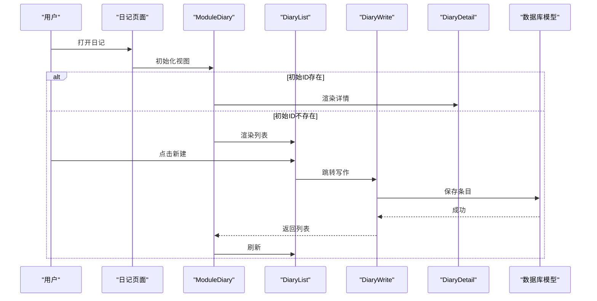
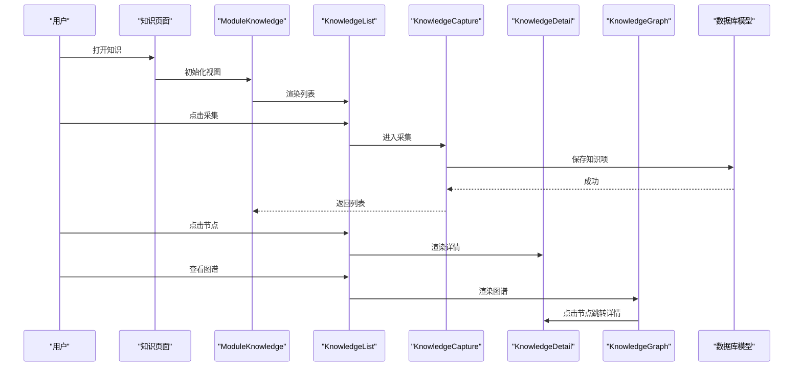
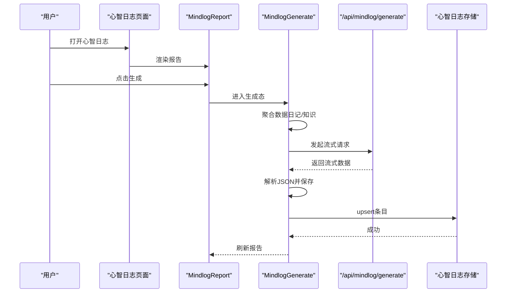
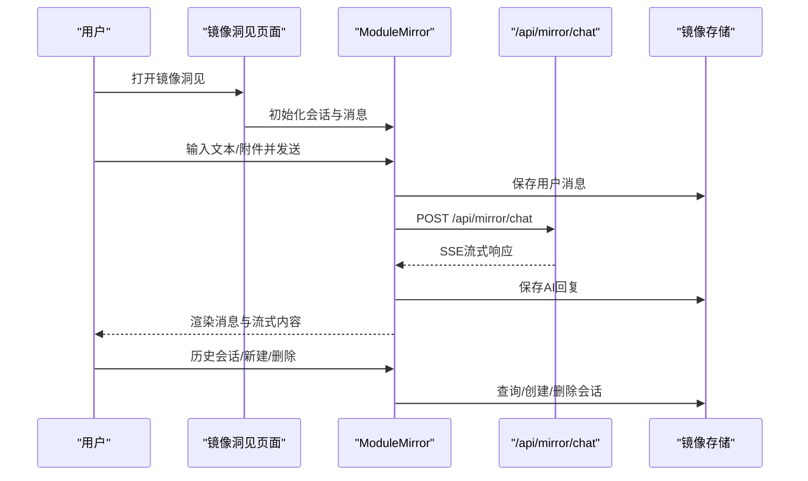
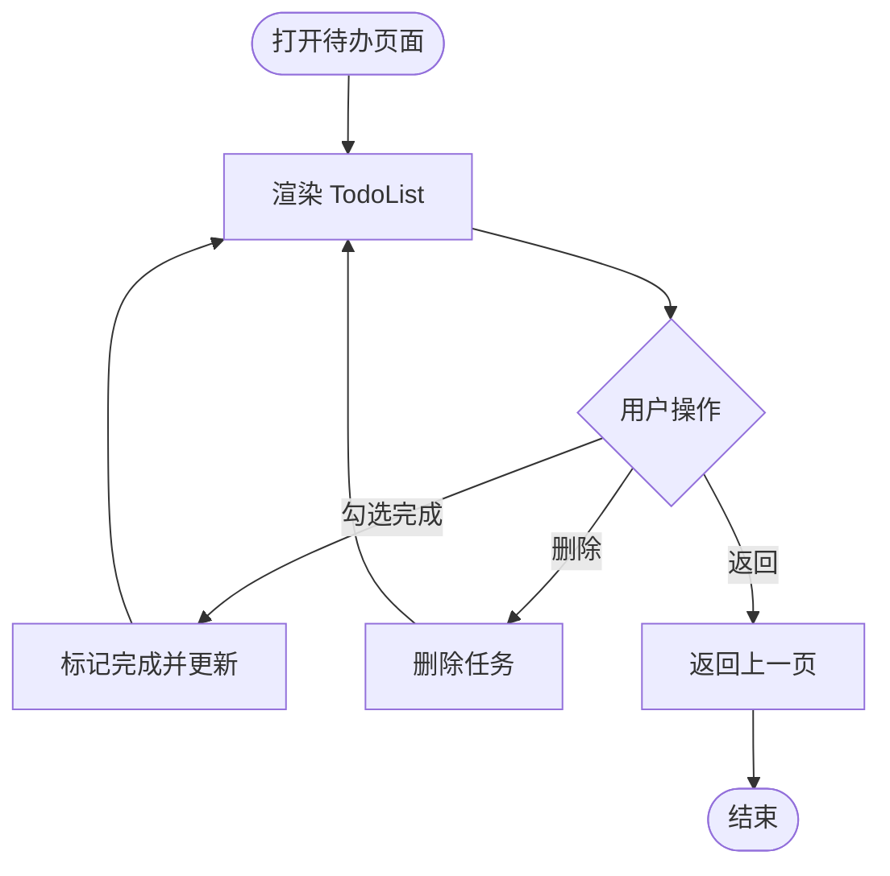
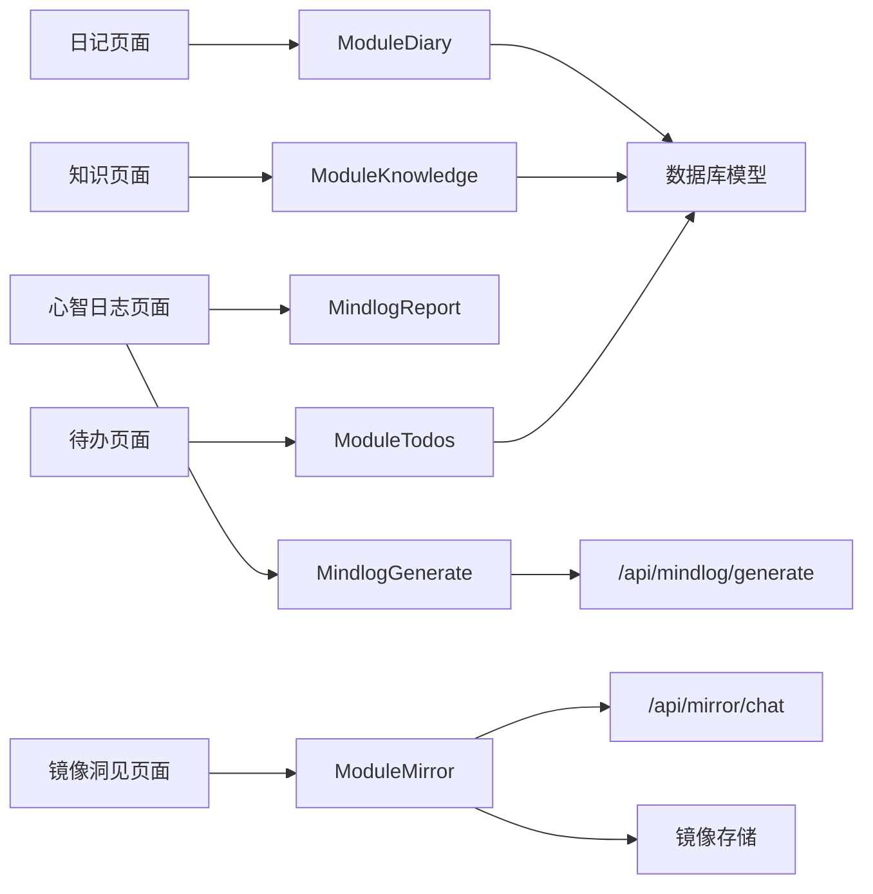

# 核心功能模块

<cite>
**本文引用的文件**
- [src/app/(main)/diary/page.tsx](file://src/app/(main)/diary/page.tsx)
- [src/components/dashboard/module-diary.tsx](file://src/components/dashboard/module-diary.tsx)
- [src/components/diary/diary-list.tsx](file://src/components/diary/diary-list.tsx)
- [src/components/diary/diary-detail.tsx](file://src/components/diary/diary-detail.tsx)
- [src/components/diary/diary-write.tsx](file://src/components/diary/diary-write.tsx)
- [src/lib/db/schema.ts](file://src/lib/db/schema.ts)
- [src/app/api/daily-echo/route.ts](file://src/app/api/daily-echo/route.ts)
- [src/app/(main)/knowledge/page.tsx](file://src/app/(main)/knowledge/page.tsx)
- [src/components/dashboard/module-knowledge.tsx](file://src/components/dashboard/module-knowledge.tsx)
- [src/components/knowledge/knowledge-list.tsx](file://src/components/knowledge/knowledge-list.tsx)
- [src/components/knowledge/knowledge-detail.tsx](file://src/components/knowledge/knowledge-detail.tsx)
- [src/components/knowledge/knowledge-capture.tsx](file://src/components/knowledge/knowledge-capture.tsx)
- [src/components/knowledge/knowledge-graph.tsx](file://src/components/knowledge/knowledge-graph.tsx)
- [src/app/api/knowledge/extract/route.ts](file://src/app/api/knowledge/extract/route.ts)
- [src/app/api/knowledge/link/route.ts](file://src/app/api/knowledge/link/route.ts)
- [src/app/api/knowledge/tag/route.ts](file://src/app/api/knowledge/tag/route.ts)
- [src/app/(main)/mindlog/page.tsx](file://src/app/(main)/mindlog/page.tsx)
- [src/components/mindlog/mindlog-report.tsx](file://src/components/mindlog/mindlog-report.tsx)
- [src/components/mindlog/mindlog-generate.tsx](file://src/components/mindlog/mindlog-generate.tsx)
- [src/app/api/mindlog/generate/route.ts](file://src/app/api/mindlog/generate/route.ts)
- [src/app/(main)/mirror/page.tsx](file://src/app/(main)/mirror/page.tsx)
- [src/components/dashboard/module-mirror.tsx](file://src/components/dashboard/module-mirror.tsx)
- [src/lib/storage/mirror-store.ts](file://src/lib/storage/mirror-store.ts)
- [src/app/api/mirror/chat/route.ts](file://src/app/api/mirror/chat/route.ts)
- [src/app/(main)/todos/page.tsx](file://src/app/(main)/todos/page.tsx)
- [src/components/dashboard/module-todos.tsx](file://src/components/dashboard/module-todos.tsx)
- [src/components/todos/todo-list.tsx](file://src/components/todos/todo-list.tsx)
</cite>

## 目录
1. [简介](#简介)
2. [项目结构](#项目结构)
3. [核心组件](#核心组件)
4. [架构总览](#架构总览)
5. [详细组件分析](#详细组件分析)
6. [依赖分析](#依赖分析)
7. [性能考量](#性能考量)
8. [故障排查指南](#故障排查指南)
9. [结论](#结论)
10. [附录](#附录)

## 简介
本文件面向 life-os 的核心功能模块，系统性梳理日记系统、知识库管理、心智日志、镜像洞见、待办事项五大模块的设计理念、实现方式与协作关系。文档覆盖数据模型、API 接口、状态管理、UI 交互与用户体验，并提供扩展与定制指导，帮助开发者快速理解与演进系统。

## 项目结构
- 页面层：各模块页面负责导航与入口，统一采用 Suspense 包裹，提供返回栏与模块容器。
- 组件层：Dashboard 模块作为视图编排器，协调具体子组件；子组件聚焦单一职责。
- 存储层：数据库模型定义与本地 IndexedDB 存储封装，保障数据持久化与离线可用。
- API 层：Node.js 运行时的流式接口，对接外部大模型服务，提供 SSE 数据流。

```mermaid
graph TB
subgraph "页面层"
P_Diary["日记页面<br/>src/app/(main)/diary/page.tsx"]
P_Knowledge["知识页面<br/>src/app/(main)/knowledge/page.tsx"]
P_Mindlog["心智日志页面<br/>src/app/(main)/mindlog/page.tsx"]
P_Mirror["镜像洞见页面<br/>src/app/(main)/mirror/page.tsx"]
P_Todos["待办页面<br/>src/app/(main)/todos/page.tsx"]
end
subgraph "组件层"
C_Diary["ModuleDiary<br/>src/components/dashboard/module-diary.tsx"]
C_Knowledge["ModuleKnowledge<br/>src/components/dashboard/module-knowledge.tsx"]
C_Mindlog_Report["MindlogReport<br/>src/components/mindlog/mindlog-report.tsx"]
C_Mindlog_Gen["MindlogGenerate<br/>src/components/mindlog/mindlog-generate.tsx"]
C_Mirror["ModuleMirror<br/>src/components/dashboard/module-mirror.tsx"]
C_Todos["ModuleTodos<br/>src/components/dashboard/module-todos.tsx"]
end
subgraph "存储层"
S_DB["数据库模型<br/>src/lib/db/schema.ts"]
S_Mirror_Store["镜像存储<br/>src/lib/storage/mirror-store.ts"]
end
subgraph "API 层"
A_DailyEcho["/api/daily-echo<br/>src/app/api/daily-echo/route.ts"]
A_Knowledge_Extract["/api/knowledge/extract<br/>src/app/api/knowledge/extract/route.ts"]
A_Knowledge_Link["/api/knowledge/link<br/>src/app/api/knowledge/link/route.ts"]
A_Knowledge_Tag["/api/knowledge/tag<br/>src/app/api/knowledge/tag/route.ts"]
A_Mindlog_Generate["/api/mindlog/generate<br/>src/app/api/mindlog/generate/route.ts"]
A_Mirror_Chat["/api/mirror/chat<br/>src/app/api/mirror/chat/route.ts"]
end
P_Diary --> C_Diary
P_Knowledge --> C_Knowledge
P_Mindlog --> C_Mindlog_Report
P_Mindlog --> C_Mindlog_Gen
P_Mirror --> C_Mirror
P_Todos --> C_Todos
C_Diary --> S_DB
C_Knowledge --> S_DB
C_Mindlog_Gen --> A_Mindlog_Generate
C_Mirror --> A_Mirror_Chat
C_Mirror --> S_Mirror_Store
C_Todos --> S_DB
```

图表来源
- [src/app/(main)/diary/page.tsx](file://src/app/(main)/diary/page.tsx#L1-L53)
- [src/app/(main)/knowledge/page.tsx](file://src/app/(main)/knowledge/page.tsx#L1-L53)
- [src/app/(main)/mindlog/page.tsx](file://src/app/(main)/mindlog/page.tsx#L1-L91)
- [src/app/(main)/mirror/page.tsx](file://src/app/(main)/mirror/page.tsx#L1-L120)
- [src/app/(main)/todos/page.tsx](file://src/app/(main)/todos/page.tsx#L1-L52)
- [src/components/dashboard/module-diary.tsx:1-53](file://src/components/dashboard/module-diary.tsx#L1-L53)
- [src/components/dashboard/module-knowledge.tsx:1-95](file://src/components/dashboard/module-knowledge.tsx#L1-L95)
- [src/components/mindlog/mindlog-report.tsx:1-234](file://src/components/mindlog/mindlog-report.tsx#L1-L234)
- [src/components/mindlog/mindlog-generate.tsx:1-436](file://src/components/mindlog/mindlog-generate.tsx#L1-L436)
- [src/components/dashboard/module-mirror.tsx:1-590](file://src/components/dashboard/module-mirror.tsx#L1-L590)
- [src/components/dashboard/module-todos.tsx:1-12](file://src/components/dashboard/module-todos.tsx#L1-L12)
- [src/lib/db/schema.ts:1-118](file://src/lib/db/schema.ts#L1-L118)
- [src/lib/storage/mirror-store.ts:1-155](file://src/lib/storage/mirror-store.ts#L1-L155)
- [src/app/api/mindlog/generate/route.ts:1-107](file://src/app/api/mindlog/generate/route.ts#L1-L107)
- [src/app/api/mirror/chat/route.ts:1-65](file://src/app/api/mirror/chat/route.ts#L1-L65)

章节来源
- [src/app/(main)/diary/page.tsx](file://src/app/(main)/diary/page.tsx#L1-L53)
- [src/app/(main)/knowledge/page.tsx](file://src/app/(main)/knowledge/page.tsx#L1-L53)
- [src/app/(main)/mindlog/page.tsx](file://src/app/(main)/mindlog/page.tsx#L1-L91)
- [src/app/(main)/mirror/page.tsx](file://src/app/(main)/mirror/page.tsx#L1-L120)
- [src/app/(main)/todos/page.tsx](file://src/app/(main)/todos/page.tsx#L1-L52)

## 核心组件
- 日记系统：页面负责返回栏与容器，ModuleDiary 编排列表/写作/详情三视图，依赖 Drizzle ORM 模型与本地存储。
- 知识库管理：页面负责返回栏与容器，ModuleKnowledge 编排列表/采集/详情/图谱四视图，支持跨组件导航事件。
- 心智日志：页面提供报告页与生成页，MindlogReport 展示日/周/月报告，MindlogGenerate 聚合数据并流式生成。
- 镜像洞见：页面提供会话历史侧边栏，ModuleMirror 实现消息流式显示、附件上传、会话管理与用户画像注入。
- 待办事项：页面负责返回栏与容器，ModuleTodos 直接渲染 TodoList。

章节来源
- [src/components/dashboard/module-diary.tsx:1-53](file://src/components/dashboard/module-diary.tsx#L1-L53)
- [src/components/dashboard/module-knowledge.tsx:1-95](file://src/components/dashboard/module-knowledge.tsx#L1-L95)
- [src/components/mindlog/mindlog-report.tsx:1-234](file://src/components/mindlog/mindlog-report.tsx#L1-L234)
- [src/components/mindlog/mindlog-generate.tsx:1-436](file://src/components/mindlog/mindlog-generate.tsx#L1-L436)
- [src/components/dashboard/module-mirror.tsx:1-590](file://src/components/dashboard/module-mirror.tsx#L1-L590)
- [src/components/dashboard/module-todos.tsx:1-12](file://src/components/dashboard/module-todos.tsx#L1-L12)

## 架构总览
- 前端路由与页面：Next.js App Router 页面负责导航与容器，统一采用 Suspense。
- 组件编排：Dashboard 模块作为视图编排器，按需渲染子组件，传递回调与状态。
- 数据持久化：Drizzle ORM 定义数据库模型；镜像洞见使用 IndexedDB 封装进行会话与消息存储。
- 流式接口：Node.js 运行时 API，通过 SSE 返回流式数据，前端解析并增量渲染。
- 用户体验：统一的返回栏、空态与骨架屏、动画过渡与可访问性提示。

图表来源
- [src/app/(main)/diary/page.tsx](file://src/app/(main)/diary/page.tsx#L1-L53)
- [src/components/dashboard/module-diary.tsx:1-53](file://src/components/dashboard/module-diary.tsx#L1-L53)
- [src/app/api/mindlog/generate/route.ts:1-107](file://src/app/api/mindlog/generate/route.ts#L1-L107)
- [src/lib/storage/mirror-store.ts:1-155](file://src/lib/storage/mirror-store.ts#L1-L155)

## 详细组件分析

### 日记系统
- 设计理念：以“记录—回顾—沉淀”为主线，提供列表浏览、写作与详情查看的完整闭环。
- 关键流程：ModuleDiary 在列表/写作/详情之间切换；新增/删除后刷新列表；支持从外部传入初始条目 ID。
- 数据模型：日记条目与摘要由 Drizzle ORM 模型定义，支持情绪标签、主题标签与字数统计。
- UI/UX：统一返回栏、骨架屏、空态与卡片式布局；写作区域自适应高度；详情支持删除后回到列表。

图表来源
- [src/app/(main)/diary/page.tsx](file://src/app/(main)/diary/page.tsx#L1-L53)
- [src/components/dashboard/module-diary.tsx:1-53](file://src/components/dashboard/module-diary.tsx#L1-L53)
- [src/lib/db/schema.ts:66-86](file://src/lib/db/schema.ts#L66-L86)

章节来源
- [src/app/(main)/diary/page.tsx](file://src/app/(main)/diary/page.tsx#L1-L53)
- [src/components/dashboard/module-diary.tsx:1-53](file://src/components/dashboard/module-diary.tsx#L1-L53)
- [src/lib/db/schema.ts:66-86](file://src/lib/db/schema.ts#L66-L86)

### 知识库管理
- 设计理念：围绕“采集—关联—检索—可视化”的知识生命周期，提供列表、采集、详情与图谱视图。
- 关键流程：ModuleKnowledge 支持从列表进入采集/详情/图谱；跨组件导航通过自定义事件触发详情视图。
- 数据模型：知识项、链接关系与同步日志由 Drizzle ORM 定义；支持多种来源类型与主题标签。
- UI/UX：统一返回栏与视图切换；图谱视图支持节点点击跳转详情；采集支持多来源与元数据保留。

图表来源
- [src/app/(main)/knowledge/page.tsx](file://src/app/(main)/knowledge/page.tsx#L1-L53)
- [src/components/dashboard/module-knowledge.tsx:1-95](file://src/components/dashboard/module-knowledge.tsx#L1-L95)
- [src/lib/db/schema.ts:36-64](file://src/lib/db/schema.ts#L36-L64)

章节来源
- [src/app/(main)/knowledge/page.tsx](file://src/app/(main)/knowledge/page.tsx#L1-L53)
- [src/components/dashboard/module-knowledge.tsx:1-95](file://src/components/dashboard/module-knowledge.tsx#L1-L95)
- [src/lib/db/schema.ts:36-64](file://src/lib/db/schema.ts#L36-L64)

### 心智日志
- 设计理念：以“数据聚合—模型生成—结构化呈现”为核心，支持日/周/月三种周期的报告与生成。
- 关键流程：MindlogGenerate 聚合日记与知识库数据，调用 /api/mindlog/generate 获取流式结果，解析 JSON 后保存；MindlogReport 展示报告并支持一键生成。
- 数据模型：心智日志条目由本地存储封装管理，支持周期范围、关键词与结构化内容。
- UI/UX：Tab 切换、空态引导、骨架屏与流式预览；支持错误处理与重新生成。

图表来源
- [src/app/(main)/mindlog/page.tsx](file://src/app/(main)/mindlog/page.tsx#L1-L91)
- [src/components/mindlog/mindlog-report.tsx:1-234](file://src/components/mindlog/mindlog-report.tsx#L1-L234)
- [src/components/mindlog/mindlog-generate.tsx:1-436](file://src/components/mindlog/mindlog-generate.tsx#L1-L436)
- [src/app/api/mindlog/generate/route.ts:1-107](file://src/app/api/mindlog/generate/route.ts#L1-L107)

章节来源
- [src/app/(main)/mindlog/page.tsx](file://src/app/(main)/mindlog/page.tsx#L1-L91)
- [src/components/mindlog/mindlog-report.tsx:1-234](file://src/components/mindlog/mindlog-report.tsx#L1-L234)
- [src/components/mindlog/mindlog-generate.tsx:1-436](file://src/components/mindlog/mindlog-generate.tsx#L1-L436)
- [src/app/api/mindlog/generate/route.ts:1-107](file://src/app/api/mindlog/generate/route.ts#L1-L107)

### 镜像洞见
- 设计理念：以“会话驱动的反思对话”为核心，结合用户画像与上下文，提供自然语言与多模态输入。
- 关键流程：ModuleMirror 管理会话与消息，支持图片/文件附件；通过 /api/mirror/chat 获取流式回复；支持会话历史侧边栏与快速提示。
- 数据模型：会话与消息由 IndexedDB 封装管理，支持按会话查询与索引优化。
- UI/UX：消息气泡对齐、附件预览、打字动画、停止生成、快速提示与侧边栏手势。

图表来源
- [src/app/(main)/mirror/page.tsx](file://src/app/(main)/mirror/page.tsx#L1-L120)
- [src/components/dashboard/module-mirror.tsx:1-590](file://src/components/dashboard/module-mirror.tsx#L1-L590)
- [src/lib/storage/mirror-store.ts:1-155](file://src/lib/storage/mirror-store.ts#L1-L155)
- [src/app/api/mirror/chat/route.ts:1-65](file://src/app/api/mirror/chat/route.ts#L1-L65)

章节来源
- [src/app/(main)/mirror/page.tsx](file://src/app/(main)/mirror/page.tsx#L1-L120)
- [src/components/dashboard/module-mirror.tsx:1-590](file://src/components/dashboard/module-mirror.tsx#L1-L590)
- [src/lib/storage/mirror-store.ts:1-155](file://src/lib/storage/mirror-store.ts#L1-L155)
- [src/app/api/mirror/chat/route.ts:1-65](file://src/app/api/mirror/chat/route.ts#L1-L65)

### 待办事项
- 设计理念：简洁高效的任务管理，强调“今日清单”的即时行动与完成反馈。
- 关键流程：ModuleTodos 直接渲染 TodoList；列表支持勾选完成与删除。
- 数据模型：待办项由 Drizzle ORM 模型定义，支持日期、完成状态与时间戳。
- UI/UX：统一返回栏与卡片布局；完成态样式与删除操作反馈。

图表来源
- [src/app/(main)/todos/page.tsx](file://src/app/(main)/todos/page.tsx#L1-L52)
- [src/components/dashboard/module-todos.tsx:1-12](file://src/components/dashboard/module-todos.tsx#L1-L12)
- [src/lib/db/schema.ts:88-96](file://src/lib/db/schema.ts#L88-L96)

章节来源
- [src/app/(main)/todos/page.tsx](file://src/app/(main)/todos/page.tsx#L1-L52)
- [src/components/dashboard/module-todos.tsx:1-12](file://src/components/dashboard/module-todos.tsx#L1-L12)
- [src/lib/db/schema.ts:88-96](file://src/lib/db/schema.ts#L88-L96)

## 依赖分析
- 组件耦合：页面与 Dashboard 模块低耦合，子组件内聚；Mindlog 与镜像洞见分别依赖各自 API。
- 外部依赖：Node.js 运行时、SSE 流、IndexedDB、Drizzle ORM。
- 可能的循环依赖：当前结构以页面/模块/组件分层，未见直接循环导入。

图表来源
- [src/app/(main)/diary/page.tsx](file://src/app/(main)/diary/page.tsx#L1-L53)
- [src/app/(main)/knowledge/page.tsx](file://src/app/(main)/knowledge/page.tsx#L1-L53)
- [src/app/(main)/mindlog/page.tsx](file://src/app/(main)/mindlog/page.tsx#L1-L91)
- [src/app/(main)/mirror/page.tsx](file://src/app/(main)/mirror/page.tsx#L1-L120)
- [src/app/(main)/todos/page.tsx](file://src/app/(main)/todos/page.tsx#L1-L52)
- [src/lib/db/schema.ts:1-118](file://src/lib/db/schema.ts#L1-L118)
- [src/lib/storage/mirror-store.ts:1-155](file://src/lib/storage/mirror-store.ts#L1-L155)
- [src/app/api/mindlog/generate/route.ts:1-107](file://src/app/api/mindlog/generate/route.ts#L1-L107)
- [src/app/api/mirror/chat/route.ts:1-65](file://src/app/api/mirror/chat/route.ts#L1-L65)

章节来源
- [src/lib/db/schema.ts:1-118](file://src/lib/db/schema.ts#L1-L118)
- [src/lib/storage/mirror-store.ts:1-155](file://src/lib/storage/mirror-store.ts#L1-L155)

## 性能考量
- 流式渲染：心智日志与镜像洞见均采用 SSE 流式传输，前端增量渲染，降低首屏等待。
- 本地存储：镜像洞见使用 IndexedDB，避免频繁网络请求；Mindlog 生成前聚合数据，减少重复 IO。
- 组件懒加载：心智日志生成组件按需加载，降低初始包体积。
- 动画与骨架屏：在加载阶段使用骨架屏与轻量动画，提升感知性能。
- 数据库索引：镜像存储为消息与会话建立索引，提高查询效率。

## 故障排查指南
- 心智日志生成失败
  - 症状：生成过程中报错或返回格式异常。
  - 排查：检查 /api/mindlog/generate 的请求体与模型密钥；确认聚合数据是否为空；查看前端 onError 回调输出。
  - 参考
    - [src/components/mindlog/mindlog-generate.tsx:118-123](file://src/components/mindlog/mindlog-generate.tsx#L118-L123)
    - [src/app/api/mindlog/generate/route.ts:58-106](file://src/app/api/mindlog/generate/route.ts#L58-L106)
- 镜像洞见无法接收流
  - 症状：消息发送后无回复或报错。
  - 排查：检查 /api/mirror/chat 的请求体与 OCR 文字提取；确认 AbortController 是否被提前中断；查看消息写入与会话创建逻辑。
  - 参考
    - [src/components/dashboard/module-mirror.tsx:158-248](file://src/components/dashboard/module-mirror.tsx#L158-L248)
    - [src/app/api/mirror/chat/route.ts:9-64](file://src/app/api/mirror/chat/route.ts#L9-L64)
- 知识库采集/关联异常
  - 症状：采集后未入库或关联关系缺失。
  - 排查：确认知识项保存与链接插入顺序；检查 Drizzle ORM 字段映射与数组字段。
  - 参考
    - [src/lib/db/schema.ts:36-64](file://src/lib/db/schema.ts#L36-L64)
- 待办项状态不同步
  - 症状：勾选/删除后 UI 未更新。
  - 排查：确认 Drizzle ORM 更新/删除操作与前端刷新策略。
  - 参考
    - [src/lib/db/schema.ts:88-96](file://src/lib/db/schema.ts#L88-L96)

章节来源
- [src/components/mindlog/mindlog-generate.tsx:118-123](file://src/components/mindlog/mindlog-generate.tsx#L118-L123)
- [src/app/api/mindlog/generate/route.ts:58-106](file://src/app/api/mindlog/generate/route.ts#L58-L106)
- [src/components/dashboard/module-mirror.tsx:158-248](file://src/components/dashboard/module-mirror.tsx#L158-L248)
- [src/app/api/mirror/chat/route.ts:9-64](file://src/app/api/mirror/chat/route.ts#L9-L64)
- [src/lib/db/schema.ts:36-64](file://src/lib/db/schema.ts#L36-L64)
- [src/lib/db/schema.ts:88-96](file://src/lib/db/schema.ts#L88-L96)

## 结论
本系统以“模块化 + 流式体验 + 本地持久化”为核心设计，通过清晰的页面/模块/组件分层与标准化的 API 接口，实现了日记、知识、心智、镜像与待办的协同工作。建议在后续迭代中进一步完善错误边界、埋点与可访问性，持续优化流式渲染与本地缓存策略。

## 附录
- 数据模型概览（节选）
  - 用户配置：主题偏好、AI 预算、外部平台集成信息等。
  - 错题本：题目、答案、难度、复习计划等。
  - 知识库：类型、标题、来源、主题标签、创建元数据等。
  - 日记库：内容、情绪标签、主题标签、字数统计等。
  - 待办：标题、日期、完成状态、时间戳等。
  - 同步日志：平台、时间、状态、错误信息等。
  - 报告：类型、标题、内容、周期范围等。

章节来源
- [src/lib/db/schema.ts:1-118](file://src/lib/db/schema.ts#L1-L118)