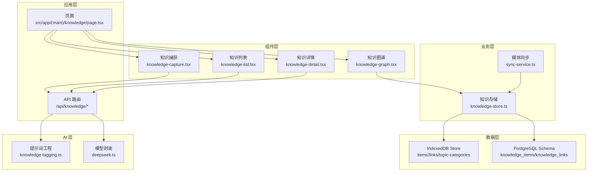
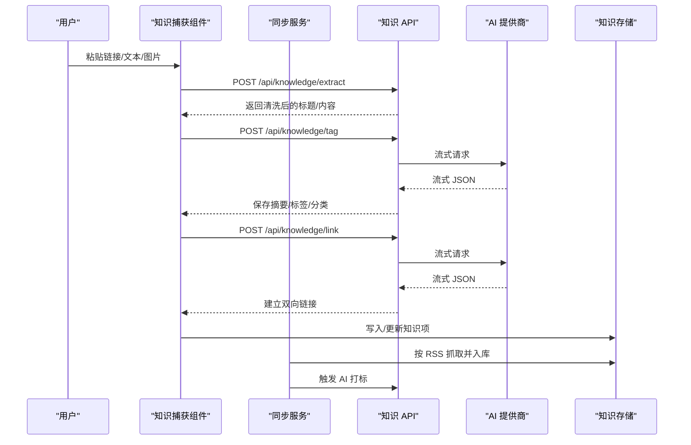
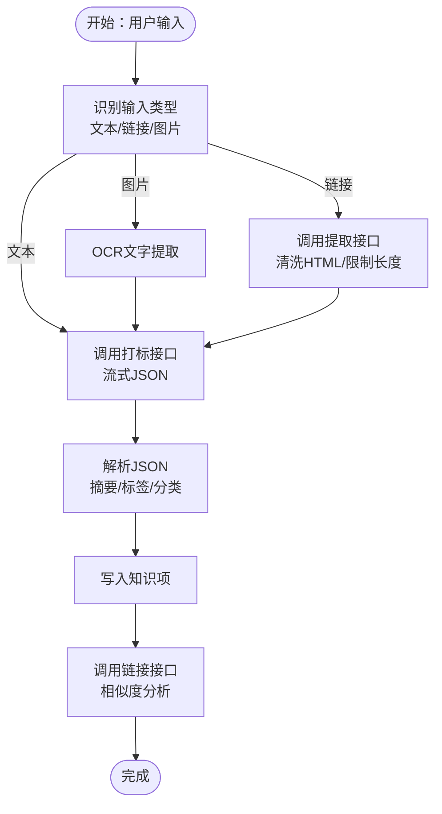
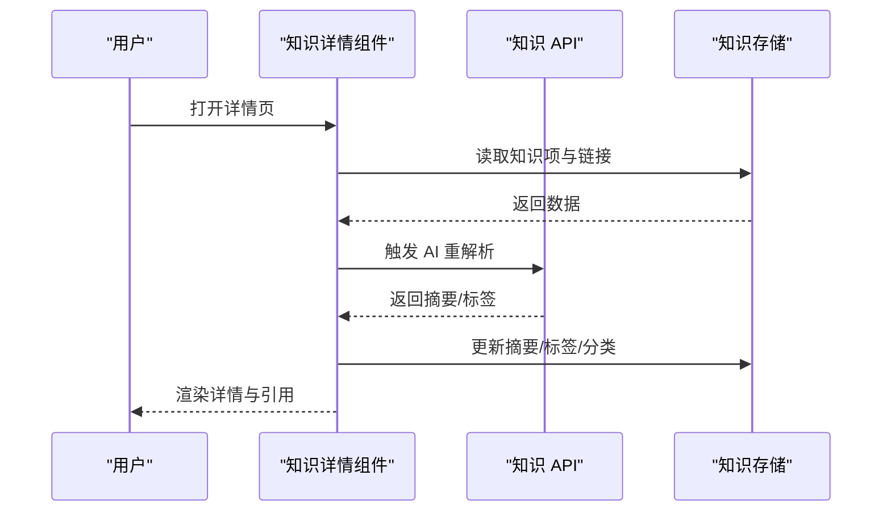
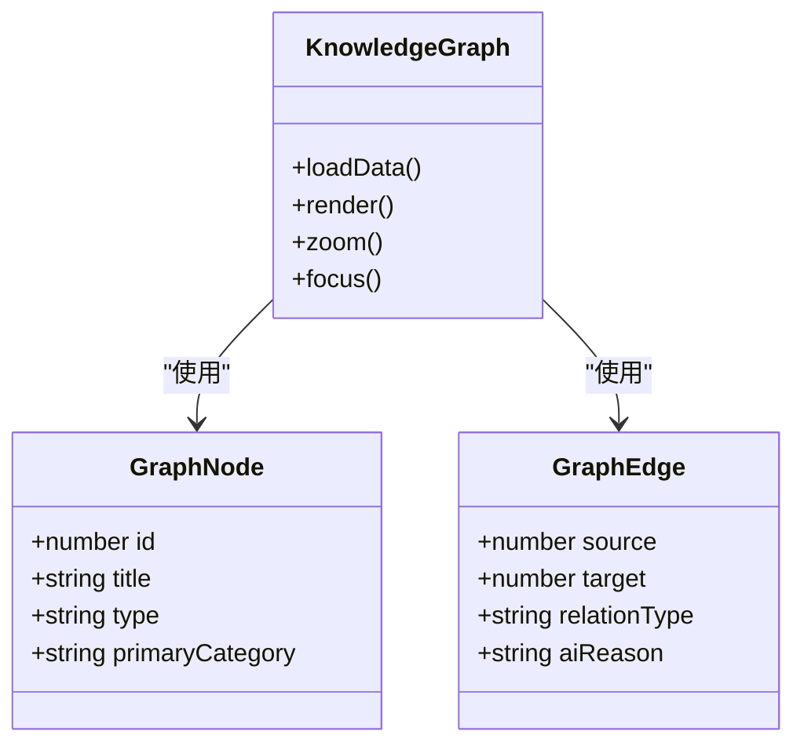
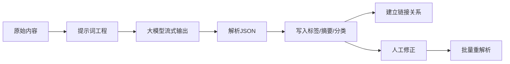
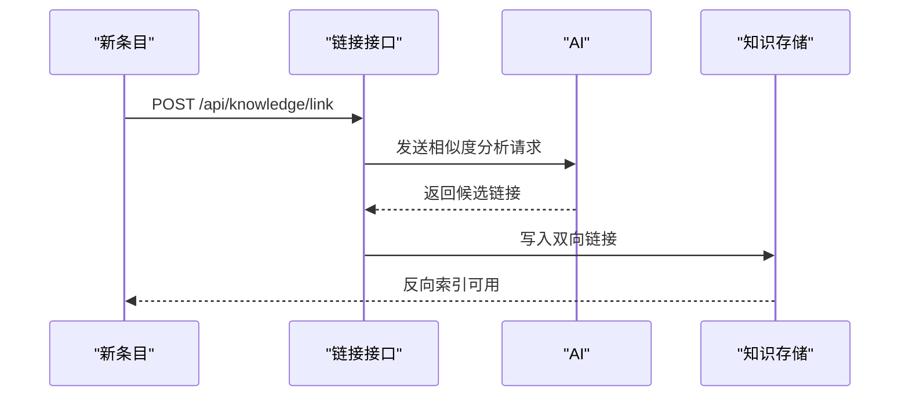
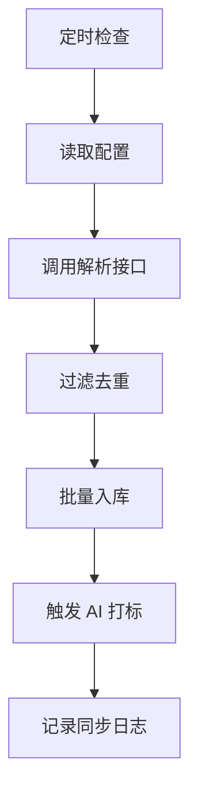
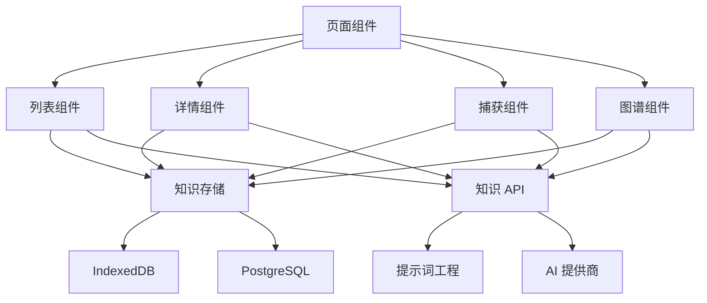

# 知识库管理系统

<cite>
**本文档引用的文件**
- [knowledge-capture.tsx](file://src/components/knowledge/knowledge-capture.tsx)
- [knowledge-detail.tsx](file://src/components/knowledge/knowledge-detail.tsx)
- [knowledge-graph.tsx](file://src/components/knowledge/knowledge-graph.tsx)
- [knowledge-list.tsx](file://src/components/knowledge/knowledge-list.tsx)
- [knowledge-store.ts](file://src/lib/storage/knowledge-store.ts)
- [schema.ts](file://src/lib/db/schema.ts)
- [sync-service.ts](file://src/lib/media/sync-service.ts)
- [page.tsx](file://src/app/(main)/knowledge/page.tsx)
- [tag/route.ts](file://src/app/api/knowledge/tag/route.ts)
- [extract/route.ts](file://src/app/api/knowledge/extract/route.ts)
- [link/route.ts](file://src/app/api/knowledge/link/route.ts)
- [deepseek.ts](file://src/lib/ai/providers/deepseek.ts)
- [knowledge-tagging.ts](file://src/lib/ai/prompts/knowledge-tagging.ts)
- [safe-text.ts](file://src/lib/utils/safe-text.ts)
</cite>

## 目录
1. [简介](#简介)
2. [项目结构](#项目结构)
3. [核心组件](#核心组件)
4. [架构总览](#架构总览)
5. [详细组件分析](#详细组件分析)
6. [依赖分析](#依赖分析)
7. [性能考虑](#性能考虑)
8. [故障排查指南](#故障排查指南)
9. [结论](#结论)
10. [附录](#附录)

## 简介
本系统是一个基于 Web 的知识库管理平台，围绕“采集—存储—分类—检索—可视化”的完整闭环设计。前端采用 Next.js App Router + React 组件，后端通过 App Router API 提供知识打标、网页内容提取、实体链接等能力；数据层结合 IndexedDB 与 PostgreSQL，既保证离线可用，又支持跨设备同步与统计分析。

系统核心能力包括：
- 知识捕获：支持粘贴链接、文本、图片，自动网页内容提取与 OCR 文字识别
- 自动打标与分类：基于 AI 的标签生成、一级主题分类与摘要生成
- 实体链接与知识图谱：基于 AI 的相似内容发现与可视化
- 标签系统：自动打标、人工修正、标签合并与统计
- 知识详情页：内容渲染、引用管理、版本控制与 AI 重解析
- 链接管理：双向链接、反向索引与交叉引用
- RSS 同步：自动抓取与去重入库

## 项目结构
系统采用分层组织：
- 应用层：Next.js App Router 页面与路由
- 组件层：知识库相关的 UI 组件（捕获、列表、详情、图谱）
- 业务层：知识存储与媒体同步服务
- 数据层：IndexedDB（本地）与 Drizzle ORM（PostgreSQL）
- AI 层：提示词工程与大模型流式输出封装

图表来源
- [page.tsx](file://src/app/(main)/knowledge/page.tsx#L1-L53)
- [knowledge-capture.tsx:1-627](file://src/components/knowledge/knowledge-capture.tsx#L1-L627)
- [knowledge-list.tsx:1-855](file://src/components/knowledge/knowledge-list.tsx#L1-L855)
- [knowledge-detail.tsx:1-969](file://src/components/knowledge/knowledge-detail.tsx#L1-L969)
- [knowledge-graph.tsx:1-742](file://src/components/knowledge/knowledge-graph.tsx#L1-L742)
- [knowledge-store.ts:1-611](file://src/lib/storage/knowledge-store.ts#L1-L611)
- [schema.ts:1-118](file://src/lib/db/schema.ts#L1-L118)
- [tag/route.ts:1-70](file://src/app/api/knowledge/tag/route.ts#L1-L70)
- [extract/route.ts:1-64](file://src/app/api/knowledge/extract/route.ts#L1-L64)
- [link/route.ts:1-29](file://src/app/api/knowledge/link/route.ts#L1-L29)
- [deepseek.ts:1-58](file://src/lib/ai/providers/deepseek.ts#L1-L58)
- [knowledge-tagging.ts:1-40](file://src/lib/ai/prompts/knowledge-tagging.ts#L1-L40)

章节来源
- [page.tsx](file://src/app/(main)/knowledge/page.tsx#L1-L53)
- [knowledge-store.ts:1-611](file://src/lib/storage/knowledge-store.ts#L1-L611)
- [schema.ts:1-118](file://src/lib/db/schema.ts#L1-L118)

## 核心组件
- 知识捕获组件：负责输入处理、粘贴/上传图片、自动网页内容提取、触发 AI 打标与链接分析
- 知识列表组件：支持主题/来源/时间三种视图、类型筛选、分类标签、批量操作与搜索
- 知识详情组件：展示与编辑标题、标签、摘要、来源、内容；支持 AI 重解析与手动编辑
- 知识图谱组件：基于 d3-force 的力导向图，支持关系过滤、聚焦模式与交互缩放
- 存储服务：IndexedDB 作为本地持久化，提供 CRUD、索引、统计与图数据导出
- 同步服务：RSS 自动抓取、去重入库、触发 AI 打标与链接分析

章节来源
- [knowledge-capture.tsx:1-627](file://src/components/knowledge/knowledge-capture.tsx#L1-L627)
- [knowledge-list.tsx:1-855](file://src/components/knowledge/knowledge-list.tsx#L1-L855)
- [knowledge-detail.tsx:1-969](file://src/components/knowledge/knowledge-detail.tsx#L1-L969)
- [knowledge-graph.tsx:1-742](file://src/components/knowledge/knowledge-graph.tsx#L1-L742)
- [knowledge-store.ts:1-611](file://src/lib/storage/knowledge-store.ts#L1-L611)
- [sync-service.ts:1-383](file://src/lib/media/sync-service.ts#L1-L383)

## 架构总览
系统采用前后端分离但紧密协作的架构：
- 前端组件通过 fetch 调用 /api/knowledge 下的三个核心接口：打标、提取、链接
- 打标接口支持文本与图片（OCR）两种输入，返回流式 JSON
- 提取接口对网页进行内容清洗与长度限制
- 链接接口基于现有知识库与新条目进行相似度分析并建立双向关系
- 存储层同时维护 IndexedDB 与 PostgreSQL，确保离线可用与云端同步

图表来源
- [knowledge-capture.tsx:94-205](file://src/components/knowledge/knowledge-capture.tsx#L94-L205)
- [sync-service.ts:161-255](file://src/lib/media/sync-service.ts#L161-L255)
- [tag/route.ts:1-70](file://src/app/api/knowledge/tag/route.ts#L1-L70)
- [extract/route.ts:1-64](file://src/app/api/knowledge/extract/route.ts#L1-L64)
- [link/route.ts:1-29](file://src/app/api/knowledge/link/route.ts#L1-L29)
- [knowledge-store.ts:176-205](file://src/lib/storage/knowledge-store.ts#L176-L205)

## 详细组件分析

### 知识捕获组件（采集与自动打标）
- 输入处理：支持粘贴文本/链接/图片，自动识别类型并决定后续处理路径
- 网页提取：检测链接后调用 /api/knowledge/extract，清洗 HTML 并限制长度
- AI 打标：调用 /api/knowledge/tag，接收流式 JSON，解析后写入摘要、标签与分类
- 链接分析：在标签完成后，基于现有知识库与新条目进行相似度分析，建立双向链接
- 图片处理：当存在图片时，先进行 OCR 文字提取，再进行文本打标

图表来源
- [knowledge-capture.tsx:60-205](file://src/components/knowledge/knowledge-capture.tsx#L60-L205)
- [extract/route.ts:1-64](file://src/app/api/knowledge/extract/route.ts#L1-L64)
- [tag/route.ts:1-70](file://src/app/api/knowledge/tag/route.ts#L1-L70)
- [link/route.ts:1-29](file://src/app/api/knowledge/link/route.ts#L1-L29)

章节来源
- [knowledge-capture.tsx:1-627](file://src/components/knowledge/knowledge-capture.tsx#L1-L627)
- [tag/route.ts:1-70](file://src/app/api/knowledge/tag/route.ts#L1-L70)
- [extract/route.ts:1-64](file://src/app/api/knowledge/extract/route.ts#L1-L64)
- [link/route.ts:1-29](file://src/app/api/knowledge/link/route.ts#L1-L29)

### 知识详情页（展示与版本控制）
- 内容渲染：安全文本处理，避免 XML 解析残留对象影响渲染
- 版本控制：记录 createdAt/updatedAt，支持 AI 重解析与手动编辑
- 引用管理：列出与当前条目相关的链接，支持来源链接与反向索引
- 摘要与标签：支持手动编辑 AI 摘要，支持重新解析与 AI 分类
- Raw 内容：当导入来源（如飞书）正文为空时，提供编辑入口并触发 AI 解析

图表来源
- [knowledge-detail.tsx:172-278](file://src/components/knowledge/knowledge-detail.tsx#L172-L278)
- [knowledge-store.ts:188-205](file://src/lib/storage/knowledge-store.ts#L188-L205)
- [safe-text.ts:1-17](file://src/lib/utils/safe-text.ts#L1-L17)

章节来源
- [knowledge-detail.tsx:1-969](file://src/components/knowledge/knowledge-detail.tsx#L1-L969)
- [safe-text.ts:1-17](file://src/lib/utils/safe-text.ts#L1-L17)

### 知识图谱（实体关系抽取与可视化）
- 数据来源：从知识存储导出节点与边，限制节点数量并过滤关系类型
- 力导向布局：使用 d3-force 进行物理模拟，支持碰撞、中心与连线约束
- 交互能力：支持缩放、聚焦模式（BFS 两跳）、关系类型过滤、悬停提示
- 关系样式：不同关系类型采用不同颜色与虚线样式，支持来源集着色

图表来源
- [knowledge-graph.tsx:26-96](file://src/components/knowledge/knowledge-graph.tsx#L26-L96)
- [knowledge-store.ts:80-97](file://src/lib/storage/knowledge-store.ts#L80-L97)

章节来源
- [knowledge-graph.tsx:1-742](file://src/components/knowledge/knowledge-graph.tsx#L1-L742)
- [knowledge-store.ts:370-392](file://src/lib/storage/knowledge-store.ts#L370-L392)

### 标签系统（自动打标、人工修正与语义关联）
- 自动打标：基于提示词工程与大模型流式输出，返回摘要、标签与分类
- 上下文感知：聚合已有标签与一级主题，避免重复与漂移
- 人工修正：支持手动编辑标签与摘要，支持批量重新解析
- 语义关联：通过链接接口发现潜在关联，建立双向关系
- 统计与管理：提供标签使用统计、合并与删除

图表来源
- [knowledge-tagging.ts:1-40](file://src/lib/ai/prompts/knowledge-tagging.ts#L1-L40)
- [deepseek.ts:15-57](file://src/lib/ai/providers/deepseek.ts#L15-L57)
- [sync-service.ts:161-255](file://src/lib/media/sync-service.ts#L161-L255)
- [knowledge-store.ts:456-520](file://src/lib/storage/knowledge-store.ts#L456-L520)

章节来源
- [knowledge-tagging.ts:1-40](file://src/lib/ai/prompts/knowledge-tagging.ts#L1-L40)
- [deepseek.ts:1-58](file://src/lib/ai/providers/deepseek.ts#L1-L58)
- [sync-service.ts:1-383](file://src/lib/media/sync-service.ts#L1-L383)
- [knowledge-store.ts:394-520](file://src/lib/storage/knowledge-store.ts#L394-L520)

### 知识链接管理（双向链接、反向索引与交叉引用）
- 双向链接：新增条目后，基于相似度分析建立双向关系
- 反向索引：通过两个索引（by-itemA、by-itemB）快速查询关联
- 交叉引用：在详情页展示相关条目，支持来源链接跳转
- 关系类型：支持深化、应用、补充、对立、来源等类型

图表来源
- [link/route.ts:1-29](file://src/app/api/knowledge/link/route.ts#L1-L29)
- [knowledge-store.ts:318-351](file://src/lib/storage/knowledge-store.ts#L318-L351)

章节来源
- [link/route.ts:1-29](file://src/app/api/knowledge/link/route.ts#L1-L29)
- [knowledge-store.ts:318-351](file://src/lib/storage/knowledge-store.ts#L318-L351)

### RSS 同步（采集与去重）
- 自动抓取：定时检查是否需要同步，支持多个 RSS 源
- 去重策略：按 sourceUrl 或标题进行去重，避免重复导入
- 入库与解析：入库后触发 AI 打标与链接分析
- 日志记录：记录每次同步的状态与结果

图表来源
- [sync-service.ts:19-138](file://src/lib/media/sync-service.ts#L19-L138)

章节来源
- [sync-service.ts:1-383](file://src/lib/media/sync-service.ts#L1-L383)

## 依赖分析
- 组件耦合：页面组件依赖模块化知识组件，组件间通过回调与状态传递解耦
- 存储依赖：知识存储同时依赖 IndexedDB 与 PostgreSQL，提供本地与云端双通道
- AI 依赖：提示词工程与模型封装解耦，便于替换与扩展
- 外部依赖：d3-force 用于图谱渲染，fetch 用于 API 通信

图表来源
- [page.tsx](file://src/app/(main)/knowledge/page.tsx#L1-L53)
- [knowledge-list.tsx:1-855](file://src/components/knowledge/knowledge-list.tsx#L1-L855)
- [knowledge-detail.tsx:1-969](file://src/components/knowledge/knowledge-detail.tsx#L1-L969)
- [knowledge-capture.tsx:1-627](file://src/components/knowledge/knowledge-capture.tsx#L1-L627)
- [knowledge-graph.tsx:1-742](file://src/components/knowledge/knowledge-graph.tsx#L1-L742)
- [knowledge-store.ts:1-611](file://src/lib/storage/knowledge-store.ts#L1-L611)
- [schema.ts:1-118](file://src/lib/db/schema.ts#L1-L118)
- [tag/route.ts:1-70](file://src/app/api/knowledge/tag/route.ts#L1-L70)
- [knowledge-tagging.ts:1-40](file://src/lib/ai/prompts/knowledge-tagging.ts#L1-L40)
- [deepseek.ts:1-58](file://src/lib/ai/providers/deepseek.ts#L1-L58)

章节来源
- [knowledge-store.ts:1-611](file://src/lib/storage/knowledge-store.ts#L1-L611)
- [schema.ts:1-118](file://src/lib/db/schema.ts#L1-L118)

## 性能考虑
- 流式传输：AI 输出采用流式传输，前端逐步渲染，提升感知速度
- 采样限制：链接分析仅取前若干条，避免 Token 暴涨
- 本地缓存：IndexedDB 作为本地缓存，减少网络依赖
- 图谱优化：限制节点数量与最大迭代次数，保证交互流畅
- 搜索优化：使用索引（by-type、by-tags、by-external、by-category、by-source-collection）加速查询

## 故障排查指南
- AI 服务未配置：检查环境变量，确保提供商密钥正确
- 提示词解析失败：查看前端控制台日志，确认 JSON 结构与提示词格式
- 图谱加载失败：检查数据库连接与数据完整性
- RSS 同步失败：检查 RSS 地址与网络连通性，查看同步日志

章节来源
- [tag/route.ts:20-22](file://src/app/api/knowledge/tag/route.ts#L20-L22)
- [knowledge-detail.tsx:247-278](file://src/components/knowledge/knowledge-detail.tsx#L247-L278)
- [sync-service.ts:114-138](file://src/lib/media/sync-service.ts#L114-L138)

## 结论
本系统通过“前端组件 + 后端 API + AI 提示词 + 存储层”的协同，实现了从采集到可视化的完整知识管理闭环。其优势在于：
- 采集方式多样、自动性强
- AI 打标与链接分析提升知识利用率
- 图谱可视化直观展现知识关系
- 标签系统支持自动与人工协同治理
- 存储层兼顾本地与云端，满足多场景需求

建议在生产环境中进一步完善：
- AI 服务的可观测性与降级策略
- 大规模数据下的索引与查询优化
- 用户权限与数据隔离机制
- 更丰富的知识形态（富媒体、多媒体）支持

## 附录
- 使用案例与最佳实践
  - 采集：优先使用链接采集，自动提取网页正文；图片使用 OCR；文本直接粘贴
  - 打标：首次导入后可手动微调标签与摘要；批量重解析提升一致性
  - 分类：选择与内容最匹配的一级主题，避免过度细分
  - 链接：关注“补充”“应用”“深化”等强相关关系，定期清理弱关联
  - 图谱：利用聚焦模式探索领域内知识脉络，辅助学习与研究