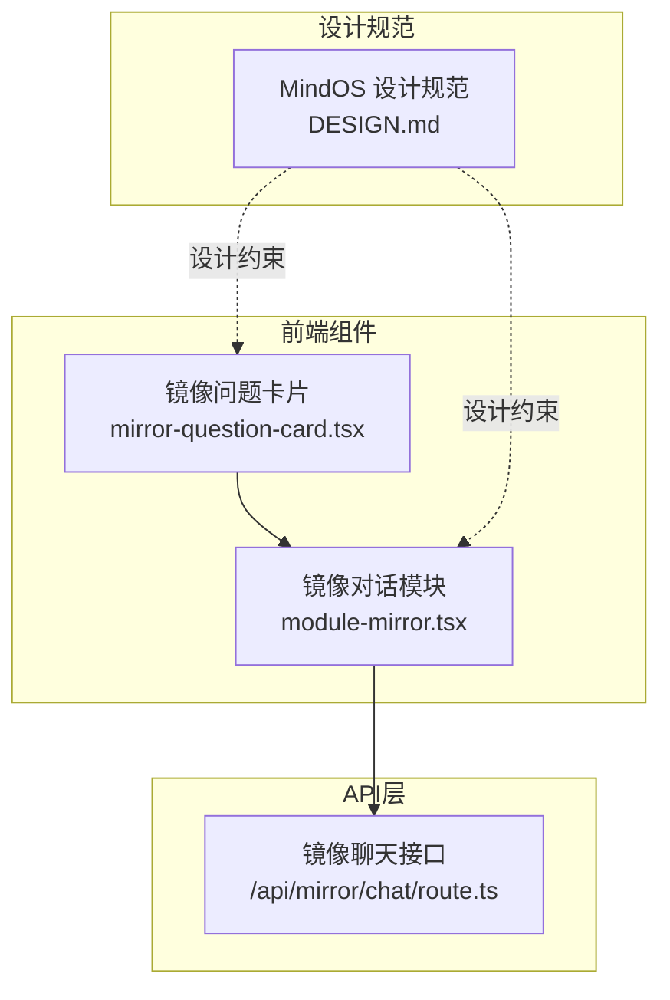
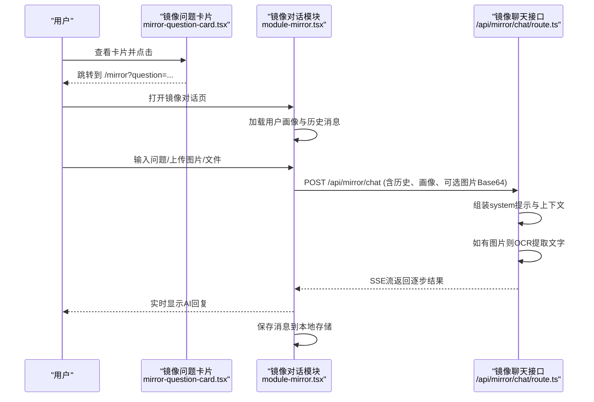
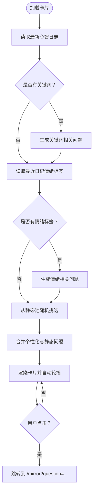
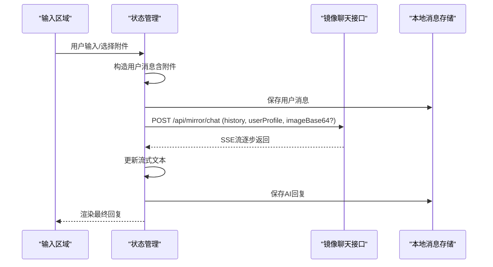
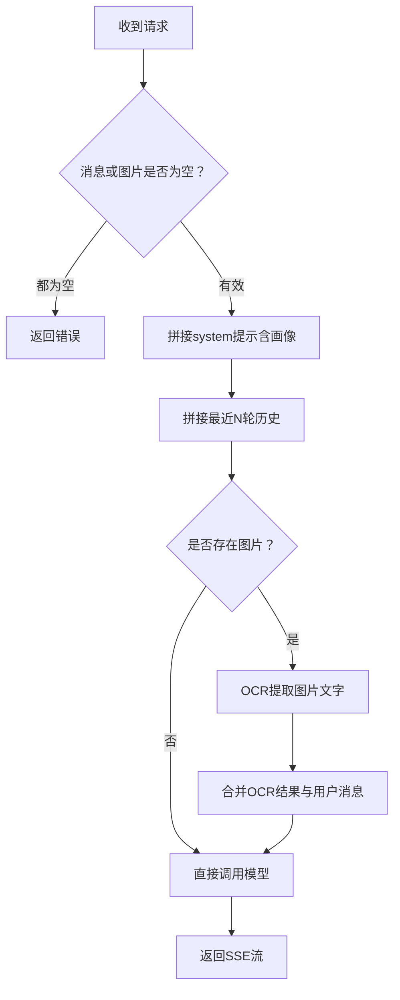
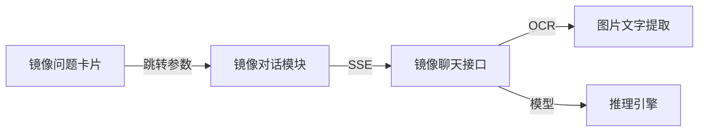

# 镜像洞见系统

<cite>
**本文引用的文件**
- [module-mirror.tsx](file://src/components/dashboard/module-mirror.tsx)
- [mirror-question-card.tsx](file://src/components/dashboard/mirror-question-card.tsx)
- [route.ts](file://src/app/api/mirror/chat/route.ts)
- [DESIGN.md](file://DESIGN.md)
</cite>

## 目录
1. [引言](#引言)
2. [项目结构](#项目结构)
3. [核心组件](#核心组件)
4. [架构总览](#架构总览)
5. [详细组件分析](#详细组件分析)
6. [依赖关系分析](#依赖关系分析)
7. [性能考量](#性能考量)
8. [故障排查指南](#故障排查指南)
9. [结论](#结论)
10. [附录](#附录)

## 引言
镜像洞见系统是一个以“AI对话驱动的自我反思”为核心心智模型的应用模块。它通过“镜像卡片”引导用户提出高质量问题，借助“对话历史管理”维持上下文连贯，结合“图像OCR集成”实现图文混合理解，并以“用户画像”为基础提供个性化深度思考。系统强调“安静写意”的设计哲学，采用柔和色彩与留白排版，营造轻松的自我探索氛围。

## 项目结构
本系统围绕“镜像对话模块”展开，前端采用Next.js App Router组织页面与API路由，UI组件基于Framer Motion实现轻柔动效，整体遵循MindOS设计规范。

**图表来源**
- [module-mirror.tsx:1-590](file://src/components/dashboard/module-mirror.tsx#L1-L590)
- [mirror-question-card.tsx:1-166](file://src/components/dashboard/mirror-question-card.tsx#L1-L166)
- [route.ts:1-65](file://src/app/api/mirror/chat/route.ts#L1-L65)
- [DESIGN.md:1-291](file://DESIGN.md#L1-L291)

**章节来源**
- [module-mirror.tsx:1-590](file://src/components/dashboard/module-mirror.tsx#L1-L590)
- [mirror-question-card.tsx:1-166](file://src/components/dashboard/mirror-question-card.tsx#L1-L166)
- [route.ts:1-65](file://src/app/api/mirror/chat/route.ts#L1-L65)
- [DESIGN.md:1-291](file://DESIGN.md#L1-L291)

## 核心组件
- 镜像问题卡片：基于用户近期心智日志与日记情绪标签动态生成个性化问题，补充静态推荐池，支持自动轮播与点击跳转至镜像对话。
- 镜像对话模块：负责消息收发、流式渲染、附件上传（图片/文件）、会话管理与停止流；对接后端镜像聊天API。
- 镜像聊天接口：接收用户消息与历史上下文，注入用户画像与近期对话摘要，按需执行OCR提取图片文字，选择模型并返回SSE流。

**章节来源**
- [mirror-question-card.tsx:30-166](file://src/components/dashboard/mirror-question-card.tsx#L30-L166)
- [module-mirror.tsx:34-500](file://src/components/dashboard/module-mirror.tsx#L34-L500)
- [route.ts:9-65](file://src/app/api/mirror/chat/route.ts#L9-L65)

## 架构总览
镜像洞见系统采用前后端分离的流式对话架构：前端组件负责交互与状态管理，后端API负责上下文组装、OCR处理与模型推理，并通过SSE将结果逐步返回给前端。

**图表来源**
- [mirror-question-card.tsx:95-99](file://src/components/dashboard/mirror-question-card.tsx#L95-L99)
- [module-mirror.tsx:110-248](file://src/components/dashboard/module-mirror.tsx#L110-L248)
- [route.ts:9-65](file://src/app/api/mirror/chat/route.ts#L9-L65)

## 详细组件分析

### 镜像问题卡片（个性化问题生成）
- 数据来源
  - 心智日志：提取最新每日记录的关键词，形成“关键词对我的影响”类问题。
  - 日记情绪标签：统计最近7天的日记情绪标签集合，随机生成“为什么最近总感到…？”类问题。
  - 静态推荐池：从固定问题池中随机挑选若干，保证多样性与新鲜感。
- 交互特性
  - 自动轮播（约24秒），指示当前问题索引。
  - 点击卡片跳转至镜像对话页，并携带初始问题参数。
- 设计契合
  - 卡片采用低饱和背景与模糊滤镜，符合MindOS“治愈色调、呼吸留白”的设计语言。

**图表来源**
- [mirror-question-card.tsx:36-99](file://src/components/dashboard/mirror-question-card.tsx#L36-L99)

**章节来源**
- [mirror-question-card.tsx:30-166](file://src/components/dashboard/mirror-question-card.tsx#L30-L166)

### 镜像对话模块（消息流与附件）
- 消息收发
  - 支持文本输入与多行自适应高度；Shift+Enter换行，Enter发送。
  - 发送时若无会话ID则自动创建新会话；消息保存至本地存储。
- 流式渲染
  - 通过SSE接收逐步结果，实时更新UI；支持中途停止。
- 附件能力
  - 图片：预览、删除；文件：读取为文本并追加到消息正文。
- 历史与画像
  - 仅取最近N轮对话作为上下文；注入用户画像作为system提示的一部分。

**图表来源**
- [module-mirror.tsx:110-248](file://src/components/dashboard/module-mirror.tsx#L110-L248)

**章节来源**
- [module-mirror.tsx:34-500](file://src/components/dashboard/module-mirror.tsx#L34-L500)

### 镜像聊天接口（上下文、OCR与SSE）
- 上下文管理
  - 限制最近N轮对话，拼接为“之前的对话”与“当前消息”，确保模型聚焦。
- 用户画像注入
  - 将用户画像作为system提示的一部分，增强个性化深度。
- 图像OCR集成
  - 若存在图片Base64，则先用OCR提取文字，再与用户消息合并后交给模型推理。
- 模型选择
  - 在含图片场景优先OCR+模型推理，在纯文本场景直接调用模型。
- 输出格式
  - 返回SSE流，前端逐段渲染，提升感知速度与流畅度。

**图表来源**
- [route.ts:9-65](file://src/app/api/mirror/chat/route.ts#L9-L65)

**章节来源**
- [route.ts:1-65](file://src/app/api/mirror/chat/route.ts#L1-L65)

### 设计规范与体验一致性
- 色彩与排版
  - 使用低饱和度主色与背景，强调“白/暖白”基调；正文行距宽松，段落间距充足。
- 组件风格
  - 卡片采用半透明背景与模糊滤镜，圆角与轻阴影，符合“轻盈、写意”的气质。
- 动效
  - 使用Spring动效与渐入上移，避免闪烁与脉冲，营造自然呼吸感。

**章节来源**
- [DESIGN.md:18-114](file://DESIGN.md#L18-L114)
- [DESIGN.md:149-214](file://DESIGN.md#L149-L214)
- [DESIGN.md:218-254](file://DESIGN.md#L218-L254)

## 依赖关系分析
- 组件耦合
  - 镜像问题卡片与镜像对话模块通过URL参数与路由连接，松耦合。
  - 镜像对话模块与API层通过fetch接口通信，职责清晰。
- 外部依赖
  - OCR能力用于图片文字提取；模型推理通过SSE流返回结果。
- 潜在风险
  - 历史上下文长度与画像拼接可能增加请求体积，需在前端与后端共同控制。

**图表来源**
- [mirror-question-card.tsx:95-99](file://src/components/dashboard/mirror-question-card.tsx#L95-L99)
- [module-mirror.tsx:161-171](file://src/components/dashboard/module-mirror.tsx#L161-L171)
- [route.ts:38-48](file://src/app/api/mirror/chat/route.ts#L38-L48)

**章节来源**
- [module-mirror.tsx:1-590](file://src/components/dashboard/module-mirror.tsx#L1-L590)
- [route.ts:1-65](file://src/app/api/mirror/chat/route.ts#L1-L65)

## 性能考量
- 流式传输
  - 采用SSE分块返回，降低首屏延迟，改善感知速度。
- 上下文裁剪
  - 仅保留最近N轮对话，减少上下文长度，提高响应稳定性。
- 附件处理
  - 图片Base64与文件文本在前端拼接到消息正文，注意控制大小与编码成本。
- 动效与渲染
  - 使用轻量动画与自动高度调整，避免频繁重排。

[本节为通用建议，无需特定文件引用]

## 故障排查指南
- 无法发起对话
  - 检查网络与后端可达性；确认请求体包含消息或图片。
- 回答长时间无响应
  - 查看SSE连接是否中断；检查模型服务可用性。
- 图片无法解析
  - 确认图片Base64格式正确；检查OCR服务状态。
- 历史丢失或异常
  - 确认本地消息存储正常；检查会话ID传递与创建逻辑。
- 体验问题
  - 检查浏览器兼容性与SSE支持；核对动效配置与字体渲染。

**章节来源**
- [module-mirror.tsx:233-247](file://src/components/dashboard/module-mirror.tsx#L233-L247)
- [route.ts:58-64](file://src/app/api/mirror/chat/route.ts#L58-L64)

## 结论
镜像洞见系统通过“问题卡片—对话模块—接口—模型”的闭环，实现了以用户为中心的自我反思体验。其设计强调“留白、错落、轻盈”，技术上以SSE与OCR为支撑，兼顾个性化与易用性。未来可在“对话质量评估体系”“用户画像构建”“知识抽取与链接”等方面持续演进，进一步提升洞察深度与学习价值。

[本节为总结，无需特定文件引用]

## 附录

### 实际对话示例与使用技巧
- 示例A：从镜像卡片进入，系统已注入用户画像，直接获得个性化引导。
- 示例B：上传一张记录灵感的图片，系统先OCR提取文字，再进行综合分析。
- 使用技巧
  - 问题卡片可作为“每日触发器”，固定时间打开卡片，形成反思习惯。
  - 图片与文件可作为“情境补充”，帮助AI更全面地理解背景。
  - 利用SSE的流式输出，耐心等待完整回答，避免过早打断。

[本节为概念性说明，无需特定文件引用]