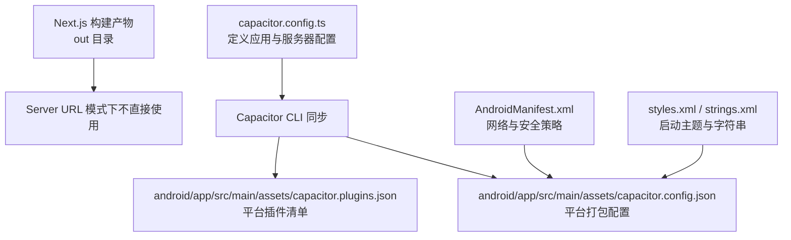
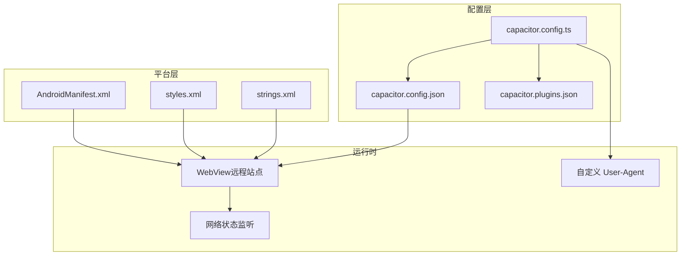
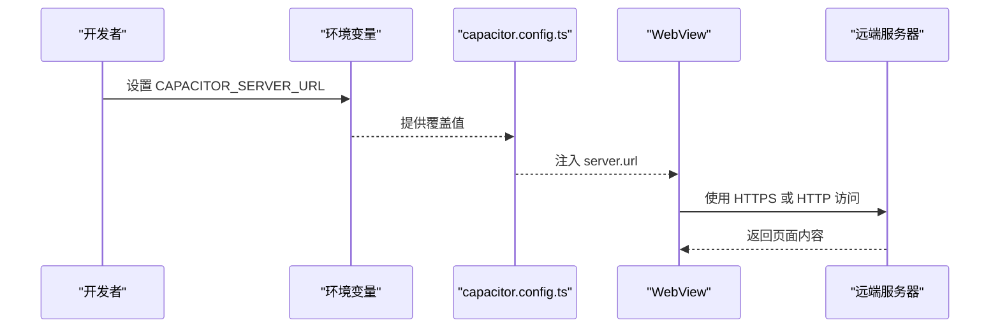
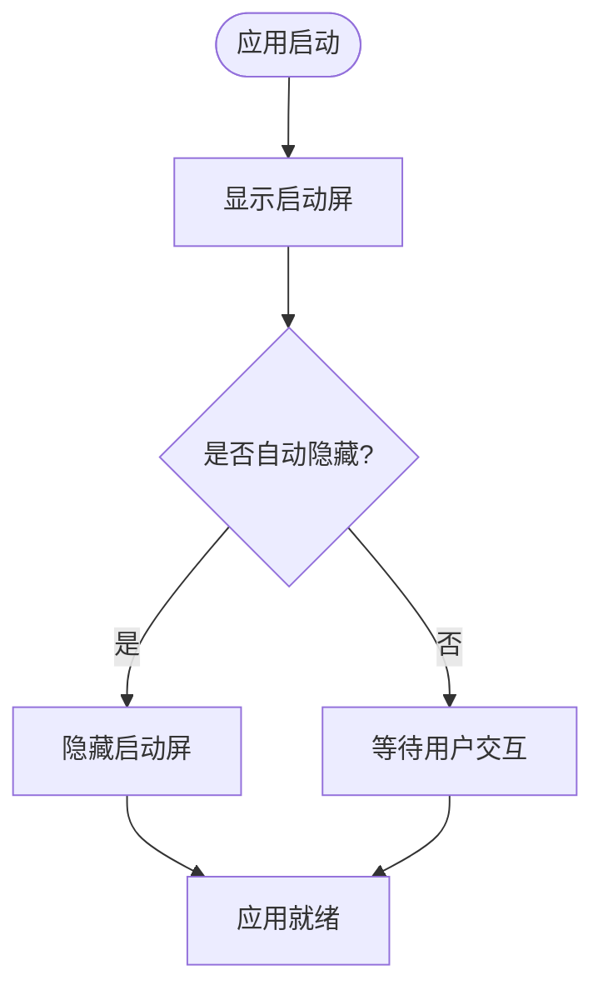
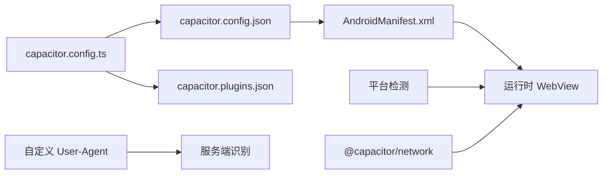

# Capacitor 配置

<cite>
**本文引用的文件**
- [capacitor.config.ts](file://capacitor.config.ts)
- [capacitor.config.json](file://android/app/src/main/assets/capacitor.config.json)
- [capacitor.plugins.json](file://android/app/src/main/assets/capacitor.plugins.json)
- [AndroidManifest.xml](file://android/app/src/main/AndroidManifest.xml)
- [styles.xml](file://android/app/src/main/res/values/styles.xml)
- [strings.xml](file://android/app/src/main/res/values/strings.xml)
- [package.json](file://package.json)
- [next.config.js](file://next.config.js)
- [platform.ts](file://src/lib/utils/platform.ts)
- [network.ts](file://src/lib/native/network.ts)
- [session.ts](file://src/lib/auth/session.ts)
</cite>

## 目录
1. [简介](#简介)
2. [项目结构](#项目结构)
3. [核心组件](#核心组件)
4. [架构总览](#架构总览)
5. [详细组件分析](#详细组件分析)
6. [依赖关系分析](#依赖关系分析)
7. [性能考量](#性能考量)
8. [故障排查指南](#故障排查指南)
9. [结论](#结论)
10. [附录](#附录)

## 简介
本文件系统性梳理 Capacitor 配置，围绕应用标识、应用名称、Web 目录与服务器配置展开，并结合开发与生产模式差异，详解 Android 与 iOS 平台特定项（如背景色、混合内容、内容插入、自定义 Scheme 等），同时给出插件配置（尤其是启动屏）与环境变量使用方法及最佳实践。

## 项目结构
本项目采用“代码库内统一配置 + 平台资源打包”的方式：
- TypeScript 配置文件定义核心参数，构建后由 Capacitor CLI 同步到各平台资源目录
- Android 平台包含 JSON 配置与插件清单，随应用打包分发
- Next.js 作为前端框架，Capacitor 以“Server URL 模式”加载远程站点或静态导出产物

图表来源
- [capacitor.config.ts:1-37](file://capacitor.config.ts#L1-L37)
- [capacitor.config.json:1-30](file://android/app/src/main/assets/capacitor.config.json#L1-L30)
- [capacitor.plugins.json:1-39](file://android/app/src/main/assets/capacitor.plugins.json#L1-L39)
- [AndroidManifest.xml:1-53](file://android/app/src/main/AndroidManifest.xml#L1-L53)
- [styles.xml:1-22](file://android/app/src/main/res/values/styles.xml#L1-L22)
- [strings.xml:1-8](file://android/app/src/main/res/values/strings.xml#L1-L8)

章节来源
- [capacitor.config.ts:1-37](file://capacitor.config.ts#L1-L37)
- [package.json:1-91](file://package.json#L1-L91)

## 核心组件
- 应用标识与名称
  - 应用标识（appId）与应用名称（appName）在 TypeScript 配置中统一定义，Android 平台也通过资源字符串同步
- Web 目录（webDir）
  - 默认指向 out（Next.js 静态导出输出目录），在 Server URL 模式下不直接使用
- 服务器配置（server）
  - 远程站点地址（url），支持通过环境变量覆盖
  - 允许明文 HTTP（cleartext），便于开发回退
  - Android Scheme 在生产环境使用 HTTPS
  - 自定义 User-Agent（appendUserAgent），用于服务端识别来自 App 的请求
- 平台特定配置
  - iOS：内容插入策略（contentInset）、自定义 URL Scheme（scheme）
  - Android：启动背景色（backgroundColor）、混合内容开关（allowMixedContent）
- 插件配置
  - 启动屏（SplashScreen）：自动隐藏、背景色、是否显示转圈、缩放类型、全屏与沉浸式
  - 插件清单（capacitor.plugins.json）：内置插件集合（App、Browser、Haptics、Keyboard、Local Notifications、Network、Share、Splash Screen、Status Bar）

章节来源
- [capacitor.config.ts:3-34](file://capacitor.config.ts#L3-L34)
- [capacitor.config.json:1-30](file://android/app/src/main/assets/capacitor.config.json#L1-L30)
- [capacitor.plugins.json:1-39](file://android/app/src/main/assets/capacitor.plugins.json#L1-L39)

## 架构总览
Capacitor 以“Server URL 模式”运行时，WebView 直接加载远端站点；开发与生产模式的关键差异体现在服务器地址、协议与安全策略上。AndroidManifest.xml 中的网络与安全配置与 Capacitor 配置相互配合，确保网络访问与安全策略一致。

图表来源
- [capacitor.config.ts:1-37](file://capacitor.config.ts#L1-L37)
- [capacitor.config.json:1-30](file://android/app/src/main/assets/capacitor.config.json#L1-L30)
- [capacitor.plugins.json:1-39](file://android/app/src/main/assets/capacitor.plugins.json#L1-L39)
- [AndroidManifest.xml:1-53](file://android/app/src/main/AndroidManifest.xml#L1-L53)
- [styles.xml:1-22](file://android/app/src/main/res/values/styles.xml#L1-L22)
- [strings.xml:1-8](file://android/app/src/main/res/values/strings.xml#L1-L8)

## 详细组件分析

### 应用标识与名称（appId / appName）
- 作用：唯一标识应用与展示名称，影响包名、启动图标与标题栏显示
- 配置位置：
  - TypeScript 配置：统一定义
  - Android 资源：strings.xml 同步应用名与包名
- 影响范围：包管理、安装界面、启动页主题、系统任务切换卡片

章节来源
- [capacitor.config.ts:4-5](file://capacitor.config.ts#L4-L5)
- [strings.xml:3-6](file://android/app/src/main/res/values/strings.xml#L3-L6)

### Web 目录（webDir）
- 作用：指定静态导出目录（Next.js 构建产物 out）
- Server URL 模式说明：WebView 直接加载远程站点，该目录在该模式下不直接使用
- 与构建脚本的关系：Next.js 构建生成 out，Capacitor 同步时会将该目录作为静态资源参考

章节来源
- [capacitor.config.ts:6](file://capacitor.config.ts#L6)
- [package.json:6-8](file://package.json#L6-L8)
- [next.config.js:22-31](file://next.config.js#L22-L31)

### 服务器配置（server）
- 远程站点地址（url）
  - 开发：可通过环境变量覆盖为本地地址（例如本机 3100 端口）
  - 生产：默认指向 HTTPS 远端域名
- 明文 HTTP 支持（cleartext）
  - 开发阶段允许 HTTP，便于回退与调试
- Android Scheme（androidScheme）
  - 生产环境使用 HTTPS，保障安全
- 自定义 User-Agent（appendUserAgent）
  - 服务端通过 UA 识别来自 App 的请求，便于差异化处理

图表来源
- [capacitor.config.ts:10](file://capacitor.config.ts#L10)
- [AndroidManifest.xml:13](file://android/app/src/main/AndroidManifest.xml#L13)

章节来源
- [capacitor.config.ts:7-15](file://capacitor.config.ts#L7-L15)
- [AndroidManifest.xml:13](file://android/app/src/main/AndroidManifest.xml#L13)

### iOS 平台特定配置
- 内容插入策略（contentInset: 'always'）
  - 控制内容在安全区域内的插入方式，保证刘海屏与底部安全区适配
- 自定义 URL Scheme（scheme: 'MindOS'）
  - 用于深度链接与系统交互（如自定义协议唤起）

章节来源
- [capacitor.config.ts:16-19](file://capacitor.config.ts#L16-L19)

### Android 平台特定配置
- 启动背景色（backgroundColor: '#fefef9'）
  - 与启动页主题一致，避免白/黑闪屏
- 混合内容（allowMixedContent: false）
  - 生产环境禁止混合内容，HTTPS 下加载 HTTP 资源会被阻止
- 网络与安全策略（AndroidManifest.xml）
  - 允许明文流量（开发阶段）
  - 网络安全配置文件（network_security_config.xml）与自定义网络策略配合

章节来源
- [capacitor.config.ts:20-23](file://capacitor.config.ts#L20-L23)
- [AndroidManifest.xml:13-15](file://android/app/src/main/AndroidManifest.xml#L13-L15)
- [styles.xml:19-21](file://android/app/src/main/res/values/styles.xml#L19-L21)

### 插件配置：启动屏（SplashScreen）
- 自动隐藏（launchAutoHide: true）
- 背景色（backgroundColor: '#fefef9'）
- 是否显示转圈（showSpinner: false）
- 缩放类型（androidScaleType: 'CENTER_CROP'）
- 全屏与沉浸式（splashFullScreen: true, splashImmersive: true）

图表来源
- [capacitor.config.ts:24-33](file://capacitor.config.ts#L24-L33)

章节来源
- [capacitor.config.ts:24-33](file://capacitor.config.ts#L24-L33)
- [capacitor.config.json:19-28](file://android/app/src/main/assets/capacitor.config.json#L19-L28)

### 插件清单（capacitor.plugins.json）
- 内置插件集合：App、Browser、Haptics、Keyboard、Local Notifications、Network、Share、Splash Screen、Status Bar
- 作用：声明运行时可用的原生能力，随应用打包分发

章节来源
- [capacitor.plugins.json:1-39](file://android/app/src/main/assets/capacitor.plugins.json#L1-L39)

### 环境变量与最佳实践
- 环境变量
  - CAPACITOR_SERVER_URL：覆盖服务器地址（优先级高于配置文件默认值）
  - SESSION_SECRET：用于服务端会话加密（与 UA 识别联动）
- 最佳实践
  - 开发：使用本地地址 + HTTP（允许明文），便于快速迭代
  - 生产：固定 HTTPS 域名，关闭明文，启用混合内容限制
  - 服务端：通过自定义 User-Agent 识别 App 请求，提供差异化体验或安全策略
  - 平台：AndroidManifest 的网络与安全策略需与 Capacitor 配置一致

章节来源
- [capacitor.config.ts:10](file://capacitor.config.ts#L10)
- [session.ts:8](file://src/lib/auth/session.ts#L8)
- [AndroidManifest.xml:13-15](file://android/app/src/main/AndroidManifest.xml#L13-L15)

## 依赖关系分析
- 配置耦合
  - TypeScript 配置与 Android JSON 配置保持字段一致，确保同步一致性
  - 插件清单与实际运行时插件能力匹配
- 运行时依赖
  - 平台检测与网络监听依赖 Capacitor 原生能力
  - 服务端通过 UA 识别 App 请求，实现差异化逻辑

图表来源
- [capacitor.config.ts:1-37](file://capacitor.config.ts#L1-L37)
- [capacitor.config.json:1-30](file://android/app/src/main/assets/capacitor.config.json#L1-L30)
- [capacitor.plugins.json:1-39](file://android/app/src/main/assets/capacitor.plugins.json#L1-L39)
- [AndroidManifest.xml:1-53](file://android/app/src/main/AndroidManifest.xml#L1-L53)
- [platform.ts:14-27](file://src/lib/utils/platform.ts#L14-L27)
- [network.ts:36-50](file://src/lib/native/network.ts#L36-L50)

章节来源
- [platform.ts:14-27](file://src/lib/utils/platform.ts#L14-L27)
- [network.ts:36-50](file://src/lib/native/network.ts#L36-L50)

## 性能考量
- Server URL 模式优势
  - 无需将静态资源打包进原生壳，减少包体体积
  - 前端热更新更灵活（仅需更新远端站点）
- 注意事项
  - 生产环境务必使用 HTTPS，避免混合内容导致资源加载失败
  - 启动屏配置应与启动主题一致，减少视觉闪烁
  - 网络监听与平台检测建议按需初始化，避免不必要的开销

## 故障排查指南
- 无法加载远程站点
  - 检查服务器地址与协议（开发使用 HTTP，生产使用 HTTPS）
  - 确认 AndroidManifest 的明文流量配置与开发需求一致
- 启动屏异常
  - 对比启动主题与启动屏配置，确保背景色一致
  - 检查缩放类型与全屏/沉浸式配置
- 用户代理识别问题
  - 确认自定义 User-Agent 已注入到 Capacitor 配置
  - 服务端需正确解析 UA 并区分 App 与浏览器请求
- 平台检测与网络状态
  - 使用平台检测工具确认运行环境
  - 原生网络插件监听网络状态变化，注意回调时机

章节来源
- [AndroidManifest.xml:13-15](file://android/app/src/main/AndroidManifest.xml#L13-L15)
- [capacitor.config.ts:13-14](file://capacitor.config.ts#L13-L14)
- [platform.ts:14-27](file://src/lib/utils/platform.ts#L14-L27)
- [network.ts:36-50](file://src/lib/native/network.ts#L36-L50)

## 结论
本项目的 Capacitor 配置以“Server URL 模式”为核心，通过 TypeScript 配置统一管理应用标识、名称、服务器与平台特性，并借助环境变量实现开发与生产的灵活切换。Android 与 iOS 的平台特定项与插件配置共同保障了启动体验与原生能力。遵循本文的最佳实践，可在保证安全性的同时提升开发效率与用户体验。

## 附录
- 开发与生产模式对照
  - 开发：本地服务器地址 + HTTP（允许明文）
  - 生产：固定 HTTPS 域名 + 禁止明文 + 禁止混合内容
- 相关脚本与配置
  - 构建与同步：Next.js 构建与 Capacitor 同步脚本
  - PWA：生产环境下启用 PWA 插件（与 Capacitor 协同）

章节来源
- [package.json:5-18](file://package.json#L5-L18)
- [next.config.js:22-31](file://next.config.js#L22-L31)