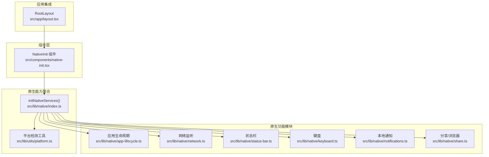
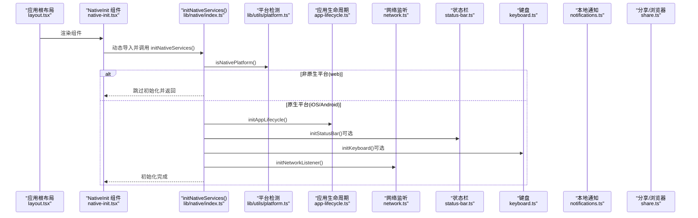
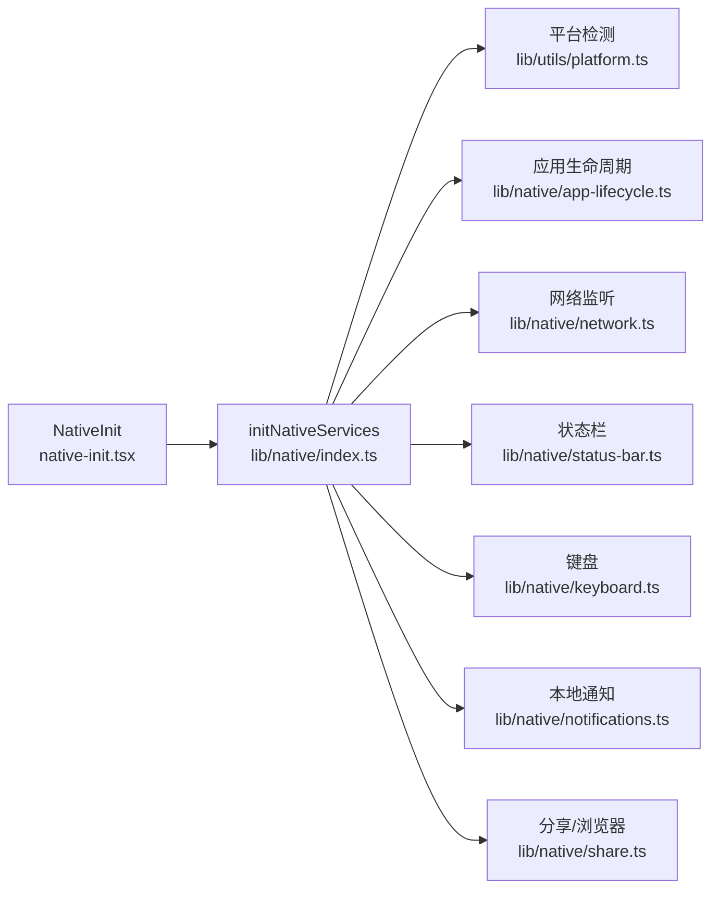

# 原生初始化组件

<cite>
**本文档引用的文件**
- [native-init.tsx](file://src/components/native-init.tsx)
- [index.ts](file://src/lib/native/index.ts)
- [platform.ts](file://src/lib/utils/platform.ts)
- [app-lifecycle.ts](file://src/lib/native/app-lifecycle.ts)
- [network.ts](file://src/lib/native/network.ts)
- [status-bar.ts](file://src/lib/native/status-bar.ts)
- [keyboard.ts](file://src/lib/native/keyboard.ts)
- [notifications.ts](file://src/lib/native/notifications.ts)
- [share.ts](file://src/lib/native/share.ts)
- [layout.tsx](file://src/app/layout.tsx)
</cite>

## 目录
1. [简介](#简介)
2. [项目结构](#项目结构)
3. [核心组件](#核心组件)
4. [架构总览](#架构总览)
5. [详细组件分析](#详细组件分析)
6. [依赖关系分析](#依赖关系分析)
7. [性能考虑](#性能考虑)
8. [故障排除指南](#故障排除指南)
9. [结论](#结论)

## 简介
本文件系统性阐述原生初始化组件的功能、实现原理与最佳实践，重点覆盖以下方面：
- native-init.tsx 组件的作用与工作流程
- 平台检测机制（web、android、ios）与差异化处理
- 初始化顺序、错误处理与性能优化策略
- 与各原生功能模块的依赖关系
- 使用示例路径与常见问题解决方案

## 项目结构
原生初始化相关代码主要分布在以下位置：
- 组件层：src/components/native-init.tsx
- 原生能力聚合入口：src/lib/native/index.ts
- 平台检测工具：src/lib/utils/platform.ts
- 各原生功能模块：app-lifecycle.ts、network.ts、status-bar.ts、keyboard.ts、notifications.ts、share.ts
- 应用布局集成：src/app/layout.tsx

图表来源
- [native-init.tsx:1-16](file://src/components/native-init.tsx#L1-L16)
- [index.ts:1-55](file://src/lib/native/index.ts#L1-L55)
- [platform.ts:1-60](file://src/lib/utils/platform.ts#L1-L60)
- [app-lifecycle.ts:1-98](file://src/lib/native/app-lifecycle.ts#L1-L98)
- [network.ts:1-102](file://src/lib/native/network.ts#L1-L102)
- [status-bar.ts:1-55](file://src/lib/native/status-bar.ts#L1-L55)
- [keyboard.ts:1-24](file://src/lib/native/keyboard.ts#L1-L24)
- [notifications.ts:1-110](file://src/lib/native/notifications.ts#L1-L110)
- [share.ts:1-72](file://src/lib/native/share.ts#L1-L72)
- [layout.tsx:1-32](file://src/app/layout.tsx#L1-L32)

章节来源
- [native-init.tsx:1-16](file://src/components/native-init.tsx#L1-L16)
- [index.ts:1-55](file://src/lib/native/index.ts#L1-L55)
- [platform.ts:1-60](file://src/lib/utils/platform.ts#L1-L60)
- [layout.tsx:1-32](file://src/app/layout.tsx#L1-L32)

## 核心组件
- NativeInit 组件：在客户端执行副作用，在组件挂载后动态加载原生能力聚合入口，并调用初始化函数。若初始化失败，仅记录警告日志，保证应用主流程不受影响。
- initNativeServices 函数：统一的原生能力初始化入口，负责平台检测、按需初始化各原生模块，并对可选插件进行容错处理。

章节来源
- [native-init.tsx:5-15](file://src/components/native-init.tsx#L5-L15)
- [index.ts:19-54](file://src/lib/native/index.ts#L19-L54)

## 架构总览
下图展示了从应用根布局到原生初始化的整体流程，以及各原生功能模块之间的协作关系：

图表来源
- [layout.tsx:23-29](file://src/app/layout.tsx#L23-L29)
- [native-init.tsx:6-12](file://src/components/native-init.tsx#L6-L12)
- [index.ts:19-54](file://src/lib/native/index.ts#L19-L54)
- [platform.ts:14-27](file://src/lib/utils/platform.ts#L14-L27)
- [app-lifecycle.ts:31-66](file://src/lib/native/app-lifecycle.ts#L31-L66)
- [network.ts:32-62](file://src/lib/native/network.ts#L32-L62)
- [status-bar.ts:9-26](file://src/lib/native/status-bar.ts#L9-L26)
- [keyboard.ts:9-23](file://src/lib/native/keyboard.ts#L9-L23)
- [notifications.ts:24-41](file://src/lib/native/notifications.ts#L24-L41)
- [share.ts:14-27](file://src/lib/native/share.ts#L14-L27)

## 详细组件分析

### NativeInit 组件
- 作用：作为应用启动时的“原生初始化门面”，在客户端生命周期内触发原生能力初始化。
- 工作原理：
  - 使用 React 的 useEffect 在组件挂载时执行。
  - 通过动态 import 加载原生能力聚合入口，避免在 SSR 或非客户端环境执行。
  - 调用 initNativeServices() 并捕获异常，仅输出警告日志，确保应用健壮性。
- 返回值：无副作用渲染，返回 null。

章节来源
- [native-init.tsx:5-15](file://src/components/native-init.tsx#L5-L15)

### initNativeServices 初始化流程
- 平台检测：通过 isNativePlatform() 判断是否在原生平台运行。
- 初始化顺序：
  1) 应用生命周期监听（必须）
  2) 状态栏初始化（可选，取决于是否安装对应插件）
  3) 键盘初始化（可选，取决于是否安装对应插件）
  4) 网络监听（必须）
- 容错处理：对可选模块（状态栏、键盘）采用 try/catch 包裹，未安装插件时静默跳过。

章节来源
- [index.ts:19-54](file://src/lib/native/index.ts#L19-L54)

### 平台检测机制
- isNativePlatform()：基于 Capacitor 的原生平台判定，缓存结果以避免重复计算。
- getPlatform()：返回 'ios' | 'android' | 'web'，用于更细粒度的差异化处理。
- isIOS()/isAndroid()：便捷判断函数，便于业务侧根据平台定制行为。

章节来源
- [platform.ts:14-60](file://src/lib/utils/platform.ts#L14-L60)

### 应用生命周期管理
- 监听事件：resume、pause、backButton、appUrlOpen。
- 行为差异：
  - Android 返回键：优先历史回退，否则触发自定义回调，最后才退出应用。
  - 深度链接：分发 URL 至注册的回调列表。
- 订阅管理：提供 onResume、onPause、onBackButton、onAppUrlOpen 四类回调注册与注销接口。

章节来源
- [app-lifecycle.ts:31-98](file://src/lib/native/app-lifecycle.ts#L31-L98)

### 网络状态监听
- 原生平台：使用 @capacitor/network 获取精确连接类型（wifi/cellular/none/unknown），并监听变化事件。
- Web 平台：降级为 navigator.onLine，监听 online/offline 事件。
- 订阅管理：onNetworkChange 提供回调注册；isOnline 提供即时查询；getNetworkStatus 返回当前快照。

章节来源
- [network.ts:32-102](file://src/lib/native/network.ts#L32-L102)

### 状态栏管理
- 原生平台：设置浅色风格；Android 进一步设置透明背景并允许内容延伸至状态栏下方。
- Web 平台：静默降级，不做任何操作。
- 辅助接口：hideStatusBar/showStatusBar 支持运行时显隐控制。

章节来源
- [status-bar.ts:9-55](file://src/lib/native/status-bar.ts#L9-L55)

### 键盘管理
- 原生平台：设置键盘调整模式为视图缩放，启用输入框滚动，提升用户体验。
- Web 平台：静默降级。
- 适用场景：表单输入较多的页面。

章节来源
- [keyboard.ts:9-24](file://src/lib/native/keyboard.ts#L9-L24)

### 本地通知
- 权限请求：原生平台使用 LocalNotifications.requestPermissions；Web 平台使用 Notification.requestPermission。
- 调度通知：原生平台支持定时；Web 平台立即展示（不支持定时）。
- 取消通知：支持按 id 取消与清空所有待发通知。
- 注意：用户取消分享在分享模块中被视为正常流程，不影响整体初始化。

章节来源
- [notifications.ts:24-110](file://src/lib/native/notifications.ts#L24-L110)

### 分享与外部浏览器
- 打开外部浏览器：原生平台使用 Browser.open；Web 平台使用 window.open。
- 系统分享：原生平台使用 Share；Web 平台优先使用 Web Share API，不可用时回退到剪贴板复制。
- 降级策略：确保在不同环境下均有可用体验。

章节来源
- [share.ts:14-72](file://src/lib/native/share.ts#L14-L72)

### 组件使用与最佳实践
- 使用方式：在应用根布局中渲染 NativeInit 组件，确保在应用启动时尽早初始化。
- 初始化顺序：遵循 initNativeServices 中的顺序，避免跨模块依赖冲突。
- 错误处理：所有原生调用均包含 try/catch 与日志输出，建议在生产环境结合监控系统收集日志。
- 性能优化：
  - 使用动态 import 减少首屏包体。
  - 缓存平台检测结果，避免重复调用。
  - 对可选模块（状态栏、键盘）采用懒初始化，仅在需要时加载。
- 平台差异化：
  - web：跳过原生初始化，直接使用降级方案。
  - ios/android：按需启用状态栏、键盘等增强体验。

章节来源
- [layout.tsx:23-29](file://src/app/layout.tsx#L23-L29)
- [index.ts:19-54](file://src/lib/native/index.ts#L19-L54)
- [platform.ts:14-27](file://src/lib/utils/platform.ts#L14-L27)

## 依赖关系分析
- 组件依赖：NativeInit 依赖原生能力聚合入口；原生能力聚合入口依赖平台检测工具。
- 功能模块依赖：initNativeServices 依次依赖应用生命周期、网络监听、状态栏、键盘等模块；状态栏与键盘为可选依赖。
- 平台耦合：各模块均通过平台检测工具决定是否执行原生逻辑。

图表来源
- [native-init.tsx:6-12](file://src/components/native-init.tsx#L6-L12)
- [index.ts:19-54](file://src/lib/native/index.ts#L19-L54)
- [platform.ts:14-27](file://src/lib/utils/platform.ts#L14-L27)
- [app-lifecycle.ts:31-66](file://src/lib/native/app-lifecycle.ts#L31-L66)
- [network.ts:32-62](file://src/lib/native/network.ts#L32-L62)
- [status-bar.ts:9-26](file://src/lib/native/status-bar.ts#L9-L26)
- [keyboard.ts:9-23](file://src/lib/native/keyboard.ts#L9-L23)
- [notifications.ts:24-41](file://src/lib/native/notifications.ts#L24-L41)
- [share.ts:14-27](file://src/lib/native/share.ts#L14-L27)

## 性能考虑
- 懒加载：通过动态 import 将原生模块按需加载，降低首屏体积与启动延迟。
- 缓存策略：平台检测结果缓存于内存，避免重复调用 Capacitor API。
- 可选模块：状态栏与键盘初始化采用 try/catch，未安装插件时不阻塞主线程。
- 事件去抖：网络状态监听与生命周期回调采用一次性初始化，避免重复绑定。

## 故障排除指南
- 症状：原生命令初始化失败但应用仍可运行
  - 排查：检查对应插件是否正确安装与配置；查看控制台警告日志。
  - 处理：确认 Capacitor 插件清单与平台配置一致；必要时在可选模块中添加更详细的错误上报。
- 症状：网络状态监听在 web 环境不生效
  - 排查：确认已调用 initNetworkListener；检查浏览器在线状态 API 是否可用。
  - 处理：确认降级逻辑已启用；在需要精确网络类型时，建议在原生平台部署。
- 症状：状态栏/键盘初始化被跳过
  - 排查：确认对应 Capacitor 插件已安装；检查平台检测结果。
  - 处理：在安装插件后重新构建；确认插件版本与 Capacitor 版本兼容。
- 症状：分享/浏览器打开失败
  - 排查：检查原生插件是否可用；确认 URL 格式正确。
  - 处理：在降级路径中验证 Web Share API 或剪贴板权限；确保在安全上下文中运行。

章节来源
- [index.ts:34-47](file://src/lib/native/index.ts#L34-L47)
- [network.ts:55-82](file://src/lib/native/network.ts#L55-L82)
- [status-bar.ts:23-25](file://src/lib/native/status-bar.ts#L23-L25)
- [keyboard.ts:20-22](file://src/lib/native/keyboard.ts#L20-L22)
- [share.ts:20-27](file://src/lib/native/share.ts#L20-L27)

## 结论
原生初始化组件通过统一入口与平台检测机制，实现了在 web、ios、android 三端的一致化体验与差异化增强。其设计强调：
- 容错与降级：非关键原生能力采用可选初始化，保证应用稳定性。
- 懒加载与缓存：减少首屏负担，提升启动性能。
- 明确的初始化顺序：确保关键能力（如生命周期、网络监听）优先就绪。
- 易扩展：新增原生能力只需在聚合入口中注册与初始化，保持模块边界清晰。