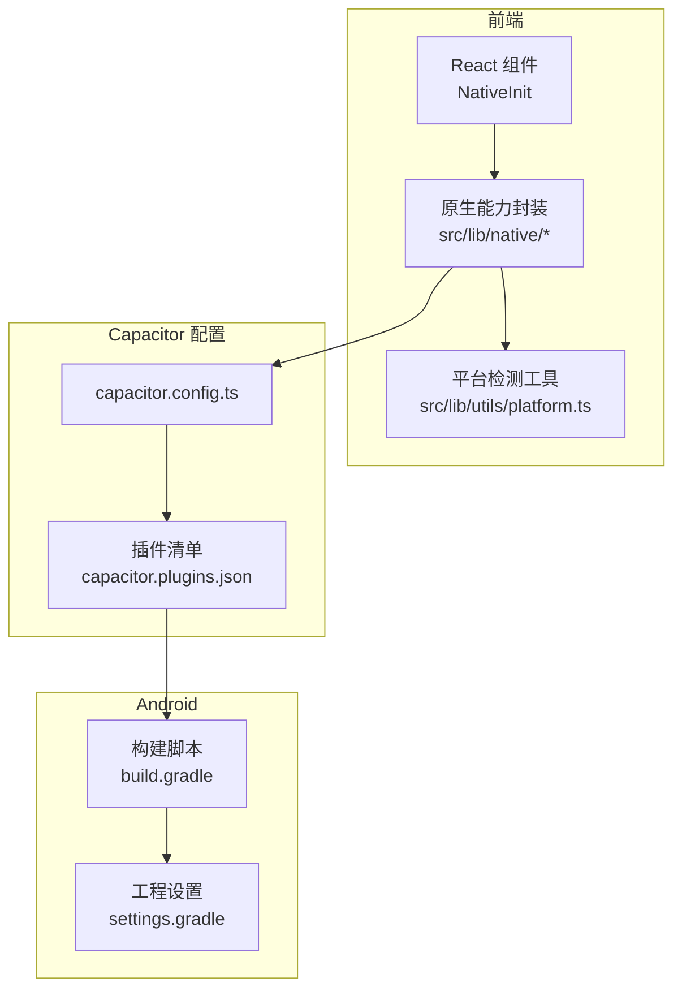
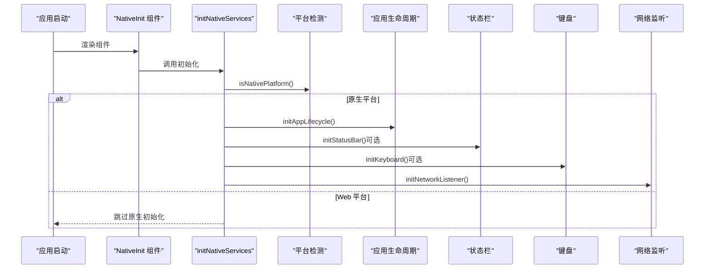
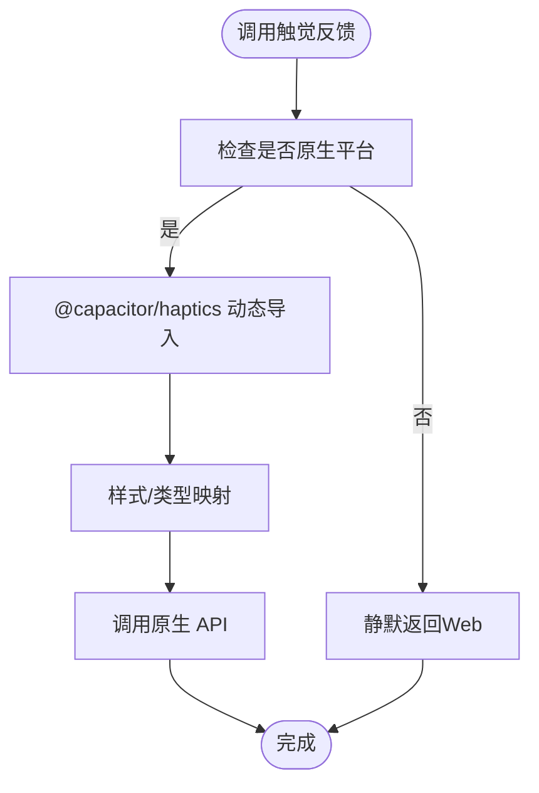
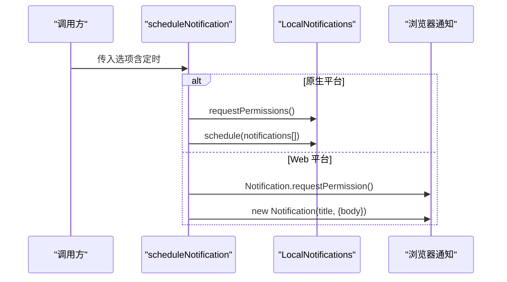
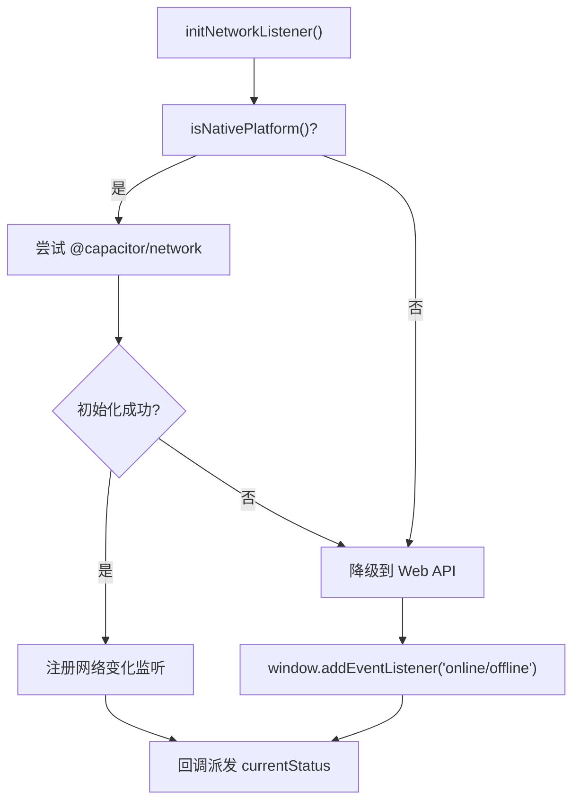
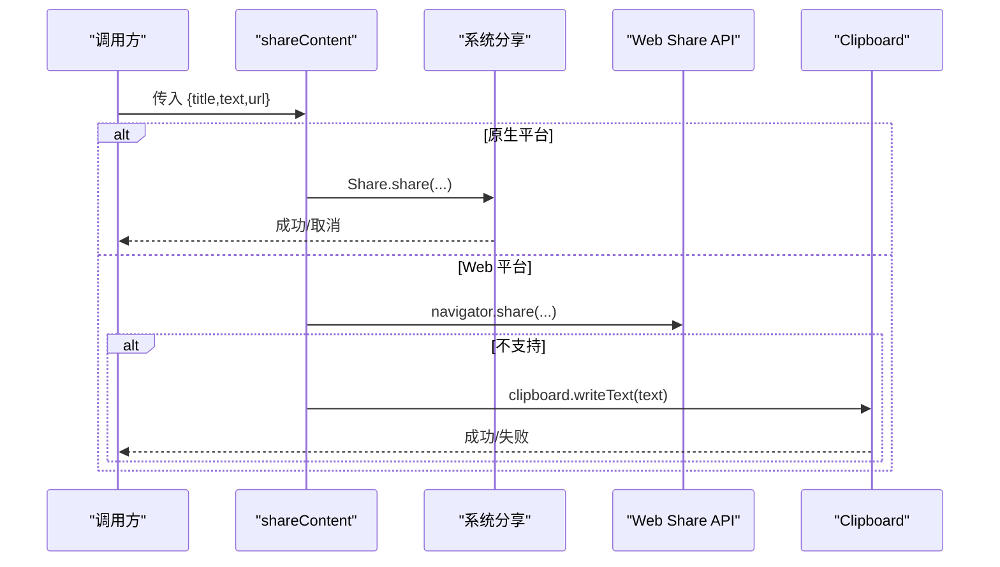
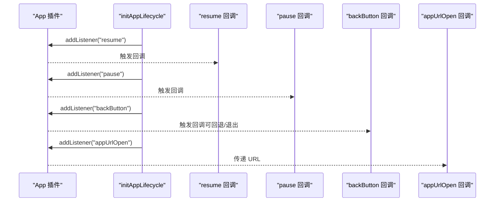
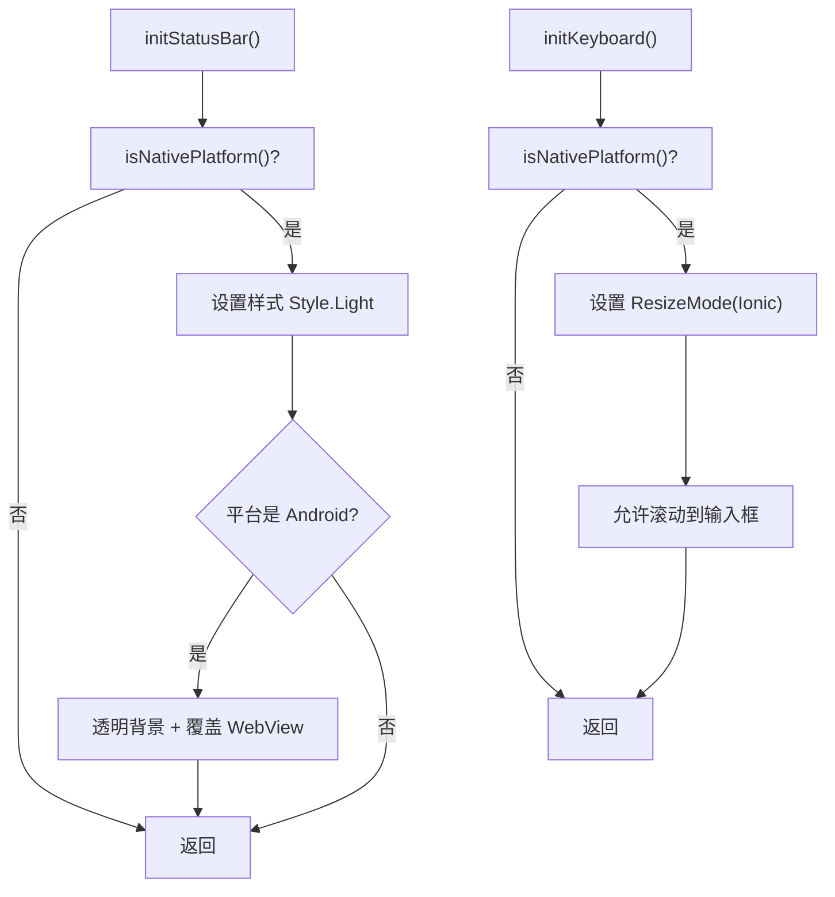
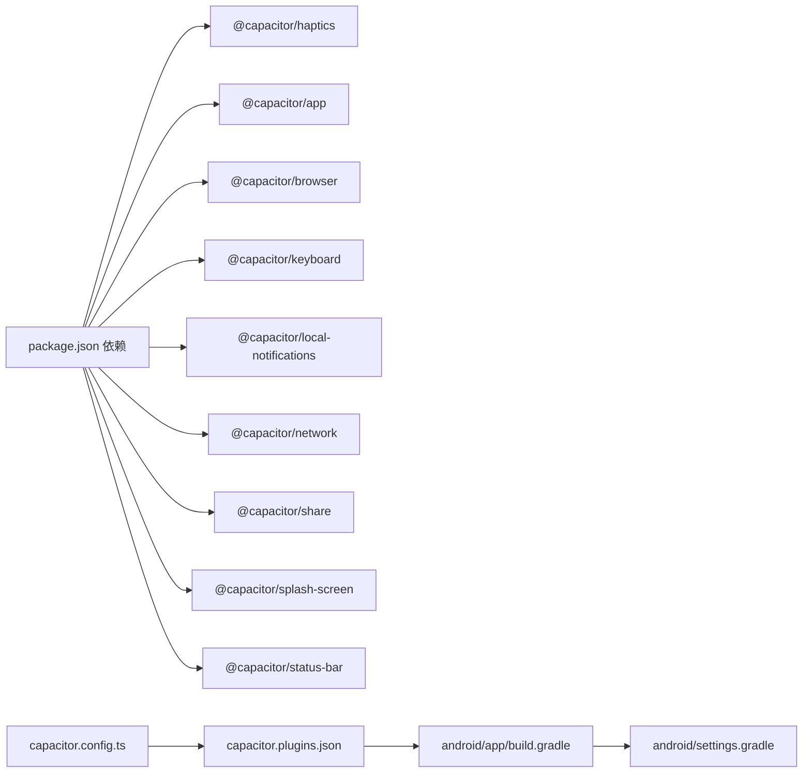

# 原生功能开发

<cite>
**本文引用的文件**
- [capacitor.config.ts](file://capacitor.config.ts)
- [package.json](file://package.json)
- [src/lib/utils/platform.ts](file://src/lib/utils/platform.ts)
- [src/lib/native/index.ts](file://src/lib/native/index.ts)
- [src/components/native-init.tsx](file://src/components/native-init.tsx)
- [src/lib/native/app-lifecycle.ts](file://src/lib/native/app-lifecycle.ts)
- [src/lib/native/haptics.ts](file://src/lib/native/haptics.ts)
- [src/lib/native/notifications.ts](file://src/lib/native/notifications.ts)
- [src/lib/native/network.ts](file://src/lib/native/network.ts)
- [src/lib/native/share.ts](file://src/lib/native/share.ts)
- [src/lib/native/status-bar.ts](file://src/lib/native/status-bar.ts)
- [src/lib/native/keyboard.ts](file://src/lib/native/keyboard.ts)
- [android/app/src/main/assets/capacitor.plugins.json](file://android/app/src/main/assets/capacitor.plugins.json)
- [android/app/build.gradle](file://android/app/build.gradle)
- [android/settings.gradle](file://android/settings.gradle)
- [android/app/src/test/java/com/getcapacitor/myapp/ExampleUnitTest.java](file://android/app/src/test/java/com/getcapacitor/myapp/ExampleUnitTest.java)
- [android/app/src/androidTest/java/com/getcapacitor/myapp/ExampleInstrumentedTest.java](file://android/app/src/androidTest/java/com/getcapacitor/myapp/ExampleInstrumentedTest.java)
</cite>

## 目录
1. [简介](#简介)
2. [项目结构](#项目结构)
3. [核心组件](#核心组件)
4. [架构总览](#架构总览)
5. [详细组件分析](#详细组件分析)
6. [依赖关系分析](#依赖关系分析)
7. [性能考虑](#性能考虑)
8. [故障排查指南](#故障排查指南)
9. [结论](#结论)
10. [附录](#附录)

## 简介
本指南面向在 Capacitor 中开发与封装原生功能的工程师，结合本仓库现有实现，系统讲解以下主题：
- TypeScript 接口定义与类型安全
- 原生代码实现与动态导入策略
- 跨平台兼容性处理（原生 vs Web）
- 原生初始化组件的工作原理与使用方法
- 常见原生功能的开发示例（触觉反馈、本地通知、网络状态、分享与浏览器、状态栏与键盘、应用生命周期）
- 原生插件开发流程、测试方法与调试技巧
- 平台差异与兼容性问题的处理策略

## 项目结构
本项目采用 Capacitor 8 + Next.js 的混合架构，前端以 React/Next 构建，Capacitor 提供原生桥接能力。原生能力通过统一的初始化入口集中加载，并按需动态导入各插件模块。

**图表来源**
- [capacitor.config.ts:1-37](file://capacitor.config.ts#L1-L37)
- [src/lib/native/index.ts:19-54](file://src/lib/native/index.ts#L19-L54)
- [src/lib/utils/platform.ts:14-45](file://src/lib/utils/platform.ts#L14-L45)
- [android/app/src/main/assets/capacitor.plugins.json:1-38](file://android/app/src/main/assets/capacitor.plugins.json#L1-L38)
- [android/app/build.gradle:1-31](file://android/app/build.gradle#L1-L31)
- [android/settings.gradle:1-5](file://android/settings.gradle#L1-L5)

**章节来源**
- [capacitor.config.ts:1-37](file://capacitor.config.ts#L1-L37)
- [package.json:20-62](file://package.json#L20-L62)
- [src/lib/native/index.ts:19-54](file://src/lib/native/index.ts#L19-L54)
- [src/lib/utils/platform.ts:14-45](file://src/lib/utils/platform.ts#L14-L45)
- [android/app/src/main/assets/capacitor.plugins.json:1-38](file://android/app/src/main/assets/capacitor.plugins.json#L1-L38)
- [android/app/build.gradle:1-31](file://android/app/build.gradle#L1-L31)
- [android/settings.gradle:1-5](file://android/settings.gradle#L1-L5)

## 核心组件
- 平台检测工具：提供 isNativePlatform、getPlatform、isIOS、isAndroid 等方法，用于在运行时判断平台并执行差异化逻辑。
- 原生能力封装：将各 Capacitor 插件能力封装为统一接口，暴露给业务层调用。
- 原生初始化组件：在应用启动时自动检测平台并初始化对应原生服务（如应用生命周期、状态栏、键盘、网络监听等）。
- 插件清单与构建配置：通过 capacitor.plugins.json 与 Android 构建脚本声明已启用的插件，确保编译期可用。

关键实现路径：
- 平台检测：[src/lib/utils/platform.ts:14-45](file://src/lib/utils/platform.ts#L14-L45)
- 初始化入口：[src/lib/native/index.ts:19-54](file://src/lib/native/index.ts#L19-L54)
- 初始化触发器：[src/components/native-init.tsx:5-15](file://src/components/native-init.tsx#L5-L15)

**章节来源**
- [src/lib/utils/platform.ts:14-45](file://src/lib/utils/platform.ts#L14-L45)
- [src/lib/native/index.ts:19-54](file://src/lib/native/index.ts#L19-L54)
- [src/components/native-init.tsx:5-15](file://src/components/native-init.tsx#L5-L15)

## 架构总览
原生能力通过“按需动态导入 + 平台检测 + 降级策略”的方式实现跨平台兼容。初始化组件负责在应用启动时调用统一入口，按平台特性选择性启用相应插件。

**图表来源**
- [src/components/native-init.tsx:5-15](file://src/components/native-init.tsx#L5-L15)
- [src/lib/native/index.ts:19-54](file://src/lib/native/index.ts#L19-L54)
- [src/lib/utils/platform.ts:14-27](file://src/lib/utils/platform.ts#L14-L27)

**章节来源**
- [src/components/native-init.tsx:5-15](file://src/components/native-init.tsx#L5-L15)
- [src/lib/native/index.ts:19-54](file://src/lib/native/index.ts#L19-L54)
- [src/lib/utils/platform.ts:14-27](file://src/lib/utils/platform.ts#L14-L27)

## 详细组件分析

### 触觉反馈（Haptics）
- 功能：在原生平台触发不同强度的冲击反馈、通知反馈与选择反馈；Web 平台静默降级。
- 关键点：
  - 使用枚举映射原生样式常量
  - 动态导入 @capacitor/haptics
  - 异常捕获保证降级可用
- 示例路径：
  - [src/lib/native/haptics.ts:19-33](file://src/lib/native/haptics.ts#L19-L33)
  - [src/lib/native/haptics.ts:38-52](file://src/lib/native/haptics.ts#L38-L52)
  - [src/lib/native/haptics.ts:57-68](file://src/lib/native/haptics.ts#L57-L68)

**图表来源**
- [src/lib/native/haptics.ts:19-33](file://src/lib/native/haptics.ts#L19-L33)
- [src/lib/native/haptics.ts:38-52](file://src/lib/native/haptics.ts#L38-L52)
- [src/lib/native/haptics.ts:57-68](file://src/lib/native/haptics.ts#L57-L68)

**章节来源**
- [src/lib/native/haptics.ts:19-68](file://src/lib/native/haptics.ts#L19-L68)

### 本地通知（Local Notifications）
- 功能：请求权限、调度通知、取消单个/全部通知；Web 平台使用浏览器通知或降级。
- 关键点：
  - 支持定时触发（Date/ISO 字符串）
  - 原生与 Web 的权限与展示差异
  - 异常日志记录便于调试
- 示例路径：
  - [src/lib/native/notifications.ts:24-41](file://src/lib/native/notifications.ts#L24-L41)
  - [src/lib/native/notifications.ts:46-78](file://src/lib/native/notifications.ts#L46-L78)
  - [src/lib/native/notifications.ts:83-109](file://src/lib/native/notifications.ts#L83-L109)

**图表来源**
- [src/lib/native/notifications.ts:24-41](file://src/lib/native/notifications.ts#L24-L41)
- [src/lib/native/notifications.ts:46-78](file://src/lib/native/notifications.ts#L46-L78)

**章节来源**
- [src/lib/native/notifications.ts:24-109](file://src/lib/native/notifications.ts#L24-L109)

### 网络状态监听（Network）
- 功能：原生精确检测连接状态与类型（WiFi/Cellular/None），Web 使用 navigator.onLine 降级。
- 关键点：
  - 订阅回调模式，内部维护当前状态
  - 初始化失败时自动降级至 Web API
- 示例路径：
  - [src/lib/native/network.ts:32-62](file://src/lib/native/network.ts#L32-L62)
  - [src/lib/native/network.ts:67-82](file://src/lib/native/network.ts#L67-L82)
  - [src/lib/native/network.ts:88-101](file://src/lib/native/network.ts#L88-L101)

**图表来源**
- [src/lib/native/network.ts:32-62](file://src/lib/native/network.ts#L32-L62)
- [src/lib/native/network.ts:67-82](file://src/lib/native/network.ts#L67-L82)

**章节来源**
- [src/lib/native/network.ts:32-101](file://src/lib/native/network.ts#L32-L101)

### 分享与外部浏览器（Share/Browser）
- 功能：系统分享面板、在系统浏览器中打开 URL；Web 平台使用 Web Share API 或 window.open 降级。
- 关键点：
  - 分享面板支持标题/文本/URL
  - 浏览器打开支持弹窗样式
  - 无分享 API 时回退到剪贴板
- 示例路径：
  - [src/lib/native/share.ts:14-27](file://src/lib/native/share.ts#L14-L27)
  - [src/lib/native/share.ts:32-71](file://src/lib/native/share.ts#L32-L71)

**图表来源**
- [src/lib/native/share.ts:32-71](file://src/lib/native/share.ts#L32-L71)

**章节来源**
- [src/lib/native/share.ts:14-71](file://src/lib/native/share.ts#L14-L71)

### 应用生命周期（App Lifecycle）
- 功能：监听 resume/pause/backButton/appUrlOpen；Android 返回键处理与历史回退。
- 关键点：
  - 单次初始化标志位防止重复监听
  - 回调数组支持多订阅者
- 示例路径：
  - [src/lib/native/app-lifecycle.ts:31-66](file://src/lib/native/app-lifecycle.ts#L31-L66)
  - [src/lib/native/app-lifecycle.ts:71-97](file://src/lib/native/app-lifecycle.ts#L71-L97)

**图表来源**
- [src/lib/native/app-lifecycle.ts:31-66](file://src/lib/native/app-lifecycle.ts#L31-L66)

**章节来源**
- [src/lib/native/app-lifecycle.ts:31-97](file://src/lib/native/app-lifecycle.ts#L31-L97)

### 状态栏与键盘（Status Bar / Keyboard）
- 功能：设置状态栏样式、透明覆盖与背景色；键盘弹出时视图调整。
- 关键点：
  - Android 特定配置（透明覆盖 WebView）
  - 仅在原生平台生效，异常静默处理
- 示例路径：
  - [src/lib/native/status-bar.ts:9-26](file://src/lib/native/status-bar.ts#L9-L26)
  - [src/lib/native/keyboard.ts:9-23](file://src/lib/native/keyboard.ts#L9-L23)

**图表来源**
- [src/lib/native/status-bar.ts:9-26](file://src/lib/native/status-bar.ts#L9-L26)
- [src/lib/native/keyboard.ts:9-23](file://src/lib/native/keyboard.ts#L9-L23)

**章节来源**
- [src/lib/native/status-bar.ts:9-54](file://src/lib/native/status-bar.ts#L9-L54)
- [src/lib/native/keyboard.ts:9-23](file://src/lib/native/keyboard.ts#L9-L23)

## 依赖关系分析
- 运行时依赖：@capacitor/* 各插件包
- 构建期依赖：Capacitor CLI、Android Gradle 插件
- 插件清单：capacitor.plugins.json 声明启用插件，Android 构建脚本与 settings.gradle 配合

**图表来源**
- [package.json:20-62](file://package.json#L20-L62)
- [capacitor.config.ts:24-33](file://capacitor.config.ts#L24-L33)
- [android/app/src/main/assets/capacitor.plugins.json:1-38](file://android/app/src/main/assets/capacitor.plugins.json#L1-L38)
- [android/app/build.gradle:1-31](file://android/app/build.gradle#L1-L31)
- [android/settings.gradle:1-5](file://android/settings.gradle#L1-L5)

**章节来源**
- [package.json:20-62](file://package.json#L20-L62)
- [capacitor.config.ts:24-33](file://capacitor.config.ts#L24-L33)
- [android/app/src/main/assets/capacitor.plugins.json:1-38](file://android/app/src/main/assets/capacitor.plugins.json#L1-L38)
- [android/app/build.gradle:1-31](file://android/app/build.gradle#L1-L31)
- [android/settings.gradle:1-5](file://android/settings.gradle#L1-L5)

## 性能考虑
- 动态导入：按需加载插件模块，减少首屏体积与初始化开销。
- 平台检测缓存：平台检测结果缓存于内存，避免重复调用导致的性能损耗。
- 事件监听去重：初始化时使用标志位避免重复添加监听。
- 降级策略：在 Web 平台使用轻量级 API（如 navigator.onLine、Notification）降低复杂度。

## 故障排查指南
- 原生初始化失败
  - 现象：控制台出现初始化失败警告
  - 排查：确认 isNativePlatform 判定、插件是否正确安装与同步
  - 参考路径：[src/lib/native/index.ts:34-39](file://src/lib/native/index.ts#L34-L39)，[src/lib/native/network.ts:55-58](file://src/lib/native/network.ts#L55-L58)
- 通知权限与调度异常
  - 现象：无法请求权限或定时通知无效
  - 排查：检查原生权限状态、定时时间格式、异常日志
  - 参考路径：[src/lib/native/notifications.ts:24-41](file://src/lib/native/notifications.ts#L24-L41)，[src/lib/native/notifications.ts:46-78](file://src/lib/native/notifications.ts#L46-L78)
- 分享失败回退
  - 现象：系统分享面板不可用或用户取消
  - 排查：验证 Web Share API 支持与剪贴板权限
  - 参考路径：[src/lib/native/share.ts:32-71](file://src/lib/native/share.ts#L32-L71)
- 生命周期事件未触发
  - 现象：resume/pause/backButton 无响应
  - 排查：确认只初始化一次、回调未被移除
  - 参考路径：[src/lib/native/app-lifecycle.ts:31-66](file://src/lib/native/app-lifecycle.ts#L31-L66)

**章节来源**
- [src/lib/native/index.ts:34-39](file://src/lib/native/index.ts#L34-L39)
- [src/lib/native/network.ts:55-58](file://src/lib/native/network.ts#L55-L58)
- [src/lib/native/notifications.ts:24-41](file://src/lib/native/notifications.ts#L24-L41)
- [src/lib/native/notifications.ts:46-78](file://src/lib/native/notifications.ts#L46-L78)
- [src/lib/native/share.ts:32-71](file://src/lib/native/share.ts#L32-L71)
- [src/lib/native/app-lifecycle.ts:31-66](file://src/lib/native/app-lifecycle.ts#L31-L66)

## 结论
本项目通过统一的原生初始化入口与平台检测机制，实现了对多种 Capacitor 插件的封装与跨平台兼容。建议在新增原生功能时遵循：
- 使用 isNativePlatform 判定平台
- 采用动态导入与异常捕获实现降级
- 保持接口一致与回调订阅模式
- 在 Android/iOS 上分别进行回归测试

## 附录

### 原生初始化组件使用方法
- 在应用根组件挂载后调用初始化入口
- 初始化入口会根据平台特性选择性启用对应服务
- 参考路径：
  - [src/components/native-init.tsx:5-15](file://src/components/native-init.tsx#L5-L15)
  - [src/lib/native/index.ts:19-54](file://src/lib/native/index.ts#L19-L54)

### 常见原生功能开发示例清单
- 触觉反馈：[src/lib/native/haptics.ts:19-68](file://src/lib/native/haptics.ts#L19-L68)
- 本地通知：[src/lib/native/notifications.ts:24-109](file://src/lib/native/notifications.ts#L24-L109)
- 网络状态：[src/lib/native/network.ts:32-101](file://src/lib/native/network.ts#L32-L101)
- 分享与浏览器：[src/lib/native/share.ts:14-71](file://src/lib/native/share.ts#L14-L71)
- 应用生命周期：[src/lib/native/app-lifecycle.ts:31-97](file://src/lib/native/app-lifecycle.ts#L31-L97)
- 状态栏与键盘：[src/lib/native/status-bar.ts:9-54](file://src/lib/native/status-bar.ts#L9-L54)，[src/lib/native/keyboard.ts:9-23](file://src/lib/native/keyboard.ts#L9-L23)

### 原生插件开发流程与测试
- 开发流程
  - 安装插件依赖：[package.json:20-62](file://package.json#L20-L62)
  - 配置 Capacitor：[capacitor.config.ts:24-33](file://capacitor.config.ts#L24-L33)
  - 声明插件：[android/app/src/main/assets/capacitor.plugins.json:1-38](file://android/app/src/main/assets/capacitor.plugins.json#L1-L38)
  - 构建与同步：[package.json:14-18](file://package.json#L14-L18)
- 测试方法
  - 单元测试：[android/app/src/test/java/com/getcapacitor/myapp/ExampleUnitTest.java:14-17](file://android/app/src/test/java/com/getcapacitor/myapp/ExampleUnitTest.java#L14-L17)
  - 仪器测试：[android/app/src/androidTest/java/com/getcapacitor/myapp/ExampleInstrumentedTest.java:19-25](file://android/app/src/androidTest/java/com/getcapacitor/myapp/ExampleInstrumentedTest.java#L19-L25)

**章节来源**
- [package.json:14-18](file://package.json#L14-L18)
- [capacitor.config.ts:24-33](file://capacitor.config.ts#L24-L33)
- [android/app/src/main/assets/capacitor.plugins.json:1-38](file://android/app/src/main/assets/capacitor.plugins.json#L1-L38)
- [android/app/src/test/java/com/getcapacitor/myapp/ExampleUnitTest.java:14-17](file://android/app/src/test/java/com/getcapacitor/myapp/ExampleUnitTest.java#L14-L17)
- [android/app/src/androidTest/java/com/getcapacitor/myapp/ExampleInstrumentedTest.java:19-25](file://android/app/src/androidTest/java/com/getcapacitor/myapp/ExampleInstrumentedTest.java#L19-L25)