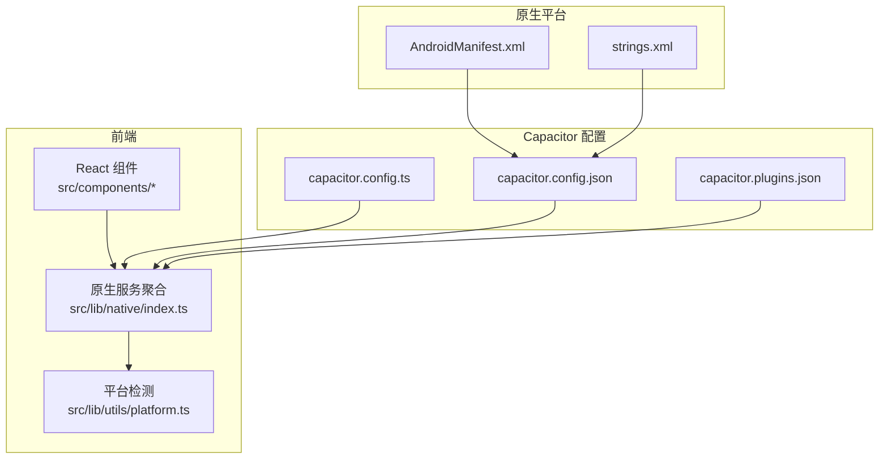
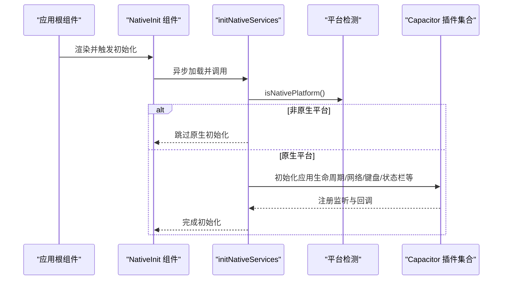
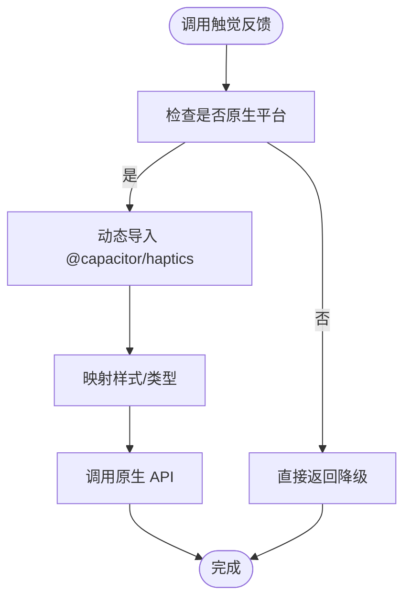
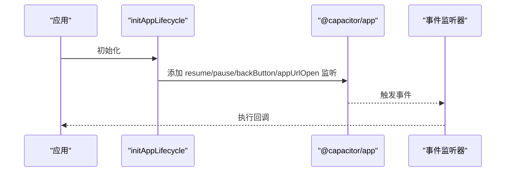
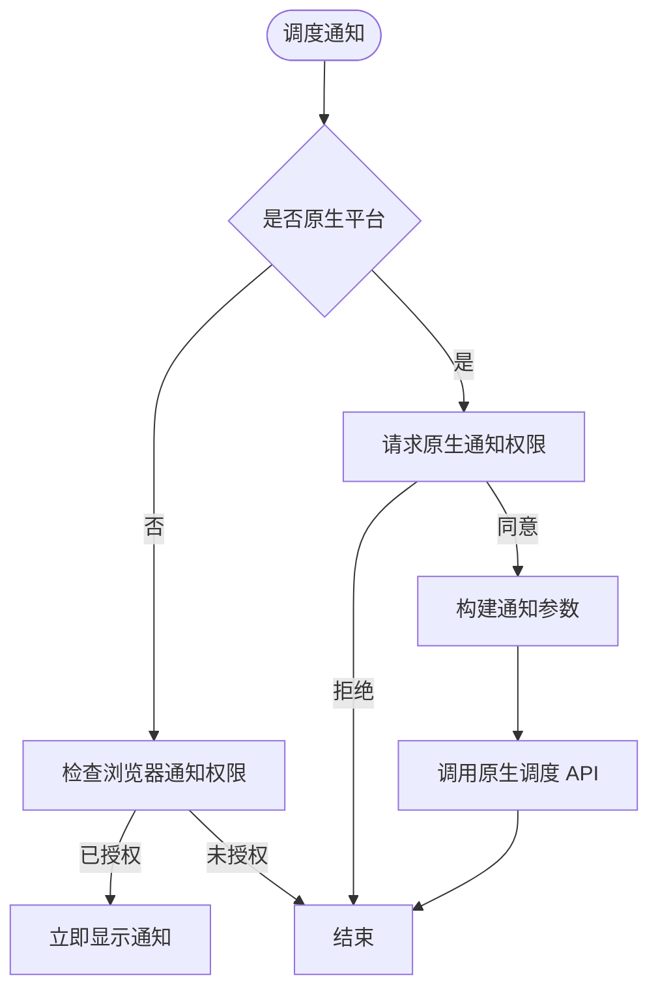
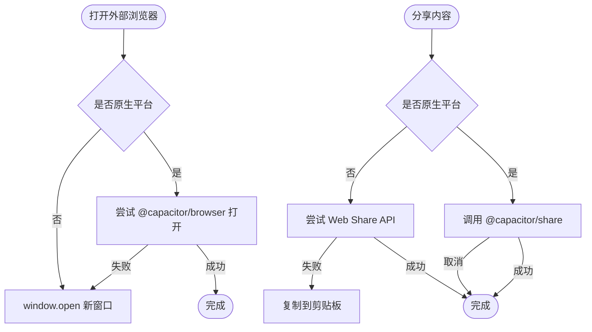
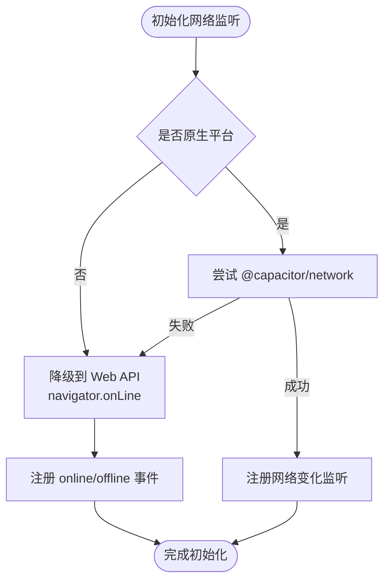
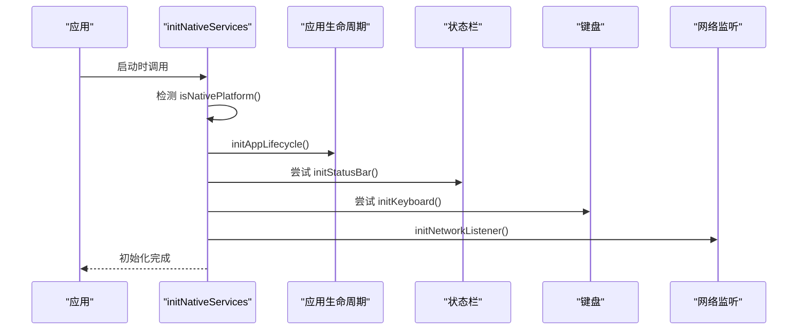
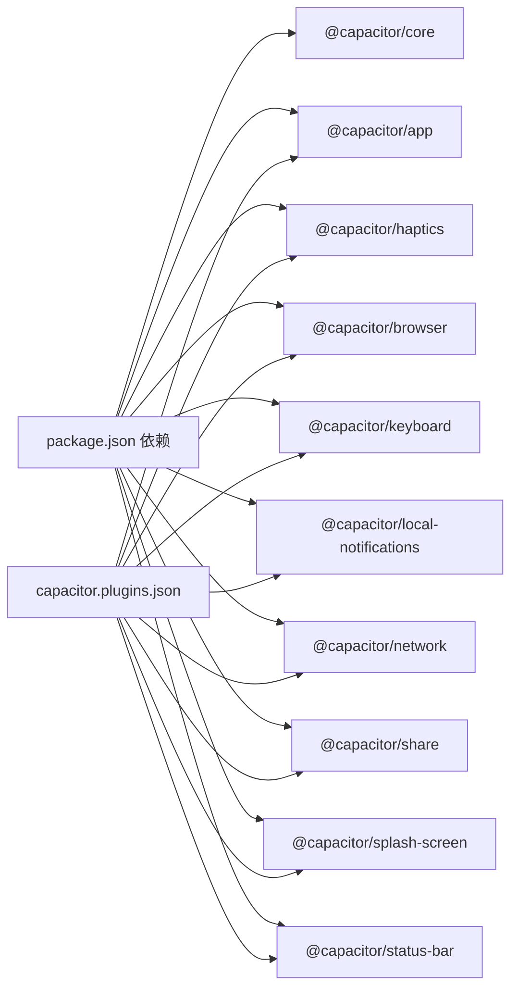

# 原生插件开发

<cite>
**本文引用的文件**
- [capacitor.config.ts](file://capacitor.config.ts)
- [capacitor.config.json](file://android/app/src/main/assets/capacitor.config.json)
- [capacitor.plugins.json](file://android/app/src/main/assets/capacitor.plugins.json)
- [package.json](file://package.json)
- [platform.ts](file://src/lib/utils/platform.ts)
- [native/index.ts](file://src/lib/native/index.ts)
- [haptics.ts](file://src/lib/native/haptics.ts)
- [app-lifecycle.ts](file://src/lib/native/app-lifecycle.ts)
- [notifications.ts](file://src/lib/native/notifications.ts)
- [share.ts](file://src/lib/native/share.ts)
- [network.ts](file://src/lib/native/network.ts)
- [native-init.tsx](file://src/components/native-init.tsx)
- [AndroidManifest.xml](file://android/app/src/main/AndroidManifest.xml)
- [strings.xml](file://android/app/src/main/res/values/strings.xml)
</cite>

## 目录
1. [简介](#简介)
2. [项目结构](#项目结构)
3. [核心组件](#核心组件)
4. [架构总览](#架构总览)
5. [详细组件分析](#详细组件分析)
6. [依赖关系分析](#依赖关系分析)
7. [性能考量](#性能考量)
8. [故障排查指南](#故障排查指南)
9. [结论](#结论)
10. [附录](#附录)

## 简介
本指南面向希望基于 Capacitor 构建原生插件与跨平台应用的开发者，结合仓库中的现有实现，系统讲解从 TypeScript 接口定义、原生代码集成到跨平台适配的完整流程；阐述插件架构设计、生命周期管理与错误处理机制；提供从简单功能到复杂原生能力封装的实践范式，并覆盖测试、调试与发布要点及平台差异与版本兼容性处理策略。

## 项目结构
该工程采用 Next.js + Capacitor 的混合架构：前端以 React/Next.js 实现，Capacitor 作为桥接层连接原生平台（iOS/Android）。原生插件能力通过统一的 native 服务模块进行抽象与初始化，平台检测工具负责运行时分支逻辑，配置文件集中管理 Capacitor 行为与插件清单。

**图表来源**
- [capacitor.config.ts:1-37](file://capacitor.config.ts#L1-L37)
- [capacitor.config.json:1-30](file://android/app/src/main/assets/capacitor.config.json#L1-L30)
- [capacitor.plugins.json:1-39](file://android/app/src/main/assets/capacitor.plugins.json#L1-L39)
- [platform.ts:1-60](file://src/lib/utils/platform.ts#L1-L60)
- [native/index.ts:1-55](file://src/lib/native/index.ts#L1-L55)
- [AndroidManifest.xml:1-52](file://android/app/src/main/AndroidManifest.xml#L1-L52)
- [strings.xml:1-8](file://android/app/src/main/res/values/strings.xml#L1-L8)

**章节来源**
- [capacitor.config.ts:1-37](file://capacitor.config.ts#L1-L37)
- [capacitor.config.json:1-30](file://android/app/src/main/assets/capacitor.config.json#L1-L30)
- [capacitor.plugins.json:1-39](file://android/app/src/main/assets/capacitor.plugins.json#L1-L39)
- [platform.ts:1-60](file://src/lib/utils/platform.ts#L1-L60)
- [native/index.ts:1-55](file://src/lib/native/index.ts#L1-L55)
- [AndroidManifest.xml:1-52](file://android/app/src/main/AndroidManifest.xml#L1-L52)
- [strings.xml:1-8](file://android/app/src/main/res/values/strings.xml#L1-L8)

## 核心组件
- 平台检测工具：提供 isNativePlatform、getPlatform、isIOS、isAndroid 等方法，用于运行时分支与降级处理。
- 原生服务聚合：统一导出触觉反馈、应用生命周期、通知、分享、网络监听等能力，并在应用启动时按需初始化。
- 配置中心：TS 与 JSON 双份配置，分别控制服务器地址、用户代理、插件参数与原生清单。
- 初始化组件：在根组件挂载后异步加载并执行原生服务初始化，确保仅在原生平台生效。

**章节来源**
- [platform.ts:1-60](file://src/lib/utils/platform.ts#L1-L60)
- [native/index.ts:1-55](file://src/lib/native/index.ts#L1-L55)
- [capacitor.config.ts:1-37](file://capacitor.config.ts#L1-L37)
- [capacitor.config.json:1-30](file://android/app/src/main/assets/capacitor.config.json#L1-L30)
- [native-init.tsx:1-16](file://src/components/native-init.tsx#L1-L16)

## 架构总览
下图展示前端组件、原生服务聚合层与 Capacitor 插件之间的交互关系，以及平台检测与配置驱动的初始化流程。

**图表来源**
- [native-init.tsx:1-16](file://src/components/native-init.tsx#L1-L16)
- [native/index.ts:1-55](file://src/lib/native/index.ts#L1-L55)
- [platform.ts:1-60](file://src/lib/utils/platform.ts#L1-L60)

**章节来源**
- [native-init.tsx:1-16](file://src/components/native-init.tsx#L1-L16)
- [native/index.ts:1-55](file://src/lib/native/index.ts#L1-L55)
- [platform.ts:1-60](file://src/lib/utils/platform.ts#L1-L60)

## 详细组件分析

### 触觉反馈服务（Haptics）
- 设计目标：在原生平台提供冲击、通知、选择三类触觉反馈，Web 平台静默降级。
- 关键点：
  - 使用枚举映射原生样式常量。
  - 通过动态导入避免 SSR 报错。
  - 失败时静默处理，保证主流程不受影响。
- 适用场景：按钮点击、操作成功/失败提示、列表滚动选择。

**图表来源**
- [haptics.ts:1-69](file://src/lib/native/haptics.ts#L1-L69)

**章节来源**
- [haptics.ts:1-69](file://src/lib/native/haptics.ts#L1-L69)

### 应用生命周期管理（App Lifecycle）
- 设计目标：统一监听 resume/pause/backButton/appUrlOpen 等原生事件，提供注册/注销回调接口。
- 关键点：
  - 单次初始化标志，避免重复监听。
  - Android 返回键优先交给页面历史栈，否则触发自定义回调，均无则退出应用。
  - 深度链接事件透传给注册者。
- 适用场景：后台保存状态、返回键拦截、Deep Link 处理。

**图表来源**
- [app-lifecycle.ts:1-98](file://src/lib/native/app-lifecycle.ts#L1-L98)

**章节来源**
- [app-lifecycle.ts:1-98](file://src/lib/native/app-lifecycle.ts#L1-L98)

### 本地通知服务（Local Notifications）
- 设计目标：在原生平台调度本地通知（支持定时），Web 平台使用浏览器通知降级。
- 关键点：
  - 权限申请统一处理，原生与 Web 分支明确。
  - 定时参数按原生格式组装，失败记录日志。
  - 支持取消单个/全部待发通知。
- 适用场景：任务提醒、日记打卡、离线推送。

**图表来源**
- [notifications.ts:1-110](file://src/lib/native/notifications.ts#L1-L110)

**章节来源**
- [notifications.ts:1-110](file://src/lib/native/notifications.ts#L1-L110)

### 分享与外部浏览器（Share & Browser）
- 设计目标：在原生平台使用系统分享面板与外部浏览器，Web 平台使用 Web Share API 或降级到剪贴板。
- 关键点：
  - 外部浏览器使用弹窗样式，失败回退 window.open。
  - 分享面板用户取消不视为错误，最终回退到剪贴板复制。
- 适用场景：内容分享、登录授权跳转、外部链接打开。

**图表来源**
- [share.ts:1-72](file://src/lib/native/share.ts#L1-L72)

**章节来源**
- [share.ts:1-72](file://src/lib/native/share.ts#L1-L72)

### 网络状态监听（Network）
- 设计目标：原生精确检测 WiFi/蜂窝/断网，Web 使用 navigator.onLine 降级。
- 关键点：
  - 首次状态由原生查询，后续变化通过事件更新。
  - 初始化失败时自动降级到 Web API，并注册 online/offline 事件。
  - 对外暴露订阅接口与在线状态查询。
- 适用场景：弱网提示、离线缓存策略、条件性功能开关。

**图表来源**
- [network.ts:1-102](file://src/lib/native/network.ts#L1-L102)

**章节来源**
- [network.ts:1-102](file://src/lib/native/network.ts#L1-L102)

### 原生服务统一初始化（initNativeServices）
- 设计目标：在应用启动时自动检测平台并初始化对应原生服务，支持可选插件（如状态栏、键盘）存在性检测。
- 关键点：
  - 按需动态导入各子模块，减少首屏体积。
  - 对可能缺失的插件（如状态栏、键盘）进行 try/catch 容错。
  - 日志输出便于调试与追踪。
- 适用场景：应用启动阶段的原生能力就绪保障。

**图表来源**
- [native/index.ts:1-55](file://src/lib/native/index.ts#L1-L55)

**章节来源**
- [native/index.ts:1-55](file://src/lib/native/index.ts#L1-L55)

## 依赖关系分析
- 运行时依赖：@capacitor/core、@capacitor/* 插件包，版本集中在 8.x。
- 构建脚本：提供 Capacitor 同步、复制、构建与运行的快捷命令。
- 原生清单：capacitor.plugins.json 明确声明已启用的插件类路径，AndroidManifest.xml 声明权限与能力。

**图表来源**
- [package.json:20-62](file://package.json#L20-L62)
- [capacitor.plugins.json:1-39](file://android/app/src/main/assets/capacitor.plugins.json#L1-L39)

**章节来源**
- [package.json:20-62](file://package.json#L20-L62)
- [capacitor.plugins.json:1-39](file://android/app/src/main/assets/capacitor.plugins.json#L1-L39)

## 性能考量
- 动态导入：各原生能力通过动态 import 按需加载，降低首屏体积与启动延迟。
- 初始化幂等：应用生命周期与网络监听模块具备初始化标志，避免重复绑定。
- 降级策略：在 Web 平台使用浏览器原生 API 或简单回退（如剪贴板），减少额外依赖。
- 配置优先：通过配置文件集中管理服务器地址、用户代理与插件参数，便于在不同环境快速切换。

[本节为通用指导，无需列出具体文件来源]

## 故障排查指南
- 平台检测失败：确认运行环境是否为原生平台，检查 isNativePlatform 与 getPlatform 的返回值。
- 插件未生效：核对 capacitor.plugins.json 中插件类路径是否正确，AndroidManifest.xml 是否声明必要权限。
- 通知无法显示：检查权限申请结果与调度参数格式，关注原生日志与浏览器通知权限状态。
- 分享/浏览器异常：确认原生插件可用性与回退逻辑（Web Share API、剪贴板、window.open）。
- 网络监听无效：若原生插件初始化失败，系统会降级到 Web API，确认 online/offline 事件是否正常触发。

**章节来源**
- [platform.ts:1-60](file://src/lib/utils/platform.ts#L1-L60)
- [capacitor.plugins.json:1-39](file://android/app/src/main/assets/capacitor.plugins.json#L1-L39)
- [AndroidManifest.xml:43-52](file://android/app/src/main/AndroidManifest.xml#L43-L52)
- [notifications.ts:1-110](file://src/lib/native/notifications.ts#L1-L110)
- [share.ts:1-72](file://src/lib/native/share.ts#L1-L72)
- [network.ts:1-102](file://src/lib/native/network.ts#L1-L102)

## 结论
本项目以“统一抽象 + 平台检测 + 降级容错”的方式实现了原生插件能力的可移植封装。通过清晰的初始化流程与模块化设计，既能在原生平台发挥最大能力，又能在 Web 环境保持一致体验。建议在新插件开发中遵循相同范式：先定义 TypeScript 接口与行为契约，再按平台实现具体逻辑，并始终提供稳健的降级策略与完善的错误处理。

[本节为总结性内容，无需列出具体文件来源]

## 附录

### 开发流程与最佳实践
- 接口定义：在 TypeScript 层明确输入输出与错误语义，避免隐式类型差异。
- 平台适配：使用 isNativePlatform 区分逻辑分支，对可选插件进行存在性检测与容错处理。
- 生命周期：在应用启动阶段集中初始化原生服务，避免在业务逻辑中分散处理。
- 错误处理：对异步原生调用进行 try/catch，失败时记录日志并走降级路径。
- 测试与调试：利用 Capacitor CLI 的同步与运行命令，结合设备日志定位问题；在 Web 环境验证降级路径。
- 发布与兼容：锁定 Capacitor 版本，定期评估插件生态更新，关注平台权限变更与隐私政策调整。

[本节为通用指导，无需列出具体文件来源]