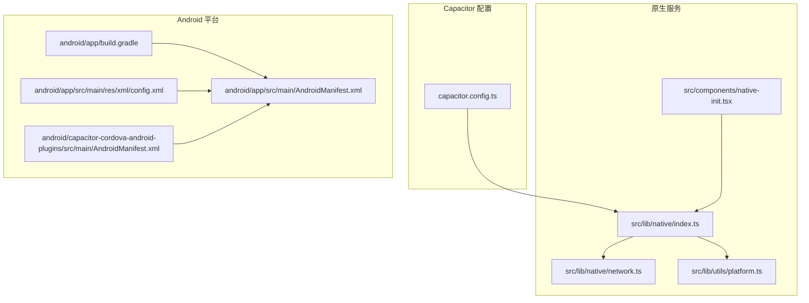
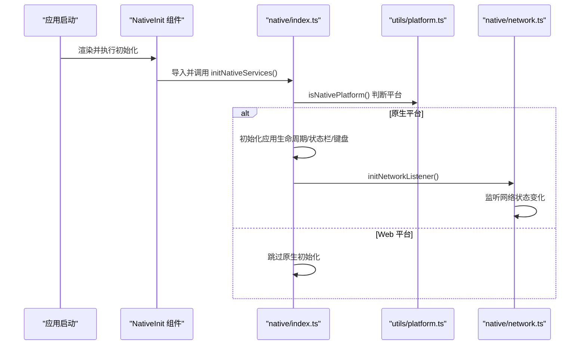
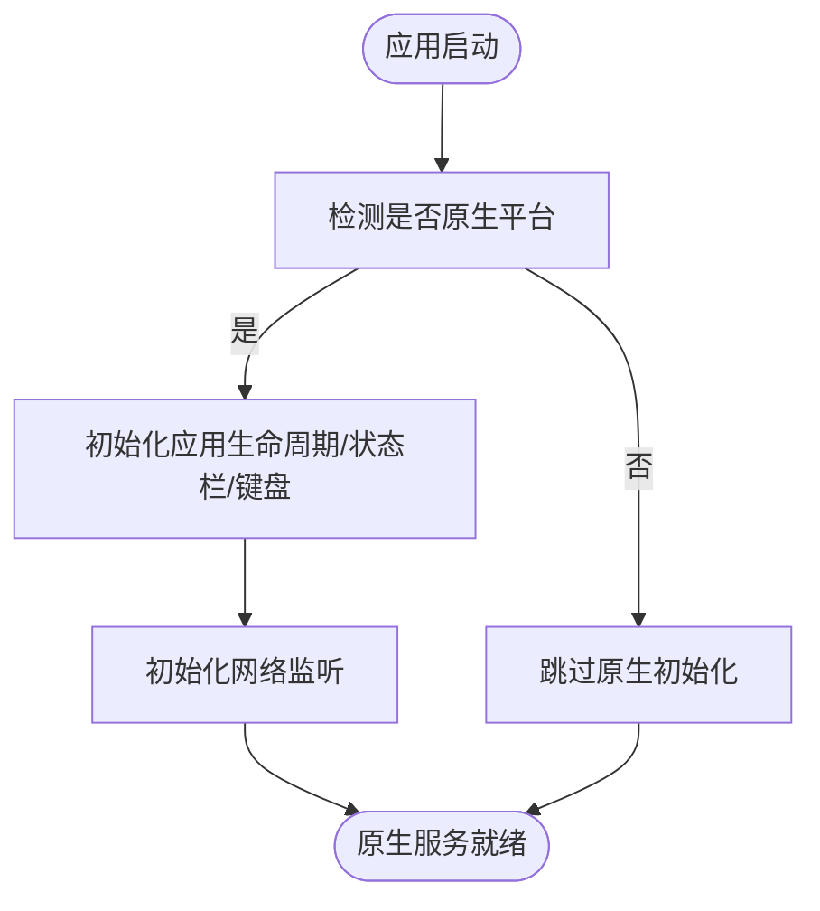
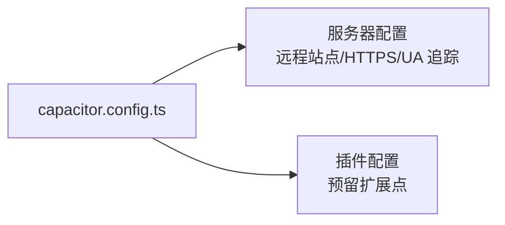
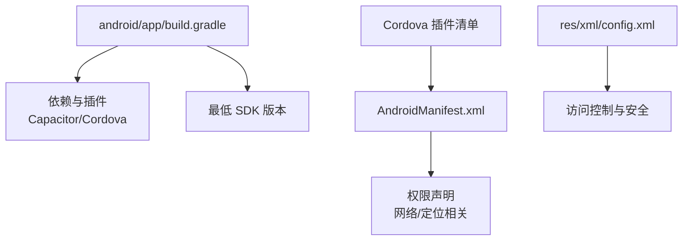
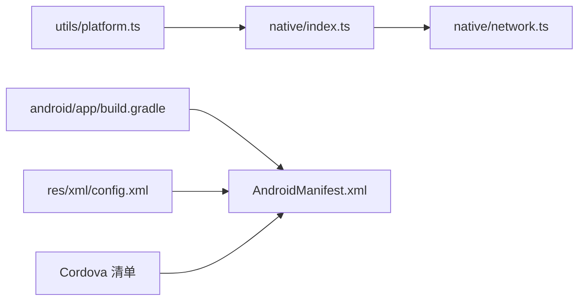

# 地理位置服务

<cite>
**本文引用的文件**
- [capacitor.config.ts](file://capacitor.config.ts)
- [src/lib/native/index.ts](file://src/lib/native/index.ts)
- [src/components/native-init.tsx](file://src/components/native-init.tsx)
- [src/lib/utils/platform.ts](file://src/lib/utils/platform.ts)
- [src/lib/native/network.ts](file://src/lib/native/network.ts)
- [src/components/shared/offline-indicator.tsx](file://src/components/shared/offline-indicator.tsx)
- [android/app/build.gradle](file://android/app/build.gradle)
- [android/app/src/main/AndroidManifest.xml](file://android/app/src/main/AndroidManifest.xml)
- [android/app/src/main/res/xml/config.xml](file://android/app/src/main/res/xml/config.xml)
- [android/capacitor-cordova-android-plugins/src/main/AndroidManifest.xml](file://android/capacitor-cordova-android-plugins/src/main/AndroidManifest.xml)
</cite>

## 目录
1. [简介](#简介)
2. [项目结构](#项目结构)
3. [核心组件](#核心组件)
4. [架构总览](#架构总览)
5. [详细组件分析](#详细组件分析)
6. [依赖关系分析](#依赖关系分析)
7. [性能考虑](#性能考虑)
8. [故障排除指南](#故障排除指南)
9. [结论](#结论)
10. [附录](#附录)

## 简介
本文件面向“地理位置服务”的设计与实现，结合当前仓库中的 Capacitor 与 Android 集成现状，系统性阐述以下主题：
- 地理位置获取的实现方式：位置精度、更新频率与电池优化策略
- 定位权限申请流程与位置信息解析
- 坐标转换与跨平台差异处理
- 地理位置 API 使用示例：实时定位、位置历史、地理围栏
- 不同平台（Web/iOS/Android）的定位差异与精度处理
- 地图集成与导航功能的实现方法

说明：当前仓库未包含直接的地理位置插件或定位逻辑实现。本文将基于现有 Capacitor 配置与原生初始化框架，给出可落地的架构建议与最佳实践，帮助后续接入官方定位插件（如 @capacitor/geolocation）。

## 项目结构
围绕地理位置服务的关键文件与职责如下：
- Capacitor 配置：定义 WebView 服务器、插件与平台参数，为后续定位插件提供运行环境
- 原生服务初始化：统一入口初始化网络、通知等原生能力，为定位能力预留扩展点
- 平台检测：区分 Web/iOS/Android，实现差异化行为
- Android 构建与清单：声明最低 SDK、构建依赖与网络配置，支撑定位相关权限与网络能力

**图表来源**
- [capacitor.config.ts:1-37](file://capacitor.config.ts#L1-L37)
- [src/lib/native/index.ts:1-55](file://src/lib/native/index.ts#L1-L55)
- [src/lib/native/network.ts:1-50](file://src/lib/native/network.ts#L1-L50)
- [src/lib/utils/platform.ts:1-59](file://src/lib/utils/platform.ts#L1-L59)
- [src/components/native-init.tsx:1-16](file://src/components/native-init.tsx#L1-L16)
- [android/app/build.gradle:1-54](file://android/app/build.gradle#L1-L54)
- [android/app/src/main/AndroidManifest.xml](file://android/app/src/main/AndroidManifest.xml)
- [android/app/src/main/res/xml/config.xml:1-6](file://android/app/src/main/res/xml/config.xml#L1-L6)
- [android/capacitor-cordova-android-plugins/src/main/AndroidManifest.xml:1-8](file://android/capacitor-cordova-android-plugins/src/main/AndroidManifest.xml#L1-L8)

**章节来源**
- [capacitor.config.ts:1-37](file://capacitor.config.ts#L1-L37)
- [src/lib/native/index.ts:1-55](file://src/lib/native/index.ts#L1-L55)
- [src/lib/native/network.ts:1-50](file://src/lib/native/network.ts#L1-L50)
- [src/lib/utils/platform.ts:1-59](file://src/lib/utils/platform.ts#L1-L59)
- [src/components/native-init.tsx:1-16](file://src/components/native-init.tsx#L1-L16)
- [android/app/build.gradle:1-54](file://android/app/build.gradle#L1-L54)
- [android/app/src/main/AndroidManifest.xml](file://android/app/src/main/AndroidManifest.xml)
- [android/app/src/main/res/xml/config.xml:1-6](file://android/app/src/main/res/xml/config.xml#L1-L6)
- [android/capacitor-cordova-android-plugins/src/main/AndroidManifest.xml:1-8](file://android/capacitor-cordova-android-plugins/src/main/AndroidManifest.xml#L1-L8)

## 核心组件
- 原生服务初始化入口：在应用启动时检测平台并初始化网络、键盘、状态栏等原生能力，为后续定位能力预留扩展点
- 平台检测工具：提供 isNativePlatform、getPlatform、isIOS、isAndroid 等方法，支持条件化逻辑
- 网络监听服务：基于 @capacitor/network 实现 WiFi/蜂窝/无网络状态监听，为定位场景下的网络感知提供基础
- Capacitor 配置：定义服务器地址、UA 追踪、插件配置，确保 WebView 环境满足定位服务要求
- Android 构建与清单：声明最低 SDK、构建依赖与网络配置，为定位权限与网络访问提供基础

**章节来源**
- [src/lib/native/index.ts:15-55](file://src/lib/native/index.ts#L15-L55)
- [src/lib/utils/platform.ts:11-59](file://src/lib/utils/platform.ts#L11-L59)
- [src/lib/native/network.ts:1-50](file://src/lib/native/network.ts#L1-L50)
- [capacitor.config.ts:1-37](file://capacitor.config.ts#L1-L37)
- [android/app/build.gradle:1-54](file://android/app/build.gradle#L1-L54)

## 架构总览
下图展示从应用启动到原生能力初始化、平台检测与网络监听的整体流程，并为后续接入定位插件预留扩展点。

**图表来源**
- [src/components/native-init.tsx:1-16](file://src/components/native-init.tsx#L1-L16)
- [src/lib/native/index.ts:15-55](file://src/lib/native/index.ts#L15-L55)
- [src/lib/utils/platform.ts:11-27](file://src/lib/utils/platform.ts#L11-L27)
- [src/lib/native/network.ts:32-50](file://src/lib/native/network.ts#L32-L50)

## 详细组件分析

### 原生服务初始化与平台检测
- 初始化入口负责在应用根组件挂载时调用，检测平台后按需初始化原生能力
- 平台检测工具提供 isNativePlatform、getPlatform、isIOS、isAndroid 等方法，便于在定位逻辑中做差异化处理
- 网络监听服务基于 @capacitor/network，在原生平台精确检测连接类型，为定位场景提供网络感知

**图表来源**
- [src/lib/native/index.ts:15-55](file://src/lib/native/index.ts#L15-L55)
- [src/lib/utils/platform.ts:11-27](file://src/lib/utils/platform.ts#L11-L27)
- [src/lib/native/network.ts:32-50](file://src/lib/native/network.ts#L32-L50)

**章节来源**
- [src/lib/native/index.ts:15-55](file://src/lib/native/index.ts#L15-L55)
- [src/lib/utils/platform.ts:11-59](file://src/lib/utils/platform.ts#L11-L59)
- [src/lib/native/network.ts:1-50](file://src/lib/native/network.ts#L1-L50)

### Capacitor 配置与定位环境准备
- 服务器配置支持远程站点加载与 UA 追踪，为定位服务的鉴权与日志埋点提供基础
- 插件配置预留扩展点，后续接入定位插件时可在此处统一管理

**图表来源**
- [capacitor.config.ts:7-33](file://capacitor.config.ts#L7-L33)

**章节来源**
- [capacitor.config.ts:1-37](file://capacitor.config.ts#L1-L37)

### Android 构建与清单对定位的支持
- 最低 SDK 版本与目标 SDK 版本满足现代定位服务需求
- 构建脚本引入 Capacitor 与 Cordova 插件，为后续定位权限与网络能力提供基础
- 清单文件包含网络访问与安全配置，为定位服务的网络与权限声明提供依据

**图表来源**
- [android/app/build.gradle:1-54](file://android/app/build.gradle#L1-L54)
- [android/app/src/main/AndroidManifest.xml](file://android/app/src/main/AndroidManifest.xml)
- [android/app/src/main/res/xml/config.xml:1-6](file://android/app/src/main/res/xml/config.xml#L1-L6)
- [android/capacitor-cordova-android-plugins/src/main/AndroidManifest.xml:1-8](file://android/capacitor-cordova-android-plugins/src/main/AndroidManifest.xml#L1-L8)

**章节来源**
- [android/app/build.gradle:1-54](file://android/app/build.gradle#L1-L54)
- [android/app/src/main/AndroidManifest.xml](file://android/app/src/main/AndroidManifest.xml)
- [android/app/src/main/res/xml/config.xml:1-6](file://android/app/src/main/res/xml/config.xml#L1-L6)
- [android/capacitor-cordova-android-plugins/src/main/AndroidManifest.xml:1-8](file://android/capacitor-cordova-android-plugins/src/main/AndroidManifest.xml#L1-L8)

## 依赖关系分析
- 平台检测依赖 Capacitor 核心能力，用于区分 Web/iOS/Android
- 原生服务初始化依赖平台检测结果，按需加载网络监听等能力
- 网络监听服务依赖 @capacitor/network，提供连接状态与类型信息
- Android 构建与清单为定位权限与网络访问提供基础设施

**图表来源**
- [src/lib/utils/platform.ts:11-27](file://src/lib/utils/platform.ts#L11-L27)
- [src/lib/native/index.ts:15-55](file://src/lib/native/index.ts#L15-L55)
- [src/lib/native/network.ts:32-50](file://src/lib/native/network.ts#L32-L50)
- [android/app/build.gradle:1-54](file://android/app/build.gradle#L1-L54)
- [android/app/src/main/res/xml/config.xml:1-6](file://android/app/src/main/res/xml/config.xml#L1-L6)
- [android/capacitor-cordova-android-plugins/src/main/AndroidManifest.xml:1-8](file://android/capacitor-cordova-android-plugins/src/main/AndroidManifest.xml#L1-L8)

**章节来源**
- [src/lib/utils/platform.ts:11-59](file://src/lib/utils/platform.ts#L11-L59)
- [src/lib/native/index.ts:15-55](file://src/lib/native/index.ts#L15-L55)
- [src/lib/native/network.ts:1-50](file://src/lib/native/network.ts#L1-L50)
- [android/app/build.gradle:1-54](file://android/app/build.gradle#L1-L54)
- [android/app/src/main/res/xml/config.xml:1-6](file://android/app/src/main/res/xml/config.xml#L1-L6)
- [android/capacitor-cordova-android-plugins/src/main/AndroidManifest.xml:1-8](file://android/capacitor-cordova-android-plugins/src/main/AndroidManifest.xml#L1-L8)

## 性能考虑
- 电池优化与更新频率
  - 合理设置定位更新间隔与最小位移阈值，避免频繁回调导致电量消耗
  - 在后台或应用不可见时降低更新频率或暂停定位
- 精度选择
  - 根据场景选择高精度（GPS）与低精度（网络/WiFi）模式，平衡准确性与耗电
- 网络感知
  - 结合网络监听服务，在弱网或无网环境下提示用户或降级策略
- 权限与隐私
  - 明确告知用户权限用途，提供清晰的权限申请与拒绝后的引导路径

## 故障排除指南
- 定位权限未授予
  - 确认 Android 清单中声明必要权限，且在运行时向用户申请
  - 在 Web 平台检查浏览器权限策略与 HTTPS 环境
- 定位服务不可用
  - 检查设备定位开关与系统权限
  - 在 Android 上确认 Google Play 服务可用
- 网络相关问题
  - 使用网络监听服务确认连接状态，必要时在网络变化时重试定位请求
- 平台差异
  - iOS 与 Android 在权限弹窗、精度来源与后台限制方面存在差异，需分别测试与适配

## 结论
当前仓库已具备接入地理位置服务的基础：Capacitor 配置、原生服务初始化框架、平台检测与网络监听能力。建议后续步骤：
- 引入 @capacitor/geolocation 插件，并在原生服务初始化中按需注册
- 在 Android 清单中声明定位权限，并在运行时申请
- 基于平台差异实现差异化策略（如 iOS 的精确/粗略定位切换）
- 结合网络监听与电池优化策略，提升用户体验与续航表现

## 附录

### 地理位置 API 使用示例（概念性说明）
- 实时定位
  - 申请权限 → 启动定位监听 → 处理位置回调 → 根据网络状态与电池状态动态调整更新频率
- 位置历史
  - 缓存最近若干次位置点，支持离线查看与回放
- 地理围栏
  - 基于当前位置与围栏边界计算进入/离开事件，结合通知与业务逻辑处理

### 地图集成与导航
- 地图 SDK 集成：根据平台选择对应 SDK（如 iOS MapKit、Android Maps SDK），在原生层实现
- 导航：结合定位与地图，提供路线规划与实时导航提示
- 权限与隐私：明确标注数据使用范围，遵循平台隐私政策