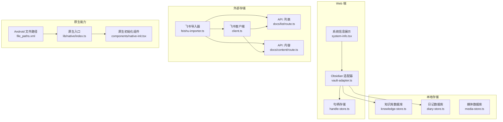
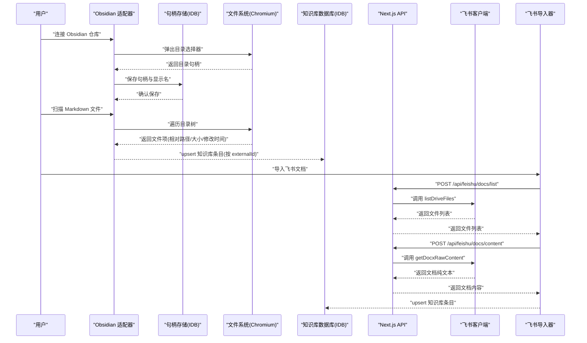
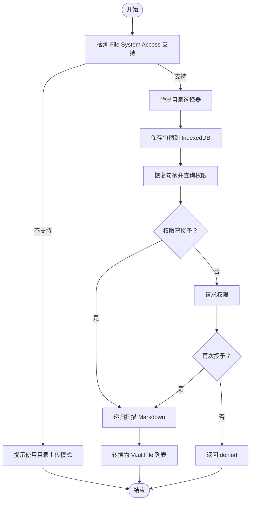
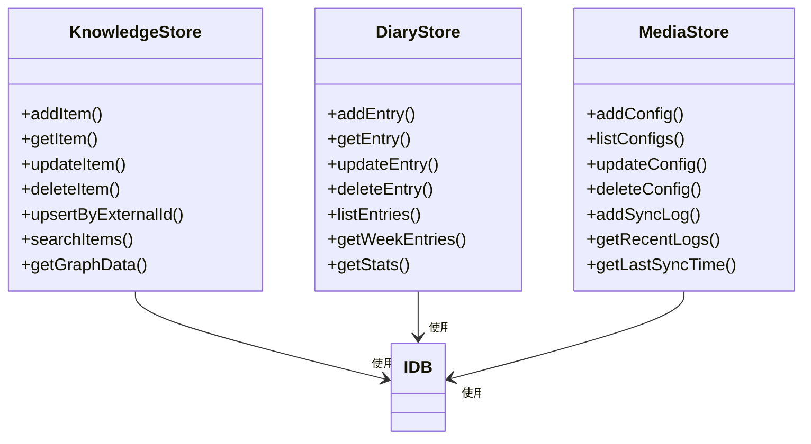
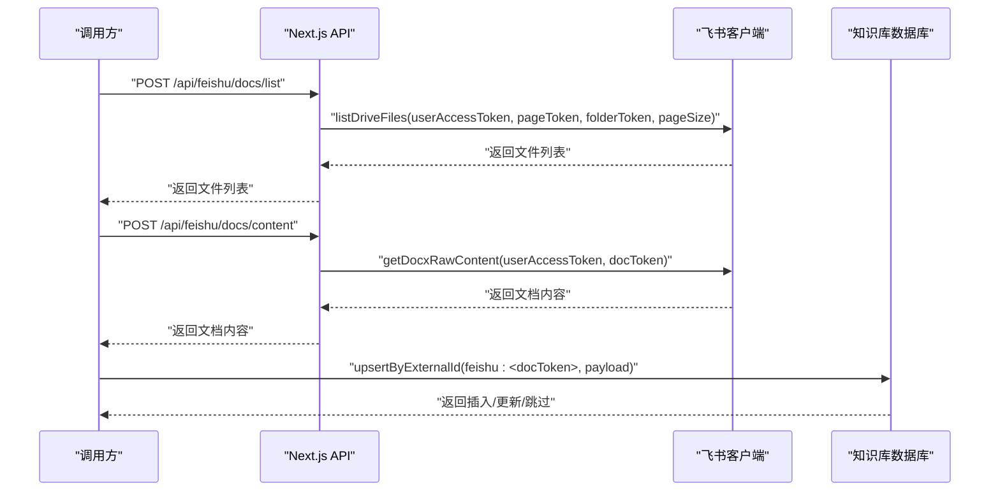
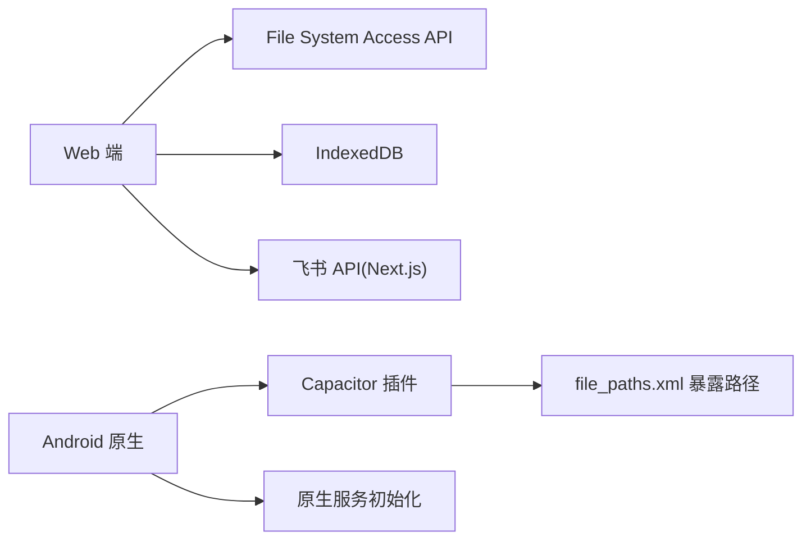
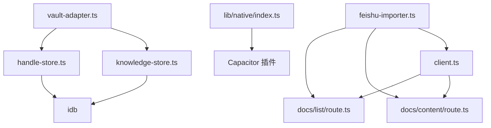

# 文件系统访问

<cite>
**本文引用的文件**
- [vault-adapter.ts](file://src/lib/obsidian/vault-adapter.ts)
- [handle-store.ts](file://src/lib/obsidian/handle-store.ts)
- [diary-store.ts](file://src/lib/storage/diary-store.ts)
- [knowledge-store.ts](file://src/lib/storage/knowledge-store.ts)
- [media-store.ts](file://src/lib/storage/media-store.ts)
- [client.ts](file://src/lib/feishu/client.ts)
- [feishu-importer.ts](file://src/lib/importer/feishu-importer.ts)
- [route.ts](file://src/app/api/feishu/docs/list/route.ts)
- [route.ts](file://src/app/api/feishu/docs/content/route.ts)
- [index.ts](file://src/lib/native/index.ts)
- [native-init.tsx](file://src/components/native-init.tsx)
- [file_paths.xml](file://android/app/src/main/res/xml/file_paths.xml)
- [system-info.tsx](file://src/components/settings/system-info.tsx)
- [image-compress.ts](file://src/lib/utils/image-compress.ts)
</cite>

## 目录
1. [简介](#简介)
2. [项目结构](#项目结构)
3. [核心组件](#核心组件)
4. [架构总览](#架构总览)
5. [详细组件分析](#详细组件分析)
6. [依赖分析](#依赖分析)
7. [性能考虑](#性能考虑)
8. [故障排查指南](#故障排查指南)
9. [结论](#结论)
10. [附录](#附录)

## 简介
本文件系统访问功能文档聚焦于以下方面：
- 文件系统操作实现原理：文件读写、目录管理、文件分享
- 文件权限处理、路径管理、文件类型检测
- API 使用示例：本地存储、外部存储、临时文件处理
- 平台差异与兼容性处理（Web、Android 原生）
- 文件上传下载与批量操作实现思路

本项目通过多种机制实现文件系统能力：
- Web 端：File System Access API（Chromium 桌面）、兜底的目录上传（webkitdirectory）
- 本地存储：IndexedDB（知识库、日记、媒体配置与同步日志）
- 外部存储：飞书云文档列表与内容获取（通过 Next.js API 中转）
- 原生能力：Android 文件路径暴露、分享、通知等

## 项目结构
围绕文件系统相关的关键模块如下图所示：

**图表来源**
- [vault-adapter.ts:1-137](file://src/lib/obsidian/vault-adapter.ts#L1-L137)
- [handle-store.ts:1-41](file://src/lib/obsidian/handle-store.ts#L1-L41)
- [diary-store.ts:1-237](file://src/lib/storage/diary-store.ts#L1-L237)
- [knowledge-store.ts:1-611](file://src/lib/storage/knowledge-store.ts#L1-L611)
- [media-store.ts:1-140](file://src/lib/storage/media-store.ts#L1-L140)
- [client.ts:187-229](file://src/lib/feishu/client.ts#L187-L229)
- [feishu-importer.ts:81-198](file://src/lib/importer/feishu-importer.ts#L81-L198)
- [route.ts:1-31](file://src/app/api/feishu/docs/list/route.ts#L1-L31)
- [route.ts:1-25](file://src/app/api/feishu/docs/content/route.ts#L1-L25)
- [index.ts:1-39](file://src/lib/native/index.ts#L1-L39)
- [native-init.tsx:1-15](file://src/components/native-init.tsx#L1-L15)
- [file_paths.xml:1-5](file://android/app/src/main/res/xml/file_paths.xml#L1-L5)
- [system-info.tsx:1-37](file://src/components/settings/system-info.tsx#L1-L37)

**章节来源**
- [vault-adapter.ts:1-137](file://src/lib/obsidian/vault-adapter.ts#L1-L137)
- [handle-store.ts:1-41](file://src/lib/obsidian/handle-store.ts#L1-L41)
- [diary-store.ts:1-237](file://src/lib/storage/diary-store.ts#L1-L237)
- [knowledge-store.ts:1-611](file://src/lib/storage/knowledge-store.ts#L1-L611)
- [media-store.ts:1-140](file://src/lib/storage/media-store.ts#L1-L140)
- [client.ts:187-229](file://src/lib/feishu/client.ts#L187-L229)
- [feishu-importer.ts:81-198](file://src/lib/importer/feishu-importer.ts#L81-L198)
- [route.ts:1-31](file://src/app/api/feishu/docs/list/route.ts#L1-L31)
- [route.ts:1-25](file://src/app/api/feishu/docs/content/route.ts#L1-L25)
- [index.ts:1-39](file://src/lib/native/index.ts#L1-L39)
- [native-init.tsx:1-15](file://src/components/native-init.tsx#L1-L15)
- [file_paths.xml:1-5](file://android/app/src/main/res/xml/file_paths.xml#L1-L5)
- [system-info.tsx:1-37](file://src/components/settings/system-info.tsx#L1-L37)

## 核心组件
- Obsidian 适配器：封装 File System Access API，支持目录授权、递归扫描 Markdown、兜底的目录上传转换
- 句柄存储：使用 IndexedDB 存储 Obsidian 目录句柄，实现权限持久化与恢复
- 本地存储：知识库、日记、媒体配置与同步日志均基于 IndexedDB，提供增删改查与索引
- 外部存储：飞书云文档列表与内容获取，通过 Next.js API 中转隐藏密钥并规避跨域
- 原生能力：Android 文件路径暴露、分享、通知等原生服务初始化入口

**章节来源**
- [vault-adapter.ts:1-137](file://src/lib/obsidian/vault-adapter.ts#L1-L137)
- [handle-store.ts:1-41](file://src/lib/obsidian/handle-store.ts#L1-L41)
- [diary-store.ts:1-237](file://src/lib/storage/diary-store.ts#L1-L237)
- [knowledge-store.ts:1-611](file://src/lib/storage/knowledge-store.ts#L1-L611)
- [media-store.ts:1-140](file://src/lib/storage/media-store.ts#L1-L140)
- [client.ts:187-229](file://src/lib/feishu/client.ts#L187-L229)
- [feishu-importer.ts:81-198](file://src/lib/importer/feishu-importer.ts#L81-L198)
- [index.ts:1-39](file://src/lib/native/index.ts#L1-L39)

## 架构总览
下图展示了文件系统访问的整体流程与组件交互：

**图表来源**
- [vault-adapter.ts:31-109](file://src/lib/obsidian/vault-adapter.ts#L31-L109)
- [handle-store.ts:26-40](file://src/lib/obsidian/handle-store.ts#L26-L40)
- [client.ts:202-229](file://src/lib/feishu/client.ts#L202-L229)
- [route.ts:6-31](file://src/app/api/feishu/docs/list/route.ts#L6-L31)
- [route.ts:7-25](file://src/app/api/feishu/docs/content/route.ts#L7-L25)
- [feishu-importer.ts:165-198](file://src/lib/importer/feishu-importer.ts#L165-L198)
- [knowledge-store.ts:221-250](file://src/lib/storage/knowledge-store.ts#L221-L250)

## 详细组件分析

### Obsidian 仓库访问与权限管理
- 功能要点
  - 检测浏览器是否支持 File System Access API
  - 弹出目录选择器，保存目录句柄到 IndexedDB
  - 恢复句柄并处理权限状态（granted/denied/prompt）
  - 递归扫描 Markdown 文件，生成统一的 VaultFile 结构
  - 非 Chromium 浏览器使用 webkitdirectory 兜底，转换为 VaultFile

**图表来源**
- [vault-adapter.ts:23-77](file://src/lib/obsidian/vault-adapter.ts#L23-L77)
- [handle-store.ts:26-40](file://src/lib/obsidian/handle-store.ts#L26-L40)
- [vault-adapter.ts:82-109](file://src/lib/obsidian/vault-adapter.ts#L82-L109)

**章节来源**
- [vault-adapter.ts:1-137](file://src/lib/obsidian/vault-adapter.ts#L1-L137)
- [handle-store.ts:1-41](file://src/lib/obsidian/handle-store.ts#L1-L41)

### 本地存储与文件类型检测
- 本地存储
  - 知识库数据库：支持按类型、标签、来源集合等索引查询，提供 upsertByExternalId 实现增量同步
  - 日记数据库：支持条目增删改查、周统计、词数计算
  - 媒体数据库：配置与同步日志管理，便于媒体源的定时同步与追踪
- 文件类型检测
  - Obsidian 扫描：过滤以 .md 结尾的文件
  - 兜底输入：依据文件名后缀过滤 Markdown
  - 图片压缩：在前端进行图片压缩，减少存储与传输开销

**图表来源**
- [knowledge-store.ts:176-250](file://src/lib/storage/knowledge-store.ts#L176-L250)
- [diary-store.ts:97-155](file://src/lib/storage/diary-store.ts#L97-L155)
- [media-store.ts:60-140](file://src/lib/storage/media-store.ts#L60-L140)

**章节来源**
- [knowledge-store.ts:1-611](file://src/lib/storage/knowledge-store.ts#L1-L611)
- [diary-store.ts:1-237](file://src/lib/storage/diary-store.ts#L1-L237)
- [media-store.ts:1-140](file://src/lib/storage/media-store.ts#L1-L140)
- [vault-adapter.ts:115-136](file://src/lib/obsidian/vault-adapter.ts#L115-L136)
- [image-compress.ts:1-46](file://src/lib/utils/image-compress.ts#L1-L46)

### 外部存储：飞书云文档导入
- 列表接口：分页列出云空间文件，支持文件夹递归
- 内容接口：获取 docx 文档纯文本内容
- 导入流程：先列目录，再逐个拉取正文，使用 upsertByExternalId 增量同步至知识库

**图表来源**
- [client.ts:202-229](file://src/lib/feishu/client.ts#L202-L229)
- [route.ts:6-31](file://src/app/api/feishu/docs/list/route.ts#L6-L31)
- [route.ts:7-25](file://src/app/api/feishu/docs/content/route.ts#L7-L25)
- [feishu-importer.ts:165-198](file://src/lib/importer/feishu-importer.ts#L165-L198)
- [knowledge-store.ts:221-250](file://src/lib/storage/knowledge-store.ts#L221-L250)

**章节来源**
- [client.ts:187-229](file://src/lib/feishu/client.ts#L187-L229)
- [route.ts:1-31](file://src/app/api/feishu/docs/list/route.ts#L1-L31)
- [route.ts:1-25](file://src/app/api/feishu/docs/content/route.ts#L1-L25)
- [feishu-importer.ts:81-198](file://src/lib/importer/feishu-importer.ts#L81-L198)
- [knowledge-store.ts:221-250](file://src/lib/storage/knowledge-store.ts#L221-L250)

### 原生能力与平台差异
- Web 端
  - File System Access API 仅在 Chromium 桌面端可用
  - 非 Chromium 浏览器使用 webkitdirectory 兜底
  - 本地存储使用 IndexedDB
- Android 原生
  - 通过 Capacitor 插件暴露文件路径，供原生侧访问
  - 原生入口统一初始化通知、分享、网络等服务
  - 原生初始化组件在应用根组件挂载时执行

**图表来源**
- [vault-adapter.ts:23-25](file://src/lib/obsidian/vault-adapter.ts#L23-L25)
- [file_paths.xml:1-5](file://android/app/src/main/res/xml/file_paths.xml#L1-L5)
- [index.ts:19-39](file://src/lib/native/index.ts#L19-L39)
- [native-init.tsx:5-12](file://src/components/native-init.tsx#L5-L12)

**章节来源**
- [vault-adapter.ts:23-25](file://src/lib/obsidian/vault-adapter.ts#L23-L25)
- [file_paths.xml:1-5](file://android/app/src/main/res/xml/file_paths.xml#L1-L5)
- [index.ts:1-39](file://src/lib/native/index.ts#L1-L39)
- [native-init.tsx:1-15](file://src/components/native-init.tsx#L1-L15)

## 依赖分析
- 组件耦合
  - Obsidian 适配器依赖句柄存储（IDB）进行权限持久化
  - 飞书导入器依赖 Next.js API 路由与飞书客户端
  - 知识库数据库被导入器与 Obsidian 适配器共同使用
- 外部依赖
  - idb：IndexedDB 封装
  - Capacitor 插件：Android 原生能力接入

**图表来源**
- [vault-adapter.ts:7-7](file://src/lib/obsidian/vault-adapter.ts#L7-L7)
- [handle-store.ts:1-1](file://src/lib/obsidian/handle-store.ts#L1-L1)
- [feishu-importer.ts:165-198](file://src/lib/importer/feishu-importer.ts#L165-L198)
- [route.ts:1-31](file://src/app/api/feishu/docs/list/route.ts#L1-L31)
- [route.ts:1-25](file://src/app/api/feishu/docs/content/route.ts#L1-L25)
- [client.ts:187-229](file://src/lib/feishu/client.ts#L187-L229)
- [index.ts:1-39](file://src/lib/native/index.ts#L1-L39)

**章节来源**
- [vault-adapter.ts:1-137](file://src/lib/obsidian/vault-adapter.ts#L1-L137)
- [handle-store.ts:1-41](file://src/lib/obsidian/handle-store.ts#L1-L41)
- [feishu-importer.ts:81-198](file://src/lib/importer/feishu-importer.ts#L81-L198)
- [route.ts:1-31](file://src/app/api/feishu/docs/list/route.ts#L1-L31)
- [route.ts:1-25](file://src/app/api/feishu/docs/content/route.ts#L1-L25)
- [client.ts:187-229](file://src/lib/feishu/client.ts#L187-L229)
- [index.ts:1-39](file://src/lib/native/index.ts#L1-L39)

## 性能考虑
- 文件扫描
  - 递归遍历目录可能带来较大的 IO 开销，建议限制扫描范围或采用分页/节流策略
- 数据库写入
  - 批量 upsert 建议合并事务，减少索引重建与页面写入次数
- 图片处理
  - 前端压缩可显著降低带宽与存储占用，但会增加 CPU 占用，建议在空闲线程或后台任务中执行
- 外部 API
  - 飞书列表与内容接口建议缓存与并发控制，避免频繁请求导致限流

[本节为通用指导，不直接分析具体文件]

## 故障排查指南
- File System Access API 不可用
  - 现象：浏览器不支持 showDirectoryPicker
  - 处理：降级使用 webkitdirectory 输入，并提示用户选择目录
- 权限被拒绝或过期
  - 现象：restoreVault 返回 denied 或 queryPermission 返回 prompt
  - 处理：引导用户重新授权；必要时请求权限
- 知识库导入失败
  - 现象：HTTP 错误或返回码非 0
  - 处理：检查 userAccessToken 是否有效；查看 Next.js API 返回的错误信息
- 本地存储容量不足
  - 现象：navigator.storage.estimate 显示配额不足
  - 处理：清理历史数据或引导用户释放存储空间

**章节来源**
- [vault-adapter.ts:32-43](file://src/lib/obsidian/vault-adapter.ts#L32-L43)
- [vault-adapter.ts:63-72](file://src/lib/obsidian/vault-adapter.ts#L63-L72)
- [route.ts:13-30](file://src/app/api/feishu/docs/list/route.ts#L13-L30)
- [route.ts:17-24](file://src/app/api/feishu/docs/content/route.ts#L17-L24)
- [system-info.tsx:8-16](file://src/components/settings/system-info.tsx#L8-L16)

## 结论
本项目通过 Web 与原生双通道实现了文件系统访问能力：
- Web 端以 File System Access API 为核心，辅以 IndexedDB 本地存储与飞书外部存储
- Android 原生通过 Capacitor 插件与文件路径配置实现与 Web 端互补
- 通过统一的导入与 upsert 机制，确保知识库数据的一致性与增量更新

[本节为总结性内容，不直接分析具体文件]

## 附录

### API 使用示例（路径指引）
- 连接并扫描 Obsidian 仓库
  - [connectVault:31-44](file://src/lib/obsidian/vault-adapter.ts#L31-L44)
  - [restoreVault:50-73](file://src/lib/obsidian/vault-adapter.ts#L50-L73)
  - [scanMarkdown:82-84](file://src/lib/obsidian/vault-adapter.ts#L82-L84)
- 本地存储操作
  - [addItem / upsertByExternalId:176-250](file://src/lib/storage/knowledge-store.ts#L176-L250)
  - [addEntry / updateEntry:97-137](file://src/lib/storage/diary-store.ts#L97-L137)
  - [addConfig / addSyncLog:60-110](file://src/lib/storage/media-store.ts#L60-L110)
- 外部存储导入
  - [listDriveFiles:202-218](file://src/lib/feishu/client.ts#L202-L218)
  - [getDocxRawContent:223-229](file://src/lib/feishu/client.ts#L223-L229)
  - [飞书导入器:81-198](file://src/lib/importer/feishu-importer.ts#L81-L198)
- 原生能力初始化
  - [initNativeServices:19-39](file://src/lib/native/index.ts#L19-L39)
  - [NativeInit 组件:5-12](file://src/components/native-init.tsx#L5-L12)

[本节为参考性内容，不直接分析具体文件]