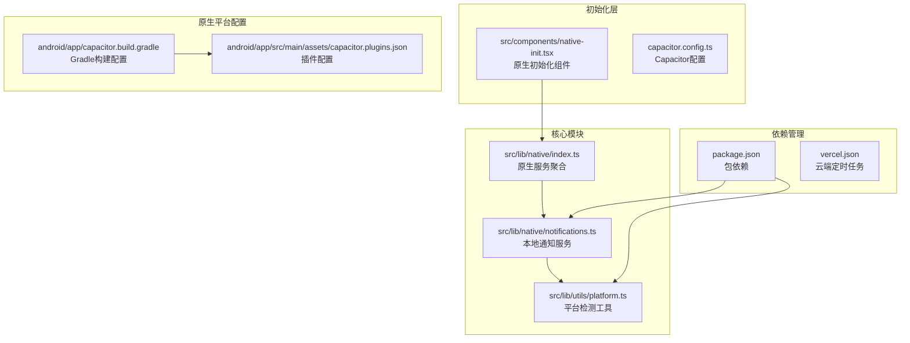
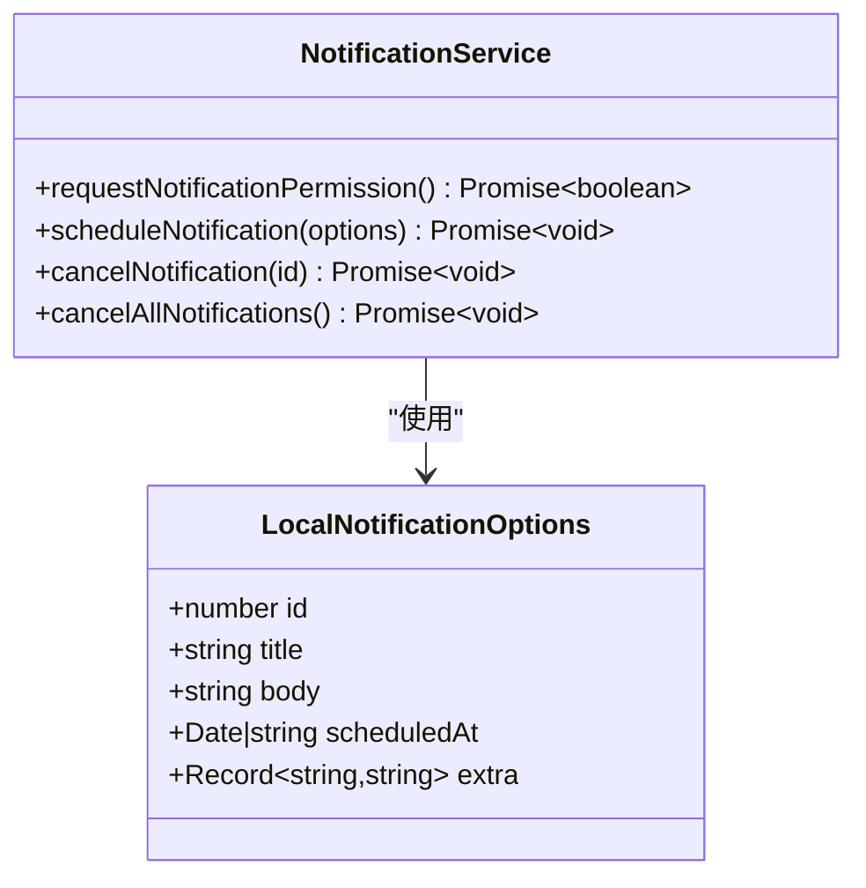
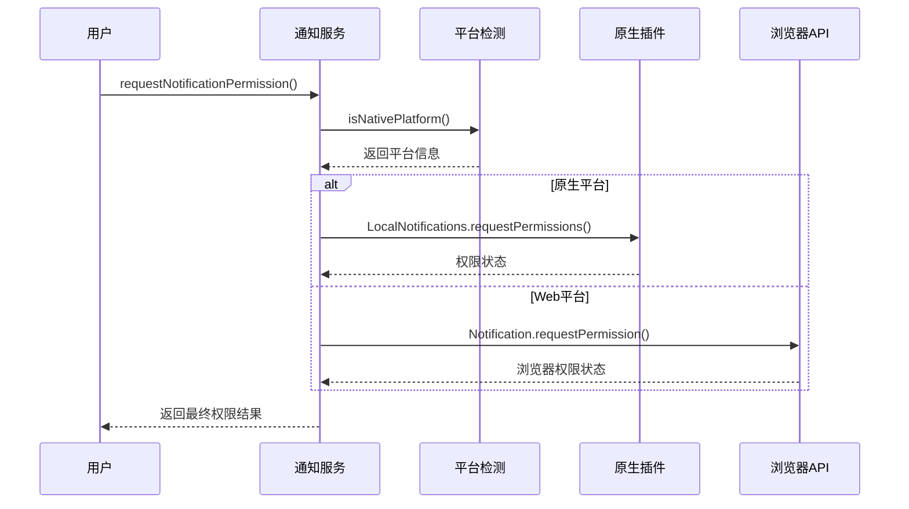
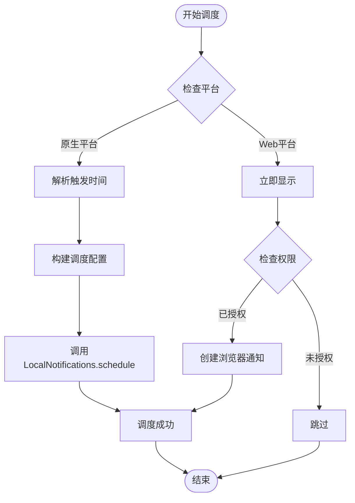
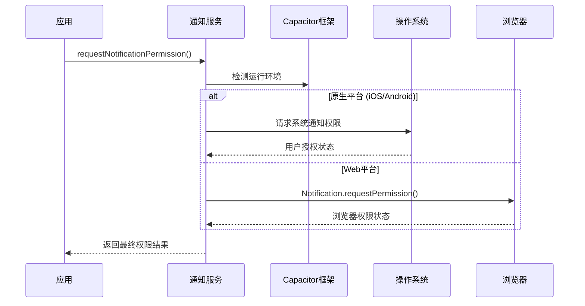
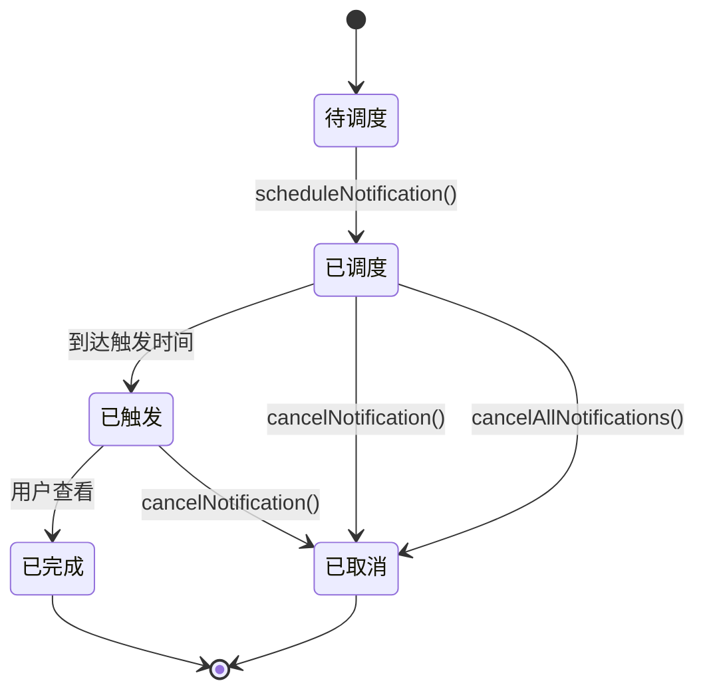

# 本地通知功能

<cite>
**本文档引用的文件**
- [src/lib/native/notifications.ts](file://src/lib/native/notifications.ts)
- [src/lib/utils/platform.ts](file://src/lib/utils/platform.ts)
- [src/lib/native/index.ts](file://src/lib/native/index.ts)
- [src/components/native-init.tsx](file://src/components/native-init.tsx)
- [android/app/src/main/assets/capacitor.plugins.json](file://android/app/src/main/assets/capacitor.plugins.json)
- [android/app/capacitor.build.gradle](file://android/app/capacitor.build.gradle)
- [package.json](file://package.json)
- [capacitor.config.ts](file://capacitor.config.ts)
- [vercel.json](file://vercel.json)
</cite>

## 目录
1. [简介](#简介)
2. [项目结构](#项目结构)
3. [核心组件](#核心组件)
4. [架构概览](#架构概览)
5. [详细组件分析](#详细组件分析)
6. [依赖关系分析](#依赖关系分析)
7. [性能考虑](#性能考虑)
8. [故障排除指南](#故障排除指南)
9. [结论](#结论)
10. [附录](#附录)

## 简介

本地通知功能是 MindOS 应用的核心特性之一，为用户提供跨平台的通知提醒服务。该功能基于 Capacitor 框架实现，支持原生平台的本地通知调度和 Web 平台的降级处理。

本地通知功能主要服务于以下场景：
- **待办事项提醒**：定时提醒用户完成重要的待办任务
- **日记写作提醒**：鼓励用户定期记录生活感悟和思维历程
- **习惯养成提醒**：帮助用户建立和维持良好的日常习惯
- **重要事件提醒**：确保用户不会错过关键的时间节点

该系统采用渐进式增强的设计理念，在原生平台提供完整的本地通知能力，在 Web 平台使用浏览器的 Notification API 进行降级处理。

## 项目结构

本地通知功能的代码组织遵循模块化设计原则，主要分布在以下几个关键位置：



**图表来源**
- [src/lib/native/notifications.ts:1-110](file://src/lib/native/notifications.ts#L1-L110)
- [src/lib/utils/platform.ts:1-60](file://src/lib/utils/platform.ts#L1-L60)
- [src/lib/native/index.ts:1-54](file://src/lib/native/index.ts#L1-L54)

**章节来源**
- [src/lib/native/notifications.ts:1-110](file://src/lib/native/notifications.ts#L1-L110)
- [src/lib/utils/platform.ts:1-60](file://src/lib/utils/platform.ts#L1-L60)
- [src/lib/native/index.ts:1-54](file://src/lib/native/index.ts#L1-L54)

## 核心组件

### 本地通知服务接口定义

本地通知功能的核心是一个类型安全的接口定义，提供了完整的通知配置选项：



**图表来源**
- [src/lib/native/notifications.ts:11-19](file://src/lib/native/notifications.ts#L11-L19)
- [src/lib/native/notifications.ts:24-109](file://src/lib/native/notifications.ts#L24-L109)

### 权限管理系统

通知权限管理是本地通知功能的重要组成部分，实现了跨平台的一致性处理：



**图表来源**
- [src/lib/native/notifications.ts:24-41](file://src/lib/native/notifications.ts#L24-L41)
- [src/lib/utils/platform.ts:14-27](file://src/lib/utils/platform.ts#L14-L27)

**章节来源**
- [src/lib/native/notifications.ts:11-109](file://src/lib/native/notifications.ts#L11-L109)
- [src/lib/utils/platform.ts:14-59](file://src/lib/utils/platform.ts#L14-L59)

## 架构概览

本地通知功能采用分层架构设计，确保了良好的可维护性和扩展性：

```mermaid
graph TD
subgraph "应用层"
A[业务组件<br/>待办事项/日记等]
end
subgraph "服务层"
B[通知服务<br/>notifications.ts]
C[平台检测<br/>platform.ts]
D[原生服务聚合<br/>native/index.ts]
end
subgraph "基础设施层"
E[Capacitor本地通知插件<br/>@capacitor/local-notifications]
F[浏览器通知API<br/>Web平台降级]
G[原生平台配置<br/>Android/iOS]
end
A --> B
B --> C
B --> D
D --> E
D --> F
E --> G
```

**图表来源**
- [src/lib/native/notifications.ts:1-110](file://src/lib/native/notifications.ts#L1-L110)
- [src/lib/native/index.ts:1-54](file://src/lib/native/index.ts#L1-L54)
- [package.json:28](file://package.json#L28)

## 详细组件分析

### 通知调度系统

通知调度系统是本地通知功能的核心，支持精确的时间控制和灵活的配置选项：



**图表来源**
- [src/lib/native/notifications.ts:46-78](file://src/lib/native/notifications.ts#L46-L78)

#### 调度配置选项

通知调度支持多种配置选项，满足不同的使用场景：

| 配置项 | 类型 | 必需 | 描述 |
|--------|------|------|------|
| id | number | 是 | 通知唯一标识符 |
| title | string | 是 | 通知标题 |
| body | string | 是 | 通知正文内容 |
| scheduledAt | Date \| string | 否 | 触发时间（原生平台支持） |
| extra | Record<string,string> | 否 | 自定义附加数据 |

**章节来源**
- [src/lib/native/notifications.ts:46-78](file://src/lib/native/notifications.ts#L46-L78)

### 通知权限管理

权限管理实现了跨平台的一致性处理，确保用户能够在不同环境下获得最佳体验：



**图表来源**
- [src/lib/native/notifications.ts:24-41](file://src/lib/native/notifications.ts#L24-L41)

#### 权限状态处理

权限管理系统能够优雅地处理各种权限状态：

| 权限状态 | 原生平台处理 | Web平台处理 | 用户体验 |
|----------|-------------|------------|----------|
| 已授权 | 直接显示通知 | 直接显示通知 | 完全功能 |
| 未授权 | 显示授权提示 | 显示授权提示 | 功能受限 |
| 拒绝 | 引导用户到设置 | 引导用户到设置 | 需要手动授权 |
| 不支持 | 降级到无通知 | 降级到无通知 | 基础功能 |

**章节来源**
- [src/lib/native/notifications.ts:24-41](file://src/lib/native/notifications.ts#L24-L41)

### 通知生命周期管理

通知生命周期管理涵盖了从创建到销毁的完整流程：



**图表来源**
- [src/lib/native/notifications.ts:83-109](file://src/lib/native/notifications.ts#L83-L109)

**章节来源**
- [src/lib/native/notifications.ts:83-109](file://src/lib/native/notifications.ts#L83-L109)

## 依赖关系分析

本地通知功能的依赖关系相对简洁，主要依赖于 Capacitor 框架和平台检测工具：

```mermaid
graph LR
subgraph "外部依赖"
A[@capacitor/core<br/>核心框架]
B[@capacitor/local-notifications<br/>本地通知插件]
C[浏览器Notification API<br/>Web降级]
end
subgraph "内部模块"
D[platform.ts<br/>平台检测]
E[notifications.ts<br/>通知服务]
F[native/index.ts<br/>服务聚合]
end
A --> B
A --> D
D --> E
B --> E
C --> E
F --> E
```

**图表来源**
- [package.json:20-32](file://package.json#L20-L32)
- [src/lib/utils/platform.ts:14-27](file://src/lib/utils/platform.ts#L14-L27)
- [src/lib/native/notifications.ts:9](file://src/lib/native/notifications.ts#L9)

### 原生平台集成

原生平台的集成通过 Capacitor 插件系统实现，配置文件位于 Android 项目的资源目录中：

| 配置文件 | 作用 | 关键设置 |
|----------|------|----------|
| capacitor.plugins.json | 插件注册 | @capacitor/local-notifications |
| capacitor.build.gradle | Gradle依赖 | implementation project(':capacitor-local-notifications') |
| package.json | NPM依赖 | @capacitor/local-notifications ^8.1.0 |

**章节来源**
- [android/app/src/main/assets/capacitor.plugins.json:19-21](file://android/app/src/main/assets/capacitor.plugins.json#L19-L21)
- [android/app/capacitor.build.gradle:16](file://android/app/capacitor.build.gradle#L16)
- [package.json:28](file://package.json#L28)

## 性能考虑

本地通知功能在设计时充分考虑了性能优化和用户体验：

### 内存管理
- 通知对象采用轻量级设计，避免不必要的内存占用
- 异步操作使用 Promise 处理，防止阻塞主线程
- 错误处理采用降级策略，不影响主应用性能

### 网络优化
- 通知调度完全在客户端进行，无需网络请求
- 权限检查采用缓存机制，减少重复调用
- 平台检测使用单例模式，避免重复初始化

### 用户体验优化
- 支持批量取消操作，提高管理效率
- 提供详细的错误日志，便于问题诊断
- 实现优雅降级，确保在各种环境下都能正常工作

## 故障排除指南

### 常见问题及解决方案

#### 通知无法显示
**症状**：调用 `scheduleNotification()` 后没有收到通知
**可能原因**：
1. 通知权限未授予
2. 设备处于勿扰模式
3. 应用被系统限制

**解决步骤**：
1. 检查权限状态：`await requestNotificationPermission()`
2. 验证设备设置：检查系统通知设置
3. 测试其他应用：确认设备通知功能正常

#### 通知时间不准确
**症状**：通知触发时间与预期不符
**可能原因**：
1. 时间格式不正确
2. 时区设置问题
3. 系统时间同步问题

**解决步骤**：
1. 确保使用 ISO 字符串或 Date 对象
2. 检查设备时区设置
3. 同步系统时间

#### 权限请求失败
**症状**：`requestNotificationPermission()` 返回 false
**可能原因**：
1. 平台检测失败
2. 插件初始化异常
3. 用户拒绝授权

**解决步骤**：
1. 检查平台检测逻辑：`isNativePlatform()`
2. 验证插件配置：`capacitor.plugins.json`
3. 引导用户手动授权

### 调试技巧

#### 开发环境调试
```javascript
// 启用详细日志
console.log('[Notification] 调试信息');

// 检查平台状态
console.log('[Platform]', isNativePlatform());

// 验证权限状态
const permission = await requestNotificationPermission();
console.log('[Permission]', permission);
```

#### 生产环境监控
- 监控通知调度成功率
- 记录权限请求失败次数
- 跟踪用户交互行为

**章节来源**
- [src/lib/native/notifications.ts:68-70](file://src/lib/native/notifications.ts#L68-L70)
- [src/lib/native/notifications.ts:89-91](file://src/lib/native/notifications.ts#L89-L91)
- [src/lib/native/notifications.ts:106-108](file://src/lib/native/notifications.ts#L106-L108)

## 结论

本地通知功能通过精心设计的架构和完善的错误处理机制，为 MindOS 应用提供了可靠的跨平台通知服务。该系统具有以下优势：

1. **跨平台一致性**：原生平台和 Web 平台提供一致的用户体验
2. **渐进式增强**：充分利用原生能力，同时保证 Web 平台的功能完整性
3. **易于维护**：模块化设计使得代码结构清晰，便于后续扩展
4. **性能优化**：异步处理和缓存机制确保了良好的响应性能

未来可以考虑的功能扩展包括：
- 通知分组和优先级管理
- 更丰富的通知样式定制
- 通知数据分析和统计
- 与其他原生功能的深度集成

## 附录

### API 使用示例

#### 基本通知创建
```typescript
// 创建简单通知
await scheduleNotification({
  id: 1,
  title: "提醒",
  body: "该完成今天的待办任务了"
});
```

#### 定时通知调度
```typescript
// 创建定时通知（30秒后触发）
const futureTime = new Date(Date.now() + 30000);
await scheduleNotification({
  id: 2,
  title: "定时提醒",
  body: "这是定时通知的内容",
  scheduledAt: futureTime
});
```

#### 批量通知管理
```typescript
// 取消特定通知
await cancelNotification(1);

// 取消所有待发通知
await cancelAllNotifications();
```

### 平台差异说明

| 特性 | 原生平台 | Web平台 | 差异说明 |
|------|----------|---------|----------|
| 定时调度 | ✅ 支持 | ❌ 不支持 | Web平台仅能立即显示 |
| 权限管理 | ✅ 系统级 | ✅ 浏览器级 | 原生权限更严格 |
| 通知样式 | ✅ 丰富 | ⚠️ 基础 | 原生支持更多自定义 |
| 后台执行 | ✅ 支持 | ❌ 限制 | Web受浏览器限制 |

### 配置参考

#### Capacitor 配置
```typescript
// capacitor.config.ts 中的关键配置
export default {
  plugins: {
    SplashScreen: {
      launchAutoHide: true,
      backgroundColor: '#fefef9'
    }
  }
};
```

#### 依赖版本
- @capacitor/core: ^8.3.3
- @capacitor/local-notifications: ^8.1.0
- @capacitor/android: ^8.3.3