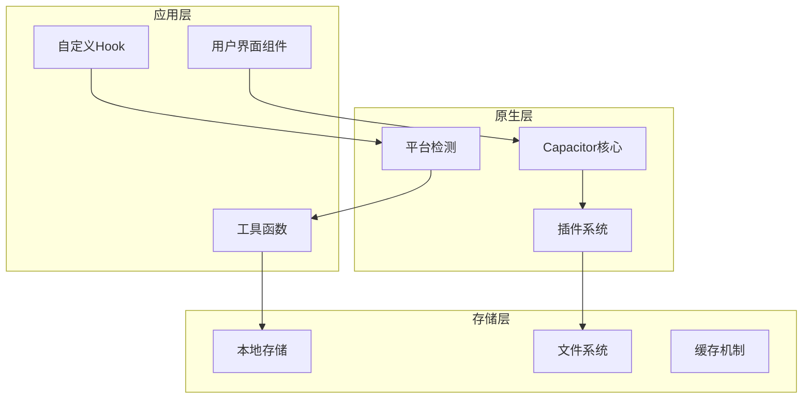
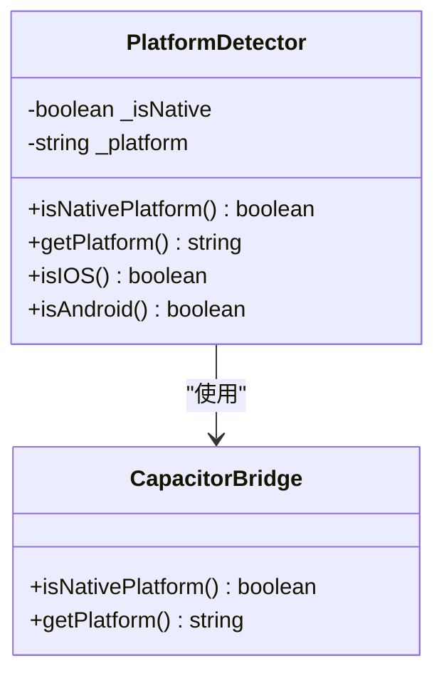
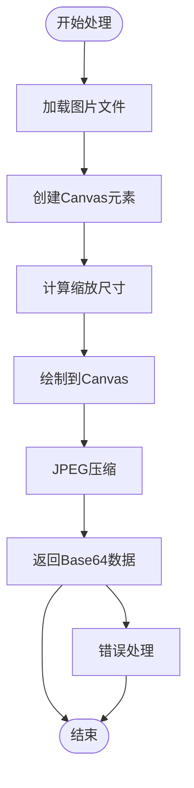
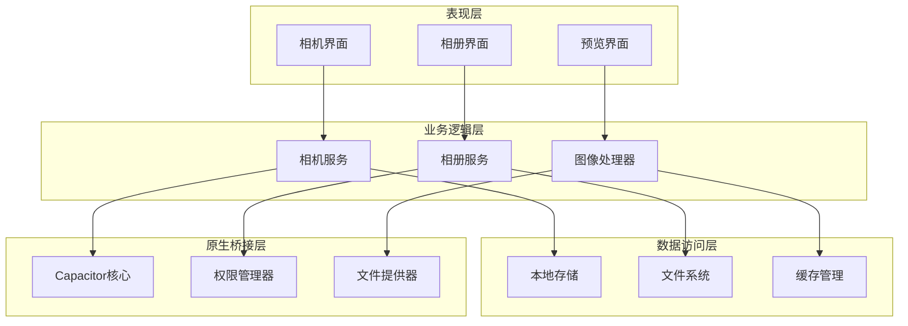
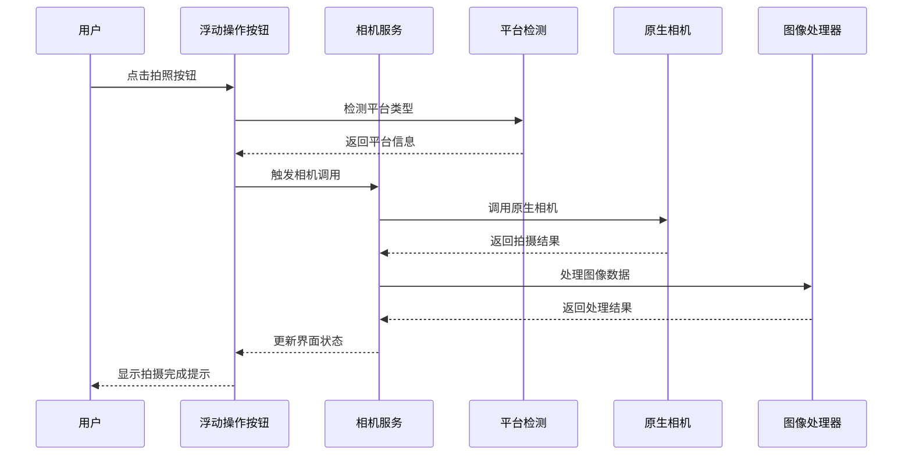
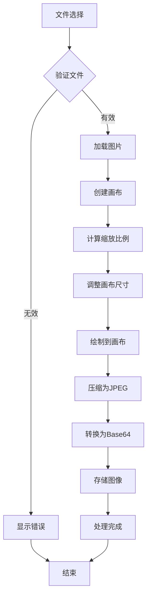

# 相机集成功能

<cite>
**本文档引用的文件**
- [capacitor.config.ts](file://capacitor.config.ts)
- [AndroidManifest.xml](file://android/app/src/main/AndroidManifest.xml)
- [file_paths.xml](file://android/app/src/main/res/xml/file_paths.xml)
- [platform.ts](file://src/lib/utils/platform.ts)
- [image-compress.ts](file://src/lib/utils/image-compress.ts)
- [diary-image-card.tsx](file://src/components/dashboard/diary-image-card.tsx)
- [native-init.tsx](file://src/components/native-init.tsx)
- [index.ts](file://src/lib/native/index.ts)
- [knowledge-list.tsx](file://src/components/knowledge/knowledge-list.tsx)
</cite>

## 目录
1. [简介](#简介)
2. [项目结构](#项目结构)
3. [核心组件](#核心组件)
4. [架构概览](#架构概览)
5. [详细组件分析](#详细组件分析)
6. [依赖关系分析](#依赖关系分析)
7. [性能考虑](#性能考虑)
8. [故障排除指南](#故障排除指南)
9. [结论](#结论)

## 简介

本文件详细阐述了Life OS项目中的相机集成功能。该功能基于Capacitor框架实现，支持拍照、相册访问和图像处理。系统采用跨平台架构，能够在Web、iOS和Android平台上提供一致的用户体验。

相机集成功能的核心特性包括：
- 原生平台检测和适配
- 图像压缩和存储机制
- 跨平台兼容性处理
- 用户界面集成
- 权限管理和安全控制

## 项目结构

项目采用模块化架构设计，相机相关功能分布在多个关键目录中：



**图表来源**
- [capacitor.config.ts:1-37](file://capacitor.config.ts#L1-L37)
- [platform.ts:1-59](file://src/lib/utils/platform.ts#L1-L59)

**章节来源**
- [capacitor.config.ts:1-37](file://capacitor.config.ts#L1-L37)
- [platform.ts:1-59](file://src/lib/utils/platform.ts#L1-L59)

## 核心组件

### 平台检测系统

系统通过统一的平台检测工具实现跨平台兼容性：



**图表来源**
- [platform.ts:14-59](file://src/lib/utils/platform.ts#L14-L59)

### 图像处理引擎

图像处理功能采用高效的压缩算法：



**图表来源**
- [image-compress.ts:18-57](file://src/lib/utils/image-compress.ts#L18-L57)

**章节来源**
- [platform.ts:14-59](file://src/lib/utils/platform.ts#L14-L59)
- [image-compress.ts:18-75](file://src/lib/utils/image-compress.ts#L18-L75)

## 架构概览

系统采用分层架构设计，确保功能模块的清晰分离和高内聚低耦合：



**图表来源**
- [capacitor.config.ts:24-33](file://capacitor.config.ts#L24-L33)
- [index.ts:19-39](file://src/lib/native/index.ts#L19-L39)

## 详细组件分析

### 相机调用组件

相机功能通过浮动操作按钮(FAB)触发，集成在知识库列表页面中：



**图表来源**
- [knowledge-list.tsx:843-851](file://src/components/knowledge/knowledge-list.tsx#L843-L851)
- [platform.ts:14-59](file://src/lib/utils/platform.ts#L14-L59)

### 图像压缩处理流程

图像压缩采用异步处理机制，确保用户体验流畅：



**图表来源**
- [image-compress.ts:23-56](file://src/lib/utils/image-compress.ts#L23-L56)

### 权限管理系统

系统通过Android Manifest文件声明必要的权限：

| 权限名称 | 用途 | SDK版本要求 |
|---------|------|------------|
| INTERNET | 网络访问 | 无限制 |
| ACCESS_NETWORK_STATE | 网络状态检查 | 无限制 |
| VIBRATE | 触觉反馈 | 无限制 |
| READ_EXTERNAL_STORAGE | 读取外部存储 | 最高SDK 32 |
| READ_MEDIA_IMAGES | 读取媒体图片 | SDK 33+ |

**章节来源**
- [knowledge-list.tsx:843-851](file://src/components/knowledge/knowledge-list.tsx#L843-L851)
- [image-compress.ts:18-75](file://src/lib/utils/image-compress.ts#L18-L75)
- [AndroidManifest.xml:43-52](file://android/app/src/main/AndroidManifest.xml#L43-L52)

## 依赖关系分析

系统依赖关系呈现清晰的层次结构：

```mermaid
graph LR
subgraph "外部依赖"
Capacitor[@capacitor/core]
React[react]
Next[next]
end
subgraph "内部模块"
PlatformUtils[platform.ts]
ImageUtils[image-compress.ts]
NativeBridge[index.ts]
UIComponents[UI组件]
end
subgraph "原生插件"
CameraPlugin[相机插件]
FilePlugin[文件插件]
PermissionPlugin[权限插件]
end
Capacitor --> PlatformUtils
React --> UIComponents
Next --> UIComponents
PlatformUtils --> NativeBridge
ImageUtils --> UIComponents
NativeBridge --> CameraPlugin
CameraPlugin --> FilePlugin
FilePlugin --> PermissionPlugin
```

**图表来源**
- [capacitor.config.ts:16-23](file://capacitor.config.ts#L16-L23)
- [index.ts:8-14](file://src/lib/native/index.ts#L8-L14)

**章节来源**
- [capacitor.config.ts:16-33](file://capacitor.config.ts#L16-L33)
- [index.ts:19-39](file://src/lib/native/index.ts#L19-L39)

## 性能考虑

### 内存优化策略

1. **异步处理**: 图像压缩采用Promise链式调用，避免阻塞主线程
2. **批量处理**: 支持最多8张图片的并发压缩，提升处理效率
3. **缓存机制**: 使用浏览器缓存减少重复计算开销
4. **资源清理**: 及时释放Canvas和Image对象内存

### 存储优化

1. **压缩参数**: 默认1200x1200像素和70%质量，平衡画质和体积
2. **Base64格式**: 便于本地存储和传输
3. **文件路径**: 通过FileProvider安全访问外部存储

## 故障排除指南

### 常见问题及解决方案

| 问题类型 | 症状描述 | 解决方案 |
|---------|----------|----------|
| 权限拒绝 | 相机无法打开 | 检查AndroidManifest.xml权限声明 |
| 图像加载失败 | 压缩过程报错 | 验证文件格式和大小限制 |
| 平台检测错误 | 无法识别设备类型 | 确认Capacitor环境配置 |
| 存储空间不足 | 图像保存失败 | 清理缓存或增加存储权限 |

### 调试建议

1. **启用详细日志**: 在开发环境中开启Capacitor调试模式
2. **检查网络连接**: 确保服务器URL配置正确
3. **验证文件路径**: 检查file_paths.xml配置
4. **测试权限流程**: 在真实设备上验证权限申请流程

**章节来源**
- [AndroidManifest.xml:32-40](file://android/app/src/main/AndroidManifest.xml#L32-L40)
- [file_paths.xml:1-5](file://android/app/src/main/res/xml/file_paths.xml#L1-L5)

## 结论

Life OS的相机集成功能通过精心设计的架构实现了跨平台的图像处理能力。系统采用模块化设计，确保了功能的可维护性和扩展性。通过异步处理和缓存机制，提供了流畅的用户体验。

主要优势包括：
- 完善的平台适配机制
- 高效的图像处理算法
- 安全的权限管理
- 灵活的配置选项

未来可以考虑的功能增强：
- 添加图像裁剪功能
- 实现云端存储选项
- 优化大图片处理性能
- 增加图像编辑工具