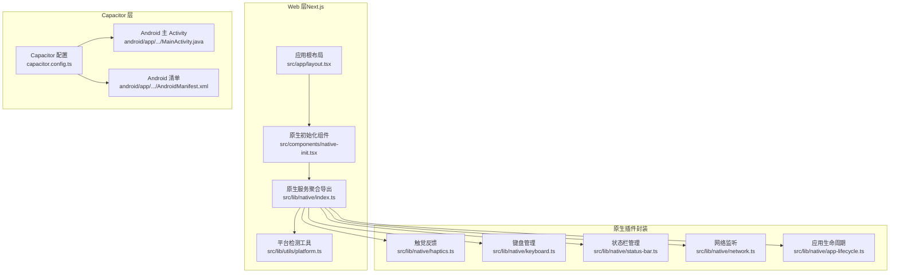
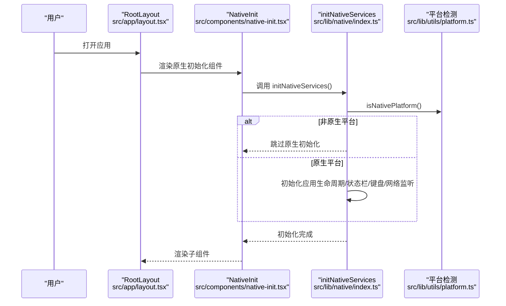
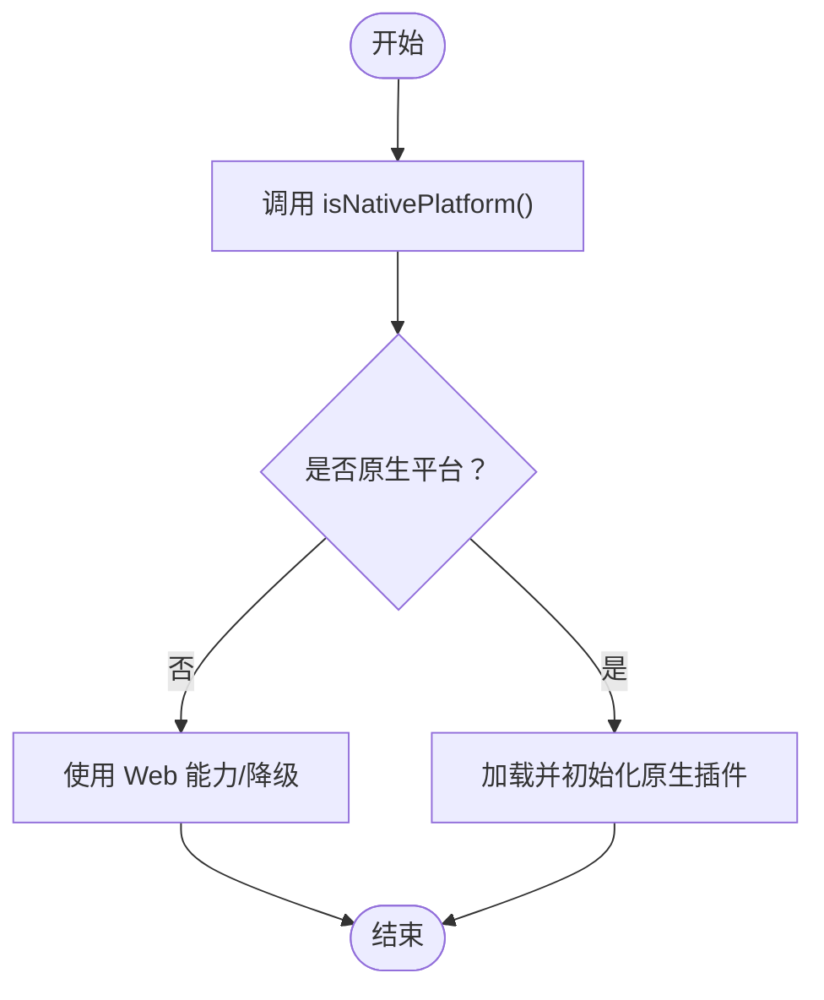
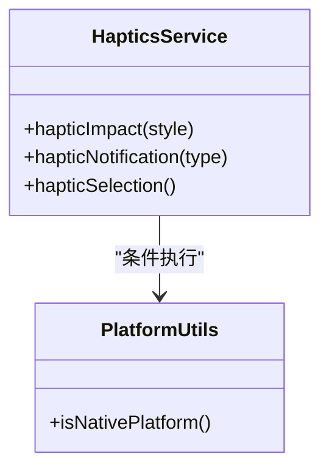
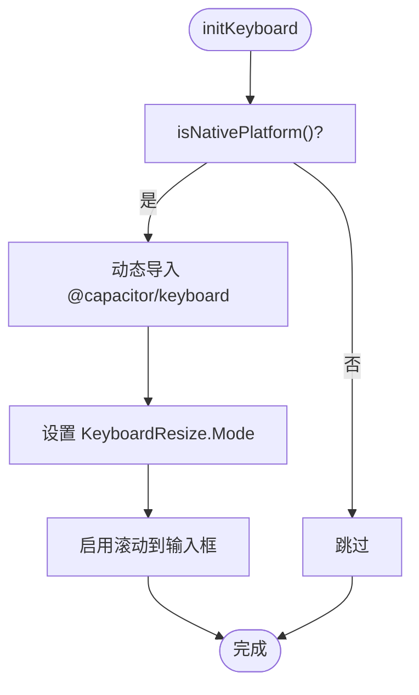
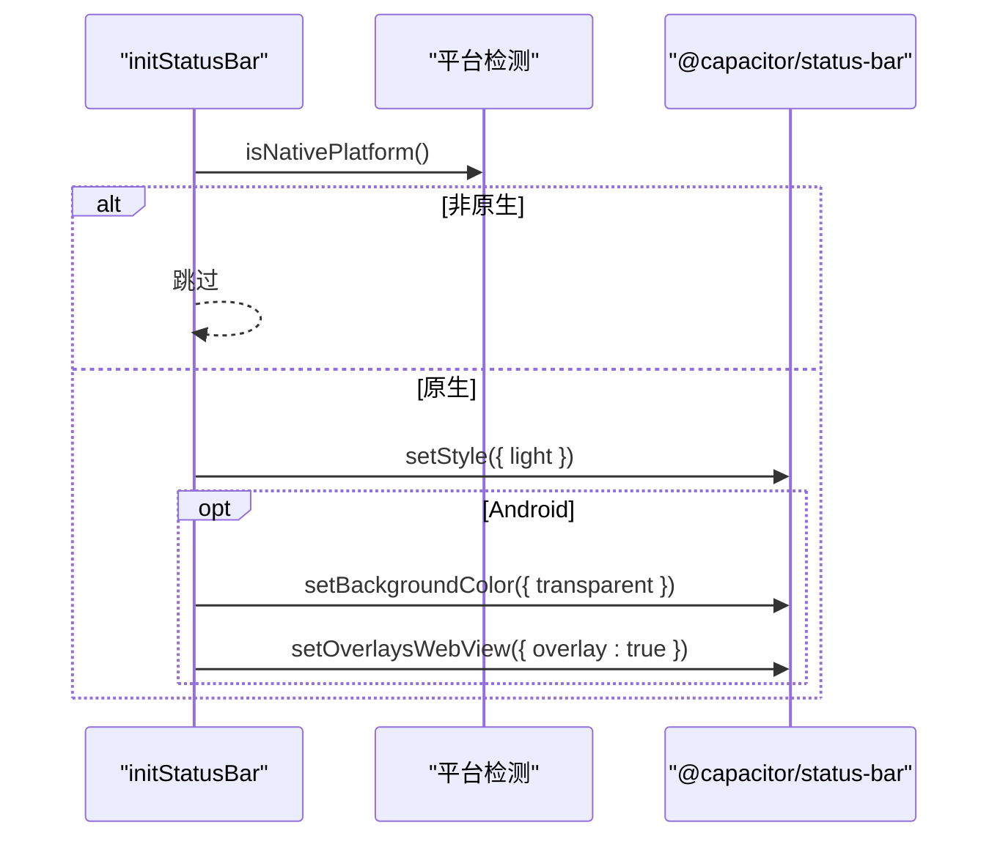
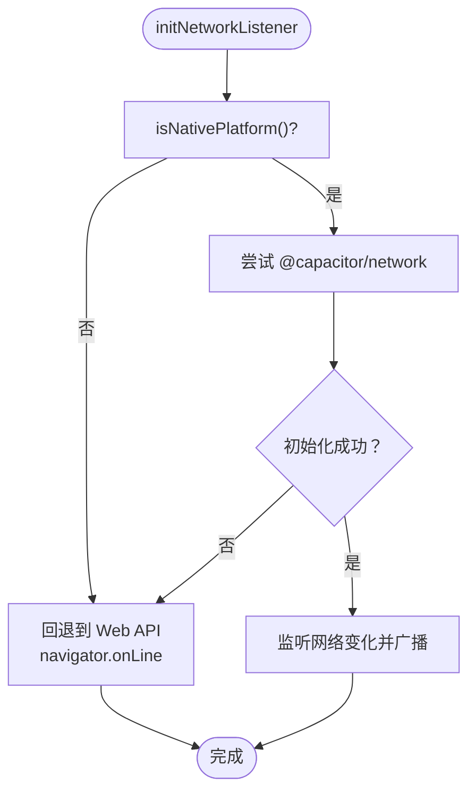
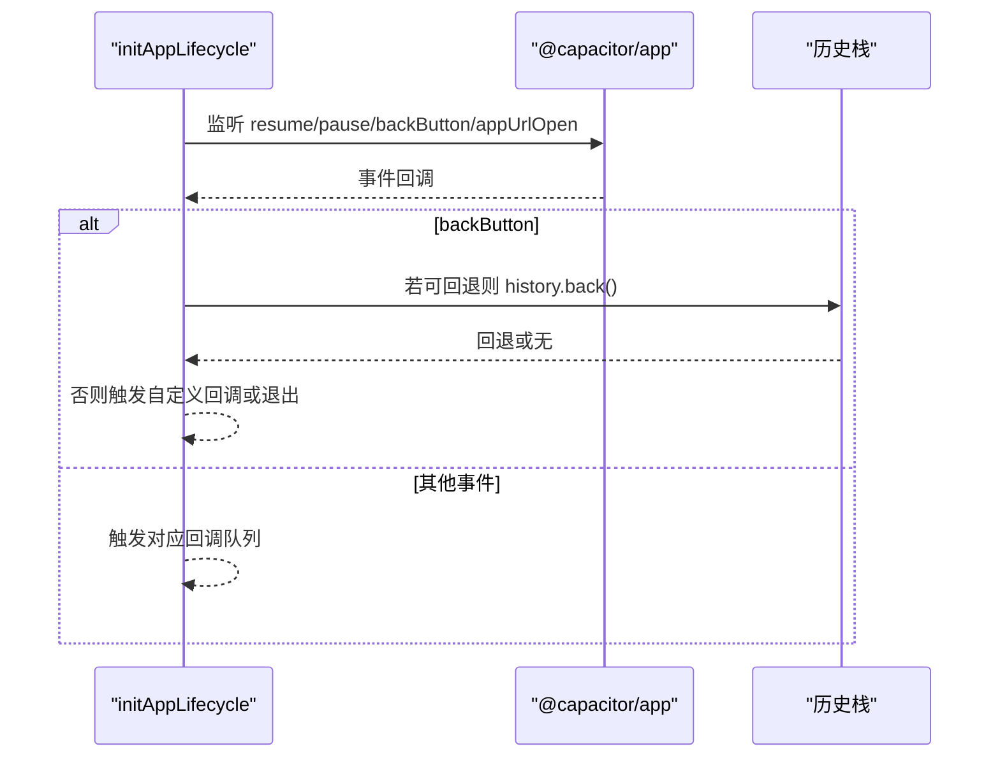
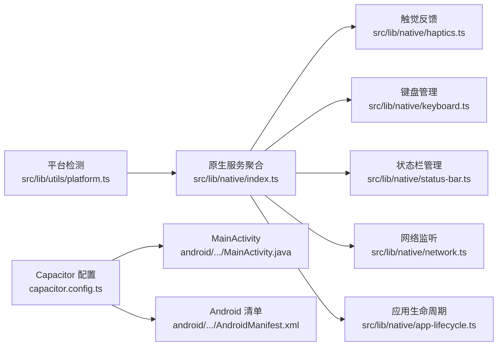

# 平台适配

<cite>
**本文引用的文件**
- [capacitor.config.ts](file://capacitor.config.ts)
- [src/lib/utils/platform.ts](file://src/lib/utils/platform.ts)
- [src/lib/native/index.ts](file://src/lib/native/index.ts)
- [src/components/native-init.tsx](file://src/components/native-init.tsx)
- [src/app/layout.tsx](file://src/app/layout.tsx)
- [src/lib/native/haptics.ts](file://src/lib/native/haptics.ts)
- [src/lib/native/keyboard.ts](file://src/lib/native/keyboard.ts)
- [src/lib/native/status-bar.ts](file://src/lib/native/status-bar.ts)
- [src/lib/native/network.ts](file://src/lib/native/network.ts)
- [src/lib/native/app-lifecycle.ts](file://src/lib/native/app-lifecycle.ts)
- [android/app/src/main/java/com/mindos/app/MainActivity.java](file://android/app/src/main/java/com/mindos/app/MainActivity.java)
- [android/app/src/main/AndroidManifest.xml](file://android/app/src/main/AndroidManifest.xml)
- [DESIGN.md](file://DESIGN.md)
- [src/app/globals.css](file://src/app/globals.css)
</cite>

## 目录
1. [引言](#引言)
2. [项目结构](#项目结构)
3. [核心组件](#核心组件)
4. [架构总览](#架构总览)
5. [详细组件分析](#详细组件分析)
6. [依赖关系分析](#依赖关系分析)
7. [性能考量](#性能考量)
8. [故障排查指南](#故障排查指南)
9. [结论](#结论)
10. [附录](#附录)

## 引言
本技术文档聚焦于“平台适配”，系统阐述如何在移动端（iOS/Android）与 Web 端之间实现功能适配与差异化体验。内容涵盖：
- 平台检测机制与条件渲染策略
- Android 与 iOS 的特定实现差异（手势、键盘、状态栏、网络监听等）
- 响应式设计最佳实践与断点策略
- 原生 API 调用的平台差异处理与兼容性策略

目标是帮助开发者在 Next.js + Capacitor 架构下，构建一致且高质量的跨平台体验。

## 项目结构
本项目采用 Capacitor 将 Next.js Web 应用打包为原生应用，核心适配逻辑集中在以下位置：
- 平台检测与原生服务初始化：src/lib/utils/platform.ts、src/lib/native/index.ts、src/components/native-init.tsx、src/app/layout.tsx
- 原生插件封装：触觉反馈、键盘、状态栏、网络、应用生命周期、分享与通知等
- Android 配置与清单：MainActivity、AndroidManifest.xml
- Capacitor 配置：capacitor.config.ts
- 设计与响应式策略：DESIGN.md、src/app/globals.css

图表来源
- [src/app/layout.tsx:18-31](file://src/app/layout.tsx#L18-L31)
- [src/components/native-init.tsx:5-15](file://src/components/native-init.tsx#L5-L15)
- [src/lib/native/index.ts:19-54](file://src/lib/native/index.ts#L19-L54)
- [src/lib/utils/platform.ts:14-59](file://src/lib/utils/platform.ts#L14-L59)
- [capacitor.config.ts:3-36](file://capacitor.config.ts#L3-L36)
- [android/app/src/main/java/com/mindos/app/MainActivity.java:1-5](file://android/app/src/main/java/com/mindos/app/MainActivity.java#L1-L5)
- [android/app/src/main/AndroidManifest.xml:17-41](file://android/app/src/main/AndroidManifest.xml#L17-L41)

章节来源
- [src/app/layout.tsx:18-31](file://src/app/layout.tsx#L18-L31)
- [src/components/native-init.tsx:5-15](file://src/components/native-init.tsx#L5-L15)
- [src/lib/native/index.ts:19-54](file://src/lib/native/index.ts#L19-L54)
- [src/lib/utils/platform.ts:14-59](file://src/lib/utils/platform.ts#L14-L59)
- [capacitor.config.ts:3-36](file://capacitor.config.ts#L3-L36)
- [android/app/src/main/java/com/mindos/app/MainActivity.java:1-5](file://android/app/src/main/java/com/mindos/app/MainActivity.java#L1-L5)
- [android/app/src/main/AndroidManifest.xml:17-41](file://android/app/src/main/AndroidManifest.xml#L17-L41)

## 核心组件
- 平台检测工具：提供 isNativePlatform、getPlatform、isIOS、isAndroid 等方法，支持 SSR 安全的动态导入，避免在非原生环境报错。
- 原生服务聚合：initNativeServices 统一初始化应用生命周期、状态栏、键盘、网络监听等；按需懒加载各插件模块，失败时静默降级。
- 原生初始化组件：在应用根组件挂载后异步执行 initNativeServices，并捕获异常防止阻塞。
- Capacitor 配置：定义 WebView 服务器地址、UA 追加、iOS/Android 插件参数、启动屏配置等。
- Android 清单与主 Activity：声明权限、配置 Activity 生命周期与启动模式、FileProvider 等。

章节来源
- [src/lib/utils/platform.ts:14-59](file://src/lib/utils/platform.ts#L14-L59)
- [src/lib/native/index.ts:19-54](file://src/lib/native/index.ts#L19-L54)
- [src/components/native-init.tsx:5-15](file://src/components/native-init.tsx#L5-L15)
- [capacitor.config.ts:3-36](file://capacitor.config.ts#L3-L36)
- [android/app/src/main/AndroidManifest.xml:17-41](file://android/app/src/main/AndroidManifest.xml#L17-L41)
- [android/app/src/main/java/com/mindos/app/MainActivity.java:1-5](file://android/app/src/main/java/com/mindos/app/MainActivity.java#L1-L5)

## 架构总览
平台适配的整体流程如下：
- 应用启动时，根布局注入原生初始化组件
- 原生初始化组件调用 initNativeServices
- initNativeServices 通过平台检测决定是否执行原生初始化
- 分别初始化应用生命周期、状态栏、键盘、网络监听等
- 各原生能力以“存在即启用，不存在则静默”的策略运行

图表来源
- [src/app/layout.tsx:23-29](file://src/app/layout.tsx#L23-L29)
- [src/components/native-init.tsx:7-12](file://src/components/native-init.tsx#L7-L12)
- [src/lib/native/index.ts:19-54](file://src/lib/native/index.ts#L19-L54)
- [src/lib/utils/platform.ts:14-27](file://src/lib/utils/platform.ts#L14-L27)

## 详细组件分析

### 平台检测与条件渲染
- 通过 isNativePlatform 与 getPlatform 判断运行环境，避免在 SSR 或 Web 端直接调用原生 API。
- 条件渲染策略：仅在 isNativePlatform() 为真时启用原生能力；否则静默降级或使用 Web 能力替代。

图表来源
- [src/lib/utils/platform.ts:14-27](file://src/lib/utils/platform.ts#L14-L27)
- [src/lib/native/index.ts:22-25](file://src/lib/native/index.ts#L22-L25)

章节来源
- [src/lib/utils/platform.ts:14-59](file://src/lib/utils/platform.ts#L14-L59)
- [src/lib/native/index.ts:22-25](file://src/lib/native/index.ts#L22-L25)

### 触觉反馈（Haptics）
- 仅在原生平台生效；根据 HapticStyle 映射 ImpactStyle，分别触发轻/中/重三种冲击反馈。
- 通知与选择类反馈分别使用通知类型与选择序列 API。
- 未安装插件或调用失败时静默降级。

图表来源
- [src/lib/native/haptics.ts:19-68](file://src/lib/native/haptics.ts#L19-L68)
- [src/lib/utils/platform.ts:14-27](file://src/lib/utils/platform.ts#L14-L27)

章节来源
- [src/lib/native/haptics.ts:19-68](file://src/lib/native/haptics.ts#L19-L68)

### 键盘适配（Keyboard）
- 仅在原生平台生效；设置键盘行为为“视图缩放”模式，并允许滚动到输入框。
- 失败时记录警告日志，不影响应用启动。

图表来源
- [src/lib/native/keyboard.ts:9-23](file://src/lib/native/keyboard.ts#L9-L23)
- [src/lib/utils/platform.ts:14-27](file://src/lib/utils/platform.ts#L14-L27)

章节来源
- [src/lib/native/keyboard.ts:9-23](file://src/lib/native/keyboard.ts#L9-L23)

### 状态栏（StatusBar）
- 仅在原生平台生效；设置浅色样式；Android 下设置透明覆盖 WebView。
- 提供隐藏/显示状态栏的便捷方法，失败时记录警告。

图表来源
- [src/lib/native/status-bar.ts:9-26](file://src/lib/native/status-bar.ts#L9-L26)
- [src/lib/utils/platform.ts:14-59](file://src/lib/utils/platform.ts#L14-L59)

章节来源
- [src/lib/native/status-bar.ts:9-26](file://src/lib/native/status-bar.ts#L9-L26)

### 网络监听（Network）
- 原生平台使用 @capacitor/network 精确区分 WiFi/蜂窝/无连接；Web 平台回退到 navigator.onLine。
- 支持注册网络状态变更回调，提供 isOnline 与 getNetworkStatus 查询接口。

图表来源
- [src/lib/native/network.ts:32-82](file://src/lib/native/network.ts#L32-L82)
- [src/lib/utils/platform.ts:14-27](file://src/lib/utils/platform.ts#L14-L27)

章节来源
- [src/lib/native/network.ts:11-102](file://src/lib/native/network.ts#L11-L102)

### 应用生命周期（App Lifecycle）
- 监听 resume/pause/backButton/appUrlOpen 等事件；Android 返回键优先历史回退，否则触发自定义回调，均无则退出应用。
- 通过 onResume/onPause/onBackButton/onAppUrlOpen 注册回调，返回取消订阅函数。

图表来源
- [src/lib/native/app-lifecycle.ts:31-66](file://src/lib/native/app-lifecycle.ts#L31-L66)

章节来源
- [src/lib/native/app-lifecycle.ts:13-98](file://src/lib/native/app-lifecycle.ts#L13-L98)

### Android 与 iOS 差异化实现
- iOS
  - 内容 inset 配置为 always，scheme 使用自定义协议 MindOS
  - 通过 Capacitor 配置与 @capacitor/app 深链事件处理
- Android
  - MainActivity 继承 BridgeActivity，清单声明多权限与 FileProvider
  - 背景色、混合内容策略、启动屏等在配置中明确
  - 键盘行为与状态栏覆盖 WebView 在原生封装中适配

章节来源
- [capacitor.config.ts:16-23](file://capacitor.config.ts#L16-L23)
- [android/app/src/main/java/com/mindos/app/MainActivity.java:1-5](file://android/app/src/main/java/com/mindos/app/MainActivity.java#L1-L5)
- [android/app/src/main/AndroidManifest.xml:43-52](file://android/app/src/main/AndroidManifest.xml#L43-L52)

### 响应式设计最佳实践
- 断点策略：桌面优先，断点为桌面（≥1024）、平板（768–1023）、移动（<768），最大内容宽度限制，移动端文字区全宽保持呼吸间距。
- 视口与主题色：根布局设置 viewportFit=cover、themeColor，全局 CSS 定义变量与主题色。
- 动画与交互：采用轻柔动效，避免过度弹跳与长时动画，遵循设计规范中的 Do’s/Donts。

章节来源
- [DESIGN.md:257-291](file://DESIGN.md#L257-L291)
- [src/app/layout.tsx:10-16](file://src/app/layout.tsx#L10-L16)
- [src/app/globals.css:42-79](file://src/app/globals.css#L42-L79)

## 依赖关系分析
- 平台检测依赖 Capacitor 核心 API，封装为 isNativePlatform/getPlatform/isIOS/isAndroid
- 原生服务聚合依赖平台检测结果，动态导入各插件模块，失败时捕获异常
- Android 清单与配置影响 WebView 行为、权限与安全策略
- Capacitor 配置决定服务器模式、UA 识别、插件参数与启动屏

图表来源
- [src/lib/utils/platform.ts:14-59](file://src/lib/utils/platform.ts#L14-L59)
- [src/lib/native/index.ts:19-54](file://src/lib/native/index.ts#L19-L54)
- [capacitor.config.ts:3-36](file://capacitor.config.ts#L3-L36)
- [android/app/src/main/java/com/mindos/app/MainActivity.java:1-5](file://android/app/src/main/java/com/mindos/app/MainActivity.java#L1-L5)
- [android/app/src/main/AndroidManifest.xml:17-41](file://android/app/src/main/AndroidManifest.xml#L17-L41)

章节来源
- [src/lib/utils/platform.ts:14-59](file://src/lib/utils/platform.ts#L14-L59)
- [src/lib/native/index.ts:19-54](file://src/lib/native/index.ts#L19-L54)
- [capacitor.config.ts:3-36](file://capacitor.config.ts#L3-L36)
- [android/app/src/main/java/com/mindos/app/MainActivity.java:1-5](file://android/app/src/main/java/com/mindos/app/MainActivity.java#L1-L5)
- [android/app/src/main/AndroidManifest.xml:17-41](file://android/app/src/main/AndroidManifest.xml#L17-L41)

## 性能考量
- 懒加载与按需导入：原生服务与插件均采用动态 import，减少首屏体积与启动时间
- 静默降级：插件加载失败或平台不支持时不会阻塞主线程
- 事件监听去抖：网络监听与生命周期回调通过统一队列分发，避免重复处理
- 视图缩放与滚动：键盘适配采用视图缩放而非推动内容，降低布局抖动

## 故障排查指南
- 原生初始化失败
  - 现象：控制台警告或功能缺失
  - 排查：确认 isNativePlatform 结果、插件是否正确安装、动态导入路径是否有效
  - 参考：原生服务聚合与各插件初始化处的 try/catch 与日志输出
- 键盘遮挡输入框
  - 现象：输入被键盘遮挡
  - 排查：确认键盘初始化已执行、KeyboardResize 模式设置为视图缩放
  - 参考：键盘管理初始化逻辑
- 状态栏样式异常
  - 现象：颜色或覆盖不正确
  - 排查：确认平台为原生、Android 下透明覆盖 WebView 已设置
  - 参考：状态栏初始化逻辑
- 网络状态不准确
  - 现象：原生平台仍使用 navigator.onLine
  - 排查：检查 @capacitor/network 插件是否可用、回退逻辑是否生效
  - 参考：网络监听初始化与回退逻辑
- Android 权限问题
  - 现象：无法读取外部存储或接收广播
  - 排查：核对清单文件权限声明与 SDK 版本限制
  - 参考：Android 清单权限声明

章节来源
- [src/lib/native/index.ts:34-39](file://src/lib/native/index.ts#L34-L39)
- [src/lib/native/keyboard.ts:20-22](file://src/lib/native/keyboard.ts#L20-L22)
- [src/lib/native/status-bar.ts:23-25](file://src/lib/native/status-bar.ts#L23-L25)
- [src/lib/native/network.ts:55-61](file://src/lib/native/network.ts#L55-L61)
- [android/app/src/main/AndroidManifest.xml:43-52](file://android/app/src/main/AndroidManifest.xml#L43-L52)

## 结论
本项目通过“平台检测 + 条件渲染 + 懒加载 + 静默降级”的策略，在 Next.js + Capacitor 架构下实现了稳定的跨平台适配。原生能力以统一入口初始化，iOS/Android 的差异通过配置与封装分别处理，响应式设计遵循桌面优先与断点策略，确保在多设备上提供一致且优质的用户体验。

## 附录
- 关键实现路径参考
  - 平台检测与初始化：[src/lib/utils/platform.ts:14-59](file://src/lib/utils/platform.ts#L14-L59)、[src/lib/native/index.ts:19-54](file://src/lib/native/index.ts#L19-L54)、[src/components/native-init.tsx:5-15](file://src/components/native-init.tsx#L5-15)、[src/app/layout.tsx:23-29](file://src/app/layout.tsx#L23-L29)
  - 原生插件封装：[src/lib/native/haptics.ts:19-68](file://src/lib/native/haptics.ts#L19-L68)、[src/lib/native/keyboard.ts:9-23](file://src/lib/native/keyboard.ts#L9-L23)、[src/lib/native/status-bar.ts:9-26](file://src/lib/native/status-bar.ts#L9-L26)、[src/lib/native/network.ts:32-82](file://src/lib/native/network.ts#L32-L82)、[src/lib/native/app-lifecycle.ts:31-66](file://src/lib/native/app-lifecycle.ts#L31-L66)
  - Android 配置与清单：[capacitor.config.ts:3-36](file://capacitor.config.ts#L3-L36)、[android/app/src/main/java/com/mindos/app/MainActivity.java:1-5](file://android/app/src/main/java/com/mindos/app/MainActivity.java#L1-L5)、[android/app/src/main/AndroidManifest.xml:17-41](file://android/app/src/main/AndroidManifest.xml#L17-L41)
  - 响应式设计与设计规范：[DESIGN.md:257-291](file://DESIGN.md#L257-L291)、[src/app/globals.css:42-79](file://src/app/globals.css#L42-L79)