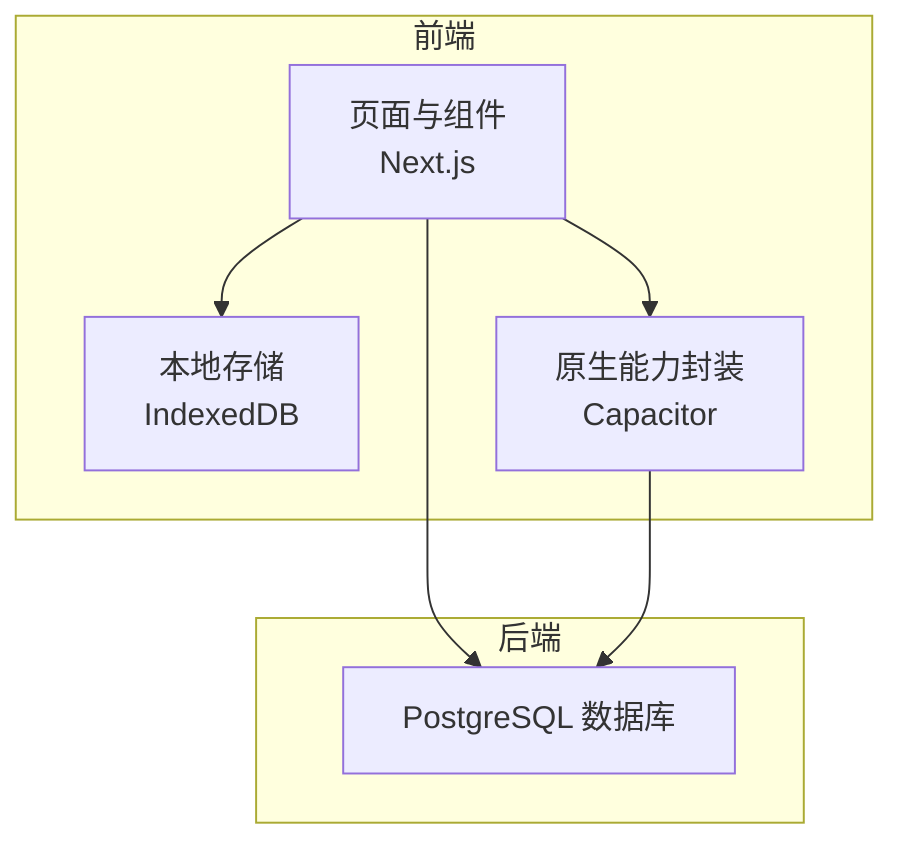
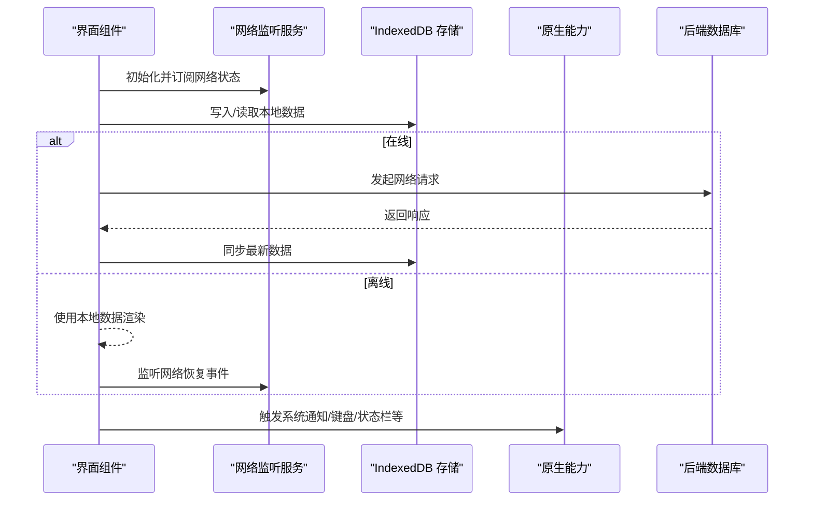
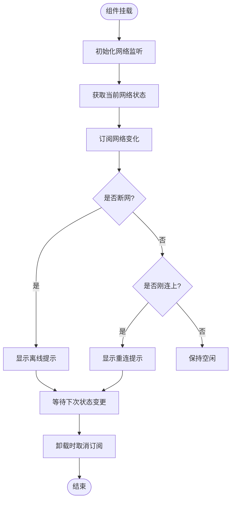
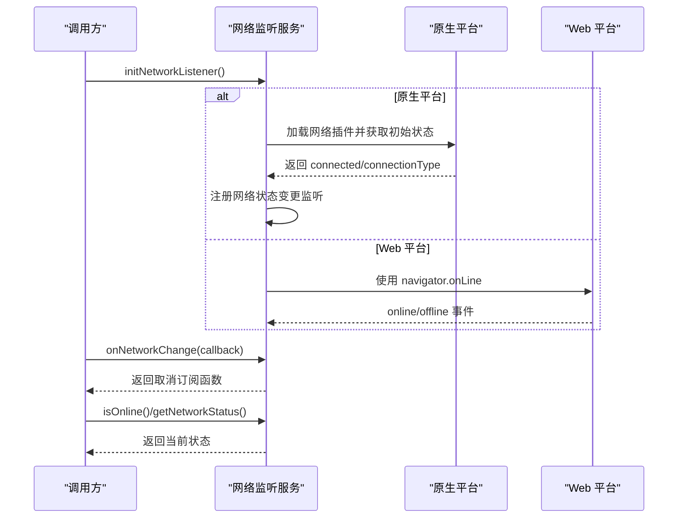
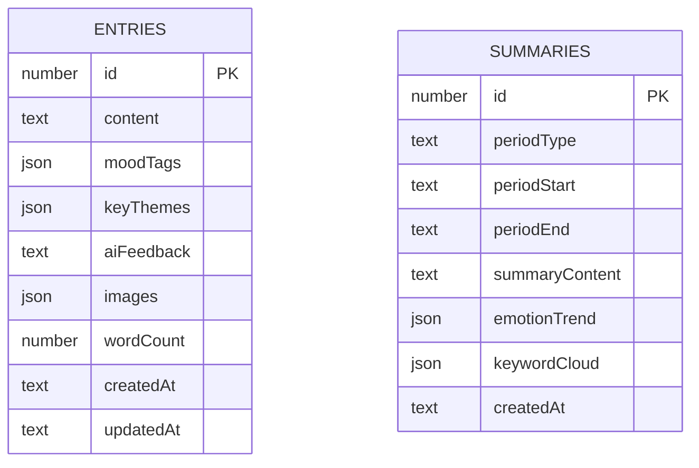
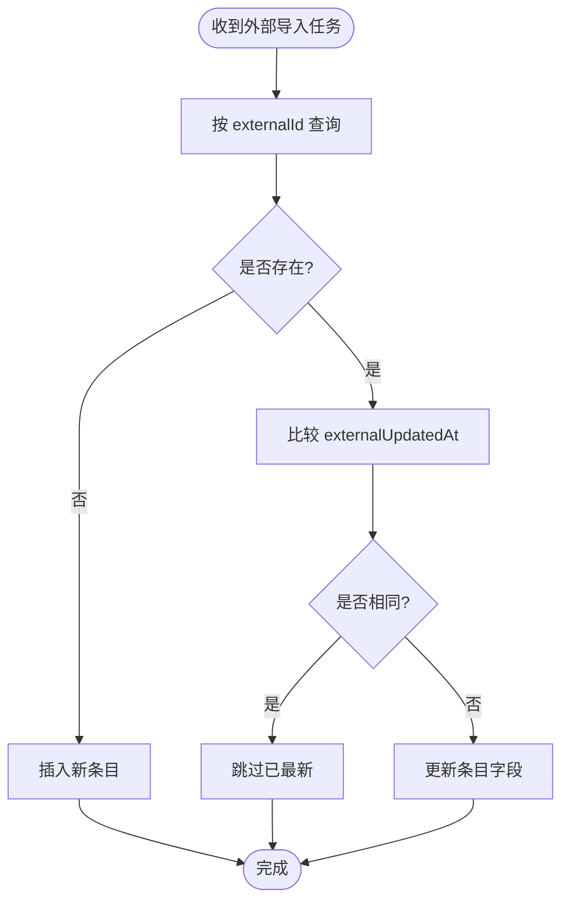
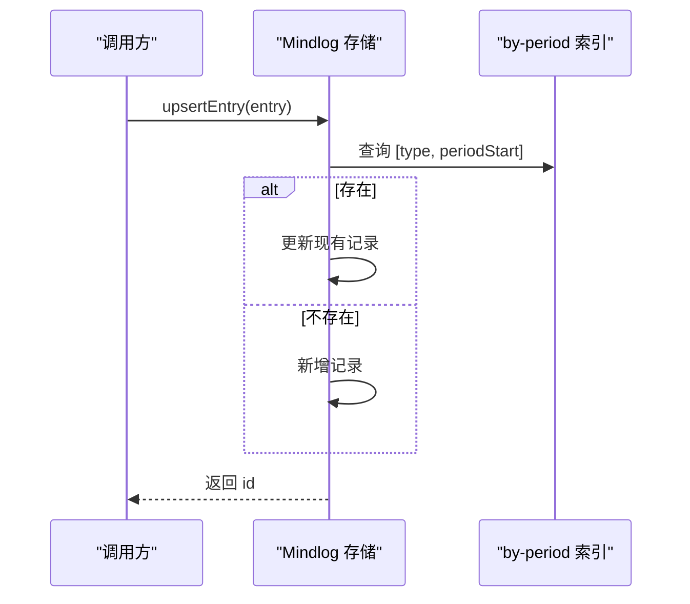
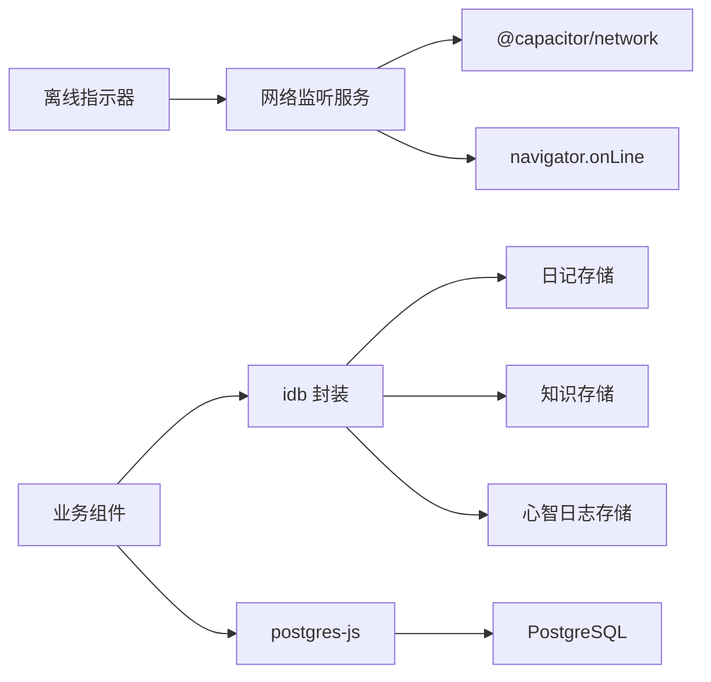

# 离线功能与性能

<cite>
**本文引用的文件**
- [offline-indicator.tsx](file://src/components/shared/offline-indicator.tsx)
- [network.ts](file://src/lib/native/network.ts)
- [diary-store.ts](file://src/lib/storage/diary-store.ts)
- [knowledge-store.ts](file://src/lib/storage/knowledge-store.ts)
- [mindlog-store.ts](file://src/lib/storage/mindlog-store.ts)
- [index.ts](file://src/lib/db/index.ts)
- [index.ts](file://src/lib/db/schema.ts)
- [network_security_config.xml](file://android/app/src/main/res/xml/network_security_config.xml)
- [AndroidManifest.xml](file://android/app/src/main/AndroidManifest.xml)
- [native-init.tsx](file://src/components/native-init.tsx)
- [app-lifecycle.ts](file://src/lib/native/app-lifecycle.ts)
- [haptics.ts](file://src/lib/native/haptics.ts)
- [keyboard.ts](file://src/lib/native/keyboard.ts)
- [notifications.ts](file://src/lib/native/notifications.ts)
- [share.ts](file://src/lib/native/share.ts)
- [status-bar.ts](file://src/lib/native/status-bar.ts)
- [index.ts](file://src/lib/native/index.ts)
</cite>

## 目录
1. [简介](#简介)
2. [项目结构](#项目结构)
3. [核心组件](#核心组件)
4. [架构总览](#架构总览)
5. [详细组件分析](#详细组件分析)
6. [依赖分析](#依赖分析)
7. [性能考虑](#性能考虑)
8. [故障排查指南](#故障排查指南)
9. [结论](#结论)
10. [附录](#附录)

## 简介
本文件聚焦移动端离线能力与性能优化，围绕以下目标展开：
- 离线数据存储策略：基于 IndexedDB 的本地持久化与版本迁移、索引设计与事务处理
- 数据同步机制与冲突解决：基于外部源唯一标识与增量更新的 upsert 策略
- 网络状态检测与离线模式切换：原生 Capacitor 网络插件与 Web 降级方案
- 移动端性能优化：内存管理、电池优化、网络请求优化与原生能力影响评估
- 调试与监控：离线指示器、日志与错误处理最佳实践

## 项目结构
本项目采用 Capacitor 架构，前端以 Next.js 为主，结合原生 Android 能力与 IndexedDB 本地存储。关键目录与职责如下：
- src/lib/storage：各业务域的 IndexedDB 存储层（日记、知识库、心智日志等）
- src/lib/native：原生能力封装（网络、通知、键盘、状态栏等）
- src/components/shared：通用 UI 组件（离线指示器）
- android/app/src/main/res/xml：网络安全配置
- src/lib/db：服务端数据库（PostgreSQL）接入（非离线）

**图表来源**
- [diary-store.ts:1-237](file://src/lib/storage/diary-store.ts#L1-L237)
- [knowledge-store.ts:1-611](file://src/lib/storage/knowledge-store.ts#L1-L611)
- [mindlog-store.ts:1-95](file://src/lib/storage/mindlog-store.ts#L1-L95)
- [network.ts:1-102](file://src/lib/native/network.ts#L1-L102)
- [index.ts:1-11](file://src/lib/db/index.ts#L1-L11)

**章节来源**
- [diary-store.ts:1-237](file://src/lib/storage/diary-store.ts#L1-L237)
- [knowledge-store.ts:1-611](file://src/lib/storage/knowledge-store.ts#L1-L611)
- [mindlog-store.ts:1-95](file://src/lib/storage/mindlog-store.ts#L1-L95)
- [network.ts:1-102](file://src/lib/native/network.ts#L1-L102)
- [index.ts:1-11](file://src/lib/db/index.ts#L1-L11)

## 核心组件
- 离线指示器：显示网络状态变化，提供“离线”与“重连”反馈
- 网络监听服务：原生 Capacitor 网络插件 + Web 降级，统一网络状态 API
- 本地存储层：基于 idb 的 IndexedDB 封装，支持 CRUD、索引、事务与版本升级
- 同步与冲突解决：按外部源唯一标识进行 upsert，避免重复与覆盖

**章节来源**
- [offline-indicator.tsx:1-80](file://src/components/shared/offline-indicator.tsx#L1-L80)
- [network.ts:1-102](file://src/lib/native/network.ts#L1-L102)
- [diary-store.ts:1-237](file://src/lib/storage/diary-store.ts#L1-L237)
- [knowledge-store.ts:1-611](file://src/lib/storage/knowledge-store.ts#L1-L611)
- [mindlog-store.ts:1-95](file://src/lib/storage/mindlog-store.ts#L1-L95)

## 架构总览
下图展示移动端离线与在线两种模式下的数据流与交互。

**图表来源**
- [offline-indicator.tsx:16-79](file://src/components/shared/offline-indicator.tsx#L16-L79)
- [network.ts:32-94](file://src/lib/native/network.ts#L32-L94)
- [diary-store.ts:97-155](file://src/lib/storage/diary-store.ts#L97-L155)
- [knowledge-store.ts:176-269](file://src/lib/storage/knowledge-store.ts#L176-L269)
- [mindlog-store.ts:50-94](file://src/lib/storage/mindlog-store.ts#L50-L94)
- [index.ts:1-11](file://src/lib/db/index.ts#L1-L11)

## 详细组件分析

### 离线指示器组件
- 功能要点
  - 初始化网络监听，获取初始状态
  - 订阅网络变化，区分离线与重连
  - 提供视觉反馈（离线提示与重连提示）
- 交互流程
  - 组件挂载时初始化监听并设置初始状态
  - 收到网络断开事件：标记离线并显示提示
  - 收到网络恢复事件：标记在线并显示“已恢复连接”
  - 卸载时取消订阅，避免内存泄漏

**图表来源**
- [offline-indicator.tsx:21-45](file://src/components/shared/offline-indicator.tsx#L21-L45)

**章节来源**
- [offline-indicator.tsx:1-80](file://src/components/shared/offline-indicator.tsx#L1-L80)

### 网络监听服务
- 设计目标
  - 原生平台使用 Capacitor 网络插件，精确识别 WiFi/蜂窝/无网络
  - Web 平台回退到 navigator.onLine，提供基础在线状态
- 关键点
  - 单例状态与全局监听器数组
  - 初始化时拉取初始状态并注册变更回调
  - 提供查询、订阅与在线判断 API

**图表来源**
- [network.ts:32-94](file://src/lib/native/network.ts#L32-L94)

**章节来源**
- [network.ts:1-102](file://src/lib/native/network.ts#L1-L102)

### 日记本地存储（IndexedDB）
- 数据模型
  - 日记条目与周/月摘要分别存于 entries 与 summaries 对象仓库
  - 通过索引加速按创建时间、情绪标签、周期类型等查询
- 版本迁移
  - 通过 upgrade 回调添加对象仓库与索引，兼容字段扩展
- 事务与一致性
  - 删除条目时同时清理关联链接，使用事务保证一致性
- 查询与分页
  - 支持偏移与限制的分页；按创建时间排序

**图表来源**
- [diary-store.ts:5-26](file://src/lib/storage/diary-store.ts#L5-L26)
- [diary-store.ts:49-79](file://src/lib/storage/diary-store.ts#L49-L79)

**章节来源**
- [diary-store.ts:1-237](file://src/lib/storage/diary-store.ts#L1-L237)

### 知识库本地存储（IndexedDB）
- 数据模型
  - 知识条目、关系链接、主题分类三类对象仓库
  - 外部源唯一标识 externalId 与 externalUpdatedAt 支持增量同步
- 增量 upsert
  - 按 externalId 查找，若 externalUpdatedAt 一致则跳过
  - 否则更新标题、内容、来源信息与更新时间戳
- 图谱与统计
  - 提供图数据生成、标签统计、来源集统计等聚合查询

**图表来源**
- [knowledge-store.ts:209-250](file://src/lib/storage/knowledge-store.ts#L209-L250)

**章节来源**
- [knowledge-store.ts:1-611](file://src/lib/storage/knowledge-store.ts#L1-L611)

### 心智日志本地存储（IndexedDB）
- 数据模型
  - 按周期类型与起始日期建立唯一索引，避免重复
- 写入策略
  - upsert：若同周期存在则更新，否则新增
- 查询策略
  - 按类型或周期范围检索，按创建时间倒序

**图表来源**
- [mindlog-store.ts:84-94](file://src/lib/storage/mindlog-store.ts#L84-L94)

**章节来源**
- [mindlog-store.ts:1-95](file://src/lib/storage/mindlog-store.ts#L1-L95)

### 服务端数据库接入（非离线）
- 连接方式
  - 开发环境使用 postgres.js 驱动
  - 生产环境可切换为 @neondatabase/serverless
- 适用场景
  - 用户认证、统计报表、跨设备同步等需要强一致性的场景

**章节来源**
- [index.ts:1-11](file://src/lib/db/index.ts#L1-L11)

## 依赖分析
- 组件耦合
  - 离线指示器依赖网络监听服务，二者低耦合，便于替换
  - 存储层与业务组件解耦，通过统一接口访问
- 外部依赖
  - idb：IndexedDB 封装，提供对象仓库、索引与事务
  - @capacitor/network：原生网络状态检测
  - postgres/postgres-js：服务端数据库驱动
- 安全与网络
  - Android 网络安全配置允许明文 HTTP（开发阶段）与自定义证书策略

**图表来源**
- [offline-indicator.tsx:1-80](file://src/components/shared/offline-indicator.tsx#L1-L80)
- [network.ts:1-102](file://src/lib/native/network.ts#L1-L102)
- [diary-store.ts:1-237](file://src/lib/storage/diary-store.ts#L1-L237)
- [knowledge-store.ts:1-611](file://src/lib/storage/knowledge-store.ts#L1-L611)
- [mindlog-store.ts:1-95](file://src/lib/storage/mindlog-store.ts#L1-L95)
- [index.ts:1-11](file://src/lib/db/index.ts#L1-L11)

**章节来源**
- [network_security_config.xml](file://android/app/src/main/res/xml/network_security_config.xml)
- [AndroidManifest.xml](file://android/app/src/main/AndroidManifest.xml)

## 性能考虑
- 内存管理
  - 离线指示器在卸载时必须取消网络监听订阅，避免内存泄漏
  - 存储层使用单例数据库实例，减少重复打开连接的开销
- 电池优化
  - 避免频繁轮询网络状态，使用原生事件驱动
  - 合理安排后台同步任务，降低唤醒频率
- 网络请求优化
  - 使用增量 upsert 减少无效写入
  - 批量读取与懒加载，避免一次性加载大量数据
- 原生能力影响
  - 原生网络监听比 Web API 更稳定，建议优先使用
  - 其他原生能力（通知、键盘、状态栏）按需调用，避免不必要的系统交互

**章节来源**
- [offline-indicator.tsx:42-45](file://src/components/shared/offline-indicator.tsx#L42-L45)
- [network.ts:36-62](file://src/lib/native/network.ts#L36-L62)
- [knowledge-store.ts:221-250](file://src/lib/storage/knowledge-store.ts#L221-L250)

## 故障排查指南
- 离线指示器不显示或闪烁
  - 检查网络监听初始化是否成功
  - 确认订阅回调是否被正确触发与取消
- 网络状态不准确
  - 原生平台检查 Capacitor 网络插件是否可用
  - Web 平台检查 navigator.onLine 是否返回预期值
- IndexedDB 写入失败或版本升级阻塞
  - 查看 blocked 回调日志，确认是否有其他标签页持有旧版本数据库
  - 确保事务正确提交，避免部分写入
- 同步冲突或重复
  - 检查外部源唯一标识与增量时间戳是否正确传递
  - 确认 upsert 流程中比较逻辑是否一致

**章节来源**
- [network.ts:76-78](file://src/lib/native/network.ts#L76-L78)
- [diary-store.ts:76-79](file://src/lib/storage/diary-store.ts#L76-L79)
- [knowledge-store.ts:233-240](file://src/lib/storage/knowledge-store.ts#L233-L240)

## 结论
本项目通过原生网络监听与 IndexedDB 本地存储，实现了移动端可靠的离线体验，并以外部源唯一标识与增量 upsert 机制保障了数据同步的一致性。配合合理的内存与电池优化策略，可在保证用户体验的同时降低系统资源消耗。建议在生产环境中进一步完善错误监控与性能指标采集，持续优化同步策略与 UI 响应。

## 附录
- 原生能力一览（与性能相关）
  - 应用生命周期：控制后台任务与资源释放
  - 触觉反馈：减少不必要的交互提示
  - 键盘：避免过度弹出导致布局抖动
  - 通知：合理安排推送时机
  - 分享与状态栏：按需调用，避免频繁刷新

**章节来源**
- [native-init.tsx](file://src/components/native-init.tsx)
- [app-lifecycle.ts](file://src/lib/native/app-lifecycle.ts)
- [haptics.ts](file://src/lib/native/haptics.ts)
- [keyboard.ts](file://src/lib/native/keyboard.ts)
- [notifications.ts](file://src/lib/native/notifications.ts)
- [share.ts](file://src/lib/native/share.ts)
- [status-bar.ts](file://src/lib/native/status-bar.ts)
- [index.ts](file://src/lib/native/index.ts)