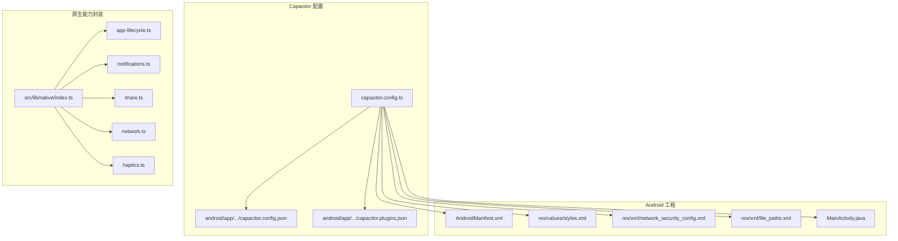
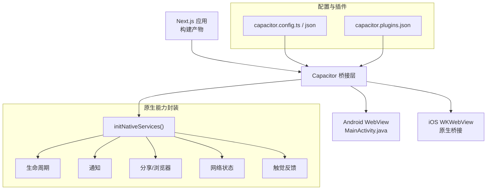
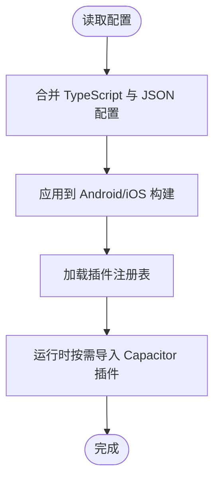
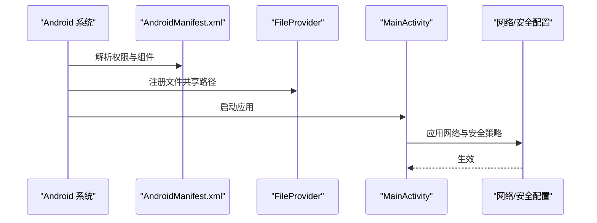
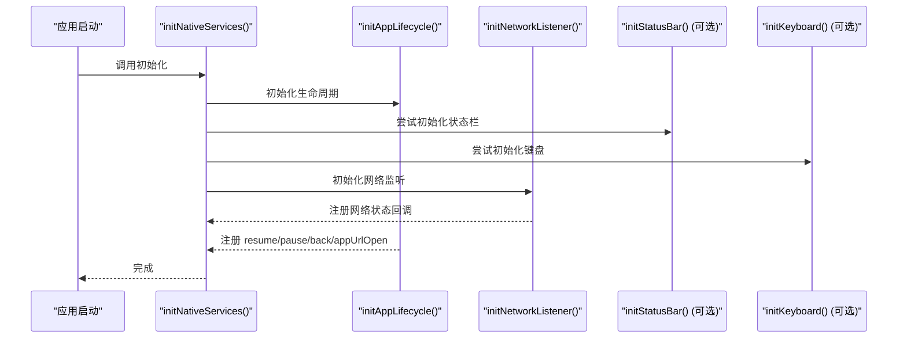
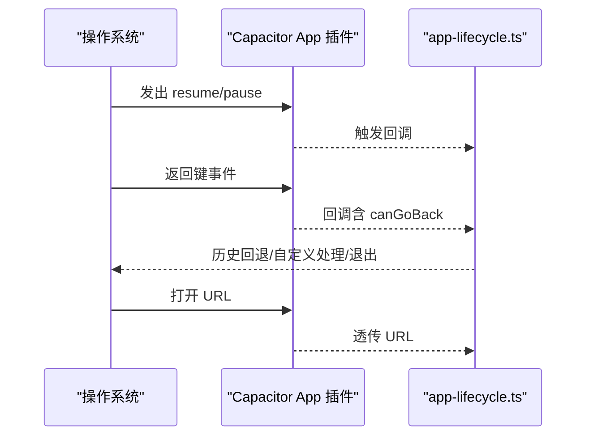
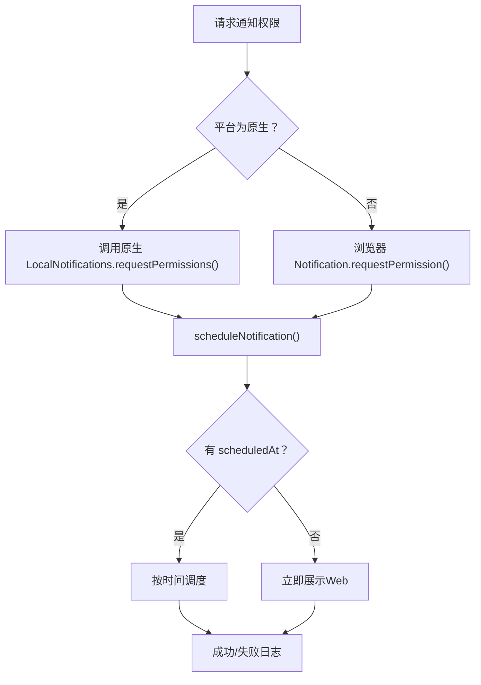
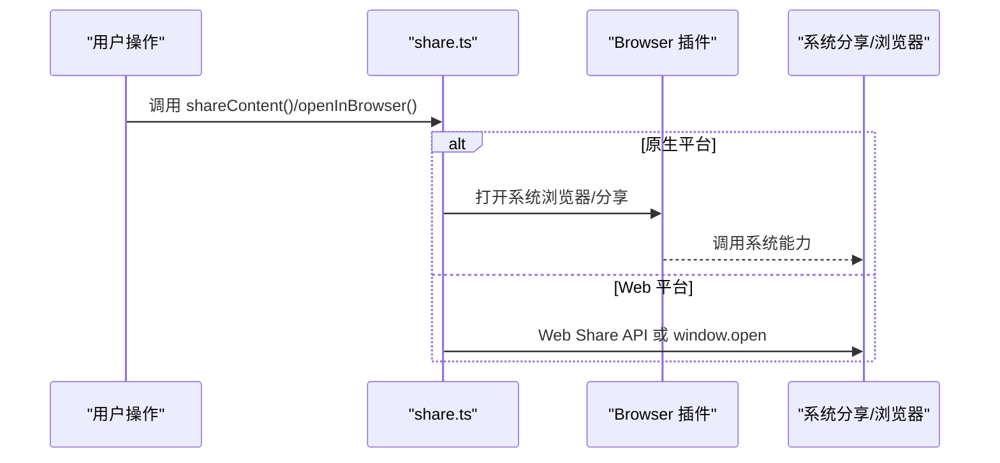
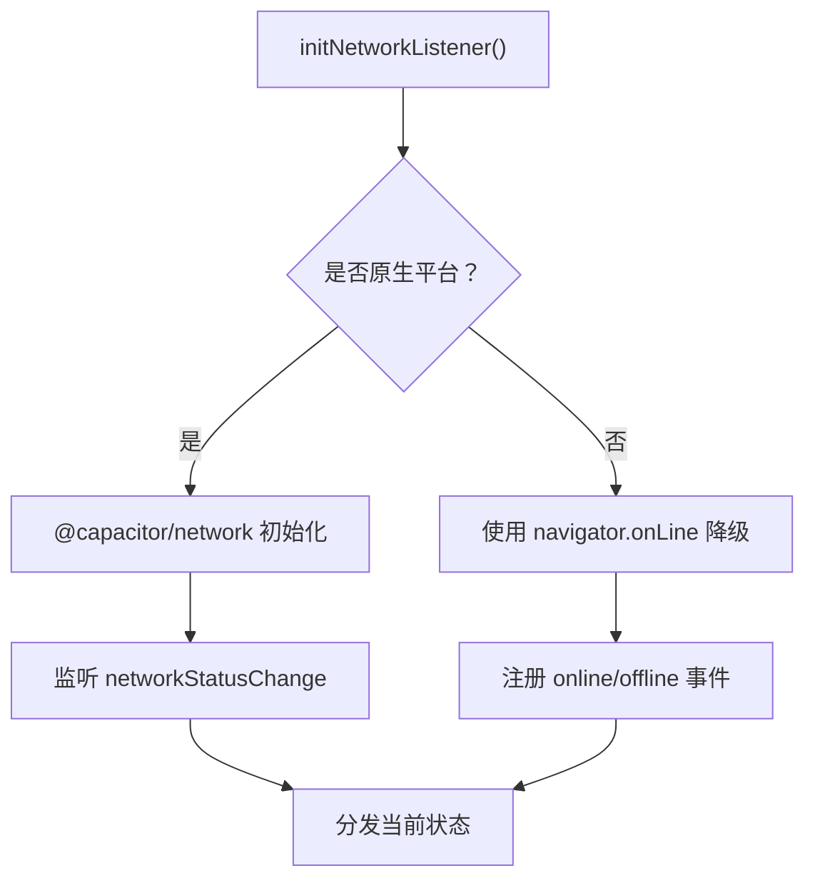
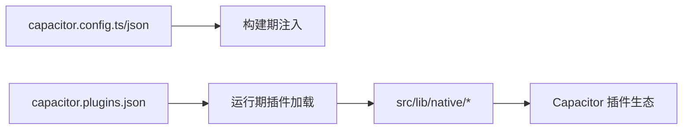

# 移动端集成

<cite>
**本文引用的文件**
- [capacitor.config.ts](file://capacitor.config.ts)
- [capacitor.config.json](file://android/app/src/main/assets/capacitor.config.json)
- [capacitor.plugins.json](file://android/app/src/main/assets/capacitor.plugins.json)
- [MainActivity.java](file://android/app/src/main/java/com/mindos/app/MainActivity.java)
- [AndroidManifest.xml](file://android/app/src/main/AndroidManifest.xml)
- [styles.xml](file://android/app/src/main/res/values/styles.xml)
- [network_security_config.xml](file://android/app/src/main/res/xml/network_security_config.xml)
- [file_paths.xml](file://android/app/src/main/res/xml/file_paths.xml)
- [native/index.ts](file://src/lib/native/index.ts)
- [app-lifecycle.ts](file://src/lib/native/app-lifecycle.ts)
- [notifications.ts](file://src/lib/native/notifications.ts)
- [share.ts](file://src/lib/native/share.ts)
- [network.ts](file://src/lib/native/network.ts)
- [haptics.ts](file://src/lib/native/haptics.ts)
</cite>

## 目录
1. [简介](#简介)
2. [项目结构](#项目结构)
3. [核心组件](#核心组件)
4. [架构总览](#架构总览)
5. [详细组件分析](#详细组件分析)
6. [依赖关系分析](#依赖关系分析)
7. [性能考量](#性能考量)
8. [故障排查指南](#故障排查指南)
9. [结论](#结论)
10. [附录](#附录)

## 简介
本文件面向移动端集成工程师与产品团队，系统化阐述 life-os 在 Capacitor 框架下的移动端实现与最佳实践。内容覆盖：
- Capacitor 配置与插件体系
- Android/iOS 平台差异与兼容性处理
- 原生能力封装（通知、分享、网络、触觉反馈、键盘、状态栏）
- 权限管理与原生 API 使用
- 移动端用户体验设计要点（手势、键盘适配、屏幕适配）
- 离线能力与性能优化策略
- 调试技巧与常见问题解决

## 项目结构
移动端相关的关键位置与职责如下：
- Capacitor 核心配置：用于定义应用 ID、应用名、服务器地址、平台特定参数与插件配置
- Android 工程：包含清单文件、资源文件、桥接 Activity 以及插件注册清单
- 原生能力封装层：以模块化方式导出统一初始化入口与各原生能力接口

**图表来源**
- [capacitor.config.ts:1-37](file://capacitor.config.ts#L1-L37)
- [capacitor.config.json:1-30](file://android/app/src/main/assets/capacitor.config.json#L1-L30)
- [capacitor.plugins.json:1-39](file://android/app/src/main/assets/capacitor.plugins.json#L1-L39)
- [MainActivity.java:1-6](file://android/app/src/main/java/com/mindos/app/MainActivity.java#L1-L6)
- [AndroidManifest.xml:1-53](file://android/app/src/main/AndroidManifest.xml#L1-L53)
- [styles.xml:1-22](file://android/app/src/main/res/values/styles.xml#L1-L22)
- [network_security_config.xml:1-17](file://android/app/src/main/res/xml/network_security_config.xml#L1-L17)
- [file_paths.xml:1-5](file://android/app/src/main/res/xml/file_paths.xml#L1-L5)
- [native/index.ts:1-55](file://src/lib/native/index.ts#L1-L55)

**章节来源**
- [capacitor.config.ts:1-37](file://capacitor.config.ts#L1-L37)
- [capacitor.config.json:1-30](file://android/app/src/main/assets/capacitor.config.json#L1-L30)
- [capacitor.plugins.json:1-39](file://android/app/src/main/assets/capacitor.plugins.json#L1-L39)
- [MainActivity.java:1-6](file://android/app/src/main/java/com/mindos/app/MainActivity.java#L1-L6)
- [AndroidManifest.xml:1-53](file://android/app/src/main/AndroidManifest.xml#L1-L53)
- [styles.xml:1-22](file://android/app/src/main/res/values/styles.xml#L1-L22)
- [network_security_config.xml:1-17](file://android/app/src/main/res/xml/network_security_config.xml#L1-L17)
- [file_paths.xml:1-5](file://android/app/src/main/res/xml/file_paths.xml#L1-L5)
- [native/index.ts:1-55](file://src/lib/native/index.ts#L1-L55)

## 核心组件
- 统一初始化入口：在应用启动时检测平台并按需初始化各类原生服务
- 生命周期管理：前台/后台切换、返回键行为、深度链接
- 通知系统：权限申请、定时/立即通知、取消与清空
- 分享与浏览器：系统分享面板、外部浏览器打开
- 网络状态：原生精确检测与 Web 降级
- 触觉反馈：三类风格的触觉反馈
- 键盘与状态栏：按需初始化（由统一入口条件加载）

**章节来源**
- [native/index.ts:1-55](file://src/lib/native/index.ts#L1-L55)
- [app-lifecycle.ts:1-98](file://src/lib/native/app-lifecycle.ts#L1-L98)
- [notifications.ts:1-110](file://src/lib/native/notifications.ts#L1-L110)
- [share.ts:1-72](file://src/lib/native/share.ts#L1-L72)
- [network.ts:1-102](file://src/lib/native/network.ts#L1-L102)
- [haptics.ts:1-69](file://src/lib/native/haptics.ts#L1-L69)

## 架构总览
Capacitor 在本项目中的角色是将 Next.js 构建产物嵌入原生 WebView，并通过官方与社区插件扩展原生能力。配置层同时维护 TypeScript 与 JSON 两套定义，确保开发与打包阶段的一致性。

**图表来源**
- [capacitor.config.ts:1-37](file://capacitor.config.ts#L1-L37)
- [capacitor.config.json:1-30](file://android/app/src/main/assets/capacitor.config.json#L1-L30)
- [capacitor.plugins.json:1-39](file://android/app/src/main/assets/capacitor.plugins.json#L1-L39)
- [MainActivity.java:1-6](file://android/app/src/main/java/com/mindos/app/MainActivity.java#L1-L6)
- [native/index.ts:1-55](file://src/lib/native/index.ts#L1-L55)

## 详细组件分析

### 配置与插件系统
- 配置项要点
  - 应用标识与名称、WebView 加载策略（静态导出目录或远程服务器）
  - 服务器参数：URL、明文通信、Android Scheme、User-Agent 追加
  - 平台特定：iOS 内边距与自定义 Scheme；Android 背景色与混合内容策略
  - 插件：启动屏配置（自动隐藏、背景色、全屏沉浸等）
- 插件注册
  - 通过 JSON 明确声明已启用插件及其 Java 类路径，便于打包期校验与运行期加载

**图表来源**
- [capacitor.config.ts:1-37](file://capacitor.config.ts#L1-L37)
- [capacitor.config.json:1-30](file://android/app/src/main/assets/capacitor.config.json#L1-L30)
- [capacitor.plugins.json:1-39](file://android/app/src/main/assets/capacitor.plugins.json#L1-L39)

**章节来源**
- [capacitor.config.ts:1-37](file://capacitor.config.ts#L1-L37)
- [capacitor.config.json:1-30](file://android/app/src/main/assets/capacitor.config.json#L1-L30)
- [capacitor.plugins.json:1-39](file://android/app/src/main/assets/capacitor.plugins.json#L1-L39)

### Android 平台实现
- 清单与权限
  - 关键权限：网络、振动、开机广播、精确闹钟、存储读取（含媒体图片）
  - 兼容性：针对不同 SDK 版本的存储权限差异
- 安全与网络
  - 明文流量开关与网络信任配置，开发环境允许局域网直连
  - 文件共享通过 FileProvider 与路径映射
- 启动主题与启动屏
  - Splash Screen 主题与样式资源，配合 Capacitor 启动屏插件
- 活动与配置变更
  - MainActivity 单任务模式与多配置变更项，保证横竖屏与系统设置变化下的稳定性

**图表来源**
- [AndroidManifest.xml:1-53](file://android/app/src/main/AndroidManifest.xml#L1-L53)
- [network_security_config.xml:1-17](file://android/app/src/main/res/xml/network_security_config.xml#L1-L17)
- [file_paths.xml:1-5](file://android/app/src/main/res/xml/file_paths.xml#L1-L5)
- [styles.xml:1-22](file://android/app/src/main/res/values/styles.xml#L1-L22)
- [MainActivity.java:1-6](file://android/app/src/main/java/com/mindos/app/MainActivity.java#L1-L6)

**章节来源**
- [AndroidManifest.xml:1-53](file://android/app/src/main/AndroidManifest.xml#L1-L53)
- [network_security_config.xml:1-17](file://android/app/src/main/res/xml/network_security_config.xml#L1-L17)
- [file_paths.xml:1-5](file://android/app/src/main/res/xml/file_paths.xml#L1-L5)
- [styles.xml:1-22](file://android/app/src/main/res/values/styles.xml#L1-L22)
- [MainActivity.java:1-6](file://android/app/src/main/java/com/mindos/app/MainActivity.java#L1-L6)

### iOS 平台实现
- 自定义 Scheme 与内容 inset
  - 通过配置为 iOS 设定自定义 URL Scheme 与安全的内容 inset 行为
- 与 Android 的差异
  - iOS 不涉及 FileProvider 与明文网络配置
  - 保持一致的服务器与插件策略，确保跨平台体验一致性

**章节来源**
- [capacitor.config.ts:16-19](file://capacitor.config.ts#L16-L19)
- [capacitor.config.json:11-14](file://android/app/src/main/assets/capacitor.config.json#L11-L14)

### 原生能力封装与使用

#### 统一初始化入口
- 功能：在应用启动时检测是否为原生平台，若是则按序初始化生命周期、状态栏、键盘、网络监听等
- 设计：延迟导入各模块，避免 Web 环境无意义开销；对可选插件（如 status-bar、keyboard）进行容错

**图表来源**
- [native/index.ts:19-54](file://src/lib/native/index.ts#L19-L54)
- [app-lifecycle.ts:31-66](file://src/lib/native/app-lifecycle.ts#L31-L66)
- [network.ts:32-62](file://src/lib/native/network.ts#L32-L62)

**章节来源**
- [native/index.ts:1-55](file://src/lib/native/index.ts#L1-L55)

#### 应用生命周期
- 监听 resume/pause、Android 返回键、深度链接
- 返回键策略：若可回退则历史回退，否则触发自定义回调，最后再无可退则退出应用
- 深度链接：透传 URL 至注册的回调集合

**图表来源**
- [app-lifecycle.ts:31-66](file://src/lib/native/app-lifecycle.ts#L31-L66)

**章节来源**
- [app-lifecycle.ts:1-98](file://src/lib/native/app-lifecycle.ts#L1-L98)

#### 本地通知
- 权限：原生平台请求权限，Web 平台使用浏览器 Notification API
- 调度：支持定时触发与立即展示（Web），失败时静默记录日志
- 取消：按 ID 取消或清空所有待发通知

**图表来源**
- [notifications.ts:24-78](file://src/lib/native/notifications.ts#L24-L78)

**章节来源**
- [notifications.ts:1-110](file://src/lib/native/notifications.ts#L1-L110)

#### 分享与外部浏览器
- 外部浏览器：原生 Browser 插件在系统浏览器中打开，失败则回退至 window.open
- 系统分享：原生 Share 插件，失败回退到 Web Share API，最终回退到剪贴板复制

**图表来源**
- [share.ts:14-27](file://src/lib/native/share.ts#L14-L27)
- [share.ts:32-71](file://src/lib/native/share.ts#L32-L71)

**章节来源**
- [share.ts:1-72](file://src/lib/native/share.ts#L1-L72)

#### 网络状态监听
- 原生：@capacitor/network 精确区分 WiFi/蜂窝/断开
- Web：navigator.onLine 降级，注册 online/offline 事件
- 订阅：提供回调注册与取消订阅，返回当前状态快照

**图表来源**
- [network.ts:32-82](file://src/lib/native/network.ts#L32-L82)

**章节来源**
- [network.ts:1-102](file://src/lib/native/network.ts#L1-L102)

#### 触觉反馈
- 三类反馈：冲击、通知（成功/警告/错误）、选择（滚动选择）
- 原生平台映射到对应 Impact/Notification/Selection API，失败静默

**章节来源**
- [haptics.ts:1-69](file://src/lib/native/haptics.ts#L1-L69)

## 依赖关系分析
- 配置与构建
  - TypeScript 配置与 JSON 配置相互补充，确保开发与打包一致性
  - 插件注册 JSON 明确列出启用插件，避免遗漏
- 运行时依赖
  - 原生能力封装层按需动态导入插件，降低 Web 端开销
  - 对可选插件（status-bar、keyboard）采用 try/catch 容错

**图表来源**
- [capacitor.config.ts:1-37](file://capacitor.config.ts#L1-L37)
- [capacitor.config.json:1-30](file://android/app/src/main/assets/capacitor.config.json#L1-L30)
- [capacitor.plugins.json:1-39](file://android/app/src/main/assets/capacitor.plugins.json#L1-L39)
- [native/index.ts:19-54](file://src/lib/native/index.ts#L19-L54)

**章节来源**
- [capacitor.config.ts:1-37](file://capacitor.config.ts#L1-L37)
- [capacitor.config.json:1-30](file://android/app/src/main/assets/capacitor.config.json#L1-L30)
- [capacitor.plugins.json:1-39](file://android/app/src/main/assets/capacitor.plugins.json#L1-L39)
- [native/index.ts:1-55](file://src/lib/native/index.ts#L1-L55)

## 性能考量
- 启动屏与首屏
  - 启动屏插件配置与启动主题配合，减少白屏感知
- 网络与缓存
  - 原生网络插件可区分连接类型，结合业务逻辑做降级与重试策略
  - 服务端 UA 识别 MindOS-App，便于后端分流与缓存策略
- 动态导入
  - 原生能力封装层采用动态 import，仅在原生平台加载，避免 Web 端无谓开销
- 资源与布局
  - Android 多密度资源与启动主题，提升首屏体验与一致性

**章节来源**
- [capacitor.config.ts:24-33](file://capacitor.config.ts#L24-L33)
- [styles.xml:19-21](file://android/app/src/main/res/values/styles.xml#L19-L21)
- [native/index.ts:19-54](file://src/lib/native/index.ts#L19-L54)

## 故障排查指南
- 无法加载远程服务器页面
  - 检查服务器 URL 与明文通信配置，确认开发机 IP 在网络配置允许范围内
  - Android 清理缓存与重启应用，确认 UA 追加生效
- 通知无法显示或权限被拒绝
  - 调用权限请求流程，确认平台分支正确
  - 查看原生日志，定位插件加载失败原因
- 分享/浏览器打开失败
  - 原生分支回退到 Web API，检查浏览器支持与权限
- 网络状态异常
  - 原生插件初始化失败时会降级到 Web API，确认事件绑定与回调注册
- 启动黑屏或白屏
  - 检查启动主题与启动屏配置，确保资源存在且命名一致

**章节来源**
- [network_security_config.xml:8-16](file://android/app/src/main/res/xml/network_security_config.xml#L8-L16)
- [capacitor.config.ts:7-15](file://capacitor.config.ts#L7-L15)
- [notifications.ts:24-41](file://src/lib/native/notifications.ts#L24-L41)
- [share.ts:14-27](file://src/lib/native/share.ts#L14-L27)
- [network.ts:32-62](file://src/lib/native/network.ts#L32-L62)
- [styles.xml:19-21](file://android/app/src/main/res/values/styles.xml#L19-L21)

## 结论
本项目通过清晰的配置与模块化封装，实现了 Capacitor 在 Android/iOS 上的稳定运行与原生能力扩展。统一初始化入口与按需动态导入策略有效降低了平台差异带来的复杂度，同时保留了 Web 平台的兼容性。建议在后续迭代中持续完善权限引导、网络降级策略与调试工具链，以进一步提升移动端体验与可靠性。

## 附录
- 开发与调试建议
  - 使用 Capacitor CLI 进行预览与调试，关注插件加载日志
  - 在 Android Studio 中查看原生日志，定位原生分支问题
  - 使用浏览器开发者工具检查 Web 降级分支行为
- 最佳实践
  - 将平台判断与能力检测前置，尽早暴露“不可用”状态
  - 对可选能力进行容错与优雅降级，保证最小可用体验
  - 严格区分“原生能力”与“Web 能力”，避免混用导致不可预期行为