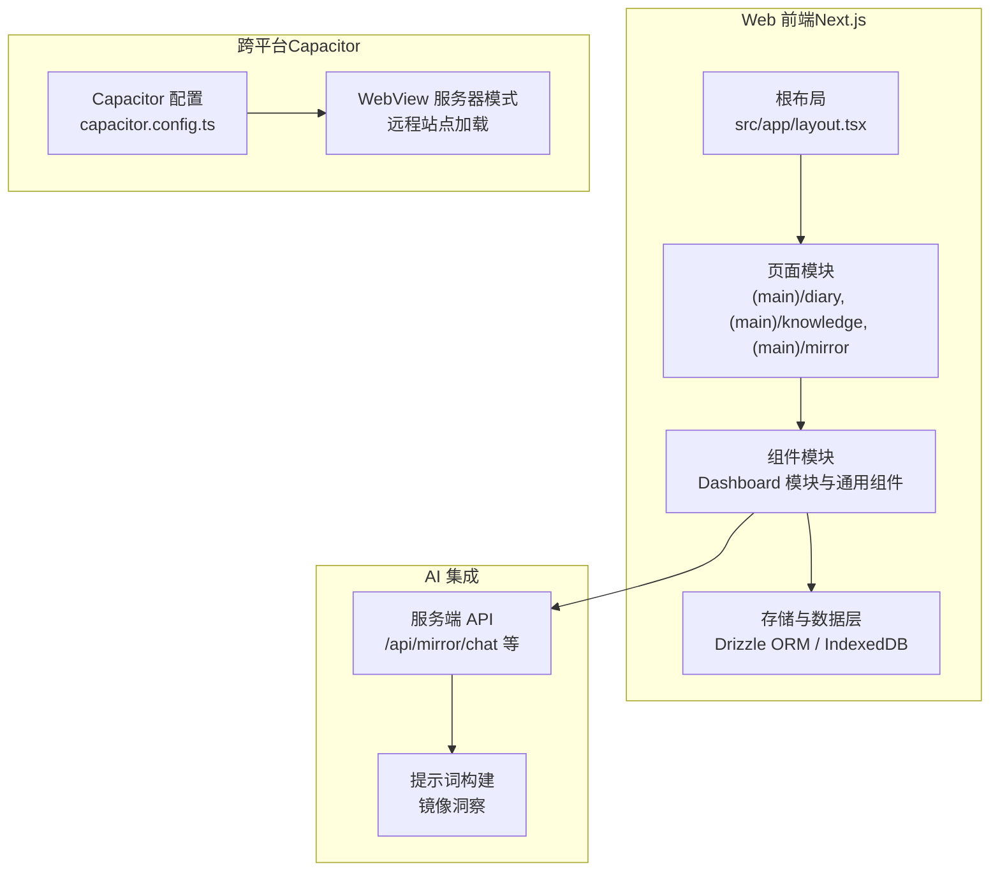
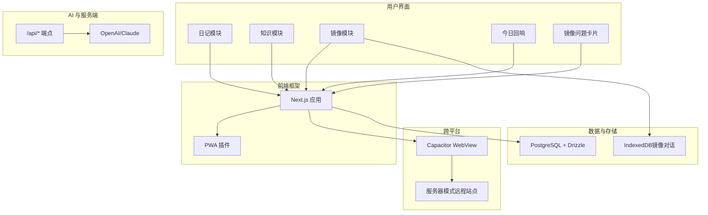
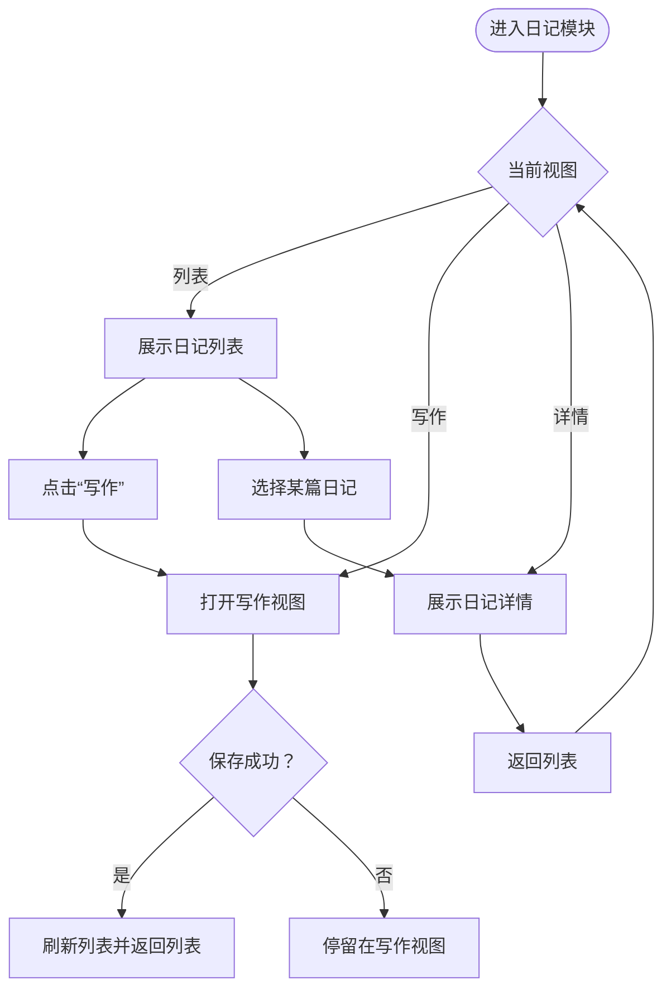
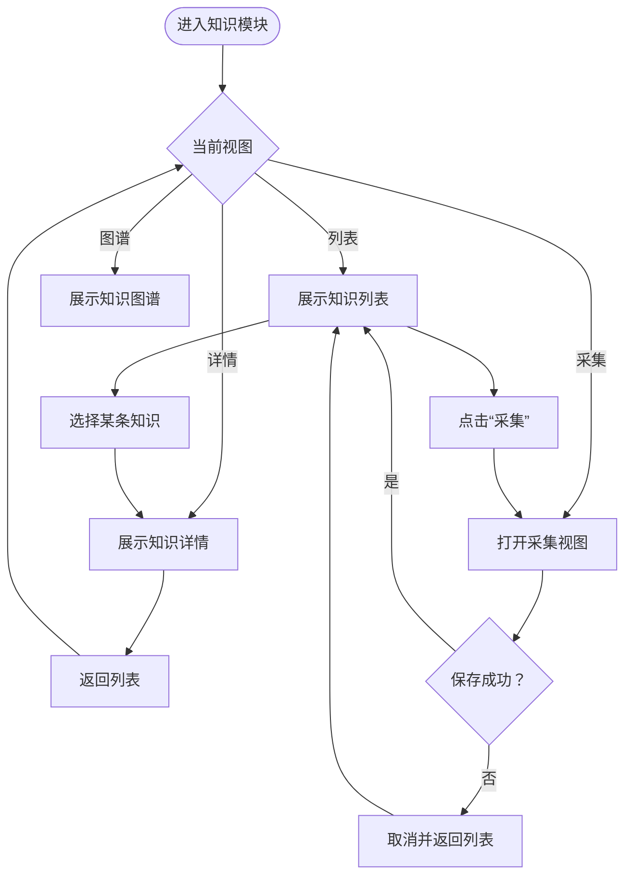
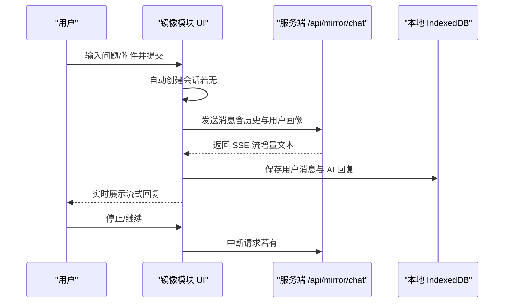
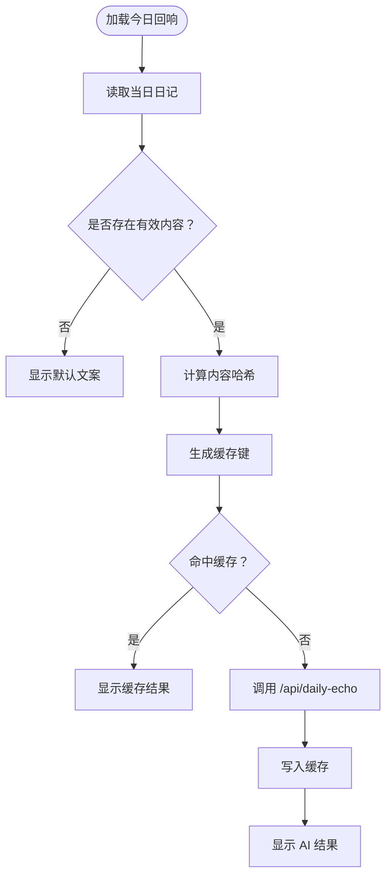
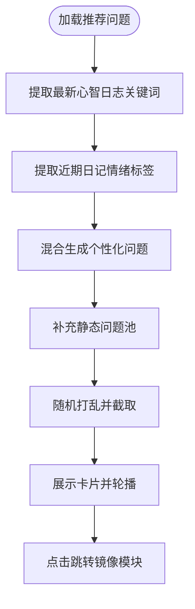
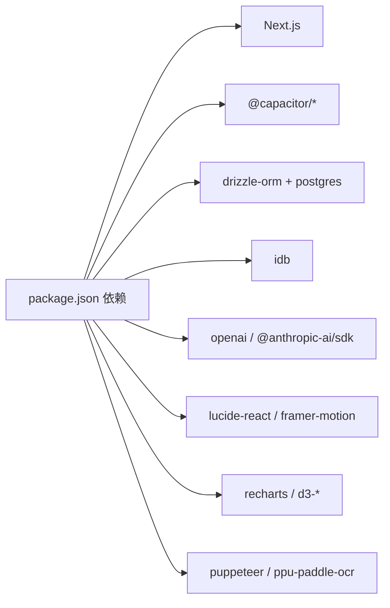

# 项目概述

<cite>
**本文引用的文件**
- [package.json](file://package.json)
- [DESIGN.md](file://DESIGN.md)
- [src/app/layout.tsx](file://src/app/layout.tsx)
- [capacitor.config.ts](file://capacitor.config.ts)
- [next.config.js](file://next.config.js)
- [src/components/dashboard/module-diary.tsx](file://src/components/dashboard/module-diary.tsx)
- [src/components/dashboard/module-knowledge.tsx](file://src/components/dashboard/module-knowledge.tsx)
- [src/components/dashboard/module-mirror.tsx](file://src/components/dashboard/module-mirror.tsx)
- [src/components/dashboard/daily-echo.tsx](file://src/components/dashboard/daily-echo.tsx)
- [src/components/dashboard/mirror-question-card.tsx](file://src/components/dashboard/mirror-question-card.tsx)
- [src/lib/storage/mirror-store.ts](file://src/lib/storage/mirror-store.ts)
- [src/lib/db/index.ts](file://src/lib/db/index.ts)
</cite>

## 目录
1. [简介](#简介)
2. [项目结构](#项目结构)
3. [核心组件](#核心组件)
4. [架构总览](#架构总览)
5. [详细组件分析](#详细组件分析)
6. [依赖分析](#依赖分析)
7. [性能考虑](#性能考虑)
8. [故障排查指南](#故障排查指南)
9. [结论](#结论)
10. [附录](#附录)

## 简介
MindOS（心智系统）是一个以“安静写意”为定位的个人心智管理系统，旨在帮助用户进行日常成长管理，覆盖日记记录、知识管理、心智反思与洞察等核心场景。系统采用 Next.js 构建前端与服务端能力，结合 Capacitor 实现跨平台原生体验，并通过 AI 驱动的智能洞察增强用户的自我觉察与持续改进。

- 核心使命：以温和、治愈的设计语言与流畅交互，陪伴用户在日常中沉淀心智、记录成长、获得洞见。
- 设计理念：诗意排版、治愈色调、呼吸留白；强调轻量、自然、可持续的使用节奏。
- 技术路线：Web 前端（Next.js）、跨平台（Capacitor）、数据库（PostgreSQL/Drizzle）、AI 集成（OpenAI/Claude）、离线存储（IndexedDB）。

## 项目结构
本项目采用“功能域 + 层次化”的组织方式：
- 应用入口与全局样式：根目录下的元数据配置、PWA 配置与全局样式入口。
- 页面与路由：src/app 下按功能域划分（如 (main)/diary、(main)/knowledge、(main)/mirror 等）。
- 组件与模块：src/components 下包含可复用 UI 组件与仪表盘模块（如 ModuleDiary、ModuleKnowledge、ModuleMirror）。
- 存储与数据层：src/lib 下包含数据库访问（Drizzle）、本地存储（IndexedDB）、AI 提示词构建等。
- 跨平台配置：capacitor.config.ts 定义 WebView 服务器模式、插件与启动页等。

图表来源
- [src/app/layout.tsx:1-32](file://src/app/layout.tsx#L1-L32)
- [capacitor.config.ts:1-37](file://capacitor.config.ts#L1-L37)

章节来源
- [src/app/layout.tsx:1-32](file://src/app/layout.tsx#L1-L32)
- [capacitor.config.ts:1-37](file://capacitor.config.ts#L1-L37)
- [next.config.js:1-32](file://next.config.js#L1-L32)

## 核心组件
- 日记模块（ModuleDiary）
  - 支持列表、写作、详情三种视图，通过状态机切换与刷新机制保证数据一致性。
  - 关键路径：[src/components/dashboard/module-diary.tsx](file://src/components/dashboard/module-diary.tsx)
- 知识模块（ModuleKnowledge）
  - 支持列表、采集、详情、知识图谱四种视图，具备跨组件导航事件与持久化列表状态的能力。
  - 关键路径：[src/components/dashboard/module-knowledge.tsx](file://src/components/dashboard/module-knowledge.tsx)
- 镜像模块（ModuleMirror）
  - 对话式心智反思，支持图片/文件附件、流式响应、会话管理与本地存储。
  - 关键路径：[src/components/dashboard/module-mirror.tsx](file://src/components/dashboard/module-mirror.tsx)
- 今日回响（DailyEcho）
  - 基于当日日记内容，调用 AI 生成一句精选语句，并做本地缓存以控制成本。
  - 关键路径：[src/components/dashboard/daily-echo.tsx](file://src/components/dashboard/daily-echo.tsx)
- 镜像问题卡片（MirrorQuestionCard）
  - 基于用户画像与近期日记/心智日志动态生成推荐问题，驱动用户进入镜像反思。
  - 关键路径：[src/components/dashboard/mirror-question-card.tsx](file://src/components/dashboard/mirror-question-card.tsx)

章节来源
- [src/components/dashboard/module-diary.tsx:1-53](file://src/components/dashboard/module-diary.tsx#L1-L53)
- [src/components/dashboard/module-knowledge.tsx:1-95](file://src/components/dashboard/module-knowledge.tsx#L1-L95)
- [src/components/dashboard/module-mirror.tsx:1-590](file://src/components/dashboard/module-mirror.tsx#L1-L590)
- [src/components/dashboard/daily-echo.tsx:1-114](file://src/components/dashboard/daily-echo.tsx#L1-L114)
- [src/components/dashboard/mirror-question-card.tsx:1-166](file://src/components/dashboard/mirror-question-card.tsx#L1-L166)

## 架构总览
MindOS 采用“Web 前端 + 跨平台容器 + 服务端 API + AI 洞察”的分层架构：
- Web 前端：Next.js 提供页面路由、SSR/CSR、静态导出与 PWA 能力。
- 跨平台容器：Capacitor 以 WebView 加载远程站点，实现统一的原生体验。
- 数据层：Drizzle-ORM 连接 PostgreSQL；本地 IndexedDB 用于镜像对话等离线场景。
- AI 集成：通过服务端 API 调用 OpenAI/Claude，结合提示词工程实现智能洞察。
- 设计与交互：基于 DESIGN.md 的设计规范，确保一致的视觉与动效体验。

图表来源
- [src/components/dashboard/module-diary.tsx:1-53](file://src/components/dashboard/module-diary.tsx#L1-L53)
- [src/components/dashboard/module-knowledge.tsx:1-95](file://src/components/dashboard/module-knowledge.tsx#L1-L95)
- [src/components/dashboard/module-mirror.tsx:1-590](file://src/components/dashboard/module-mirror.tsx#L1-L590)
- [src/components/dashboard/daily-echo.tsx:1-114](file://src/components/dashboard/daily-echo.tsx#L1-L114)
- [src/components/dashboard/mirror-question-card.tsx:1-166](file://src/components/dashboard/mirror-question-card.tsx#L1-L166)
- [capacitor.config.ts:1-37](file://capacitor.config.ts#L1-L37)
- [src/lib/db/index.ts:1-11](file://src/lib/db/index.ts#L1-L11)
- [src/lib/storage/mirror-store.ts:1-155](file://src/lib/storage/mirror-store.ts#L1-L155)

## 详细组件分析

### 日记模块（ModuleDiary）
- 视图切换：列表、写作、详情三态，通过刷新键与选中项状态联动。
- 交互流程：从列表到详情再到返回列表，保存后触发刷新，确保数据一致性。
- 关键实现参考：[src/components/dashboard/module-diary.tsx](file://src/components/dashboard/module-diary.tsx)

图表来源
- [src/components/dashboard/module-diary.tsx:14-52](file://src/components/dashboard/module-diary.tsx#L14-L52)

章节来源
- [src/components/dashboard/module-diary.tsx:1-53](file://src/components/dashboard/module-diary.tsx#L1-L53)

### 知识模块（ModuleKnowledge）
- 视图扩展：列表、采集、详情、知识图谱四态，支持跨组件导航事件与列表状态持久化。
- 交互要点：采集完成后返回列表，删除条目后清理选中与状态，确保 UI 一致性。
- 关键实现参考：[src/components/dashboard/module-knowledge.tsx](file://src/components/dashboard/module-knowledge.tsx)

图表来源
- [src/components/dashboard/module-knowledge.tsx:15-94](file://src/components/dashboard/module-knowledge.tsx#L15-L94)

章节来源
- [src/components/dashboard/module-knowledge.tsx:1-95](file://src/components/dashboard/module-knowledge.tsx#L1-L95)

### 镜像模块（ModuleMirror）
- 对话能力：支持文本、图片、文件附件；流式响应通过 SSE 解析，支持中断。
- 会话管理：自动创建会话、按时间排序消息、会话标题与更新时间维护。
- 本地存储：使用 IndexedDB 存储会话与消息，提升离线可用性与性能。
- 关键实现参考：
  - [src/components/dashboard/module-mirror.tsx](file://src/components/dashboard/module-mirror.tsx)
  - [src/lib/storage/mirror-store.ts](file://src/lib/storage/mirror-store.ts)

图表来源
- [src/components/dashboard/module-mirror.tsx:110-248](file://src/components/dashboard/module-mirror.tsx#L110-L248)
- [src/lib/storage/mirror-store.ts:71-144](file://src/lib/storage/mirror-store.ts#L71-L144)

章节来源
- [src/components/dashboard/module-mirror.tsx:1-590](file://src/components/dashboard/module-mirror.tsx#L1-L590)
- [src/lib/storage/mirror-store.ts:1-155](file://src/lib/storage/mirror-store.ts#L1-L155)

### 今日回响（DailyEcho）
- 目标：从当日日记中抽取一句话，经 AI 精选，作为“今日回响”，引导反思。
- 缓存策略：按日期与内容哈希缓存结果，避免重复调用，降低费用。
- 关键实现参考：[src/components/dashboard/daily-echo.tsx](file://src/components/dashboard/daily-echo.tsx)

图表来源
- [src/components/dashboard/daily-echo.tsx:20-95](file://src/components/dashboard/daily-echo.tsx#L20-L95)

章节来源
- [src/components/dashboard/daily-echo.tsx:1-114](file://src/components/dashboard/daily-echo.tsx#L1-L114)

### 镜像问题卡片（MirrorQuestionCard）
- 动态生成：结合“心智日志关键词”与“近期日记情绪标签”，生成个性化推荐问题。
- 交互体验：自动轮播、点击跳转至镜像模块，带动用户进入反思。
- 关键实现参考：[src/components/dashboard/mirror-question-card.tsx](file://src/components/dashboard/mirror-question-card.tsx)

图表来源
- [src/components/dashboard/mirror-question-card.tsx:30-99](file://src/components/dashboard/mirror-question-card.tsx#L30-L99)

章节来源
- [src/components/dashboard/mirror-question-card.tsx:1-166](file://src/components/dashboard/mirror-question-card.tsx#L1-L166)

## 依赖分析
- 前端与运行时
  - Next.js：页面路由、构建与 PWA 能力。
  - Framer Motion：组件动效与过渡。
  - Tailwind CSS：原子化样式与设计系统落地。
- 跨平台
  - Capacitor：WebView、SplashScreen、网络、通知等原生能力桥接。
- 数据与存储
  - Drizzle-ORM + PostgreSQL：生产数据库访问。
  - IndexedDB（idb）：镜像对话等本地持久化。
- AI 与工具
  - OpenAI、Anthropic（Claude）：对话与洞察生成。
  - Puppeteer、OCR（ppu-paddle-ocr）：媒体解析与内容提取辅助。
- 开发与构建
  - TypeScript、ESLint、Tailwind PostCSS、Vercel/Verdaccio 等生态工具。

图表来源
- [package.json:20-62](file://package.json#L20-L62)

章节来源
- [package.json:1-91](file://package.json#L1-L91)

## 性能考虑
- 本地缓存与去重
  - 今日回响按日期与内容哈希缓存，减少重复调用与费用。
  - 镜像模块使用 IndexedDB 存储消息，避免频繁网络请求。
- 构建与打包优化
  - 生产环境启用 PWA 插件，提升离线可用性与加载速度。
  - 服务器端外部模块排除（如 OCR、Canvas），减少打包体积与运行时开销。
- 交互与渲染
  - 动效采用轻量级配置，避免过度动画造成卡顿。
  - 列表与图谱组件按需渲染，控制 DOM 数量与重绘范围。

## 故障排查指南
- 跨平台 WebView 无法加载
  - 检查服务器地址与明文通信配置，确认 Capacitor 服务器模式参数正确。
  - 参考：[capacitor.config.ts:7-15](file://capacitor.config.ts#L7-L15)
- 镜像对话无响应或中断
  - 确认服务端 /api/mirror/chat 可用，检查流式响应解析逻辑。
  - 若需要，手动停止流式请求并重试。
  - 参考：[src/components/dashboard/module-mirror.tsx:150-248](file://src/components/dashboard/module-mirror.tsx#L150-L248)
- 本地存储异常
  - IndexedDB 初始化与升级逻辑需关注版本号与索引创建。
  - 参考：[src/lib/storage/mirror-store.ts:28-67](file://src/lib/storage/mirror-store.ts#L28-L67)
- 数据库连接问题
  - 确认 DATABASE_URL 环境变量与驱动配置，区分开发与生产驱动差异。
  - 参考：[src/lib/db/index.ts:5-10](file://src/lib/db/index.ts#L5-L10)
- PWA 与缓存
  - 生产环境启用 PWA 插件，开发环境禁用以适配 Turbopack。
  - 参考：[next.config.js:22-31](file://next.config.js#L22-L31)

章节来源
- [capacitor.config.ts:1-37](file://capacitor.config.ts#L1-L37)
- [src/components/dashboard/module-mirror.tsx:150-248](file://src/components/dashboard/module-mirror.tsx#L150-L248)
- [src/lib/storage/mirror-store.ts:28-67](file://src/lib/storage/mirror-store.ts#L28-L67)
- [src/lib/db/index.ts:5-10](file://src/lib/db/index.ts#L5-L10)
- [next.config.js:22-31](file://next.config.js#L22-L31)

## 结论
MindOS 通过“Web + 跨平台 + AI + 本地存储”的组合，为用户提供安静、治愈且高效的个人心智管理体验。其设计与技术选型兼顾易用性与可扩展性：以 Next.js 与 Capacitor 实现统一开发与多端体验，以 Drizzle 与 IndexedDB 保障数据一致性与离线可用，以 AI 驱动的洞察与卡片化推荐提升反思效率。对于初学者，系统提供了清晰的功能模块与直观的交互；对于有经验的开发者，系统在架构、数据流与性能方面均具备深入的技术细节可供探索与优化。

## 附录
- 设计规范与品牌
  - 品牌定位、色彩体系、排版与动效规范详见 DESIGN.md。
  - 参考：[DESIGN.md:7-291](file://DESIGN.md#L7-L291)
- 全局布局与元数据
  - 根布局定义了主题色、视口与字体基色，确保一致的视觉体验。
  - 参考：[src/app/layout.tsx:5-31](file://src/app/layout.tsx#L5-L31)